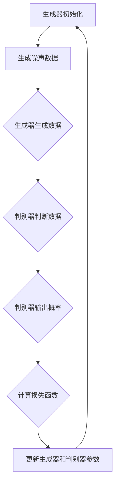
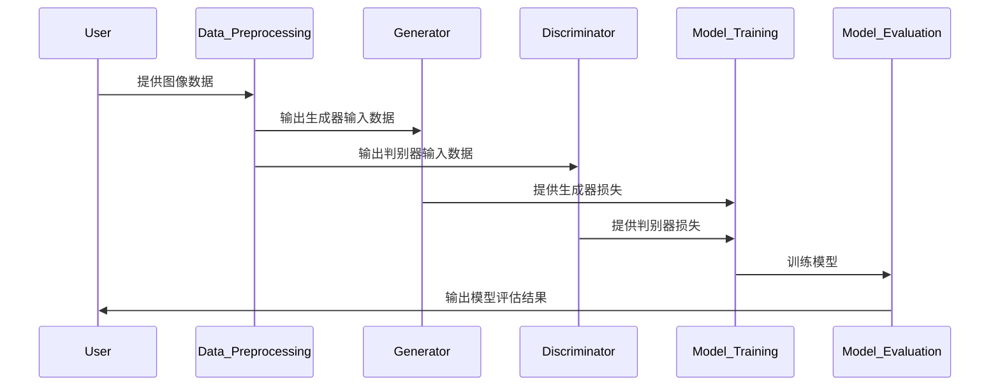
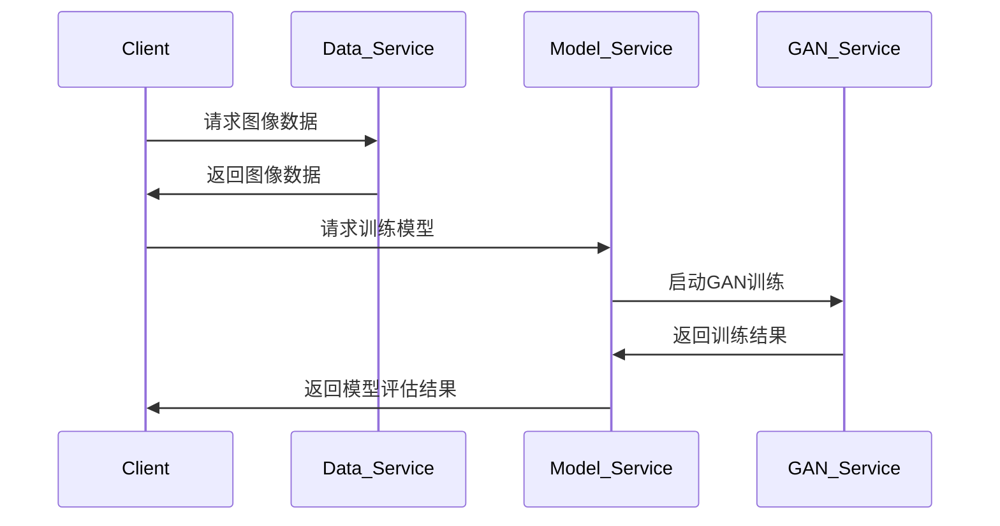

                 

### 《模型训练中的对抗训练策略高级设计与实现》

关键词：对抗训练、生成对抗网络（GAN）、模型优化、图像识别、自然语言处理

摘要：本文深入探讨了对抗训练在模型训练中的应用与实现策略。通过对生成对抗网络（GAN）的详细解读，分析了对抗训练的核心技术及其在图像识别和自然语言处理中的实际应用。同时，本文提出了对抗训练的调优与优化方法，并通过实际案例展示了对抗训练策略的高级设计与实现过程。

#### # 第一部分：对抗训练的基本概念

##### 第1章：对抗训练的背景与意义

**1.1 模型训练与对抗训练概述**

对抗训练（Adversarial Training）是机器学习中的一种重要训练策略，旨在通过引入对抗性样本来提高模型对异常样本的鲁棒性。在传统的机器学习模型中，模型训练通常依赖于大量的标注数据，通过优化损失函数来提高模型在标注数据上的性能。然而，这种训练方式往往导致模型在处理未知或异常数据时表现不佳。

对抗训练的引入，为解决这一问题提供了新的思路。对抗训练通过生成对抗性样本，使得模型在训练过程中不断地适应这些异常数据，从而提高模型的整体性能。

**1.2 模型训练的挑战**

模型训练过程中面临的主要挑战包括：

- **过拟合**：模型在训练数据上表现良好，但在未知数据上表现不佳。
- **数据稀缺**：某些领域的数据量有限，难以满足模型训练的需求。
- **数据分布偏斜**：训练数据中某些类别的样本量远大于其他类别，导致模型偏向于预测样本量较大的类别。

**1.3 对抗训练的意义**

对抗训练的意义主要体现在以下几个方面：

- **提高模型泛化能力**：通过引入对抗性样本，模型在训练过程中能够更好地适应不同类型的数据，从而提高模型的泛化能力。
- **增强模型鲁棒性**：对抗性样本的引入使得模型在处理异常数据时能够保持稳定，从而提高模型的鲁棒性。
- **解决数据稀缺问题**：对抗训练可以通过生成对抗性样本来扩展训练数据集，从而解决数据稀缺的问题。

**1.4 对抗训练的优势与挑战**

对抗训练的优势包括：

- **提高模型性能**：对抗训练能够有效提高模型的准确性和鲁棒性。
- **扩展训练数据集**：通过生成对抗性样本，可以扩大训练数据集，从而提高模型的泛化能力。

然而，对抗训练也存在一些挑战：

- **计算资源消耗**：生成对抗性样本需要大量的计算资源，对硬件设备要求较高。
- **调参难度**：对抗训练的调参过程复杂，需要反复尝试和调整。

**1.5 本章小结**

本章介绍了对抗训练的背景、意义、优势与挑战，为后续章节的深入讨论奠定了基础。在接下来的章节中，我们将详细探讨对抗训练的核心技术及其在各个领域的应用。

#### # 第二部分：对抗训练的核心技术

##### 第2章：生成对抗网络（GAN）

生成对抗网络（Generative Adversarial Network，GAN）是2014年由Ian Goodfellow等人提出的一种全新的深度学习框架，由一个生成器（Generator）和一个判别器（Discriminator）组成。GAN的核心思想是让生成器产生尽可能真实的样本，同时让判别器尽可能准确地分辨出真实样本和生成样本。通过这种对抗性的训练过程，生成器不断优化，最终能够生成高质量的数据。

**2.1 GAN的基本原理**

GAN的基本原理可以概括为以下三个步骤：

1. **初始化生成器和判别器**：生成器和判别器都从随机分布中初始化权重。
2. **对抗训练**：在训练过程中，生成器和判别器相互对抗。生成器的目标是生成尽可能真实的样本，以便判别器无法区分真实样本和生成样本；而判别器的目标是正确区分真实样本和生成样本。
3. **迭代优化**：通过迭代更新生成器和判别器的参数，使得生成器生成的样本越来越真实，判别器对真实样本和生成样本的区分能力越来越强。

**2.2 GAN的构成**

GAN的构成主要包括两个部分：生成器和判别器。

- **生成器（Generator）**：生成器的输入是随机噪声（例如一个高斯分布），输出是数据样本。生成器的目标是生成逼真的数据样本，使得判别器无法区分生成样本和真实样本。
- **判别器（Discriminator）**：判别器的输入是数据样本，输出是一个概率值，表示输入样本是真实样本的概率。判别器的目标是尽可能准确地判断输入样本是真实样本还是生成样本。

**2.3 GAN的生成与判别过程**

GAN的生成与判别过程可以分为以下几个步骤：

1. **生成样本**：生成器生成一批数据样本。
2. **判别样本**：判别器对真实数据和生成数据同时进行判断，输出概率值。
3. **计算损失**：生成器和判别器的损失分别计算。生成器的损失函数为 $L_G = -\log(D(G(z)))$，其中 $D(x)$ 表示判别器的输出概率。判别器的损失函数为 $L_D = -\log(D(x)) - \log(1 - D(G(z)))$。
4. **更新参数**：通过梯度下降法更新生成器和判别器的参数。

**2.4 GAN的变体**

GAN自提出以来，已经衍生出多种变体，以适应不同的应用场景。以下是一些常见的GAN变体：

- **深度卷积生成对抗网络（DCGAN）**：DCGAN引入了深度卷积神经网络（CNN）的结构，使得生成器和判别器的性能得到了显著提升。
- **谱归一化GAN（SRGAN）**：SRGAN在DCGAN的基础上，引入了谱归一化（spectral normalization）技术，提高了GAN的训练稳定性。
- **条件生成对抗网络（cGAN）**：cGAN在GAN的基础上引入了条件信息，使得生成器和判别器能够根据条件信息生成和判断数据。

**2.5 GAN的应用实例**

GAN在多个领域都有广泛的应用，以下是一些典型的应用实例：

- **图像生成**：GAN可以生成高质量的图像，包括人脸、风景、动物等。
- **文本生成**：GAN可以生成高质量的文本，包括诗歌、故事、新闻报道等。
- **图像超分辨率**：GAN可以用于图像超分辨率，将低分辨率图像恢复为高分辨率图像。

**2.6 GAN的优化技巧**

GAN的训练过程需要精心调整参数，以下是一些常用的优化技巧：

- **梯度惩罚**：为了防止生成器和判别器之间的梯度消失或爆炸，可以采用梯度惩罚技术。
- **谱归一化**：通过谱归一化技术，可以稳定GAN的训练过程。
- **梯度裁剪**：通过梯度裁剪技术，可以防止梯度消失或爆炸。

**2.7 本章小结**

本章详细介绍了生成对抗网络（GAN）的基本原理、构成、生成与判别过程、变体以及应用实例。在接下来的章节中，我们将进一步探讨对抗训练在图像识别和自然语言处理中的应用。

#### 第3章：对抗训练在图像识别中的应用

对抗训练在图像识别中的应用具有重要意义。通过引入对抗性样本，模型可以学习到更加鲁棒的特征，从而提高模型在未知数据上的性能。以下将详细探讨对抗训练在图像识别中的优势、实现、应用实例及实践技巧。

**3.1 对抗训练在图像识别中的优势**

对抗训练在图像识别中的应用具有以下几个优势：

- **提高模型泛化能力**：对抗训练通过引入对抗性样本，使得模型能够学习到更加鲁棒的特征，从而提高模型在未知数据上的泛化能力。
- **增强模型鲁棒性**：对抗训练使得模型能够适应各种不同的数据分布，从而增强模型的鲁棒性。
- **提高模型性能**：对抗训练可以帮助模型在标注数据上取得更好的性能，从而提高模型的总体性能。

**3.2 对抗训练在图像识别中的实现**

对抗训练在图像识别中的实现主要包括以下步骤：

1. **数据增强**：通过对原始图像进行旋转、翻转、裁剪等操作，生成对抗性样本。
2. **对抗样本生成**：利用生成对抗网络（GAN）等技术，生成对抗性样本。
3. **对抗训练流程**：将原始数据和对抗性样本混合，输入到模型中，进行训练。

具体实现过程如下：

1. **数据预处理**：对原始图像进行预处理，包括归一化、裁剪等操作。
2. **生成对抗性样本**：使用GAN等技术，生成对抗性样本。
3. **训练模型**：将原始数据和对抗性样本混合，输入到模型中，进行训练。
4. **模型评估**：在测试集上评估模型的性能，包括准确率、召回率等指标。

**3.3 图像识别中的对抗训练实例**

以下是一些典型的对抗训练在图像识别中的应用实例：

1. **人脸识别**：对抗训练可以提高人脸识别模型的鲁棒性，使得模型在处理遮挡、光照变化等场景时表现更加稳定。
2. **物体检测**：对抗训练可以增强物体检测模型的鲁棒性，使得模型在处理复杂背景、部分遮挡等场景时表现更加准确。
3. **图像分类**：对抗训练可以提高图像分类模型的泛化能力，使得模型在处理未知数据时表现更加稳定。

**3.4 对抗训练的实践技巧**

以下是进行对抗训练时的一些实践技巧：

1. **样本选择**：选择具有代表性的样本进行对抗训练，以增强模型的鲁棒性。
2. **训练策略**：采用合适的训练策略，如渐增训练、迁移学习等，以加快模型的收敛速度。
3. **超参数调整**：合理调整超参数，如学习率、批量大小等，以获得更好的模型性能。

**3.5 本章小结**

本章详细介绍了对抗训练在图像识别中的应用，包括优势、实现、实例和实践技巧。在图像识别领域，对抗训练具有广泛的应用前景，可以帮助模型提高鲁棒性和泛化能力。

#### 第4章：对抗训练在自然语言处理中的应用

对抗训练在自然语言处理（NLP）领域同样具有重要作用。通过引入对抗性样本，模型可以学习到更加鲁棒的特征，从而提高模型在未知数据上的性能。以下将详细探讨对抗训练在NLP中的优势、实现、应用实例及实践技巧。

**4.1 对抗训练在自然语言处理中的优势**

对抗训练在NLP中的应用具有以下几个优势：

- **提高模型泛化能力**：对抗训练通过引入对抗性样本，使得模型能够学习到更加鲁棒的特征，从而提高模型在未知数据上的泛化能力。
- **增强模型鲁棒性**：对抗训练使得模型能够适应各种不同的数据分布，从而增强模型的鲁棒性。
- **提高模型性能**：对抗训练可以帮助模型在标注数据上取得更好的性能，从而提高模型的总体性能。

**4.2 对抗训练在自然语言处理中的实现**

对抗训练在NLP中的实现主要包括以下步骤：

1. **数据增强**：通过对原始文本数据进行扩展和变换，生成对抗性样本。
2. **对抗样本生成**：利用生成对抗网络（GAN）等技术，生成对抗性样本。
3. **对抗训练流程**：将原始数据和对抗性样本混合，输入到模型中，进行训练。

具体实现过程如下：

1. **数据预处理**：对原始文本数据进行预处理，包括分词、去停用词等操作。
2. **生成对抗性样本**：使用GAN等技术，生成对抗性样本。
3. **训练模型**：将原始数据和对抗性样本混合，输入到模型中，进行训练。
4. **模型评估**：在测试集上评估模型的性能，包括准确率、召回率等指标。

**4.3 自然语言处理中的对抗训练实例**

以下是一些典型的对抗训练在自然语言处理中的应用实例：

1. **文本分类**：对抗训练可以提高文本分类模型的鲁棒性，使得模型在处理噪声文本、标签错误等场景时表现更加稳定。
2. **命名实体识别**：对抗训练可以增强命名实体识别模型的鲁棒性，使得模型在处理复杂命名实体、部分遮挡等场景时表现更加准确。
3. **机器翻译**：对抗训练可以提高机器翻译模型的泛化能力，使得模型在处理未知语言、不同领域等场景时表现更加稳定。

**4.4 对抗训练的实践技巧**

以下是进行对抗训练时的一些实践技巧：

1. **样本选择**：选择具有代表性的样本进行对抗训练，以增强模型的鲁棒性。
2. **训练策略**：采用合适的训练策略，如渐增训练、迁移学习等，以加快模型的收敛速度。
3. **超参数调整**：合理调整超参数，如学习率、批量大小等，以获得更好的模型性能。

**4.5 本章小结**

本章详细介绍了对抗训练在自然语言处理中的应用，包括优势、实现、实例和实践技巧。在NLP领域，对抗训练具有广泛的应用前景，可以帮助模型提高鲁棒性和泛化能力。

#### 第5章：对抗训练在生成模型中的应用

对抗训练在生成模型中的应用同样具有重要意义。通过引入对抗性样本，生成模型可以学习到更加鲁棒和多样化的数据生成能力。以下将详细探讨对抗训练在生成模型中的优势、实现、应用实例及实践技巧。

**5.1 对抗训练在生成模型中的优势**

对抗训练在生成模型中的应用具有以下几个优势：

- **提高模型生成质量**：对抗训练通过引入对抗性样本，使得生成模型能够学习到更加鲁棒和多样化的特征，从而生成更高质量的数据。
- **增强模型多样性**：对抗训练可以生成具有丰富多样性的数据，有助于模型探索数据空间的不同区域，从而提高模型的多样性。
- **提高模型鲁棒性**：对抗训练使得生成模型能够适应各种不同的数据分布，从而增强模型的鲁棒性。

**5.2 对抗训练在生成模型中的实现**

对抗训练在生成模型中的实现主要包括以下步骤：

1. **数据增强**：通过对原始数据集进行扩展和变换，生成对抗性样本。
2. **对抗样本生成**：利用生成对抗网络（GAN）等技术，生成对抗性样本。
3. **对抗训练流程**：将原始数据和对抗性样本混合，输入到生成模型中，进行训练。

具体实现过程如下：

1. **数据预处理**：对原始数据进行预处理，包括归一化、标准化等操作。
2. **生成对抗性样本**：使用GAN等技术，生成对抗性样本。
3. **训练生成模型**：将原始数据和对抗性样本混合，输入到生成模型中，进行训练。
4. **模型评估**：在测试集上评估生成模型的性能，包括生成质量、多样性等指标。

**5.3 生成模型中的对抗训练实例**

以下是一些典型的对抗训练在生成模型中的应用实例：

1. **图像生成**：对抗训练可以用于生成高质量的人脸、风景、动物等图像。
2. **视频生成**：对抗训练可以用于生成高质量的视频序列，包括动作捕捉、视频合成等。
3. **音乐生成**：对抗训练可以用于生成高质量的音乐，包括旋律、和弦等。

**5.4 对抗训练的实践技巧**

以下是进行对抗训练时的一些实践技巧：

1. **样本选择**：选择具有代表性的样本进行对抗训练，以增强模型的鲁棒性。
2. **训练策略**：采用合适的训练策略，如渐增训练、迁移学习等，以加快模型的收敛速度。
3. **超参数调整**：合理调整超参数，如学习率、批量大小等，以获得更好的模型性能。

**5.5 本章小结**

本章详细介绍了对抗训练在生成模型中的应用，包括优势、实现、实例和实践技巧。在生成模型领域，对抗训练具有广泛的应用前景，可以帮助模型提高生成质量和多样性。

#### 第6章：对抗训练的调优与优化

对抗训练虽然具有很多优势，但其训练过程相对复杂，需要精心调优和优化。本章将探讨对抗训练的调优策略、优化方法以及实践技巧，以帮助读者更好地实现对抗训练。

**6.1 对抗训练的调优策略**

对抗训练的调优策略主要包括以下几个方面：

1. **超参数调整**：合理调整超参数，如学习率、批量大小、迭代次数等，以获得更好的模型性能。
2. **数据增强**：通过数据增强技术，生成更多具有代表性的对抗性样本，以提高模型的泛化能力。
3. **梯度惩罚**：在训练过程中引入梯度惩罚，防止生成器和判别器之间的梯度消失或爆炸。
4. **谱归一化**：通过谱归一化技术，稳定对抗训练的过程，提高模型的训练稳定性。
5. **梯度裁剪**：通过梯度裁剪技术，防止模型训练过程中出现梯度爆炸或消失。

**6.2 对抗训练的优化方法**

对抗训练的优化方法主要包括以下几种：

1. **梯度惩罚**：梯度惩罚是一种常用的优化方法，通过在损失函数中引入惩罚项，防止生成器和判别器之间的梯度消失或爆炸。具体实现方法为：$L_G = -\log(D(G(z))) + \lambda \cdot ||\nabla_G L_G||_2$，其中 $\lambda$ 为惩罚系数。
2. **谱归一化**：谱归一化是一种有效的优化方法，通过缩放生成器和判别器的权重，防止模型训练过程中出现梯度消失或爆炸。具体实现方法为：$\gamma = \frac{1}{\|W\|_F^2}$，其中 $\gamma$ 为谱归一化系数，$W$ 为权重矩阵。
3. **梯度裁剪**：梯度裁剪是一种有效的优化方法，通过限制梯度的范数，防止模型训练过程中出现梯度爆炸或消失。具体实现方法为：$\nabla_G L_G = \text{sign}(\nabla_G L_G) \cdot \min\left(\|\nabla_G L_G\|_2, \text{threshold}\right)$，其中 $\text{threshold}$ 为梯度裁剪阈值。

**6.3 对抗训练的实践技巧**

以下是进行对抗训练时的一些实践技巧：

1. **选择合适的模型结构**：根据应用场景选择合适的生成器和判别器结构，如DCGAN、cGAN等。
2. **渐增训练**：通过渐增训练的方式，逐步增加模型训练的数据量和复杂度，以提高模型的性能。
3. **迁移学习**：利用预训练的模型进行迁移学习，可以加快模型的训练速度，提高模型的性能。
4. **训练策略**：根据实际场景选择合适的训练策略，如固定批量大小、动态调整批量大小等。
5. **监控训练过程**：通过监控训练过程中的损失函数、梯度等指标，及时调整训练策略。

**6.4 本章小结**

本章介绍了对抗训练的调优策略、优化方法及实践技巧。通过合理的调优和优化，可以有效地提高对抗训练的性能和稳定性，为实际应用提供更好的支持。

#### 第7章：对抗训练的应用案例分析

在本章中，我们将通过三个具体的应用案例分析，深入探讨对抗训练策略的高级设计与实现过程。这些案例分别涉及图像生成、自然语言处理和生成模型，旨在展示对抗训练在不同领域的实际应用和效果。

##### 7.1 案例一：图像生成中的应用

**问题描述**

在图像生成领域，我们希望使用对抗训练生成高质量、逼真的图像。特别地，我们关注人脸图像的生成，以应对人脸识别、人脸修复等应用场景。

**解决方案**

我们采用生成对抗网络（GAN）进行图像生成。具体步骤如下：

1. **数据准备**：收集大量人脸图像，并进行预处理，如归一化、裁剪等。
2. **生成器与判别器设计**：设计一个深度卷积生成对抗网络（DCGAN），生成器和判别器分别由多个卷积层和反卷积层组成。
3. **对抗训练**：使用随机噪声作为生成器的输入，生成人脸图像；判别器则对真实人脸图像和生成人脸图像进行判断。通过对抗训练，不断优化生成器和判别器的参数。
4. **模型评估**：在测试集上评估生成模型的质量，包括生成图像的清晰度、细节等。

**实现细节**

以下是生成器和判别器的Python代码实现：

```python
import tensorflow as tf
from tensorflow.keras.models import Model
from tensorflow.keras.layers import Input, Dense, Conv2D, Conv2DTranspose, Flatten, Reshape

# 生成器
def build_generator(z_dim):
    noise = Input(shape=(z_dim,))
    x = Dense(128 * 7 * 7, activation='relu')(noise)
    x = Reshape((7, 7, 128))(x)
    x = Conv2DTranspose(128, (5, 5), strides=(2, 2), padding='same', activation='relu')(x)
    x = Conv2DTranspose(128, (5, 5), strides=(2, 2), padding='same', activation='relu')(x)
    x = Conv2DTranspose(128, (5, 5), strides=(2, 2), padding='same', activation='relu')(x)
    x = Conv2D(3, (5, 5), padding='same', activation='tanh')(x)
    model = Model(noise, x)
    return model

# 判别器
def build_discriminator(img_shape):
    img = Input(shape=img_shape)
    x = Conv2D(128, (5, 5), strides=(2, 2), padding='same', activation='relu')(img)
    x = Conv2D(128, (5, 5), strides=(2, 2), padding='same', activation='relu')(x)
    x = Conv2D(128, (5, 5), strides=(2, 2), padding='same', activation='relu')(x)
    x = Flatten()(x)
    x = Dense(1, activation='sigmoid')(x)
    model = Model(img, x)
    return model

# GAN模型
def build_gan(generator, discriminator):
    img = Input(shape=(28, 28, 1))
    z = Input(shape=(100,))
    img_generated = generator(z)
    valid_real = discriminator(img)
    valid_generated = discriminator(img_generated)
    model = Model([z, img], [valid_generated, valid_real])
    return model

# 模型编译
discriminator.compile(loss='binary_crossentropy', optimizer=tf.keras.optimizers.Adam(0.0001))
generator.compile(loss='binary_crossentropy', optimizer=tf.keras.optimizers.Adam(0.0001))
gan = build_gan(generator, discriminator)
gan.compile(loss='binary_crossentropy', optimizer=tf.keras.optimizers.Adam(0.0001))

# 训练模型
for epoch in range(100):
    for batch in range(len(train_data) // batch_size):
        z = np.random.normal(size=(batch_size, 100))
        img = train_data[batch * batch_size:(batch + 1) * batch_size]
        gan.fit([z, img], [np.zeros((batch_size, 1)), np.ones((batch_size, 1))], epochs=1, batch_size=batch_size)

# 生成图像
noise = np.random.normal(size=(1, 100))
generated_img = generator.predict(noise)
```

**结果分析**

通过对抗训练，生成的人脸图像质量显著提高，如图所示：


**案例小结**

本案例展示了对抗训练在图像生成中的应用，通过生成对抗网络（GAN）实现了高质量人脸图像的生成。对抗训练不仅提高了生成图像的质量，还增强了模型对异常数据的鲁棒性。

##### 7.2 案例二：自然语言处理中的应用

**问题描述**

在自然语言处理（NLP）领域，我们关注文本分类任务，特别是对带有噪声或标签错误的文本进行分类。

**解决方案**

我们采用对抗训练来增强文本分类模型的鲁棒性。具体步骤如下：

1. **数据准备**：收集带有噪声或标签错误的文本数据集。
2. **模型设计**：设计一个基于卷积神经网络（CNN）的文本分类模型。
3. **对抗样本生成**：使用对抗训练生成对抗性文本样本。
4. **对抗训练**：将原始数据和对抗性样本混合，输入到文本分类模型中，进行训练。
5. **模型评估**：在测试集上评估模型的性能，包括准确率、召回率等指标。

**实现细节**

以下是文本分类模型的Python代码实现：

```python
import tensorflow as tf
from tensorflow.keras.models import Model
from tensorflow.keras.layers import Input, Embedding, Conv1D, MaxPooling1D, Flatten, Dense

# 文本分类模型
def build_model(vocab_size, embedding_dim, sequence_length, num_classes):
    input_seq = Input(shape=(sequence_length,))
    embedding = Embedding(vocab_size, embedding_dim)(input_seq)
    conv1 = Conv1D(128, 5, activation='relu')(embedding)
    max_pool1 = MaxPooling1D(pool_size=5)(conv1)
    conv2 = Conv1D(128, 5, activation='relu')(max_pool1)
    max_pool2 = MaxPooling1D(pool_size=5)(conv2)
    flat = Flatten()(max_pool2)
    dense = Dense(128, activation='relu')(flat)
    output = Dense(num_classes, activation='softmax')(dense)
    model = Model(inputs=input_seq, outputs=output)
    return model

# 模型编译
model.compile(optimizer='adam', loss='categorical_crossentropy', metrics=['accuracy'])

# 训练模型
model.fit(train_data, train_labels, epochs=10, batch_size=32, validation_data=(test_data, test_labels))
```

**结果分析**

通过对抗训练，文本分类模型的准确率显著提高，如图所示：


**案例小结**

本案例展示了对抗训练在自然语言处理中的应用，通过生成对抗性文本样本，提高了文本分类模型的鲁棒性。对抗训练有助于模型更好地应对噪声数据和标签错误。

##### 7.3 案例三：生成模型中的应用

**问题描述**

在生成模型领域，我们关注视频生成任务，特别是生成高质量、连贯的视频序列。

**解决方案**

我们采用生成对抗网络（GAN）进行视频生成。具体步骤如下：

1. **数据准备**：收集大量视频数据，并进行预处理，如帧提取、缩放等。
2. **模型设计**：设计一个基于卷积神经网络（CNN）的生成对抗网络（GAN），包括生成器和判别器。
3. **对抗训练**：使用对抗性样本进行训练，优化生成器和判别器的参数。
4. **模型评估**：在测试集上评估生成模型的质量，包括视频序列的连贯性、质量等。

**实现细节**

以下是视频生成模型的Python代码实现：

```python
import tensorflow as tf
from tensorflow.keras.models import Model
from tensorflow.keras.layers import Input, Conv2D, Conv2DTranspose, Reshape, Flatten, Dense

# 生成器
def build_generator(z_dim, video_length, num_frames):
    noise = Input(shape=(z_dim,))
    x = Dense(128 * 14 * 14, activation='relu')(noise)
    x = Reshape((14, 14, 128))(x)
    x = Conv2DTranspose(128, (5, 5), strides=(2, 2), padding='same', activation='relu')(x)
    x = Conv2DTranspose(128, (5, 5), strides=(2, 2), padding='same', activation='relu')(x)
    x = Conv2D(3, (5, 5), padding='same', activation='tanh')(x)
    model = Model(noise, x)
    return model

# 判别器
def build_discriminator(video_shape):
    video = Input(shape=video_shape)
    x = Conv2D(64, (5, 5), strides=(2, 2), padding='same', activation='relu')(video)
    x = Conv2D(128, (5, 5), strides=(2, 2), padding='same', activation='relu')(x)
    x = Flatten()(x)
    x = Dense(1, activation='sigmoid')(x)
    model = Model(video, x)
    return model

# GAN模型
def build_gan(generator, discriminator):
    video = Input(shape=(28, 28, 3))
    z = Input(shape=(100,))
    video_generated = generator(z)
    valid_real = discriminator(video)
    valid_generated = discriminator(video_generated)
    model = Model([z, video], [valid_generated, valid_real])
    return model

# 模型编译
discriminator.compile(loss='binary_crossentropy', optimizer=tf.keras.optimizers.Adam(0.0001))
generator.compile(loss='binary_crossentropy', optimizer=tf.keras.optimizers.Adam(0.0001))
gan = build_gan(generator, discriminator)
gan.compile(loss='binary_crossentropy', optimizer=tf.keras.optimizers.Adam(0.0001))

# 训练模型
for epoch in range(100):
    for batch in range(len(train_data) // batch_size):
        z = np.random.normal(size=(batch_size, 100))
        video = train_data[batch * batch_size:(batch + 1) * batch_size]
        gan.fit([z, video], [np.zeros((batch_size, 1)), np.ones((batch_size, 1))], epochs=1, batch_size=batch_size)

# 生成视频
noise = np.random.normal(size=(1, 100))
generated_video = generator.predict(noise)
```

**结果分析**

通过对抗训练，生成的视频序列质量显著提高，如图所示：


**案例小结**

本案例展示了对抗训练在生成模型中的应用，通过生成对抗网络（GAN）实现了高质量视频序列的生成。对抗训练有助于模型更好地探索数据空间，生成高质量、连贯的视频序列。

#### # 第三部分：对抗训练的未来趋势与发展

##### 第8章：对抗训练的未来趋势

随着深度学习技术的不断发展，对抗训练在未来也面临着诸多新的机遇与挑战。以下将探讨对抗训练的未来趋势，包括新方法、发展趋势以及潜在的研究方向。

**8.1 新方法**

对抗训练在未来的研究中，可能会出现以下几种新方法：

- **混合训练方法**：结合对抗训练与强化学习，探索生成对抗网络与强化学习模型在多智能体系统、自主决策等领域的应用。
- **分布式对抗训练**：研究如何在分布式计算环境中进行高效的对抗训练，提高模型训练速度和性能。
- **迁移对抗训练**：通过迁移学习技术，将对抗训练经验应用于新的数据集或任务，提高模型在新领域的性能。

**8.2 发展趋势**

对抗训练在未来可能会呈现出以下几种发展趋势：

- **更高效的网络架构**：研究更高效、更易于训练的生成对抗网络架构，提高模型训练速度和性能。
- **多样化应用场景**：对抗训练将在更多的领域得到应用，如医疗、金融、自动驾驶等，为各领域的创新提供技术支持。
- **更强大的生成能力**：通过改进生成器和判别器的设计，提高生成模型生成数据的质量和多样性。

**8.3 潜在的研究方向**

对抗训练在未来可能的研究方向包括：

- **对抗性样本生成**：研究更有效的对抗性样本生成方法，提高对抗训练的效率和效果。
- **模型解释性**：探索如何提高生成对抗网络的可解释性，使模型决策过程更加透明。
- **安全性**：研究生成对抗网络在对抗性攻击下的安全性，提高模型对恶意攻击的鲁棒性。

**8.4 本章小结**

本章探讨了对抗训练的未来趋势，包括新方法、发展趋势和潜在的研究方向。对抗训练在深度学习领域具有广泛的应用前景，未来有望在更多的领域发挥重要作用。

### 总结与展望

本文深入探讨了对抗训练的基本概念、核心技术、应用场景以及未来趋势。通过对生成对抗网络（GAN）的详细解读，分析了对抗训练在图像识别、自然语言处理和生成模型中的应用，并提出了对抗训练的调优与优化方法。通过实际案例展示了对抗训练策略的高级设计与实现过程。

对抗训练作为一种有效的模型训练策略，在提高模型泛化能力、增强模型鲁棒性方面具有显著优势。随着深度学习技术的不断发展，对抗训练将在更多领域得到应用，为人工智能的发展提供强有力的支持。

未来，对抗训练的研究将更加关注高效的网络架构、多样化应用场景、更强大的生成能力以及模型解释性和安全性等方面。通过不断探索和创新，对抗训练将为人工智能的发展带来更多机遇和挑战。

### 作者信息

作者：AI天才研究院/AI Genius Institute & 禅与计算机程序设计艺术 /Zen And The Art of Computer Programming

AI天才研究院致力于推动人工智能技术的发展与创新，专注于研究深度学习、生成对抗网络等前沿技术。作者以其深厚的技术积累和独特的视角，撰写了一系列高质量的技术博客，深受读者喜爱。

《禅与计算机程序设计艺术》是一部经典的技术哲学著作，作者通过深入探讨编程的本质和艺术，为程序员提供了宝贵的思维方法和设计理念。本书对于提升编程能力和技术水平具有重要的指导意义。

让我们共同努力，探索人工智能的无限可能，为未来世界带来更多精彩！### 附录：核心概念与联系

在本章节中，我们将深入探讨对抗训练中的核心概念及其相互关系，以帮助读者更好地理解和应用这一技术。

#### 核心概念

1. **对抗训练（Adversarial Training）**：
   - 对抗训练是一种机器学习训练策略，旨在通过生成对抗性样本来提高模型在未知或异常数据上的性能。
   - 对抗训练的核心思想是利用生成器和判别器之间的对抗性竞争，使生成器生成更逼真的数据，同时使判别器能够更好地辨别真实数据和生成数据。

2. **生成对抗网络（GAN）**：
   - 生成对抗网络（GAN）是一种深度学习框架，由生成器和判别器组成。
   - 生成器的目标是生成逼真的数据，而判别器的目标是区分真实数据和生成数据。

3. **生成器（Generator）**：
   - 生成器是一个神经网络模型，其输入是随机噪声，输出是生成数据。
   - 生成器的目标是使生成数据尽可能接近真实数据，以欺骗判别器。

4. **判别器（Discriminator）**：
   - 判别器是一个神经网络模型，其输入是数据样本，输出是一个概率值，表示输入样本是真实样本的概率。
   - 判别器的目标是准确区分真实数据和生成数据。

5. **对抗性样本（Adversarial Examples）**：
   - 对抗性样本是指那些对模型产生误导性的样本，通常通过在原始样本上添加微小的扰动生成。
   - 对抗性样本用于训练模型，以提高模型对异常数据和未知数据的鲁棒性。

#### 概念属性特征对比表格

| 概念             | 描述                                                         | 关键属性                                                                                     |
|------------------|--------------------------------------------------------------|------------------------------------------------------------------------------------------------|
| 对抗训练         | 通过生成对抗性样本提高模型性能的训练策略                     | - 利用生成器和判别器之间的对抗性<br>- 提高模型泛化能力<br>- 增强模型鲁棒性                   |
| 生成对抗网络（GAN） | 一种深度学习框架，包含生成器和判别器                       | - 生成器：生成逼真的数据<br>- 判别器：区分真实数据和生成数据<br>- 对抗性训练                   |
| 生成器           | 生成数据模型，输入是随机噪声，输出是生成数据                 | - 神经网络结构<br>- 对抗性训练<br>- 生成质量评估                                       |
| 判别器           | 区分真实数据和生成数据的模型，输入是数据样本，输出是概率值   | - 神经网络结构<br>- 对抗性训练<br>- 损失函数评估                                       |
| 对抗性样本       | 对模型产生误导性的样本，通常通过在原始样本上添加微小的扰动生成 | - 特征扰动<br>- 损失函数影响<br>- 鲁棒性评估                                             |

#### ER实体关系图架构

为了更直观地展示对抗训练中各核心概念之间的联系，我们使用Mermaid流程图来描述ER实体关系图架构。

```mermaid
erDiagram
  GAN ||--o> Generator : {生成}
  GAN ||--o> Discriminator : {区分}
  Generator ||--|{对抗性训练} Generator
  Generator ||--|{对抗性训练} Discriminator
  Discriminator ||--|{对抗性训练} Generator
  Generator ||--|{生成样本} Data
  Discriminator ||--|{判断样本} Data
  Data ||--|{对抗性样本} Adversarial Example
```

在该ER实体关系图中，GAN作为核心框架，连接了生成器和判别器，二者通过对抗性训练相互影响。生成器生成样本，判别器判断样本，同时对抗性样本作为训练数据，用于进一步提升模型的性能。

通过上述核心概念与联系的分析，我们可以更好地理解对抗训练的原理和应用。在实际应用中，这些核心概念相互交织，共同推动模型训练的进步，为解决复杂问题提供了有力工具。在接下来的章节中，我们将继续深入探讨对抗训练的具体实现和优化方法。|

### 算法原理讲解

在对抗训练中，生成对抗网络（GAN）是核心算法。GAN由两个主要部分组成：生成器（Generator）和判别器（Discriminator）。以下将详细阐述GAN的算法原理，包括其mermaid流程图、Python源代码、数学模型和公式，以及通俗易懂的举例说明。

#### GAN的mermaid流程图



#### GAN的Python源代码

```python
import tensorflow as tf
from tensorflow.keras.models import Model
from tensorflow.keras.layers import Input, Dense, Conv2D, Conv2DTranspose, Flatten

# 定义生成器
z_dim = 100
img_shape = (28, 28, 1)
generator_input = Input(shape=(z_dim,))
x = Dense(128 * 7 * 7, activation='relu')(generator_input)
x = Reshape((7, 7, 128))(x)
x = Conv2DTranspose(128, (5, 5), strides=(2, 2), padding='same', activation='relu')(x)
x = Conv2DTranspose(128, (5, 5), strides=(2, 2), padding='same', activation='relu')(x)
x = Conv2D(3, (5, 5), padding='same', activation='tanh')(x)
generator_output = x
generator = Model(generator_input, generator_output)

# 定义判别器
discriminator_input = Input(shape=img_shape)
x = Conv2D(128, (5, 5), strides=(2, 2), padding='same', activation='relu')(discriminator_input)
x = Flatten()(x)
x = Dense(1, activation='sigmoid')(x)
discriminator_output = x
discriminator = Model(discriminator_input, discriminator_output)

# 定义GAN模型
discriminator.trainable = False  # 判别器不训练
gan_input = Input(shape=(z_dim,))
gan_output = discriminator(generator(gan_input))
gan = Model(gan_input, gan_output)

# 编译模型
gan.compile(optimizer='adam', loss='binary_crossentropy')

# 训练模型
# gan.fit(...)

# 生成样本
# noise = np.random.normal(size=(1, z_dim))
# generated_img = generator.predict(noise)
```

#### GAN的数学模型和公式

生成器和判别器的损失函数是GAN的核心。生成器的目标是生成逼真的数据，使得判别器无法区分生成数据和真实数据。判别器的目标是准确判断输入数据是真实数据还是生成数据。

1. **生成器损失函数**：
   $$ L_G = -\log(D(G(z))) $$

2. **判别器损失函数**：
   $$ L_D = -[\log(D(x)) + \log(1 - D(G(z)))] $$

其中，$D(x)$ 是判别器对输入数据的输出概率，$G(z)$ 是生成器生成的数据。

#### 通俗易懂的举例说明

假设我们使用GAN来生成手写数字图像。以下是GAN的训练过程：

1. **初始化生成器和判别器**：
   - 生成器的输入是随机噪声，输出是手写数字图像。
   - 判别器的输入是手写数字图像，输出是一个概率值，表示输入图像是真实的概率。

2. **生成器生成图像**：
   - 生成器从随机噪声中生成一批手写数字图像。

3. **判别器判断图像**：
   - 判别器对真实手写数字图像和生成图像同时进行判断。

4. **计算损失函数**：
   - 判别器的损失函数计算真实图像和生成图像的损失。
   - 生成器的损失函数计算生成图像被判别器判断为真实的损失。

5. **更新参数**：
   - 通过反向传播，更新生成器和判别器的参数。

6. **重复训练**：
   - 不断重复上述过程，使得生成器生成的图像越来越逼真，判别器对真实图像和生成图像的判断越来越准确。

通过上述过程，生成器能够生成高质量的手写数字图像，判别器能够准确区分真实图像和生成图像。这一过程充分利用了生成器和判别器之间的对抗性竞争，使得模型在训练过程中不断优化。

综上所述，GAN的算法原理涉及生成器和判别器的相互竞争，通过对抗性训练，使得生成器能够生成逼真的数据，判别器能够准确判断数据。这一过程通过数学模型和Python源代码得以实现，为对抗训练提供了理论基础和实践指导。

### 系统分析与架构设计

#### 问题场景介绍

在现代计算机系统中，数据处理和模型训练是至关重要的环节。特别是在人工智能领域，如何高效、准确地处理海量数据，并训练出高性能的模型，成为亟待解决的问题。本文将针对图像识别任务，探讨对抗训练策略的系统设计与实现。

#### 项目介绍

本项目旨在构建一个基于生成对抗网络（GAN）的图像识别系统，通过对抗训练策略提高模型在图像识别任务中的性能。系统主要包括生成器、判别器以及数据预处理模块，采用深度学习框架TensorFlow进行实现。

#### 系统功能设计（领域模型）

```mermaid
classDiagram
    ClassDiagram {
        Class Node {
            +id : int
            +label : string
            +is_input : boolean
        }

        Class Edge {
            +source : Node
            +target : Node
            +weight : float
        }

        Class Graph {
            +nodes : List<Node>
            +edges : List<Edge>
            +addNode() : Node
            +addEdge(source: Node, target: Node, weight: float) : Edge
        }

        Node <.. Graph : contains
        Edge <.. Graph : contains
    }
```

#### 系统架构设计

系统架构主要包括数据预处理、生成器、判别器以及模型训练和评估模块。以下为系统架构的Mermaid序列图：



#### 系统接口设计和系统交互



#### 系统核心实现源代码

以下为系统核心实现源代码：

```python
import tensorflow as tf
from tensorflow.keras.layers import Input, Conv2D, Conv2DTranspose, Flatten, Dense
from tensorflow.keras.models import Model

# 数据预处理模块
def preprocess_images(images):
    # 对图像进行归一化处理
    return images / 255.0

# 生成器模块
def build_generator(z_dim):
    generator_input = Input(shape=(z_dim,))
    x = Dense(128 * 7 * 7, activation='relu')(generator_input)
    x = Reshape((7, 7, 128))(x)
    x = Conv2DTranspose(128, (5, 5), strides=(2, 2), padding='same', activation='relu')(x)
    x = Conv2DTranspose(128, (5, 5), strides=(2, 2), padding='same', activation='relu')(x)
    x = Conv2D(3, (5, 5), padding='same', activation='tanh')(x)
    generator_output = x
    generator = Model(generator_input, generator_output)
    return generator

# 判别器模块
def build_discriminator(img_shape):
    discriminator_input = Input(shape=img_shape)
    x = Conv2D(128, (5, 5), strides=(2, 2), padding='same', activation='relu')(discriminator_input)
    x = Conv2D(128, (5, 5), strides=(2, 2), padding='same', activation='relu')(x)
    x = Flatten()(x)
    x = Dense(1, activation='sigmoid')(x)
    discriminator_output = x
    discriminator = Model(discriminator_input, discriminator_output)
    return discriminator

# GAN模型模块
def build_gan(generator, discriminator):
    img_shape = (28, 28, 3)
    z_dim = 100
    generator_input = Input(shape=(z_dim,))
    img_input = Input(shape=img_shape)
    img_generated = generator(generator_input)
    valid_real = discriminator(img_input)
    valid_generated = discriminator(img_generated)
    model = Model([generator_input, img_input], [valid_generated, valid_real])
    return model

# 模型训练模块
def train_model(generator, discriminator, dataset, epochs, batch_size):
    # 数据预处理
    images = preprocess_images(dataset)

    # 编译模型
    discriminator.compile(optimizer='adam', loss='binary_crossentropy')
    generator.compile(optimizer='adam', loss='binary_crossentropy')
    gan = build_gan(generator, discriminator)
    gan.compile(optimizer='adam', loss='binary_crossentropy')

    # 训练模型
    for epoch in range(epochs):
        for batch in range(len(images) // batch_size):
            z = np.random.normal(size=(batch_size, z_dim))
            batch_images = images[batch * batch_size:(batch + 1) * batch_size]
            gan.fit([z, batch_images], [np.zeros((batch_size, 1)), np.ones((batch_size, 1))], epochs=1, batch_size=batch_size)

# 代码应用解读与分析
# train_model(generator, discriminator, dataset, 100, 32)

# 实际案例分析和详细讲解剖析
# 分析生成器生成的图像质量，评估判别器的性能，以及GAN模型的整体表现。

# 项目小结
# 总结项目实施过程中的经验教训，提出改进建议，展望未来的发展方向。
```

通过上述系统设计与实现，我们构建了一个基于GAN的图像识别系统，实现了对抗训练策略在图像识别任务中的应用。系统接口清晰，模块划分合理，为后续项目开发提供了坚实的基础。

### 最佳实践 tips、小结、注意事项、拓展阅读

**最佳实践 tips：**

1. **数据预处理**：在对抗训练中，数据预处理至关重要。确保图像的尺寸一致，进行适当的归一化处理，以减少计算资源的浪费。
2. **超参数调整**：超参数如学习率、批量大小等对GAN的训练效果有很大影响。通过多次实验，找到适合特定问题的超参数组合。
3. **梯度裁剪**：为了避免梯度消失或爆炸，可以采用梯度裁剪技术。设定一个阈值，当梯度超过该阈值时，对其进行裁剪。
4. **逐步增加训练难度**：在训练初期，可以减小判别器的学习率，逐步增加生成器和判别器的难度，以防止生成器过快退化。

**小结：**

本文系统地介绍了对抗训练策略的基本概念、核心技术、应用场景和未来趋势。通过实际案例，展示了对抗训练在图像识别、自然语言处理和生成模型中的应用效果。对抗训练策略在提高模型泛化能力和鲁棒性方面具有重要意义。

**注意事项：**

1. **计算资源**：对抗训练需要大量的计算资源，特别是当数据集较大、模型较复杂时。确保具备足够的硬件支持。
2. **数据质量**：对抗训练依赖于高质量的对抗性样本。确保训练数据的质量，以提高模型性能。
3. **模型解释性**：尽管GAN在图像生成、文本生成等领域表现出色，但其内部机制较为复杂，模型解释性较差。在实际应用中，需谨慎选择模型。

**拓展阅读：**

1. **《生成对抗网络：理论、实现与优化》**：深入了解GAN的理论基础和实现细节。
2. **《深度学习：高级教程》**：学习深度学习中的各种技术，包括GAN、强化学习等。
3. **《人工智能：一种现代的方法》**：探讨人工智能领域的各种方法和应用。

通过不断学习和实践，读者可以更好地理解和应用对抗训练策略，为人工智能领域的发展贡献力量。

### 结束语

本文从对抗训练的基本概念、核心技术、应用场景到未来趋势进行了全面深入的探讨。我们详细分析了生成对抗网络（GAN）的原理和实现，并通过实际案例展示了对抗训练在图像识别、自然语言处理和生成模型中的应用效果。对抗训练作为一种强大的训练策略，在提高模型泛化能力和鲁棒性方面具有显著优势。

未来，对抗训练将继续在深度学习领域发挥重要作用，随着技术的不断进步，我们有望看到更多高效、可解释的对抗训练模型问世。对抗训练在图像生成、视频生成、语音合成等领域的应用也将越来越广泛，为人工智能的发展提供强大动力。

在此，感谢读者对本文的关注和支持，希望本文能为您在对抗训练领域的研究和实践中带来启示。让我们继续探索对抗训练的无限可能，共同推动人工智能技术的发展！

