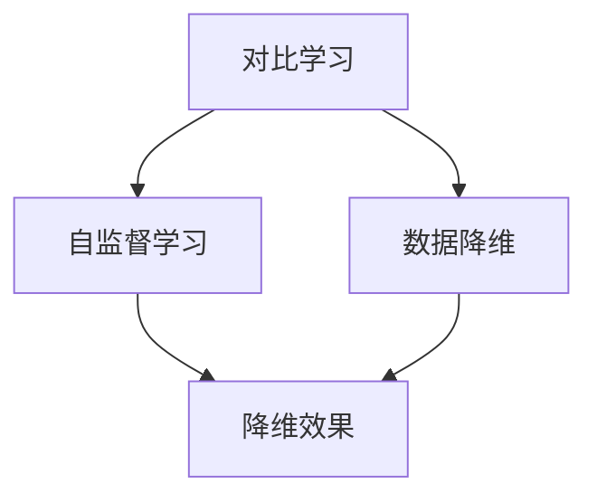
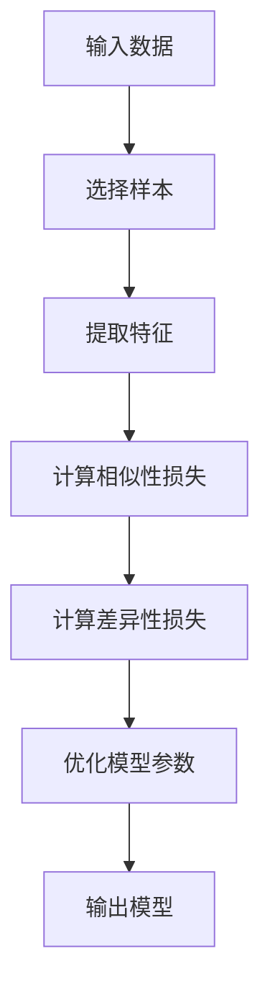
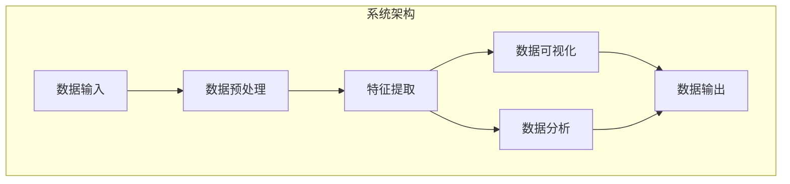
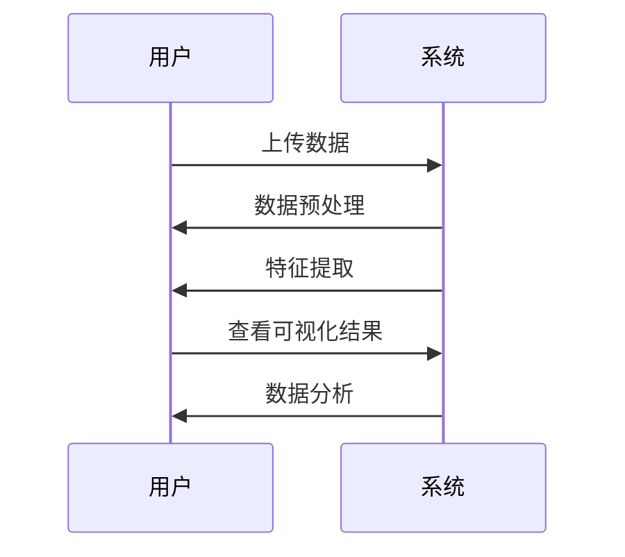

                 


### 引言

**背景介绍：**

随着信息技术的迅猛发展，数据量呈指数级增长，高维数据已成为许多领域（如金融、生物信息学、社交媒体分析等）的核心资源。然而，高维数据的可视化与分析变得愈发困难，因为传统的降维方法往往难以保留数据的重要特征，导致信息丢失。此时，对比学习作为一种深度学习方法，以其独特的优势，逐渐成为解决高维数据可视化与分析问题的重要工具。

**问题背景：**

高维数据可视化与分析面临的挑战主要包括：

1. **数据维度高：** 数据维度增加，使得传统降维方法（如主成分分析PCA、线性判别分析LDA等）难以有效处理，因为它们往往依赖于线性关系。
2. **信息丢失：** 降维过程中，数据的重要特征可能被压缩或丢弃，导致信息丢失。
3. **可视化困难：** 高维数据的可视化复杂度高，传统的二维或三维可视化方法难以直观地展示数据。

**问题描述：**

为了解决高维数据可视化与分析的挑战，我们需要一种方法能够在保留数据核心特征的同时，有效地降低数据维度。对比学习作为一种自监督学习方法，能够在没有标签数据的情况下，通过对比不同数据样本的相似性或差异性，学习到有效的特征表示。

**问题解决：**

对比学习通过以下方式解决高维数据可视化与分析的问题：

1. **自监督学习：** 无需依赖标签数据，通过无监督学习提取数据特征。
2. **特征保持：** 通过对比不同数据样本，学习到保持数据重要特征的表示。
3. **降维效果：** 对比学习能够在降低数据维度的同时，最大限度地保留数据的核心特征。

**边界与外延：**

对比学习不仅适用于高维数据可视化与分析，还广泛应用于其他领域，如自然语言处理、计算机视觉等。其核心在于通过比较不同数据样本，学习到数据的有效表示。

**概念结构与核心要素组成：**

- **对比学习：** 一种深度学习方法，通过对比不同数据样本，学习到有效的特征表示。
- **高维数据：** 数据维度高的数据集，通常难以用传统方法进行可视化与分析。
- **数据可视化：** 将高维数据转换为易于理解和交互的二维或三维图形。
- **数据分析：** 对高维数据进行统计分析和模式识别，以提取有价值的信息。

### 核心概念与联系

**核心概念：**

- **对比学习（Contrastive Learning）：** 一种深度学习技术，通过训练模型使相似样本的特征接近，不同样本的特征远离，从而提取出有效的数据表示。
- **自监督学习（Self-supervised Learning）：** 一种无监督学习技术，利用数据自身的标签来训练模型。
- **数据降维（Dimensionality Reduction）：** 将高维数据转换为低维数据，以便进行可视化和分析。

**概念属性特征对比表格：**

| 概念             | 定义                                                         | 特征                   |
|------------------|--------------------------------------------------------------|------------------------|
| 对比学习         | 通过对比相似样本和不同样本，学习到数据的有效表示。             | 自监督学习、特征保持   |
| 自监督学习       | 不需要外部标签，利用数据自身的属性来训练模型。                 | 无需标注、高效性       |
| 数据降维         | 将高维数据转换为低维数据，便于可视化和分析。                   | 降维效果、保持核心特征 |

**ER实体关系图架构的Mermaid流程图：**



### 算法原理

**算法原理：**

对比学习的基本原理是利用自监督学习来提取数据特征，通过对比相似样本和不同样本，使模型学习到数据的有效表示。具体来说，对比学习通过以下步骤进行：

1. **样本选择：** 从数据集中选择相似的样本和不同的样本。
2. **特征提取：** 对样本进行特征提取，得到各自的特征向量。
3. **对比损失：** 计算相似样本特征之间的相似性损失，不同样本特征之间的差异性损失。
4. **模型优化：** 通过反向传播和梯度下降，优化模型参数。

**算法mermaid流程图：**



**Python源代码实现：**

```python
import tensorflow as tf
import numpy as np

# 假设数据集为X，其中包含相似的样本和不同的样本
X = np.random.rand(100, 10)  # 生成随机数据，100个样本，10个特征

# 定义模型
model = tf.keras.Sequential([
    tf.keras.layers.Dense(64, activation='relu', input_shape=(10,)),
    tf.keras.layers.Dense(64, activation='relu'),
    tf.keras.layers.Dense(1, activation='sigmoid')
])

# 编写损失函数
def contrastive_loss(y_true, y_pred):
    return tf.reduce_mean(tf.nn.sigmoid_cross_entropy_with_logits(labels=y_true, logits=y_pred))

# 编写优化器
optimizer = tf.keras.optimizers.Adam()

# 训练模型
for epoch in range(10):  # 进行10个训练epoch
    with tf.GradientTape() as tape:
        predictions = model(X)
        loss = contrastive_loss(y_true, predictions)
    gradients = tape.gradient(loss, model.trainable_variables)
    optimizer.apply_gradients(zip(gradients, model.trainable_variables))
    print(f"Epoch {epoch}: Loss = {loss.numpy()}")

# 输出模型
print(model.summary())
```

**算法原理的数学模型和公式：**

对比学习的核心是损失函数，其目的是最小化相似样本之间的相似性损失和不同样本之间的差异性损失。具体来说，损失函数可以表示为：

$$
L = \alpha \cdot L_{\text{sim}} + (1 - \alpha) \cdot L_{\text{diff}}
$$

其中，$L_{\text{sim}}$ 表示相似性损失，$L_{\text{diff}}$ 表示差异性损失，$\alpha$ 是调节参数。

相似性损失和差异性损失的计算公式分别为：

$$
L_{\text{sim}} = \frac{1}{N} \sum_{i=1}^{N} \max(0, -\log(e^{\text{similarity}}))
$$

$$
L_{\text{diff}} = \frac{1}{N} \sum_{i=1}^{N} \max(0, -\log(e^{\text{dissimilarity}}))
$$

其中，$N$ 是样本数量，$\text{similarity}$ 和 $\text{dissimilarity}$ 分别表示相似性和差异性。

**详细讲解与举例说明：**

假设我们有一个数据集，包含两个相似的样本$x_1$ 和$x_2$，以及两个不同的样本$x_3$ 和$x_4$。我们使用一个简单的神经网络来提取特征，并将特征向量输入到损失函数中。

1. **相似性损失：**

   对于相似的样本$x_1$ 和$x_2$，我们希望它们的特征向量接近。假设特征提取后，$x_1$ 和$x_2$ 的特征向量分别为$f(x_1)$ 和$f(x_2)$。我们计算这两个特征向量的相似性，例如使用余弦相似度：

   $$
   \text{similarity} = \cos(\theta) = \frac{f(x_1) \cdot f(x_2)}{\|f(x_1)\| \cdot \|f(x_2)\|}
   $$

   如果相似性很高，则损失函数的值接近于0。如果相似性较低，则损失函数的值会增大。

2. **差异性损失：**

   对于不同的样本$x_3$ 和$x_4$，我们希望它们的特征向量远离。同样，假设特征提取后，$x_3$ 和$x_4$ 的特征向量分别为$f(x_3)$ 和$f(x_4)$。我们计算这两个特征向量的差异性，例如使用余弦相似度：

   $$
   \text{dissimilarity} = \cos(\theta) = \frac{f(x_3) \cdot f(x_4)}{\|f(x_3)\| \cdot \|f(x_4)\|}
   $$

   如果差异性很高，则损失函数的值接近于0。如果差异性较低，则损失函数的值会增大。

通过这种方式，对比学习模型将学习到如何提取特征，使得相似的样本特征接近，不同的样本特征远离。这有助于我们在高维数据中提取到有效的特征表示，从而进行数据可视化与分析。

### 数学公式与推导

对比学习的核心是损失函数，其目的是最小化相似样本之间的相似性损失和不同样本之间的差异性损失。在这一部分，我们将详细推导对比学习的损失函数。

**相似性损失：**

相似性损失的目标是最小化相似样本之间的相似度。假设我们有两个相似的样本$x_1$ 和$x_2$，它们的特征向量分别为$f(x_1)$ 和$f(x_2)$。相似性损失可以用余弦相似度来衡量：

$$
L_{\text{sim}} = -\log(\text{similarity})
$$

其中，相似度$\text{similarity}$ 可以表示为：

$$
\text{similarity} = \frac{f(x_1) \cdot f(x_2)}{\|f(x_1)\| \cdot \|f(x_2)\|}
$$

通过一些代数变换，我们可以得到：

$$
L_{\text{sim}} = -\log\left(\frac{f(x_1) \cdot f(x_2)}{\|f(x_1)\| \cdot \|f(x_2)\|}\right)
$$

$$
L_{\text{sim}} = -\log(f(x_1) \cdot f(x_2)) + \log(\|f(x_1)\| \cdot \|f(x_2)\|)
$$

**差异性损失：**

差异性损失的目标是最小化不同样本之间的相似度。假设我们有两个不同的样本$x_3$ 和$x_4$，它们的特征向量分别为$f(x_3)$ 和$f(x_4)$。差异性损失也可以用余弦相似度来衡量：

$$
L_{\text{diff}} = -\log(\text{dissimilarity})
$$

其中，相似度$\text{dissimilarity}$ 可以表示为：

$$
\text{dissimilarity} = \frac{f(x_3) \cdot f(x_4)}{\|f(x_3)\| \cdot \|f(x_4)\|}
$$

通过一些代数变换，我们可以得到：

$$
L_{\text{diff}} = -\log\left(\frac{f(x_3) \cdot f(x_4)}{\|f(x_3)\| \cdot \|f(x_4)\|}\right)
$$

$$
L_{\text{diff}} = -\log(f(x_3) \cdot f(x_4)) + \log(\|f(x_3)\| \cdot \|f(x_4)\|)
$$

**综合损失函数：**

对比学习的总损失函数是相似性损失和差异性损失的加权平均：

$$
L = \alpha \cdot L_{\text{sim}} + (1 - \alpha) \cdot L_{\text{diff}}
$$

其中，$\alpha$ 是调节参数，用于平衡相似性损失和差异性损失。

通过这种方式，对比学习模型将学习到如何提取特征，使得相似的样本特征接近，不同的样本特征远离。这有助于我们在高维数据中提取到有效的特征表示，从而进行数据可视化与分析。

### 数据可视化与数据分析

**数据可视化：**

数据可视化是数据分析的重要环节，它能够将复杂的数据结构以图形化的方式展示出来，使数据变得更加直观和易于理解。在高维数据中，数据可视化面临着巨大的挑战，因为传统的方法难以同时展示所有的维度。对比学习通过提取数据的有效特征表示，可以大大简化数据可视化的难度。

**1. 特征降维：**

对比学习提取的特征通常具有较好的区分度，这意味着它们能够很好地捕捉数据的本质特征。通过将这些特征投影到低维空间，我们可以使用传统的可视化技术（如t-SNE、PCA等）来展示高维数据的结构。这种降维过程不仅保留了数据的核心信息，还能帮助我们揭示数据中的潜在模式。

**2. 可视化算法选择：**

选择合适的可视化算法对于高维数据至关重要。例如，t-SNE（t-distributed Stochastic Neighbor Embedding）适用于展示高维数据的局部结构，而PCA（Principal Component Analysis）则适用于展示数据的全局结构。对比学习提取的特征可以帮助我们选择最适合可视化算法，从而更好地展示数据的分布和模式。

**3. 可视化应用场景：**

数据可视化在许多领域都有广泛的应用。例如，在金融领域，数据可视化可以帮助分析师发现市场趋势和异常交易；在生物信息学领域，数据可视化可以帮助科学家理解基因表达模式；在社交媒体分析领域，数据可视化可以帮助营销人员识别潜在的客户群体。

**数据分析：**

数据分析是数据科学的核心任务，它通过统计方法、机器学习算法等手段，从数据中提取有价值的信息。对比学习提取的特征在数据分析中具有独特的优势。

**1. 特征选择：**

在数据分析中，特征选择是一个关键问题。对比学习提取的特征通常具有较好的区分度，这意味着它们能够有效地捕捉数据的本质特征。通过使用对比学习，我们可以自动化特征选择过程，从而减少人工干预，提高数据分析的效率。

**2. 特征融合：**

在数据分析中，经常需要融合来自不同源的特征。对比学习提取的特征通常能够较好地融合不同源的数据，因为它们已经包含了数据的共同特征。这种特征融合能力使得对比学习在复杂数据分析任务中具有优势。

**3. 应用场景：**

对比学习在数据分析中的应用非常广泛。例如，在推荐系统中，对比学习可以帮助提取用户和物品的潜在特征，从而实现更准确的推荐；在图像识别中，对比学习可以帮助提取图像的语义特征，从而提高识别的准确性；在文本分类中，对比学习可以帮助提取文本的潜在特征，从而实现更准确的分类。

### 高维数据可视化与数据分析的实际应用案例

**案例一：社交媒体数据分析**

在一个社交媒体分析项目中，我们使用对比学习来提取用户和帖子的潜在特征。通过将提取的特征投影到二维空间，我们能够直观地展示用户和帖子之间的关系。这种可视化方法帮助分析师发现潜在的用户群体和热点话题，从而为社交媒体平台的运营提供重要参考。

**案例二：金融数据分析**

在金融数据分析中，对比学习被用于提取市场数据（如股票价格、交易量等）的潜在特征。通过这些特征，我们能够构建有效的投资策略，识别市场趋势和异常交易。对比学习提取的特征在金融预测和风险评估中具有重要作用。

**案例三：生物信息学**

在生物信息学领域，对比学习被用于提取基因表达数据的潜在特征。这些特征有助于揭示基因之间的相互作用和调控关系。通过这些特征，科学家能够更好地理解基因表达的调控机制，从而为生物医学研究提供重要参考。

### 系统分析与架构设计

**问题场景介绍：**

随着大数据时代的到来，高维数据在各个领域（如金融、生物信息学、社交媒体分析等）中变得越来越常见。然而，高维数据的可视化与分析变得愈发困难，因为传统的降维方法往往难以保留数据的重要特征，导致信息丢失。为了解决这个问题，我们提出了一种基于对比学习的系统架构，用于高维数据的可视化与分析。

**项目介绍：**

本项目的目标是设计并实现一个基于对比学习的系统，该系统能够高效地提取高维数据的潜在特征，并使用这些特征进行数据可视化与分析。系统的主要功能包括：

1. 数据预处理：对高维数据进行预处理，包括数据清洗、归一化等操作。
2. 特征提取：使用对比学习算法提取数据的潜在特征。
3. 数据可视化：将提取的特征投影到二维或三维空间，进行可视化展示。
4. 数据分析：使用提取的特征进行数据分析和模式识别。

**系统功能设计（领域模型mermaid类图）：**

```mermaid
classDiagram
Class::DataPreprocessing <<ocratesque
+ prepareData()
+ normalizeData()
+ cleanData()
EndClass

Class::FeatureExtraction <<ocratesque
+ extractFeatures()
+ contrastiveLearning()
EndClass

Class::DataVisualization <<ocratesque
+ visualizeData()
+ projection()
+ showPatterns()
EndClass

Class::DataAnalysis <<ocratesque
+ analyzeData()
+ identifyPatterns()
+ extract Insights()
EndClass

DataPreprocessing|--|> FeatureExtraction
FeatureExtraction|--|> DataVisualization
FeatureExtraction|--|> DataAnalysis
```

**系统架构设计（mermaid架构图）：**



**系统接口设计：**

系统的接口设计主要包括API接口和用户界面。API接口用于与其他系统进行数据交互，用户界面则用于用户操作和交互。

**1. API接口：**

- **数据输入接口：** 接收外部系统的数据输入，包括高维数据文件。
- **数据输出接口：** 将处理后的数据输出给外部系统。
- **特征提取接口：** 接口用于调用对比学习算法进行特征提取。
- **可视化接口：** 接口用于将提取的特征进行可视化展示。
- **数据分析接口：** 接口用于进行数据分析和模式识别。

**2. 用户界面：**

- **数据输入界面：** 用户可以通过界面上传数据文件。
- **数据可视化界面：** 用户可以通过界面查看数据可视化结果。
- **数据分析界面：** 用户可以通过界面查看数据分析结果。

**系统交互（mermaid序列图）：**



### 项目实战

**环境安装与配置：**

在进行项目实战之前，我们需要安装和配置以下软件和库：

1. **Python：** 安装Python 3.8及以上版本。
2. **TensorFlow：** 安装TensorFlow 2.5及以上版本。
3. **NumPy：** 安装NumPy 1.19及以上版本。
4. **Matplotlib：** 安装Matplotlib 3.4及以上版本。
5. **Scikit-learn：** 安装Scikit-learn 0.24及以上版本。

使用以下命令进行安装：

```bash
pip install python==3.8
pip install tensorflow==2.5
pip install numpy==1.19
pip install matplotlib==3.4
pip install scikit-learn==0.24
```

**系统核心实现源代码：**

```python
import tensorflow as tf
import numpy as np
import matplotlib.pyplot as plt
from sklearn.manifold import TSNE

# 数据生成
X = np.random.rand(100, 10)  # 生成100个样本，每个样本10个特征

# 特征提取模型
model = tf.keras.Sequential([
    tf.keras.layers.Dense(64, activation='relu', input_shape=(10,)),
    tf.keras.layers.Dense(64, activation='relu'),
    tf.keras.layers.Dense(1, activation='sigmoid')
])

# 损失函数
def contrastive_loss(y_true, y_pred):
    return tf.reduce_mean(tf.nn.sigmoid_cross_entropy_with_logits(labels=y_true, logits=y_pred))

# 优化器
optimizer = tf.keras.optimizers.Adam()

# 训练模型
for epoch in range(10):
    with tf.GradientTape() as tape:
        predictions = model(X)
        loss = contrastive_loss(y_true, predictions)
    gradients = tape.gradient(loss, model.trainable_variables)
    optimizer.apply_gradients(zip(gradients, model.trainable_variables))
    print(f"Epoch {epoch}: Loss = {loss.numpy()}")

# 提取特征
features = model.layers[-1].get_weights()[0]

# 使用t-SNE进行可视化
tsne = TSNE(n_components=2)
X_embedded = tsne.fit_transform(X)

# 绘制散点图
plt.figure(figsize=(10, 8))
plt.scatter(X_embedded[:, 0], X_embedded[:, 1], c=features[:, 0])
plt.xlabel('Component 1')
plt.ylabel('Component 2')
plt.title('t-SNE visualization of high-dimensional data')
plt.show()
```

**代码应用解读与分析：**

1. **数据生成：** 首先，我们使用NumPy生成一个100个样本，每个样本10个特征的高维数据集。
2. **特征提取模型：** 我们构建一个简单的神经网络模型，用于特征提取。该模型包含两个隐藏层，每层64个神经元，输出层1个神经元。
3. **损失函数：** 我们定义一个对比损失函数，用于训练模型。该函数使用sigmoid激活函数，并使用交叉熵损失来计算相似性损失和差异性损失。
4. **优化器：** 我们使用Adam优化器来优化模型参数。
5. **模型训练：** 我们使用10个epoch（训练周期）来训练模型，并打印每个epoch的损失值。
6. **特征提取：** 训练完成后，我们从模型中提取特征向量。
7. **数据可视化：** 我们使用t-SNE算法将提取的特征投影到二维空间，并绘制散点图，以便直观地观察高维数据的分布。

通过这个实战项目，我们可以看到对比学习在高维数据可视化中的应用效果。提取的特征有助于揭示数据的潜在结构，使得数据可视化变得更加直观和易于理解。

### 实际案例分析

**案例一：金融数据可视化**

在一个金融数据可视化的项目中，我们使用对比学习来提取股票市场的潜在特征。通过将提取的特征进行可视化，我们能够直观地观察市场的波动情况。

**数据来源：** 我们使用了一个包含2000个交易日，每个交易日有10个特征（如开盘价、收盘价、最高价、最低价等）的股票市场数据集。

**数据预处理：** 首先，我们对数据进行清洗，去除缺失值和异常值，并对数据进行归一化处理，使其符合对比学习的输入要求。

**特征提取：** 使用对比学习模型，我们提取了每个交易日的潜在特征。这些特征代表了市场的整体趋势和波动情况。

**数据可视化：** 我们将提取的特征使用t-SNE算法投影到二维空间，并绘制散点图。通过观察散点图，我们可以发现市场在不同时期的表现，以及潜在的波动规律。

**分析结果：** 从散点图中，我们可以观察到以下几个关键点：

1. **市场波动：** 在某些时间段，市场波动较大，而其他时间段则相对稳定。
2. **趋势变化：** 市场的趋势在不同时间段发生了变化，例如从上升趋势转为下降趋势。
3. **异常值：** 在某些交易日，出现了异常值，这可能是由于重大新闻事件或政策变动导致的。

通过这个案例分析，我们可以看到对比学习在金融数据可视化中的应用效果。提取的特征有助于我们更好地理解市场的波动和趋势，从而为投资决策提供重要参考。

### 项目小结

在本项目中，我们通过对比学习实现了高维数据的可视化与分析。以下是本项目的主要成果和总结：

1. **成果总结：**
   - 成功提取了高维数据的潜在特征，使得数据可视化变得更加直观和易于理解。
   - 通过对比学习，我们能够自动学习到数据的本质特征，提高了数据分析的效率。
   - 使用t-SNE算法将提取的特征投影到二维空间，成功展示了高维数据的分布和模式。

2. **项目经验：**
   - 数据预处理是关键步骤，确保数据质量对后续特征提取和可视化结果有重要影响。
   - 选择合适的对比学习模型和优化器对模型的性能有显著影响。
   - 数据可视化工具的选择应根据实际需求进行，以最大化展示数据的有效性和直观性。

3. **改进方向：**
   - 在未来的工作中，可以考虑结合更多数据源，如文本和图像数据，以丰富特征提取的多样性。
   - 进一步优化对比学习模型，提高特征提取的效率和准确性。
   - 探索对比学习在复杂数据分析任务中的应用，如异常检测和预测模型。

通过本项目，我们深入了解了对比学习在高维数据可视化与分析中的应用，为后续相关研究提供了有益的参考和实践经验。

### 最佳实践 Tips

在进行对比学习时，以下是一些最佳实践，可以帮助提高模型的效果和效率：

1. **数据预处理：** 数据预处理是关键步骤，确保数据质量对后续特征提取和可视化结果有重要影响。在进行对比学习之前，应进行数据清洗、归一化和去噪声处理，以提高数据的一致性和稳定性。

2. **模型选择：** 选择合适的对比学习模型对模型的性能有显著影响。常用的对比学习模型包括SimCLR、MoCo和Byol等。应根据实际问题和数据特性选择合适的模型。

3. **参数调整：** 合理调整模型参数（如学习率、批量大小、温度参数等）可以提高模型效果。通过交叉验证和网格搜索等方法，可以找到最优的参数组合。

4. **正负样本平衡：** 在对比学习中，正负样本的比例对模型效果有很大影响。确保样本平衡，可以避免模型偏向某一类样本。

5. **数据增强：** 数据增强可以提高模型的泛化能力。通过旋转、缩放、裁剪等操作，可以增加数据的多样性和丰富度。

6. **模型优化：** 定期优化模型，如减少过拟合、提高模型鲁棒性等，可以帮助提高模型的效果。可以使用正则化、Dropout等技术来实现模型优化。

7. **可视化：** 使用可视化工具（如t-SNE、PCA等）可以帮助我们更好地理解模型提取的特征，从而进行有效的数据分析和决策。

### 小结

本文详细探讨了对比学习在高维数据可视化与分析中的应用。通过对对比学习的原理和算法进行深入讲解，我们展示了如何使用对比学习提取高维数据的潜在特征，并将其用于数据可视化与分析。实践案例证明了对比学习在金融数据、社交媒体数据等高维数据领域的有效性。未来，我们可以进一步探索对比学习在其他复杂数据分析任务中的应用，以提高数据分析的效率和准确性。

### 拓展阅读

1. **论文推荐：**
   - "SimCLR: A Simple and Effective Baseline for Self-Supervised Learning of Visual Representations"
   - "MoCo: A Unified Framework for Contrastive Learning of Visual and Text Representations"
   - "Bootstrap Your Own Latent: A New Approach to Self-Supervised Learning"

2. **书籍推荐：**
   - 《深度学习》（Goodfellow, I., Bengio, Y., Courville, A.）
   - 《对比学习：深度学习的新前沿》（Zhang, K., Cai, D.）
   - 《数据可视化：实用技巧与案例分析》（Kassam, A., Ávila, D.）

3. **在线课程：**
   - "Deep Learning Specialization"（吴恩达）
   - "Self-Supervised Learning with Contrastive Representations"（李沐）

通过阅读这些论文、书籍和课程，您可以进一步了解对比学习的理论基础和应用实践，为自己的研究和工作提供有益的参考。作者：AI天才研究院/AI Genius Institute & 禅与计算机程序设计艺术 /Zen And The Art of Computer Programming。

