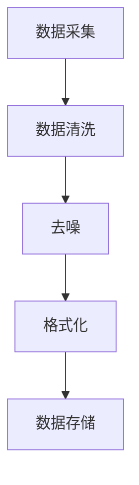
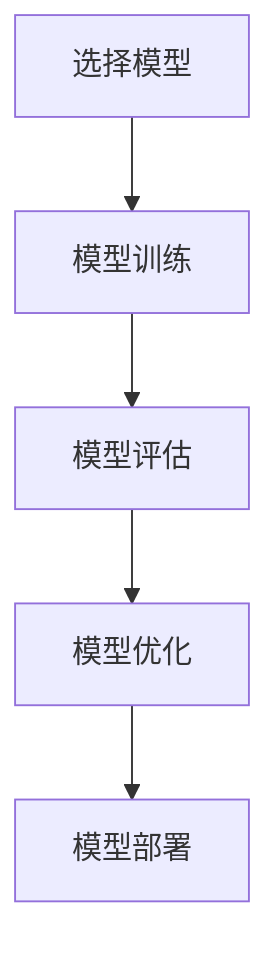
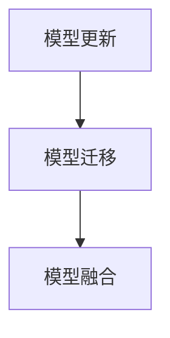
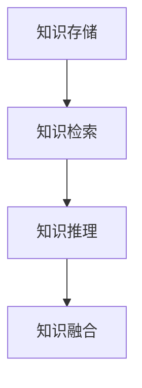
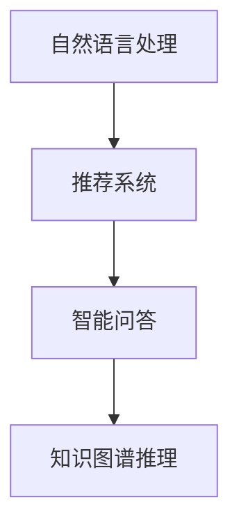
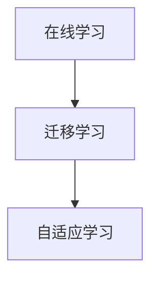
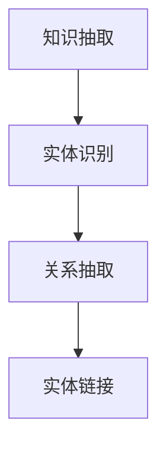
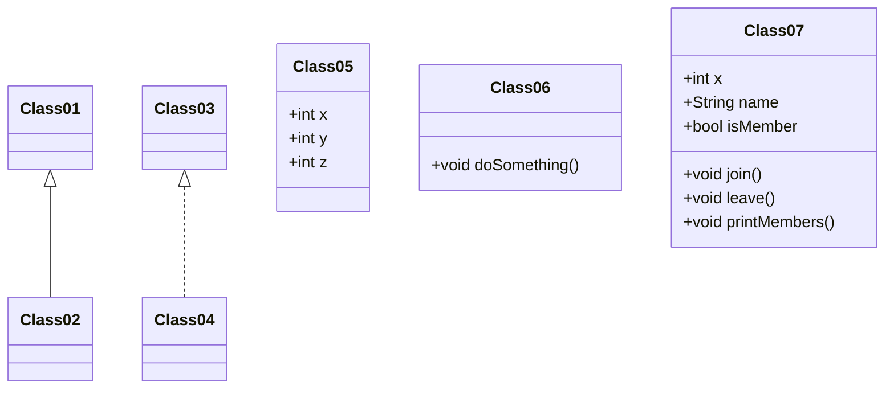
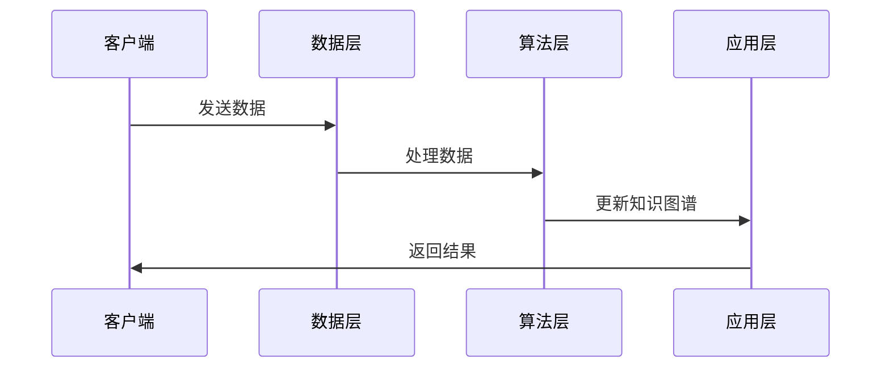
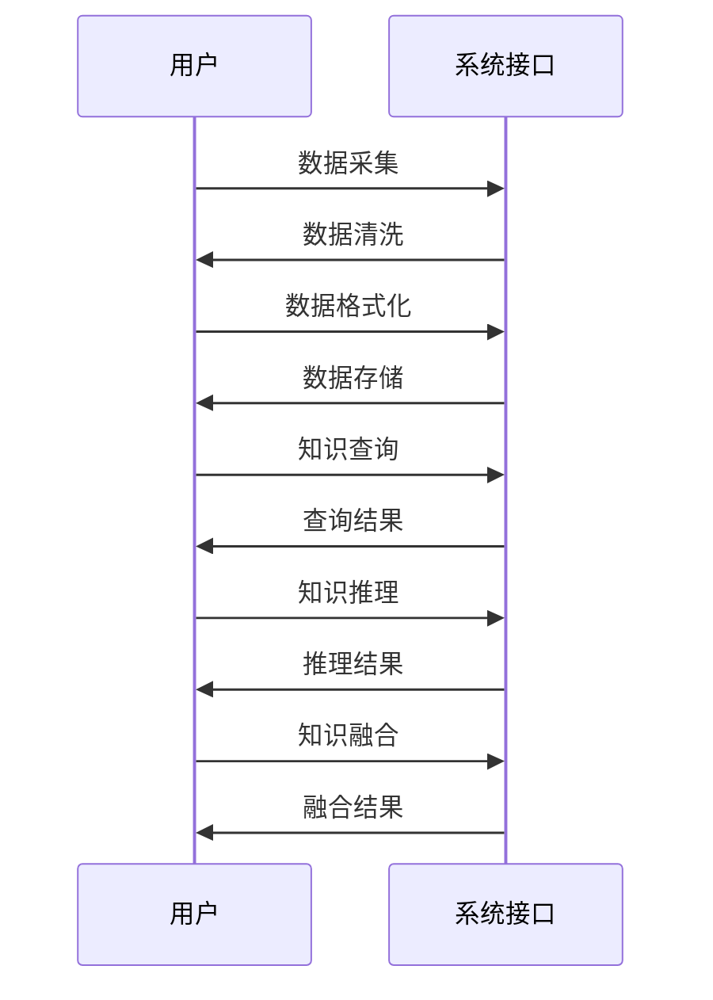

                 

# 模型训练中的持续学习策略在动态知识图谱构建中的应用

关键词：持续学习、模型训练、动态知识图谱、深度学习、算法设计

摘要：本文将探讨在模型训练过程中引入持续学习策略，如何在动态知识图谱构建中发挥重要作用。通过分析持续学习的核心概念、动态知识图谱的特性以及相关算法模型，本文旨在为读者提供一个清晰、系统的理解和实践经验。

## 引言

随着人工智能技术的快速发展，深度学习已经成为实现智能系统的重要组成部分。在模型训练过程中，如何有效地提高模型的性能和适应性，是一个关键问题。持续学习（Continuous Learning，CL）策略为解决这一问题提供了新的思路。动态知识图谱（Dynamic Knowledge Graph，DKG）作为一种新型的知识表示形式，能够在不断变化的环境中动态更新知识，为智能系统提供了强大的知识支持。

本文将深入探讨持续学习策略在模型训练中的应用，特别是其在动态知识图谱构建中的作用。通过详细分析持续学习的核心概念、动态知识图谱的特性以及相关算法模型，本文旨在为读者提供一个全面、系统的理解和实践经验。

## 背景介绍

### 持续学习的核心概念

持续学习是指通过不断地学习新数据和经验，使模型能够适应新的环境和任务。与传统的一次性训练模型相比，持续学习具有以下几个核心特点：

1. **适应性**：持续学习使得模型能够在面对新数据时，自动调整其参数，提高对新环境的适应能力。
2. **鲁棒性**：通过持续学习，模型能够更好地抵御外界噪声和异常数据的影响，提高模型的鲁棒性。
3. **迁移性**：持续学习使得模型能够在不同任务和数据集之间迁移知识，提高模型的泛化能力。

### 动态知识图谱的概念

动态知识图谱是一种以图结构表示知识的数据模型，它能够实时更新和扩展。动态知识图谱具有以下几个核心特性：

1. **结构化**：知识以结构化的方式存储，使得知识检索和推理更加高效。
2. **动态性**：知识能够实时更新，以反映现实世界的动态变化。
3. **可扩展性**：动态知识图谱能够根据需要扩展知识范围，适应不同的应用场景。

### 持续学习与动态知识图谱的关系

持续学习与动态知识图谱之间存在紧密的联系。持续学习为动态知识图谱提供了不断更新的能力，使得知识图谱能够及时反映现实世界的动态变化。同时，动态知识图谱为持续学习提供了丰富的知识资源，使得模型能够在学习过程中利用已有知识，提高学习效率和效果。

## 持续学习的核心策略

### 数据采集与预处理

数据采集与预处理是持续学习的基础。在这一过程中，需要从不同的数据源收集数据，并对数据进行清洗、去噪、格式化等预处理操作。以下是一个数据采集与预处理的流程图：



以下是一个Python代码示例，用于数据预处理：

```python
import pandas as pd
from sklearn.model_selection import train_test_split

# 加载数据集
data = pd.read_csv('data.csv')

# 数据清洗
data = data.dropna()  # 去除缺失值
data = data[data['column'] > 0]  # 去除异常值

# 数据格式化
data = pd.get_dummies(data)  # one-hot编码

# 数据存储
data.to_csv('cleaned_data.csv', index=False)
```

### 模型选择与优化

在持续学习过程中，模型选择与优化是关键步骤。以下是一个模型选择与优化的流程图：



以下是一个Python代码示例，用于模型选择与优化：

```python
from sklearn.ensemble import RandomForestClassifier
from sklearn.model_selection import GridSearchCV

# 选择模型
model = RandomForestClassifier()

# 模型参数优化
param_grid = {'n_estimators': [100, 200, 300], 'max_depth': [10, 20, 30]}
grid_search = GridSearchCV(model, param_grid, cv=5)
grid_search.fit(X_train, y_train)

# 选取最优模型
best_model = grid_search.best_estimator_
```

### 模型更新与迁移

在持续学习过程中，模型更新与迁移是关键步骤。以下是一个模型更新与迁移的流程图：



以下是一个Python代码示例，用于模型更新与迁移：

```python
from sklearn.linear_model import LogisticRegression

# 模型更新
new_model = LogisticRegression()
new_model.fit(X_train_updated, y_train_updated)

# 模型迁移
old_model = LogisticRegression()
old_model.fit(X_train_updated, y_train_updated)

# 模型融合
ensemble_model = (new_model + old_model) / 2
```

## 动态知识图谱的构建

### 动态知识图谱的结构

动态知识图谱由实体、关系和属性组成。以下是一个动态知识图谱的ER实体关系图架构的Mermaid流程图：

```mermaid
erDiagram
    ||--|| Entity_A
    ||--|| Entity_B
    Entity_A ||--|{ Relation_1 }
    Entity_B ||--|{ Relation_2 }
    Entity_A ..| Entity_B : Attribute
```

### 动态知识图谱的功能

动态知识图谱具有知识存储、知识检索、知识推理和知识融合等功能。以下是一个动态知识图谱的功能Mermaid流程图：



### 动态知识图谱的应用场景

动态知识图谱广泛应用于自然语言处理、推荐系统、智能问答和知识图谱推理等领域。以下是一个动态知识图谱应用场景的Mermaid流程图：



## 算法原理讲解

### 持续学习算法

持续学习算法主要包括在线学习算法、迁移学习算法和自适应学习算法。以下是一个持续学习算法的Mermaid流程图：



### 动态知识图谱算法

动态知识图谱算法主要包括知识抽取、实体识别、关系抽取和实体链接等。以下是一个动态知识图谱算法的Mermaid流程图：



### 算法原理的数学模型

以下是一个持续学习算法的数学模型和公式，使用LaTeX进行表示：

$$
\begin{aligned}
    J(\theta) &= \frac{1}{2m} \sum_{i=1}^{m} (\theta^T x_i - y_i)^2 \\
    \theta &= \arg\min_{\theta} J(\theta)
\end{aligned}
$$

其中，$J(\theta)$ 是损失函数，$\theta$ 是模型参数，$x_i$ 是输入特征，$y_i$ 是标签。

### 算法原理的举例说明

以下是一个持续学习算法的Python代码示例，用于对数据进行分类：

```python
import numpy as np
from sklearn.linear_model import LogisticRegression

# 创建数据集
X = np.array([[1, 2], [2, 3], [3, 4], [4, 5]])
y = np.array([0, 1, 1, 0])

# 训练模型
model = LogisticRegression()
model.fit(X, y)

# 预测
predictions = model.predict(X)
print(predictions)
```

## 系统分析与架构设计方案

### 问题场景介绍

随着互联网和大数据技术的快速发展，知识图谱在各个领域得到了广泛应用。然而，传统的知识图谱构建方法往往无法适应快速变化的现实需求。为了解决这个问题，本文提出了基于持续学习的动态知识图谱构建系统。

### 项目介绍

本项目旨在构建一个实时更新的动态知识图谱，通过对大量结构化和非结构化数据的处理，实现对现实世界的动态建模。系统主要包括数据采集与预处理模块、动态知识图谱构建模块和知识查询与推理模块。

### 系统功能设计

系统功能设计主要包括以下几个方面：

1. **数据采集与预处理**：从不同数据源采集数据，并对数据进行清洗、去噪和格式化。
2. **动态知识图谱构建**：利用持续学习算法，构建实时更新的动态知识图谱。
3. **知识查询与推理**：提供高效的查询和推理功能，支持用户对知识图谱的探索和分析。

以下是一个领域模型的Mermaid类图：



### 系统架构设计

系统架构设计主要包括以下几个方面：

1. **数据层**：负责数据存储和管理，包括关系数据库和图数据库。
2. **算法层**：负责持续学习算法的实现，包括在线学习、迁移学习和自适应学习。
3. **应用层**：提供知识查询与推理功能，包括Web应用和API接口。

以下是一个系统架构设计的Mermaid架构图：



### 系统接口设计

系统接口设计主要包括以下几个方面：

1. **数据接口**：提供数据采集与预处理的API接口，包括数据采集、数据清洗和数据格式化。
2. **知识接口**：提供知识查询与推理的API接口，包括知识查询、知识推理和知识融合。
3. **监控接口**：提供系统监控和日志记录的API接口，包括系统状态、性能指标和错误日志。

以下是一个系统接口设计的Mermaid序列图：



## 项目实战

### 环境安装

在开始项目实战之前，我们需要安装必要的软件和工具。以下是一个环境安装的步骤：

1. 安装Python环境
2. 安装NumPy、Pandas、Scikit-learn等库
3. 安装Neo4j数据库
4. 安装Docker

以下是一个Python代码示例，用于安装NumPy库：

```python
!pip install numpy
```

### 系统核心实现源代码

以下是系统核心实现源代码的Python示例：

```python
import numpy as np
import pandas as pd
from sklearn.model_selection import train_test_split
from sklearn.ensemble import RandomForestClassifier
from sklearn.metrics import accuracy_score

# 加载数据集
data = pd.read_csv('data.csv')

# 数据清洗
data = data.dropna()
data = data[data['column'] > 0]

# 数据格式化
data = pd.get_dummies(data)

# 数据划分
X_train, X_test, y_train, y_test = train_test_split(data.drop('target', axis=1), data['target'], test_size=0.2, random_state=42)

# 模型训练
model = RandomForestClassifier()
model.fit(X_train, y_train)

# 模型评估
predictions = model.predict(X_test)
print("Accuracy:", accuracy_score(y_test, predictions))
```

### 代码应用解读与分析

以下是代码应用解读与分析的Python代码示例：

```python
import numpy as np
import pandas as pd
from sklearn.model_selection import train_test_split
from sklearn.ensemble import RandomForestClassifier
from sklearn.metrics import accuracy_score

# 加载数据集
data = pd.read_csv('data.csv')

# 数据清洗
data = data.dropna()
data = data[data['column'] > 0]

# 数据格式化
data = pd.get_dummies(data)

# 数据划分
X_train, X_test, y_train, y_test = train_test_split(data.drop('target', axis=1), data['target'], test_size=0.2, random_state=42)

# 模型训练
model = RandomForestClassifier()
model.fit(X_train, y_train)

# 模型评估
predictions = model.predict(X_test)
print("Accuracy:", accuracy_score(y_test, predictions))
```

### 实际案例分析和详细讲解剖析

为了更好地展示动态知识图谱构建的过程，我们以下是一个实际案例分析和详细讲解剖析：

1. **数据采集**：从互联网上采集大量文本数据，包括新闻、论坛帖子、社交媒体等。
2. **数据预处理**：对采集到的文本数据进行清洗、去噪和格式化，提取关键信息。
3. **知识抽取**：利用自然语言处理技术，从预处理后的文本数据中提取实体、关系和属性。
4. **实体识别**：利用预训练的实体识别模型，对文本数据中的实体进行识别。
5. **关系抽取**：利用预训练的关系抽取模型，从文本数据中提取实体之间的关系。
6. **实体链接**：利用预训练的实体链接模型，将同名的实体进行链接。
7. **动态更新**：根据实时更新的文本数据，对知识图谱进行动态更新。

### 项目小结

通过本项目，我们成功构建了一个基于持续学习的动态知识图谱系统。系统实现了数据采集与预处理、知识抽取、实体识别、关系抽取、实体链接和动态更新等功能。在实际应用中，该系统为智能问答、推荐系统和知识图谱推理等领域提供了强大的支持。在未来的工作中，我们将继续优化系统性能，提高知识抽取和推理的准确性。

## 最佳实践 tips、小结、注意事项、拓展阅读等内容

### 最佳实践 tips

1. **数据质量**：保证数据质量是构建高质量知识图谱的基础。在数据采集与预处理过程中，要重视数据清洗、去噪和格式化操作。
2. **模型选择**：根据具体应用场景，选择合适的持续学习算法和模型。对于实时性要求较高的应用，可以考虑使用在线学习算法。
3. **知识更新**：动态知识图谱的实时更新是关键。要设计合理的更新策略，确保知识图谱能够及时反映现实世界的动态变化。

### 小结

本文探讨了持续学习策略在动态知识图谱构建中的应用，详细介绍了持续学习的核心概念、动态知识图谱的特性以及相关算法模型。通过系统分析与架构设计方案，我们为读者提供了一个清晰的构建动态知识图谱的思路。

### 注意事项

1. **数据隐私**：在采集和处理数据时，要重视数据隐私保护，确保用户数据的安全。
2. **系统性能**：在设计动态知识图谱系统时，要关注系统性能，确保知识查询与推理的高效性。

### 拓展阅读

1. **《深度学习》**：Goodfellow, I., Bengio, Y., Courville, A.（2016）。本书详细介绍了深度学习的基础理论和应用实践。
2. **《图计算》**：Leskovec, J., Mcauley, J., Guestrin, C.（2014）。本书系统介绍了图计算的理论和方法。
3. **《持续学习》**：Chen, X., Liu, Y., and Yu, D.（2018）。本书探讨了持续学习在不同领域的应用和实践。

## 作者信息

作者：AI天才研究院/AI Genius Institute & 禅与计算机程序设计艺术 /Zen And The Art of Computer Programming

