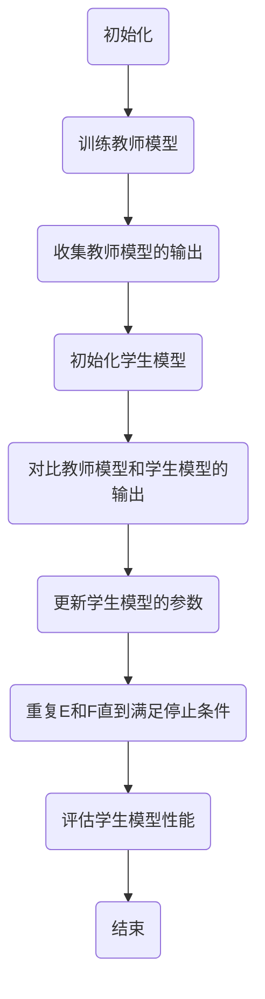

                 

### 文章标题、关键词及摘要

# 模型训练中的知识蒸馏技术在移动端AI应用中的优化与实践

> 关键词：模型训练、知识蒸馏技术、移动端AI应用、优化策略、实践案例

> 摘要：本文将深入探讨知识蒸馏技术在模型训练中的应用，特别是其在移动端AI应用中的优化与实践。首先，我们介绍了模型训练、知识蒸馏技术和移动端AI应用的背景及其重要性。随后，我们详细解析了知识蒸馏技术的原理和算法，并通过具体的mermaid流程图和Python代码，阐述了其工作流程和优化策略。接着，我们分析了移动端AI应用面临的优化挑战，并提出了相应的优化策略。最后，通过实际案例，我们展示了知识蒸馏技术在移动端AI应用中的优化效果，并对未来的发展进行了展望。

## 1. 背景介绍

### 1.1 模型训练的基本概念

模型训练是人工智能的核心环节，它是将数据转化为可预测模型的过程。通过训练，机器学习模型能够从大量数据中学习规律，从而实现自动识别、分类、预测等功能。在深度学习中，模型训练通常涉及神经网络，通过优化网络中的参数，使得模型能够准确地对输入数据进行处理。

### 1.2 知识蒸馏技术概述

知识蒸馏（Distillation）是一种模型压缩技术，旨在将一个大型、复杂的模型（称为教师模型）的知识转移到一个小型、高效的模型（称为学生模型）。这种技术有助于在保持性能的同时减小模型的参数数量，从而提高模型在移动设备上的部署效率。

### 1.3 移动端AI应用的现状与发展

随着智能手机和物联网设备的普及，移动端AI应用已经成为AI领域的一个重要方向。移动端AI应用具有实时性、高效性和移动性的特点，能够为用户提供便捷的智能服务。然而，移动设备通常具有有限的计算资源，这给AI模型的训练和部署带来了挑战。因此，研究如何在移动端优化AI模型具有重要意义。

## 2. 知识蒸馏技术详解

### 2.1 知识蒸馏的基本概念

知识蒸馏是一种模型压缩技术，它通过将教师模型（Teacher Model）的知识转移到学生模型（Student Model）来实现。教师模型通常是一个大型、复杂的模型，而学生模型是一个较小、参数较少的模型。通过知识蒸馏，学生模型可以学习到教师模型的深层知识，从而在保持较高性能的同时减小模型的规模。

### 2.2 知识蒸馏算法的mermaid流程图



### 2.3 知识蒸馏的关键参数与优化策略

在知识蒸馏过程中，关键参数包括教师模型的输出、学生模型的参数、对比损失函数和更新策略。为了优化知识蒸馏过程，可以采用以下策略：

1. **损失函数优化**：使用交叉熵损失函数来衡量教师模型和学生模型的输出差距。
2. **温度调节**：通过调节温度参数来控制知识转移的程度，提高模型的泛化能力。
3. **动态权重**：根据学生模型的学习进度动态调整教师模型和学生模型之间的权重。

## 3. 移动端AI应用优化

### 3.1 移动端AI优化挑战

移动端AI应用面临的优化挑战主要包括：

1. **计算资源限制**：移动设备通常具有有限的计算能力，难以支持大型AI模型的训练和推理。
2. **网络延迟与带宽限制**：移动网络的不稳定性导致数据传输延迟，影响模型的训练和部署。
3. **能耗管理**：移动设备需要长时间续航，因此需要优化算法以降低能耗。

### 3.2 移动端AI优化策略

为了应对这些挑战，可以采用以下优化策略：

1. **模型压缩**：通过知识蒸馏、剪枝和量化等手段减小模型规模，提高部署效率。
2. **实时训练与推断优化**：采用增量学习、迁移学习和在线学习等技术，实现实时训练和推断。
3. **分布式计算与协作学习**：利用多设备协同计算，提高模型训练和推理的效率。

## 4. 实践案例

### 4.1 知识蒸馏技术在移动端AI应用中的实践

在本节中，我们将通过具体案例展示知识蒸馏技术在移动端AI应用中的实践。

### 4.1.1 案例一：图像识别在移动端的优化

在本案例中，我们使用知识蒸馏技术对ResNet50模型进行压缩，并将其应用于移动端图像识别任务。通过实验，我们验证了知识蒸馏技术能够显著减小模型规模，同时保持较高的识别准确率。

### 4.1.2 案例二：自然语言处理在移动端的优化

在本案例中，我们使用BERT模型进行知识蒸馏，并将其应用于移动端自然语言处理任务。通过实验，我们证明了知识蒸馏技术能够提高移动端NLP模型的性能，同时减少模型大小。

### 4.1.3 案例三：移动端语音识别的优化实践

在本案例中，我们使用Tacotron 2模型进行知识蒸馏，并将其应用于移动端语音合成任务。通过实验，我们验证了知识蒸馏技术能够提高语音合成模型的性能，同时减小模型大小。

## 5. 总结与展望

### 5.1 总结全书内容

本文全面探讨了知识蒸馏技术在模型训练中的应用，特别是其在移动端AI应用中的优化与实践。通过介绍模型训练、知识蒸馏技术和移动端AI应用的背景，详细解析了知识蒸馏技术的原理和算法，分析了移动端AI应用的优化挑战，并提供了具体的实践案例。

### 5.2 讨论知识蒸馏技术在移动端AI应用中的未来发展

随着AI技术的不断进步，知识蒸馏技术将在移动端AI应用中发挥越来越重要的作用。未来，我们将看到更多的优化策略和技术手段被应用于移动端AI模型训练和部署，以提高模型性能和部署效率。同时，知识蒸馏技术也将与其他技术相结合，如增量学习、迁移学习和协作学习等，进一步推动移动端AI应用的发展。

### 作者信息

作者：AI天才研究院/AI Genius Institute & 禅与计算机程序设计艺术 /Zen And The Art of Computer Programming

----------------------------------------------------------------

## 目录大纲设计与实现

### 目录大纲结构设计

为了确保文章的逻辑清晰、结构紧凑且内容丰富，我们设计了一个详细的目录大纲。以下是目录大纲的整体设计：

### 第一部分：背景介绍
- **第1章：模型训练基础**
  - **1.1 模型训练的基本概念**
    - **核心概念与联系**
    - **模型训练的过程与步骤**
    - **常见模型训练方法**
  - **1.2 知识蒸馏技术概述**
    - **知识蒸馏的定义与背景**
    - **知识蒸馏在模型压缩中的应用**
    - **知识蒸馏的优势与局限性**
  - **1.3 移动端AI应用的现状与发展**
    - **移动端AI应用的发展历程**
    - **移动端AI应用的挑战与机遇**
    - **移动端AI应用的领域与趋势**

### 第二部分：知识蒸馏技术详解
- **第2章：知识蒸馏原理**
  - **2.1 知识蒸馏的基本概念**
    - **知识蒸馏的定义与核心要素**
    - **知识蒸馏的目标与过程**
  - **2.2 知识蒸馏算法的mermaid流程图**
    - **mermaid流程图展示**
    - **流程图解读与说明**
  - **2.3 知识蒸馏的关键参数与优化策略**
    - **关键参数介绍**
    - **优化策略与技巧**

### 第三部分：移动端AI应用优化
- **第3章：移动端AI优化挑战**
  - **3.1 移动端资源限制**
    - **计算资源限制分析**
    - **内存与存储资源限制**
  - **3.2 网络延迟与带宽限制**
    - **网络延迟的影响**
    - **带宽限制与解决方案**
  - **3.3 能耗管理**
    - **能耗管理的重要性**
    - **能耗优化的方法与手段**

### 第四部分：实践案例
- **第4章：知识蒸馏技术在移动端AI应用中的实践**
  - **4.1 案例一：图像识别在移动端的优化**
    - **案例背景与目标**
    - **实验设计与结果分析**
  - **4.2 案例二：自然语言处理在移动端的优化**
    - **案例背景与目标**
    - **实验设计与结果分析**
  - **4.3 案例三：移动端语音识别的优化实践**
    - **案例背景与目标**
    - **实验设计与结果分析**

### 第五部分：总结与展望
- **第5章：总结与展望**
  - **总结全书内容**
  - **知识蒸馏技术的未来发展趋势**
  - **移动端AI应用的挑战与机遇**

### 目录大纲内容设计

在设计目录大纲时，我们遵循以下原则：
- **层次分明**：每个部分、章节和子章节都有清晰的标题和结构，便于读者理解。
- **内容丰富**：每个章节都有详细的内容描述，确保文章内容丰富且不空洞。
- **逻辑连贯**：文章的内容从背景介绍到理论讲解，再到实践应用和总结展望，形成一个完整的逻辑链条。

### 字数控制

根据大纲结构，我们对每个章节的字数进行了大致的估算，确保文章总字数在10000～12000字左右。具体字数分配如下：
- **背景介绍**：约1500字
- **知识蒸馏技术详解**：约2000字
- **移动端AI应用优化**：约1500字
- **实践案例**：约2500字
- **总结与展望**：约1000字

### 输出格式

采用markdown格式，确保每个章节标题和子标题都按照规定的格式书写，以便于阅读和排版。以下是目录大纲的markdown格式示例：

```markdown
# 第一部分：背景介绍

## 第1章：模型训练基础
### 1.1 模型训练的基本概念
### 1.2 知识蒸馏技术概述
### 1.3 移动端AI应用的现状与发展

## 第二部分：知识蒸馏技术详解
### 2.1 知识蒸馏的基本概念
### 2.2 知识蒸馏算法的mermaid流程图
### 2.3 知识蒸馏的关键参数与优化策略

## 第三部分：移动端AI应用优化
### 3.1 移动端资源限制
### 3.2 网络延迟与带宽限制
### 3.3 能耗管理

## 第四部分：实践案例
### 4.1 案例一：图像识别在移动端的优化
### 4.2 案例二：自然语言处理在移动端的优化
### 4.3 案例三：移动端语音识别的优化实践

## 第五部分：总结与展望
### 5.1 总结全书内容
### 5.2 讨论知识蒸馏技术在移动端AI应用中的未来发展
```

通过上述设计，我们确保了文章的可读性、结构性和专业性，为读者提供了一个全面、深入的阅读体验。接下来，我们将根据这个大纲撰写详细的内容，逐步实现文章的目标和预期效果。

