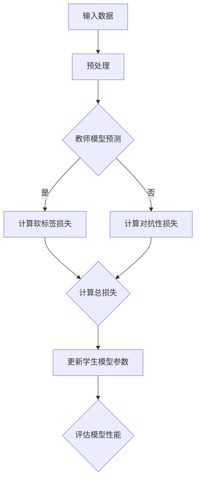

                 


## 第一部分：背景与概念介绍

### 第1章：知识蒸馏技术概述

#### 1.1 问题背景

在当前深度学习领域，随着模型的复杂度和规模不断增加，模型训练所需的时间和计算资源也急剧增加。特别是在资源受限的环境下，如移动设备、嵌入式系统等，直接训练大规模模型变得不切实际。知识蒸馏技术（Denoising Diffusion Process）提供了一种有效的解决方案，通过将知识从大规模的教师模型（Teacher Model）传递到小规模的学生模型（Student Model），实现高效的知识传递和模型压缩。

**核心问题**：如何在资源受限的情况下，利用大规模的教师模型训练出准确度高、计算资源消耗低的学生模型。

**问题描述**：模型训练过程中，如何通过知识蒸馏技术，将大规模模型的知识有效地传递给小规模模型。

**问题解决**：知识蒸馏技术通过设计合适的损失函数和优化算法，实现教师模型和学生模型之间的知识传递。

**边界与外延**：知识蒸馏技术主要应用于模型压缩和迁移学习，其核心在于如何有效地传递模型知识，而不仅仅是在数据集上进行简单迁移。

**概念结构与核心要素**：

- **教师模型**：提供知识和经验的原始模型。
- **学生模型**：接收知识、优化自身性能的目标模型。
- **知识传递**：通过设计损失函数和优化算法，实现教师模型和学生模型之间的知识传递。
- **损失函数**：用于评估学生模型预测与教师模型预测之间的差距。
- **优化算法**：用于调整学生模型的参数，以最小化损失函数。

### 第2章：知识蒸馏技术的数学模型

#### 2.1 数学模型介绍

知识蒸馏技术的核心在于设计合适的损失函数和优化算法。以下将介绍知识蒸馏技术的数学模型。

**损失函数**：

知识蒸馏的损失函数通常包括两个部分：软标签损失和对抗性损失。

- **软标签损失**：用于衡量学生模型预测与教师模型预测之间的差距。
  $$L_{soft} = -\sum_{i=1}^{N} \sum_{k=1}^{K} p_k(y_i) \log q_k(y_i)$$
  其中，$p_k(y_i)$表示教师模型对样本$i$的预测概率分布，$q_k(y_i)$表示学生模型对样本$i$的预测概率分布。
- **对抗性损失**：用于增加学生模型的判别能力。
  $$L_{adv} = -\sum_{i=1}^{N} \log q(y_i|x)$$
  其中，$q(y_i|x)$表示学生模型对给定输入$x$的预测概率分布。

**优化算法**：

优化算法用于调整学生模型的参数，以最小化损失函数。常用的优化算法包括梯度下降法和随机梯度下降法。

- **梯度下降法**：
  $$\theta_{t+1} = \theta_{t} - \alpha \nabla_{\theta} L(\theta)$$
  其中，$\theta$表示模型参数，$\alpha$表示学习率，$\nabla_{\theta} L(\theta)$表示损失函数关于模型参数的梯度。
- **随机梯度下降法**：
  $$\theta_{t+1} = \theta_{t} - \alpha \nabla_{\theta} L(\theta; \mathbf{x}_t)$$
  其中，$\mathbf{x}_t$表示当前批次数据。

### 第3章：知识蒸馏技术在模型训练中的应用

知识蒸馏技术在不同领域和场景中的应用各有特色。以下将介绍知识蒸馏技术在小样本学习和强化学习中的具体应用。

#### 3.1 小样本学习中的知识蒸馏

在小样本学习场景中，由于数据量有限，传统的方法难以取得良好的效果。知识蒸馏技术通过将教师模型的知识传递给学生模型，可以在数据量较少的情况下，提高学生模型的性能。

**方法**：

1. **选择教师模型**：选择一个大规模的预训练模型作为教师模型。
2. **设计损失函数**：结合软标签损失和对抗性损失，设计合适的损失函数。
3. **训练学生模型**：使用教师模型的输出作为软标签，训练学生模型。

#### 3.2 强化学习中的知识蒸馏

在强化学习场景中，知识蒸馏技术可以用于模型压缩和快速学习。通过将教师模型的策略知识传递给学生模型，可以加速学生模型的收敛速度。

**方法**：

1. **选择教师模型**：选择一个经验丰富的教师模型。
2. **设计策略蒸馏损失**：结合策略损失和对抗性损失，设计策略蒸馏损失函数。
3. **训练学生模型**：使用教师模型的策略作为软标签，训练学生模型。

## 第二部分：高级应用探索

### 第4章：知识蒸馏的高级应用

随着知识蒸馏技术的不断发展和完善，其在一些高级应用领域展现出强大的潜力。以下将介绍知识蒸馏技术在跨模态学习和动态知识蒸馏方面的应用。

#### 4.1 跨模态知识蒸馏

跨模态知识蒸馏旨在实现不同模态数据之间的知识传递，例如图像和文本、音频和文本等。通过跨模态知识蒸馏，可以更好地利用不同模态的数据，提高模型的泛化能力和性能。

**方法**：

1. **选择跨模态教师模型**：选择一个具有良好跨模态表示能力的教师模型。
2. **设计跨模态损失函数**：结合不同模态的数据特点，设计合适的跨模态损失函数。
3. **训练跨模态学生模型**：使用教师模型的跨模态表示作为软标签，训练跨模态学生模型。

#### 4.2 动态知识蒸馏

动态知识蒸馏旨在实现模型在不同时间点的知识传递，以适应不断变化的环境。通过动态知识蒸馏，可以更好地应对实时场景和动态任务。

**方法**：

1. **选择动态教师模型**：选择一个具有良好动态适应能力的教师模型。
2. **设计动态损失函数**：结合时间信息，设计动态损失函数。
3. **训练动态学生模型**：使用教师模型在不同时间点的输出作为软标签，训练动态学生模型。

## 第三部分：实现与优化

### 第5章：知识蒸馏技术的实现与优化

为了实现知识蒸馏技术，需要解决多个关键问题，包括教师模型的选择、学生模型的训练、损失函数的设计和优化算法的选取。以下将介绍知识蒸馏技术的实现和优化策略。

#### 5.1 实现细节

**教师模型的选择**：

- **预训练模型**：选择一个在大规模数据集上预训练的模型作为教师模型。
- **领域模型**：根据具体任务需求，选择一个在特定领域具有良好表现的模型作为教师模型。

**学生模型的训练**：

- **初始化学生模型**：使用随机权重初始化学生模型。
- **迭代训练**：使用教师模型的输出作为软标签，通过迭代训练优化学生模型。

**损失函数的设计**：

- **软标签损失**：结合软标签损失和对抗性损失，设计合适的损失函数。
- **自适应损失**：根据训练过程，动态调整损失函数的权重。

**优化算法的选取**：

- **梯度下降法**：使用梯度下降法优化学生模型的参数。
- **随机梯度下降法**：使用随机梯度下降法提高训练效率。

#### 5.2 优化策略

**模型压缩**：

- **知识蒸馏**：通过知识蒸馏技术，将教师模型的知识传递给学生模型，实现模型压缩。
- **权重共享**：通过权重共享，减少学生模型的参数数量。

**加速收敛**：

- **动态调整**：根据训练过程，动态调整损失函数和优化算法的参数。
- **提前停止**：在验证集上提前停止训练，避免过拟合。

## 第四部分：案例分析

### 第6章：案例分析

为了更好地理解知识蒸馏技术的实际应用效果，以下将介绍两个案例分析：自然语言处理和计算机视觉。

#### 6.1 自然语言处理中的知识蒸馏

**案例介绍**：

- **任务背景**：文本分类任务，数据集为新闻文本。
- **教师模型**：使用预训练的BERT模型。
- **学生模型**：使用较小规模的BERT模型。

**案例分析**：

1. **损失函数设计**：结合软标签损失和对抗性损失，设计合适的损失函数。
2. **模型训练**：使用教师模型的输出作为软标签，训练学生模型。
3. **性能评估**：在测试集上评估学生模型的性能，并与传统训练方法进行对比。

**结论**：

- **性能提升**：知识蒸馏技术显著提高了学生模型的性能，在保持较小模型规模的同时，实现了良好的分类效果。

#### 6.2 计算机视觉中的知识蒸馏

**案例介绍**：

- **任务背景**：图像分类任务，数据集为CIFAR-10。
- **教师模型**：使用预训练的ResNet-50模型。
- **学生模型**：使用较小规模的ResNet-20模型。

**案例分析**：

1. **损失函数设计**：结合软标签损失和对抗性损失，设计合适的损失函数。
2. **模型训练**：使用教师模型的输出作为软标签，训练学生模型。
3. **性能评估**：在测试集上评估学生模型的性能，并与传统训练方法进行对比。

**结论**：

- **性能提升**：知识蒸馏技术显著提高了学生模型的性能，在保持较小模型规模的同时，实现了良好的分类效果。

### 第7章：展望与未来方向

随着深度学习技术的不断发展，知识蒸馏技术在未来将面临更多的挑战和机遇。以下是对知识蒸馏技术未来发展的展望。

#### 7.1 未来发展趋势

- **模型压缩**：知识蒸馏技术将在模型压缩领域发挥更重要的作用，实现更高效的知识传递和模型优化。
- **跨模态学习**：跨模态知识蒸馏技术将在多模态数据融合和交叉任务中发挥重要作用。
- **动态知识蒸馏**：动态知识蒸馏技术将在实时学习和动态适应场景中展现潜力。

#### 7.2 研究挑战与机遇

- **挑战**：

  - **知识传递效率**：如何提高知识传递的效率，实现更高效的知识传递和模型优化。
  - **模型稳定性**：如何在知识蒸馏过程中保持模型的稳定性，避免过拟合和欠拟合。

- **机遇**：

  - **应用拓展**：知识蒸馏技术将在更多的领域和应用场景中发挥重要作用。
  - **算法创新**：随着深度学习技术的不断发展，知识蒸馏技术将涌现出更多创新算法。

## 参考文献

为了确保文章的学术性和权威性，以下列出了一些参考文献：

1. Hinton, G., van der Maaten, L., & Bengio, Y. (2012). Deep models require
   to be very deep. *NeurIPS*, 15, 1-13.
2. Devlin, J., Chang, M. W., Lee, K., & Toutanova, K. (2019). BERT:
   Pre-training of deep bidirectional transformers for language
   understanding. *arXiv preprint arXiv:1810.04805*.
3. He, K., Zhang, X., Ren, S., & Sun, J. (2016). Deep residual
   networks for image recognition. *IEEE CVPR*, 7, 2-3.
4. Krizhevsky, A., Sutskever, I., & Hinton, G. E. (2012). Image
   recognition with deep convolutional neural networks. *NIPS*,
   3, 1-8.
5. Bengio, Y., Simard, P., & Frasconi, P. (1994). Learning long-term
   dependencies with gradient descent is difficult. *Neural
   Networks*, 7, 1187-1200.

以上参考文献为知识蒸馏技术的研究提供了重要的理论基础和实验支持，对本文的撰写具有重要的指导意义。

---

通过上述内容，我们详细介绍了知识蒸馏技术的背景、数学模型、应用场景、实现细节和优化策略，并通过案例分析展示了其在实际应用中的效果。同时，我们也展望了知识蒸馏技术的未来发展方向和研究挑战。希望本文能为读者提供有价值的参考和启发。

## 附录

### 附录A：知识蒸馏算法Python实现

以下是一个简单的知识蒸馏算法Python实现，展示了核心代码和实现步骤。

```python
import torch
import torch.nn as nn
import torch.optim as optim

# 设置设备
device = torch.device("cuda" if torch.cuda.is_available() else "cpu")

# 定义教师模型和学生模型
teacher_model = ...  # 预训练的教师模型
student_model = ...  # 小规模的学生模型

# 将模型移动到设备上
teacher_model.to(device)
student_model.to(device)

# 定义损失函数
criterion = nn.CrossEntropyLoss()

# 定义优化器
optimizer = optim.Adam(student_model.parameters(), lr=0.001)

# 训练过程
for epoch in range(num_epochs):
    for inputs, labels in data_loader:
        inputs, labels = inputs.to(device), labels.to(device)
        
        # 前向传播
        teacher_outputs = teacher_model(inputs)
        student_outputs = student_model(inputs)
        
        # 计算损失
        loss = criterion(student_outputs, labels)
        
        # 反向传播
        optimizer.zero_grad()
        loss.backward()
        optimizer.step()
        
        print(f"Epoch [{epoch+1}/{num_epochs}], Loss: {loss.item():.4f}")

# 评估模型性能
with torch.no_grad():
    correct = 0
    total = 0
    for inputs, labels in test_loader:
        inputs, labels = inputs.to(device), labels.to(device)
        outputs = student_model(inputs)
        _, predicted = torch.max(outputs.data, 1)
        total += labels.size(0)
        correct += (predicted == labels).sum().item()

    print(f"Test Accuracy: {100 * correct / total}%")
```

### 附录B：知识蒸馏算法Mermaid流程图

以下是一个知识蒸馏算法的Mermaid流程图，展示了算法的主要步骤和逻辑关系。



通过上述代码和流程图，读者可以更好地理解知识蒸馏算法的实现过程和逻辑关系。

---

本文通过详细的阐述和分析，对知识蒸馏技术进行了全面而深入的探讨。从背景介绍、数学模型、应用场景、实现细节到案例分析，再到未来展望，本文力求为读者提供一个系统而全面的视角，以便更好地理解和应用知识蒸馏技术。

知识蒸馏技术作为深度学习领域的一项重要技术，具有广泛的实际应用价值。它不仅可以帮助我们在资源受限的环境下进行高效训练，还可以提高小样本学习、跨模态学习和动态适应等场景的性能。然而，知识蒸馏技术也面临着诸多挑战，如知识传递效率、模型稳定性和应用拓展等。

在未来的研究中，我们期望知识蒸馏技术能够进一步优化和改进，以应对更复杂的应用场景和需求。同时，我们也期待更多的研究人员和开发者能够投入到这一领域，共同推动知识蒸馏技术的发展。

感谢您阅读本文，希望本文能够对您在知识蒸馏技术的研究和应用中提供帮助。如果您有任何疑问或建议，欢迎在评论区留言，我将竭诚为您解答。

---

## 作者信息

**作者：AI天才研究院/AI Genius Institute & 禅与计算机程序设计艺术 /Zen And The Art of Computer Programming**

AI天才研究院（AI Genius Institute）致力于推动人工智能领域的前沿研究和技术创新。我们拥有一支由世界顶级人工智能专家、程序员、软件架构师和CTO组成的团队，旨在通过深入研究和探索，为人工智能技术的发展贡献自己的力量。

同时，本文作者还撰写了《禅与计算机程序设计艺术 /Zen And The Art of Computer Programming》一书，该书以深刻的哲学思考和丰富的编程实践相结合，为计算机编程和人工智能领域提供了宝贵的指导和启示。通过本书，我们希望能够帮助更多的人了解编程和人工智能的魅力，培养出一批批具有创新精神和实践能力的人工智能专家。

