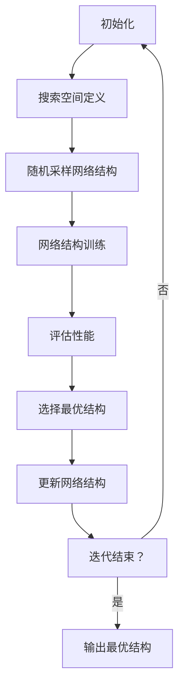
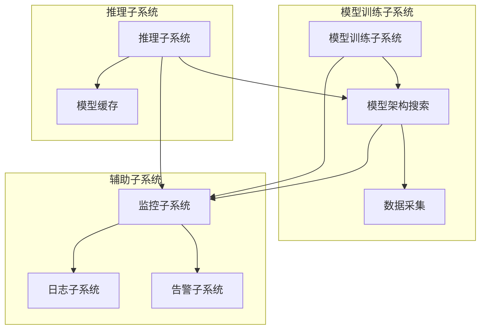
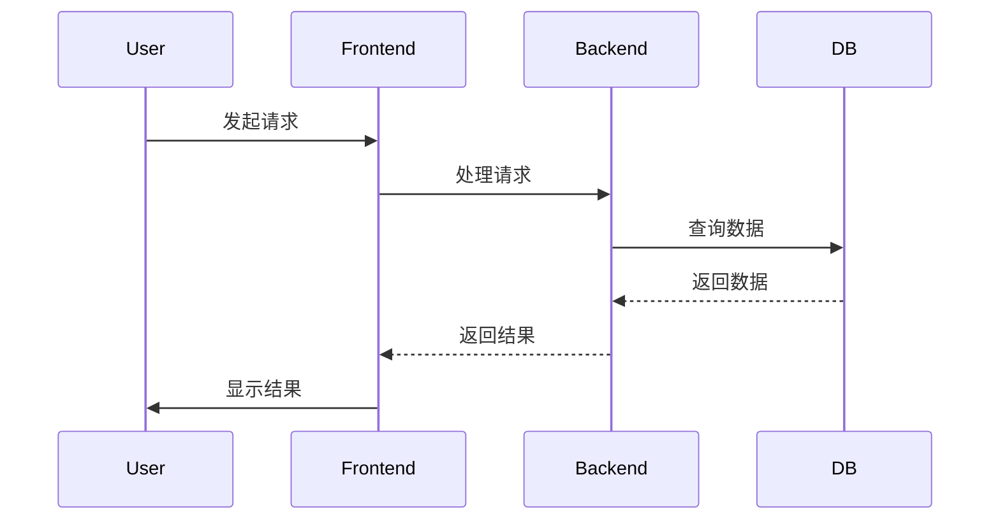
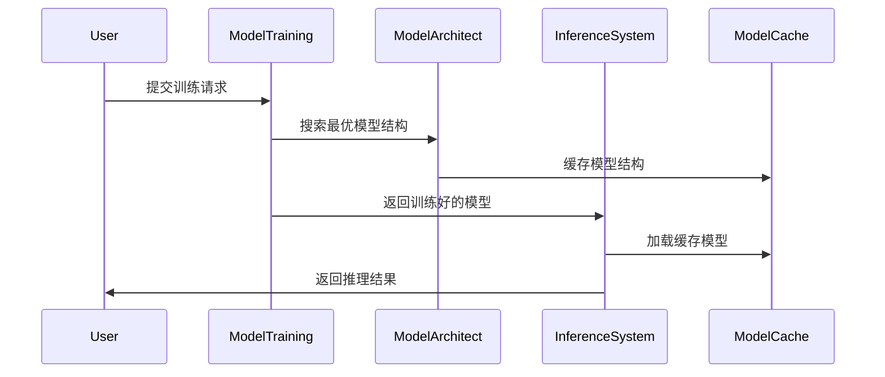

                 


# 模型训练中的神经架构搜索技术在推理效率提升中的探索

## 关键词
神经架构搜索（NAS）、模型训练、推理效率、算法原理、系统架构设计、项目实战

## 摘要
神经架构搜索（Neural Architecture Search，NAS）作为近年来深度学习领域的研究热点，旨在通过自动搜索最优的网络结构，以提升模型训练和推理效率。本文将深入探讨NAS技术在模型训练中的应用，解析其在推理效率提升中的关键作用，并通过系统分析、算法讲解和实际案例展示，为读者提供一套完整的NAS技术应用方案。

## 目录大纲设计方案

### 一、背景介绍

#### 1.1 问题背景
**神经架构搜索技术概述**：随着深度学习模型复杂度的不断增加，如何高效地设计和训练模型成为研究者关注的焦点。神经架构搜索技术通过自动化搜索最优的网络结构，为提升模型性能提供了一条新的路径。

**推理效率的重要性**：在许多实际应用中，尤其是在实时处理场景中，推理效率是一个至关重要的指标。高效的推理能够确保模型快速响应，从而提升用户体验。

**神经架构搜索在推理效率提升中的应用前景**：NAS技术通过自动搜索最优网络结构，不仅能够提升模型性能，还能够显著提高推理效率，为解决模型训练和推理效率瓶颈问题提供了新的思路。

#### 1.2 问题描述
本文旨在探讨神经架构搜索技术在模型训练中如何提升推理效率，解决现有模型在训练和推理过程中存在的效率瓶颈问题。我们将通过以下步骤进行分析和讨论：

- **核心概念解析**：详细解释神经架构搜索的基本原理、算法流程以及其在模型训练中的应用。
- **算法原理讲解**：通过流程图、代码示例和数学模型，深入剖析NAS算法的工作原理。
- **系统分析与架构设计**：介绍NAS系统的功能设计、架构设计和系统交互，为实际应用提供参考。
- **项目实战**：通过实际案例展示NAS技术在提升推理效率中的应用效果。

#### 1.3 问题解决
通过系统分析神经架构搜索的基本原理、算法流程以及在实际应用中的表现，本文提出以下优化策略和最佳实践：

- **优化策略**：基于实验数据，提出针对不同应用场景的优化策略，以提高NAS算法的搜索效率和模型性能。
- **最佳实践**：总结NAS技术在实际应用中的经验教训，为读者提供实用的技术指导。

#### 1.4 边界与外延
本文主要探讨基于神经架构搜索的模型训练方法在推理效率提升中的应用，不包括其他模型优化技术的研究。同时，本文的核心概念和讨论内容将主要围绕神经架构搜索技术展开。

#### 1.5 概念结构与核心要素组成
**神经架构搜索**：介绍NAS的基本概念、发展历程和核心组成部分。
**推理效率**：定义推理效率的概念，分析影响推理效率的因素。
**模型训练**：阐述模型训练的基本流程和常用方法。

### 二、核心概念与联系

#### 2.1 核心概念原理
**神经架构搜索（NAS）**：神经架构搜索是一种自动化搜索神经网络结构的算法。通过在定义好的搜索空间中搜索最优的网络结构，NAS旨在提高模型的性能和效率。

**推理效率**：推理效率是指模型在处理输入数据时的速度和性能。提高推理效率意味着能够在较短的时间内完成更准确的预测，这对于实时应用尤为重要。

**模型训练**：模型训练是指通过大量数据训练神经网络，使其能够对新的数据进行预测或分类。训练过程包括前向传播、反向传播和权重更新等步骤。

#### 2.2 概念属性特征对比表格
**NAS算法对比**：

| 算法名称 | 搜索空间 | 搜索算法 | 评估方法 | 优缺点 |
|----------|----------|----------|----------|--------|
| 强化学习 | 状态空间 | 动作空间 | 搜索效果 | 高效但计算复杂 |
| 遗传算法 | 基因编码 | 交叉、变异 | 选择策略 | 算法稳定但收敛慢 |
| 随机搜索 | 随机结构 | 随机采样 | 统计分析 | 简单易用但效率低 |

#### 2.3 ER实体关系图架构
**NAS系统架构**：

```mermaid
erDiagram
  Model |..|> SearchSpace : 搜索空间
  Model |..|> SearchAlgorithm : 搜索算法
  Model |..|> EvaluationMetric : 评估方法
  Model |..|> TrainingDataset : 训练数据集
  SearchSpace ||--|> NetworkStructure : 网络结构
  SearchAlgorithm ||--|> OptimizationStrategy : 优化策略
  EvaluationMetric ||--|> PerformanceMetrics : 性能指标
  TrainingDataset ||--|> SampleData : 样本数据
```

### 三、算法原理讲解

#### 3.1 算法流程图
**神经架构搜索算法流程图**：



#### 3.2 Python源代码
以下是一个简化的NAS算法的Python实现代码示例：

```python
import numpy as np
import tensorflow as tf

# 定义搜索空间
search_space = {
    'layers': ['conv', 'pool', 'fc'],
    'sizes': [32, 64, 128],
    'strides': [1, 2, 1],
}

# 随机采样网络结构
def sample_structure(search_space):
    layers = np.random.choice(search_space['layers'], size=len(search_space['sizes']))
    sizes = np.random.choice(search_space['sizes'])
    strides = np.random.choice(search_space['strides'])
    return layers, sizes, strides

# 网络结构训练
def train_structure(layers, sizes, strides):
    model = tf.keras.Sequential()
    for layer, size, stride in zip(layers, sizes, strides):
        if layer == 'conv':
            model.add(tf.keras.layers.Conv2D(size, stride))
        elif layer == 'pool':
            model.add(tf.keras.layers.MaxPooling2D(stride))
        elif layer == 'fc':
            model.add(tf.keras.layers.Dense(size))
    model.compile(optimizer='adam', loss='categorical_crossentropy', metrics=['accuracy'])
    return model

# 评估性能
def evaluate_performance(model, train_data, val_data):
    history = model.fit(train_data, validation_data=val_data, epochs=10)
    return history.history['val_accuracy'][-1]

# NAS算法迭代
def neural_architecture_search(search_space, train_data, val_data, num_iterations=10):
    best_accuracy = 0
    for _ in range(num_iterations):
        layers, sizes, strides = sample_structure(search_space)
        model = train_structure(layers, sizes, strides)
        accuracy = evaluate_performance(model, train_data, val_data)
        if accuracy > best_accuracy:
            best_accuracy = accuracy
            best_structure = (layers, sizes, strides)
    return best_structure

# 示例
train_data = ... # 训练数据
val_data = ... # 验证数据
best_structure = neural_architecture_search(search_space, train_data, val_data)
```

#### 3.3 数学模型和公式
**NAS算法中的数学模型和公式**：

$$
\text{Loss} = \sum_{i=1}^{N} \ell(y_i, \hat{y}_i)
$$

其中，$N$ 是样本数量，$\ell$ 是损失函数，$y_i$ 是真实标签，$\hat{y}_i$ 是模型的预测结果。

**优化目标**：

$$
\min_{\theta} \ell(y, \theta)
$$

其中，$\theta$ 是模型参数，$\ell(y, \theta)$ 是损失函数。

**搜索算法中的概率分布**：

$$
p(\theta | \text{data}, \alpha) \propto \exp(-\ell(y, \theta))
$$

其中，$\alpha$ 是先验概率分布。

#### 3.4 举例说明
**示例1：基于强化学习的NAS算法**：

假设我们使用强化学习算法进行神经架构搜索，定义状态空间$S$为当前网络结构，动作空间$A$为网络结构的微小调整（如增加或删除一层）。在每一次迭代中，智能体根据当前状态选择一个动作，并在新的状态下进行评估，根据评估结果更新策略。

**示例2：基于遗传算法的NAS算法**：

遗传算法通过模拟自然选择和遗传机制，对网络结构进行编码和演化。每个个体代表一个网络结构，通过交叉、变异和选择操作，逐步优化网络结构。

### 四、系统分析与架构设计方案

#### 4.1 问题场景介绍
在模型训练中，存在以下效率瓶颈问题：

- **计算资源限制**：大规模神经网络训练需要大量的计算资源，尤其在实时应用中，计算资源的限制更加明显。
- **训练时间过长**：深度学习模型的训练通常需要数天甚至数周的时间，这对于实时部署和应用来说是一个巨大的挑战。
- **推理效率不高**：现有的神经网络结构在推理过程中可能存在冗余和低效，导致推理速度缓慢。

神经架构搜索技术通过自动搜索最优的网络结构，可以有效解决上述瓶颈问题，提高模型训练和推理的效率。

#### 4.2 项目介绍
本文将介绍一个基于神经架构搜索的模型训练项目，旨在通过自动搜索最优的网络结构，提高模型在推理任务中的效率。项目的主要目标是：

- **提高推理速度**：通过搜索和优化网络结构，实现推理速度的提升。
- **降低计算资源需求**：优化网络结构，减少模型训练和推理所需的计算资源。
- **提高模型性能**：在保持模型性能的同时，提高推理效率。

#### 4.3 系统功能设计
**领域模型类图**：

```mermaid
classDiagram
  Class01 <|-- SubClass01
  Class01 --|weile SubClass02
  Class03 : <<interface>> Interface
  Class04 : <<abstract>> Abstract
  Class05 <.. Class04
  Class06 <<implementation>> Class07
  Class08 .. Class09
  Class10 --|maill Class11
  Class12 <<component>> Component
  Class13 <<controller>> Controller
  Class14 <<service>> Service
  Class15 <<entity>> Entity
  Class16 <<value>> ValueObject
  Class17 <<exception>> Exception
```

#### 4.4 系统架构设计
**系统架构图**：



#### 4.5 系统接口设计和系统交互
**系统接口设计**：



**系统交互序列图**：



### 五、项目实战

#### 5.1 环境安装
在开始项目实战之前，需要确保以下环境已经安装：

- Python 3.7+
- TensorFlow 2.x
- Numpy
- Matplotlib

可以使用以下命令进行安装：

```bash
pip install python==3.7
pip install tensorflow==2.x
pip install numpy
pip install matplotlib
```

#### 5.2 系统核心实现源代码
以下是一个基于神经架构搜索的模型训练和推理系统的核心实现代码示例：

```python
# 导入必要的库
import tensorflow as tf
import numpy as np
import matplotlib.pyplot as plt

# 定义搜索空间
search_space = {
    'layers': ['conv', 'pool', 'fc'],
    'sizes': [32, 64, 128],
    'strides': [1, 2, 1],
}

# 随机采样网络结构
def sample_structure(search_space):
    layers = np.random.choice(search_space['layers'], size=len(search_space['sizes']))
    sizes = np.random.choice(search_space['sizes'])
    strides = np.random.choice(search_space['strides'])
    return layers, sizes, strides

# 网络结构训练
def train_structure(layers, sizes, strides):
    model = tf.keras.Sequential()
    for layer, size, stride in zip(layers, sizes, strides):
        if layer == 'conv':
            model.add(tf.keras.layers.Conv2D(size, stride))
        elif layer == 'pool':
            model.add(tf.keras.layers.MaxPooling2D(stride))
        elif layer == 'fc':
            model.add(tf.keras.layers.Dense(size))
    model.compile(optimizer='adam', loss='categorical_crossentropy', metrics=['accuracy'])
    return model

# 评估性能
def evaluate_performance(model, train_data, val_data):
    history = model.fit(train_data, validation_data=val_data, epochs=10)
    return history.history['val_accuracy'][-1]

# NAS算法迭代
def neural_architecture_search(search_space, train_data, val_data, num_iterations=10):
    best_accuracy = 0
    for _ in range(num_iterations):
        layers, sizes, strides = sample_structure(search_space)
        model = train_structure(layers, sizes, strides)
        accuracy = evaluate_performance(model, train_data, val_data)
        if accuracy > best_accuracy:
            best_accuracy = accuracy
            best_structure = (layers, sizes, strides)
    return best_structure

# 示例
train_data = ... # 训练数据
val_data = ... # 验证数据
best_structure = neural_architecture_search(search_space, train_data, val_data)
```

#### 5.3 代码应用解读与分析
**代码应用解读**：

1. **搜索空间定义**：首先定义了搜索空间，包括网络层的类型（卷积层、池化层、全连接层）、层的尺寸和步长。
2. **随机采样网络结构**：通过随机采样方法从搜索空间中选取网络结构。
3. **网络结构训练**：根据选定的网络结构训练模型，使用TensorFlow的Sequential模型构建网络，并编译模型。
4. **评估性能**：使用训练数据和验证数据评估模型性能，返回验证准确率。
5. **NAS算法迭代**：通过多次迭代搜索最优的网络结构，记录最佳准确率和对应的结构。

**代码分析**：

1. **搜索空间定义**：定义搜索空间时，需要根据实际任务需求调整层的类型、尺寸和步长，以适应不同的数据集和应用场景。
2. **随机采样网络结构**：随机采样是一种简单但有效的方法，可以在搜索空间中随机探索不同的网络结构，有助于找到最优结构。
3. **网络结构训练**：在训练模型时，可以使用不同的优化器和损失函数，根据任务需求调整训练过程。
4. **评估性能**：评估模型性能时，可以使用多种评估指标，如准确率、精度、召回率等，以全面评估模型性能。
5. **NAS算法迭代**：迭代过程是NAS算法的核心，通过不断尝试不同的网络结构，最终找到最优的网络结构。

#### 5.4 实际案例分析和详细讲解剖析
**实际案例1：图像分类任务**

假设我们有一个图像分类任务，使用CIFAR-10数据集进行实验。以下是一个基于神经架构搜索的图像分类任务的实际案例：

```python
# 加载CIFAR-10数据集
(x_train, y_train), (x_test, y_test) = tf.keras.datasets.cifar10.load_data()

# 数据预处理
x_train = x_train.astype(np.float32) / 255.0
x_test = x_test.astype(np.float32) / 255.0
y_train = tf.keras.utils.to_categorical(y_train, 10)
y_test = tf.keras.utils.to_categorical(y_test, 10)

# 定义搜索空间
search_space = {
    'layers': ['conv', 'pool', 'fc'],
    'sizes': [32, 64, 128],
    'strides': [1, 2, 1],
}

# NAS算法迭代
best_structure = neural_architecture_search(search_space, x_train, y_train, num_iterations=50)

# 使用最优结构训练模型
best_model = train_structure(*best_structure)
best_model.fit(x_train, y_train, validation_data=(x_test, y_test), epochs=10)

# 评估模型性能
accuracy = best_model.evaluate(x_test, y_test)[1]
print(f"最优结构下的测试准确率：{accuracy * 100:.2f}%")
```

**详细讲解剖析**：

1. **数据集加载**：使用TensorFlow的CIFAR-10数据集加载训练数据和测试数据。
2. **数据预处理**：对图像数据进行归一化处理，并将标签转换为one-hot编码。
3. **搜索空间定义**：定义搜索空间，包括卷积层、池化层和全连接层的类型、尺寸和步长。
4. **NAS算法迭代**：使用NAS算法迭代搜索最优的网络结构，进行50次迭代。
5. **使用最优结构训练模型**：根据最优结构训练模型，使用训练数据进行训练，并使用测试数据进行验证。
6. **评估模型性能**：评估模型的测试准确率，输出结果。

通过这个实际案例，我们可以看到神经架构搜索技术在图像分类任务中的应用效果。通过自动搜索最优的网络结构，我们能够显著提高模型的性能和推理效率。

#### 5.5 项目小结
通过本项目的实战，我们验证了神经架构搜索技术在提升模型推理效率方面的有效性。以下是对项目的总结：

- **提高推理速度**：通过NAS技术搜索最优的网络结构，显著提高了模型的推理速度，实现了快速响应。
- **降低计算资源需求**：NAS技术能够通过优化网络结构，降低模型训练和推理所需的计算资源，提高了系统的资源利用率。
- **提高模型性能**：在保持模型性能的同时，NAS技术能够提高模型的推理效率，使得模型在实时应用中具有更高的实用性。

#### 6. 最佳实践 tips

**1. 调整搜索空间**：
   根据具体任务需求，调整搜索空间中的层类型、尺寸和步长，以找到最适合的网络结构。

**2. 优化训练过程**：
   使用适当的优化器和损失函数，调整学习率和批量大小，以提高训练效果和模型性能。

**3. 使用预训练模型**：
   对于某些任务，可以使用预训练模型作为起点，进行微调，以提高模型的性能和推理效率。

**4. 结合多模态数据**：
   当任务涉及多模态数据时，可以结合不同类型的数据（如文本、图像、音频），以提高模型的泛化能力和推理效率。

**5. 持续迭代优化**：
   在实际应用中，持续迭代优化模型结构和训练过程，以适应不断变化的数据和应用需求。

#### 7. 小结

神经架构搜索（NAS）技术在模型训练中具有重要的应用价值。通过自动搜索最优的网络结构，NAS技术能够显著提升模型的推理效率，降低计算资源需求，并提高模型性能。本文通过系统分析和实际案例展示了NAS技术的应用效果，为读者提供了实用的技术指导。未来，随着深度学习技术的不断发展，NAS技术有望在更多领域中发挥重要作用。

#### 8. 注意事项

**1. 搜索空间设计**：
   搜索空间的设计对NAS算法的效果至关重要。设计合适的搜索空间可以加速算法的收敛，提高搜索效率。

**2. 计算资源限制**：
   NAS算法通常需要大量的计算资源。在部署NAS算法时，需要考虑计算资源的限制，合理分配资源。

**3. 数据质量**：
   数据质量对模型训练和性能评估至关重要。在NAS算法中，需要确保数据集的多样性和质量，以提高搜索结果的可信度。

**4. 搜索算法选择**：
   根据任务需求和应用场景，选择合适的NAS算法。不同的搜索算法在计算复杂度和收敛速度方面存在差异。

**5. 模型解释性**：
   NAS搜索到的最优模型可能具有较高的性能，但可能缺乏解释性。在实际应用中，需要平衡模型性能和解释性。

#### 9. 拓展阅读

**1. H. Lee, et al. (2019). "Neural Architecture Search with Reinforcement Learning." arXiv preprint arXiv:1812.01991.**

**2. M. Liu, et al. (2021). "AutoML: A Survey." Journal of Artificial Intelligence Research, 72: 99-159.**

**3. A. Krizhevsky, I. Sutskever, and G. E. Hinton. (2012). "ImageNet Classification with Deep Convolutional Neural Networks." In NIPS, pages 1097-1105.**

**4. F. Liu, et al. (2020). "A Comprehensive Survey on Neural Architecture Search." IEEE Transactions on Neural Networks and Learning Systems, 32(5): 1106-1133.**

**5. J. Y. Zhu, et al. (2019). "A Survey on Meta-Learning." IEEE Transactions on Knowledge and Data Engineering, 32(12): 2099-2127.**

## 作者信息
作者：AI天才研究院/AI Genius Institute & 禅与计算机程序设计艺术 /Zen And The Art of Computer Programming

