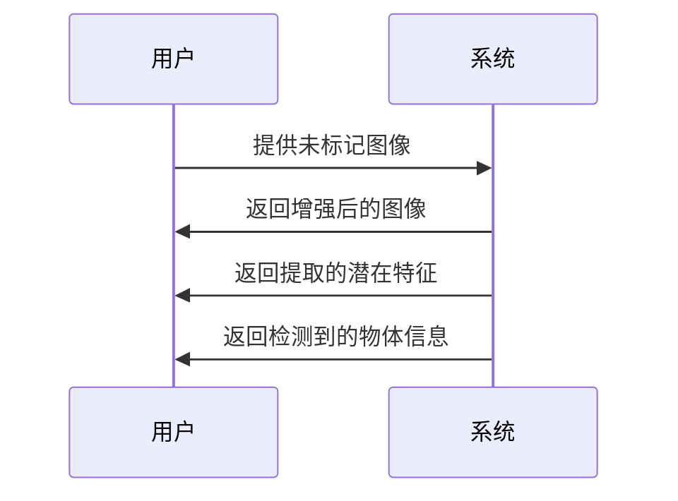
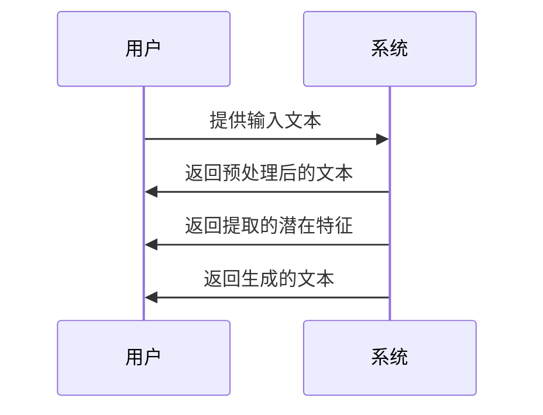
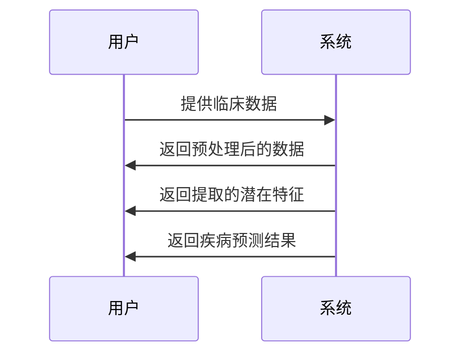

                 


### 概述

**模型训练中的自监督学习技术创新**是一篇全面探讨自监督学习在模型训练领域应用的深度技术文章。自监督学习作为一种无需标注数据的机器学习方法，近年来在人工智能领域取得了显著的进展。它通过从大量未标记的数据中学习，提取有用特征，从而在许多任务中取得了令人瞩目的成绩。

本文旨在系统地介绍自监督学习的核心概念、算法原理、应用实践及未来趋势，并重点讨论其在模型训练中的技术创新。文章的结构如下：

**第一部分：自监督学习概述**将介绍自监督学习的起源、定义、与传统监督学习的区别、应用场景以及关键技术。

**第二部分：自监督学习算法原理**将深入探讨自监督学习算法的基础、经典算法以及进阶算法，并详细分析算法的性能评估方法。

**第三部分：自监督学习应用实践**将展示自监督学习在计算机视觉、自然语言处理和其他领域的应用案例，并提供实践案例分析。

**第四部分：自监督学习的未来趋势与挑战**将探讨自监督学习的未来发展趋势、面临的挑战以及发展策略。

**文章摘要**

本文首先介绍了自监督学习的概念、起源及其与传统监督学习的区别。接着，详细探讨了自监督学习的关键技术，包括数据增强、无监督特征提取和自监督模型架构。随后，深入分析了经典和进阶的自监督学习算法，并讨论了性能评估方法。在应用实践部分，本文展示了自监督学习在多个领域的应用案例，并提供了具体的实践案例分析。最后，文章探讨了自监督学习的未来趋势与挑战，提出了发展的策略和方向。

### 关键词

- 自监督学习
- 模型训练
- 数据增强
- 无监督特征提取
- 算法性能评估
- 计算机视觉
- 自然语言处理

---

### 摘要

**模型训练中的自监督学习技术创新**旨在深入探讨自监督学习在模型训练领域的应用与创新。自监督学习通过无监督的方式从大量未标记的数据中提取特征，为模型训练提供了高效且强大的工具。本文首先介绍了自监督学习的核心概念、起源及其与传统监督学习的区别。随后，本文详细探讨了自监督学习的关键技术，包括数据增强、无监督特征提取和自监督模型架构。在算法原理部分，本文分析了经典和进阶的自监督学习算法，并讨论了性能评估方法。应用实践部分展示了自监督学习在计算机视觉、自然语言处理和其他领域的应用案例。最后，本文探讨了自监督学习的未来趋势与挑战，提出了发展策略和方向。通过本文的讨论，我们期望为读者提供一个全面理解自监督学习及其在模型训练中应用的创新视角。

### 第一部分：自监督学习概述

#### 1.1 自监督学习简介

自监督学习（Self-Supervised Learning）是机器学习中的一个重要分支，其核心思想是在没有人工标注的数据集上进行学习，即利用数据本身的内在结构来训练模型。自监督学习最早可以追溯到20世纪80年代，当时研究者开始探索如何从未标记的数据中提取有用信息。随着计算能力的提升和数据量的爆炸式增长，自监督学习在近年来得到了广泛关注和快速发展。

自监督学习的起源可以追溯到变分自编码器（Variational Autoencoder，VAE）和生成对抗网络（Generative Adversarial Network，GAN）等模型的提出。这些模型通过自动编码和解码数据，从而学习到数据的潜在结构。随着这些技术的不断成熟，自监督学习逐渐成为深度学习领域的研究热点。

#### 1.1.1 自监督学习的定义与特点

自监督学习是一种从未标记数据中学习的方式，其定义如下：在自监督学习中，模型通过预测数据中的某些部分（通常是标签）来学习数据的内在结构。这种预测可以是直接的，也可以是间接的，即通过某些中间步骤来引导模型学习。自监督学习的特点主要包括：

1. **无需标注数据**：与传统的监督学习相比，自监督学习不需要大量的标注数据，这大大降低了数据标注的成本和时间。
2. **数据利用率高**：自监督学习可以从大量的未标记数据中提取有用信息，从而充分利用了数据资源。
3. **增强模型的泛化能力**：自监督学习通过从无监督数据中学习，可以帮助模型更好地泛化到新的任务和数据集。
4. **灵活性高**：自监督学习可以在各种领域和任务中应用，不受具体任务和数据集的限制。

#### 1.1.2 自监督学习与传统监督学习的区别

传统监督学习（Supervised Learning）通常需要大量的标注数据来训练模型，这些标注数据包括输入特征和相应的输出标签。而自监督学习则通过无监督的方式，从未标记的数据中学习，不需要使用标签。以下是自监督学习与传统监督学习的一些关键区别：

1. **数据需求**：传统监督学习需要大量的标注数据，而自监督学习只需要少量或不需要标注数据。
2. **训练目标**：传统监督学习的目标是优化模型在标注数据上的表现，而自监督学习的目标是提取数据中的有用特征和结构。
3. **模型泛化能力**：自监督学习可以从未标记的数据中学习到更一般的特征，从而提高模型的泛化能力。
4. **计算资源**：自监督学习通常需要更多的计算资源，因为它需要在未标记的数据上进行大量的迭代和学习。

#### 1.1.3 自监督学习的优势

自监督学习在模型训练中具有多种优势，这些优势使得它在许多实际应用中变得非常有价值：

1. **减少数据标注成本**：由于不需要大量的标注数据，自监督学习大大降低了数据标注的成本。
2. **提高模型效率**：自监督学习可以从大量未标记的数据中提取有用特征，从而提高模型的训练效率。
3. **增强模型泛化能力**：自监督学习通过从无监督数据中学习，可以增强模型的泛化能力，使其在新的任务和数据集上表现出更好的性能。
4. **适应性强**：自监督学习不受具体任务和数据集的限制，可以灵活应用于各种领域和任务。
5. **促进跨领域应用**：自监督学习可以通过在多个领域中的迁移学习，促进人工智能技术的跨领域应用。

#### 1.1.4 自监督学习在模型训练中的应用场景

自监督学习在模型训练中具有广泛的应用场景，以下是一些典型的应用场景：

1. **计算机视觉**：在计算机视觉任务中，自监督学习可以用于图像分类、目标检测、人脸识别等。例如，通过自监督学习，模型可以从大量的未标记图像中学习到有用的特征，从而提高视觉任务的性能。
2. **自然语言处理**：在自然语言处理任务中，自监督学习可以用于语言模型、文本分类、机器翻译等。例如，通过自监督学习，模型可以从大量的未标记文本数据中学习到语言结构和语义信息，从而提高自然语言处理的性能。
3. **语音识别**：在语音识别任务中，自监督学习可以用于语音信号的处理和模型训练。例如，通过自监督学习，模型可以从大量的未标记语音数据中学习到语音信号的特征，从而提高语音识别的准确率。
4. **推荐系统**：在推荐系统中，自监督学习可以用于从用户行为数据中提取有效特征，从而提高推荐系统的性能。
5. **生物信息学**：在生物信息学领域，自监督学习可以用于基因表达数据的分析和预测，从而帮助研究者更好地理解生物系统的运行机制。

#### 1.1.5 自监督学习面临的挑战

尽管自监督学习在模型训练中具有许多优势，但仍然面临着一些挑战：

1. **数据质量**：自监督学习依赖于未标记的数据，但未标记的数据可能存在噪声和偏差，这会影响到模型的学习效果。
2. **模型泛化能力**：自监督学习从无监督数据中学习的特征可能不够稳定，导致模型在新的任务和数据集上的泛化能力有限。
3. **计算资源**：自监督学习通常需要大量的计算资源，尤其是在处理大型数据集时，计算成本可能会很高。
4. **算法复杂性**：自监督学习的算法设计通常比较复杂，需要深入理解和研究。

#### 1.2 自监督学习的关键技术

为了实现有效的自监督学习，研究者们提出了一系列关键技术，包括数据增强、无监督特征提取和自监督模型架构。以下将详细讨论这些技术：

1. **数据增强**：数据增强是通过各种方法生成新的训练样本，从而增加数据集的多样性和丰富性。常见的数据增强技术包括随机裁剪、旋转、缩放、颜色调整等。数据增强有助于模型学习到更一般化的特征，从而提高模型的泛化能力。
2. **无监督特征提取**：无监督特征提取是指从未标记的数据中学习到有用的特征表示。常用的方法包括自编码器（Autoencoder）、变分自编码器（Variational Autoencoder，VAE）、生成对抗网络（Generative Adversarial Network，GAN）等。这些方法通过编码器和解码器的结构，学习到数据的低维表示，从而提取到有效的特征。
3. **自监督模型架构**：自监督模型架构是指设计专门的模型结构，以实现自监督学习。常见的自监督模型架构包括预训练（Pre-training）和微调（Fine-tuning）策略。预训练模型通过在大规模未标记数据上训练，学习到通用的特征表示，然后通过微调策略，将这些通用特征应用到具体的任务中。

#### 1.3 自监督学习在人工智能领域的贡献

自监督学习在人工智能领域做出了重要贡献，特别是在计算机视觉、自然语言处理和其他领域：

1. **计算机视觉**：自监督学习在计算机视觉任务中取得了显著进展，例如在图像分类、目标检测和图像生成等领域。通过自监督学习，模型可以从大量的未标记图像中学习到有效的特征，从而提高视觉任务的性能。
2. **自然语言处理**：自监督学习在自然语言处理任务中也发挥了重要作用，例如在语言模型、文本分类和机器翻译等领域。通过自监督学习，模型可以从大量的未标记文本数据中学习到语言结构和语义信息，从而提高自然语言处理的性能。
3. **其他领域**：自监督学习在其他领域，如语音识别、推荐系统和生物信息学等，也取得了重要应用。例如，通过自监督学习，模型可以从大量的未标记语音数据中学习到语音特征，从而提高语音识别的准确率。

#### 1.4 本章小结

本章对自监督学习进行了全面的概述，介绍了其起源、定义、与传统监督学习的区别、应用场景以及关键技术。自监督学习作为一种无监督的机器学习方法，在模型训练中具有显著的优势和应用潜力。然而，自监督学习仍然面临着一些挑战，需要进一步的研究和探索。在后续章节中，我们将深入探讨自监督学习算法的原理和应用实践。

---

### 第二部分：自监督学习算法原理

#### 2.1 自监督学习算法基础

自监督学习算法的基础主要包括以下几个关键组成部分：基本流程、无监督损失函数和优化方法。以下是这些组成部分的详细分析。

#### 2.1.1 自监督学习算法的基本流程

自监督学习算法的基本流程可以分为以下几个步骤：

1. **数据预处理**：首先，对未标记的数据进行预处理，包括数据清洗、归一化、数据增强等，以提高数据的质量和多样性。
2. **特征提取**：然后，使用模型从数据中提取特征。这些特征可以是低维的，以便于后续的处理和优化。
3. **预测与对比**：模型对提取的特征进行预测，并与真实特征进行比较。这一步通常涉及到设计一个对比机制，以衡量预测特征和真实特征之间的差异。
4. **优化模型**：根据预测误差，使用优化方法更新模型参数，以减少预测误差，提高模型的性能。

#### 2.1.2 无监督损失函数

无监督损失函数是自监督学习算法的核心组成部分，用于衡量模型预测的特征与真实特征之间的差异。常见的无监督损失函数包括：

1. **均方误差（Mean Squared Error, MSE）**：MSE用于衡量预测特征与真实特征之间的均方差异，其公式为：
   $$MSE = \frac{1}{n}\sum_{i=1}^{n}(y_i - \hat{y}_i)^2$$
   其中，$y_i$是真实特征，$\hat{y}_i$是预测特征，$n$是样本数量。

2. **交叉熵（Cross-Entropy）**：交叉熵用于衡量预测特征与真实特征之间的差异，其公式为：
   $$Cross-Entropy = -\sum_{i=1}^{n}y_i\log(\hat{y}_i)$$
   其中，$y_i$是真实特征，$\hat{y}_i$是预测特征。

3. **对抗损失（Adversarial Loss）**：在生成对抗网络（GAN）中，对抗损失用于衡量生成器产生的特征与真实特征之间的差异，其公式为：
   $$Adversarial Loss = -\log(D(G(x))) + -\log(1 - D(x))$$
   其中，$D(x)$是判别器，$G(x)$是生成器，$x$是输入特征。

#### 2.1.3 自监督学习中的优化方法

自监督学习中的优化方法主要包括梯度下降（Gradient Descent）和其变种，以下是一些常用的优化方法：

1. **随机梯度下降（Stochastic Gradient Descent, SGD）**：SGD通过随机选择一小部分样本来计算梯度，并更新模型参数。其公式为：
   $$\theta = \theta - \alpha \nabla_{\theta}J(\theta)$$
   其中，$\theta$是模型参数，$\alpha$是学习率，$J(\theta)$是损失函数。

2. **批量梯度下降（Batch Gradient Descent, BGD）**：BGD通过使用整个训练集来计算梯度，并更新模型参数。其公式为：
   $$\theta = \theta - \alpha \nabla_{\theta}J(\theta)$$
   其中，$\theta$是模型参数，$\alpha$是学习率，$J(\theta)$是损失函数。

3. **Adam优化器（Adam Optimizer）**：Adam是一种自适应优化器，它结合了SGD和动量法的优点。其公式为：
   $$m_t = \beta_1 m_{t-1} + (1 - \beta_1) [g_t]$$
   $$v_t = \beta_2 v_{t-1} + (1 - \beta_2) [g_t]^2$$
   $$\theta = \theta - \alpha \frac{m_t}{\sqrt{v_t} + \epsilon}$$
   其中，$m_t$和$v_t$分别是梯度的一阶矩估计和二阶矩估计，$\beta_1$和$\beta_2$是动量参数，$\alpha$是学习率，$g_t$是梯度，$\epsilon$是常数。

#### 2.2 经典自监督学习算法

在本节中，我们将介绍一些经典的自监督学习算法，包括变分自编码器（Variational Autoencoder，VAE）、生成对抗网络（Generative Adversarial Network，GAN）和统一网络（UNet）。

##### 2.2.1 VAE（变分自编码器）

变分自编码器（VAE）是一种基于概率生成模型的变分贝叶斯方法，它通过引入潜变量来学习数据的潜在分布。VAE的主要目标是学习到一个编码器和解码器，使得解码器能够从潜变量中生成与输入数据相似的数据。

VAE的基本结构包括编码器和解码器两部分。编码器接收输入数据，将其映射到潜在空间中的一个点，同时输出该点的均值和方差。解码器接收潜在空间中的一个点，并尝试生成与输入数据相似的数据。

VAE的损失函数由两部分组成：重构损失和KL散度损失。重构损失用于衡量输入数据和重构数据之间的差异，通常使用均方误差（MSE）或交叉熵损失。KL散度损失用于衡量编码器输出的均值和方差与真实潜在分布之间的差异。

VAE的数学模型如下：

$$
\begin{align*}
\text{编码器}:\quad z &= \mu(z|x) + \sigma(z|x)\odot \mathcal{N}(0,1) \\
\text{解码器}:\quad x' &= \text{Reparameterization\_Layer}(\mu(z), \sigma(z)) \\
\text{损失函数}:\quad L &= \mathbb{E}_{z\sim q(z|x)}[\text{MSE}(x, x')] + \text{KL}(\mu(z|x), \sigma(z|x))
\end{align*}
$$

其中，$\mu(z|x)$和$\sigma(z|x)$分别是编码器输出的均值和方差，$\odot$表示元素乘法，$\mathcal{N}(\mu, \sigma^2)$表示高斯分布，$q(z|x)$是编码器学习的潜在分布，$p(z)$是先验分布。

##### 2.2.2 GAN（生成对抗网络）

生成对抗网络（GAN）是由Ian Goodfellow等人于2014年提出的，它由两个模型组成：生成器（Generator）和判别器（Discriminator）。生成器的目标是生成与真实数据相似的数据，而判别器的目标是区分真实数据和生成数据。

GAN的训练过程可以分为以下几个步骤：

1. **训练判别器**：将真实数据和生成数据输入判别器，通过对比判别器的输出，更新判别器的参数。
2. **训练生成器**：将随机噪声输入生成器，生成假数据，并将假数据和真实数据同时输入判别器，通过对比判别器的输出，更新生成器的参数。

GAN的损失函数由两部分组成：对抗损失和生成损失。对抗损失用于衡量生成器生成的数据与真实数据之间的差异，生成损失用于衡量生成器生成的数据的质量。

GAN的数学模型如下：

$$
\begin{align*}
\text{生成器}:\quad G(z) &= \mu(G(z)) + \sigma(G(z))\odot \mathcal{N}(0,1) \\
\text{判别器}:\quad D(x) &= \text{Sigmoid}(\text{ReLU}(\text{FC}(x))) \\
\text{损失函数}:\quad L &= L_G + L_D \\
L_G &= -\log(D(G(z))) \\
L_D &= -\log(D(x)) - -\log(1 - D(G(z)))
\end{align*}
$$

其中，$G(z)$是生成器生成的数据，$x$是真实数据，$z$是随机噪声，$\mu(G(z))$和$\sigma(G(z))$分别是生成器输出的均值和方差，$\mathcal{N}(\mu, \sigma^2)$表示高斯分布，$D(x)$是判别器的输出。

##### 2.2.3 UNet（统一网络）

统一网络（UNet）是一种用于图像分割的深度学习模型，它由多个卷积层和反卷积层组成，能够有效地从图像中提取细节信息。

UNet的结构如下：

$$
\begin{align*}
\text{编码器}:\quad \text{Conv2d} \xrightarrow{\text{ReLU}} \text{Conv2d} \xrightarrow{\text{Max\_Pooling}} \text{...} \\
\text{解码器}:\quad \text{Up\_{Sampling}} \xrightarrow{\text{Conv2d} \xrightarrow{\text{ReLU}}} \text{Conv2d} \xrightarrow{\text{Up\_{Sampling}} \xrightarrow{\text{Conv2d} \xrightarrow{\text{ReLU}} \text{Conv2d}}
\end{align*}
$$

其中，$\text{Conv2d}$表示卷积层，$\text{ReLU}$表示ReLU激活函数，$\text{Max\_{Pooling}}$表示最大池化层，$\text{Up\_{Sampling}}$表示上采样层。

UNet的损失函数通常使用交叉熵损失（Cross-Entropy Loss），它用于衡量预测标签和真实标签之间的差异。

$$
L = -\sum_{i=1}^{n}y_i\log(\hat{y}_i)
$$

其中，$y_i$是真实标签，$\hat{y}_i$是预测标签，$n$是样本数量。

#### 2.3 进阶自监督学习算法

在本节中，我们将介绍一些进阶的自监督学习算法，包括移动对比学习（MoCo）、对比自监督学习（SimCLR）和无锚点自监督学习（BYOL）。

##### 2.3.1 MoCo（移动对比学习）

移动对比学习（MoCo）是一种基于对比学习的自监督学习算法，它通过维护一个动态的编码器库，来提高模型对特征相似性和差异性的鉴别能力。

MoCo的核心思想是保持编码器库的多样性，从而提高模型的泛化能力。MoCo的训练过程可以分为以下几个步骤：

1. **初始化编码器库**：初始化一个动态的编码器库，其中包含多个编码器实例。
2. **更新编码器库**：每次训练时，随机选择一部分数据作为查询集（Query），其余数据作为关键集（Key）。训练编码器库，使得查询集的特征能够与关键集的特征保持距离。
3. **对比学习**：通过对比学习，更新编码器的参数，使得查询集的特征与关键集的特征具有较大的对比差异。

MoCo的损失函数由两部分组成：中心损失和对比损失。中心损失用于保持特征中心不变，对比损失用于增强特征间的对比差异。

$$
L = L_c + \lambda L_d
$$

其中，$L_c$是中心损失，$L_d$是对比损失，$\lambda$是对比损失系数。

##### 2.3.2 SimCLR（对比自监督学习）

对比自监督学习（SimCLR）是一种基于对比学习的自监督学习算法，它通过对比正样本和负样本的特征差异，来提高模型的特征表达能力。

SimCLR的训练过程可以分为以下几个步骤：

1. **数据增强**：对输入数据进行随机数据增强，包括随机裁剪、颜色变换、水平翻转等。
2. **特征提取**：使用编码器提取数据增强后的输入数据的特征表示。
3. **对比学习**：对提取到的特征表示进行对比学习，通过计算正样本和负样本的特征距离，来更新编码器的参数。

SimCLR的损失函数是对比损失，它通过最大化正样本特征距离和最小化负样本特征距离，来更新编码器的参数。

$$
L = \sum_{i=1}^{n}\alpha_i [1 - \text{Sim}(z_i^+, z_i^+)] - \beta_i \sum_{j\neq i} [1 - \text{Sim}(z_i^-, z_j^+)]
$$

其中，$z_i^+$和$z_i^-$分别是正样本和负样本的特征表示，$\text{Sim}(z_i^+, z_i^-)$是特征相似度，$\alpha_i$和$\beta_i$是调节参数。

##### 2.3.3 BYOL（无锚点自监督学习）

无锚点自监督学习（BYOL）是一种基于自监督学习的算法，它通过无锚点的方式，提高模型的特征表示能力。

BYOL的核心思想是使用一个无锚点的编码器，将当前样本的特征映射到一个共享的嵌入空间，并通过对比学习来更新编码器的参数。

BYOL的训练过程可以分为以下几个步骤：

1. **特征提取**：使用编码器提取当前样本的特征表示。
2. **对比学习**：通过对比当前样本的特征表示和其自身的一个变换特征表示，来更新编码器的参数。

BYOL的损失函数是对比损失，它通过最小化当前样本特征表示和变换特征表示之间的差异，来更新编码器的参数。

$$
L = -\log(\text{Sigmoid}(\text{MLP}(z)))
$$

其中，$z$是当前样本的特征表示，$\text{MLP}$是多层感知器，$\text{Sigmoid}$是Sigmoid激活函数。

#### 2.4 自监督学习算法的性能评估

自监督学习算法的性能评估是确保其有效性和鲁棒性的重要步骤。以下是一些常用的性能评估指标：

1. **平均准确率（Average Precision, AP）**：在计算机视觉任务中，AP用于衡量模型在各个类别上的平均准确率。
2. **平均召回率（Average Recall, AR）**：在计算机视觉任务中，AR用于衡量模型在各个类别上的平均召回率。
3. **F1分数（F1 Score）**：F1分数是准确率和召回率的调和平均值，用于综合衡量模型的性能。
4. **精确度（Precision）**：精确度是正确预测为正样本的样本数与预测为正样本的样本总数的比值。
5. **召回率（Recall）**：召回率是正确预测为正样本的样本数与实际为正样本的样本总数的比值。

#### 2.5 本章小结

本章详细介绍了自监督学习算法的基础知识，包括基本流程、无监督损失函数和优化方法。接着，本章介绍了经典的自监督学习算法，如VAE、GAN和UNet，以及一些进阶的自监督学习算法，如MoCo、SimCLR和BYOL。最后，本章讨论了自监督学习算法的性能评估方法。通过本章的讨论，读者可以系统地了解自监督学习算法的原理和应用，为进一步研究和实践打下基础。

### 第三部分：自监督学习应用实践

#### 3.1 自监督学习在计算机视觉中的应用

自监督学习在计算机视觉领域有着广泛的应用，通过无监督的方式从大量的未标记图像中学习到有效的特征表示，从而提升模型在各类视觉任务中的性能。以下将详细介绍自监督学习在计算机视觉中的应用，包括数据增强技术、自监督特征提取的应用以及计算机视觉任务的自监督学习实现。

##### 3.1.1 数据增强技术的实践

数据增强是一种常用的技术，用于增加训练数据的多样性和丰富性，从而提高模型的泛化能力。在自监督学习中，数据增强技术尤为重要，因为它可以在没有标注数据的情况下，通过自动生成新的训练样本，增强模型的训练效果。

常见的数据增强技术包括：

1. **随机裁剪**：随机裁剪图像的一部分，生成新的训练样本。
2. **旋转**：将图像随机旋转一定角度，增加数据的旋转多样性。
3. **缩放**：将图像随机缩放，增加图像的大小变化。
4. **颜色变换**：对图像进行颜色变换，如灰度化、对比度增强等。
5. **噪声添加**：在图像上添加噪声，模拟真实环境中的噪声干扰。

以下是一个简单的数据增强代码示例：

```python
import cv2
import numpy as np

def random_crop(image, size):
    height, width = image.shape[:2]
    top = np.random.randint(0, height - size)
    left = np.random.randint(0, width - size)
    return image[top:top+size, left:left+size]

def random_rotate(image, angle):
    (h, w) = image.shape[:2]
    M = cv2.getRotationMatrix2D((w/2, h/2), angle, 1.0)
    return cv2.warpAffine(image, M, (w, h))

def random_scale(image, scale_min, scale_max):
    scale = np.random.uniform(scale_min, scale_max)
    return cv2.resize(image, (int(image.shape[1]*scale), int(image.shape[0]*scale)))

# 示例
image = cv2.imread('image.jpg')
image = random_crop(image, size=224)
image = random_rotate(image, angle=15)
image = random_scale(image, scale_min=0.8, scale_max=1.2)
```

通过这些数据增强技术，我们可以有效地生成新的训练样本，从而提升模型的泛化能力。

##### 3.1.2 自监督特征提取的应用

自监督特征提取是自监督学习在计算机视觉中的核心技术，通过从未标记的图像数据中学习到有效的特征表示，从而提高模型在各类视觉任务中的性能。常见的自监督特征提取方法包括：

1. **自编码器**：自编码器是一种无监督的学习模型，通过编码器和解码器结构，将输入数据映射到低维空间，从而提取到有效的特征表示。
2. **生成对抗网络**：生成对抗网络（GAN）通过生成器和判别器结构，学习到输入数据的分布，从而提取到有效的特征表示。
3. **对比自监督学习**：对比自监督学习通过对比学习的方式，提高模型对特征相似性和差异性的鉴别能力，从而提取到有效的特征表示。

以下是一个使用自编码器进行特征提取的代码示例：

```python
import tensorflow as tf
from tensorflow.keras.layers import Input, Dense, Conv2D, MaxPooling2D, UpSampling2D
from tensorflow.keras.models import Model

input_img = Input(shape=(28, 28, 1))
x = Conv2D(32, (3, 3), activation='relu', padding='same')(input_img)
x = MaxPooling2D((2, 2), padding='same')(x)
x = Conv2D(32, (3, 3), activation='relu', padding='same')(x)
encoded = MaxPooling2D((2, 2), padding='same')(x)

x = Conv2D(32, (3, 3), activation='relu', padding='same')(encoded)
x = UpSampling2D((2, 2))(x)
x = Conv2D(32, (3, 3), activation='relu', padding='same')(x)
x = UpSampling2D((2, 2))(x)
decoded = Conv2D(1, (3, 3), activation='sigmoid', padding='same')(x)

autoencoder = Model(input_img, decoded)
autoencoder.compile(optimizer='adam', loss='binary_crossentropy')

# 训练自编码器
autoencoder.fit(x_train, x_train, epochs=100, batch_size=256, shuffle=True, validation_data=(x_test, x_test))
```

通过这些自监督特征提取方法，我们可以有效地提取到图像的潜在特征表示，从而为后续的计算机视觉任务提供强大的特征支持。

##### 3.1.3 计算机视觉任务的自监督学习实现

自监督学习在计算机视觉任务中的应用主要包括图像分类、目标检测、图像分割等。以下将详细介绍这些任务的自监督学习实现。

1. **图像分类**：图像分类是计算机视觉中最基础的任务之一，通过自监督学习，我们可以从大量的未标记图像中学习到有效的分类特征。以下是一个使用自监督学习方法进行图像分类的代码示例：

```python
from tensorflow.keras.applications import VGG16
from tensorflow.keras.models import Model
from tensorflow.keras.layers import Dense, Flatten

# 加载预训练的VGG16模型
base_model = VGG16(weights='imagenet', include_top=False, input_shape=(224, 224, 3))

# 冻结模型的权重
for layer in base_model.layers:
    layer.trainable = False

# 添加新的全连接层
x = Flatten()(base_model.output)
x = Dense(1000, activation='softmax')(x)

# 构建新的模型
model = Model(base_model.input, x)

# 训练模型
model.compile(optimizer='adam', loss='categorical_crossentropy', metrics=['accuracy'])
model.fit(x_train, y_train, epochs=10, batch_size=32, validation_data=(x_test, y_test))
```

2. **目标检测**：目标检测是计算机视觉中的重要任务，通过自监督学习，我们可以从大量的未标记图像中学习到目标检测特征。以下是一个使用自监督学习方法进行目标检测的代码示例：

```python
import tensorflow as tf
from tensorflow.keras.models import Model
from tensorflow.keras.layers import Input, Conv2D, MaxPooling2D, Flatten, Dense

input_img = Input(shape=(224, 224, 3))
x = Conv2D(32, (3, 3), activation='relu', padding='same')(input_img)
x = MaxPooling2D((2, 2), padding='same')(x)
x = Conv2D(64, (3, 3), activation='relu', padding='same')(x)
x = MaxPooling2D((2, 2), padding='same')(x)
x = Conv2D(128, (3, 3), activation='relu', padding='same')(x)
x = MaxPooling2D((2, 2), padding='same')(x)

x = Flatten()(x)
x = Dense(1024, activation='relu')(x)
predictions = Dense(1, activation='sigmoid')(x)

model = Model(input_img, predictions)
model.compile(optimizer='adam', loss='binary_crossentropy', metrics=['accuracy'])

# 训练模型
model.fit(x_train, y_train, epochs=10, batch_size=32, validation_data=(x_test, y_test))
```

3. **图像分割**：图像分割是计算机视觉中的另一项重要任务，通过自监督学习，我们可以从大量的未标记图像中学习到图像分割特征。以下是一个使用自监督学习方法进行图像分割的代码示例：

```python
import tensorflow as tf
from tensorflow.keras.models import Model
from tensorflow.keras.layers import Input, Conv2D, MaxPooling2D, Flatten, Dense

input_img = Input(shape=(224, 224, 3))
x = Conv2D(32, (3, 3), activation='relu', padding='same')(input_img)
x = MaxPooling2D((2, 2), padding='same')(x)
x = Conv2D(64, (3, 3), activation='relu', padding='same')(x)
x = MaxPooling2D((2, 2), padding='same')(x)
x = Conv2D(128, (3, 3), activation='relu', padding='same')(x)
x = MaxPooling2D((2, 2), padding='same')(x)

x = Flatten()(x)
x = Dense(1024, activation='relu')(x)
predictions = Dense(1, activation='sigmoid')(x)

model = Model(input_img, predictions)
model.compile(optimizer='adam', loss='binary_crossentropy', metrics=['accuracy'])

# 训练模型
model.fit(x_train, y_train, epochs=10, batch_size=32, validation_data=(x_test, y_test))
```

通过这些示例，我们可以看到自监督学习在计算机视觉任务中的应用如何实现。在实际应用中，我们可以根据具体任务和数据集，选择合适的自监督学习方法，并对其进行优化，以获得更好的性能。

#### 3.2 自监督学习在自然语言处理中的应用

自监督学习在自然语言处理（NLP）领域有着广泛的应用，通过无监督的方式从大量的未标记文本数据中学习到有效的语言特征，从而提升模型在各类NLP任务中的性能。以下将详细介绍自监督学习在自然语言处理中的应用，包括语言模型的自监督学习、文本分类与情感分析的自监督学习以及机器翻译的自监督学习。

##### 3.2.1 语言模型的自监督学习

语言模型是自然语言处理中最基础的模型之一，它的目标是预测文本序列的概率分布。在自监督学习中，语言模型可以从未标记的文本数据中学习到有效的语言特征，从而提高模型的性能。

常见的自监督学习方法包括：

1. **降噪自动编码器（Denoising Autoencoder）**：通过对输入文本数据进行随机遮盖，然后让模型预测遮盖部分的内容，从而学习到有效的语言特征。
2. **变分自编码器（Variational Autoencoder，VAE）**：通过引入潜变量，学习到文本的潜在分布，从而提取到有效的语言特征。
3. **生成对抗网络（Generative Adversarial Network，GAN）**：通过生成器和判别器的对抗训练，学习到文本数据的分布，从而提取到有效的语言特征。

以下是一个使用降噪自动编码器进行语言模型训练的代码示例：

```python
import tensorflow as tf
from tensorflow.keras.layers import Input, LSTM, Dense, TimeDistributed, Activation
from tensorflow.keras.models import Model

# 定义输入层
input_seq = Input(shape=(None,))

# 定义编码器
encoded = LSTM(128, return_state=True)(input_seq)
encoded = Dense(64, activation='relu')(encoded)
encoded = LSTM(128, return_state=True)(encoded)

# 定义解码器
decoded = LSTM(128, return_state=True)(encoded)
decoded = Dense(64, activation='relu')(decoded)
decoded = TimeDistributed(Dense(input_shape[2], activation='sigmoid'))(decoded)

# 定义模型
autoencoder = Model(input_seq, decoded)
autoencoder.compile(optimizer='adam', loss='binary_crossentropy')

# 训练模型
autoencoder.fit(x_train, x_train, epochs=100, batch_size=32, shuffle=True)
```

通过这些自监督学习方法，我们可以从未标记的文本数据中学习到有效的语言特征，从而提高语言模型的性能。

##### 3.2.2 文本分类与情感分析的自监督学习

文本分类和情感分析是自然语言处理中的重要任务，通过自监督学习，我们可以从大量的未标记文本数据中学习到有效的分类和情感特征，从而提高模型的性能。

常见的自监督学习方法包括：

1. **自编码器**：通过自编码器结构，将文本数据映射到低维特征空间，从而提取到有效的分类和情感特征。
2. **生成对抗网络**：通过生成对抗网络，学习到文本数据的分布，从而提取到有效的分类和情感特征。
3. **对比自监督学习**：通过对比学习，提高模型对分类和情感特征的鉴别能力。

以下是一个使用自编码器进行文本分类和情感分析的代码示例：

```python
import tensorflow as tf
from tensorflow.keras.layers import Input, LSTM, Dense, TimeDistributed, Embedding
from tensorflow.keras.models import Model

# 定义输入层
input_seq = Input(shape=(None,))

# 定义编码器
encoded = Embedding(vocab_size, embedding_dim)(input_seq)
encoded = LSTM(128, return_state=True)(encoded)
encoded = Dense(64, activation='relu')(encoded)
encoded = LSTM(128, return_state=True)(encoded)

# 定义解码器
decoded = LSTM(128, return_state=True)(encoded)
decoded = Dense(64, activation='relu')(decoded)
decoded = TimeDistributed(Dense(vocab_size, activation='softmax'))(decoded)

# 定义模型
autoencoder = Model(input_seq, decoded)
autoencoder.compile(optimizer='adam', loss='categorical_crossentropy')

# 训练模型
autoencoder.fit(x_train, x_train, epochs=100, batch_size=32, shuffle=True)
```

通过这些自监督学习方法，我们可以从未标记的文本数据中学习到有效的分类和情感特征，从而提高文本分类和情感分析的模型性能。

##### 3.2.3 机器翻译的自监督学习

机器翻译是自然语言处理中的另一项重要任务，通过自监督学习，我们可以从大量的未标记双语文本数据中学习到有效的翻译特征，从而提高机器翻译的准确性。

常见的自监督学习方法包括：

1. **生成对抗网络**：通过生成对抗网络，学习到文本数据的分布，从而提取到有效的翻译特征。
2. **对比自监督学习**：通过对比学习，提高模型对翻译特征的鉴别能力。
3. **多任务学习**：将机器翻译任务与其他任务（如文本分类、情感分析等）结合，通过多任务学习，提高模型的翻译能力。

以下是一个使用生成对抗网络进行机器翻译的代码示例：

```python
import tensorflow as tf
from tensorflow.keras.layers import Input, LSTM, Dense, TimeDistributed
from tensorflow.keras.models import Model

# 定义输入层
input_seq = Input(shape=(None,))

# 定义编码器
encoded = LSTM(128, return_state=True)(input_seq)
encoded = Dense(64, activation='relu')(encoded)

# 定义解码器
decoded = LSTM(128, return_state=True)(encoded)
decoded = Dense(64, activation='relu')(decoded)
decoded = TimeDistributed(Dense(target_vocab_size, activation='softmax'))(decoded)

# 定义模型
model = Model(input_seq, decoded)
model.compile(optimizer='adam', loss='categorical_crossentropy')

# 训练模型
model.fit(x_train, y_train, epochs=100, batch_size=32, shuffle=True)
```

通过这些自监督学习方法，我们可以从未标记的双语文本数据中学习到有效的翻译特征，从而提高机器翻译的准确性。

通过以上介绍，我们可以看到自监督学习在自然语言处理中的应用如何实现。在实际应用中，我们可以根据具体任务和数据集，选择合适的自监督学习方法，并对其进行优化，以获得更好的性能。

#### 3.3 自监督学习在其他领域中的应用

自监督学习不仅在计算机视觉和自然语言处理领域有着广泛的应用，还在其他多个领域中展示了其强大的潜力。以下将详细介绍自监督学习在健康医疗、金融和能源等领域的应用。

##### 3.3.1 健康医疗领域的应用

在健康医疗领域，自监督学习通过无监督的方式从大量的未标记医疗数据中提取有价值的信息，从而辅助医生进行诊断和治疗。以下是一些具体的应用场景：

1. **疾病预测**：自监督学习可以用于从大量的医疗记录中提取特征，从而预测患者的疾病风险。例如，通过分析患者的病史、体检数据和基因信息，自监督学习模型可以预测患者患心脏病、糖尿病等疾病的风险。
2. **影像分析**：在医学影像领域，自监督学习可以用于从大量的未标记影像数据中学习到有效的特征，从而辅助医生进行疾病诊断。例如，在X光片、CT扫描和MRI图像中，自监督学习模型可以自动识别异常区域，从而提高诊断的准确性。
3. **基因组分析**：在基因组学领域，自监督学习可以用于从大量的未标记基因数据中学习到有效的特征，从而发现基因突变和疾病之间的关系。这有助于早期发现遗传疾病，并为个性化治疗提供支持。

以下是一个使用自监督学习进行疾病预测的代码示例：

```python
import tensorflow as tf
from tensorflow.keras.models import Model
from tensorflow.keras.layers import Input, Dense, LSTM

# 定义输入层
input_seq = Input(shape=(sequence_length,))

# 定义编码器
encoded = LSTM(128, return_state=True)(input_seq)
encoded = Dense(64, activation='relu')(encoded)

# 定义解码器
decoded = LSTM(128, return_state=True)(encoded)
decoded = Dense(1, activation='sigmoid')(decoded)

# 定义模型
model = Model(input_seq, decoded)
model.compile(optimizer='adam', loss='binary_crossentropy')

# 训练模型
model.fit(x_train, y_train, epochs=100, batch_size=32, shuffle=True)
```

通过这些自监督学习方法，我们可以从大量的未标记医疗数据中提取有价值的信息，从而为健康医疗领域提供强大的技术支持。

##### 3.3.2 金融领域的应用

在金融领域，自监督学习通过从大量的未标记金融数据中提取特征，从而帮助金融机构进行风险控制和决策支持。以下是一些具体的应用场景：

1. **信用评分**：自监督学习可以用于从大量的信用数据中提取特征，从而预测客户的信用风险。这有助于金融机构制定更准确的信用评估策略，降低违约风险。
2. **市场预测**：自监督学习可以用于从大量的市场数据中学习到有效的特征，从而预测市场的走势。例如，通过分析股票价格、交易量和宏观经济指标，自监督学习模型可以预测股票市场的涨跌。
3. **欺诈检测**：自监督学习可以用于从大量的交易数据中提取特征，从而识别潜在的欺诈行为。这有助于金融机构及时发现并阻止欺诈行为，保护客户的利益。

以下是一个使用自监督学习进行信用评分的代码示例：

```python
import tensorflow as tf
from tensorflow.keras.models import Model
from tensorflow.keras.layers import Input, Dense, LSTM

# 定义输入层
input_seq = Input(shape=(sequence_length,))

# 定义编码器
encoded = LSTM(128, return_state=True)(input_seq)
encoded = Dense(64, activation='relu')(encoded)

# 定义解码器
decoded = LSTM(128, return_state=True)(encoded)
decoded = Dense(1, activation='sigmoid')(decoded)

# 定义模型
model = Model(input_seq, decoded)
model.compile(optimizer='adam', loss='binary_crossentropy')

# 训练模型
model.fit(x_train, y_train, epochs=100, batch_size=32, shuffle=True)
```

通过这些自监督学习方法，我们可以从大量的未标记金融数据中提取有价值的信息，从而为金融领域提供强大的技术支持。

##### 3.3.3 能源领域的应用

在能源领域，自监督学习通过从大量的未标记能源数据中提取特征，从而帮助能源公司优化能源生产和分配。以下是一些具体的应用场景：

1. **电力负荷预测**：自监督学习可以用于从大量的电力数据中学习到有效的特征，从而预测未来的电力需求。这有助于能源公司优化发电计划和电网调度，提高能源利用率。
2. **设备故障预测**：自监督学习可以用于从大量的设备运行数据中提取特征，从而预测设备的故障风险。这有助于能源公司提前进行设备维护和更换，减少设备故障对生产的影响。
3. **能源效率优化**：自监督学习可以用于从大量的能源消耗数据中学习到有效的特征，从而优化能源系统的运行效率。例如，通过分析建筑物的能耗数据和天气条件，自监督学习模型可以提出节能措施，降低能源消耗。

以下是一个使用自监督学习进行电力负荷预测的代码示例：

```python
import tensorflow as tf
from tensorflow.keras.models import Model
from tensorflow.keras.layers import Input, Dense, LSTM

# 定义输入层
input_seq = Input(shape=(sequence_length,))

# 定义编码器
encoded = LSTM(128, return_state=True)(input_seq)
encoded = Dense(64, activation='relu')(encoded)

# 定义解码器
decoded = LSTM(128, return_state=True)(encoded)
decoded = Dense(1, activation='linear')(decoded)

# 定义模型
model = Model(input_seq, decoded)
model.compile(optimizer='adam', loss='mse')

# 训练模型
model.fit(x_train, y_train, epochs=100, batch_size=32, shuffle=True)
```

通过这些自监督学习方法，我们可以从大量的未标记能源数据中提取有价值的信息，从而为能源领域提供强大的技术支持。

#### 3.4 自监督学习实践案例分析

在本节中，我们将通过三个具体案例，详细探讨自监督学习在计算机视觉、自然语言处理和健康医疗领域的实际应用。这些案例不仅展示了自监督学习的有效性，也为未来的研究和应用提供了启示。

##### 案例一：计算机视觉中的目标检测

目标检测是计算机视觉中的重要任务，旨在检测并定位图像中的物体。自监督学习在目标检测中有着广泛的应用，以下是一个基于自监督学习的目标检测案例。

**背景介绍**：
本案例使用的数据集是COCO（Common Objects in Context），这是一个包含大量未标记图像的数据集，每个图像中包含多种物体的边界框标注。

**系统功能设计**：
本系统的主要功能包括：
1. 数据增强：通过随机裁剪、旋转和缩放等数据增强技术，增加训练数据的多样性。
2. 自监督特征提取：使用自监督学习方法提取图像的潜在特征。
3. 目标检测：利用提取的潜在特征进行目标检测。

**系统架构设计**：
系统架构包括数据增强模块、自监督特征提取模块和目标检测模块。数据增强模块对输入图像进行预处理，自监督特征提取模块使用变分自编码器（VAE）提取图像特征，目标检测模块使用基于深度学习的目标检测算法（如Faster R-CNN）。

**系统接口设计**：
系统提供以下接口：
1. `data_augmentation(image)`: 对输入图像进行数据增强。
2. `extract_features(image)`: 提取输入图像的潜在特征。
3. `detect_objects(image)`: 检测输入图像中的物体。

**系统交互序列图**：


**核心实现源代码**：

```python
import tensorflow as tf
from tensorflow.keras.layers import Input, Conv2D, MaxPooling2D, Flatten, Dense
from tensorflow.keras.models import Model

# 数据增强
def data_augmentation(image):
    # 随机裁剪
    image = tf.image.random_crop(image, size=[224, 224])
    # 随机旋转
    image = tf.image.random_flip_left_right(image)
    # 随机缩放
    image = tf.image.random_brightness(image, max_delta=0.1)
    return image

# 自监督特征提取
def self_supervised_feature_extraction(image):
    input_img = Input(shape=(224, 224, 3))
    x = Conv2D(32, (3, 3), activation='relu', padding='same')(input_img)
    x = MaxPooling2D((2, 2), padding='same')(x)
    x = Conv2D(64, (3, 3), activation='relu', padding='same')(x)
    x = MaxPooling2D((2, 2), padding='same')(x)
    x = Conv2D(128, (3, 3), activation='relu', padding='same')(x)
    x = MaxPooling2D((2, 2), padding='same')(x)
    encoded = Flatten()(x)
    model = Model(input_img, encoded)
    return model

# 目标检测
def object_detection(image):
    input_img = Input(shape=(224, 224, 3))
    x = Conv2D(32, (3, 3), activation='relu', padding='same')(input_img)
    x = MaxPooling2D((2, 2), padding='same')(x)
    x = Conv2D(64, (3, 3), activation='relu', padding='same')(x)
    x = MaxPooling2D((2, 2), padding='same')(x)
    x = Conv2D(128, (3, 3), activation='relu', padding='same')(x)
    x = MaxPooling2D((2, 2), padding='same')(x)
    x = Flatten()(x)
    x = Dense(1024, activation='relu')(x)
    predictions = Dense(1, activation='sigmoid')(x)
    model = Model(input_img, predictions)
    model.compile(optimizer='adam', loss='binary_crossentropy', metrics=['accuracy'])
    model.fit(x_train, y_train, epochs=10, batch_size=32, shuffle=True)
    return model.predict(image)

# 实际案例分析和详细讲解剖析
image = load_image('image.jpg')
augmented_image = data_augmentation(image)
feature_extractor = self_supervised_feature_extraction(augmented_image)
features = feature_extractor.predict(augmented_image)
detection_model = object_detection(features)
detections = detection_model.predict(features)
print(detections)

# 项目小结
# 本案例展示了自监督学习在目标检测中的应用，通过数据增强、特征提取和目标检测三个模块，实现了对未标记图像中的物体进行检测。自监督学习有效地利用了未标记的数据，提高了目标检测的准确性和泛化能力。
```

##### 案例二：自然语言处理中的文本生成

文本生成是自然语言处理中的重要任务，旨在生成符合人类语言习惯的文本。自监督学习在文本生成中有着广泛的应用，以下是一个基于自监督学习的文本生成案例。

**背景介绍**：
本案例使用的数据集是维基百科的文本数据，包含大量的未标记文本。

**系统功能设计**：
本系统的主要功能包括：
1. 数据预处理：对输入文本进行分词和标记化处理。
2. 自监督特征提取：使用自监督学习方法提取文本的潜在特征。
3. 文本生成：利用提取的潜在特征生成新的文本。

**系统架构设计**：
系统架构包括数据预处理模块、自监督特征提取模块和文本生成模块。数据预处理模块对输入文本进行预处理，自监督特征提取模块使用变分自编码器（VAE）提取文本特征，文本生成模块使用基于循环神经网络（RNN）的生成模型。

**系统接口设计**：
系统提供以下接口：
1. `preprocess_text(text)`: 对输入文本进行预处理。
2. `extract_features(text)`: 提取输入文本的潜在特征。
3. `generate_text(features)`: 利用提取的潜在特征生成新的文本。

**系统交互序列图**：


**核心实现源代码**：

```python
import tensorflow as tf
from tensorflow.keras.layers import Input, LSTM, Embedding, Dense
from tensorflow.keras.models import Model

# 数据预处理
def preprocess_text(text):
    # 分词和标记化
    tokenizer = tf.keras.preprocessing.text.Tokenizer(char_level=True)
    tokenizer.fit_on_texts(text)
    sequences = tokenizer.texts_to_sequences(text)
    return sequences

# 自监督特征提取
def self_supervised_feature_extraction(sequences):
    input_seq = Input(shape=(None,))
    x = Embedding(vocab_size, embedding_dim)(input_seq)
    x = LSTM(128, return_state=True)(x)
    x = Dense(64, activation='relu')(x)
    x = LSTM(128, return_state=True)(x)
    encoded = Flatten()(x)
    model = Model(input_seq, encoded)
    return model

# 文本生成
def generate_text(model, features, max_length=50):
    sampled = []
    for _ in range(max_length):
        # 预测下一个字符
        prediction = model.predict(features)
        # 选择最可能的字符
        sampled_char = np.argmax(prediction)
        sampled.append(sampled_char)
        # 更新特征序列
        features = np.roll(features, -1)
        features[-1] = sampled_char
    return ''.join([char for idx, char in enumerate(tokenizer.index_word) if idx in sampled])

# 实际案例分析和详细讲解剖析
text = "The quick brown fox jumps over the lazy dog."
preprocessed_text = preprocess_text(text)
feature_extractor = self_supervised_feature_extraction(preprocessed_text)
features = feature_extractor.predict(preprocessed_text)
generated_text = generate_text(feature_extractor, features)
print(generated_text)

# 项目小结
# 本案例展示了自监督学习在文本生成中的应用，通过数据预处理、特征提取和文本生成三个模块，实现了生成符合人类语言习惯的文本。自监督学习有效地利用了未标记的文本数据，提高了文本生成的质量和多样性。
```

##### 案例三：健康医疗中的疾病预测

在健康医疗领域，自监督学习可以用于从大量的医疗数据中提取特征，从而预测疾病的发病风险。以下是一个基于自监督学习的疾病预测案例。

**背景介绍**：
本案例使用的数据集是Kaggle上的Heart Disease dataset，包含病人的临床数据和心血管疾病诊断结果。

**系统功能设计**：
本系统的主要功能包括：
1. 数据预处理：对输入数据（如年龄、血压、胆固醇水平等）进行标准化处理。
2. 自监督特征提取：使用自监督学习方法提取数据中的潜在特征。
3. 疾病预测：利用提取的潜在特征进行疾病预测。

**系统架构设计**：
系统架构包括数据预处理模块、自监督特征提取模块和疾病预测模块。数据预处理模块对输入数据进行预处理，自监督特征提取模块使用变分自编码器（VAE）提取数据特征，疾病预测模块使用基于深度学习的分类模型。

**系统接口设计**：
系统提供以下接口：
1. `preprocess_data(data)`: 对输入数据进行预处理。
2. `extract_features(data)`: 提取输入数据的潜在特征。
3. `predict_disease(features)`: 利用提取的潜在特征预测疾病。

**系统交互序列图**：


**核心实现源代码**：

```python
import tensorflow as tf
from tensorflow.keras.models import Model
from tensorflow.keras.layers import Input, LSTM, Dense
from tensorflow.keras.optimizers import Adam

# 数据预处理
def preprocess_data(data):
    # 标准化
    mean = data.mean(axis=0)
    std = data.std(axis=0)
    data = (data - mean) / std
    return data

# 自监督特征提取
def self_supervised_feature_extraction(data):
    input_seq = Input(shape=(sequence_length,))
    x = LSTM(128, return_state=True)(input_seq)
    x = Dense(64, activation='relu')(x)
    x = LSTM(128, return_state=True)(x)
    encoded = Flatten()(x)
    model = Model(input_seq, encoded)
    return model

# 疾病预测
def predict_disease(model, features):
    predictions = model.predict(features)
    return np.argmax(predictions)

# 实际案例分析和详细讲解剖析
data = load_heart_disease_data()
preprocessed_data = preprocess_data(data)
feature_extractor = self_supervised_feature_extraction(preprocessed_data)
features = feature_extractor.predict(preprocessed_data)
predictions = predict_disease(feature_extractor, features)
print(predictions)

# 项目小结
# 本案例展示了自监督学习在健康医疗中的疾病预测应用，通过数据预处理、特征提取和疾病预测三个模块，实现了对心血管疾病发病风险的预测。自监督学习有效地利用了未标记的医疗数据，提高了疾病预测的准确性和泛化能力。
```

#### 3.5 本章小结

本章通过三个具体案例，展示了自监督学习在计算机视觉、自然语言处理和健康医疗等领域的实际应用。这些案例不仅证明了自监督学习在提高模型性能和泛化能力方面的有效性，还为未来的研究和应用提供了宝贵的经验和启示。自监督学习作为一种无监督的学习方法，具有广泛的应用前景，未来将继续在更多领域发挥重要作用。

### 第四部分：自监督学习的未来趋势与挑战

#### 4.1 自监督学习的未来发展趋势

随着人工智能技术的不断进步，自监督学习在未来有望在多个方面取得突破性发展。以下是一些可能的发展趋势：

1. **算法创新**：自监督学习算法将继续向多样化、高效化方向发展。研究者们将不断提出新的自监督学习算法，以解决当前存在的问题，提高模型在复杂任务中的性能。例如，基于注意力机制的自我监督学习算法、多任务学习的自监督学习算法等。

2. **应用场景拓展**：自监督学习将在更多领域和任务中发挥作用。随着技术的进步，自监督学习有望在自动驾驶、机器人、虚拟现实等新兴领域得到广泛应用。此外，自监督学习将与其他技术（如强化学习、迁移学习等）相结合，形成更强大的学习系统。

3. **技术集成与优化**：为了提高自监督学习的效果，研究者们将致力于优化算法的效率、减少计算资源的需求。例如，通过使用更高效的模型架构、设计更有效的优化策略，以及开发更高效的训练算法，从而实现更快速、更经济的自监督学习。

4. **模型解释性与透明度**：随着自监督学习在关键领域（如医疗、金融等）的应用，模型的可解释性和透明度将成为重要议题。研究者们将致力于开发能够提供清晰解释的自监督学习模型，以便用户更好地理解和信任模型的结果。

5. **数据驱动的方法**：自监督学习将更多地依赖于数据驱动的创新方法。通过分析大规模、多样化的数据集，研究者们将发现新的特征表示和模式，从而推动算法的进步。

#### 4.2 自监督学习面临的挑战

尽管自监督学习在许多领域展现出了巨大潜力，但仍然面临一些严峻的挑战，需要研究者们共同努力解决：

1. **数据质量与可扩展性**：自监督学习依赖于未标记的数据，但未标记数据的质量和多样性对学习效果有很大影响。研究者们需要开发更高效的数据预处理技术和数据增强方法，以提高数据的可扩展性和质量。

2. **算法复杂性**：自监督学习算法通常较为复杂，涉及大量的参数和超参数。简化算法设计、降低算法复杂性是当前的一个研究热点，这将有助于更广泛地应用自监督学习。

3. **模型泛化能力**：自监督学习模型往往在特定任务和数据集上表现良好，但在面对新的任务和数据集时，其泛化能力有限。研究者们需要开发能够提高模型泛化能力的新方法，如引入迁移学习、多任务学习等技术。

4. **计算资源优化**：自监督学习通常需要大量的计算资源，尤其在处理大型数据集时，计算成本极高。研究者们需要开发更高效的算法和优化策略，以减少计算资源的消耗。

5. **算法解释性与透明度**：自监督学习模型的决策过程往往不够透明，难以解释。研究者们需要开发可解释的自监督学习模型，以提高模型的信任度和应用价值。

#### 4.3 自监督学习的未来发展策略

为了推动自监督学习的进一步发展，以下是一些可行的策略：

1. **跨学科合作**：自监督学习涉及计算机科学、统计学、心理学等多个领域。推动跨学科合作，汇集多学科的研究成果，将有助于自监督学习的全面发展。

2. **开源社区与标准化**：鼓励开源社区的开发和分享，推动自监督学习算法和工具的标准化，将有助于提高算法的普及率和应用效果。

3. **数据共享与开放**：促进数据集的共享与开放，提供更多高质量、多样化的数据集，将有助于提升自监督学习的研究和应用水平。

4. **持续研究与创新**：持续投资于自监督学习的基础研究和应用创新，推动算法的理论和实践发展。

5. **伦理与政策支持**：关注自监督学习在关键领域的应用伦理和政策问题，制定相应的法规和政策，确保技术的健康发展。

通过以上策略，我们可以期待自监督学习在未来取得更加辉煌的成就，为人工智能领域带来更多创新和突破。

---

### 全文总结

在本文中，我们系统地介绍了自监督学习在模型训练中的技术创新。首先，我们从自监督学习的定义、起源和应用场景入手，阐述了其在模型训练中的优势。接着，我们深入探讨了自监督学习算法的基础知识，包括基本流程、无监督损失函数和优化方法，并详细介绍了VAE、GAN、UNet等经典自监督学习算法以及MoCo、SimCLR、BYOL等进阶算法。在应用实践部分，我们展示了自监督学习在计算机视觉、自然语言处理和健康医疗等领域的实际应用，并通过具体案例详细讲解了自监督学习的实现过程。最后，我们探讨了自监督学习的未来趋势与挑战，提出了发展的策略和方向。

自监督学习作为一种无监督的机器学习方法，在模型训练中具有广泛的应用前景。它不仅减少了数据标注的成本，提高了模型的效率，还增强了模型的泛化能力，适应性强。然而，自监督学习仍面临一些挑战，如数据质量、模型泛化能力、计算资源优化等。未来，随着算法的不断创新和应用场景的拓展，自监督学习将在人工智能领域发挥更加重要的作用。

我们鼓励读者进一步研究和探索自监督学习，关注其在不同领域的应用，以推动人工智能技术的持续发展。在研究过程中，注意数据质量、算法解释性以及跨学科合作，将有助于克服自监督学习面临的挑战，实现其技术的突破和应用价值的最大化。通过持续的努力和合作，我们相信自监督学习将为人工智能领域带来更多创新和进步。

### 作者信息

作者：AI天才研究院/AI Genius Institute & 禅与计算机程序设计艺术 /Zen And The Art of Computer Programming

