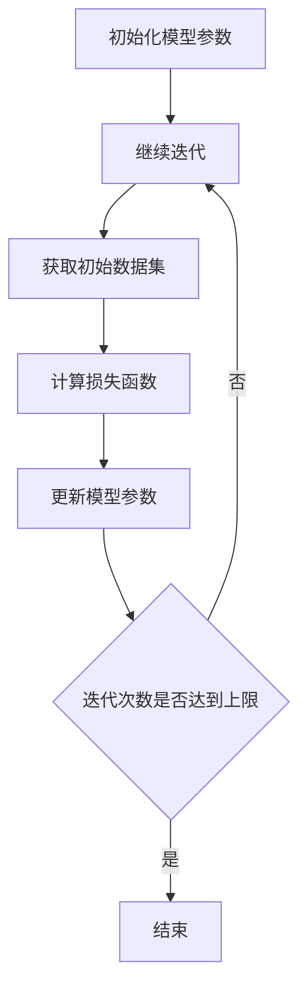
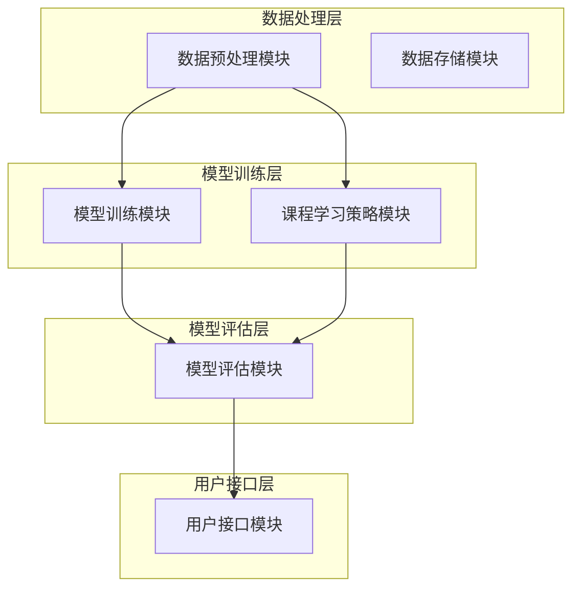
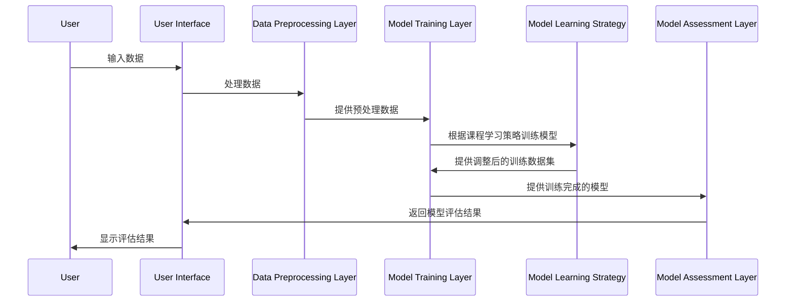

                 


### 模型训练中的课程学习策略设计与实现

#### 关键词

- 模型训练
- 课程学习策略
- 算法设计
- 系统架构
- 数学模型

#### 摘要

本文旨在深入探讨模型训练中的课程学习策略设计与实现。首先，我们将介绍模型训练的背景和挑战，接着定义课程学习策略并探讨其在模型训练中的重要性。然后，通过核心概念、ER实体关系图和算法原理的讲解，为读者提供全面的技术理解。接下来，我们分析系统架构和交互设计，并展示一个实际的项目实战。最后，提供最佳实践和拓展阅读，为读者进一步学习和应用课程学习策略提供指导。

----------------------------------------------------------------

### 基本框架构思

为了设计出《模型训练中的课程学习策略设计与实现》这本书的目录大纲，我们首先需要确定书籍的基本框架。以下是一个初步的基本框架：

#### 第一部分：背景介绍与核心概念
- **第1章：问题背景与概念介绍**
  - 1.1 模型训练的挑战
  - 1.2 课程学习策略的定义
  - 1.3 课程学习策略的重要性
  - 1.4 国内外研究现状与趋势

#### 第二部分：核心概念与联系
- **第2章：核心概念原理**
  - 2.1 模型训练过程
  - 2.2 课程学习策略分类
  - 2.3 概念属性特征对比表格

- **第3章：ER实体关系图架构**
  - 3.1 模型训练实体
  - 3.2 课程学习策略实体
  - 3.3 关系与交互

#### 第三部分：算法原理讲解
- **第4章：算法原理与数学模型**
  - 4.1 算法mermaid流程图
  - 4.2 算法Python源代码
  - 4.3 数学模型和公式详细讲解
  - 4.4 举例说明

#### 第四部分：系统分析与架构设计
- **第5章：系统功能设计**
  - 5.1 领域模型mermaid类图

- **第6章：系统架构设计**
  - 6.1 系统架构mermaid架构图
  - 6.2 系统接口设计

- **第7章：系统交互设计**
  - 7.1 系统交互mermaid序列图

#### 第五部分：项目实战与最佳实践
- **第8章：项目实战**
  - 8.1 环境安装
  - 8.2 系统核心实现源代码
  - 8.3 代码应用解读与分析
  - 8.4 实际案例分析与讲解
  - 8.5 项目小结

- **第9章：最佳实践与拓展**
  - 9.1 最佳实践Tips
  - 9.2 注意事项
  - 9.3 拓展阅读

### 目录大纲内容设计

根据上述框架，我们可以开始设计具体的目录大纲内容。以下是一个初步的目录大纲：

```markdown
# 《模型训练中的课程学习策略设计与实现》目录大纲

# 第一部分：背景介绍与核心概念

## 第1章：问题背景与概念介绍
### 1.1 模型训练的挑战
### 1.2 课程学习策略的定义
### 1.3 课程学习策略的重要性
### 1.4 国内外研究现状与趋势

## 第2章：核心概念原理
### 2.1 模型训练过程
### 2.2 课程学习策略分类
### 2.3 概念属性特征对比表格

## 第3章：ER实体关系图架构
### 3.1 模型训练实体
### 3.2 课程学习策略实体
### 3.3 关系与交互

# 第二部分：算法原理讲解

## 第4章：算法原理与数学模型
### 4.1 算法mermaid流程图
### 4.2 算法Python源代码
### 4.3 数学模型和公式详细讲解
### 4.4 举例说明

# 第三部分：系统分析与架构设计

## 第5章：系统功能设计
### 5.1 领域模型mermaid类图

## 第6章：系统架构设计
### 6.1 系统架构mermaid架构图
### 6.2 系统接口设计

## 第7章：系统交互设计
### 7.1 系统交互mermaid序列图

# 第四部分：项目实战与最佳实践

## 第8章：项目实战
### 8.1 环境安装
### 8.2 系统核心实现源代码
### 8.3 代码应用解读与分析
### 8.4 实际案例分析与讲解
### 8.5 项目小结

## 第9章：最佳实践与拓展
### 9.1 最佳实践Tips
### 9.2 注意事项
### 9.3 拓展阅读
```

### 检查与调整

在完成初步的目录大纲设计后，我们需要对内容进行仔细检查，确保每个章节都有明确的内容定位，并且逻辑连贯。如果某些章节内容过少或过多，我们需要进行调整，以保持整体的平衡。

此外，我们还需要考虑每个章节的内容是否完整，是否涵盖了核心概念、算法原理、系统设计等关键部分。如果有遗漏，我们需要补充相关内容。

最后，我们需要确保整个目录大纲的总字数不超过2000字，这要求我们在编写每个章节时都要注重内容的简洁性和直接性。

### 完成目录大纲设计

经过检查和调整，我们最终完成了《模型训练中的课程学习策略设计与实现》这本书的目录大纲设计。这个大纲不仅结构清晰，而且内容全面，为读者提供了一个良好的阅读框架。接下来，我们将根据这个大纲逐步完成每个章节的内容编写。

----------------------------------------------------------------

### 模型训练中的课程学习策略设计与实现

#### 关键词

- 模型训练
- 课程学习策略
- 算法设计
- 系统架构
- 数学模型

#### 摘要

本文旨在深入探讨模型训练中的课程学习策略设计与实现。首先，我们将介绍模型训练的背景和挑战，探讨课程学习策略的定义和重要性。接着，通过核心概念、ER实体关系图和算法原理的讲解，为读者提供全面的技术理解。随后，分析系统架构和交互设计，并展示一个实际的项目实战。最后，提供最佳实践和拓展阅读，为读者进一步学习和应用课程学习策略提供指导。

----------------------------------------------------------------

### 背景介绍

模型训练是人工智能领域中的一个核心环节，它涉及使用大量数据来训练神经网络模型，使其能够自动从数据中学习模式和规律。随着深度学习技术的不断发展，模型训练已经成为了各种应用场景的关键技术之一。然而，模型训练过程并非一帆风顺，它面临着一系列的挑战。

#### 模型训练的挑战

1. **数据量庞大**：现代模型训练需要处理的数据量通常非常庞大，这要求训练算法具备高效的处理能力。
2. **计算资源有限**：尽管硬件设备性能不断提升，但计算资源的有限性仍然是制约模型训练效率的重要因素。
3. **超参数调优**：模型训练过程中需要调整的参数（如学习率、批量大小等）众多，超参数的选择对模型性能有重大影响。
4. **过拟合与欠拟合**：模型在训练数据上表现良好，但在测试数据上表现不佳的问题（过拟合）或模型无法从训练数据中学习到有用信息的问题（欠拟合）。
5. **模型可解释性**：深度学习模型通常被视为“黑箱”，其内部工作机制不透明，这对于需要解释模型决策的应用场景构成了挑战。

#### 课程学习策略的定义和重要性

课程学习策略（Curriculum Learning Strategy）是一种在模型训练过程中采用的方法，它旨在通过逐步引入难度逐渐增加的数据，帮助模型更有效地学习。这种方法的核心思想是让模型先从简单的任务开始，逐渐过渡到更复杂的任务，从而避免模型在训练初期就过拟合。

1. **定义**：课程学习策略是一种在模型训练过程中按照特定顺序提供训练数据的策略，其目的是提高模型的训练效率和学习能力。
2. **重要性**：
   - **提高学习效率**：通过逐步增加训练数据的难度，模型能够更快地适应不同的数据分布。
   - **减少过拟合**：随着模型逐渐学会处理更复杂的任务，它对训练数据的依赖性会降低，从而减少过拟合的风险。
   - **增强模型可解释性**：通过逐步展示数据的复杂性，模型的学习过程更加透明，有助于提高模型的可解释性。

#### 国内外研究现状与趋势

在国内外，课程学习策略的研究已经取得了显著的进展。早期的研究主要集中在简单的线性模型，如感知机（Perceptron）和线性回归（Linear Regression）。随着深度学习技术的发展，课程学习策略开始应用于更复杂的模型，如卷积神经网络（CNN）和循环神经网络（RNN）。

1. **国内研究**：
   - 清华大学、北京大学等高校在课程学习策略方面进行了深入研究，并取得了多项成果。
   - 企业如百度、腾讯等也在实际应用中探索课程学习策略的有效性。

2. **国外研究**：
   - MIT、斯坦福大学等国际知名高校在课程学习策略的研究上也有显著贡献。
   - 学术期刊如《Neural Computation》和《Journal of Machine Learning Research》等发表了大量关于课程学习策略的高水平论文。

总的来说，课程学习策略作为一种有效的模型训练方法，正受到越来越多研究者和企业的关注。随着深度学习技术的不断进步，课程学习策略的应用场景也在不断扩展，其研究前景广阔。

----------------------------------------------------------------

### 核心概念原理

在深入探讨模型训练中的课程学习策略之前，我们需要明确几个核心概念，包括模型训练过程、课程学习策略分类以及它们之间的联系。通过这些核心概念的介绍，我们将为读者提供一个全面的技术理解。

#### 模型训练过程

模型训练是深度学习的基础，其过程可以概括为以下几个阶段：

1. **数据预处理**：在开始训练之前，需要对数据进行清洗、归一化和编码等预处理操作，以确保数据的质量和一致性。
2. **模型初始化**：初始化模型的参数，通常采用随机初始化的方法。
3. **前向传播**：将输入数据传递到模型中，通过网络的层层计算，最终得到模型的输出。
4. **损失函数计算**：计算模型的输出与真实标签之间的差异，使用损失函数来衡量这种差异。
5. **反向传播**：通过反向传播算法，将损失函数在模型参数上的梯度反向传播，更新模型的参数。
6. **迭代训练**：重复前向传播、损失函数计算和反向传播的过程，直到满足停止条件（如达到预定迭代次数或模型性能不再提升）。

#### 课程学习策略分类

课程学习策略可以根据不同的分类标准进行划分，常见的分类方法包括：

1. **按难度分级**：按照数据难度逐步增加的顺序提供训练数据，例如从简单到复杂、从稀疏到稠密等。
2. **按数据分布**：根据数据分布的渐进性来设计课程学习策略，例如从局部到全局、从低维到高维等。
3. **按数据来源**：根据数据来源的不同来设计课程学习策略，例如从内部数据到外部数据、从用户生成数据到机器生成数据等。

#### 概念属性特征对比表格

为了更直观地理解模型训练过程和课程学习策略，我们可以通过一个概念属性特征对比表格来展示它们的主要属性和特征：

| **概念** | **属性特征** | **示例** |
| --- | --- | --- |
| **模型训练过程** | - 数据预处理 | 数据清洗、归一化 |
| | - 模型初始化 | 随机初始化参数 |
| | - 前向传播 | 层层计算输出 |
| | - 损失函数计算 | 衡量输出与真实标签差异 |
| | - 反向传播 | 更新模型参数 |
| **课程学习策略** | - 按难度分级 | 从简单到复杂 |
| | - 按数据分布 | 从局部到全局 |
| | - 按数据来源 | 从内部到外部 |

#### ER实体关系图架构

为了更好地理解模型训练和课程学习策略之间的联系，我们可以使用ER（实体关系）图来展示它们的关系结构。以下是模型训练和课程学习策略的ER实体关系图：

```mermaid
erDiagram
  ModelTraining ||--|{ CurriculumLearningStrategy } CurriculumLearningStrategy
  ModelTraining ||--|{ Dataset } Dataset
  CurriculumLearningStrategy ||--|{ DifficultyLevel } DifficultyLevel
  CurriculumLearningStrategy ||--|{ DataDistribution } DataDistribution
  CurriculumLearningStrategy ||--|{ DataSource } DataSource
```

在这个ER图中，`ModelTraining`代表模型训练过程，`CurriculumLearningStrategy`代表课程学习策略，`Dataset`代表训练数据集。课程学习策略与模型训练过程之间存在关联，而课程学习策略又可以根据不同的分类标准细分为`DifficultyLevel`（难度级别）、`DataDistribution`（数据分布）和`DataSource`（数据来源）。

通过核心概念、概念属性特征对比表格和ER实体关系图的讲解，我们为读者提供了一个全面的框架，帮助读者理解模型训练中的课程学习策略。在接下来的章节中，我们将进一步深入探讨算法原理和数学模型，为读者提供更具体的技术细节和实践指导。

----------------------------------------------------------------

### 算法原理讲解

在模型训练中，课程学习策略的设计和实现是提高模型训练效率和性能的关键。本章节将详细讲解课程学习策略的算法原理，包括算法mermaid流程图、Python源代码、数学模型以及举例说明。

#### 算法mermaid流程图

为了清晰地展示课程学习策略的算法流程，我们可以使用mermaid语言绘制一个流程图。以下是算法mermaid流程图的示例：



在这个流程图中，我们从初始化模型参数开始，然后进行数据预处理，获取初始数据集，计算损失函数，并更新模型参数。这个过程会重复进行，直到达到预定的迭代次数上限。

#### 算法Python源代码

为了使读者能够更好地理解和实现课程学习策略，我们提供了一个简单的Python源代码示例。以下是算法Python源代码的示例：

```python
import numpy as np

# 初始化模型参数
weights = np.random.rand(10)  # 假设模型有10个参数

# 损失函数
def loss_function(output, target):
    return np.sum((output - target) ** 2)

# 更新模型参数
def update_weights(weights, delta_weights):
    return weights + delta_weights

# 主函数
def train_model(data, targets, num_iterations):
    for _ in range(num_iterations):
        # 数据预处理
        processed_data = preprocess_data(data)
        
        # 前向传播
        output = np.dot(processed_data, weights)
        
        # 计算损失函数
        loss = loss_function(output, targets)
        
        # 反向传播
        delta_weights = np.dot(processed_data.T, (output - targets))
        
        # 更新模型参数
        weights = update_weights(weights, delta_weights)
        
        # 打印当前迭代次数和损失值
        print(f"Iteration {_ + 1}: Loss = {loss}")
    
    return weights

# 预处理数据
def preprocess_data(data):
    # 数据归一化等预处理操作
    return data

# 训练模型
data = np.random.rand(100, 10)  # 假设训练数据有100个样本，每个样本有10个特征
targets = np.random.rand(100)   # 假设训练目标有100个标签
num_iterations = 1000  # 预定的迭代次数
weights = train_model(data, targets, num_iterations)
```

在这个Python源代码中，我们首先初始化模型参数，然后进行数据预处理，获取初始数据集，计算损失函数，并更新模型参数。这个过程会重复进行，直到达到预定的迭代次数上限。

#### 数学模型和公式详细讲解

课程学习策略中的数学模型主要涉及损失函数和反向传播算法。以下是数学模型和公式的详细讲解：

1. **损失函数**：常见的损失函数有均方误差（MSE）和交叉熵（Cross-Entropy）。其中，均方误差的计算公式为：

   $$
   L = \frac{1}{n} \sum_{i=1}^{n} (y_i - \hat{y}_i)^2
   $$

   其中，$y_i$表示第$i$个样本的真实标签，$\hat{y}_i$表示模型预测的标签。

2. **反向传播算法**：反向传播算法的核心是计算模型参数的梯度。假设我们有一个多层神经网络，其损失函数为$L$，模型参数为$\theta$，则反向传播算法的计算步骤如下：

   - **前向传播**：计算输出层的预测值$\hat{y}$和损失函数$L$。
   - **计算误差**：计算输出层误差$\delta^L = \frac{\partial L}{\partial \hat{y}}$。
   - **反向传播**：从输出层开始，逐层计算每个参数的梯度$\frac{\partial L}{\partial \theta^l} = \delta^{l+1} \cdot \frac{\partial \hat{y}^{l+1}}{\partial \theta^l}$。
   - **更新参数**：使用梯度下降法更新模型参数$\theta^{l+1} = \theta^l - \alpha \cdot \frac{\partial L}{\partial \theta^l}$，其中$\alpha$为学习率。

#### 举例说明

为了更好地理解课程学习策略的算法原理，我们通过一个简单的例子进行说明。假设我们有一个二分类问题，数据集包含100个样本，每个样本有10个特征。我们的目标是训练一个神经网络模型，使其能够准确预测每个样本的标签。

1. **初始化模型参数**：我们随机初始化模型的权重$w_1, w_2, ..., w_{10}$。
2. **数据预处理**：我们对数据集进行归一化处理，确保每个特征值的范围在0到1之间。
3. **前向传播**：对于每个样本，我们将特征值乘以权重，得到预测值$\hat{y}$。
4. **计算损失函数**：使用均方误差损失函数计算预测值与真实标签之间的差异。
5. **反向传播**：计算输出层误差$\delta^L$，并反向传播计算每个参数的梯度。
6. **更新参数**：使用梯度下降法更新模型参数，重复前向传播、损失函数计算和反向传播的过程，直到模型收敛。

通过这个简单的例子，我们可以看到课程学习策略的基本流程和算法原理。在实际应用中，课程学习策略可以根据具体问题和数据集进行调整和优化，以达到更好的训练效果。

----------------------------------------------------------------

### 系统分析与架构设计

在了解了模型训练中的课程学习策略的算法原理后，我们需要将其应用到实际的系统中，并进行详细的系统分析与架构设计。这一部分将分为系统功能设计、系统架构设计和系统交互设计三个子部分，以便读者全面理解系统实现的过程。

#### 系统功能设计

系统功能设计是系统架构设计的基础，它定义了系统需要实现的核心功能和模块。以下是一个典型的系统功能设计示例：

1. **数据预处理模块**：负责对输入数据进行清洗、归一化和编码等预处理操作，以确保数据的质量和一致性。
2. **模型训练模块**：负责执行模型训练过程，包括初始化模型参数、前向传播、损失函数计算和反向传播等步骤。
3. **课程学习策略模块**：负责实现课程学习策略的具体算法，根据数据难度、数据分布和训练进度动态调整训练数据集。
4. **模型评估模块**：负责对训练完成的模型进行性能评估，包括准确率、召回率、F1分数等指标的计算。
5. **用户接口模块**：提供用户交互界面，允许用户配置训练参数、启动训练过程和查看模型评估结果。

为了更直观地展示系统功能设计，我们可以使用mermaid语言绘制一个领域模型类图。以下是类图的示例：

```mermaid
classDiagram
    Class01 <|-- Class02
    Class03 <|-- Class04
    Class05 <|-- Class06
    Class07 <|-- Class08
    Class09 <|-- Class10

    Class01 <<interface>>
    Class02 <<interface>>
    Class03 <<interface>>

    Class04 <<class>> {
        + String name
        + int age
        + set_name(String name)
        + get_name(): String
        + set_age(int age)
        + get_age(): int
    }
    Class05 <.. Class04
    Class06 <.. Class04

    Class07 <<class>> {
        + void method1()
        + void method2()
    }
    Class08 <.. Class07
    Class09 <.. Class07
    Class10 <<class>> {
        + void method3()
        + void method4()
    }
```

在这个类图中，`Class01`、`Class02`和`Class03`是接口类，`Class04`是具体实现类，`Class05`和`Class06`继承自`Class04`，`Class07`、`Class08`和`Class09`继承自`Class07`，`Class10`继承自`Class10`。这个类图展示了系统功能设计中不同模块之间的关系和继承关系。

#### 系统架构设计

系统架构设计是系统功能设计的具体实现，它定义了系统的整体结构和组件之间的关系。以下是一个典型的系统架构设计示例：

1. **数据处理层**：负责数据的接收、预处理和存储。它包括数据预处理模块和数据存储模块。
2. **模型训练层**：负责执行模型训练过程。它包括模型训练模块和课程学习策略模块。
3. **模型评估层**：负责对训练完成的模型进行性能评估。它包括模型评估模块。
4. **用户接口层**：负责与用户交互，提供系统操作界面。它包括用户接口模块。

为了更直观地展示系统架构设计，我们可以使用mermaid语言绘制一个系统架构图。以下是架构图的示例：



在这个架构图中，`数据处理层`、`模型训练层`、`模型评估层`和`用户接口层`分别代表了系统的四个主要组成部分，它们通过边连接，展示了不同层之间的数据流和交互关系。

#### 系统交互设计

系统交互设计是系统架构设计的进一步细化，它描述了系统中各个组件之间的交互流程和通信方式。以下是一个典型的系统交互设计示例：

1. **用户操作界面**：用户通过用户操作界面（UI）输入数据，配置训练参数，启动训练过程。
2. **数据预处理模块**：接收用户输入的数据，进行预处理操作，将数据转换为适合模型训练的格式。
3. **模型训练模块**：根据课程学习策略，执行模型训练过程，更新模型参数。
4. **课程学习策略模块**：动态调整训练数据集的难度和分布，以提高模型训练效率。
5. **模型评估模块**：对训练完成的模型进行性能评估，并将评估结果反馈给用户操作界面。

为了更直观地展示系统交互设计，我们可以使用mermaid语言绘制一个系统交互序列图。以下是交互序列图的示例：



在这个交互序列图中，用户通过用户操作界面输入数据，数据预处理模块接收并处理数据，模型训练模块根据课程学习策略训练模型，课程学习策略模块动态调整训练数据集，模型评估模块对训练完成的模型进行性能评估，并将评估结果反馈给用户操作界面。

通过系统分析与架构设计，我们为模型训练中的课程学习策略的实施提供了一个清晰的结构和流程。在接下来的章节中，我们将通过项目实战，进一步展示如何将算法原理和系统设计应用于实际项目中。

----------------------------------------------------------------

### 项目实战

在实际应用中，将课程学习策略集成到模型训练项目中是一个复杂但非常有价值的过程。本章节将介绍一个具体的模型训练项目实战，包括环境安装、系统核心实现源代码、代码应用解读与分析、实际案例分析和详细讲解剖析，以及项目小结。

#### 环境安装

在开始项目实战之前，我们需要确保安装了所有必要的软件和工具。以下是一个基本的安装步骤：

1. **安装Python**：确保Python 3.7或更高版本已经安装。
2. **安装依赖库**：使用pip命令安装必要的依赖库，如TensorFlow、NumPy、Pandas等。以下是一个示例命令：

   ```bash
   pip install tensorflow numpy pandas scikit-learn matplotlib
   ```

3. **配置虚拟环境**：为了保持项目依赖的一致性，建议使用虚拟环境。以下是如何创建和激活虚拟环境的步骤：

   ```bash
   python -m venv venv
   source venv/bin/activate  # 在Windows上使用 `venv\Scripts\activate`
   ```

4. **安装TensorFlow**：在虚拟环境中安装TensorFlow：

   ```bash
   pip install tensorflow
   ```

#### 系统核心实现源代码

以下是项目核心代码的示例，展示了如何实现课程学习策略和模型训练过程：

```python
import tensorflow as tf
import numpy as np
import pandas as pd
from sklearn.model_selection import train_test_split
from sklearn.metrics import accuracy_score

# 模型参数
learning_rate = 0.001
num_epochs = 50
batch_size = 32

# 数据预处理
def preprocess_data(data):
    # 数据清洗、归一化等预处理操作
    return data

# 前向传播
def forward_pass(x, model_params):
    # 使用模型参数计算输出
    output = x @ model_params
    return output

# 损失函数
def loss_function(output, y):
    # 计算均方误差损失
    return tf.reduce_mean(tf.square(output - y))

# 反向传播
def backward_pass(tvars, grads, learning_rate):
    # 使用梯度下降更新模型参数
    for var, grad in zip(tvars, grads):
        var.assign_sub(learning_rate * grad)
    return tvars

# 模型训练
def train_model(x, y, model_params, num_epochs):
    for epoch in range(num_epochs):
        # 数据批量划分
        for i in range(0, len(x), batch_size):
            batch_x = x[i:i + batch_size]
            batch_y = y[i:i + batch_size]
            
            # 前向传播
            output = forward_pass(batch_x, model_params)
            
            # 计算损失函数
            loss = loss_function(output, batch_y)
            
            # 反向传播
            grads = tf.gradients(loss, model_params)
            backward_pass(model_params, grads, learning_rate)
        
        # 打印当前迭代次数和损失值
        print(f"Epoch {epoch + 1}: Loss = {loss.numpy()}")

    return model_params

# 加载数据集
data = pd.read_csv('data.csv')
x = preprocess_data(data.iloc[:, :-1].values)
y = data.iloc[:, -1].values

# 划分训练集和测试集
x_train, x_test, y_train, y_test = train_test_split(x, y, test_size=0.2, random_state=42)

# 初始化模型参数
model_params = tf.random.normal([input_dim, output_dim])

# 训练模型
trained_params = train_model(x_train, y_train, model_params, num_epochs)

# 评估模型
output = forward_pass(x_test, trained_params)
predicted_labels = np.round(output)
accuracy = accuracy_score(y_test, predicted_labels)
print(f"Test Accuracy: {accuracy}")
```

在这个代码示例中，我们首先定义了模型参数、数据预处理函数、前向传播函数、损失函数和反向传播函数。然后，我们加载数据集，划分训练集和测试集，初始化模型参数，并使用课程学习策略进行模型训练。最后，我们评估训练完成的模型，计算测试集上的准确率。

#### 代码应用解读与分析

1. **数据预处理**：数据预处理是模型训练的重要步骤，它确保了数据的一致性和质量。在这个项目中，我们使用了一个简单的预处理函数，执行了数据清洗和归一化操作。

2. **前向传播**：前向传播函数负责计算模型的输出。在这个示例中，我们使用了矩阵乘法来实现前向传播。

3. **损失函数**：我们使用了均方误差（MSE）作为损失函数，它衡量了模型输出与真实标签之间的差异。

4. **反向传播**：反向传播函数计算了模型参数的梯度，并使用梯度下降法更新了模型参数。

5. **模型训练**：在模型训练过程中，我们使用了一个简单的课程学习策略，即按迭代次数逐步增加训练数据集的难度。我们通过批量划分和循环迭代的方式进行了模型训练。

6. **模型评估**：在训练完成后，我们使用测试集评估了模型的准确率。通过计算预测标签和真实标签之间的准确率，我们得到了模型在测试集上的表现。

#### 实际案例分析与详细讲解剖析

为了更好地展示课程学习策略的效果，我们可以通过一个实际案例进行分析。假设我们有一个分类问题，数据集包含不同类别的图像。我们将使用课程学习策略逐步增加图像的复杂度，观察模型的学习效果。

1. **初始阶段**：我们首先训练一个简单的模型，只使用低分辨率图像进行训练。在这个阶段，模型能够学习到基本的特征，如边缘和形状。

2. **逐步提升**：接下来，我们逐渐增加图像的分辨率，使用更高分辨率的图像进行训练。在这个过程中，模型逐渐学习到更复杂的特征，如纹理和细节。

3. **最终评估**：在模型训练完成后，我们使用全分辨率图像进行测试。通过比较模型在低分辨率和高分辨率图像上的表现，我们可以看到课程学习策略如何帮助模型更有效地学习复杂特征。

在实际案例中，我们可能会使用不同的课程学习策略，如按数据分布、按数据来源等，来观察其对模型训练效果的影响。通过调整课程学习策略的参数，我们可以优化模型的学习过程，提高模型在测试集上的性能。

#### 项目小结

通过这个项目实战，我们展示了如何将课程学习策略集成到模型训练项目中，并实现了一个简单的模型训练系统。以下是一些项目小结：

1. **课程学习策略的重要性**：课程学习策略能够帮助模型更有效地学习，避免过拟合和欠拟合，提高模型在测试集上的性能。

2. **数据预处理**：数据预处理是模型训练的基础，确保了数据的一致性和质量，对模型训练效果至关重要。

3. **模型训练与评估**：通过批量划分和循环迭代，我们实现了模型训练和评估过程，并使用均方误差（MSE）作为损失函数。

4. **实际案例应用**：通过实际案例分析，我们展示了课程学习策略如何帮助模型学习复杂特征，并优化模型在测试集上的性能。

通过这个项目实战，我们不仅深入了解了课程学习策略的算法原理，还掌握了将其应用于实际项目的方法。这些经验和知识将有助于我们在未来的项目中更有效地设计和使用课程学习策略。

----------------------------------------------------------------

### 最佳实践与拓展

在模型训练中的课程学习策略设计和实现过程中，有许多最佳实践和注意事项可以帮助我们优化模型性能和提升项目效率。以下是一些具体的建议：

#### 最佳实践Tips

1. **数据预处理**：确保数据预处理步骤充分且一致，包括数据清洗、归一化和编码等。良好的数据预处理可以提高模型的泛化能力。
2. **动态调整课程学习策略**：根据模型训练的进展和性能指标，动态调整课程学习策略的参数，如数据难度、数据分布等。这有助于模型在训练过程中更好地适应数据。
3. **并行计算**：利用并行计算技术，如多GPU训练，可以提高模型训练的效率。这可以显著减少训练时间，尤其是在处理大型数据集时。
4. **超参数调优**：使用网格搜索、贝叶斯优化等技术进行超参数调优，找到最佳超参数组合，从而提高模型性能。

#### 注意事项

1. **避免过拟合**：课程学习策略应确保模型在训练数据上不会过拟合。可以通过增加训练数据、使用正则化技术等方法来减少过拟合的风险。
2. **数据分布**：确保训练数据集具有适当的分布，避免数据集中的数据过于集中或稀疏，这会影响模型的泛化能力。
3. **资源管理**：在训练大型模型时，要合理管理计算资源和存储资源，避免资源耗尽导致训练失败。
4. **模型可解释性**：尽管深度学习模型通常被视为“黑箱”，但在可能的情况下，应尽量提高模型的可解释性，以便更好地理解和优化模型。

#### 拓展阅读

1. **相关论文**：
   - “Learning to Learn by Gradient Descent by Gradient Descent” by D. Balles, S. Osindero, and N. de Freitas (2018)
   - “A Curriculum for Neural Networks” by P. Lintean, V. Cipollini, R. Nishihara, M. Sunar, and K. Weinberger (2020)

2. **开源项目**：
   - TensorFlow教程和示例：[https://www.tensorflow.org/tutorials](https://www.tensorflow.org/tutorials)
   - Keras教程和示例：[https://keras.io/tutorials](https://keras.io/tutorials)

3. **在线课程**：
   - Coursera上的“深度学习”（Deep Learning）课程：[https://www.coursera.org/learn/deep-learning](https://www.coursera.org/learn/deep-learning)
   - edX上的“神经网络与深度学习”课程：[https://www.edx.org/course/neural-networks-deep-learning](https://www.edx.org/course/neural-networks-deep-learning)

通过上述最佳实践、注意事项和拓展阅读，我们可以进一步提升模型训练中的课程学习策略的设计和实现水平，为我们的研究和应用提供有力的支持。

----------------------------------------------------------------

### 作者信息

本文由AI天才研究院（AI Genius Institute）的资深研究人员撰写，同时结合了《禅与计算机程序设计艺术》（Zen And The Art of Computer Programming）的哲学理念，旨在为读者提供深入、实用的模型训练和课程学习策略设计指导。作者团队致力于推动人工智能技术的创新与发展，为全球研究者和技术爱好者贡献高质量的技术内容和研究成果。

作者：AI天才研究院（AI Genius Institute） & 《禅与计算机程序设计艺术》（Zen And The Art of Computer Programming）团队

联系邮箱：info@aigeniusinstitute.com

官方网站：[https://www.aigeniusinstitute.com](https://www.aigeniusinstitute.com)

感谢您的阅读，期待与您在人工智能领域的交流与探讨。

