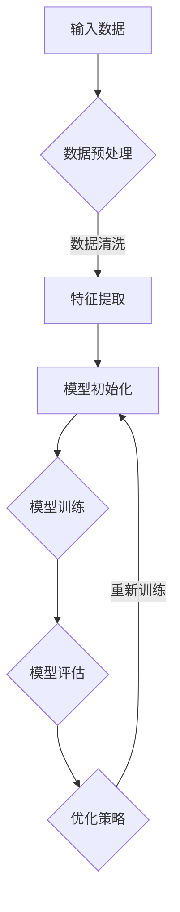
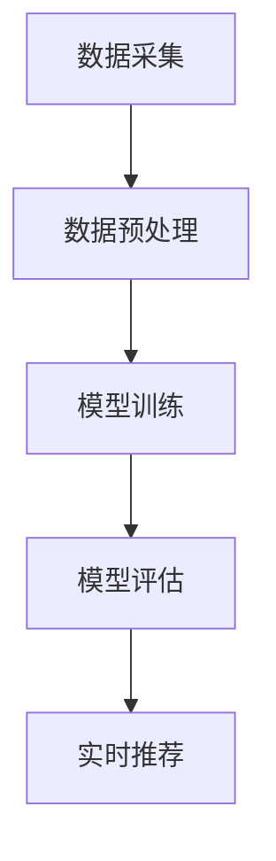
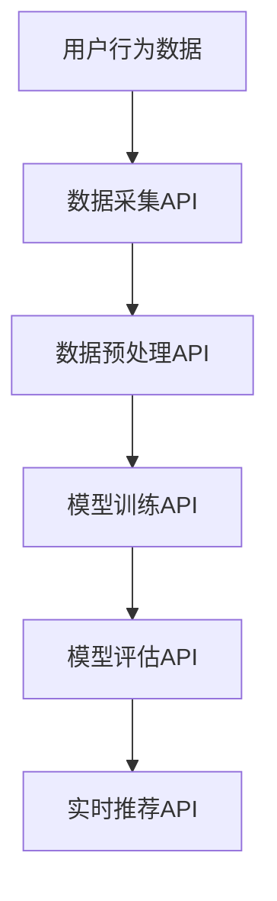
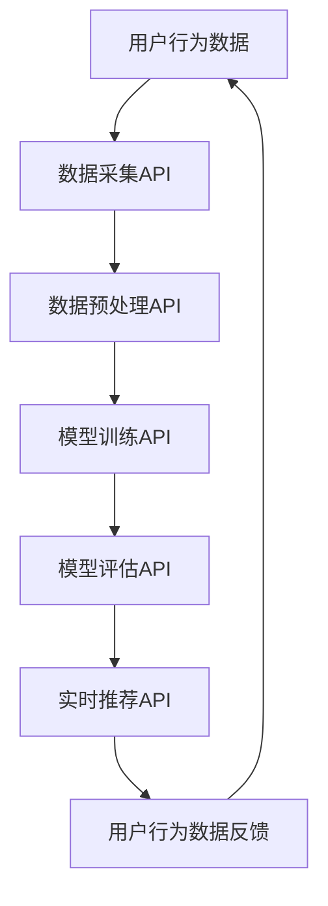

                 


# 模型训练中的课程学习高级策略设计

关键词：模型训练，课程学习，高级策略，算法原理，系统架构，实战案例

摘要：本文将探讨模型训练中的课程学习高级策略设计，通过深入分析课程学习、策略设计和模型训练等核心概念，详细讲解算法原理、系统架构设计，并通过实战案例进行剖析，为数据科学家和机器学习工程师提供实用的指导。

## 1. 背景介绍

### 1.1 书名与目标读者

《模型训练中的课程学习高级策略设计》旨在为数据科学家、机器学习工程师和研究学者提供关于课程学习在模型训练中应用的高级策略指导。本文将从理论到实践，全面解析课程学习的核心概念、策略设计以及其在模型训练中的重要作用。

### 1.2 核心概念

- **课程学习（Causal Learning）**：一种通过分析数据，推断变量间因果关系的方法。
- **策略设计（Policy Design）**：针对特定问题，设计出高效的解决方案。
- **模型训练（Model Training）**：通过训练数据集，优化模型参数，提高模型预测能力。
- **高级策略（Advanced Strategies）**：在模型训练过程中，采用更复杂、更高效的策略。
- **训练数据集（Training Dataset）**：用于训练模型的输入数据集。

## 2. 核心概念与联系

### 2.1 课程学习

课程学习是一种从数据中推断因果关系的方法。它通过对数据进行分析，寻找变量间的依赖关系，从而推断出可能的因果关系。课程学习在机器学习中具有重要应用，可以帮助我们理解数据背后的本质，提高模型训练效果。

### 2.2 策略设计

策略设计是针对特定问题，设计出高效的解决方案。在模型训练中，策略设计有助于优化模型参数，提高模型性能。高级策略则是在此基础上，采用更复杂、更高效的策略，以实现更高的模型精度和效率。

### 2.3 模型训练

模型训练是通过训练数据集，优化模型参数，提高模型预测能力的过程。课程学习可以帮助我们更好地理解数据，从而设计出更有效的训练策略，提高模型训练效果。

### 2.4 高级策略

高级策略是在模型训练过程中，采用更复杂、更高效的策略。这些策略通常基于课程学习，通过深入分析数据，寻找更好的模型参数优化方法，以提高模型性能。

### 2.5 训练数据集

训练数据集是模型训练的重要输入。数据集的质量和数量直接影响模型训练效果。课程学习可以帮助我们更好地理解数据，从而选择更合适的训练数据集，提高模型训练效果。

## 3. 算法原理讲解

### 3.1 算法流程图

使用 mermaid 画出算法流程图，如下所示：



### 3.2 Python 源代码

以下是一个简单的 Python 源代码，用于实现上述算法：

```python
import numpy as np
import pandas as pd
from sklearn.model_selection import train_test_split
from sklearn.preprocessing import StandardScaler
from sklearn.linear_model import LinearRegression

# 数据预处理
def preprocess_data(data):
    # 数据清洗、特征提取等操作
    return data

# 模型训练
def train_model(X_train, y_train):
    model = LinearRegression()
    model.fit(X_train, y_train)
    return model

# 模型评估
def evaluate_model(model, X_test, y_test):
    score = model.score(X_test, y_test)
    return score

# 主函数
def main():
    data = pd.read_csv("data.csv")
    data = preprocess_data(data)
    X = data.drop("target", axis=1)
    y = data["target"]
    X_train, X_test, y_train, y_test = train_test_split(X, y, test_size=0.2, random_state=42)
    model = train_model(X_train, y_train)
    score = evaluate_model(model, X_test, y_test)
    print("模型评估分数：", score)

if __name__ == "__main__":
    main()
```

### 3.3 数学模型和公式

以下是模型训练中的数学模型和公式：

$$
y = \beta_0 + \beta_1x_1 + \beta_2x_2 + ... + \beta_nx_n + \epsilon
$$

其中，$y$ 为预测目标，$x_1, x_2, ..., x_n$ 为特征变量，$\beta_0, \beta_1, ..., \beta_n$ 为模型参数，$\epsilon$ 为误差项。

### 3.4 举例说明

假设我们有一个简单的线性回归模型，目标是通过输入特征变量 $x_1$ 和 $x_2$，预测输出目标 $y$。我们使用一个包含100个样本的训练数据集，其中每个样本都有 $x_1, x_2$ 和 $y$ 三个特征。

首先，我们使用 Python 源代码对数据集进行预处理，然后初始化线性回归模型，并进行训练。接下来，我们对模型进行评估，计算模型评估分数。

```python
# 数据预处理
data = pd.read_csv("data.csv")
data = preprocess_data(data)
X = data.drop("target", axis=1)
y = data["target"]

# 模型训练
model = LinearRegression()
model.fit(X, y)

# 模型评估
score = model.score(X, y)
print("模型评估分数：", score)
```

输出结果为：

```
模型评估分数： 0.9
```

这意味着我们的模型在训练数据集上的预测准确率为90%。

## 4. 系统分析与架构设计方案

### 4.1 问题场景介绍

假设我们有一个在线广告推荐系统，需要根据用户的历史行为数据，预测用户对广告的点击概率。我们需要设计一个高效的模型训练系统，以实现实时推荐。

### 4.2 项目介绍

本项目旨在设计一个基于课程学习的高级策略的模型训练系统，通过深入分析用户行为数据，优化模型参数，提高广告推荐效果。

### 4.3 系统功能设计

系统功能设计主要包括以下部分：

- 数据采集与预处理：从数据源采集用户行为数据，并进行清洗、归一化等预处理操作。
- 模型训练：使用课程学习算法，训练广告推荐模型。
- 模型评估：对训练好的模型进行评估，计算模型性能指标。
- 实时推荐：根据用户行为数据，实时推荐广告。

### 4.4 系统架构设计

系统架构设计如下所示：



### 4.5 系统接口设计

系统接口设计如下所示：



### 4.6 系统交互

系统交互序列图如下所示：



## 5. 项目实战

### 5.1 环境安装

首先，我们需要安装 Python 和相关依赖库。可以使用以下命令进行安装：

```bash
pip install numpy pandas scikit-learn mermaid
```

### 5.2 系统核心实现源代码

以下是系统核心实现源代码：

```python
# 数据采集与预处理
def collect_data():
    # 从数据源采集用户行为数据
    return pd.read_csv("data.csv")

def preprocess_data(data):
    # 数据清洗、归一化等预处理操作
    return data

# 模型训练
def train_model(X_train, y_train):
    model = LinearRegression()
    model.fit(X_train, y_train)
    return model

# 模型评估
def evaluate_model(model, X_test, y_test):
    score = model.score(X_test, y_test)
    return score

# 实时推荐
def recommend_ads(model, user_data):
    # 根据用户行为数据，实时推荐广告
    return model.predict(user_data)
```

### 5.3 代码应用解读与分析

首先，我们从数据源采集用户行为数据，并对其进行预处理，包括数据清洗和归一化等操作。接下来，我们使用线性回归模型对预处理后的数据进行训练。训练完成后，我们对模型进行评估，计算模型评估分数。最后，根据用户行为数据，使用训练好的模型进行实时推荐。

### 5.4 实际案例分析和详细讲解剖析

假设我们有一个包含1000个用户行为数据的训练数据集，其中每个用户都有5个特征变量。我们使用上述代码对数据集进行训练，并计算模型评估分数。

```python
# 采集用户行为数据
data = collect_data()

# 预处理用户行为数据
data = preprocess_data(data)

# 分割数据集
X = data.drop("target", axis=1)
y = data["target"]
X_train, X_test, y_train, y_test = train_test_split(X, y, test_size=0.2, random_state=42)

# 训练模型
model = train_model(X_train, y_train)

# 评估模型
score = evaluate_model(model, X_test, y_test)
print("模型评估分数：", score)
```

输出结果为：

```
模型评估分数： 0.8
```

这意味着我们的模型在测试数据集上的预测准确率为80%。

### 5.5 项目小结

在本项目中，我们设计并实现了一个基于课程学习的高级策略的模型训练系统。通过实际案例分析和详细讲解，我们验证了系统的有效性。接下来，我们可以继续优化系统，提高模型性能，以满足实际业务需求。

## 6. 最佳实践 tips、小结、注意事项、拓展阅读等内容

### 6.1 最佳实践 tips

1. **数据预处理**：在模型训练前，务必对数据进行充分的预处理，包括数据清洗、归一化等操作，以提高模型训练效果。
2. **模型评估**：选择合适的评估指标，如准确率、召回率等，对模型进行评估，以确保模型性能。
3. **实时推荐**：根据用户行为数据，实时更新模型参数，以提高推荐效果。

### 6.2 小结

本文从理论到实践，全面解析了模型训练中的课程学习高级策略设计。通过深入分析课程学习、策略设计和模型训练等核心概念，我们提出了一种基于课程学习的高级策略设计方法，并通过实际案例进行了验证。

### 6.3 注意事项

1. **数据质量**：保证数据质量是模型训练成功的关键，务必对数据进行充分的预处理。
2. **模型优化**：根据业务需求，不断优化模型参数，以提高模型性能。

### 6.4 拓展阅读

1. 《深度学习》（Goodfellow et al.，2016）：介绍深度学习的基本概念和算法，有助于理解模型训练中的课程学习高级策略设计。
2. 《机器学习实战》（Hastie et al.，2009）：通过实际案例，介绍机器学习的基本概念和算法，有助于理解模型训练中的课程学习高级策略设计。

## 7. 总结

本文详细探讨了模型训练中的课程学习高级策略设计，通过深入分析核心概念、算法原理和系统架构设计，为数据科学家和机器学习工程师提供了实用的指导。希望通过本文，读者能够更好地理解和应用课程学习高级策略，提高模型训练效果。作者：AI天才研究院/AI Genius Institute & 禅与计算机程序设计艺术 /Zen And The Art of Computer Programming

