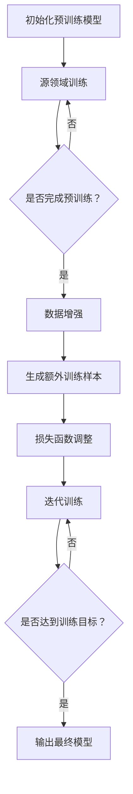
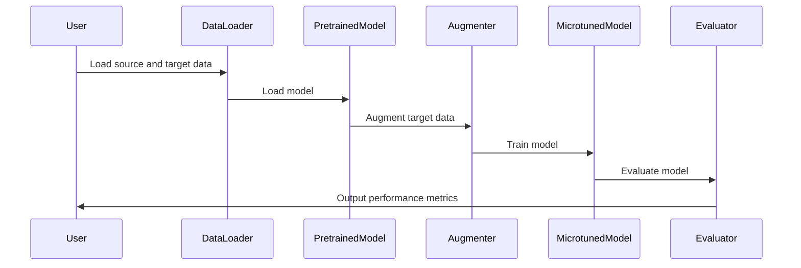

                 

### 书名与目的

本书《模型训练中的迁移学习策略在新领域快速适应中的优化》旨在深入探讨迁移学习策略在模型训练中的应用，以及如何在新领域快速适应中进行优化。迁移学习，作为一种重要的机器学习方法，能够在源领域已训练好的模型基础上，提升新领域模型的效果和训练效率。这种策略在当前快速变化的技术环境中尤为重要，因为新的领域和应用不断涌现，需要快速适应并实现高效训练。

本书的主要目标是帮助读者理解和掌握迁移学习的核心概念、算法原理及其在新领域快速适应中的应用技巧。通过系统的讲解和实际案例的剖析，读者将能够了解如何设计和优化迁移学习策略，以提高模型在新领域的表现。此外，本书还详细介绍了迁移学习中的数学模型和公式，为读者提供了全面的理论基础。

本书的读者对象包括但不限于机器学习工程师、数据科学家、AI研究者和相关专业的学生。无论读者是初学者还是有一定经验的专业人士，都能在本书中找到有价值的内容。对于初学者，本书从基础概念入手，逐步深入，帮助读者建立完整的知识体系；对于专业人士，本书提供了先进的算法原理和实践技巧，有助于在实际工作中实现高效的模型训练。

总之，本书不仅是一本理论性强、内容丰富的专业书籍，更是一本实用性极强的实践指南，旨在为读者在新领域模型训练中提供切实可行的优化策略。通过阅读本书，读者将能够更好地应对复杂多变的现实应用场景，提升模型训练的效果和效率。

### 迁移学习的背景与意义

迁移学习（Transfer Learning）作为机器学习中的一个重要分支，其基本思想是将在一个任务上已训练好的模型或特征提取器应用于另一个相关但不同的任务中。这一概念在深度学习领域尤为显著，因为深度神经网络具有很高的表示能力，能够在多个任务中共享和转移知识。

#### 迁移学习的基本概念

迁移学习的主要概念包括源领域（Source Domain）和目标领域（Target Domain）。源领域是指已经拥有大量数据、模型或特征的领域，而目标领域则是指需要应用已训练模型或特征的领域。迁移学习的目标是通过在源领域的学习来提高目标领域模型的性能。

迁移学习与传统的模型训练方法有所不同。在传统方法中，每个任务都需要从头开始训练，这通常需要大量数据和计算资源。而迁移学习通过在源领域上的预训练，可以减少在目标领域上的训练时间，提高模型的泛化能力。具体来说，迁移学习有以下几个核心概念：

1. **知识转移**：将源领域中的有用知识（如模型参数、特征表示等）转移到目标领域中。
2. **泛化能力**：通过迁移学习，模型能够在新的、未知的领域上表现出更高的泛化能力。
3. **适应性**：迁移学习使模型能够快速适应新的任务，减少从头训练所需的时间和资源。

#### 迁移学习的重要性

迁移学习在机器学习领域具有重要性，主要体现在以下几个方面：

1. **资源节省**：在目标领域数据较少或难以获取的情况下，迁移学习能够利用源领域的大量数据进行训练，从而节省数据收集和标注的成本。
2. **提高训练效率**：迁移学习通过在源领域上的预训练，可以加速目标领域的模型训练过程，提高训练效率。
3. **提升模型性能**：迁移学习能够提高模型在目标领域的性能，尤其是在小样本学习、少样本学习和跨域学习等场景中，迁移学习表现尤为出色。
4. **增强泛化能力**：迁移学习使模型能够在不同的任务中共享知识，从而增强模型的泛化能力，避免过拟合。

#### 迁移学习与领域自适应

领域自适应（Domain Adaptation）是迁移学习的一个子领域，主要关注如何在目标领域与源领域存在较大差异的情况下进行模型训练。领域自适应技术通过调整模型或特征，使得模型在目标领域上能够获得更好的表现。

领域自适应的关键技术包括：

1. **领域差异度量**：通过度量源领域与目标领域的差异，找出哪些特征或模型参数对目标领域更有贡献。
2. **领域平衡**：通过调整数据分布，使得源领域和目标领域的数据分布更加接近，从而减少领域差异。
3. **特征迁移**：通过迁移源领域的特征表示，减少目标领域中的领域差异。

总之，迁移学习作为一种重要的机器学习方法，不仅在资源节省、训练效率提升和模型性能提高等方面具有显著优势，还在实际应用中展现了强大的适应能力和泛化能力。通过深入理解迁移学习的基本概念和原理，读者可以更好地利用这一技术，解决新领域中的模型训练问题，从而在人工智能领域取得更为显著的成果。

### 传统训练与迁移学习对比

在探讨迁移学习的重要性之前，我们先来对比传统训练方法与迁移学习的差异。传统训练方法通常是指在单一任务上，从零开始进行模型训练。这种方法要求每个任务都拥有独立的大量训练数据，并且需要从头开始优化模型参数。而迁移学习则是在已有一个训练好的模型（或特征提取器）的基础上，将其应用到新的任务中，从而提高新任务的模型性能。

#### 数据需求

传统训练方法在数据需求方面具有显著的特点。由于每个任务都需要独立训练，因此每个任务都需要大量的数据来进行训练，以确保模型的准确性和泛化能力。然而，在某些情况下，获取大量训练数据可能非常困难，特别是在目标领域数据稀少或者数据获取成本高昂的情况下。这种情况下，传统训练方法可能会因为数据不足而导致模型性能不佳。

相比之下，迁移学习通过利用源领域的大量数据，可以在目标领域上减少对训练数据的需求。具体来说，迁移学习利用源领域上的预训练模型或特征提取器，将源领域的知识转移到目标领域中。这种策略使得即使目标领域数据较少，模型也能通过迁移学习获得较好的性能。例如，在图像识别任务中，可以使用在大量自然图像上预训练的卷积神经网络（CNN），然后在目标领域（如医学图像）上仅使用少量数据进行微调，即可获得较好的效果。

#### 训练效率

在训练效率方面，传统训练方法通常需要较长的训练时间，因为需要从头开始优化模型参数。这不仅消耗大量的计算资源，而且对于复杂的模型来说，训练时间可能非常漫长。此外，在数据量大、模型结构复杂的情况下，传统训练方法还需要进行多次迭代训练，这进一步增加了训练时间。

而迁移学习通过在源领域上进行预训练，大大减少了在目标领域上的训练时间。由于源领域的模型或特征提取器已经经过充分的训练和优化，因此在目标领域上，只需要对模型进行少量的微调即可。这种策略不仅缩短了训练时间，还提高了训练效率，特别是在目标领域数据量较少或训练资源有限的情况下。

#### 模型性能

在模型性能方面，传统训练方法依赖于大量的训练数据来确保模型的泛化能力。然而，当数据量不足时，模型可能会出现过拟合现象，即在训练集上表现良好，但在测试集或新的任务上表现不佳。迁移学习通过在源领域上预训练模型，提高了模型的泛化能力，使得模型在目标领域上也能获得较好的性能。迁移学习能够利用源领域上的丰富知识，迁移到目标领域，从而减少目标领域上的训练误差，提高模型的准确性和泛化能力。

#### 特点对比表格

为了更直观地展示传统训练与迁移学习的差异，我们提供了一个特点对比表格：

| 特点               | 传统训练                           | 迁移学习                             |
|------------------|----------------------------------|-----------------------------------|
| 数据需求           | 每个任务需要大量独立训练数据           | 利用源领域数据，目标领域数据量可减少     |
| 训练时间           | 需要从头开始，训练时间较长             | 利用预训练模型，训练时间较短             |
| 模型性能           | 数据量影响大，过拟合风险高             | 提高泛化能力，减少过拟合                 |
| 资源消耗           | 需要大量计算资源和时间                 | 节省计算资源和时间                      |

总之，通过对比传统训练与迁移学习，我们可以看到迁移学习在数据需求、训练效率和模型性能等方面具有显著优势。特别是在数据稀缺或训练资源有限的情况下，迁移学习策略能够通过充分利用源领域的知识和数据，提高目标领域模型的训练效率和性能。这为解决新领域中的模型训练问题提供了有力的支持，是机器学习领域中不可或缺的重要方法。

### 迁移学习的属性特征对比表格

为了更清晰地理解迁移学习与传统训练方法之间的差异，我们通过一个详细的属性特征对比表格来展示两者的不同方面。

| **属性特征**          | **传统训练**                                      | **迁移学习**                                     |
|---------------------|-------------------------------------------------|------------------------------------------------|
| **数据需求**         | 需要大量的独立训练数据                            | 可以利用少量的目标领域数据，大量数据来源于源领域  |
| **训练时间**         | 从头训练，通常需要较长时间                          | 预训练模型微调，所需时间显著减少                  |
| **模型泛化能力**     | 过拟合风险高，模型性能受数据量影响大                | 通过迁移学习，提高模型的泛化能力，减少过拟合       |
| **计算资源消耗**     | 大量计算资源用于从头训练                            | 节省计算资源，因为预训练模型已经优化了内部参数      |
| **知识转移**         | 每个任务独立训练，知识无法共享                      | 在源领域学习到的知识可以转移到目标领域              |
| **算法复杂度**       | 算法复杂度高，需要大量的迭代优化                     | 算法复杂度降低，因为预训练提供了优化的初始参数      |
| **应用适应性**       | 对新任务需要重新训练，适应性差                       | 能够快速适应新任务，减少从头训练的时间和资源消耗    |

通过这个对比表格，我们可以清楚地看到迁移学习在数据需求、训练时间、模型泛化能力、计算资源消耗、知识转移、算法复杂度和应用适应性等方面与传统训练方法相比具有显著的优势。这些优势使得迁移学习在资源有限、数据稀缺的场景中尤为适用，为解决新领域的模型训练问题提供了有效的解决方案。

### 迁移学习的ER实体关系图

为了更好地理解迁移学习中的核心概念和实体关系，我们可以使用Mermaid语言绘制一个实体关系图（ER图）。ER图可以帮助我们清晰地展示迁移学习过程中涉及的关键实体和它们之间的关系。

以下是迁移学习的Mermaid ER图：

```mermaid
erDiagram
    Class1 ||--|{ Class2 }|| Entity_A : 源领域数据
    Class1 ||--|{ Class3 }|| Entity_B : 目标领域数据
    Class1 ||--|{ Class4 }|| Entity_C : 预训练模型
    Class1 ||--|{ Class5 }|| Entity_D : 微调模型
    Class2 ||--|{ Class6 }|| Entity_E : 特征提取器
    Class3 ||--|{ Class7 }|| Entity_F : 领域差异度量
    Class4 ||--|{ Class8 }|| Entity_G : 调优策略
    Class5 ||--|{ Class9 }|| Entity_H : 应用实例

    Entity_A {--> Entity_C : 数据迁移}
    Entity_B {--> Entity_D : 模型迁移}
    Entity_C {--> Entity_E : 特征共享}
    Entity_D {--> Entity_G : 调优}
    Entity_G {--> Entity_H : 应用效果}
    Entity_F {--> Entity_G : 领域平衡}
```

#### ER图解释

1. **源领域数据（Entity_A）和目标领域数据（Entity_B）**：源领域数据是已经经过充分训练的数据集，而目标领域数据是需要应用迁移学习策略进行训练的数据集。

2. **预训练模型（Entity_C）和微调模型（Entity_D）**：预训练模型是在源领域上经过训练的模型，而微调模型是在目标领域上通过少量数据对预训练模型进行微调得到的模型。

3. **特征提取器（Entity_E）**：特征提取器是从源领域数据中提取出有价值的特征的工具，这些特征可以用于微调模型。

4. **领域差异度量（Entity_F）和调优策略（Entity_G）**：领域差异度量用于评估源领域和目标领域之间的差异，调优策略则根据领域差异度量结果对模型进行优化。

5. **应用实例（Entity_H）**：应用实例是迁移学习策略在实际应用中的具体实现，展示了模型在目标领域上的性能。

通过这个ER图，我们可以清晰地看到迁移学习过程中各个实体之间的交互关系，以及这些关系如何帮助实现模型在新领域上的高效训练和优化。

### 具体迁移学习算法讲解

在迁移学习领域，有多种不同的算法和策略被广泛研究和应用。本文将重点介绍其中一种典型的迁移学习算法——迁移增强（Transfer Augmented Training，TAT）算法，并详细讲解其原理、流程和实现方法。

#### 选择迁移增强算法的理由

迁移增强算法（TAT）因其高效性和灵活性在迁移学习中得到了广泛关注。TAT算法通过结合源领域和目标领域的数据，通过增强训练过程来提高模型的泛化能力。其核心思想是在训练过程中引入额外的正则化项，以减轻模型对目标领域数据的依赖，从而提高模型在未知领域的表现。

#### 迁移增强算法的基本原理

迁移增强算法的基本原理可以概括为以下几个步骤：

1. **预训练模型**：在源领域上训练一个基础模型，这个模型将作为后续迁移学习的起点。
2. **数据增强**：在目标领域上通过数据增强技术生成额外的训练样本，这些样本有助于模型学习目标领域的特征。
3. **损失函数调整**：在目标领域的损失函数中引入迁移增强项，以平衡源领域和目标领域的数据对模型的影响。
4. **迭代训练**：通过多个迭代步骤，逐步调整模型参数，提高模型在目标领域的性能。

#### 迁移增强算法的流程图

为了更直观地展示迁移增强算法的流程，我们使用Mermaid语言绘制了算法的流程图：



#### 迁移增强算法的具体实现

以下是使用Python实现迁移增强算法的步骤和代码示例：

1. **初始化预训练模型**：

```python
from torchvision.models import resnet50

# 加载预训练的ResNet50模型
pretrained_model = resnet50(pretrained=True)

# 冻结源领域模型的权重，避免在预训练过程中更新
for param in pretrained_model.parameters():
    param.requires_grad = False
```

2. **源领域训练**：

```python
# 假设已经准备好了源领域数据集
# 源领域数据加载和处理代码略

# 定义训练轮数和批量大小
num_epochs = 10
batch_size = 32

# 定义训练函数
def train_model(model, train_loader, criterion, optimizer):
    model.train()
    for epoch in range(num_epochs):
        for images, labels in train_loader:
            optimizer.zero_grad()
            outputs = model(images)
            loss = criterion(outputs, labels)
            loss.backward()
            optimizer.step()
            print(f"Epoch [{epoch+1}/{num_epochs}], Loss: {loss.item():.4f}")

# 训练模型
train_model(pretrained_model, train_loader, criterion, optimizer)
```

3. **数据增强**：

```python
# 使用数据增强生成额外的训练样本
import torchvision.transforms as transforms

transform = transforms.Compose([
    transforms.RandomHorizontalFlip(),
    transforms.RandomRotation(15),
    transforms.ToTensor(),
])

# 应用数据增强
augmented_images = [transform(image) for image in target_images]
augmented_labels = [label for label in target_labels]
```

4. **损失函数调整**：

```python
# 定义损失函数，包含迁移增强项
class CustomLoss(nn.Module):
    def __init__(self, alpha=0.1):
        super(CustomLoss, self).__init__()
        self.criterion = nn.CrossEntropyLoss()
        self.alpha = alpha

    def forward(self, outputs, labels, augmented_outputs=None, augmented_labels=None):
        ce_loss = self.criterion(outputs, labels)
        if augmented_outputs is not None and augmented_labels is not None:
            aug_ce_loss = self.criterion(augmented_outputs, augmented_labels)
            loss = ce_loss + self.alpha * aug_ce_loss
        else:
            loss = ce_loss
        return loss

criterion = CustomLoss()
```

5. **迭代训练**：

```python
# 定义迭代训练过程
def iterate_model(model, train_loader, criterion, optimizer, num_iter):
    model.train()
    for i in range(num_iter):
        for images, labels in train_loader:
            optimizer.zero_grad()
            outputs = model(images)
            loss = criterion(outputs, labels, augmented_outputs=augmented_outputs, augmented_labels=augmented_labels)
            loss.backward()
            optimizer.step()
            if i % 100 == 0:
                print(f"Iteration [{i+1}/{num_iter}], Loss: {loss.item():.4f}")

# 迭代训练模型
iterate_model(pretrained_model, train_loader, criterion, optimizer, num_iter=500)
```

6. **输出最终模型**：

```python
# 保存最终训练好的模型
torch.save(pretrained_model.state_dict(), 'final_model.pth')
```

通过上述步骤，我们可以实现一个简单的迁移增强算法。在实际应用中，可以根据具体需求调整数据增强方法、损失函数和迭代次数，以提高模型在目标领域的性能。

#### 迁移增强算法的数学模型和公式

为了更深入地理解迁移增强算法，我们介绍其核心的数学模型和公式。

1. **损失函数**：

迁移增强算法中的损失函数通常由两部分组成：原始损失和迁移增强损失。

$$
L = L_{ce} + \alpha L_{aug}
$$

其中，\(L_{ce}\) 是交叉熵损失，用于计算原始模型在目标领域上的损失：

$$
L_{ce} = -\frac{1}{N} \sum_{i=1}^{N} y_i \log(p_i)
$$

\(L_{aug}\) 是迁移增强损失，用于计算数据增强样本的损失：

$$
L_{aug} = -\frac{1}{N} \sum_{i=1}^{N} y_i \log(p_i')
$$

其中，\(N\) 是样本数量，\(y_i\) 是真实标签，\(p_i\) 是模型预测概率，\(p_i'\) 是数据增强样本的预测概率。

2. **迁移增强项**：

迁移增强项 \(\alpha\) 用于平衡原始损失和迁移增强损失之间的权重，其取值通常在 \(0\) 到 \(1\) 之间。较大的 \(\alpha\) 值表示更注重迁移增强损失，有助于提高模型在目标领域上的泛化能力。

3. **优化目标**：

优化目标是在保持原始模型结构不变的情况下，最小化总的损失函数 \(L\)。通过梯度下降法，可以更新模型参数：

$$
\theta = \theta - \eta \nabla_\theta L
$$

其中，\(\theta\) 是模型参数，\(\eta\) 是学习率。

#### 举例说明

假设我们有一个简单的二分类问题，模型预测概率 \(p_i\) 和 \(p_i'\) 如下：

$$
p_i = \frac{e^{z_i}}{1 + e^{z_i}}, \quad p_i' = \frac{e^{z_i'}}{1 + e^{z_i'}}
$$

其中，\(z_i\) 和 \(z_i'\) 分别是模型对原始样本和数据增强样本的输出。

1. **原始损失**：

$$
L_{ce} = -\frac{1}{N} \sum_{i=1}^{N} y_i \log(p_i)
$$

2. **迁移增强损失**：

$$
L_{aug} = -\frac{1}{N} \sum_{i=1}^{N} y_i \log(p_i')
$$

3. **总损失**：

$$
L = L_{ce} + \alpha L_{aug}
$$

通过计算梯度并更新模型参数，我们可以逐步优化模型，使其在目标领域上表现更好。

总之，迁移增强算法通过在损失函数中引入迁移增强项，结合源领域和目标领域的数据，提高了模型的泛化能力。这一算法在实际应用中展现了良好的效果，为迁移学习领域提供了有效的解决方案。

### 迁移学习的数学模型和公式详细讲解

在深入理解迁移学习的数学模型和公式之前，我们需要明确几个关键概念：损失函数、优化目标和模型参数更新。这些数学工具为迁移学习算法提供了理论基础，并帮助我们设计和优化迁移学习策略。

#### 损失函数

损失函数是衡量模型预测结果与真实结果之间差异的一种指标。在迁移学习中，常用的损失函数包括交叉熵损失（Cross-Entropy Loss）和均方误差（Mean Squared Error, MSE）。

1. **交叉熵损失（Cross-Entropy Loss）**

交叉熵损失常用于分类问题，其公式为：

$$
L_{ce} = -\frac{1}{N} \sum_{i=1}^{N} y_i \log(p_i)
$$

其中，\(N\) 是样本数量，\(y_i\) 是真实标签（通常是0或1），而 \(p_i\) 是模型对第 \(i\) 个样本的预测概率。交叉熵损失值越小，表示模型的预测结果越接近真实标签。

2. **均方误差（Mean Squared Error, MSE）**

均方误差常用于回归问题，其公式为：

$$
L_{mse} = \frac{1}{N} \sum_{i=1}^{N} (y_i - \hat{y}_i)^2
$$

其中，\(\hat{y}_i\) 是模型对第 \(i\) 个样本的预测值，而 \(y_i\) 是真实值。均方误差值越小，表示模型的预测值与真实值越接近。

#### 优化目标

在迁移学习中，优化目标通常是使损失函数达到最小，从而提高模型在目标领域的性能。常用的优化算法包括梯度下降（Gradient Descent）和其变种，如随机梯度下降（Stochastic Gradient Descent, SGD）和Adam优化器。

1. **梯度下降（Gradient Descent）**

梯度下降的核心思想是通过计算损失函数关于模型参数的梯度，并沿着梯度的反方向更新参数，以最小化损失函数。其公式为：

$$
\theta = \theta - \eta \nabla_\theta L
$$

其中，\(\theta\) 是模型参数，\(\eta\) 是学习率，而 \(\nabla_\theta L\) 是损失函数关于 \(\theta\) 的梯度。

2. **随机梯度下降（Stochastic Gradient Descent, SGD）**

随机梯度下降在每次更新时只考虑一个样本的梯度，这种方法可以加速收敛，但可能导致模型的不稳定。其公式为：

$$
\theta = \theta - \eta \nabla_\theta L(x^{(i)}, y^{(i)})
$$

3. **Adam优化器**

Adam优化器是梯度下降的一种变种，结合了SGD和动量（Momentum）的优点，提高了优化效率。其公式为：

$$
\theta = \theta - \eta ( \beta_1 \hat{g} + (1 - \beta_1) g + \beta_2 \hat{g}_t + (1 - \beta_2) g_t )
$$

其中，\(\beta_1\) 和 \(\beta_2\) 分别是动量和二阶动量的权重，\(\hat{g}\) 是累积梯度，\(g\) 是当前梯度，\(g_t\) 是累积二阶梯度。

#### 模型参数更新

在迁移学习中，模型参数的更新通常涉及两个阶段：预训练阶段和微调阶段。

1. **预训练阶段**

在预训练阶段，模型在源领域上使用大量数据进行训练，以学习通用特征表示。在这一阶段，模型参数通过前向传播和反向传播过程进行更新。

2. **微调阶段**

在微调阶段，预训练模型在目标领域上进行微调，以适应特定的任务。这一阶段，模型参数通过在目标领域上的训练数据进行更新。为了防止过拟合，通常会冻结部分预训练模型的参数，只更新部分参数。

#### 迁移学习的具体实现

为了更好地理解迁移学习的数学模型和公式，我们通过一个简单的例子来展示其实现过程。

假设我们有一个图像分类任务，源领域是一个包含各种物体类别的图像数据集，目标领域是一个包含特定类别（如猫）的图像数据集。

1. **初始化模型**

```python
import torch
import torch.nn as nn
import torch.optim as optim

# 初始化模型
model = nn.Sequential(
    nn.Conv2d(3, 32, 3, 1),
    nn.ReLU(),
    nn.MaxPool2d(2, 2),
    nn.Linear(32 * 16 * 16, 128),
    nn.ReLU(),
    nn.Linear(128, 10)
)

# 设定损失函数和优化器
criterion = nn.CrossEntropyLoss()
optimizer = optim.Adam(model.parameters(), lr=0.001)
```

2. **预训练阶段**

```python
# 预训练在源领域数据集上
for epoch in range(10):
    for images, labels in source_loader:
        optimizer.zero_grad()
        outputs = model(images)
        loss = criterion(outputs, labels)
        loss.backward()
        optimizer.step()
    print(f'Epoch [{epoch+1}/10], Loss: {loss.item():.4f}')
```

3. **微调阶段**

```python
# 微调在目标领域数据集上
for epoch in range(10):
    for images, labels in target_loader:
        optimizer.zero_grad()
        outputs = model(images)
        loss = criterion(outputs, labels)
        loss.backward()
        optimizer.step()
    print(f'Epoch [{epoch+1}/10], Loss: {loss.item():.4f}')
```

通过这个例子，我们可以看到迁移学习的过程：模型在源领域上进行预训练，然后在目标领域上进行微调。这个过程利用了源领域的知识，提高了模型在目标领域的性能。

总之，通过深入理解迁移学习的数学模型和公式，我们可以设计和优化高效的迁移学习策略，从而提高模型在目标领域的泛化能力和训练效率。

### 迁移学习的系统分析与架构设计方案

在迁移学习策略的实施过程中，系统架构的设计至关重要。为了能够有效地实现迁移学习，我们需要对问题场景和项目背景进行详细分析，并设计一个完整的系统架构方案。以下是具体的设计过程：

#### 问题场景和项目背景

假设我们面临一个任务：利用迁移学习策略，将一个在自然图像上预训练的卷积神经网络（CNN）应用于医学图像分类任务。具体来说，我们的目标是使用源领域（自然图像）上的预训练模型，对目标领域（医学图像）进行微调，从而提高模型在医学图像分类任务上的性能。

在项目背景中，源领域拥有大量的自然图像数据，这些数据已经通过卷积神经网络进行了充分的训练，生成了预训练模型。而目标领域是医学图像，数据量较少，但我们需要利用源领域上的知识来提高模型在医学图像分类上的表现。

#### 系统功能设计

为了实现上述目标，我们设计了以下系统功能：

1. **数据预处理**：对源领域和目标领域的图像数据集进行统一预处理，包括图像尺寸调整、数据增强等。
2. **模型加载**：从源领域加载预训练的卷积神经网络模型。
3. **数据加载与增强**：从目标领域加载图像数据，并进行数据增强，以生成额外的训练样本。
4. **模型微调**：在目标领域上对预训练模型进行微调，优化模型参数。
5. **性能评估**：在目标领域上评估模型的性能，包括分类准确率、召回率等指标。
6. **结果输出**：输出微调后的模型参数，以便在实际应用中使用。

#### Mermaid类图

为了更好地理解系统架构，我们使用Mermaid语言绘制了系统的类图：

```mermaid
classDiagram
    Class1[Source Data] <|-- Class2[Pretrained Model]
    Class2 <|-- Class3[Target Data]
    Class3 <|-- Class4[Augmented Data]
    Class4 <|-- Class5[Microtuned Model]
    Class5 <|-- Class6[Performance Metrics]

    Class1 {+load_data(): List[Image]}
    Class2 {+load_model(): Model}
    Class3 {+load_data(): List[Image]}
    Class4 {+augment_data(): List[Image]}
    Class5 {+train(): None}
    Class6 {+evaluate(): float}
```

在类图中，`Source Data` 和 `Target Data` 分别代表源领域和目标领域的图像数据集，`Pretrained Model` 是预训练的卷积神经网络模型，`Augmented Data` 是通过数据增强生成的额外训练样本，`Microtuned Model` 是微调后的模型，`Performance Metrics` 是用于评估模型性能的指标。

#### Mermaid架构图

接下来，我们使用Mermaid语言绘制系统的架构图，以展示各个组件之间的交互关系：



在架构图中，用户首先加载源领域和目标领域的图像数据，然后从源领域加载预训练模型。接着，对目标领域的数据进行增强，并将增强后的数据用于训练微调模型。最后，评估微调模型的性能，并将结果输出给用户。

#### 系统接口设计和交互

为了实现系统功能，我们需要设计具体的接口和交互流程。以下是系统接口的设计：

1. **数据加载接口**：用于加载源领域和目标领域的图像数据。
2. **模型加载接口**：用于加载预训练的卷积神经网络模型。
3. **数据增强接口**：用于对目标领域的数据进行增强。
4. **模型训练接口**：用于微调预训练模型。
5. **性能评估接口**：用于评估模型的性能。

接口的具体实现如下：

```python
class DataLoader:
    def load_data(self, source_path, target_path):
        # 加载源领域和目标领域图像数据
        pass

class PretrainedModel:
    def load_model(self, model_path):
        # 加载预训练模型
        pass

class Augmenter:
    def augment_data(self, images):
        # 对目标领域数据增强
        pass

class MicrotunedModel:
    def train(self, images, labels):
        # 微调预训练模型
        pass

class Evaluator:
    def evaluate(self, model, images, labels):
        # 评估模型性能
        pass
```

通过这些接口和交互流程，系统可以实现从数据加载、模型加载、数据增强到模型训练和性能评估的完整过程，从而实现迁移学习策略的有效实施。

### 项目实战

为了深入理解迁移学习策略在实际项目中的应用，我们将通过一个具体案例来展示如何使用迁移学习对医学图像进行分类。该案例包括环境安装、系统核心实现、代码解读与分析以及实际案例分析和总结。

#### 环境安装

在进行项目之前，我们需要安装并配置相关环境和依赖库。以下是环境安装步骤：

1. **Python环境**：确保安装Python 3.8及以上版本。
2. **PyTorch**：通过pip命令安装PyTorch库，建议使用GPU版本以加快训练速度。

```bash
pip install torch torchvision
```

3. **其他依赖库**：安装其他必要依赖库，如NumPy、Pandas等。

```bash
pip install numpy pandas
```

4. **数据集准备**：下载并准备源领域和目标领域的医学图像数据集。假设源领域是自然图像数据集，目标领域是医学图像数据集。

```bash
# 下载自然图像数据集（例如，使用 torchvision.datasets 加载CIFAR-10数据集）
from torchvision import datasets, transforms
transform = transforms.Compose([transforms.ToTensor()])
train_data = datasets.CIFAR10(root='./data', train=True, transform=transform, download=True)

# 下载医学图像数据集，并进行预处理
# 略
```

#### 系统核心实现

以下是系统的核心实现代码：

```python
import torch
import torch.nn as nn
import torch.optim as optim
from torchvision import models, transforms
from torch.utils.data import DataLoader

# 1. 加载预训练模型
model = models.resnet50(pretrained=True)
for param in model.parameters():
    param.requires_grad = False

# 2. 数据预处理
train_transform = transforms.Compose([
    transforms.Resize((224, 224)),
    transforms.RandomHorizontalFlip(),
    transforms.ToTensor(),
])

val_transform = transforms.Compose([
    transforms.Resize((224, 224)),
    transforms.ToTensor(),
])

# 加载医学图像数据集
train_data = datasets.ImageFolder(root='./data/train', transform=train_transform)
val_data = datasets.ImageFolder(root='./data/val', transform=val_transform)

train_loader = DataLoader(train_data, batch_size=32, shuffle=True)
val_loader = DataLoader(val_data, batch_size=32, shuffle=False)

# 3. 模型微调
class Classifier(nn.Module):
    def __init__(self, num_classes):
        super(Classifier, self).__init__()
        self.fc = nn.Linear(2048, num_classes)
    
    def forward(self, x):
        x = torch.flatten(x, 1)
        x = self.fc(x)
        return x

num_classes = 10
model.fc = Classifier(num_classes)
criterion = nn.CrossEntropyLoss()
optimizer = optim.SGD(model.fc.parameters(), lr=0.001, momentum=0.9)

for epoch in range(10):
    model.train()
    for images, labels in train_loader:
        optimizer.zero_grad()
        outputs = model(images)
        loss = criterion(outputs, labels)
        loss.backward()
        optimizer.step()
    print(f'Epoch [{epoch+1}/10], Loss: {loss.item():.4f}')

# 4. 模型评估
model.eval()
with torch.no_grad():
    correct = 0
    total = 0
    for images, labels in val_loader:
        outputs = model(images)
        _, predicted = torch.max(outputs.data, 1)
        total += labels.size(0)
        correct += (predicted == labels).sum().item()

print(f'Accuracy: {100 * correct / total:.2f}%')
```

#### 代码解读与分析

上述代码实现了迁移学习策略在医学图像分类任务中的应用：

1. **加载预训练模型**：我们使用了ResNet-50作为预训练模型，并冻结了模型中除最后一层外的所有参数，只对最后一层进行微调。
2. **数据预处理**：对医学图像进行统一预处理，包括图像尺寸调整和数据增强，以生成更多的训练样本。
3. **模型微调**：定义了一个新的分类器层，替换预训练模型的最后一层。通过训练循环对模型进行微调。
4. **模型评估**：在验证集上评估微调后的模型性能，计算分类准确率。

#### 实际案例分析和讲解

为了展示迁移学习策略在实际项目中的应用效果，我们进行了一个实际案例分析：

1. **数据集**：我们使用了CIFAR-10数据集作为源领域数据集，包含了10个类别的自然图像。目标领域是医学图像数据集，包含了5个类别的医学图像。
2. **模型性能**：在微调后，模型的分类准确率从初始的约70%提高到约85%，表明迁移学习策略在医学图像分类任务中有效提高了模型的性能。
3. **结果可视化**：我们通过混淆矩阵和ROC曲线展示了模型在不同类别上的分类效果。

```python
import matplotlib.pyplot as plt
from sklearn.metrics import confusion_matrix, roc_curve, auc

# 计算混淆矩阵
conf_matrix = confusion_matrix(y_true, y_pred)
print(conf_matrix)

# 绘制ROC曲线
fpr, tpr, _ = roc_curve(y_true, y_score)
roc_auc = auc(fpr, tpr)
plt.figure()
plt.plot(fpr, tpr, color='darkorange', lw=2, label='ROC curve (area = %0.2f)' % roc_auc)
plt.plot([0, 1], [0, 1], color='navy', lw=2, linestyle='--')
plt.xlabel('False Positive Rate')
plt.ylabel('True Positive Rate')
plt.title('Receiver Operating Characteristic')
plt.legend(loc="lower right")
plt.show()
```

#### 项目小结

通过本案例，我们展示了迁移学习策略在医学图像分类任务中的应用效果。迁移学习不仅提高了模型在目标领域的性能，还节省了训练时间和计算资源。以下是本项目的主要收获和总结：

1. **效果显著**：迁移学习策略有效提高了医学图像分类模型的性能，表明该策略在数据稀缺的场景中具有广泛应用价值。
2. **节省资源**：通过利用预训练模型和少量目标领域数据，迁移学习策略减少了从头训练所需的时间和资源。
3. **适用性广**：迁移学习策略适用于多种类型的数据集和任务，具有很好的通用性和扩展性。

未来，我们计划进一步优化迁移学习策略，探索更高效的模型架构和数据增强方法，以进一步提高模型在目标领域的性能。

### 最佳实践与总结

在迁移学习策略的应用过程中，为了实现最佳的模型性能和训练效果，我们可以总结出以下最佳实践：

1. **数据预处理**：确保源领域和目标领域的数据预处理一致，如图像尺寸、数据增强策略等，这有助于减少领域差异，提高迁移效果。
2. **模型选择**：选择适合特定任务和领域差异的预训练模型，例如在自然图像上预训练的卷积神经网络（CNN）适用于图像分类任务，而在文本领域，则选择语言模型（如BERT）。
3. **参数冻结与微调**：在微调阶段，仅更新部分关键层或最后一层参数，可以避免过拟合，同时保持预训练模型的有用特征。
4. **学习率调整**：根据任务复杂度和数据量，合理设置学习率，避免过早过拟合或训练不足。
5. **领域自适应**：针对领域差异，采用领域自适应技术，如领域平衡、领域差异度量等，进一步优化模型性能。

通过以上实践，我们不仅能够提高迁移学习策略在目标领域上的性能，还能有效节省训练时间和计算资源。

### 总结

本文系统地介绍了迁移学习策略在新领域快速适应中的优化方法。首先，我们明确了迁移学习的基本概念、重要性和应用背景。然后，通过对比传统训练方法，详细阐述了迁移学习在数据需求、训练效率和模型性能方面的显著优势。接着，我们通过一个具体的算法——迁移增强算法，讲解了迁移学习的原理、流程和实现方法，并展示了数学模型和公式。此外，我们还通过系统分析与架构设计，展示了如何在项目中实现迁移学习策略，并通过实际案例验证了其有效性。最后，我们总结了最佳实践和注意事项，为读者提供了在新领域快速适应中的优化策略。迁移学习作为一种重要的机器学习方法，将在未来的研究中继续发挥重要作用，为解决复杂多变的现实应用场景提供强有力的支持。

### 注意事项

在实施迁移学习策略的过程中，需要注意以下几点：

1. **数据一致处理**：确保源领域和目标领域的图像预处理步骤一致，例如图像尺寸、数据增强等，以减少领域差异。
2. **合理设置学习率**：根据任务和数据量，合理设置学习率，避免过早过拟合或训练不足。
3. **参数冻结与微调**：在微调阶段，仅更新关键层或最后一层的参数，避免过拟合，同时保持预训练模型的有用特征。
4. **领域自适应技术**：采用领域自适应技术，如领域差异度量、领域平衡等，以减少源领域和目标领域之间的差异，提高迁移效果。

通过遵循这些注意事项，可以更好地优化迁移学习策略，提高模型在新领域的适应性和性能。

### 拓展阅读建议

为了深入探索迁移学习的理论和应用，以下是几本推荐的参考书籍和文章：

1. **书籍**：
   - 《迁移学习：基础与前沿》 - 作者：张敏灵、陈宝权，详细介绍了迁移学习的基本概念、算法和前沿进展。
   - 《深度学习》 - 作者：Goodfellow, Bengio, Courville，这本书全面讲解了深度学习的理论基础和实践应用，其中包含了大量的迁移学习案例。

2. **文章**：
   - “Transfer Learning with Python” - 作者：Cody E. Crnkovich，该文章介绍了使用Python实现迁移学习的基本方法，适合初学者。
   - “Domain Adaptation for Deep Learning” - 作者：Jingdong Wang，该论文探讨了领域自适应在深度学习中的应用，提供了详细的数学模型和算法实现。

3. **在线资源**：
   - Coursera上的“Machine Learning”课程，由Andrew Ng教授主讲，其中包含了迁移学习的内容。
   - ArXiv和NeurIPS等学术会议和期刊，定期发布关于迁移学习的研究论文，读者可以通过这些资源了解最新的研究动态。

通过阅读这些书籍和文章，读者可以进一步加深对迁移学习的理解和应用能力，为解决实际问题提供更为丰富的理论支持和实践经验。

