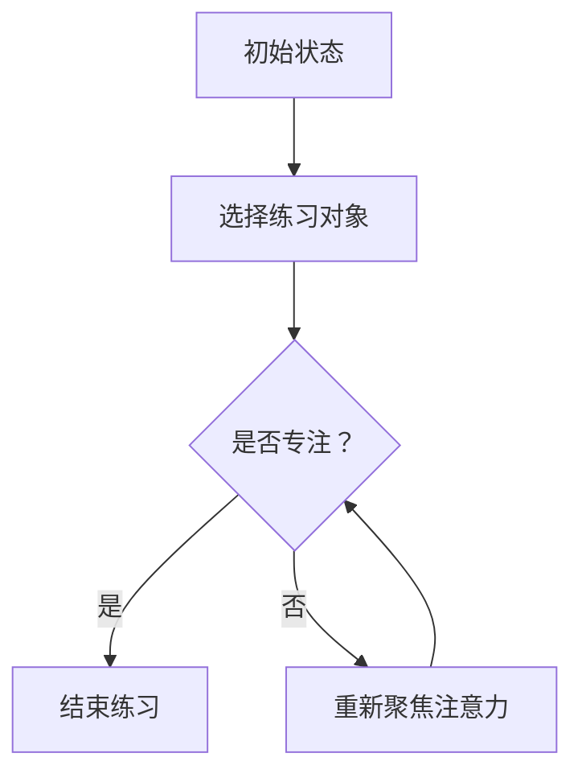

                 

### 正念的起源与发展

#### 1.1 正念的起源

正念（Mindfulness）的概念源自古老的佛教禅修传统，特别是在佛教中的禅修（Meditation）和冥想（Dhyana）实践中。这些传统强调通过觉知和集中注意力来培养内心的平静与专注力。正念的起源可以追溯到2500年前的印度，当时佛陀教导弟子们通过冥想来实现心灵的觉醒与解脱。这种修行方法在佛教传播的过程中逐渐演变和发展，形成了多种不同的冥想技术和修行方法。

在佛教中，正念被视为八正道（Eightfold Path）中的一个关键要素，它不仅仅是一种精神修炼的方式，也是一种生活态度和哲学观念。正念的理念强调活在当下，对当前经历的一切保持清晰和有意识的觉知，不进行评价或批判。这种练习有助于减少心理困扰，提高生活质量。

随着佛教的传播，正念的概念和实践也逐步扩散到了东亚地区，特别是在中国、日本和韩国，这些文化对佛教有着深厚的传统和影响。正念在东亚的传播过程中，与当地的文化和哲学思想相互融合，形成了具有本土特色的正念实践。

#### 1.2 正念在西方的传播与发展

正念在西方的传播始于20世纪60年代，当时社会和文化的变革促使人们开始寻求新的精神修炼方法。在这种背景下，美国心理学家Jon Kabat-Zinn成为了正念在现代心理学领域的重要推广者。他在1979年创立了麻省大学正念中心（Umass Center for Mindfulness），并开发了正念减压疗法（Mindfulness-Based Stress Reduction，MBSR）。

MBSR是一种综合性的疗法，通过一系列的冥想和正念练习，帮助人们减轻压力、改善身心健康。Kabat-Zinn的研究表明，MBSR对于缓解慢性疼痛、提高生活质量、增强情绪调节能力具有显著效果。这一疗法得到了医学界的广泛认可，并开始在医院、诊所和心理治疗中心得到应用。

正念在西方的传播也伴随着科学研究的发展。许多心理学家和医学专家开始对正念进行实证研究，探索其对人体生理和心理的多种影响。这些研究为正念的推广和应用提供了科学依据，也推动了正念在不同领域的深入发展。

#### 1.3 正念在中国的影响与本土化

正念在中国的传播和发展具有独特的文化背景。中国的传统文化中，如道家、儒家等，都有与正念理念相似的实践。道家提倡“无为而治”，强调顺应自然和内心的平静；儒家则强调“修身齐家治国平天下”，注重道德修养和自我完善。这些文化传统为正念在中国的本土化提供了土壤。

近年来，随着中国社会的快速发展和生活节奏的加快，人们对于心理健康和生活质量的关注不断增加。正念作为一种简便有效的自我调节方法，逐渐受到广大民众的喜爱。在中国，正念被广泛应用于心理治疗、健康管理、教育等领域。

中国的正念实践也融入了本土的特色。例如，正念练习中加入了太极、瑜伽等中国传统的身体锻炼方法，这些方法有助于增强身体的柔韧性和平衡感，同时也有助于缓解心理压力。此外，正念在中国的推广过程中，也注重与传统文化和现代科学的结合，形成了具有中国特色的正念实践体系。

#### 总结

正念作为一种古老而又现代的修炼方法，通过强调觉知、非评判和接纳，帮助人们实现内心的平静和自由。从佛教传统到现代心理学，正念的理念和实践在不同文化和领域中得到了广泛的应用和认可。在中国，正念与传统文化相结合，形成了独特的本土化实践。随着正念在西方和中国等地的持续传播和发展，它的影响力将进一步扩大，为人们的生活质量和心理健康带来更多积极的影响。

## 第2章: 正念的核心概念

### 2.1 正念的定义

正念（Mindfulness）是一种专注于当前经验的心理状态，通过培养意识觉知、非评判和接纳，帮助个体实现对当下生活的深刻体验和洞察。正念的核心理念是活在当下，不评判地观察和接受自己的内在体验，从而减少焦虑、压力和痛苦，提高生活质量。

### 2.2 正念与冥想的关系

正念与冥想（Meditation）有着密切的关系，但二者并不相同。冥想是一种通过专注、放松和意识觉察来达到心理和生理平衡的实践，而正念则是冥想中的一个重要组成部分。正念强调的是对当下体验的清晰觉知，而不涉及任何特定的冥想对象或方法。

### 2.3 正念的基本要素

正念的基本要素包括：

1. **觉知（Awareness）**：指对当前经验的觉知和注意，包括身体感觉、情绪、思想和外部环境。

2. **非评判（Non-Judgment）**：指不对体验进行价值判断或评价，接受一切经验，无论好坏。

3. **接纳（Acceptance）**：指对当前经验的开放和接受，不抵抗或逃避，而是以平和的心态去体验。

这些要素相互交织，共同构成了正念的核心框架，帮助个体培养心理韧性和情绪调节能力。

#### 核心概念与联系

正念的核心概念包括觉知、非评判和接纳，它们共同构成了正念实践的基础。

| 核心概念 | 定义 |
| --- | --- |
| 觉知 | 对当前经验的注意和观察 |
| 非评判 | 不进行价值判断或评价 |
| 接纳 | 对经验持有开放态度 |

#### 核心概念属性特征对比

为了更好地理解正念的核心概念，我们可以将觉知、非评判和接纳进行对比，如下表所示：

| 核心概念 | 特征1 | 特征2 | 特征3 |
| --- | --- | --- | --- |
| 觉知 | 清晰观察 | 持续关注 | 非选择性 |
| 非评判 | 不评价 | 无偏好 | 接受性 |
| 接纳 | 平和接受 | 无抗拒 | 敏感性 |

觉知强调对当前经验的清晰观察，非评判要求不进行价值判断，而接纳则是对经验的平和接受。这些概念相互补充，共同构成了正念实践的核心。

#### ER实体关系图架构

为了更直观地理解正念的核心概念，我们可以使用ER（实体-关系）图来描述它们之间的关系。

```mermaid
entityRelation
    Entity[正念] "1" --|觉知| Entity[Mindfulness]
    Entity[Mindfulness] "1" --|非评判| Entity[Non-Judgment]
    Entity[Mindfulness] "1" --|接纳| Entity[Acceptance]
```

在这个ER图中，正念作为中心实体，与觉知、非评判和接纳三个实体之间存在直接关系。觉知、非评判和接纳共同构成了正念的核心要素。

### 算法原理讲解

正念的算法原理可以看作是一种注意力调节机制，其核心在于如何有效地培养个体的注意力集中能力。以下是一个简化的算法流程图：



#### 详细讲解与举例说明

以下是具体的算法步骤和Python代码示例：

```python
# Python代码示例：正念注意力调节算法

def mindfulness_attention Regulation():
    """
    正念注意力调节函数
    """
    # 初始化状态
    state = "初始状态"
    
    # 选择练习对象
    object_of_focus = "呼吸"
    
    while True:
        # 检查是否专注
        if is_focused(object_of_focus):
            print("当前状态：专注")
            break
        else:
            print("当前状态：不专注，需要重新聚焦")
            
            # 重新聚焦注意力
            focus_on(object_of_focus)
            
    print("练习结束，达到专注状态")

def is_focused(object):
    """
    检查是否专注于特定对象
    """
    # 这里可以添加检查专注度的代码
    # 例如，通过传感器或主观反馈来判断
    return True if object == "呼吸" else False

def focus_on(object):
    """
    重新聚焦注意力的函数
    """
    # 这里可以添加一些帮助集中注意力的方法
    # 例如，深呼吸、冥想等
    print(f"请专注于{object}，感受当下的每一刻。")
```

#### 数学模型和数学公式

在正念的算法中，注意力水平（A）可以通过练习时间（T）和专注度（I）来衡量，公式如下：

$$
A = f(T, I)
$$

其中，$f(T, I)$ 是一个非线性的函数，反映了练习时间与专注度对注意力水平的影响。

例如，假设一个人每天练习30分钟，专注度为中等，则其注意力水平可以计算为：

$$
A = f(30, 中等)
$$

根据具体的函数形式，可以得出注意力水平的具体值。

#### 系统分析与架构设计

在正念的实践过程中，系统架构的设计至关重要。以下是一个简化的系统架构设计，包括用户界面、练习管理模块和反馈系统。

#### 用户界面

用户界面（UI）是用户与系统交互的入口，主要包括以下几个部分：

- 登录/注册界面
- 主界面：显示当前练习状态和进度
- 练习选项：提供不同的正念练习方案
- 反馈界面：用户完成练习后进行反馈

#### 练习管理模块

练习管理模块负责管理用户的练习记录和进度，主要包括以下几个功能：

- 创建练习计划
- 开始/暂停/结束练习
- 练习记录和数据分析
- 提供个性化练习建议

#### 反馈系统

反馈系统用于收集用户对练习的感受和建议，以优化系统功能。主要包括以下几个部分：

- 用户满意度调查
- 练习效果反馈
- 个性化建议和改进措施

#### 项目实战

为了更好地展示正念练习的应用，以下是一个简单的项目实战示例：

**项目名称**：正念呼吸练习

**环境**：Python 3.8、Tkinter 库

**功能**：提供一个简单的正念呼吸练习界面，用户可以设置练习时间和专注度，并在练习过程中获得实时反馈。

```python
import tkinter as tk

def start_practice():
    """
    开始呼吸练习
    """
    # 设置练习时间
    practice_time = 30
    
    # 设置专注度
    focus_level = "中等"
    
    # 开始练习
    print(f"开始正念呼吸练习，持续{practice_time}分钟，专注度为{focus_level}。")
    # 这里可以添加正念呼吸练习的具体代码

# 创建窗口
root = tk.Tk()
root.title("正念呼吸练习")

# 创建开始按钮
start_button = tk.Button(root, text="开始练习", command=start_practice)
start_button.pack()

# 运行主循环
root.mainloop()
```

#### 最佳实践 Tips

- 保持每天固定的练习时间，以建立稳定的练习习惯。
- 选择一个安静、舒适的环境进行练习。
- 练习过程中遇到干扰，不要抗拒，而是尝试接受并继续练习。
- 定期回顾和调整练习计划，以适应个人的需求和进度。

#### 小结

本章介绍了正念的核心概念、定义、与冥想的关系、基本要素以及相关的算法原理。通过具体的Python代码示例和系统架构设计，展示了正念练习在实际应用中的实现方法。正念作为一种有效的自我调节方法，可以帮助个体实现内心的平静和专注，提高生活质量。

#### 注意事项

- 练习正念时，应避免过度用力或强迫自己达到某种状态。
- 如果在练习过程中感到不适，应立即停止并寻求专业建议。
- 正念练习不应替代专业医疗治疗，如有健康问题，应咨询医生。

#### 拓展阅读

- [Jon Kabat-Zinn](https://www.umassmed.edu/Cutting-Edge-Healthcare-Medicine/Mindfulness-Based-Therapies/Leaders/Jon-Kabat-Zinn-PhD/) 的研究和工作
- [MBSR课程](https://www.umassmed.edu/Cutting-Edge-Healthcare-Medicine/Mindfulness-Based-Therapies/Courses/)
- [正念在心理健康中的应用](https://www.psychologytoday.com/us/blog/the-mindful-self-express/201507/the-role-mindfulness-mental-health)

