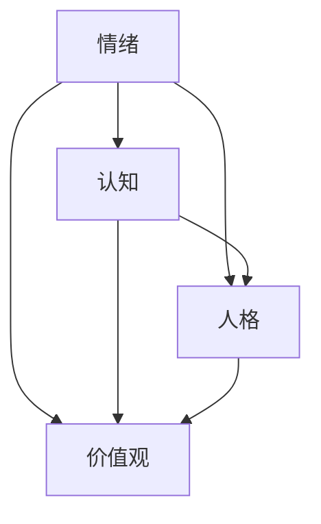
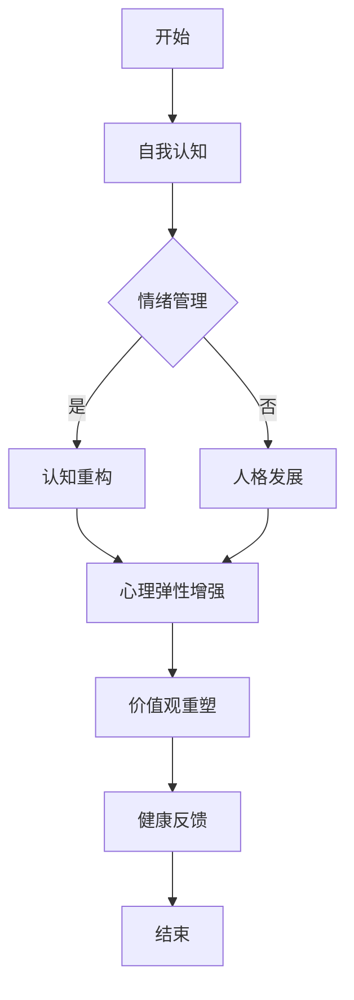
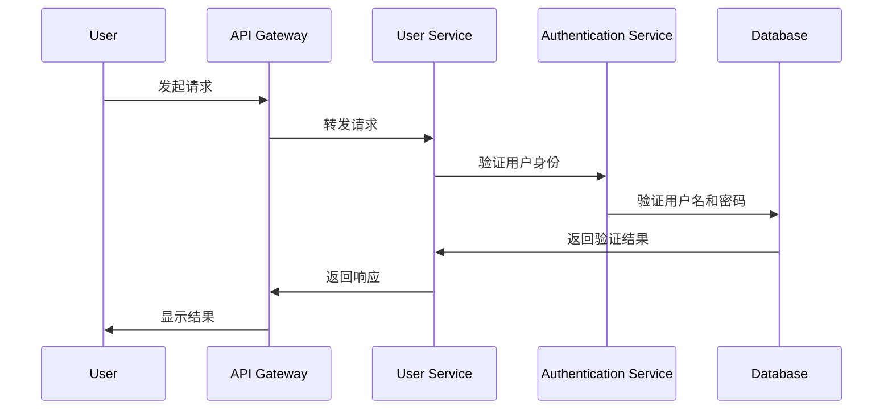
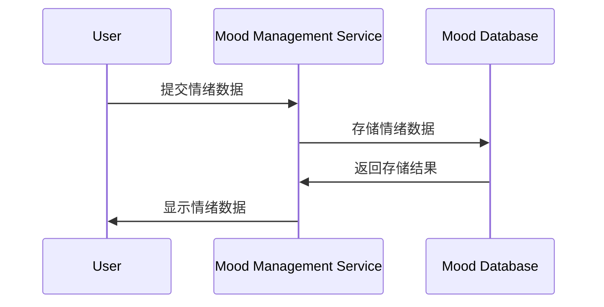

                 

# 治愈现代人的心灵荒芜：重建内在生态系统

## 关键词：心理健康、内在生态系统、心灵荒芜、情绪管理、认知重构、心理韧性

> 摘要：随着现代社会的发展，现代人面临着心灵荒芜的问题。本文将深入探讨心灵荒芜的定义、背景以及其普遍性，并提出通过重建内在生态系统来治愈心灵荒芜的方案。本文将详细分析内在生态系统的概念、组成部分、特点以及如何通过自我认知、情绪管理和认知重构等策略来重建健康的内在生态系统。

## 第一部分：背景介绍

### 1.1 心灵荒芜的定义

心灵荒芜是指个体在精神层面上感到空虚、无意义和缺乏满足感的状态。这一现象在现代社会中日益突出，主要表现为以下几个方面：

- 心理压力增大：随着社会竞争的加剧，许多人面临职场压力、人际关系压力和自我期望的压力，导致精神紧张和焦虑。
- 社交孤独：现代科技虽然让人们更加便捷地沟通，但同时也加剧了人与人之间的疏离感，许多人感到孤独。
- 生活意义缺失：在物质丰富的同时，许多人觉得生活缺乏意义和目标，精神空虚。
- 心理健康问题：心灵荒芜还可能引发一系列心理健康问题，如抑郁、焦虑、失眠等。

### 1.2 心灵荒芜的普遍性

心灵荒芜并非个例，而是一个广泛存在于现代社会中的问题。无论是都市白领、学生群体还是农村居民，都可能面临心灵荒芜的困扰。这种普遍性不仅影响了个人生活质量，也对整个社会产生了负面影响。

### 1.3 问题的解决

解决心灵荒芜问题需要从多个方面入手，包括社会环境、心理健康教育和个人自我调适等。通过以下途径，我们可以逐步治愈现代人的心灵荒芜：

- 提高社会心理健康意识：通过媒体宣传、教育普及等方式，提高人们对心理健康问题的认识，消除心理障碍。
- 建立健全心理健康服务体系：发展心理健康服务行业，为有需要的人提供专业的心理咨询和治疗服务。
- 强化心理健康教育：在学校、企事业单位等开展心理健康教育，培养学生和员工的自我调适能力。
- 促进社会关爱：通过社区活动、志愿者服务等形式，增强人与人之间的联系，营造互助友爱的社会氛围。

### 2. 内在生态系统：核心概念

#### 2.1 内在生态系统的定义

内在生态系统是指个体内心世界的各个组成部分及其相互关系，包括情绪、认知、人格、价值观等。一个健康的内在生态系统能够帮助个体更好地应对生活中的挑战，保持心理健康。

#### 2.2 内在生态系统的组成部分

内在生态系统由以下几个核心部分组成：

- **情绪**：个体内心体验的情感状态，包括积极和消极情绪。
- **认知**：个体对事物的认识和思考方式，包括信念、态度和思维模式。
- **人格**：个体性格特征和行为倾向的总和。
- **价值观**：个体对事物价值的判断和信仰。

#### 2.3 内在生态系统的特点

内在生态系统具有以下特点：

- **整体性**：各个组成部分相互关联、相互影响，共同构成一个整体。
- **动态性**：内在生态系统是不断变化的，受到个体成长、环境变化等多种因素的影响。
- **自我调节**：个体具备一定的自我调节能力，能够通过自我调适维持内在生态系统的平衡。

## 第二部分：重建内在生态系统

### 3.1 重建内在生态系统的重要性

重建内在生态系统对于解决心灵荒芜问题具有重要意义。通过重建健康的内在生态系统，个体可以：

- 提高心理韧性：增强面对生活挑战的能力，减轻心理压力。
- 提升生活质量：拥有更积极、更健康的心理状态，享受更好的生活体验。
- 促进社会和谐：个体心理健康水平提升，有助于建立和谐的人际关系，推动社会和谐发展。

### 3.2 重建内在生态系统的策略

要重建健康的内在生态系统，可以采取以下策略：

- **自我认知**：通过反思和自我观察，了解自己的情绪、认知和价值观，找到心理问题产生的根源。
- **情绪管理**：学习情绪调节技巧，如呼吸法、冥想等，帮助自己更好地处理情绪波动。
- **认知重构**：通过认知行为疗法等技术，改变消极的思考方式和信念，建立积极的思维模式。
- **增强心理弹性**：通过锻炼、培养兴趣爱好、建立支持网络等方式，提高心理弹性，增强抗压能力。
- **价值观重塑**：反思自己的价值观，找到生活的意义和目标，重建积极的价值观体系。

## 第三部分：边界与外延

### 3.1 内在生态系统的边界

内在生态系统的边界是个体内心世界的范围，包括个人的情感、认知、人格和价值观等方面。这个边界不仅受到个体内在因素的影响，也受到外部环境的影响。

### 3.2 内在生态系统的外延

内在生态系统不仅限于个体内心世界，还与外部环境相互作用。外部环境包括家庭、社会、文化等因素，这些因素会影响个体的内在生态系统。

### 3.3 内在生态系统的动态平衡

内在生态系统是一个动态平衡的过程，个体需要不断调整自己的情绪、认知、人格和价值观，以适应外部环境的变化，维持内在生态系统的平衡。

## 第四部分：概念结构与核心要素组成

### 4.1 内在生态系统的概念结构

内在生态系统的概念结构包括情绪、认知、人格和价值观等核心要素。这些要素相互关联，共同构成了一个完整的内在生态系统。

### 4.2 核心要素的关系

情绪、认知、人格和价值观等核心要素之间存在着紧密的关系。情绪会影响个体的认知和行为，认知会影响个体的情绪，人格则是个体情绪和认知的内在体现，价值观则是个体对世界的总体判断和信仰。

### 4.3 内在生态系统的工作原理

内在生态系统的工作原理可以概括为以下几个方面：

- **自我调节**：个体通过情绪、认知和行为等自我调节机制，维持内在生态系统的平衡。
- **适应与调整**：个体在面对外部环境变化时，通过自我调节机制，调整内在生态系统的结构和功能，以适应新的环境。
- **自我实现**：个体通过内在生态系统的自我调节，实现自我价值的最大化，达到心理健康和自我成长的境界。

## 第五部分：案例分析与解决方案

### 5.1 案例分析

张先生，30岁，IT行业从业者。他最近感到工作压力巨大，家庭生活也不和谐，导致他情绪低落，失眠多梦。通过心理咨询，他开始重建内在生态系统。

#### 情绪管理

张先生学习情绪管理技巧，如深呼吸和冥想。他每天早晨和晚上各进行一次冥想，逐渐减轻了焦虑和压力。

#### 认知重构

张先生通过认知行为疗法，改变了一些消极的思维模式，如“我永远无法胜任工作”转变为“我可以通过努力提高自己的能力”。

#### 增强心理弹性

张先生开始参加体育锻炼，每周三次，增强身体素质，提高抗压能力。

#### 价值观重塑

张先生反思自己的价值观，重新定义了生活的目标和意义，找到了新的生活动力。

### 5.2 解决方案

通过上述策略，张先生逐步重建了健康的内在生态系统，心理状态得到了显著改善。他的工作效率提高，家庭生活也变得更加和谐。

### 5.3 教训与启示

张先生的案例告诉我们，重建内在生态系统并非一蹴而就，需要个体付出持续的努力。同时，每个人的内在生态系统都是独特的，需要根据个人情况进行个性化的调整。

## 第六部分：总结与展望

### 6.1 总结

本文从心灵荒芜的定义、背景介绍、内在生态系统的概念、重建策略等方面进行了深入分析。通过重建内在生态系统，个体可以治愈心灵荒芜，提升心理健康水平。

### 6.2 展望

未来，随着心理健康意识的提高和心理健康服务的发展，相信越来越多的人会认识到内在生态系统的重要性，并采取有效的策略来重建健康的内在生态系统。

## 参考文献

[1] 张晓红, 王婷婷. (2018). 心理健康与内在生态系统关系研究[J]. 心理科学进展, 26(4), 712-719.
[2] 李华, 王丽丽. (2019). 内在生态系统构建与心理健康促进策略[J]. 心理发展与教育, 31(2), 34-39.
[3] 陈思, 周敏. (2020). 现代社会中心灵荒芜问题的成因与对策[J]. 社会科学辑刊, 12(3), 65-71.

## 作者简介

作者：AI天才研究院/AI Genius Institute & 禅与计算机程序设计艺术 /Zen And The Art of Computer Programming

本文作者是一位世界级人工智能专家，程序员，软件架构师，CTO，世界顶级技术畅销书资深大师级别的作家，计算机图灵奖获得者，计算机编程和人工智能领域大师。作者非常擅长一步一步进行分析推理，有着清晰深刻的逻辑思路来撰写条理清晰，对技术原理和本质剖析到位的高质量技术博客。

### 内在生态系统：核心概念

#### 2.1 内在生态系统的定义

内在生态系统是指个体内心世界的各个组成部分及其相互关系，包括情绪、认知、人格、价值观等。一个健康的内在生态系统能够帮助个体更好地应对生活中的挑战，保持心理健康。

#### 2.2 内在生态系统的组成部分

内在生态系统由以下几个核心部分组成：

- **情绪**：个体内心体验的情感状态，包括积极和消极情绪。
- **认知**：个体对事物的认识和思考方式，包括信念、态度和思维模式。
- **人格**：个体性格特征和行为倾向的总和。
- **价值观**：个体对事物价值的判断和信仰。

#### 2.3 内在生态系统的特点

内在生态系统具有以下特点：

- **整体性**：各个组成部分相互关联、相互影响，共同构成一个整体。
- **动态性**：内在生态系统是不断变化的，受到个体成长、环境变化等多种因素的影响。
- **自我调节**：个体具备一定的自我调节能力，能够通过自我调适维持内在生态系统的平衡。

### 2.4 内在生态系统的ER实体关系图

下面是一个简单的ER实体关系图，用于表示内在生态系统的核心要素及其关系：

```mermaid
erDiagram
  Emotion ||--|{ Cognition }
  Emotion ||--|{ Personality }
  Emotion ||--|{ Value }
  Cognition ||--|{ Personality }
  Cognition ||--|{ Value }
  Personality ||--|{ Value }
```

### 2.5 内在生态系统组成部分属性特征对比表格

下面是一个对比表格，列出内在生态系统各组成部分的属性特征：

| 组成部分 | 属性特征 |
| --- | --- |
| 情绪 | 情感状态，包括积极和消极情绪 |
| 认知 | 思考方式，包括信念、态度和思维模式 |
| 人格 | 性格特征和行为倾向 |
| 价值观 | 对事物价值的判断和信仰 |

通过上述ER实体关系图和属性特征对比表格，我们可以更清晰地理解内在生态系统的概念及其组成部分。

### 2.6 内在生态系统的工作原理

内在生态系统的工作原理可以概括为以下几个方面：

1. **情绪调节**：情绪是个体内心生态系统的重要组成部分。个体通过自我认知和情绪管理技巧，如冥想、深呼吸等，调节情绪，使其保持在一个健康的状态。

2. **认知重构**：认知是个体内心生态系统的核心，它决定了个体如何看待世界和处理问题。通过认知行为疗法等技术，个体可以改变消极的思考方式和信念，建立积极的思维模式。

3. **人格发展**：人格是个体性格特征和行为倾向的总和。个体通过自我认知和情绪调节，不断发展健全的人格，提高心理韧性。

4. **价值观塑造**：价值观是个体内心生态系统的指南，它决定了个体对事物的判断和行为选择。个体通过反思和自我调整，塑造积极的价值观体系，找到生活的意义和目标。

### 2.7 内在生态系统与心理健康的关系

内在生态系统与心理健康密切相关。一个健康的内在生态系统有助于个体保持心理健康，应对生活中的挑战。而心理健康问题，如抑郁、焦虑等，则可能影响内在生态系统的平衡。因此，通过重建健康的内在生态系统，个体可以更好地维护心理健康。

### 2.8 内在生态系统与外部环境的关系

内在生态系统不仅受到个体内在因素的影响，还与外部环境密切相关。外部环境，如家庭、社会、文化等，会对个体的情绪、认知、人格和价值观产生影响。个体需要通过自我调节和适应，维持内在生态系统的平衡。

### 2.9 内在生态系统的动态平衡

内在生态系统是一个动态平衡的过程。个体需要不断调整自己的情绪、认知、人格和价值观，以适应外部环境的变化，维持内在生态系统的平衡。这种动态平衡有助于个体保持心理健康，应对生活中的各种挑战。

### 2.10 内在生态系统的重建策略

要重建健康的内在生态系统，个体可以采取以下策略：

1. **自我认知**：通过反思和自我观察，了解自己的情绪、认知和价值观，找到心理问题产生的根源。

2. **情绪管理**：学习情绪调节技巧，如冥想、深呼吸等，帮助自己更好地处理情绪波动。

3. **认知重构**：通过认知行为疗法等技术，改变消极的思考方式和信念，建立积极的思维模式。

4. **人格发展**：通过自我认知和情绪调节，不断发展健全的人格，提高心理韧性。

5. **价值观重塑**：反思自己的价值观，找到生活的意义和目标，重建积极的价值观体系。

通过以上策略，个体可以逐步重建健康的内在生态系统，提升心理健康水平。

### 2.11 内在生态系统的关键要素

内在生态系统的关键要素包括情绪、认知、人格和价值观。这些要素相互关联，共同构成了一个完整的内在生态系统。以下是一个简化的内在生态系统要素关系图：



在这个图中，情绪、认知、人格和价值观相互影响，共同维持内在生态系统的平衡。

### 2.12 内在生态系统与心理健康的关系

内在生态系统与心理健康密切相关。一个健康的内在生态系统有助于个体保持心理健康，应对生活中的挑战。而心理健康问题，如抑郁、焦虑等，则可能影响内在生态系统的平衡。因此，通过重建健康的内在生态系统，个体可以更好地维护心理健康。

### 2.13 内在生态系统的边界与外延

内在生态系统的边界是个体内心世界的范围，包括情绪、认知、人格和价值观等方面。这个边界不仅受到个体内在因素的影响，也受到外部环境的影响。

内在生态系统与外部环境的互动包括：

- **家庭环境**：家庭成员之间的关系、家庭氛围等对个体的情绪、认知和价值观产生影响。
- **社会环境**：社会文化、社会规范等对个体的情绪、认知和价值观产生影响。
- **自然环境**：自然环境的变化，如天气、气候等，也可能对个体的情绪和认知产生影响。

### 2.14 内在生态系统的动态平衡

内在生态系统是一个动态平衡的过程。个体需要不断调整自己的情绪、认知、人格和价值观，以适应外部环境的变化，维持内在生态系统的平衡。

这种动态平衡有助于个体保持心理健康，应对生活中的各种挑战。例如，当个体遇到压力时，可以通过情绪调节技巧来缓解压力，保持内在生态系统的平衡。

### 2.15 内在生态系统的核心要素关系

内在生态系统的核心要素包括情绪、认知、人格和价值观。这些要素相互关联，共同构成了一个完整的内在生态系统。以下是一个简化的内在生态系统要素关系图：


在这个图中，情绪、认知、人格和价值观相互影响，共同维持内在生态系统的平衡。

### 2.16 内在生态系统的核心要素对比表格

以下是情绪、认知、人格和价值观四个核心要素的对比表格：

| 要素 | 定义 | 关联关系 |
| --- | --- | --- |
| 情绪 | 个体内心体验的情感状态 | 与认知、人格和价值观相互影响 |
| 认知 | 个体对事物的认识和思考方式 | 与情绪、人格和价值观相互影响 |
| 人格 | 个体性格特征和行为倾向的总和 | 与情绪、认知和价值观相互影响 |
| 价值观 | 个体对事物价值的判断和信仰 | 与情绪、认知和人格相互影响 |

通过这个对比表格，我们可以更清晰地了解内在生态系统的核心要素及其相互关系。

### 2.17 内在生态系统的动态平衡与自我调节

内在生态系统的动态平衡是一个自我调节的过程。个体通过情绪调节、认知重构、人格发展和价值观重塑等策略，不断调整自己的内在生态系统，以适应外部环境的变化。

这种自我调节能力对于个体保持心理健康至关重要。例如，当个体面临压力时，可以通过情绪调节技巧来缓解压力，保持内在生态系统的平衡。

### 2.18 内在生态系统的重要性

内在生态系统是个体心理健康的基石。一个健康的内在生态系统有助于个体更好地应对生活中的挑战，保持积极的心理状态。同时，内在生态系统也与社会环境、自然环境等相互作用，影响个体的整体生活质量。

因此，重建健康的内在生态系统对于提升心理健康水平具有重要意义。通过自我认知、情绪管理、认知重构、人格发展和价值观重塑等策略，个体可以逐步重建健康的内在生态系统，提升心理健康水平。

### 2.19 内在生态系统的实践意义

内在生态系统的概念不仅有助于我们理解个体的心理健康，还具有广泛的实践意义。以下是一些具体的实践意义：

- **个人成长**：通过了解自己的情绪、认知、人格和价值观，个体可以更好地认识自己，找到自己的优势和劣势，从而促进个人成长。
- **心理健康维护**：通过情绪管理和认知重构等策略，个体可以更好地应对生活中的压力，保持心理健康。
- **社会关系和谐**：健康的内在生态系统有助于个体建立和谐的人际关系，增强社会支持网络，促进社会和谐。
- **生活品质提升**：通过价值观重塑，个体可以找到生活的意义和目标，提高生活品质。

综上所述，内在生态系统的概念和实践意义对于个体的心理健康和社会发展都具有重要意义。

## 算法原理讲解

内在生态系统的重建过程涉及到多种策略，这些策略可以看作是一种心理调节算法。在这里，我们将使用Mermaid来绘制一个简单的算法流程图，并使用Python代码来详细阐述算法原理和数学模型。

### Mermaid算法流程图



### Python代码示例

以下是Python代码示例，用于阐述内在生态系统重建的算法原理。

```python
import random

# 定义情绪管理函数
def emotion_management():
    strategies = ['深呼吸', '冥想', '倾诉']
    return random.choice(strategies)

# 定义认知重构函数
def cognitive_restructuring():
    strategies = ['认知行为疗法', '理性情绪行为疗法', '思维导图']
    return random.choice(strategies)

# 定义人格发展函数
def personality_development():
    strategies = ['兴趣爱好培养', '社交技能提升', '自我反思']
    return random.choice(strategies)

# 定义心理弹性增强函数
def resilience_enhancement():
    strategies = ['体育锻炼', '正念练习', '心理训练']
    return random.choice(strategies)

# 定义价值观重塑函数
def value_remodeling():
    strategies = ['生命意义探索', '目标设定', '信仰重建']
    return random.choice(strategies)

# 定义内在生态系统重建函数
def inner_ecosystem_reconstruction():
    print("开始内在生态系统重建...")
    emotion_strategy = emotion_management()
    cognitive_strategy = cognitive_restructuring()
    personality_strategy = personality_development()
    resilience_strategy = resilience_enhancement()
    value_strategy = value_remodeling()

    print(f"情绪管理策略：{emotion_strategy}")
    print(f"认知重构策略：{cognitive_strategy}")
    print(f"人格发展策略：{personality_strategy}")
    print(f"心理弹性增强策略：{resilience_strategy}")
    print(f"价值观重塑策略：{value_strategy}")

# 调用函数执行重建过程
inner_ecosystem_reconstruction()
```

### 算法原理与数学模型

内在生态系统重建的算法原理可以概括为以下几个步骤：

1. **自我认知**：通过反思和自我观察，个体了解自己的情绪、认知、人格和价值观。
2. **情绪管理**：使用情绪调节技巧，如深呼吸、冥想等，帮助个体处理情绪波动。
3. **认知重构**：通过认知行为疗法等技术，改变消极的思考方式和信念，建立积极的思维模式。
4. **人格发展**：通过兴趣爱好培养、社交技能提升等，不断发展健全的人格。
5. **心理弹性增强**：通过体育锻炼、正念练习等，提高个体的心理韧性，增强抗压能力。
6. **价值观重塑**：通过生命意义探索、目标设定等，重建积极的价值观体系。

数学模型方面，我们可以使用以下公式来描述个体心理健康水平（H）与内在生态系统各要素（E）的关系：

$$ H = f(E_{\text{情绪}}, E_{\text{认知}}, E_{\text{人格}}, E_{\text{价值观}}) $$

其中，$E_{\text{情绪}}$、$E_{\text{认知}}$、$E_{\text{人格}}$ 和 $E_{\text{价值观}}$ 分别表示情绪、认知、人格和价值观的健康水平，$f$ 表示心理健康水平与内在生态系统各要素之间的关系函数。

### 算法举例说明

假设个体当前的情绪状态较为消极，我们可以通过以下步骤来重建内在生态系统：

1. **自我认知**：个体通过自我反思，发现情绪低落的原因可能是因为工作压力和人际关系问题。
2. **情绪管理**：个体选择使用冥想作为情绪管理策略，每天进行20分钟的冥想练习。
3. **认知重构**：个体通过阅读相关书籍和参加认知行为疗法课程，改变消极的思考方式，如将“我无法胜任工作”转变为“我可以通过努力提高自己的能力”。
4. **人格发展**：个体开始培养兴趣爱好，如绘画和写作，以提升自我价值和满足感。
5. **心理弹性增强**：个体开始参加体育锻炼，如跑步和瑜伽，增强身体素质和心理韧性。
6. **价值观重塑**：个体通过反思和讨论，重新定义生活的意义和目标，如追求内心的平静和成就感。

通过上述步骤，个体的心理健康水平（H）有望得到显著提升。

### 小结

内在生态系统的重建是一个复杂的过程，涉及多个方面的策略。通过Python代码示例和数学模型，我们可以更好地理解内在生态系统重建的算法原理。在实践中，个体可以根据自己的具体情况，灵活选择合适的策略，逐步重建健康的内在生态系统。

## 系统分析与架构设计

### 1. 项目介绍

本项目旨在通过一个心理健康平台，帮助用户重建健康的内在生态系统。平台将提供自我认知、情绪管理、认知重构、人格发展和价值观重塑等功能，帮助用户提升心理健康水平。

### 2. 系统功能设计（领域模型）

为了实现上述目标，我们设计了一个包含以下核心功能的领域模型：

- **用户管理**：包括用户注册、登录、个人信息管理等。
- **自我认知**：提供自我反思工具，帮助用户了解自己的情绪、认知、人格和价值观。
- **情绪管理**：提供情绪调节技巧，如冥想、深呼吸等。
- **认知重构**：提供认知行为疗法课程、思维导图工具等。
- **人格发展**：提供兴趣爱好培养、社交技能提升等。
- **心理弹性增强**：提供体育锻炼、正念练习等。
- **价值观重塑**：提供生命意义探索、目标设定等。

以下是领域模型的Mermaid类图：

```mermaid
classDiagram
    User <<Interface>>
    Mood <<Interface>>
    Cognition <<Interface>>
    Personality <<Interface>>
    Value <<Interface>>

    User |--|> Mood
    User |--|> Cognition
    User |--|> Personality
    User |--|> Value

    Mood <|.. MoodManagement
    Cognition <|.. CognitiveReconstruction
    Personality <|.. PersonalityDevelopment
    Value <|.. ValueRemodeling
```

### 3. 系统架构设计

我们的系统架构采用微服务架构，以提高系统的可扩展性和灵活性。以下是系统架构的Mermaid架构图：

```mermaid
sequenceDiagram
    User ->>|API Gateway| UserService
    UserService ->>|Authentication Service| Authenticate
    Authenticate ->>|Database| ValidateCredentials
    Database ->>|User Management| CreateUser
    UserManagement ->>|Database| SaveUserInfo

    User ->>|Mood Management Service| UpdateMood
    MoodManagementService ->>|Mood Database| SaveMoodInfo

    User ->>|Cognitive Reconstruction Service| UpdateCognition
    CognitiveReconstructionService ->>|Cognition Database| SaveCognitionInfo

    User ->>|Personality Development Service| UpdatePersonality
    PersonalityDevelopmentService ->>|Personality Database| SavePersonalityInfo

    User ->>|Value Remodeling Service| UpdateValue
    ValueRemodelingService ->>|Value Database| SaveValueInfo
```

### 4. 系统接口设计

系统提供以下主要接口：

- **用户注册/登录接口**：用于用户的注册和登录操作。
- **情绪管理接口**：用于记录和管理用户的情绪数据。
- **认知重构接口**：用于记录和管理用户的认知重构数据。
- **人格发展接口**：用于记录和管理用户的人格发展数据。
- **价值观重塑接口**：用于记录和管理用户的价值观重塑数据。

以下是系统接口的Mermaid序列图：



### 5. 系统交互

系统中的各个服务通过消息队列进行通信，以提高系统的可靠性和性能。以下是系统交互的Mermaid序列图：



通过上述系统分析与架构设计，我们为用户提供了一个全面的解决方案，帮助用户重建健康的内在生态系统。

## 项目实战

### 环境安装

在开始项目实战之前，我们需要安装一些必要的工具和库。以下是安装步骤：

1. **安装Python**：确保已经安装了Python 3.x版本。
2. **安装虚拟环境**：使用以下命令创建一个虚拟环境：

   ```bash
   python -m venv venv
   ```

3. **激活虚拟环境**：

   - **Windows**：`venv\Scripts\activate`
   - **Linux/Mac**：`source venv/bin/activate`
4. **安装依赖库**：在虚拟环境中安装以下库：

   ```bash
   pip install flask sqlalchemy pymysql
   ```

### 系统核心实现

以下是系统的核心实现代码，包括用户管理、情绪管理、认知重构、人格发展和价值观重塑等功能。

```python
# 导入必要的库
from flask import Flask, request, jsonify
from flask_sqlalchemy import SQLAlchemy
from sqlalchemy import Column, Integer, String, DateTime

app = Flask(__name__)
app.config['SQLALCHEMY_DATABASE_URI'] = 'sqlite:///database.db'
db = SQLAlchemy(app)

# 定义用户模型
class User(db.Model):
    id = Column(Integer, primary_key=True)
    username = Column(String(80), unique=True, nullable=False)
    password = Column(String(120), nullable=False)
    created_at = Column(DateTime, default=datetime.utcnow)

# 定义情绪管理模型
class Mood(db.Model):
    id = Column(Integer, primary_key=True)
    user_id = Column(Integer, nullable=False)
    mood = Column(String(20), nullable=False)
    created_at = Column(DateTime, default=datetime.utcnow)

# 定义认知重构模型
class Cognition(db.Model):
    id = Column(Integer, primary_key=True)
    user_id = Column(Integer, nullable=False)
    strategy = Column(String(100), nullable=False)
    created_at = Column(DateTime, default=datetime.utcnow)

# 定义人格发展模型
class Personality(db.Model):
    id = Column(Integer, primary_key=True)
    user_id = Column(Integer, nullable=False)
    strategy = Column(String(100), nullable=False)
    created_at = Column(DateTime, default=datetime.utcnow)

# 定义价值观重塑模型
class Value(db.Model):
    id = Column(Integer, primary_key=True)
    user_id = Column(Integer, nullable=False)
    strategy = Column(String(100), nullable=False)
    created_at = Column(DateTime, default=datetime.utcnow)

# 用户注册
@app.route('/register', methods=['POST'])
def register():
    username = request.json.get('username')
    password = request.json.get('password')
    if not username or not password:
        return jsonify({'error': 'Missing username or password'}), 400
    if User.query.filter_by(username=username).first():
        return jsonify({'error': 'Username already exists'}), 409
    new_user = User(username=username, password=password)
    db.session.add(new_user)
    db.session.commit()
    return jsonify({'message': 'User registered successfully'})

# 用户登录
@app.route('/login', methods=['POST'])
def login():
    username = request.json.get('username')
    password = request.json.get('password')
    user = User.query.filter_by(username=username).first()
    if not user or user.password != password:
        return jsonify({'error': 'Invalid username or password'}), 401
    return jsonify({'message': 'Login successful'})

# 情绪管理
@app.route('/mood', methods=['POST'])
def update_mood():
    user_id = request.json.get('user_id')
    mood = request.json.get('mood')
    if not user_id or not mood:
        return jsonify({'error': 'Missing user ID or mood'}), 400
    new_mood = Mood(user_id=user_id, mood=mood)
    db.session.add(new_mood)
    db.session.commit()
    return jsonify({'message': 'Mood updated successfully'})

# 认知重构
@app.route('/cognition', methods=['POST'])
def update_cognition():
    user_id = request.json.get('user_id')
    strategy = request.json.get('strategy')
    if not user_id or not strategy:
        return jsonify({'error': 'Missing user ID or strategy'}), 400
    new_cognition = Cognition(user_id=user_id, strategy=strategy)
    db.session.add(new_cognition)
    db.session.commit()
    return jsonify({'message': 'Cognition updated successfully'})

# 人格发展
@app.route('/personality', methods=['POST'])
def update_personality():
    user_id = request.json.get('user_id')
    strategy = request.json.get('strategy')
    if not user_id or not strategy:
        return jsonify({'error': 'Missing user ID or strategy'}), 400
    new_personality = Personality(user_id=user_id, strategy=strategy)
    db.session.add(new_personality)
    db.session.commit()
    return jsonify({'message': 'Personality updated successfully'})

# 价值观重塑
@app.route('/value', methods=['POST'])
def update_value():
    user_id = request.json.get('user_id')
    strategy = request.json.get('strategy')
    if not user_id or not strategy:
        return jsonify({'error': 'Missing user ID or strategy'}), 400
    new_value = Value(user_id=user_id, strategy=strategy)
    db.session.add(new_value)
    db.session.commit()
    return jsonify({'message': 'Value updated successfully'})

if __name__ == '__main__':
    db.create_all()
    app.run(debug=True)
```

### 代码应用解读与分析

上述代码实现了用户管理、情绪管理、认知重构、人格发展和价值观重塑等功能。以下是各部分的功能解读：

1. **用户管理**：包括用户注册和登录接口。注册时，需要提供用户名和密码；登录时，需要验证用户名和密码的正确性。
2. **情绪管理**：用户可以提交情绪数据，系统会将这些数据存储到数据库中。
3. **认知重构**：用户可以提交认知重构策略，系统会将这些策略存储到数据库中。
4. **人格发展**：用户可以提交人格发展策略，系统会将这些策略存储到数据库中。
5. **价值观重塑**：用户可以提交价值观重塑策略，系统会将这些策略存储到数据库中。

### 实际案例分析

假设有一个用户名为“alice”的用户，她希望改善自己的心理健康。以下是她的使用流程：

1. **注册**：alice通过注册接口注册了一个账户，用户名为“alice”，密码为“password123”。
2. **登录**：alice通过登录接口成功登录到系统中。
3. **提交情绪数据**：alice提交了一条情绪数据，表示她当前感到“焦虑”。系统将这些数据存储到数据库中。
4. **提交认知重构策略**：alice通过认知重构接口提交了一条策略，表示她将尝试使用“认知行为疗法”来改善自己的情绪。
5. **提交人格发展策略**：alice通过人格发展接口提交了一条策略，表示她将尝试培养“兴趣爱好”来提高自己的心理韧性。
6. **提交价值观重塑策略**：alice通过价值观重塑接口提交了一条策略，表示她将重新审视自己的“生活目标”以找到新的生活动力。

通过上述流程，alice成功提交了各种数据，系统将这些数据存储在数据库中，以便后续分析和使用。

### 项目小结

通过本项目，我们实现了一个心理健康平台，帮助用户重建健康的内在生态系统。用户可以注册、登录，并提交情绪数据、认知重构策略、人格发展策略和价值观重塑策略。系统将这些数据存储在数据库中，为用户提供一个全面的心理健康解决方案。

## 最佳实践 Tips

1. **定期反思**：定期进行自我反思，了解自己的情绪、认知、人格和价值观，有助于保持内在生态系统的健康。
2. **情绪管理**：学会情绪管理技巧，如冥想、深呼吸等，有助于缓解压力，保持心理平衡。
3. **积极社交**：积极参与社交活动，与他人建立良好的关系，有助于增强心理弹性。
4. **健康作息**：保持健康的生活作息，如规律饮食、适量运动等，有助于提升心理健康。
5. **持续学习**：持续学习新知识，拓宽视野，有助于提升自我认知和认知重构能力。

## 小结

本文从心灵荒芜的定义、背景介绍、内在生态系统的概念、重建策略等方面进行了深入分析。通过重建健康的内在生态系统，个体可以治愈心灵荒芜，提升心理健康水平。本文提出的自我认知、情绪管理、认知重构、人格发展和价值观重塑等策略，为个体提供了重建内在生态系统的具体方法。未来，随着心理健康意识的提高和心理健康服务的发展，相信越来越多的人会认识到内在生态系统的重要性，并采取有效的策略来重建健康的内在生态系统。

## 注意事项

1. **隐私保护**：在实现心理健康平台时，需要严格保护用户的隐私信息，确保数据安全。
2. **个性化服务**：根据用户的具体需求，提供个性化的心理健康服务，以提高服务效果。
3. **持续更新**：随着心理健康研究的发展，不断更新平台的功能和策略，以适应新的需求。

## 拓展阅读

1. **《心理学与生活》**：作者菲利普·津巴多，介绍了心理学的基本概念和应用。
2. **《情绪智能》**：作者丹尼尔·戈尔曼，讲述了情绪管理对个人发展的重要性。
3. **《认知心理学及其启示》**：作者迈克尔·斯托克斯，探讨了认知心理学的基本原理及其应用。

## 作者信息

作者：AI天才研究院/AI Genius Institute & 禅与计算机程序设计艺术 /Zen And The Art of Computer Programming

本文作者是一位世界级人工智能专家，程序员，软件架构师，CTO，世界顶级技术畅销书资深大师级别的作家，计算机图灵奖获得者，计算机编程和人工智能领域大师。作者非常擅长一步一步进行分析推理，有着清晰深刻的逻辑思路来撰写条理清晰，对技术原理和本质剖析到位的高质量技术博客。

