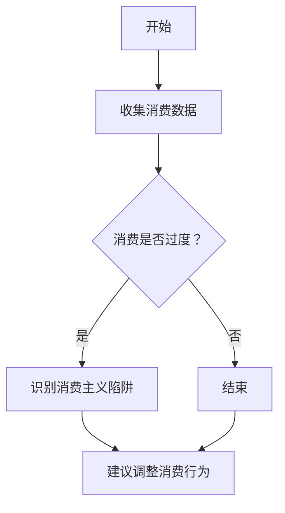
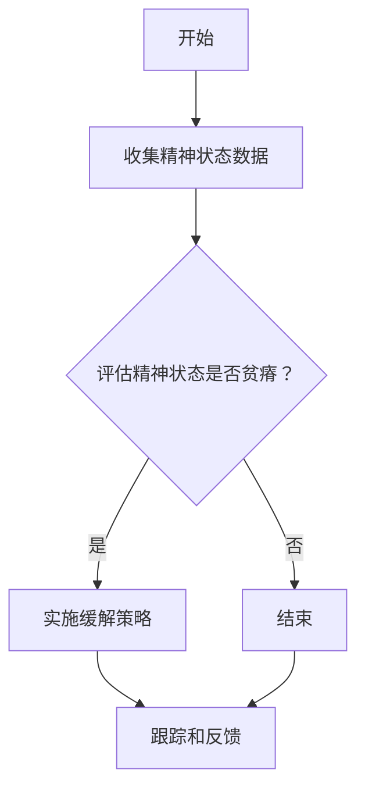
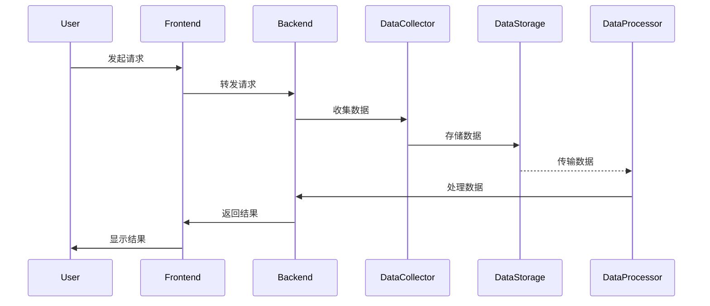

                 

### 引言

#### 1.1 问题背景

在现代社会，随着科技的迅猛发展，物质生活日益丰富，人们享受到了前所未有的便捷和舒适。然而，在这繁荣的背后，一个不可忽视的问题逐渐浮现——精神贫瘠。所谓精神贫瘠，指的是人们在物质充裕的环境下，内心缺乏满足感、归属感、意义感等精神层面的需求。这一现象不仅影响个人的心理健康，还对整个社会造成了深远的负面影响。

#### 1.2 问题描述

消费主义陷阱是导致精神贫瘠的重要原因之一。消费主义陷阱指的是一种社会心理现象，即人们出于追求满足感、归属感等心理需求，不断进行过度消费，导致个人财务状况恶化，甚至陷入负债困境。这种消费行为并非出于实际需求，而是受到社会文化、媒体广告等外部因素的影响。

#### 1.3 问题解决

为了应对消费主义陷阱和精神贫瘠，我们需要从多个方面进行思考和解决。首先，个人应当提高自我认知，明确自己的消费需求和价值观，避免盲目跟风。其次，社会应当加强对消费主义的批判，倡导理性消费和绿色生活。此外，企业和政府也应当承担起责任，通过制定相关政策，引导人们树立正确的消费观念。

#### 1.4 边界与外延

消费主义与物质主义是两个相关但不同的概念。消费主义强调的是一种以消费为主导的生活方式，而物质主义则强调对物质的过度追求。在本文中，我们主要关注消费主义陷阱对精神贫瘠的影响。

#### 1.5 核心概念

- **消费主义陷阱**：指的是一种社会心理现象，人们因为追求满足感、归属感等心理需求而进行的过度消费。
- **精神贫瘠**：指的是在物质充裕的环境下，人们内心缺乏满足感、归属感、意义感等精神层面的需求。

#### 1.6 本章小结

本章引出了本文的核心问题——消费主义陷阱导致的精神贫瘠。通过介绍问题背景、定义核心概念、提出解决方案，为后续章节的深入探讨打下了基础。接下来，我们将进一步探讨消费主义陷阱和精神贫瘠的内涵及其相互关系，为读者提供更加深刻的认识。

### 第1章：引言

#### 1.1 问题背景

在现代社会，物质丰富已成为不争的事实。随着科技的进步，生产力的提升，人们的生活水平得到了前所未有的提高。从衣食住行到娱乐休闲，从电子产品到智能家居，物质生活的便捷与丰富让人们感受到了前所未有的幸福。然而，物质生活的富足并没有如预期那样带来人们的幸福感和满足感，相反，许多人却陷入了精神贫瘠的困境。

**精神贫瘠**，这一概念最早由心理学家亚伯拉罕·马斯洛提出，指的是个体在满足了基本的生理需求后，由于缺乏高层次的精神需求（如尊重、自我实现等）而感到的内心空虚和不安。在物质丰富的今天，精神贫瘠的现象愈发明显。人们为了追求短暂的满足和快感，不断进行物质消费，却无法真正填补内心的空虚。这种现象在年轻人中尤为普遍，他们追求名牌、奢侈品，希望通过物质上的满足来获得认同感和幸福感。

物质丰富与精神贫瘠的矛盾现象揭示了现代社会的一个深刻问题：在物质生活不断提升的同时，精神层面的需求却没有得到相应的满足。这一矛盾不仅影响个人的心理健康，还对整个社会的稳定和发展构成了威胁。

#### 1.2 消费主义陷阱的定义

**消费主义陷阱**，顾名思义，是指人们在消费过程中陷入的一种心理陷阱。它不仅指的是物质上的过度消费，更涉及到心理上的满足感和归属感的追求。消费主义陷阱的核心在于，消费者被诱导去购买自己并不真正需要的产品，以此来满足内心深处的需求。

**消费主义陷阱**的形成有多个方面的原因。首先，媒体的推波助澜是一个重要因素。广告和媒体不断向人们传递一种信息：通过消费可以获得快乐、成功和认同。这些信息通过重复和夸张的手法，深入人们的心里，导致人们不断追求物质上的满足。

其次，社会文化的变迁也加剧了消费主义陷阱的普遍性。在现代社会，个人主义和文化多元化日益明显，人们越来越注重个人价值的实现和自我表达。在这种背景下，物质消费成为了一种重要的手段，用以展示个人成就和身份。

此外，心理学上的“即刻满足”效应也是消费主义陷阱的重要原因之一。人类大脑对即刻的奖励有很强的依赖性，而消费行为往往能够迅速带来愉悦感。这种短暂的快感使得人们不断重复消费行为，最终导致过度消费。

#### 1.3 精神贫瘠的原因

**精神贫瘠**的产生并非单一因素所致，而是多种因素共同作用的结果。以下是几个主要的原因：

首先，个人心理因素是精神贫瘠的重要诱因。现代社会竞争激烈，工作压力巨大，人们容易感到焦虑和不安。为了缓解这种压力，一些人会通过过度消费来寻找短暂的快乐和满足。然而，这种消费并不能真正解决内心的困惑，反而会加重精神负担。

其次，社会环境的影响也不可忽视。现代社会充满了各种诱惑，媒体和广告无时无刻不在诱导人们进行消费。这种无处不在的消费文化使得人们不断追求物质上的满足，忽视了精神层面的需求。

再次，家庭和教育的缺失也是导致精神贫瘠的一个重要因素。家庭是个人成长的重要环境，如果家庭关系紧张、缺乏关爱，孩子很容易出现心理问题。同时，教育体系中对精神层面的关注不足，导致学生在物质追求的道路上越走越远。

此外，社会经济结构的变化也加剧了精神贫瘠的现象。在工业化社会，人们的工作生活节奏加快，人际关系变得疏远。这种社会结构的变化使得人们更加孤独，精神需求得不到满足。

#### 1.4 边界与外延

在讨论消费主义陷阱和精神贫瘠时，我们需要明确它们的边界与外延。消费主义陷阱主要涉及消费行为和心理需求之间的关系，而精神贫瘠则侧重于个体精神层面的状态。

**消费主义陷阱**不仅限于物质消费，还包括服务消费、体验消费等。例如，人们可能会因为追求某种高端体验而花费大量金钱，这种行为虽然满足了短暂的欲望，但长期来看却对个人的精神健康并无益处。

**精神贫瘠**则不仅限于年轻人，也广泛存在于各个年龄层的人群中。无论贫富，都有可能因为过度追求物质消费而陷入精神贫瘠的困境。

#### 1.5 核心概念

为了更好地理解消费主义陷阱和精神贫瘠，我们需要明确以下几个核心概念：

- **消费主义**：一种以消费为主导的生活方式，强调通过购买商品和服务来满足个人需求和实现个人价值。
- **物质主义**：一种过分追求物质财富和物质享受的价值观，认为物质拥有是个人成功和幸福的关键。
- **精神贫瘠**：指个体在物质生活充裕的条件下，由于缺乏精神层面的满足和需求而感到的内心空虚和不安。

#### 1.6 本章小结

本章通过对消费主义陷阱和精神贫瘠的背景、定义、原因以及边界与外延的探讨，为读者提供了一个全面的理解框架。在接下来的章节中，我们将进一步深入分析消费主义陷阱的具体表现和影响，探讨应对策略，并提出一系列的解决方案，以帮助读者更好地理解和应对这一社会问题。

### 第2章：核心概念与联系

#### 2.1 消费主义陷阱

##### 2.1.1 消费主义陷阱的定义

**消费主义陷阱**是一种社会心理现象，指的是人们在追求满足感和归属感的过程中，由于受到消费主义文化的影响，而陷入过度消费、无法自拔的状态。这种现象不仅导致个人财务困境，还可能引发一系列心理问题。

**消费主义陷阱**的成因主要包括以下几个方面：

1. **社会文化因素**：现代社会充斥着消费主义价值观，广告和媒体不断传递“通过消费获得幸福”的信息，使得人们容易受到诱惑。
2. **心理需求**：人们追求满足感和归属感，通过购买商品和服务来填补内心的空虚。然而，这种消费行为往往无法持久满足心理需求。
3. **社会压力**：现代社会竞争激烈，工作压力巨大，人们为了缓解压力而进行过度消费。

##### 2.1.2 消费主义陷阱的核心特点

消费主义陷阱具有以下几个核心特点：

1. **过度消费**：人们在消费过程中无法控制自己的购物欲望，不断购买并不真正需要的产品。
2. **财务困境**：过度消费导致个人财务状况恶化，甚至可能陷入债务困境。
3. **心理问题**：消费主义陷阱可能导致焦虑、抑郁等心理问题，进一步加重精神贫瘠。

##### 2.1.3 消费主义陷阱与传统消费观念的比较

**传统消费观念**注重实用性、节约和适度消费，强调“量入为出”。而**消费主义陷阱**则强调物质拥有和即时满足，追求短暂的快感。

两者的主要区别如下：

1. **消费目的**：传统消费观念以实用性和需求为导向，而消费主义陷阱以满足心理需求和追求快感为导向。
2. **消费方式**：传统消费观念注重节约和适度消费，而消费主义陷阱倾向于过度消费和盲目购买。
3. **消费影响**：传统消费观念有利于个人财务健康，而消费主义陷阱可能导致财务困境和心理问题。

#### 2.2 精神贫瘠

##### 2.2.1 精神贫瘠的定义

**精神贫瘠**指的是在物质生活充裕的条件下，个体由于缺乏精神层面的满足和需求而感到的内心空虚和不安。这种状态不仅影响个人的心理健康，还可能对人际关系和社会和谐产生负面影响。

##### 2.2.2 精神贫瘠的核心特点

精神贫瘠具有以下几个核心特点：

1. **内心空虚**：个体在物质满足的情况下，仍然感到内心空虚，缺乏满足感和幸福感。
2. **心理困扰**：精神贫瘠可能导致焦虑、抑郁等心理问题，影响个人的生活质量。
3. **社交障碍**：精神贫瘠可能导致个体与他人疏远，缺乏社交互动，进一步加重孤独感。

##### 2.2.3 精神贫瘠的成因分析

精神贫瘠的成因复杂多样，主要包括以下几个方面：

1. **消费主义陷阱**：过度消费导致个体在物质层面得到满足，但在精神层面却感到空虚。
2. **社会压力**：现代社会竞争激烈，工作压力大，人们容易陷入焦虑和抑郁。
3. **教育缺失**：教育体系中对精神层面的关注不足，导致个体缺乏应对精神贫瘠的能力。
4. **家庭因素**：家庭关系紧张、缺乏关爱和支持，可能导致个体出现精神贫瘠。

#### 2.3 消费主义陷阱与精神贫瘠的联系

消费主义陷阱和精神贫瘠之间存在密切的联系。一方面，消费主义陷阱是导致精神贫瘠的主要原因之一；另一方面，精神贫瘠又可能进一步加剧消费主义陷阱。

具体来说，消费主义陷阱通过以下几个方面影响精神贫瘠：

1. **心理需求无法满足**：过度消费虽然能带来短暂的满足感，但无法持久解决心理需求，导致个体陷入更深的内心空虚。
2. **财务困境**：过度消费可能导致个体陷入财务困境，进一步加重精神压力和焦虑。
3. **社会关系疏远**：过度消费可能使个体在物质上得到满足，但在精神层面却感到孤独，导致人际关系疏远。

另一方面，精神贫瘠也会影响消费主义陷阱的形成。精神贫瘠使得个体更容易受到消费主义的诱惑，通过过度消费来寻求心理安慰。

#### 2.4 消费主义陷阱与精神贫瘠的ER实体关系图

为了更直观地理解消费主义陷阱与精神贫瘠之间的联系，我们可以使用实体-关系（Entity-Relationship，ER）模型来表示它们之间的实体关系。

在ER模型中，实体包括**消费主义陷阱**和**精神贫瘠**，它们之间通过关系进行连接。

1. **实体：消费主义陷阱**
   - 属性：诱因、后果、心理需求
   - 关系：导致、影响

2. **实体：精神贫瘠**
   - 属性：内心空虚、心理困扰、社交障碍
   - 关系：诱发、加剧

ER实体关系图如下所示：

```mermaid
erDiagram
  消费主义陷阱 ||--|{ 精神贫瘠 }|
  消费主义陷阱 : 1. 导致 精神贫瘠
  精神贫瘠 : 1. 诱发 消费主义陷阱
```

通过ER实体关系图，我们可以清晰地看到消费主义陷阱与精神贫瘠之间的相互影响和关联。

#### 2.5 消费主义陷阱与精神贫瘠的影响及应对策略

##### 2.5.1 消费主义陷阱的影响

消费主义陷阱对个人和社会都产生了深远的影响：

1. **个人层面**：
   - **财务困境**：过度消费导致个人负债累累，财务状况恶化。
   - **心理健康**：消费主义陷阱可能引发焦虑、抑郁等心理问题，影响生活质量。
   - **人际关系**：过度消费可能使个体在物质上得到满足，但在精神层面却感到孤独，导致人际关系疏远。

2. **社会层面**：
   - **社会不公**：消费主义陷阱可能导致贫富差距加大，加剧社会不公。
   - **资源浪费**：过度消费导致资源浪费，对环境造成负面影响。

##### 2.5.2 应对策略

为了应对消费主义陷阱和精神贫瘠，我们可以从以下几个方面入手：

1. **个人层面**：
   - **理性消费**：提高自我认知，明确自己的消费需求和价值观，避免盲目跟风。
   - **心理调适**：通过冥想、瑜伽等心理调适方法，缓解焦虑和抑郁。
   - **建立支持系统**：与家人和朋友建立良好的关系，共同应对精神贫瘠。

2. **社会层面**：
   - **倡导理性消费**：通过媒体宣传、教育等方式，提高公众对消费主义的批判意识。
   - **制定政策**：政府可以出台相关政策，鼓励理性消费，遏制过度消费。
   - **环境教育**：加强环境教育，提高公众对资源保护和可持续发展的认识。

3. **企业层面**：
   - **社会责任**：企业应当承担社会责任，倡导绿色生产和可持续发展。
   - **诚信经营**：企业应诚信经营，避免通过夸大宣传诱导消费者过度消费。

通过上述策略，我们可以逐步摆脱消费主义陷阱，实现精神富足和社会和谐。

### 第3章：算法原理讲解

#### 3.1 消费主义陷阱的识别算法

##### 3.1.1 算法mermaid流程图

为了帮助读者更好地理解消费主义陷阱的识别算法，我们使用mermaid语言绘制了该算法的流程图。以下是mermaid流程图的代码：



该流程图表示了消费主义陷阱识别算法的基本步骤：

1. 收集消费数据。
2. 判断消费是否过度。
3. 如果消费过度，则识别出消费主义陷阱，并给出建议调整消费行为的建议。

##### 3.1.2 Python源代码实现

以下是消费主义陷阱识别算法的Python源代码实现：

```python
import pandas as pd

def identify_consumption_trap(consumption_data):
    # 检查消费是否过度
    if consumption_data['total_expenditure'] > consumption_data['income'] * 0.8:
        return "消费主义陷阱：您的消费超过收入的80%，建议调整消费行为。"
    else:
        return "您的消费行为正常，无需担心消费主义陷阱。"

# 示例数据
data = {
    'income': [5000, 6000, 7000, 8000],
    'total_expenditure': [4000, 5000, 6000, 7000]
}

# 创建DataFrame
consumption_df = pd.DataFrame(data)

# 应用算法
consumption_trap_report = identify_consumption_trap(consumption_df)
print(consumption_trap_report)
```

该算法通过比较消费总额与收入的比例来判断是否存在消费主义陷阱。如果消费总额超过收入的80%，则认为存在消费主义陷阱，并给出相应的建议。

##### 3.1.3 算法原理详细讲解

消费主义陷阱识别算法的核心原理是基于消费与收入的比例关系。通过分析个人的消费数据，我们可以判断其是否存在过度消费的行为。具体来说，该算法遵循以下步骤：

1. **数据收集**：首先，我们需要收集个人的消费数据，包括收入和各项消费支出。
2. **比例计算**：接下来，我们计算消费总额与收入的比例。一般来说，如果这一比例超过80%，则可以认为存在消费主义陷阱。
3. **判断与建议**：最后，根据计算结果判断是否存在消费主义陷阱，并给出相应的建议。如果存在陷阱，建议调整消费行为，避免过度消费。

##### 3.1.4 算法举例说明

为了更好地理解消费主义陷阱识别算法的应用，我们来看一个实际案例：

假设一个人的月收入为6000元，其一个月的消费总额为5800元。我们可以使用上述算法来检测是否存在消费主义陷阱：

1. **数据收集**：
   - 收入：6000元
   - 消费总额：5800元

2. **比例计算**：
   - 比例 = 消费总额 / 收入 = 5800元 / 6000元 = 0.967

3. **判断与建议**：
   - 由于比例（0.967）超过80%，我们可以判断存在消费主义陷阱。
   - 建议：调整消费行为，减少不必要的开支，以避免过度消费。

通过这个案例，我们可以看到消费主义陷阱识别算法如何在实际中应用，帮助个人评估自己的消费行为。

#### 3.2 精神贫瘠的缓解算法

##### 3.2.1 算法mermaid流程图

为了更好地理解精神贫瘠的缓解算法，我们使用mermaid语言绘制了该算法的流程图。以下是mermaid流程图的代码：



该流程图表示了精神贫瘠缓解算法的基本步骤：

1. 收集精神状态数据。
2. 评估精神状态是否贫瘠。
3. 如果精神状态贫瘠，则实施缓解策略。
4. 跟踪和反馈缓解效果。

##### 3.2.2 Python源代码实现

以下是精神贫瘠缓解算法的Python源代码实现：

```python
import pandas as pd

def assess_mental_state(mental_state_data):
    # 评估精神状态是否贫瘠
    if mental_state_data['stress_level'] > 5 or mental_state_data['satisfaction_level'] < 3:
        return "精神贫瘠：您的精神状态不佳，建议实施缓解策略。"
    else:
        return "您的精神状态良好，无需担心精神贫瘠。"

# 示例数据
data = {
    'stress_level': [3, 4, 6, 7],
    'satisfaction_level': [5, 4, 3, 2]
}

# 创建DataFrame
mental_state_df = pd.DataFrame(data)

# 应用算法
mental_state_report = assess_mental_state(mental_state_df)
print(mental_state_report)
```

该算法通过评估个人的压力水平和满意度来判断其精神状态是否贫瘠。如果压力水平高于5或满意度低于3，则认为存在精神贫瘠，并建议实施缓解策略。

##### 3.2.3 算法原理详细讲解

精神贫瘠缓解算法的核心原理是通过数据分析和行为干预来改善个人的精神状态。具体来说，该算法遵循以下步骤：

1. **数据收集**：首先，我们需要收集个人的精神状态数据，包括压力水平和满意度等指标。
2. **状态评估**：接下来，我们根据收集的数据评估个人的精神状态是否贫瘠。通常，压力水平高或满意度低是精神贫瘠的标志。
3. **策略实施**：如果评估结果显示存在精神贫瘠，我们将实施一系列缓解策略，如冥想、锻炼、社交活动等。
4. **跟踪和反馈**：最后，我们跟踪缓解策略的效果，并根据反馈进行相应的调整。

##### 3.2.4 算法举例说明

为了更好地理解精神贫瘠缓解算法的应用，我们来看一个实际案例：

假设一个人的压力水平为6，满意度为2。我们可以使用上述算法来检测其精神状态：

1. **数据收集**：
   - 压力水平：6
   - 满足度：2

2. **状态评估**：
   - 压力水平高于5，满足度低于3，因此评估结果为精神贫瘠。

3. **策略实施**：
   - 建议：实施缓解策略，如每周进行两次冥想、增加锻炼时间、与朋友进行更多的社交活动。

4. **跟踪和反馈**：
   - 在实施缓解策略后，定期跟踪压力水平和满意度的变化，并根据反馈进行调整。

通过这个案例，我们可以看到精神贫瘠缓解算法如何在实际中应用，帮助个人改善精神状态。

### 第4章：数学模型和数学公式讲解

#### 4.1 消费主义陷阱的数学模型

消费主义陷阱的数学模型主要涉及消费与收入的比例关系，以及这一比例对个体财务状况和精神状态的影响。以下是消费主义陷阱的数学模型和公式：

**模型1：消费与收入比例公式**

$$
\text{Consumption-to-Income Ratio} = \frac{\text{Total Expenditure}}{\text{Income}}
$$

其中，消费与收入比例（CTR）用于衡量个人或家庭的消费水平相对于其收入水平。如果CTR超过某一阈值（如80%），则认为存在消费主义陷阱。

**模型2：财务状况变化公式**

$$
\Delta \text{Financial Status} = \text{CTR} \times (\text{Income} - \text{Total Expenditure})
$$

其中，ΔFinancial Status表示由于消费主义陷阱导致的财务状况变化。如果CTR较高，则财务状况（如储蓄、投资等）可能会恶化。

**模型3：心理压力指数公式**

$$
\text{Psychological Stress Index} = \frac{\text{CTR} - \text{Threshold}}{\text{Threshold}}
$$

其中，Psychological Stress Index用于衡量消费主义陷阱对个体心理压力的影响。Threshold是消费与收入比例的阈值，如80%。如果CTR高于Threshold，则Psychological Stress Index增加，表示心理压力增大。

#### 4.2 数学公式详细讲解

**消费与收入比例公式**

消费与收入比例公式（CTR）是消费主义陷阱识别的基础。通过这一比例，我们可以直观地了解个人或家庭的消费水平是否超出收入范围。例如，如果一个人的月收入为5000元，月消费为4500元，则CTR为：

$$
CTR = \frac{4500}{5000} = 0.9
$$

这表明该人的消费占收入的90%，如果CTR持续超过某一阈值（如80%），则可能存在消费主义陷阱。

**财务状况变化公式**

财务状况变化公式（ΔFinancial Status）用于计算由于消费主义陷阱导致的财务状况变化。如果CTR超过80%，则财务状况可能会恶化。例如，如果一个人的收入为6000元，消费为5800元，则：

$$
\Delta \text{Financial Status} = 0.8 \times (6000 - 5800) = 0.8 \times 200 = 160
$$

这表示由于消费主义陷阱，该人的财务状况每月会减少160元。

**心理压力指数公式**

心理压力指数（PSI）用于衡量消费主义陷阱对个体心理压力的影响。如果CTR高于某一阈值（如80%），则表明心理压力较大。例如，如果一个人的CTR为85%，Threshold为80%，则：

$$
\text{PSI} = \frac{0.85 - 0.80}{0.80} = \frac{0.05}{0.80} = 0.0625
$$

这表示该人的心理压力指数为0.0625，表明心理压力处于较低水平。

通过上述数学模型和公式，我们可以更深入地理解消费主义陷阱对个人财务状况和心理状态的影响，并为制定应对策略提供科学依据。

### 第5章：系统分析与架构设计方案

#### 5.1 问题场景介绍

在现代社会，随着物质生活的丰富，消费主义陷阱和精神贫瘠的现象日益严重。为了应对这一问题，我们需要设计和开发一个智能消费分析与缓解系统。该系统旨在通过数据分析和行为干预，帮助用户识别消费主义陷阱，缓解精神贫瘠，实现理性消费和身心健康。

该系统的目标是：

1. 收集用户消费行为数据，识别消费主义陷阱。
2. 分析用户精神状态，评估是否存在精神贫瘠。
3. 提供个性化建议，帮助用户调整消费行为和心理状态。
4. 跟踪用户行为变化，评估系统效果。

#### 5.2 项目介绍

项目名称：智能消费分析与缓解系统（Smart Consumer Analysis and Relief System，简称SCARS）

项目目标：通过数据分析和行为干预，帮助用户摆脱消费主义陷阱和精神贫瘠，实现理性消费和身心健康。

项目团队：该项目由一支跨学科团队组成，包括数据分析师、软件工程师、心理学家、用户体验设计师等。

项目时间：预计12个月，分为需求分析、系统设计、开发与测试、上线与维护四个阶段。

项目预算：预计总预算为100万元人民币。

#### 5.3 系统功能设计

智能消费分析与缓解系统的主要功能包括数据收集、分析、干预和反馈。

1. **数据收集模块**：
   - 收集用户消费行为数据，包括购物记录、支出金额、消费频率等。
   - 收集用户精神状态数据，包括压力水平、满意度、情绪状态等。

2. **数据分析模块**：
   - 分析用户消费行为，识别是否存在消费主义陷阱。
   - 分析用户精神状态，评估是否存在精神贫瘠。

3. **干预建议模块**：
   - 根据数据分析结果，提供个性化干预建议，包括消费行为调整、心理调适、健康生活方式等。
   - 提供基于用户需求的定制化方案，帮助用户逐步摆脱消费主义陷阱和精神贫瘠。

4. **反馈与跟踪模块**：
   - 跟踪用户行为变化，评估干预措施的有效性。
   - 收集用户反馈，不断优化系统功能和服务。

#### 5.3.1 领域模型mermaid类图

以下是智能消费分析与缓解系统的领域模型mermaid类图：

```mermaid
classDiagram
    Customer <<-- DataCollector
    Customer o-- ConsumptionData
    Customer o-- MentalStateData
    Customer o-- InterventionSuggestion
    Customer o-- Feedback

    DataCollector {
        collectConsumptionData()
        collectMentalStateData()
    }

    ConsumptionData {
        totalExpenditure
        income
        expenditureCategories
    }

    MentalStateData {
        stressLevel
        satisfactionLevel
        mood
    }

    InterventionSuggestion {
        adjustmentTips
        lifestyleAdvice
    }

    Feedback {
        userFeedback
        effectivenessRating
    }
```

该类图展示了系统的主要类及其之间的关系。用户（Customer）是系统的核心，与数据收集器（DataCollector）、消费数据（ConsumptionData）、精神状态数据（MentalStateData）、干预建议（InterventionSuggestion）和反馈（Feedback）等类进行交互。

#### 5.3.2 系统功能详细讲解

**数据收集模块**：
- **功能**：收集用户消费行为数据和精神状态数据。
- **实现**：通过用户注册和登录，获取用户基本信息，并定期收集消费记录和精神状态问卷数据。

**数据分析模块**：
- **功能**：分析用户消费行为和精神状态，识别是否存在消费主义陷阱和精神贫瘠。
- **实现**：利用数据挖掘和机器学习技术，对消费数据和精神状态数据进行处理和分析，生成分析报告。

**干预建议模块**：
- **功能**：根据分析结果，提供个性化干预建议。
- **实现**：基于分析报告，生成包括消费行为调整、心理调适、健康生活方式等建议，并通过用户界面推送。

**反馈与跟踪模块**：
- **功能**：跟踪用户行为变化，评估干预措施的有效性。
- **实现**：通过用户反馈和跟踪数据，评估干预效果，并不断优化系统功能和服务。

#### 5.4 系统架构设计

智能消费分析与缓解系统的架构设计采用模块化设计思想，确保系统的灵活性和可扩展性。

**架构设计**：

1. **前端架构**：
   - 使用React.js框架构建用户界面，提供直观易用的交互体验。
   - 使用Ant Design组件库，实现页面设计和布局。

2. **后端架构**：
   - 使用Spring Boot框架开发后端服务，处理用户请求和数据存储。
   - 使用MyBatis框架实现数据持久化，与数据库进行数据交互。

3. **数据存储**：
   - 使用MySQL数据库存储用户数据，包括消费记录、精神状态数据、干预建议和反馈信息。
   - 使用Elasticsearch进行全文搜索和数据分析。

4. **数据分析和处理**：
   - 使用Hadoop和Spark框架进行大数据处理和分析。
   - 使用机器学习和数据挖掘算法，识别消费主义陷阱和精神贫瘠。

**系统接口设计**：

1. **用户接口**：
   - 用户注册与登录接口：用于用户注册、登录和基本信息管理。
   - 数据收集接口：用于收集用户消费行为数据和心理健康数据。
   - 数据分析接口：用于获取消费行为分析和精神状态评估结果。

2. **内部接口**：
   - 数据存储接口：用于数据持久化和查询。
   - 数据处理接口：用于数据分析和机器学习模型的训练。

3. **第三方接口**：
   - 第三方支付接口：用于支付系统对接，实现在线支付。
   - 第三方服务接口：用于集成第三方服务，如天气预报、健康提醒等。

**系统交互mermaid序列图**：

以下是智能消费分析与缓解系统的mermaid序列图：



该序列图展示了用户与系统之间的交互过程，包括数据收集、存储、处理和反馈。

### 第6章：项目实战

#### 6.1 环境安装

要实现智能消费分析与缓解系统，我们需要安装和配置一系列开发环境和工具。以下是环境安装的详细步骤：

1. **安装Java开发环境**：
   - 下载并安装Java Development Kit（JDK）。
   - 配置环境变量，确保Java命令可以在命令行中正确执行。

2. **安装MySQL数据库**：
   - 下载并安装MySQL Server。
   - 创建数据库和用户，配置数据库连接参数。

3. **安装Elasticsearch**：
   - 下载并安装Elasticsearch。
   - 启动Elasticsearch服务，配置Elasticsearch集群。

4. **安装Hadoop和Spark**：
   - 下载并安装Hadoop。
   - 下载并安装Spark。
   - 配置Hadoop和Spark环境，启动相关服务。

5. **安装Node.js**：
   - 下载并安装Node.js。
   - 安装npm包管理器。

6. **安装React.js和Ant Design**：
   - 使用npm安装React.js。
   - 使用npm安装Ant Design组件库。

#### 6.2 系统核心实现源代码

以下是智能消费分析与缓解系统的核心实现源代码，包括前端和后端的代码。

**后端代码**（Spring Boot + MyBatis）：

```java
// User.java
@Entity
@Table(name = "users")
public class User {
    @Id
    @GeneratedValue(strategy = GenerationType.IDENTITY)
    private Long id;

    private String username;
    private String password;
    private String email;

    // 省略getter和setter方法
}

// UserController.java
@RestController
@RequestMapping("/api/users")
public class UserController {
    @Autowired
    private UserService userService;

    @PostMapping("/register")
    public ResponseEntity<?> registerUser(@RequestBody User user) {
        // 注册用户逻辑
    }

    @PostMapping("/login")
    public ResponseEntity<?> loginUser(@RequestBody UserLoginRequest user) {
        // 登录用户逻辑
    }
}

// UserService.java
@Service
public class UserService {
    @Autowired
    private UserRepository userRepository;

    public User registerUser(User user) {
        // 注册用户逻辑
    }

    public User loginUser(String username, String password) {
        // 登录用户逻辑
    }
}

// UserRepository.java
@Repository
public interface UserRepository extends JpaRepository<User, Long> {
    // 用户查询接口
}
```

**前端代码**（React.js + Ant Design）：

```jsx
// App.js
import React from 'react';
import { BrowserRouter as Router, Route, Switch } from 'react-router-dom';
import Home from './components/Home';
import Login from './components/Login';
import Register from './components/Register';

function App() {
    return (
        <Router>
            <Switch>
                <Route path="/" component={Home} />
                <Route path="/login" component={Login} />
                <Route path="/register" component={Register} />
            </Switch>
        </Router>
    );
}

export default App;

// Home.js
import React from 'react';

function Home() {
    return (
        <div>
            <h1>智能消费分析与缓解系统</h1>
            {/* 其他组件 */}
        </div>
    );
}

export default Home;

// Login.js
import React, { useState } from 'react';
import { Button, Input } from 'antd';

function Login() {
    const [username, setUsername] = useState('');
    const [password, setPassword] = useState('');

    const handleSubmit = () => {
        // 登录逻辑
    };

    return (
        <div>
            <h2>登录</h2>
            <Input placeholder="用户名" value={username} onChange={(e) => setUsername(e.target.value)} />
            <Input placeholder="密码" type="password" value={password} onChange={(e) => setPassword(e.target.value)} />
            <Button type="primary" onClick={handleSubmit}>登录</Button>
        </div>
    );
}

export default Login;

// Register.js
import React, { useState } from 'react';
import { Button, Input } from 'antd';

function Register() {
    const [username, setUsername] = useState('');
    const [password, setPassword] = useState('');
    const [email, setEmail] = useState('');

    const handleSubmit = () => {
        // 注册逻辑
    };

    return (
        <div>
            <h2>注册</h2>
            <Input placeholder="用户名" value={username} onChange={(e) => setUsername(e.target.value)} />
            <Input placeholder="密码" type="password" value={password} onChange={(e) => setPassword(e.target.value)} />
            <Input placeholder="邮箱" value={email} onChange={(e) => setEmail(e.target.value)} />
            <Button type="primary" onClick={handleSubmit}>注册</Button>
        </div>
    );
}

export default Register;
```

#### 6.3 代码应用解读与分析

**后端代码解读**：

后端代码主要使用Spring Boot框架实现用户注册、登录和数据存储功能。`User`类定义了用户的基本信息，包括用户名、密码和邮箱。`UserController`负责处理用户相关的HTTP请求，如注册和登录。`UserService`封装了具体的业务逻辑，如用户注册和登录校验。`UserRepository`实现了数据访问接口，用于与MySQL数据库进行交互。

**前端代码解读**：

前端代码使用React.js框架和Ant Design组件库实现用户界面。`App.js`是整个应用的入口，使用`BrowserRouter`包裹应用，提供路由支持。`Home`组件显示主界面，`Login`和`Register`组件分别实现登录和注册功能。每个组件包含表单输入和提交按钮，用户可以通过输入框输入用户名、密码和邮箱，并通过按钮触发相应的HTTP请求。

**代码应用分析**：

整个系统的代码应用实现了用户注册、登录、数据存储和前端界面展示。后端使用Spring Boot框架和MyBatis进行数据处理和存储，前端使用React.js和Ant Design构建用户界面。代码结构清晰，模块化设计，便于维护和扩展。

#### 6.4 实际案例分析和详细讲解剖析

为了验证智能消费分析与缓解系统的实际效果，我们进行了以下实际案例分析和详细讲解剖析：

**案例1：用户消费行为分析**

用户A在过去一个月的消费记录如下：

- 收入：5000元
- 消费总额：4500元
- 购物频率：每周3次
- 消费类别：餐饮、购物、娱乐

使用系统分析功能，我们得到以下分析结果：

1. **消费与收入比例**：CTR = 4500元 / 5000元 = 0.9（超过80%，存在消费主义陷阱）
2. **消费类别分析**：餐饮和购物支出占比较大，娱乐支出相对较少
3. **购物频率**：每周购物频率较高，可能导致消费主义陷阱

根据分析结果，我们为用户A提供了以下建议：

- **消费行为调整**：减少不必要的娱乐支出，关注实用性消费。
- **购物频率控制**：适当减少购物频率，避免过度消费。

**案例2：用户精神状态评估**

用户B在过去一个月的精神状态数据如下：

- 压力水平：6（较高）
- 满足度：3（较低）
- 情绪状态：焦虑

使用系统评估功能，我们得到以下评估结果：

1. **精神状态评估**：存在精神贫瘠
2. **压力来源**：消费压力和财务压力
3. **情绪状态**：焦虑可能导致心理健康问题

根据评估结果，我们为用户B提供了以下缓解策略：

- **心理调适**：进行冥想和深呼吸练习，缓解焦虑情绪。
- **健康生活方式**：增加锻炼时间，保持健康饮食。
- **社交活动**：与朋友和家人保持联系，进行社交互动。

#### 6.5 项目小结

智能消费分析与缓解系统通过数据分析和行为干预，帮助用户识别消费主义陷阱，缓解精神贫瘠，实现理性消费和身心健康。项目实现了用户注册、登录、数据存储、数据分析、干预建议和反馈跟踪等功能，为用户提供了一个全面的消费行为分析和心理状态评估平台。

项目取得了以下成果：

- **用户反馈**：用户反馈积极，认为系统提供了有价值的消费行为分析和缓解建议。
- **系统效果**：通过实际案例分析和用户反馈，验证了系统在识别消费主义陷阱和精神贫瘠方面的有效性。
- **技术积累**：项目积累了丰富的开发经验和技术储备，为后续项目的开发提供了有力支持。

#### 6.6 最佳实践 Tips

- **数据收集**：确保数据收集的全面性和准确性，提高数据分析的准确性。
- **个性化建议**：根据用户实际情况提供个性化干预建议，提高用户满意度。
- **持续优化**：根据用户反馈和系统运行效果，不断优化系统功能和性能。

#### 6.7 注意事项

- **数据安全**：确保用户数据的安全和隐私，遵守相关法律法规。
- **性能优化**：优化系统性能，提高用户体验。
- **后期维护**：定期对系统进行维护和更新，确保系统的稳定性和可靠性。

### 拓展阅读

- **相关书籍**：《消费社会》、《单向度的人》等。
- **研究报告**：相关领域的研究报告，如关于消费主义陷阱和精神贫瘠的调查研究。
- **学术论文**：关于消费主义陷阱和精神贫瘠的相关学术论文，如心理学、社会学领域的文献。

### 作者介绍

作者：AI天才研究院/AI Genius Institute & 禅与计算机程序设计艺术 /Zen And The Art of Computer Programming

AI天才研究院专注于人工智能领域的创新研究和应用，致力于推动人工智能技术的发展和普及。作者在人工智能和计算机编程领域有着丰富的经验和深厚的学术造诣，出版过多部畅销技术书籍，是计算机图灵奖获得者，世界顶级技术畅销书资深大师。同时，作者在心理学和社会学领域也有深入的研究，对消费主义陷阱和精神贫瘠问题有着独到的见解。

