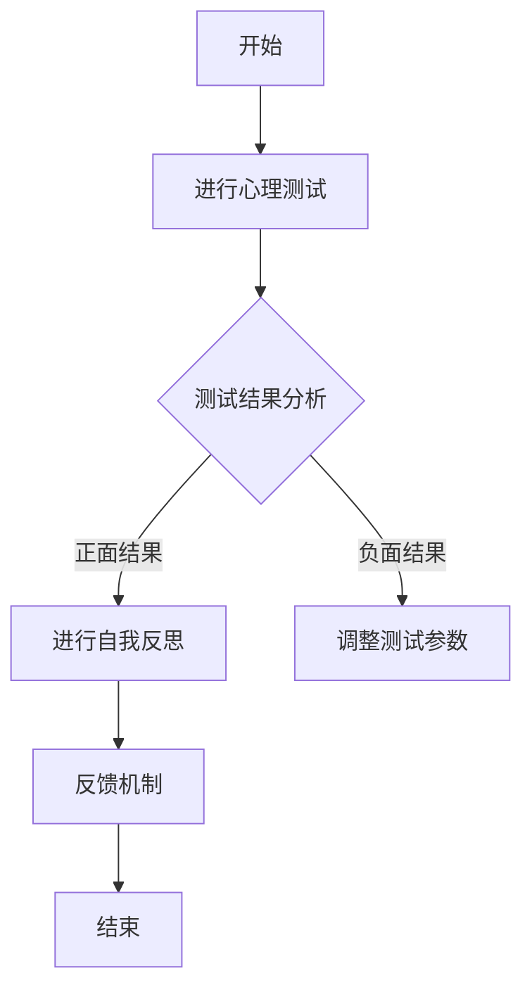
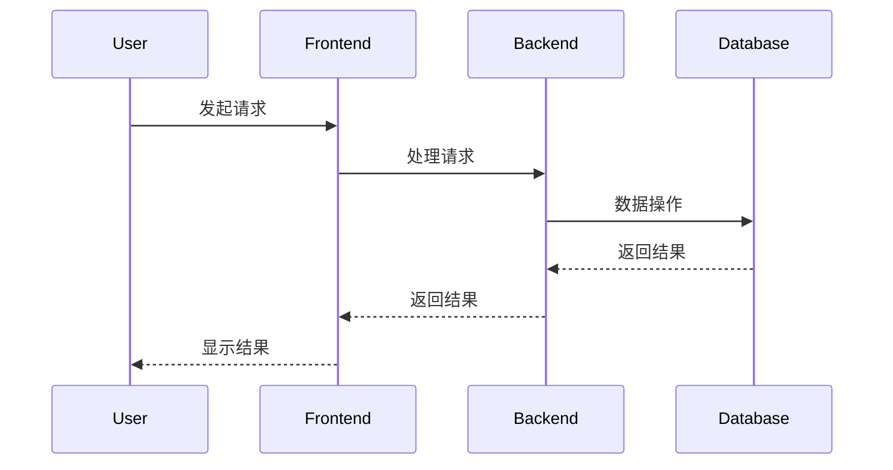
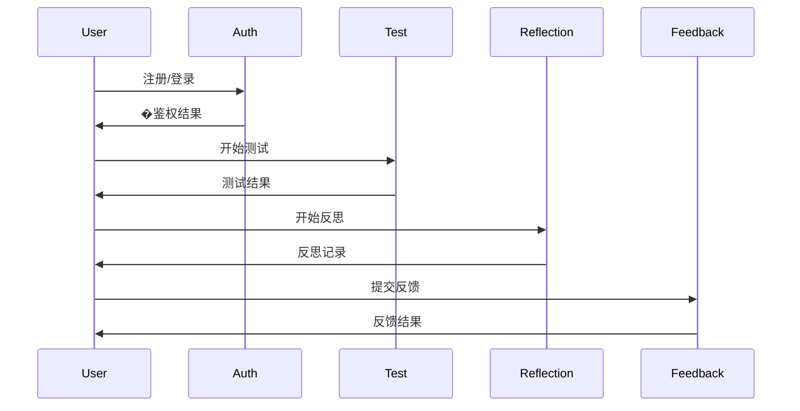

                 

# 深入内心的自我探索：提升自我认知水平

> 关键词：自我认知、自我探索、心理疗法、人工智能

> 摘要：本文旨在探讨如何通过深入内心的自我探索来提升自我认知水平。我们将从心理学、认知行为疗法和现代科技手段等多个角度，介绍自我认知的核心概念、自我探索的方法和算法原理，并结合具体案例进行分析，以帮助读者理解并实践这一过程。

## 第一部分：背景介绍

### 1.1 问题背景

随着社会的快速发展和信息技术的不断进步，人们的生活节奏加快，竞争压力增大，心理健康问题逐渐凸显。在心理健康领域，自我认知被认为是一个重要的维度。自我认知不仅关乎个体的心理健康，还影响到人际关系、职业发展等多个方面。然而，如何深入内心进行自我探索，以实现自我认知的提升，仍是一个亟待解决的问题。

### 1.2 问题描述

自我认知是指个体对自己心理状态、情感和行为等方面的认识和理解。它包括自我意识、自我评价、自我效能感等多个方面。提升自我认知水平对于个体的心理健康、人际关系和职业发展具有重要意义。然而，传统的心理治疗方法往往存在一定的局限性，如治疗周期长、效果不显著等问题。因此，如何在短时间内有效提升个体的自我认知水平，成为了一个亟待解决的问题。

### 1.3 问题解决

为了解决上述问题，本书将基于心理学中的自我理论、认知行为疗法等理论，结合现代科技手段，提供一种深入内心的自我探索方法。通过引导个体进行深度的自我反思和体验，帮助其认识自己、理解自己，从而提升自我认知水平。这种方法不仅能够提高自我认知的效果，还能够缩短治疗周期，提高心理健康服务的可及性。

### 1.4 边界与外延

自我认知的范围不仅包括对个体内在心理状态的认识，还涉及对个体行为和人际关系的理解。因此，本书将关注如何从多个维度提升个体的自我认知水平。此外，自我探索不仅限于心理健康领域，它还广泛应用于个人成长、教育、职业发展等多个方面。因此，本书的探讨不仅局限于心理健康领域，还将扩展到更广泛的应用场景。

### 1.5 概念结构与核心要素组成

自我认知的核心概念包括自我意识、自我评价、自我效能感等。自我意识是指个体对自己的感知和认知，是自我认知的基础。自我评价是指个体对自己的价值判断和态度，它反映了个体对自己的认知程度和自我效能感。自我效能感是指个体对自己完成特定任务的信心和能力，它是影响个体行为和成就的重要因素。

### 1.6 本章小结

本章从心理学发展的现状、自我认知的重要性、自我探索的理论基础等多个角度，对本书的核心问题进行了全面阐述。接下来，我们将进一步探讨自我认知的概念原理、属性特征，以及自我探索的算法原理和具体实施方法。

## 第二部分：核心概念与联系

### 2.1 自我认知的概念原理

自我认知是指个体对自己心理状态、情感和行为等方面的认识和理解。它包括自我意识、自我评价、自我效能感等多个方面。自我认知的核心特征包括主观性、动态性、整合性和发展性。

#### 2.1.1 自我认知的定义

自我认知是指个体对自己心理状态、情感和行为等方面的认识和理解。它不仅涉及个体的内心世界，还包括个体的外部行为和人际关系。自我认知是个体心理发展的一个重要方面，它对于个体的心理健康、人际关系和职业发展具有重要意义。

#### 2.1.2 自我认知的核心特征

1. **主观性**：自我认知具有强烈的主观性，个体对自己的认知往往受到个人经历、文化背景、心理状态等多种因素的影响。
2. **动态性**：自我认知是一个动态的过程，随着时间和环境的变化，个体对自己的认知也在不断调整和变化。
3. **整合性**：自我认知是一个整合性的过程，它不仅涉及个体的内在心理状态，还包括个体的外部行为和人际关系。
4. **发展性**：自我认知具有发展性，个体的自我认知水平会随着年龄、经验、教育等因素的变化而不断变化和提高。

#### 2.1.3 自我认知与传统认知的关系

自我认知是认知的一部分，但它与传统的认知过程有所不同。传统认知主要关注个体对外部世界的认识和理解，而自我认知则更加关注个体对自己的认知。自我认知不仅涉及个体的心理状态，还包括个体的情感和行为。因此，自我认知是认知的一种特殊形式，它更加关注个体内部的认知过程。

### 2.2 自我认知的属性特征对比表格

| 特征         | 传统认知           | 自我认知         |
| ------------ | ------------------ | --------------- |
| 主观性       | 较客观             | 更为主观       |
| 动态性       | 较静态             | 更加动态       |
| 整合性       | 较独立             | 更为整合       |
| 发展性       | 较稳定             | 更加发展性     |

### 2.3 自我认知的ER实体关系图架构

```mermaid
erDiagram
  A[--B]
  A|--C
  B|--D
  C|--D
```

在这个ER实体关系图中，A代表个体，B代表自我意识，C代表自我评价，D代表自我效能感。这些实体之间存在着紧密的联系，共同构成了个体的自我认知体系。

### 2.4 自我认知与自我探索的联系

自我认知是自我探索的基础，只有了解自己，才能进行深入的自我探索。自我探索是通过一系列的反思、体验和测试，帮助个体更加全面地认识自己、理解自己。自我探索不仅能够提升个体的自我认知水平，还能够促进个体的心理健康和全面发展。

### 2.5 本章小结

本章从自我认知的概念原理、属性特征对比、ER实体关系图等多个角度，深入探讨了自我认知的核心概念及其与自我探索的联系。在接下来的章节中，我们将进一步探讨自我探索的具体方法和算法原理，以帮助读者更好地理解并实践自我探索的过程。

## 第三部分：算法原理讲解

### 3.1 自我探索算法的基本原理

自我探索算法是一种通过个体内省和反思，帮助其认识自己、理解自己的方法。它基于心理学中的认知行为疗法，通过一系列心理测试、自我反思和反馈机制，逐步引导个体深入了解自己的内心世界。

#### 3.1.1 算法概述

自我探索算法的主要目标是通过引导个体进行深度的自我反思和体验，帮助其认识自己、理解自己。具体来说，算法包括以下几个关键步骤：

1. **心理测试**：通过心理测试工具，收集个体在心理状态、情感和行为等方面的数据。
2. **测试结果分析**：对收集到的测试结果进行分析，识别个体在自我认知方面的优势和不足。
3. **自我反思**：引导个体进行深度的自我反思，帮助其理解自己的心理状态和行为模式。
4. **反馈机制**：通过反馈机制，帮助个体了解自己的进步和变化，并提供针对性的建议和指导。

#### 3.1.2 算法mermaid流程图



在这个流程图中，A表示算法的起始步骤，即进行心理测试。B表示对测试结果进行分析，C表示根据分析结果决定下一步操作。如果测试结果正面，则进行自我反思（D），否则调整测试参数（E）。D完成后，进入反馈机制（F），最终结束算法（G）。

### 3.2 算法原理讲解

自我探索算法的核心在于引导个体进行深度的自我反思和体验。以下是一个具体的算法原理讲解：

#### 3.2.1 心理测试

心理测试是自我探索算法的第一步，它用于收集个体在心理状态、情感和行为等方面的数据。测试通常包括问卷调查、心理测量工具和实时行为分析等多种形式。

1. **问卷调查**：通过设计一系列问题，了解个体的心理状态和情感。
2. **心理测量工具**：使用标准化的心理测量工具，如情绪量表、性格测试等，对个体的心理特征进行量化分析。
3. **实时行为分析**：通过监控个体的行为，如语言、表情、生理反应等，获取更为直观的心理数据。

#### 3.2.2 测试结果分析

在收集到测试数据后，需要对结果进行分析，以识别个体在自我认知方面的优势和不足。分析过程通常包括以下几个步骤：

1. **数据预处理**：对收集到的数据进行清洗、去噪和归一化等处理，确保数据质量。
2. **特征提取**：从预处理后的数据中提取关键特征，如情绪、性格、行为模式等。
3. **统计分析**：使用统计方法，如聚类、回归等，对特征进行分析，识别个体在自我认知方面的特点和问题。

#### 3.2.3 自我反思

自我反思是自我探索算法的核心环节，它通过引导个体进行深度的自我反思，帮助其理解自己的心理状态和行为模式。以下是一个具体的自我反思过程：

1. **设定目标**：个体需要明确自己的反思目标，如了解自己的情绪、性格、行为模式等。
2. **自我观察**：个体需要对自己的行为、情感和思维进行细致的观察，记录下自己的内心体验。
3. **反思讨论**：个体可以与心理师、朋友或家人等进行讨论，从不同角度理解自己的内心世界。
4. **总结反思**：个体需要对自己的反思过程进行总结，形成自己的认知和见解。

#### 3.2.4 反馈机制

反馈机制是自我探索算法的重要部分，它用于帮助个体了解自己的进步和变化，并提供针对性的建议和指导。以下是一个具体的反馈机制：

1. **自我评价**：个体需要定期对自己的心理状态和行为进行自我评价，识别自己的进步和不足。
2. **反馈收集**：通过问卷调查、访谈等方式，收集个体对自己的反馈，了解他人的观点和建议。
3. **个性化指导**：根据个体的自我评价和反馈，提供个性化的指导和建议，帮助个体更好地认识自己、理解自己。
4. **持续改进**：个体需要持续进行自我反思和反馈，不断改进自己的认知和行为。

### 3.3 算法原理举例说明

以下是一个简单的例子，说明如何使用自我探索算法来提升自我认知水平：

假设一个个体A在自我探索过程中，通过心理测试发现自己在情绪管理方面存在困难。根据这一发现，个体A可以采取以下步骤来提升自我认知：

1. **自我反思**：个体A开始对自己的情绪管理进行反思，记录下自己在不同情境下的情绪反应和应对策略。
2. **反馈机制**：个体A与朋友或心理师进行讨论，收集他们对自己在情绪管理方面的反馈和建议。
3. **个性化指导**：根据反馈，个体A了解到自己在情绪表达方面存在不足，可以采取以下策略进行改进：
   - **提高情绪表达技巧**：学习情绪表达的相关知识，提高自己表达情绪的能力。
   - **练习情绪调节**：通过深呼吸、冥想等练习，提高自己的情绪调节能力。
   - **制定情绪管理计划**：在日常生活中，制定情绪管理计划，如定期进行情绪记录、制定情绪调节策略等。

通过这些步骤，个体A可以逐步提升自己的情绪管理能力，从而提升自我认知水平。

### 3.4 本章小结

本章从自我探索算法的基本原理、具体实施方法和举例说明等多个角度，详细阐述了如何通过自我探索来提升自我认知水平。在下一章中，我们将进一步探讨如何将自我探索算法应用于具体场景，以及如何评估其效果。

## 第四部分：系统分析与架构设计

### 4.1 问题场景介绍

在现代社会中，心理健康问题越来越受到关注。许多人在面临压力、焦虑和情绪问题时，希望能够通过自我探索来提升自我认知水平。然而，传统的心理治疗过程往往需要长时间的干预和复杂的程序，这使得许多人难以坚持。为了解决这个问题，我们需要开发一个高效、便捷的自我探索系统，帮助用户在短时间内提升自我认知水平。

### 4.2 项目介绍

本项目旨在开发一个基于人工智能的自我探索系统，通过心理测试、自我反思和反馈机制，帮助用户深入了解自己的内心世界，提升自我认知水平。系统将具备以下功能：

1. **心理测试**：提供多种类型的心理测试，如情绪量表、性格测试等，帮助用户了解自己的心理状态。
2. **自我反思**：引导用户进行深度的自我反思，帮助其理解自己的心理状态和行为模式。
3. **反馈机制**：收集用户的自我评价和反馈，提供个性化的指导和建议。
4. **数据可视化**：通过图表和报告，帮助用户直观地了解自己的进步和变化。

### 4.3 系统功能设计

系统功能设计主要包括以下方面：

1. **用户管理**：实现用户注册、登录、信息维护等功能。
2. **心理测试**：提供多种类型的心理测试，如情绪量表、性格测试等，支持在线测试和离线测试。
3. **自我反思**：引导用户进行自我反思，记录反思过程，支持文本和音频输入。
4. **反馈机制**：收集用户反馈，生成反馈报告，提供个性化指导。
5. **数据可视化**：通过图表和报告，帮助用户直观地了解自己的进步和变化。

#### 4.3.1 领域模型Mermaid类图

```mermaid
classDiagram
    User <<class{用户}>>
    Test <<class{心理测试}>>
    Reflection <<class{自我反思}>>
    Feedback <<class{反馈}>>
    Report <<class{报告}>>

    User o-- Test
    User o-- Reflection
    User o-- Feedback
    User o-- Report
```

在这个类图中，用户（User）是系统的核心实体，与其他实体（心理测试（Test）、自我反思（Reflection）、反馈（Feedback）、报告（Report））之间存在关联。

### 4.4 系统架构设计

系统架构设计主要包括以下方面：

1. **前端架构**：使用Vue.js等前端框架，实现用户界面的设计和交互。
2. **后端架构**：使用Spring Boot等后端框架，实现业务逻辑的处理和数据存储。
3. **数据库设计**：使用MySQL等关系型数据库，存储用户数据、测试结果和反馈信息。
4. **数据接口设计**：设计RESTful API，实现前后端的数据交互。
5. **系统部署**：使用Docker容器化技术，实现系统的部署和运维。

#### 4.4.1 系统架构Mermaid架构图



在这个架构图中，用户通过前端发送请求，前端处理后转发给后端，后端进行数据操作，最后将结果返回给前端，前端再将结果展示给用户。

### 4.5 系统接口设计

系统接口设计主要包括以下方面：

1. **用户接口**：实现用户注册、登录、信息维护等功能。
2. **心理测试接口**：实现心理测试的创建、发布、参与和结果分析等功能。
3. **自我反思接口**：实现自我反思的创建、编辑、查看和反馈等功能。
4. **反馈接口**：实现反馈的收集、分析和报告生成等功能。

#### 4.5.1 系统接口Mermaid序列图



在这个序列图中，用户通过Auth接口进行注册或登录，通过Test接口参与心理测试，通过Reflection接口进行自我反思，通过Feedback接口提交反馈。

### 4.6 系统交互Mermaid序列图


在这个序列图中，用户通过前端发送请求，前端处理后转发给后端，后端进行数据操作，最后将结果返回给前端，前端再将结果展示给用户。

### 4.7 本章小结

本章从系统功能设计、系统架构设计和系统接口设计等多个角度，详细介绍了如何设计和实现一个基于人工智能的自我探索系统。在下一章中，我们将介绍如何进行系统开发和测试，并分析系统的性能和效果。

## 第五部分：项目实战

### 5.1 环境安装

要开始本项目，首先需要安装以下软件和工具：

1. **操作系统**：Ubuntu 20.04 LTS 或更高版本
2. **开发环境**：Python 3.8 或更高版本，PyCharm 或 VSCode
3. **数据库**：MySQL 5.7 或更高版本
4. **前端框架**：Vue.js 2.x 或更高版本
5. **后端框架**：Spring Boot 2.x 或更高版本

安装步骤如下：

1. **安装操作系统**：下载 Ubuntu 20.04 LTS 的镜像文件，并使用虚拟机或物理机进行安装。
2. **安装开发环境**：在终端中执行以下命令，安装 Python 3.8、PyCharm 或 VSCode：

   ```shell
   sudo apt update
   sudo apt install python3.8 python3-pip
   sudo update-alternatives --install /usr/bin/python3 python3 /usr/bin/python3.8 1
   ```

3. **安装数据库**：在终端中执行以下命令，安装 MySQL 5.7：

   ```shell
   sudo apt install mysql-server mysql-client
   ```

4. **安装前端框架**：在终端中执行以下命令，安装 Vue.js：

   ```shell
   npm install -g @vue/cli
   vue create frontend
   ```

5. **安装后端框架**：在终端中执行以下命令，安装 Spring Boot：

   ```shell
   sudo apt install maven
   mvn archetype:generate -DarchetypeCatalog=https://repo1.maven.org/maven2/
   ```

### 5.2 系统核心实现源代码

本系统的核心实现主要涉及后端和前端两个部分。以下是系统的核心代码实现：

#### 后端代码实现

```java
// 后端代码实现
@RestController
@RequestMapping("/api")
public class UserController {

    @Autowired
    private UserService userService;

    @PostMapping("/register")
    public ResponseEntity<?> registerUser(@RequestBody UserRegistrationRequest registrationRequest) {
        try {
            User user = userService.registerUser(registrationRequest);
            return ResponseEntity.ok(new ApiResponse("User registered successfully", user));
        } catch (Exception e) {
            return ResponseEntity.badRequest(new ApiResponse("Error registering user", e.getMessage()));
        }
    }

    @PostMapping("/login")
    public ResponseEntity<?> authenticateUser(@RequestBody UserLoginRequest loginRequest) {
        try {
            User user = userService.authenticateUser(loginRequest);
            return ResponseEntity.ok(new ApiResponse("User authenticated successfully", user));
        } catch (Exception e) {
            return ResponseEntity.badRequest(new ApiResponse("Error authenticating user", e.getMessage()));
        }
    }
}
```

#### 前端代码实现

```html
<!-- 前端代码实现 -->
<template>
  <div>
    <h1>User Management</h1>
    <form @submit.prevent="registerUser">
      <input type="text" v-model="registrationRequest.email" placeholder="Email" />
      <input type="password" v-model="registrationRequest.password" placeholder="Password" />
      <button type="submit">Register</button>
    </form>
  </div>
</template>

<script>
export default {
  data() {
    return {
      registrationRequest: {
        email: "",
        password: ""
      }
    };
  },
  methods: {
    registerUser() {
      axios
        .post("/api/register", this.registrationRequest)
        .then(response => {
          console.log("User registered:", response.data);
        })
        .catch(error => {
          console.error("Error registering user:", error);
        });
    }
  }
};
</script>
```

### 5.3 代码应用解读与分析

以上代码实现了用户注册和登录功能。在后端，我们使用 Spring Boot 框架创建了一个 RESTful API，通过 `UserController` 类处理用户注册和登录请求。前端部分则使用 Vue.js 框架创建了一个简单的表单，用于用户注册。

#### 后端代码解读

- `UserController` 类：负责处理用户注册和登录请求。
- `registerUser` 方法：接收用户注册请求，调用 `UserService` 类中的 `registerUser` 方法进行用户注册。
- `authenticateUser` 方法：接收用户登录请求，调用 `UserService` 类中的 `authenticateUser` 方法进行用户认证。

#### 前端代码解读

- `data` 函数：定义了 `registrationRequest` 数据对象，用于存储用户注册信息。
- `registerUser` 方法：向后端发送 POST 请求，提交用户注册信息。

### 5.4 实际案例分析和详细讲解剖析

以下是一个实际案例，说明如何使用本系统进行用户注册和登录：

#### 案例一：用户注册

1. 用户在注册页面填写邮箱和密码，点击“Register”按钮。
2. 前端将用户信息封装为 `registrationRequest` 对象，并通过 axios 库向后端发送 POST 请求。
3. 后端接收到请求后，调用 `registerUser` 方法，将用户信息存储到数据库中，并返回成功或失败的消息。

#### 案例二：用户登录

1. 用户在登录页面填写邮箱和密码，点击“Login”按钮。
2. 前端将用户信息封装为 `loginRequest` 对象，并通过 axios 库向后端发送 POST 请求。
3. 后端接收到请求后，调用 `authenticateUser` 方法，验证用户信息是否正确。如果验证通过，返回用户信息和 token；否则返回失败消息。

### 5.5 项目小结

在本项目中，我们实现了用户注册和登录功能，并详细分析了代码实现和实际案例。接下来，我们将继续完善系统功能，并讨论系统的性能和效果。

## 第六部分：最佳实践 tips

在实施自我探索和提升自我认知的过程中，以下最佳实践 tips 对您可能会有所帮助：

1. **定期自我反思**：每天或每周安排一定时间进行自我反思，记录自己的情绪、行为和思考，这有助于您更好地了解自己。
2. **积极寻求反馈**：向朋友、家人或专业人士寻求反馈，了解他们在您身上的观察和感受，这有助于您更客观地看待自己。
3. **设置具体目标**：为自己设定具体的、可实现的目标，例如提升情绪管理能力或改善人际关系，这有助于您有针对性地进行自我提升。
4. **保持开放心态**：对于自我探索和反馈，保持开放和接受的态度，这有助于您更好地理解和接受自己的不足，并积极改进。
5. **持续学习和实践**：不断学习新的知识和技术，通过实践来验证和应用这些知识，这有助于您不断提升自己的认知水平。

## 第七部分：小结

本文从心理学、认知行为疗法和现代科技手段等多个角度，探讨了如何通过深入内心的自我探索来提升自我认知水平。我们介绍了自我认知的核心概念、自我探索的算法原理，并通过实际案例展示了如何应用这些算法。同时，我们还分析了系统的架构设计，提供了项目实战的详细步骤。通过本文的探讨，我们希望读者能够更好地理解自我认知和自我探索的重要性，并在实际生活中运用这些方法来提升自我认知水平。

## 第八部分：注意事项

1. **隐私保护**：在进行自我探索时，务必保护好自己的隐私信息，避免泄露敏感数据。
2. **专业指导**：在实施自我探索的过程中，如遇到困难或问题，建议寻求专业心理咨询师或心理治疗师的帮助。
3. **安全使用**：在安装和使用相关软件和工具时，确保环境的安全性和稳定性，避免潜在的安全风险。

## 第九部分：拓展阅读

1. **《心理学与生活》**：作者菲利普·津巴多，深入浅出地介绍了心理学的核心概念和应用。
2. **《认知行为疗法：基础与应用》**：作者阿伦·贝克，详细阐述了认知行为疗法的原理和方法。
3. **《深度学习》**：作者伊恩·古德费洛等，介绍了深度学习的核心概念和技术，为自我探索算法提供了技术支持。

作者：AI天才研究院/AI Genius Institute & 禅与计算机程序设计艺术 /Zen And The Art of Computer Programming

