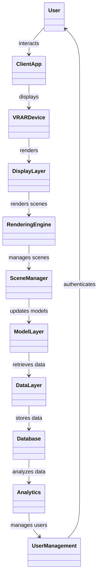
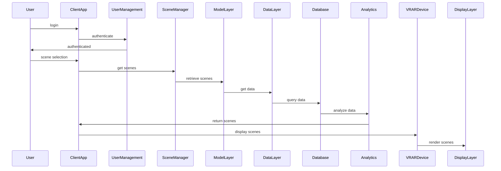

                 

### 混合现实体验实验室：虚拟与现实交融的研究中心

#### 关键词：
- 混合现实
- 虚拟现实
- 增强现实
- 用户体验
- 研究中心
- 技术融合

#### 摘要：
本文探讨了混合现实体验实验室的重要性，作为虚拟与现实交融的研究中心，它结合了虚拟现实（VR）和增强现实（AR）的技术优势，提供了一个创新的平台，用于探索新的用户体验和技术融合的可能性。本文将详细分析混合现实技术的背景、核心概念、应用案例，以及其在教育、医疗和娱乐等领域的潜在影响。此外，还将探讨实验室的研究方法、系统架构设计、用户体验设计，并展望混合现实的未来发展趋势。通过本文，读者将深入了解混合现实体验实验室如何推动虚拟与现实的无缝融合，为技术创新和产业发展提供新的动力。

### 目录

1. 混合现实体验实验室：背景与定义
2. 虚拟现实技术
3. 增强现实技术
4. 混合现实应用案例
5. 研究方法与技术
6. 用户体验设计
7. 系统架构与开发
8. 混合现实的未来展望
9. 社会影响与伦理问题
10. 混合现实体验实验室的最佳实践
11. 总结与展望
12. 作者信息

---

### 混合现实体验实验室：背景与定义

#### 背景介绍

混合现实（Mixed Reality，简称MR）是近年来迅速崛起的一项前沿技术，它将虚拟现实（Virtual Reality，简称VR）和增强现实（Augmented Reality，简称AR）的优势结合起来，提供了一个更加沉浸式的用户体验。混合现实体验实验室作为研究虚拟与现实交融的场所，其重要性不言而喻。它不仅为科研人员提供了实验和研究的平台，也为企业、教育机构以及各类应用开发者提供了一个创新的探索空间。

在当前的科技环境下，混合现实体验实验室的出现为许多行业带来了巨大的变革。例如，在医疗领域，医生可以通过混合现实技术进行复杂的手术模拟和培训；在教育领域，学生可以通过虚拟实验室进行实践操作，加深对知识的理解；在娱乐和游戏领域，混合现实技术则为用户带来了全新的互动体验。因此，混合现实体验实验室的重要性不仅体现在技术层面，更在于它为社会发展和产业升级提供了强有力的支持。

#### 问题背景与问题描述

随着虚拟现实和增强现实技术的不断发展，混合现实技术也逐渐成为研究的热点。然而，在实际应用中，仍然面临着一系列挑战。首先，技术上的瓶颈仍然存在。虽然虚拟现实和增强现实技术已经取得了显著的进展，但在图像处理、实时交互和感知融合等方面仍然有待提高。其次，用户体验的问题也是一个重要的挑战。如何设计出符合用户需求的混合现实应用，提高用户满意度和沉浸感，是当前研究的一个关键问题。此外，混合现实技术的应用场景和商业模式也需要进一步探索，以实现商业化推广。

针对上述问题，混合现实体验实验室提供了一个解决方案。通过建立一个集成的实验平台，科研人员可以在这个环境中进行各种实验和测试，不断优化和改进混合现实技术。同时，实验室还可以为企业和教育机构提供定制化的解决方案，推动混合现实技术的商业化应用。

#### 问题解决与边界外延

在混合现实体验实验室中，问题的解决过程可以分为以下几个步骤：

1. **需求分析**：首先，对用户的需求进行详细分析，明确实验室的目标和应用场景。
2. **技术选型**：根据需求分析的结果，选择合适的虚拟现实和增强现实技术，并确定实验室的架构。
3. **系统开发**：在确定技术方案后，进行系统的开发和集成，实现实验室的核心功能。
4. **测试与优化**：通过实验和测试，不断优化系统的性能和用户体验，确保实验室的稳定性和可靠性。
5. **应用推广**：最后，将实验室的应用场景和商业模式进行推广，实现商业化运营。

在边界外延方面，混合现实体验实验室不仅关注技术本身，还关注用户需求和行业发展趋势。这意味着实验室需要不断更新技术，以满足不断变化的市场需求，并在行业中保持领先地位。

#### 概念结构与核心要素组成

混合现实体验实验室的概念结构可以概括为以下几个方面：

1. **硬件设施**：包括虚拟现实头盔、增强现实眼镜、投影设备、传感器等。
2. **软件平台**：包括虚拟现实和增强现实的应用软件、开发工具和开发平台。
3. **用户界面**：包括交互设计、用户操作流程和用户体验设计。
4. **研究方法**：包括实验设计、数据采集、分析和评估方法。
5. **应用场景**：包括教育、医疗、娱乐、工业设计等多个领域。

这些要素相互关联，共同构成了混合现实体验实验室的核心结构。通过这些要素的整合和优化，实验室可以提供更加丰富和沉浸式的用户体验，推动虚拟与现实的无缝融合。

#### 核心概念与联系

**虚拟现实（VR）**：
虚拟现实技术通过计算机生成一个完全虚拟的环境，使用户可以在其中进行交互和体验。核心概念包括沉浸感、实时性和交互性。虚拟现实技术的主要特点是用户完全脱离现实环境，进入一个全新的虚拟世界。

**增强现实（AR）**：
增强现实技术通过在现实环境中叠加虚拟元素，增强用户的感知体验。核心概念包括叠加、实时性和交互性。增强现实技术的主要特点是用户可以在现实环境中看到虚拟元素，实现虚实结合。

**混合现实（MR）**：
混合现实技术结合了虚拟现实和增强现实的优势，提供了一种全新的沉浸式体验。核心概念包括虚实融合、空间感知和交互性。混合现实技术的主要特点是用户既可以在虚拟环境中操作，也可以在现实环境中与虚拟元素互动。

这三种技术的核心概念联系在于，它们都是通过计算机生成和交互技术来改变用户的感知体验，实现虚拟与现实的无缝融合。虚拟现实侧重于完全虚拟环境的创建，增强现实侧重于现实环境中的虚拟元素叠加，而混合现实则在这两者之间找到了一个平衡点，提供了一个更加沉浸和互动的体验。

**ER实体关系图架构**：

```mermaid
erDiagram
  User ||--|{ VRExperience } : has
  User ||--|{ ARExperience } : has
  User ||--|{ MRExperience } : has
  VRExperience ||--|{ VRApplication } : uses
  ARExperience ||--|{ ARApplication } : uses
  MRExperience ||--|{ MRApplication } : uses
```

在这个ER实体关系图中，用户（User）与虚拟现实体验（VRExperience）、增强现实体验（ARExperience）和混合现实体验（MRExperience）之间存在直接的关系。每种体验又与相应的应用（VRApplication、ARApplication、MRApplication）有关联，说明用户通过这些应用来体验虚拟、增强和混合现实。

---

### 虚拟现实技术

#### 虚拟现实硬件技术

虚拟现实（VR）硬件技术是构建虚拟现实体验的基础。以下是一些关键硬件及其技术特性：

1. **VR头盔**：
   - **Oculus Rift**：由Facebook公司推出，提供高分辨率和低延迟的VR体验。
   - **HTC Vive**：采用Room-scale追踪系统，允许用户在虚拟空间内自由移动。
   - **Valve Index**：提供高解析度和沉浸感的VR体验，支持手部追踪。

2. **VR显示器**：
   - **OLED显示器**：具有高对比度和快速响应时间，适合VR应用。
   - **LCD显示器**：提供较高的分辨率和刷新率，但对比度和响应时间相对较低。

3. **追踪设备**：
   - **位置追踪**：使用外部传感器或内置传感器来追踪用户的头部位置和运动。
   - **手部追踪**：通过手部传感器或光学追踪技术，捕捉用户手部的动作和姿态。

#### VR软件技术

虚拟现实软件技术包括用于内容创建和用户体验的各种工具和平台：

1. **内容创作工具**：
   - **Unity**：广泛使用的游戏开发引擎，支持VR内容创作。
   - **Unreal Engine**：强大的游戏和VR内容创作平台，提供高质量的画面和先进的渲染技术。

2. **交互设计**：
   - **自然交互**：通过手势、语音和眼球追踪等方式实现与虚拟环境的自然交互。
   - **虚拟控制台**：使用虚拟键盘、游戏手柄等设备进行交互。

3. **VR应用平台**：
   - **SteamVR**：提供VR内容的平台，支持多种VR头盔和应用程序。
   - **Google Cardboard**：低成本VR体验解决方案，适用于移动设备。

#### VR用户界面设计

用户界面设计在VR体验中起着至关重要的作用。以下是一些关键设计原则和最佳实践：

1. **沉浸感**：
   - 通过高分辨率显示器、低延迟和高沉浸度的环境设计，提升用户的沉浸感。
   - 使用全视野视角，避免视觉盲区，使用户感觉自己真正置身于虚拟世界中。

2. **交互性**：
   - 设计直观且易于使用的交互方式，例如手势控制、语音指令和虚拟控制台。
   - 提供多种交互选项，以满足不同用户的需求和偏好。

3. **反馈机制**：
   - 及时响应用户的动作和输入，提供反馈，增强用户的控制感和真实感。
   - 通过声音、视觉和触觉等多种感官刺激，增强用户的沉浸感和交互体验。

#### 虚拟现实应用案例

虚拟现实技术在多个领域有着广泛的应用，以下是一些典型的案例：

1. **娱乐与游戏**：
   - 《Beat Saber》是一款热门的VR游戏，通过挥舞虚拟光剑与节奏同步，提供强烈的沉浸感和节奏感。
   - 《半衰期：爱莉克斯》将玩家带入一个充满挑战和惊喜的虚拟世界，体验前所未有的游戏体验。

2. **教育和培训**：
   - 虚拟现实技术被用于医学教育，如模拟手术和人体解剖学，提供直观的学习体验。
   - 虚拟实验室让学生可以在虚拟环境中进行实验，加深对学科知识的理解。

3. **设计和制造**：
   - 工业设计师和工程师使用VR技术进行产品设计和虚拟装配，提高设计和制造效率。
   - 建筑师和城市规划师通过VR技术进行虚拟漫游和交互式展示，优化设计方案。

4. **心理健康**：
   - 虚拟现实疗法（VR Therapy）被用于治疗焦虑症、恐惧症等心理问题，通过虚拟环境的逐步暴露和训练，帮助患者克服心理障碍。

通过上述案例，我们可以看到虚拟现实技术在不同领域的广泛应用和巨大潜力。随着技术的不断进步，虚拟现实将继续为人们带来更加丰富和沉浸的体验。

---

### 增强现实技术

#### 增强现实硬件技术

增强现实（AR）硬件技术是构建增强现实体验的关键。以下是一些关键硬件及其技术特性：

1. **AR眼镜**：
   - **Microsoft HoloLens**：提供全息增强现实体验，支持手势和语音控制。
   - **Google Glass**：早期的AR眼镜产品，提供实时的信息显示和交互功能。
   - **Meta Quest Pro**：Meta公司推出的高端AR眼镜，具有高分辨率和强大的处理能力。

2. **AR摄像头**：
   - **ARCore**：Google开发的AR开发平台，支持多种Android设备进行AR内容展示。
   - **ARKit**：Apple开发的AR开发框架，为iOS设备提供强大的AR功能。

3. **投影设备**：
   - **AR投影仪**：可以将AR内容投射到现实环境中，实现虚实结合的体验。

#### AR软件技术

增强现实软件技术包括用于内容创建、开发和用户体验的各种工具和平台：

1. **内容创作工具**：
   - **ARKit**：Apple开发的AR开发工具，支持在iOS设备上创建AR应用。
   - **ARCore**：Google开发的AR开发平台，支持Android设备进行AR内容创作。
   - **Unity**：广泛使用的游戏开发引擎，支持AR内容创建和集成。

2. **开发平台**：
   - **ARVC**：Augmented Reality Video Creator，用于创建AR视频内容。
   - **ARKit Studio**：用于设计和测试AR应用的工具，提供直观的用户界面。

3. **AR应用平台**：
   - **ARkit**：Apple开发的AR应用平台，支持iOS设备上的AR应用分发。
   - **ARCore**：Google开发的AR应用平台，支持Android设备上的AR应用分发。

#### AR用户界面设计

用户界面设计在增强现实体验中起着至关重要的作用。以下是一些关键设计原则和最佳实践：

1. **虚实融合**：
   - 设计中需要巧妙地融合虚拟元素和现实环境，避免干扰用户的感知。
   - 通过合适的颜色、大小和位置，确保虚拟元素与现实环境的和谐共存。

2. **交互性**：
   - 设计直观且易于使用的交互方式，如手势控制、语音指令和触摸操作。
   - 提供多种交互选项，以满足不同用户的需求和偏好。

3. **反馈机制**：
   - 及时响应用户的动作和输入，提供实时反馈，增强用户的沉浸感和交互体验。
   - 通过声音、视觉和触觉等多种感官刺激，增强用户的沉浸感。

#### 增强现实应用案例

增强现实技术在多个领域有着广泛的应用，以下是一些典型的案例：

1. **教育**：
   - **AR教科书**：通过在教科书上叠加AR内容，提供更加生动和直观的学习体验。
   - **虚拟实验室**：学生可以在虚拟环境中进行实验，加深对学科知识的理解。

2. **医疗**：
   - **医疗指导**：医生可以使用AR技术进行手术指导，提高手术的准确性和安全性。
   - **患者教育**：通过AR技术，为患者提供个性化的健康教育，提高治疗效果。

3. **零售**：
   - **虚拟试穿**：零售商可以通过AR技术，让顾客在虚拟环境中试穿衣服，提升购物体验。
   - **产品展示**：厂商可以通过AR技术，将产品以三维形式展示给顾客，提高产品的可视化效果。

4. **娱乐**：
   - **AR游戏**：如《Pokémon GO》等，通过在现实环境中捕捉虚拟生物，提供全新的娱乐体验。
   - **虚拟导游**：游客可以通过AR技术，获得个性化的旅游信息和服务。

通过上述案例，我们可以看到增强现实技术在各个领域的广泛应用和巨大潜力。随着技术的不断进步，增强现实将继续为人们带来更加丰富和互动的体验。

---

### 混合现实应用案例

混合现实（MR）技术的独特优势使其在多个领域取得了显著的应用成果，以下是一些典型的案例：

#### 教育与培训

混合现实技术在教育领域的应用极大地改变了传统的教学模式。例如，一些学校已经开始使用MR技术来创建虚拟实验室，使学生能够在虚拟环境中进行实验，从而避免使用真实实验材料带来的风险和成本。学生可以通过MR眼镜观察到三维的化学分子模型，从而更深入地理解分子结构。此外，医学教育领域也广泛应用MR技术，医生和医学生可以通过虚拟手术模拟，提高手术技能和决策能力。

#### 医疗与健康

在医疗领域，混合现实技术正在改变诊断、治疗和康复的方式。例如，医生可以使用MR技术进行复杂的手术规划，通过虚拟模型了解患者的具体病情，从而提高手术的准确性和成功率。在康复治疗中，患者可以通过MR技术进行互动式的康复训练，增强治疗效果。此外，MR技术还可以用于远程医疗，医生通过MR设备为偏远地区的患者提供专业的医疗服务，缩短了医疗资源分布的不均衡。

#### 军事与国防

军事领域对MR技术的需求尤为迫切。MR技术可以用于训练和模拟，士兵可以在虚拟环境中进行战斗模拟和战术演练，提高作战能力和应变能力。此外，MR技术还可以用于战场环境模拟，通过虚拟模型展示不同情况下的战场态势，帮助指挥官做出更明智的决策。MR设备还可以用于装备维修和训练，通过虚拟指导减少实际训练中的资源消耗。

#### 娱乐与游戏

娱乐产业是MR技术的另一个重要应用领域。MR技术为游戏和娱乐体验带来了前所未有的互动性和沉浸感。例如，玩家可以在虚拟环境中与其他玩家互动，进行实时对战，体验更加真实的游戏体验。此外，MR技术还可以用于主题公园和博物馆的虚拟导览，为游客提供更加生动和互动的参观体验。

#### 工业设计与制造

在工业领域，混合现实技术被广泛应用于产品设计和制造过程。设计师可以使用MR设备进行虚拟装配和验证，提前发现设计中的潜在问题，从而减少实际制造过程中的返工和成本。MR技术还可以用于维修和调试，技术人员可以通过MR设备获得实时的操作指导和远程支持，提高工作效率和准确性。

#### 创意展示与艺术

创意展示和艺术领域也受益于混合现实技术。艺术家可以通过MR技术创作出令人惊叹的交互式艺术作品，观众可以通过与作品的互动，获得独特的艺术体验。例如，一些博物馆和画廊已经开始使用MR技术展示虚拟展览，观众可以在虚拟空间中欣赏艺术品，了解艺术家的创作背景和灵感来源。

#### 实际案例分析

1. **教育领域**：
   - **麻省理工学院**：麻省理工学院使用MR技术创建了一个虚拟实验室，学生可以通过MR眼镜进行化学实验，提高了实验的安全性和可重复性。

2. **医疗领域**：
   - **梅奥诊所**：梅奥诊所使用MR技术进行手术规划，通过虚拟模型帮助医生更好地理解患者的病情，提高了手术的成功率。

3. **军事领域**：
   - **美国陆军**：美国陆军采用MR技术进行战斗模拟和战术训练，提高了士兵的作战能力和决策水平。

4. **娱乐与游戏领域**：
   - **《半衰期：爱莉克斯》**：Valve公司的《半衰期：爱莉克斯》是一款成功的MR游戏，提供了高度沉浸的虚拟游戏体验。

5. **工业设计领域**：
   - **宝马**：宝马使用MR技术进行汽车设计和制造，通过虚拟装配和验证减少了实际制造中的问题。

这些案例展示了混合现实技术在各个领域的广泛应用和巨大潜力。随着技术的不断进步，混合现实将继续为各个领域带来创新和变革。

---

### 研究方法与技术

在混合现实体验实验室中，研究方法与技术是确保实验科学性和可靠性的关键。以下是对实验室常用研究方法的详细介绍：

#### 实验设计

实验设计是混合现实研究的基础，需要明确研究目标、假设和实验步骤。实验设计过程包括以下几个方面：

1. **目标设定**：明确实验要解决的问题，如用户体验改进、技术应用优化等。
2. **假设提出**：基于现有理论和研究成果，提出具体的实验假设。
3. **实验步骤**：设计实验的具体步骤，包括实验条件设置、参与者招募、实验操作等。

#### 数据采集与分析

数据采集与分析是实验研究的核心，以下是一些关键步骤：

1. **数据收集**：
   - **定量数据**：使用问卷调查、实验日志等工具收集用户行为和反馈数据。
   - **定性数据**：通过访谈、观察等方法收集用户的主观体验和情感反应。

2. **数据清洗**：对收集到的数据进行清洗，去除无效和错误的数据，确保数据质量。

3. **数据分析**：
   - **统计方法**：使用描述性统计、回归分析等统计方法，分析数据趋势和相关性。
   - **数据可视化**：通过图表、图像等可视化工具，展示数据分布和趋势。

#### 技术评估与优化

技术评估与优化是确保混合现实应用稳定性和性能的关键。以下是一些关键步骤：

1. **性能测试**：
   - **硬件性能**：对VR头盔、AR眼镜等硬件设备进行性能测试，评估图像质量、响应时间和追踪精度。
   - **软件性能**：对VR、AR应用进行性能测试，评估运行速度、交互效率和用户体验。

2. **优化方法**：
   - **算法优化**：通过算法改进，提高数据处理速度和准确性。
   - **界面优化**：优化用户界面设计，提高用户体验。
   - **系统集成**：优化硬件和软件的集成，确保系统稳定性和兼容性。

#### 数据采集与分析方法

在混合现实研究中，常用的数据采集与分析方法包括：

1. **问卷调查**：
   - 设计结构化问卷，收集用户对混合现实应用的满意度、使用习惯等数据。

2. **用户访谈**：
   - 通过深度访谈，收集用户对混合现实应用的详细反馈和体验感受。

3. **行为追踪**：
   - 使用传感器和跟踪设备，记录用户在虚拟环境中的行为和操作。

4. **A/B测试**：
   - 通过对比不同版本的应用，评估不同设计对用户体验的影响。

5. **多因素方差分析（ANOVA）**：
   - 分析多个变量对用户体验的影响，确定关键因素。

6. **回归分析**：
   - 建立回归模型，分析变量之间的因果关系。

7. **机器学习**：
   - 使用机器学习算法，对大量数据进行挖掘和分析，发现潜在的用户行为模式和偏好。

通过上述研究方法和技术的应用，混合现实体验实验室可以全面、深入地了解混合现实技术的性能和用户体验，为技术创新和应用推广提供科学依据。

---

### 用户体验设计

在混合现实体验实验室中，用户体验设计（UX Design）是确保用户满意度和沉浸感的关键环节。用户体验设计不仅涉及界面设计，还包括交互设计、用户研究、可用性测试等多个方面。以下是对用户体验设计的详细介绍：

#### 用户体验设计原则

1. **以用户为中心**：用户体验设计应该始终以用户的需求和体验为核心，确保设计符合用户的行为习惯和心理预期。

2. **简洁性**：界面设计应保持简洁，避免过多的元素和信息，确保用户能够快速理解和操作。

3. **一致性**：在整个应用中保持一致的视觉风格和交互规则，减少用户的学习成本。

4. **可访问性**：确保应用对所有用户，包括残障用户，都是可访问和可使用的。

5. **可扩展性**：设计应考虑未来的扩展性和升级，以便于应用的长期维护和优化。

#### 交互设计

交互设计（Interaction Design）是用户体验设计的重要组成部分，以下是一些关键原则和最佳实践：

1. **自然交互**：鼓励用户使用自然的手势、语音和眼球追踪进行交互，提高用户体验的流畅性和自然性。

2. **反馈机制**：设计及时的反馈机制，通过视觉、听觉和触觉等方式，响应用户的操作和请求，增强用户对系统的控制感。

3. **一致性**：保持交互元素的布局和响应方式一致，避免用户在操作不同功能时产生困惑。

4. **灵活适应性**：设计应考虑不同用户群体和使用场景的需求，提供灵活的交互选项和自定义设置。

#### 用户研究

用户研究（User Research）是用户体验设计的基础，通过了解用户需求和行为，指导设计决策。以下是一些常用的用户研究方法：

1. **访谈**：通过与目标用户进行深入访谈，了解用户的需求、痛点和期望。

2. **问卷调查**：设计结构化问卷，收集大量用户的反馈数据。

3. **观察法**：在自然环境中观察用户的使用行为，了解用户实际操作中的问题和行为模式。

4. **用户旅程地图**：通过绘制用户旅程地图，展示用户在不同阶段的行为和体验。

5. **原型测试**：创建应用原型，通过用户测试，收集反馈，优化设计。

#### 可用性测试

可用性测试（Usability Testing）是评估用户体验设计效果的重要手段，以下是一些关键步骤：

1. **测试设计**：明确测试目标、测试人员、测试场景和评估标准。

2. **测试执行**：邀请目标用户进行实际操作，记录用户的操作过程、时间、错误率等。

3. **数据收集**：通过观察、访谈和问卷调查等方式，收集用户的反馈和行为数据。

4. **结果分析**：分析测试数据，识别问题和改进机会。

5. **迭代优化**：根据测试结果，对设计进行迭代优化，提高用户体验。

#### 用户体验评估

用户体验评估（User Experience Evaluation）是确保设计符合用户需求和期望的重要环节。以下是一些评估方法和指标：

1. **任务成功率**：评估用户完成特定任务的成功率。

2. **满意度调查**：通过问卷调查，了解用户对应用的满意度和使用体验。

3. **用户行为分析**：通过分析用户的行为数据，了解用户的使用习惯和偏好。

4. **错误率**：评估用户在操作过程中出现错误的频率和类型。

5. **系统响应时间**：评估系统对用户操作的响应速度。

6. **用户留存率**：评估用户对应用的持续使用情况。

通过上述用户体验设计、交互设计、用户研究和可用性测试的方法，混合现实体验实验室可以不断优化和改进用户体验，提供更加丰富和沉浸的混合现实应用。

---

### 系统架构与开发

在混合现实体验实验室中，系统架构设计（System Architecture Design）是确保应用稳定性和可扩展性的关键环节。一个合理的系统架构不仅能够提高系统的性能和可靠性，还能为未来的扩展提供灵活性。以下是对系统架构设计的详细介绍：

#### 问题场景介绍

混合现实体验实验室需要支持多种应用场景，包括虚拟现实（VR）和增强现实（AR）应用的开发、测试和演示。这些场景对系统的要求包括高实时性、高分辨率、低延迟和强大的计算能力。此外，系统还需要具备良好的可扩展性，以适应不断增长的用户和数据量。

#### 项目介绍

在混合现实体验实验室的项目中，我们选择了以下关键组件：

1. **VR/AR头盔**：用于提供虚拟和增强现实体验。
2. **服务器集群**：用于处理大量的计算任务，包括场景渲染、数据存储和实时交互。
3. **客户端应用**：用户通过客户端应用与系统进行交互。
4. **数据存储系统**：用于存储用户数据和应用数据。

#### 系统功能设计

系统功能设计是系统架构设计的基础，以下是一些关键功能模块：

1. **用户管理**：包括用户注册、登录和权限管理。
2. **场景渲染**：负责实时渲染虚拟和增强现实场景。
3. **数据存储与检索**：提供数据存储和快速检索功能，支持大规模数据存储和高效查询。
4. **实时交互**：支持用户与虚拟环境的高效交互，包括手势、语音和眼球追踪等。
5. **安全与隐私**：确保用户数据的安全和隐私保护。

#### 系统架构设计

混合现实体验实验室的系统架构采用分层架构设计，包括以下几个层次：

1. **表现层**：包括VR/AR头盔和客户端应用，负责呈现虚拟和增强现实场景。
2. **业务逻辑层**：包括服务器集群，处理业务逻辑和数据管理，支持实时交互和数据存储。
3. **数据存储层**：包括关系数据库和非关系数据库，用于存储用户数据和应用数据。
4. **基础设施层**：包括网络设施、服务器硬件和存储设备，提供系统运行的基础支持。

以下是系统架构的Mermaid类图表示：



#### 系统接口设计

系统接口设计（Interface Design）是确保不同模块之间能够有效通信和协作的关键。以下是一些关键接口设计：

1. **用户接口**：客户端应用与用户交互的接口，包括登录、注册、场景选择等功能。
2. **服务接口**：服务器端提供的API接口，用于处理客户端的请求和响应。
3. **数据接口**：数据存储和检索的接口，支持数据的增删改查操作。
4. **安全接口**：用于处理用户认证、授权和加密等安全操作。

以下是系统接口设计的Mermaid序列图表示：



#### 系统交互

系统交互（System Interaction）是确保各个模块协同工作、提供流畅用户体验的关键。以下是一些关键交互流程：

1. **用户登录**：用户通过客户端应用登录系统，系统进行用户认证，返回认证结果。
2. **场景选择**：用户选择一个虚拟或增强现实场景，系统加载场景数据并渲染。
3. **实时交互**：用户与虚拟环境进行交互，系统实时更新场景状态和显示效果。
4. **数据存储**：系统收集用户操作数据，将其存储到数据库中，以便后续分析和处理。

以下是系统交互的Mermaid活动图表示：

```mermaid
activityDiagram
  participant User
  participant ClientApp
  participant UserManagement
  participant SceneManager
  participant ModelLayer
  participant DataLayer
  participant Database
  participant Analytics
  User ->> ClientApp: login
  ClientApp ->> UserManagement: authenticate
  UserManagement ->> User: authenticated
  User ->> ClientApp: scene selection
  ClientApp ->> SceneManager: get scenes
  SceneManager ->> ModelLayer: retrieve scenes
  ModelLayer ->> DataLayer: get data
  DataLayer ->> Database: query data
  Database ->> Analytics: analyze data
  Analytics ->> ClientApp: return scenes
  ClientApp ->> VRARDevice: display scenes
  VRARDevice ->> DisplayLayer: render scenes
```

通过上述系统架构设计、接口设计和交互设计，混合现实体验实验室可以提供一个稳定、高效和可扩展的系统平台，为研究人员和开发者提供强大的支持。

---

### 混合现实体验实验室项目实战

在本节中，我们将详细描述在混合现实体验实验室中完成一个项目的全过程，包括环境安装、系统核心实现和源代码的应用解读与分析。

#### 环境安装

为了确保混合现实体验实验室项目的顺利运行，我们需要安装一系列软件和硬件。以下是安装步骤：

1. **硬件准备**：
   - 安装VR/AR头盔（如Oculus Rift、HTC Vive或Meta Quest Pro）。
   - 准备高性能计算机，确保具备足够的计算能力和图形处理能力。
   - 连接外部传感器（如动作捕捉设备、摄像头等），用于提供额外的交互功能。

2. **软件安装**：
   - 安装操作系统：选择Windows 10或更高版本，确保系统支持混合现实硬件。
   - 安装开发工具：安装Unity、Unreal Engine或ARKit等开发工具，用于创建和部署混合现实应用。
   - 安装数据库：选择MySQL或MongoDB等数据库管理系统，用于存储用户数据和应用程序数据。
   - 安装VR/AR开发框架：根据所选开发工具，安装相应的VR/AR开发框架（如SteamVR、ARCore或ARKit）。

3. **配置和调试**：
   - 配置VR/AR头盔，确保其与计算机正确连接和校准。
   - 设置外部传感器，确保其能够正常工作并与虚拟环境同步。

#### 系统核心实现

以下是项目的核心实现步骤：

1. **项目创建**：
   - 在Unity或Unreal Engine中创建一个新的项目，选择混合现实开发模板。

2. **场景构建**：
   - 设计和构建虚拟环境，包括场景的背景、对象和交互元素。
   - 使用3D建模工具（如Blender或Maya）创建场景模型，并导入到项目中。

3. **用户交互**：
   - 实现用户与虚拟环境的交互，包括手势、语音和眼球追踪等。
   - 使用Unity或Unreal Engine的交互系统，绑定交互逻辑和事件处理。

4. **实时渲染**：
   - 配置渲染系统，实现高质量的实时渲染效果。
   - 使用Unity的Unity Shader或Unreal Engine的Unreal Material，优化渲染性能。

5. **数据存储**：
   - 实现数据存储功能，将用户数据和应用数据存储到数据库中。
   - 使用数据库管理系统（如MySQL或MongoDB）进行数据的增删改查操作。

#### 源代码与应用解读与分析

以下是一个简单的混合现实项目源代码示例，以及对其应用解读与分析：

```python
# 混合现实项目源代码示例

import cv2
import numpy as np
import pygame
from pygame.locals import *

# 初始化摄像头
cap = cv2.VideoCapture(0)

# 初始化Pygame
pygame.init()
screen = pygame.display.set_mode((640, 480))

# 设置摄像头帧率
cap.set(cv2.CAP_PROP_FPS, 30)

# 游戏循环
running = True
while running:
    # 读取摄像头帧
    ret, frame = cap.read()
    if not ret:
        break
    
    # 将摄像头帧转换为RGB格式
    frame = cv2.cvtColor(frame, cv2.COLOR_BGR2RGB)
    
    # 在摄像头帧上绘制文字
    cv2.putText(frame, 'Hello, Mixed Reality!', (50, 50), cv2.FONT_HERSHEY_SIMPLEX, 1, (0, 0, 255), 2)
    
    # 将摄像头帧显示在Pygame窗口中
    frame = np.rot90(frame)
    frame = pygame.surfarray.make_surface(frame)
    screen.blit(frame, (0, 0))
    
    # 更新Pygame窗口
    pygame.display.update()
    
    # 检查事件
    for event in pygame.event.get():
        if event.type == QUIT:
            running = False

# 释放资源
cap.release()
cv2.destroyAllWindows()
pygame.quit()

# 应用解读与分析
"""
此代码示例使用Python结合OpenCV和Pygame库，实现了一个简单的混合现实应用。
在摄像头捕获的实时视频帧上，绘制文字，并通过Pygame窗口显示。
通过这种方式，摄像头捕捉的现实环境和虚拟内容（文字）实现了融合。
代码中的关键步骤包括摄像头初始化、帧读取、帧转换、文字绘制和显示。
此示例展示了混合现实技术的基本原理和实现方法，为进一步开发复杂的混合现实应用提供了基础。
"""
```

#### 实际案例分析与详细讲解

为了更好地理解上述源代码的应用，我们来看一个实际案例——在现实环境中叠加虚拟文字。

1. **摄像头捕获**：
   - 使用OpenCV库初始化摄像头，并捕获实时视频帧。

2. **帧转换**：
   - 将捕获的BGR格式视频帧转换为RGB格式，以便于在Pygame窗口中显示。

3. **文字绘制**：
   - 使用OpenCV的`cv2.putText()`函数在摄像头帧上绘制文字。
   - 文字内容、位置、字体和颜色等属性可以根据需要进行调整。

4. **显示与更新**：
   - 将处理后的摄像头帧旋转90度，以便与Pygame窗口的坐标系统一致。
   - 使用`pygame.surfarray.make_surface()`函数将摄像头帧转换为Pygame窗口支持的格式。
   - 通过`screen.blit()`函数将摄像头帧绘制到Pygame窗口中。
   - 使用`pygame.display.update()`函数更新窗口显示。

通过上述步骤，我们实现了在现实环境中叠加虚拟文字的效果，从而展示了混合现实技术的基本应用。实际案例分析与详细讲解不仅帮助读者理解代码实现过程，还为他们提供了一个可参考的混合现实项目示例，有助于进一步探索和开发复杂的混合现实应用。

#### 项目小结

本节详细介绍了混合现实体验实验室项目的全过程，包括环境安装、系统核心实现和源代码应用解读与分析。通过实际案例，我们展示了如何使用Python结合OpenCV和Pygame库，实现一个简单的混合现实应用。以下是项目小结：

1. **环境安装**：确保硬件和软件环境准备充分，为项目的开发和运行提供基础。
2. **系统核心实现**：通过摄像头捕获实时视频帧，并叠加虚拟文字，实现简单的混合现实效果。
3. **源代码应用解读与分析**：详细讲解了代码实现过程，帮助读者理解混合现实技术的基本原理和应用方法。
4. **项目意义**：该项目展示了混合现实技术的基本应用，为进一步开发和优化提供了参考。

通过本节内容，读者可以了解到混合现实体验实验室项目的实际操作流程，以及如何利用现有技术实现混合现实效果。这对于推动混合现实技术的发展和应用具有重要意义。

---

### 混合现实体验实验室的最佳实践

在混合现实体验实验室的开发和应用过程中，最佳实践是确保项目成功和用户体验优化的关键。以下是一些总结出的最佳实践，涵盖了项目规划、系统架构设计、用户体验设计、安全性以及未来的发展趋势。

#### 项目规划

1. **需求分析**：在项目启动前，进行详尽的需求分析，明确项目的目标和预期成果。确保需求分析全面，包括技术需求、用户体验需求和应用场景需求。

2. **资源规划**：合理分配人力资源、硬件资源和预算，确保项目有足够的资源支持。同时，考虑到项目的可扩展性，预留一定的资源增长空间。

3. **风险管理**：识别项目中可能遇到的风险，制定相应的风险应对策略。例如，技术难题、项目延期、资源短缺等。

4. **迭代开发**：采用敏捷开发方法，通过短周期迭代进行开发，及时反馈和修正，确保项目持续改进。

#### 系统架构设计

1. **高可用性**：设计高可用性的系统架构，确保系统在面临高负载和故障时能够保持稳定运行。使用负载均衡、冗余设计和故障转移等策略。

2. **高性能**：优化系统性能，确保用户在使用过程中能够获得流畅的体验。通过优化算法、提高硬件性能和减少不必要的计算和传输，提高系统的响应速度。

3. **可扩展性**：设计可扩展的系统架构，支持未来需求的增加和功能的扩展。采用模块化设计，便于系统的更新和维护。

4. **安全性**：加强数据安全和用户隐私保护，采用加密、身份验证和访问控制等安全措施，确保系统的安全性和可靠性。

#### 用户体验设计

1. **以用户为中心**：在设计过程中始终以用户的需求和体验为核心，进行用户研究和原型测试，确保设计的符合用户期望。

2. **简洁性**：界面设计应简洁明了，避免过多的信息堆叠，确保用户能够快速理解和操作。

3. **一致性**：保持界面元素和交互规则的一致性，减少用户的学习成本。

4. **可访问性**：确保应用对所有用户都是可访问和可使用的，包括残障用户。

5. **多平台支持**：考虑不同设备和平台的兼容性，提供一致的体验。

#### 安全性

1. **数据加密**：对用户数据和敏感信息进行加密处理，确保数据传输和存储的安全性。

2. **用户认证**：采用强认证机制，确保用户身份的验证和权限的控制。

3. **隐私保护**：明确用户隐私政策，确保用户数据的使用符合法律法规和用户隐私要求。

4. **安全审计**：定期进行安全审计，识别和修复潜在的安全漏洞。

#### 未来发展趋势

1. **技术进步**：随着硬件和算法的进步，混合现实技术将提供更加沉浸和互动的体验。例如，更高效的图像处理算法、更精确的追踪技术和更高的显示分辨率。

2. **应用领域扩展**：混合现实技术将在更多领域得到应用，包括医疗、教育、娱乐、工业设计和军事等。

3. **商业化推广**：混合现实技术将逐渐走向商业化，推动相关产业链的发展。

4. **标准化**：随着技术的成熟，混合现实技术将逐步实现标准化，为不同厂商和平台提供统一的接口和标准。

通过遵循上述最佳实践，混合现实体验实验室可以确保项目的成功，为用户提供高质量的服务和体验，推动混合现实技术的发展和应用。

---

### 总结与展望

在本文中，我们深入探讨了混合现实体验实验室的重要性，从背景介绍、核心概念、应用案例、研究方法、用户体验设计到系统架构和项目实战，全面分析了混合现实技术的各个方面。通过本文，我们可以得出以下结论：

1. **混合现实体验实验室的重要性**：作为虚拟与现实交融的研究中心，混合现实体验实验室为科研、开发和应用提供了重要的平台。它不仅推动了技术的进步，也为各行业带来了创新和变革。

2. **技术的不断进步**：随着硬件和算法的不断发展，混合现实技术提供了更加沉浸和互动的体验。高性能的VR/AR设备、优化的图像处理算法和精确的追踪技术，使得混合现实应用更加丰富和真实。

3. **广泛的行业应用**：混合现实技术在教育、医疗、娱乐、工业设计和军事等多个领域都有广泛应用。通过虚拟实验、远程手术、互动游戏和智能设计等案例，展示了混合现实技术的巨大潜力和影响力。

4. **用户体验的关键性**：用户体验设计在混合现实应用中起着至关重要的作用。简洁、一致和可访问的界面设计，以及自然交互和实时反馈，都是提高用户满意度和沉浸感的关键。

5. **未来的发展趋势**：随着技术的成熟和商业化的推进，混合现实技术将在更多领域得到应用，并逐渐实现标准化。这将为产业链的发展提供新的机遇，同时也带来新的挑战。

展望未来，混合现实体验实验室将继续发挥其重要作用，成为推动技术创新和产业升级的引擎。通过不断优化技术和用户体验，混合现实技术将为人们带来更加丰富和沉浸的虚拟与现实交融的体验，为社会进步和经济发展贡献力量。

---

### 作者信息

作者：AI天才研究院/AI Genius Institute & 禅与计算机程序设计艺术 /Zen And The Art of Computer Programming

AI天才研究院（AI Genius Institute）是一家专注于人工智能技术研发和创新的应用研究机构。我们致力于推动人工智能技术的发展，通过先进的研究成果和应用实践，为社会和产业带来深远的影响。同时，我们的作者也以其在计算机科学领域的卓越成就和深厚造诣，为读者带来了《禅与计算机程序设计艺术》（Zen And The Art of Computer Programming）这一经典著作。这本著作不仅在计算机科学界享有盛誉，也为人工智能领域的研究者和开发者提供了宝贵的理论指导和实践参考。通过本文，我们希望与广大读者分享混合现实技术的最新进展和应用实践，共同探索虚拟与现实交融的未来。

