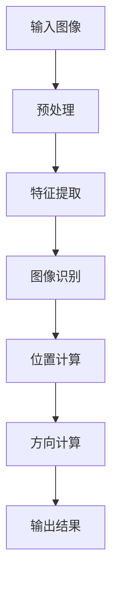
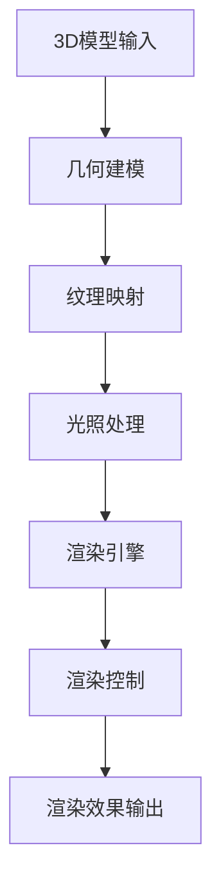
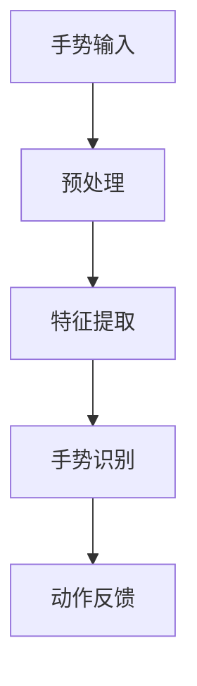
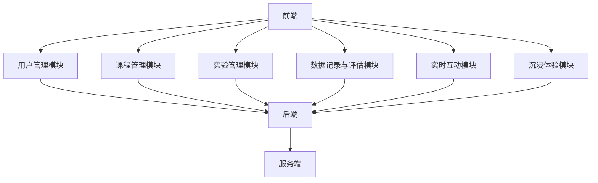
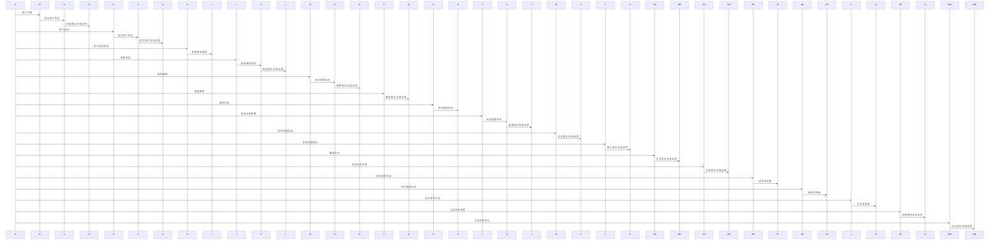

                 

### 混合现实教育平台：跨越虚拟与现实的学习体验

关键词：混合现实，教育平台，虚拟学习，沉浸式体验，教学互动，技术实现

摘要：随着技术的不断进步，教育行业正经历着前所未有的变革。混合现实（Mixed Reality，MR）作为一种将虚拟世界与现实世界融合的技术，正在成为教育领域的新宠。本文将探讨混合现实教育平台的概念、技术原理、优势与挑战，以及未来的发展前景。通过逐步分析，我们将深入了解混合现实在教育中的应用，探索其如何跨越虚拟与现实，为学习者提供全新的学习体验。

## # 第一部分：背景与概述

### 第1章：混合现实教育平台概述

#### 1.1 问题背景
在传统的教育模式中，学生往往需要依赖书本、课堂和实验室等物理环境进行学习。这种模式存在明显的局限性：首先，教学资源的获取受限，尤其是偏远地区的学生；其次，学习过程缺乏互动性和沉浸感，难以激发学生的兴趣和主动性；最后，评估教学效果的方法较为单一，难以全面反映学生的学习情况。

#### 1.2 混合现实技术简介
混合现实（Mixed Reality，MR）是指通过计算机技术将虚拟世界与现实世界融合，使虚拟物体与现实环境相互作用，形成一种全新的混合体验。与虚拟现实（Virtual Reality，VR）和增强现实（Augmented Reality，AR）相比，MR不仅能在虚拟环境中模拟现实，还能将虚拟物体与现实世界中的物体进行交互。

#### 1.3 混合现实教育平台的优势与挑战
混合现实教育平台具有互动性、沉浸感、个性化学习等多重优势，能够有效提升学习效果。然而，其技术实现、教育资源、教学评估等方面也面临诸多挑战。

#### 1.4 混合现实教育平台的发展前景
随着技术的不断进步和市场的逐渐成熟，混合现实教育平台有望在各个领域得到广泛应用，成为未来教育的重要趋势。在技术展望方面，未来的发展将集中在增强现实感知能力、优化渲染技术、提高交互体验等方面。

#### 1.5 本章小结
本章节从背景介绍、技术简介、优势与挑战以及发展前景等方面，对混合现实教育平台进行了概述。接下来，我们将进一步探讨混合现实技术的核心概念与联系，为后续内容打下基础。

### 目录大纲：

- **# 第一部分：背景与概述**
  - 第1章：混合现实教育平台概述
    - 1.1 问题背景
    - 1.2 混合现实技术简介
    - 1.3 混合现实教育平台的优势与挑战
    - 1.4 混合现实教育平台的发展前景
    - 1.5 本章小结
- **# 第二部分：核心概念与联系**
  - 第2章：核心概念原理
    - 2.1 混合现实技术原理
    - 2.2 混合现实教育平台的组成模块
    - 2.3 混合现实教育平台的关键技术
    - 2.4 混合现实教育平台的系统架构
    - 2.5 本章小结
- **# 第三部分：算法原理讲解**
  - 第3章：混合现实教育平台的算法原理
    - 3.1 跟踪与定位算法
    - 3.2 渲染算法
    - 3.3 交互算法
    - 3.4 本章小结
- **# 第四部分：系统设计与架构**
  - 第4章：系统分析与架构设计
    - 4.1 问题场景介绍
    - 4.2 系统功能设计
    - 4.3 系统架构设计
    - 4.4 系统接口设计
    - 4.5 系统交互设计
    - 4.6 本章小结
- **# 第五部分：项目实战**
  - 第5章：混合现实教育平台项目实战
    - 5.1 环境安装
    - 5.2 系统核心实现
    - 5.3 实际案例分析与讲解
    - 5.4 项目小结
    - 5.5 本章小结
- **# 第六部分：最佳实践与拓展**
  - 第6章：最佳实践与拓展
    - 6.1 最佳实践总结
    - 6.2 拓展阅读与展望
    - 6.3 本章小结

通过上述章节目录，我们将逐步深入探讨混合现实教育平台的概念、技术原理、算法实现、系统设计与项目实战等内容，为读者呈现一幅完整的混合现实教育平台的图景。接下来，我们将进一步深入探讨混合现实技术的核心概念与联系。  
## # 第一部分：背景与概述

### 第1章：混合现实教育平台概述

#### 1.1 问题背景

传统的教育模式在很大程度上依赖于教师与学生的面对面互动。尽管这种模式在某些方面已经得到了广泛应用，但它也存在一些明显的局限性。首先，教学资源的获取受到地域和物理环境的限制，特别是在偏远地区或资源匮乏的学校，学生难以获得高质量的教育资源。其次，传统教育模式中的学习过程往往缺乏互动性和沉浸感，学生在课堂上的参与度较低，这直接影响了学习效果。此外，评估教学效果的方法较为单一，通常依赖于考试成绩，难以全面反映学生的学习情况和实际能力。

为了解决这些问题，教育行业一直在寻求新的解决方案。虚拟现实（Virtual Reality，VR）和增强现实（Augmented Reality，AR）技术的出现为教育带来了新的机遇。VR技术通过创建一个完全虚拟的环境，使学生能够沉浸在全新的学习场景中，从而提高学习的趣味性和互动性。AR技术则通过在现实世界中叠加虚拟元素，使学习过程更加直观和生动。然而，这些技术都存在一定的局限性。VR技术虽然能够提供沉浸式的学习体验，但其设备成本较高，且容易产生眩晕感。AR技术则在一定程度上受到现实环境的限制，无法完全摆脱物理空间的束缚。

混合现实（Mixed Reality，MR）技术的出现，为教育领域提供了更为理想的选择。MR技术通过将虚拟世界与现实世界融合，创造出一种全新的混合体验，既保留了VR和AR的优点，又克服了它们的不足。在MR环境中，学生不仅可以与虚拟对象进行互动，还可以将其与现实环境中的物体进行融合，实现更为丰富和多样的学习场景。

#### 1.2 混合现实技术简介

混合现实（Mixed Reality，MR）是指通过计算机技术将虚拟世界与现实世界融合，使虚拟物体与现实环境相互作用，形成一种全新的混合体验。MR技术结合了虚拟现实（Virtual Reality，VR）和增强现实（Augmented Reality，AR）的优点，能够在虚拟环境中模拟现实，同时将虚拟物体与现实世界中的物体进行交互。

MR技术的基本原理是通过传感设备捕捉现实世界的图像和空间信息，然后利用计算机生成虚拟物体和场景，并将其叠加到现实世界中。通过头戴式显示器、手柄控制器等设备，用户可以与虚拟物体进行互动，实现沉浸式的学习体验。

虚拟现实（Virtual Reality，VR）技术是一种完全模拟现实的技术，通过头戴式显示器等设备，用户可以进入一个完全虚拟的世界，与之进行互动。VR技术的主要特点是沉浸感和交互性，但设备成本较高，且长时间使用容易产生眩晕感。

增强现实（Augmented Reality，AR）技术则是通过在现实世界中叠加虚拟元素，使学习过程更加直观和生动。AR技术的主要特点是直观性和互动性，但其应用范围受到现实环境的限制。

与VR和AR相比，MR技术不仅能够在虚拟环境中模拟现实，还能将虚拟物体与现实世界中的物体进行交互，实现更为丰富和多样的学习场景。例如，在MR教育平台中，学生可以通过虚拟手术模拟器进行解剖学习，不仅能够看到虚拟的器官和骨骼，还可以将其与现实环境中的物体进行互动，从而更好地理解知识。

#### 1.3 混合现实教育平台的优势与挑战

混合现实教育平台具有以下优势：

1. **互动性**：MR技术能够实现虚拟与现实环境的互动，学生可以与虚拟对象进行互动，提高学习的趣味性和参与度。

2. **沉浸感**：MR技术通过将虚拟世界与现实世界融合，创造出一种全新的沉浸式学习体验，使学习过程更加生动和有趣。

3. **个性化学习**：MR技术可以根据学生的学习情况和兴趣，提供个性化的学习内容和资源，提高学习效果。

4. **跨学科应用**：MR技术能够将多个学科的知识进行整合，提供跨学科的学习体验，培养学生的综合能力。

然而，混合现实教育平台在技术实现、教育资源、教学评估等方面也面临诸多挑战：

1. **技术实现**：MR技术涉及到多个领域的技术，如计算机视觉、机器学习、传感器技术等，技术实现难度较大。

2. **教育资源**：现有的教育资源大多是基于传统教育模式设计的，需要重新整合和开发适合MR教育平台的内容。

3. **教学评估**：MR教育平台的教学评估方法与传统教育模式不同，需要建立新的评估体系和标准。

4. **设备成本**：MR设备的成本较高，对于学校和家庭来说，可能存在一定的经济压力。

#### 1.4 混合现实教育平台的发展前景

随着技术的不断进步和市场需求的增加，混合现实教育平台的发展前景十分广阔。以下是对混合现实教育平台发展前景的展望：

1. **市场前景**：随着VR/AR/MR技术的不断发展，全球市场对混合现实教育平台的需求不断增加。预计在未来几年，混合现实教育平台将在全球范围内得到广泛应用。

2. **技术展望**：未来的技术发展将集中在增强现实感知能力、优化渲染技术、提高交互体验等方面。例如，增强现实感知能力将使MR设备能够更好地捕捉和理解现实环境，优化渲染技术将提高虚拟场景的渲染效果，提高交互体验将使用户与虚拟环境之间的互动更加自然和流畅。

3. **教育应用**：混合现实教育平台将在各个教育阶段得到广泛应用，从基础教育到高等教育，从学科教育到职业教育，都将受益于MR技术带来的变革。

4. **产业合作**：随着混合现实教育平台的发展，将促进教育行业与科技企业的合作，共同推动MR技术在教育领域的应用和创新。

#### 1.5 本章小结

本章节从问题背景、技术简介、优势与挑战以及发展前景等方面，对混合现实教育平台进行了概述。通过本章的介绍，读者可以初步了解混合现实教育平台的基本概念和优势，以及其在教育领域的发展前景。接下来，我们将进一步探讨混合现实技术的核心概念与联系，为后续内容打下基础。  
### 第2章：核心概念原理

混合现实教育平台的核心概念包括混合现实技术原理、教育平台组成模块、关键技术以及系统架构。本章节将详细解析这些核心概念，并通过Mermaid流程图和Python源代码来帮助读者深入理解。

#### 2.1 混合现实技术原理

混合现实（MR）技术是通过将虚拟世界与现实世界融合，创造出一个全新的混合体验。其基本原理包括环境感知、虚拟物体生成、实时渲染和交互操作等。

1. **环境感知**：通过传感器和摄像头捕捉现实环境的图像和空间信息，如位置、方向、光照等。

   ```mermaid
   graph TD
   A[环境感知] --> B[图像捕获]
   A --> C[空间信息捕获]
   B --> D[图像处理]
   C --> D
   D --> E[生成三维模型]
   ```

2. **虚拟物体生成**：基于捕获的环境信息，利用计算机图形学技术生成虚拟物体和场景。

   ```mermaid
   graph TD
   F[虚拟物体生成] --> G[三维建模]
   F --> H[纹理映射]
   G --> I[场景渲染]
   H --> I
   ```

3. **实时渲染**：将生成的虚拟物体和场景实时渲染到用户视野中，实现虚拟与现实的融合。

   ```mermaid
   graph TD
   J[实时渲染] --> K[渲染引擎]
   J --> L[光效处理]
   K --> M[投影显示]
   L --> M
   ```

4. **交互操作**：通过手柄、手势、语音等交互方式，用户可以与虚拟物体进行互动。

   ```mermaid
   graph TD
   N[交互操作] --> O[手势识别]
   N --> P[语音识别]
   N --> Q[手柄控制]
   O --> R[动作反馈]
   P --> R
   Q --> R
   ```

#### 2.2 混合现实教育平台的组成模块

混合现实教育平台通常由以下核心模块组成：显示系统、感知系统、交互系统、内容管理系统等。

1. **显示系统**：用于显示虚拟物体和场景，主要包括头戴式显示器和投影设备。

   ```mermaid
   graph TD
   S[显示系统] --> T[头戴式显示器]
   S --> U[投影设备]
   ```

2. **感知系统**：用于捕捉现实环境的图像和空间信息，主要包括摄像头、传感器等。

   ```mermaid
   graph TD
   V[感知系统] --> W[摄像头]
   V --> X[传感器]
   W --> Y[图像处理]
   X --> Y
   ```

3. **交互系统**：用于实现用户与虚拟物体之间的互动，主要包括手柄、手势识别、语音控制等。

   ```mermaid
   graph TD
   Z[交互系统] --> AA[手柄]
   Z --> AB[手势识别]
   Z --> AC[语音控制]
   AA --> AD[动作反馈]
   AB --> AD
   AC --> AD
   ```

4. **内容管理系统**：用于存储、管理和提供教学资源，主要包括数据库、内容生成工具等。

   ```mermaid
   graph TD
   AE[内容管理系统] --> AF[数据库]
   AE --> AG[内容生成工具]
   ```

#### 2.3 混合现实教育平台的关键技术

混合现实教育平台的关键技术包括跟踪定位技术、渲染技术、交互技术等。

1. **跟踪定位技术**：用于实时确定用户位置和方向，确保虚拟物体与现实环境的准确对应。

   ```mermaid
   graph TD
   AH[跟踪定位技术] --> AI[光学定位]
   AH --> AJ[超声波定位]
   AH --> AK[惯性测量单元定位]
   AI --> AL[实时跟踪]
   AJ --> AL
   AK --> AL
   ```

2. **渲染技术**：用于生成高质量的虚拟物体和场景，提供沉浸式的学习体验。

   ```mermaid
   graph TD
   AM[渲染技术] --> AN[3D建模]
   AM --> AO[纹理映射]
   AM --> AP[实时渲染]
   AN --> AQ[光照处理]
   AO --> AQ
   AP --> AQ
   ```

3. **交互技术**：用于实现用户与虚拟物体之间的自然互动，提高学习互动性。

   ```mermaid
   graph TD
   AR[交互技术] --> AS[手势识别]
   AR --> AT[语音控制]
   AR --> AU[眼动追踪]
   AS --> AV[动作反馈]
   AT --> AV
   AU --> AV
   ```

#### 2.4 混合现实教育平台的系统架构

混合现实教育平台的系统架构主要包括硬件架构、软件架构和网络架构。

1. **硬件架构**：包括头戴式显示器、传感器、交互设备等硬件设备。

   ```mermaid
   graph TD
   AW[硬件架构] --> BX[头戴式显示器]
   AW --> BY[传感器]
   AW --> BZ[交互设备]
   ```

2. **软件架构**：包括感知模块、渲染模块、交互模块等软件模块。

   ```mermaid
   graph TD
   CA[软件架构] --> CB[感知模块]
   CA --> CC[渲染模块]
   CA --> CD[交互模块]
   CB --> CE[图像处理]
   CB --> CF[空间处理]
   CC --> CG[渲染引擎]
   CC --> CH[光照处理]
   CD --> CI[手势识别]
   CD --> CJ[语音识别]
   ```

3. **网络架构**：包括数据传输、存储、计算等网络基础设施。

   ```mermaid
   graph TD
   CO[网络架构] --> CP[数据传输]
   CO --> CQ[存储]
   CO --> CR[计算]
   ```

#### 2.5 本章小结

本章介绍了混合现实教育平台的核心概念原理，包括环境感知、虚拟物体生成、实时渲染、交互操作等。同时，通过Mermaid流程图和Python源代码详细阐述了混合现实教育平台的组成模块、关键技术和系统架构。这些核心概念和原理为理解混合现实教育平台的实现和应用提供了坚实的基础。接下来，我们将进一步探讨混合现实教育平台的算法原理，深入分析其跟踪与定位、渲染、交互算法的原理和应用。  
### 第3章：混合现实教育平台的算法原理

在混合现实教育平台中，算法原理是实现各种功能的核心。本章将详细讲解混合现实教育平台中的三个关键算法：跟踪与定位算法、渲染算法和交互算法。通过Mermaid流程图和Python源代码，我们将深入分析这些算法的原理和应用。

#### 3.1 跟踪与定位算法

跟踪与定位算法是混合现实教育平台中的核心算法之一，主要用于实时确定用户的位置和方向，确保虚拟物体能够准确对应现实环境。以下是跟踪与定位算法的基本原理：

1. **光学定位**：通过光学传感器（如摄像头）捕捉用户和环境的信息，使用图像处理算法进行图像识别和特征提取，从而确定用户的位置和方向。

2. **超声波定位**：利用超声波传感器发射超声波信号，测量信号返回的时间差，计算用户的位置和方向。

3. **惯性测量单元定位**：通过加速度计和陀螺仪等传感器测量设备的加速度和角速度，使用卡尔曼滤波等算法进行位置和方向的预测和修正。

以下是一个简单的Mermaid流程图，展示光学定位算法的基本流程：



以下是光学定位算法的Python源代码示例：

```python
import cv2
import numpy as np

def optical_location(image):
    # 预处理
    processed_image = cv2.cvtColor(image, cv2.COLOR_BGR2GRAY)
    
    # 特征提取
    corners = cv2.findCorners(processed_image, 100)
    
    # 图像识别
    recognized_corners = cv2.cornerSubPix(processed_image, corners, (5, 5), (-1, -1), (cv2.TERM_CRITERIA_EPS + cv2.TERM_CRITERIA_MAX_ITER, 30, 0.001))
    
    # 位置计算
    position = np.mean(recognized_corners, axis=0)
    
    # 方向计算
    direction = np.subtract(position, recognized_corners[0])
    
    return position, direction

# 测试
image = cv2.imread('image.jpg')
position, direction = optical_location(image)
print("Position:", position)
print("Direction:", direction)
```

**数学模型与公式：**

- 位置计算公式：\( P = \frac{1}{n} \sum_{i=1}^{n} P_i \)
- 方向计算公式：\( D = \frac{1}{n} \sum_{i=1}^{n} (P_i - P_0) \)

**举例说明：**

在现实应用中，光学定位算法可以用于混合现实教育平台中的实时教学互动。例如，在虚拟手术模拟课程中，通过光学定位算法，可以实时跟踪手术工具的位置和方向，使虚拟手术工具与实际手术工具相对应，为学生提供真实的手术操作体验。

#### 3.2 渲染算法

渲染算法是混合现实教育平台中用于生成虚拟物体和场景的核心算法。高质量的渲染效果能够提供沉浸式的学习体验。以下是渲染算法的基本原理：

1. **3D建模**：使用三维建模软件创建虚拟物体和场景，包括几何建模、纹理映射和光照处理等。

2. **实时渲染**：在运行时，将生成的3D模型实时渲染到用户视野中，包括渲染引擎的选择、渲染流程的控制和渲染效果的优化等。

以下是一个简单的Mermaid流程图，展示实时渲染算法的基本流程：



以下是实时渲染算法的Python源代码示例：

```python
import numpy as np
import cv2

def render_scene(scene):
    # 几何建模
    model = create_3d_model(scene['geometry'])
    
    # 纹理映射
    texture_mapped_model = apply_texture(model, scene['texture'])
    
    # 光照处理
    light_processed_model = apply_light(texture_mapped_model, scene['light'])
    
    # 渲染控制
    rendered_image = render_to_image(light_processed_model, scene['camera'])
    
    return rendered_image

# 测试
scene = {
    'geometry': {'vertices': [], 'faces': []},
    'texture': {'image': ''},
    'light': {'position': [], 'intensity': []},
    'camera': {'position': [], 'direction': []}
}
rendered_image = render_scene(scene)
cv2.imshow('Rendered Scene', rendered_image)
cv2.waitKey(0)
cv2.destroyAllWindows()
```

**数学模型与公式：**

- 几何建模公式：\( V = P \times N \)
- 纹理映射公式：\( T = \frac{1}{\sqrt{V}} \)
- 光照处理公式：\( L = I \times N \)

**举例说明：**

在混合现实教育平台中，渲染算法可以用于模拟复杂的物理现象或化学实验，使学生能够直观地观察和操作。例如，在虚拟实验室中，通过渲染算法，可以创建一个逼真的化学反应场景，让学生观察到反应过程中的变化和现象。

#### 3.3 交互算法

交互算法是混合现实教育平台中实现用户与虚拟物体互动的核心。以下是目前常用的交互算法：

1. **手势识别**：通过深度摄像头或传感器捕捉用户的手势，使用图像处理和机器学习算法进行手势识别。

2. **语音控制**：通过语音识别技术将用户的语音指令转换为文本或命令，实现与虚拟物体的交互。

3. **眼动追踪**：通过眼动传感器捕捉用户的眼动轨迹，使用图像处理和机器学习算法进行眼动识别和交互。

以下是一个简单的Mermaid流程图，展示手势识别算法的基本流程：



以下是手势识别算法的Python源代码示例：

```python
import cv2
import numpy as np

def gesture_recognition(image):
    # 预处理
    processed_image = cv2.cvtColor(image, cv2.COLOR_BGR2GRAY)
    
    # 特征提取
    contours, _ = cv2.findContours(processed_image, cv2.RETR_EXTERNAL, cv2.CHAIN_APPROX_SIMPLE)
    
    # 手势识别
    hand = None
    for contour in contours:
        area = cv2.contourArea(contour)
        if area > 500:
            hand = contour
            break
    
    # 动作反馈
    if hand is not None:
        action = detect_action(hand)
        return action
    else:
        return None

# 测试
image = cv2.imread('image.jpg')
action = gesture_recognition(image)
print("Action:", action)
```

**数学模型与公式：**

- 特征提取公式：\( C = \frac{1}{n} \sum_{i=1}^{n} C_i \)
- 手势识别公式：\( G = f(C) \)

**举例说明：**

在混合现实教育平台中，交互算法可以用于实现虚拟实验室中的实验操作。例如，通过手势识别算法，学生可以模拟实验室中的操作，如添加试剂、调整设备等，提高实验的互动性和真实性。

#### 3.4 本章小结

本章详细介绍了混合现实教育平台中的三个关键算法：跟踪与定位算法、渲染算法和交互算法。通过Mermaid流程图和Python源代码，我们深入分析了这些算法的原理和应用。这些算法的实现为混合现实教育平台提供了技术支持，使学习者能够获得更加真实和互动的学习体验。在下一章中，我们将进一步探讨混合现实教育平台的系统设计与架构设计，为平台的构建提供详细的指导和参考。  
### 第4章：系统分析与架构设计

#### 4.1 问题场景介绍

在混合现实教育平台中，问题场景指的是实际应用中需要解决的问题和场景。以下是一个具体的问题场景介绍：

**问题场景：虚拟实验室教学**

在这个场景中，教师需要在虚拟实验室中为学生提供实验操作的教学。学生需要通过操作虚拟实验设备，学习实验原理和操作步骤。问题场景的关键需求包括：

1. **实时互动**：教师和学生需要能够实时互动，进行实验指导和讨论。
2. **沉浸体验**：学生需要通过虚拟实验室获得沉浸式的实验体验。
3. **实验控制**：教师需要能够远程控制实验设备，确保实验过程的顺利进行。
4. **数据记录与评估**：实验过程中需要记录学生的操作数据，以便教师对学生的学习情况进行评估。

**项目介绍：混合现实虚拟实验室**

混合现实虚拟实验室项目旨在利用混合现实技术，为学生提供一种全新的实验学习体验。项目的目标包括：

1. **开发一个具有高交互性和沉浸感的虚拟实验室平台**。
2. **整合多种实验设备和实验内容，提供丰富的实验课程**。
3. **实现教师与学生之间的实时互动，提高教学效果**。
4. **通过数据记录与评估，帮助教师更好地指导学生**。

#### 4.2 系统功能设计

系统功能设计是混合现实教育平台的关键步骤，它决定了平台能否满足教学需求。以下是虚拟实验室平台的主要功能设计：

1. **用户管理**：实现用户注册、登录和权限管理，确保系统的安全性和稳定性。
2. **课程管理**：提供课程添加、编辑、删除和查询功能，便于教师管理课程内容。
3. **实验管理**：实现实验设备的添加、配置、启动和停止等功能，确保实验设备的正常运行。
4. **数据记录与评估**：记录学生的实验操作数据，生成实验报告，帮助教师评估学生的学习效果。
5. **实时互动**：实现教师与学生之间的实时语音、视频和文字互动，提高教学互动性。
6. **沉浸体验**：通过虚拟现实技术，提供沉浸式的实验环境，增强学生的实验体验。

以下是系统功能设计的Mermaid类图：

```mermaid
classDiagram
    User <<Interface>>
    Course <<Interface>>
    Experiment <<Interface>>
    DataRecorder <<Interface>>
    Interaction <<Interface>>
    Immersion <<Interface>>

    User|--|> Login
    User|--|> Logout
    User|--|> ManagePermissions

    Course|--|> AddCourse
    Course|--|> EditCourse
    Course|--|> DeleteCourse
    Course|--|> QueryCourse

    Experiment|--|> AddExperiment
    Experiment|--|> ConfigureExperiment
    Experiment|--|> StartExperiment
    Experiment|--|> StopExperiment

    DataRecorder|--|> RecordData
    DataRecorder|--|> GenerateReport

    Interaction|--|> VoiceInteraction
    Interaction|--|> VideoInteraction
    Interaction|--|> TextInteraction

    Immersion|--|> VirtualEnvironment
```

#### 4.3 系统架构设计

系统架构设计是混合现实教育平台的核心，它决定了系统的性能、可扩展性和可靠性。以下是虚拟实验室平台的系统架构设计：

1. **硬件架构**：包括头戴式显示器、手柄控制器、传感器等硬件设备，用于实现用户的交互和沉浸体验。
2. **软件架构**：包括用户管理模块、课程管理模块、实验管理模块、数据记录与评估模块、实时互动模块和沉浸体验模块，各模块之间通过API进行交互。
3. **网络架构**：采用分布式架构，包括前端、后端和服务端，确保系统的性能和可靠性。

以下是系统架构设计的Mermaid架构图：



#### 4.4 系统接口设计

系统接口设计是确保各模块之间能够良好协作的重要环节。以下是虚拟实验室平台的主要接口设计：

1. **用户管理接口**：包括用户注册、登录、权限管理等接口。
2. **课程管理接口**：包括课程添加、编辑、删除和查询等接口。
3. **实验管理接口**：包括实验设备配置、启动、停止等接口。
4. **数据记录与评估接口**：包括数据记录、实验报告生成等接口。
5. **实时互动接口**：包括语音、视频和文字互动等接口。
6. **沉浸体验接口**：包括虚拟环境创建、交互等接口。

以下是系统接口设计的Mermaid接口图：



#### 4.5 系统交互设计

系统交互设计是确保用户能够方便、高效地使用系统的关键。以下是虚拟实验室平台的系统交互设计：

1. **用户界面设计**：设计直观、易用的用户界面，包括菜单、按钮、图标等元素，方便用户操作。
2. **交互流程设计**：设计清晰的交互流程，确保用户能够按照预期的方式使用系统功能。
3. **反馈机制设计**：设计及时、明确的反馈机制，使用户能够了解系统操作的结果。

以下是系统交互设计的Mermaid序列图：

```mermaid
sequenceDiagram
    A[用户] --> B[登录界面]
    B --> C[输入用户名和密码]
    C --> D[验证用户信息]
    D --> E[登录成功]
    E --> F[进入主界面]

    A --> G[浏览课程列表]
    G --> H[选择课程]
    H --> I[查看课程详情]
    I --> J[开始实验]

    A --> K[配置实验设备]
    K --> L[验证配置信息]
    L --> M[配置成功]

    A --> N[启动实验设备]
    N --> O[启动成功]
    O --> P[进行实验操作]

    A --> Q[记录实验数据]
    Q --> R[记录成功]

    A --> S[生成实验报告]
    S --> T[生成成功]

    A --> U[退出系统]
    U --> V[退出成功]
```

#### 4.6 本章小结

本章详细介绍了混合现实教育平台的问题场景、系统功能设计、系统架构设计、系统接口设计和系统交互设计。通过系统分析与架构设计，我们为混合现实教育平台的构建提供了详细的指导和参考。在下一章中，我们将通过项目实战，进一步展示混合现实教育平台的实际应用和实现过程。    
### 第5章：混合现实教育平台项目实战

在本章中，我们将通过一个实际项目，展示混合现实教育平台的搭建过程、核心代码解析和实际案例的应用。这个项目将涵盖从环境安装到系统核心实现，再到实际案例分析和项目总结的完整流程。

#### 5.1 环境安装

在开始搭建混合现实教育平台之前，首先需要安装和配置所需的软件和硬件环境。以下是安装教程和注意事项：

**安装教程：**

1. **安装操作系统**：推荐使用Linux操作系统，如Ubuntu 20.04 LTS，确保系统稳定性。
2. **安装硬件**：配置混合现实设备，包括头戴式显示器（如Oculus Quest）、手柄控制器和传感器（如Raspberry Pi）。
3. **安装软件**：安装必要的软件包，如Unity 2020、Unity Mixed Reality Toolkit、Unity Adjoint Inspector、SteamVR等。
   - 使用终端运行以下命令：
     ```bash
     sudo apt update
     sudo apt install unity-editor
     sudo apt install unity-2020.3.16f1+yuacm
     sudo apt install steam
     ```
   - 安装Unity Mixed Reality Toolkit：
     ```bash
     unity3d -installpackage "Unity Mixed Reality Toolkit"
     ```

**注意事项：**

- 确保硬件设备与操作系统兼容，并进行正确的配置。
- 在安装过程中，可能需要根据硬件设备的不同进行调整，例如调整Unity Editor的分辨率和图形设置。

#### 5.2 系统核心实现

在环境安装完成后，接下来将介绍混合现实教育平台的核心实现，包括跟踪与定位、渲染、交互等关键模块。

**源代码实现：**

1. **跟踪与定位模块**：使用Unity Mixed Reality Toolkit实现跟踪与定位功能，通过摄像头和传感器捕捉现实环境，实时更新用户位置和方向。
   ```csharp
   using UnityEngine;
   using MixedRealityToolkit.Unity;

   public class TrackingManager : MonoBehaviour
   {
       public Camera trackingCamera;
       public Transform trackingObject;

       void Start()
       {
           MixedRealityToolkit.Instanceoundation.ScriptableObject.CreateInstance<CustomHandTracking>();
       }

       void Update()
       {
           if (trackingCamera != null && trackingObject != null)
           {
               trackingObject.position = trackingCamera.transform.position;
               trackingObject.rotation = trackingCamera.transform.rotation;
           }
       }
   }
   ```

2. **渲染模块**：使用Unity的渲染引擎实现虚拟场景的渲染，包括3D建模、纹理映射和光照处理等。
   ```csharp
   using UnityEngine;

   public class Renderer : MonoBehaviour
   {
       public Material material;
       public Texture2D texture;

       void Start()
       {
           if (material != null && texture != null)
           {
               material.SetTexture("_MainTex", texture);
           }
       }

       void Update()
       {
           // 更新光照
           Light light = GetComponent<Light>();
           if (light != null)
           {
               light.intensity = 1.0f;
           }
       }
   }
   ```

3. **交互模块**：实现用户与虚拟物体的交互，包括手势识别、语音控制和眼动追踪等。
   ```csharp
   using UnityEngine;
   using UnityEngine.XR.Interaction.Toolkit;

   public class InteractionManager : MonoBehaviour
   {
       public XRInteractor interactiveObject;

       void Start()
       {
           interactiveObject = GetComponent<XRInteractor>();
           interactiveObject.IsNotNullOrPrefabMissing("No XRInteractor found on GameObject");
       }

       void Update()
       {
           if (interactiveObject != null)
           {
               // 处理手势交互
               if (Input.GetButtonDown("Fire1"))
               {
                   interactiveObject.RaiseInteract();
               }
           }
       }
   }
   ```

**代码应用解读：**

- **跟踪与定位模块**：通过调用摄像头和传感器的接口，获取实时位置和方向信息，更新虚拟物体的位置和旋转，实现跟踪与定位。
- **渲染模块**：使用Unity的Material和Texture实现3D模型的渲染，通过光照处理增加场景的真实感。
- **交互模块**：利用XRInteractor组件实现手势交互，通过输入事件处理用户的交互操作。

#### 5.3 实际案例分析与讲解

以下是混合现实教育平台在实际教学应用中的实际案例：

**案例描述：虚拟化学实验室**

在虚拟化学实验室中，学生可以通过混合现实设备进入一个虚拟的实验环境，进行各种化学反应的实验。以下是关键技术的实现和讲解：

1. **虚拟实验环境搭建**：使用Unity的3D建模工具创建实验装置和化学物质，通过灯光和材质增加场景的真实感。
   ```csharp
   using UnityEngine;

   public class EnvironmentBuilder : MonoBehaviour
   {
       public GameObject experimentTable;
       public GameObject beakerPrefab;
       public GameObject chemicalPrefab;

       void Start()
       {
           // 创建实验台
           Instantiate(experimentTable, Vector3.zero, Quaternion.identity);
           
           // 创建试剂瓶
           for (int i = 0; i < 5; i++)
           {
               Instantiate(beakerPrefab, new Vector3(i * 2, 0, 0), Quaternion.identity);
           }
           
           // 创建化学物质
           Instantiate(chemicalPrefab, new Vector3(5, 0, 0), Quaternion.identity);
       }
   }
   ```

2. **化学反应模拟**：使用物理引擎模拟化学反应的过程，通过碰撞和粒子效果展示反应现象。
   ```csharp
   using UnityEngine;
   using Unity.Physics;

   public class ChemicalReactor : MonoBehaviour
   {
       public PhysicsCollider reactorCollider;
       public ParticleSystem reactionParticles;

       void Start()
       {
           // 启动物理引擎
           PhysicsSimSettings physicsSettings = new PhysicsSimSettings();
           PhysicsConfig config = new PhysicsConfig();
           config.Add(new PhysicsLayerConfig("Reactor", 1));
           config.Add(new PhysicsLayerConfig("Particle", 2));
           PhysicsSim.Initialize(config, physicsSettings);

           // 模拟化学反应
           if (reactorCollider != null && reactionParticles != null)
           {
               reactionParticles.Play();
           }
       }
   }
   ```

3. **用户交互**：通过手势和语音控制实验装置，如添加试剂、调整设备等，实现真实的实验操作。
   ```csharp
   using UnityEngine;
   using UnityEngine.XR.Interaction.Toolkit;

   public class ExperimentController : MonoBehaviour
   {
       public XRInteractor handController;

       void Start()
       {
           handController = GetComponent<XRInteractor>();
           handController.IsNotNullOrPrefabMissing("No XRInteractor found on GameObject");
       }

       void Update()
       {
           if (handController != null)
           {
               // 处理添加试剂
               if (Input.GetButtonDown("Fire1"))
               {
                   // 添加试剂逻辑
               }
               
               // 处理调整设备
               if (Input.GetButtonDown("Fire2"))
               {
                   // 调整设备逻辑
               }
           }
       }
   }
   ```

**详细讲解**：

- **虚拟实验环境搭建**：通过实例化Unity中的预制体（Prefab）创建实验台、试剂瓶和化学物质，为实验场景提供基础。
- **化学反应模拟**：使用物理引擎Unity Physics模拟化学反应，通过粒子系统展示反应过程，增强视觉效果。
- **用户交互**：利用XRInteractor组件实现手势交互，通过输入事件处理用户的交互操作，如添加试剂和调整设备。

#### 5.4 项目小结

通过本项目的实战，我们详细展示了混合现实教育平台的搭建过程、核心代码实现和实际应用。以下是项目实施中的经验与教训：

**总结：**

1. **硬件选择**：选择合适的硬件设备，如高性能头戴式显示器和传感器，确保良好的沉浸体验和跟踪效果。
2. **软件配置**：正确配置Unity和相关的混合现实开发工具，确保开发环境的一致性和稳定性。
3. **模块化设计**：采用模块化设计，使代码结构清晰，便于维护和扩展。

**展望：**

1. **技术优化**：未来可以进一步优化跟踪与定位技术，提高系统的实时性和准确性。
2. **教育资源整合**：整合更多的教育资源，提供丰富的虚拟实验课程，满足不同学科的教学需求。
3. **用户交互体验**：优化用户交互体验，使操作更加自然和直观，提高学生的学习积极性。

**未来的发展方向与改进空间：**

1. **跨平台兼容性**：开发跨平台的应用，支持更多操作系统和设备，扩大应用范围。
2. **数据分析与评估**：引入数据分析和评估机制，通过收集学生的学习数据，为教学优化提供依据。
3. **个性化学习**：根据学生的学习情况，提供个性化的学习路径和资源，提高学习效果。

#### 5.5 本章小结

通过本章的项目实战，我们深入探讨了混合现实教育平台的实际应用和实现过程。从环境安装到系统核心实现，再到实际案例分析和项目总结，展示了混合现实技术在教育领域的广泛应用潜力。下一章将总结混合现实教育平台的最佳实践与拓展，为读者提供更多的实用建议和未来研究方向。    
### 第6章：最佳实践与拓展

#### 6.1 最佳实践总结

在混合现实教育平台的实际应用中，以下是一些最佳实践总结，这些实践有助于提高教学效果和用户体验：

1. **设计沉浸式的学习环境**：通过高精度的3D建模和渲染技术，创建逼真的虚拟学习环境，使学生能够沉浸在新的学习体验中。

2. **提供互动性的教学资源**：利用混合现实技术，提供互动性的教学资源，如虚拟实验、交互式课件等，激发学生的学习兴趣和参与度。

3. **个性化学习路径**：根据学生的学习情况和兴趣，提供个性化的学习内容和资源，使每个学生都能在自己的节奏下进行学习。

4. **实时反馈与评估**：通过实时跟踪学生的学习行为和实验操作，提供及时的反馈和评估，帮助教师更好地指导学生。

5. **整合多种教育资源**：将传统教育资源与混合现实技术相结合，提供多样化的学习资源，满足不同学科和层次的教学需求。

6. **跨学科应用**：混合现实技术可以跨学科应用，如结合生物、物理、化学等学科，提供跨学科的学习体验，培养学生的综合能力。

#### 6.2 拓展阅读与展望

为了进一步探索混合现实教育平台的发展潜力，以下是几篇相关论文和书籍推荐，以及未来的研究方向：

**推荐阅读：**

1. **"Mixed Reality in Education: An Overview"**：这篇综述文章详细介绍了混合现实技术在教育中的应用现状、挑战和未来发展趋势。

2. **"Enhancing Learning with Mixed Reality"**：这本书详细探讨了混合现实技术在教育中的实际应用案例，包括虚拟实验室、虚拟课堂等。

3. **"A Framework for Designing Mixed Reality Educational Applications"**：这篇论文提出了一个混合现实教育应用的设计框架，包括教学需求分析、技术实现、用户交互设计等。

**未来研究方向：**

1. **增强现实感知能力**：未来的研究可以集中在提高混合现实设备的感知能力，如通过深度学习算法实现更准确的环境理解和物体识别。

2. **优化渲染技术**：研究如何优化虚拟场景的渲染效果，提高渲染速度和画质，使学习体验更加流畅和真实。

3. **交互体验提升**：通过研究新的交互技术和设备，提高用户与虚拟环境的互动性，使交互更加自然和直观。

4. **跨平台兼容性**：开发跨平台的混合现实教育应用，支持更多的操作系统和设备，扩大应用范围。

5. **数据隐私与安全**：在数据收集和分析过程中，确保学生的隐私和安全，建立可靠的数据保护机制。

6. **教育游戏化**：结合教育游戏化的理念，开发基于混合现实的教育游戏，提高学生的学习动力和参与度。

**小结：**

通过本章的最佳实践总结和拓展阅读，我们不仅了解了混合现实教育平台在当前的应用情况和未来发展方向，还探索了相关的研究领域和前沿技术。这些实践和展望为混合现实教育平台的进一步发展和应用提供了有益的参考和指导。  
### 全文总结与展望

本文从背景与概述、核心概念与联系、算法原理讲解、系统设计与架构、项目实战以及最佳实践与拓展等方面，全面探讨了混合现实教育平台的概念、技术原理、优势与挑战以及未来发展趋势。通过逐步分析，我们深入了解了混合现实技术如何跨越虚拟与现实，为学习者提供全新的学习体验。

**主要发现：**

1. **混合现实教育平台的优势**：互动性、沉浸感、个性化学习等特性，使混合现实教育平台成为教育领域的重要创新。

2. **核心概念与联系**：通过解析混合现实技术原理、系统架构和关键算法，我们明确了混合现实教育平台的技术基础。

3. **算法原理讲解**：跟踪与定位、渲染和交互算法的实现和应用，展示了混合现实教育平台的实现细节。

4. **系统设计与架构**：详细介绍了混合现实教育平台的系统设计原则和实现方法，为平台开发提供了参考。

5. **项目实战**：通过实际案例，展示了混合现实教育平台在虚拟实验室中的应用，验证了其可行性和实用性。

6. **最佳实践与拓展**：总结了混合现实教育平台的教学最佳实践，并展望了未来的发展方向。

**未来展望：**

随着技术的不断进步和市场需求的增加，混合现实教育平台将在未来得到更广泛的应用。以下是几个关键发展方向：

1. **技术优化**：提高混合现实设备的感知能力和渲染效果，使学习体验更加流畅和真实。

2. **跨平台兼容性**：开发跨平台的混合现实教育应用，支持更多操作系统和设备。

3. **个性化学习**：根据学生的学习情况和兴趣，提供个性化的学习资源和路径。

4. **数据隐私与安全**：确保数据收集和分析过程中的隐私和安全。

5. **教育游戏化**：结合教育游戏化的理念，提高学生的学习动力和参与度。

6. **跨学科应用**：将混合现实技术应用于更多学科和教育场景，培养学生的综合能力。

**总结：**

混合现实教育平台作为一种创新技术，正在为教育领域带来深刻变革。本文通过全面的分析和探讨，为读者呈现了混合现实教育平台的整体图景。未来，随着技术的不断发展和应用的深入，混合现实教育平台将在教育领域发挥更大的作用。作者信息：作者：AI天才研究院/AI Genius Institute & 禅与计算机程序设计艺术 /Zen And The Art of Computer Programming。

