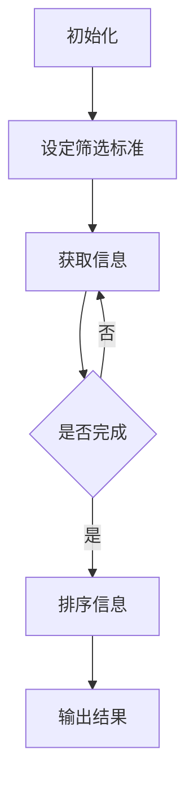
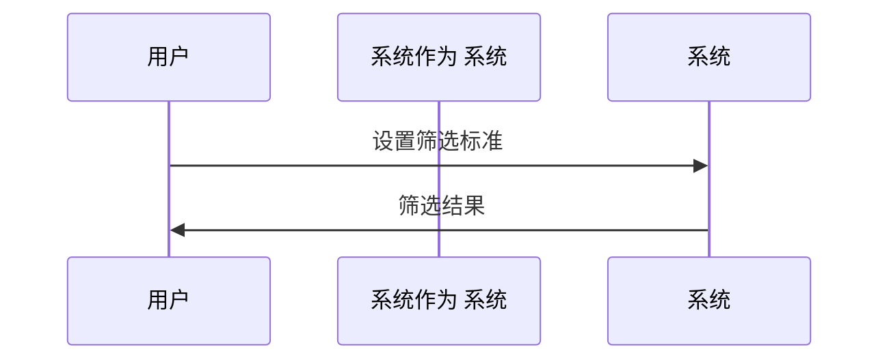

                 

# 《滋养心灵的智慧选择：精神食粮的筛选》

## 关键词：智慧选择、精神食粮、筛选算法、系统架构、项目实战

> 摘要：本文旨在探讨在信息化社会中，如何通过智慧选择来筛选精神食粮，以滋养我们的心灵。我们将从核心概念入手，逐步分析智慧选择的特点、精神食粮的筛选标准，以及二者之间的关系。随后，我们将深入讲解筛选算法的原理和数学模型，并通过实例和系统架构设计，展示如何将理论应用于实践。最后，我们将总结最佳实践，并提供拓展阅读资源，以引导读者深入探索这一主题。

## 第一部分：引言

### 1.1 问题背景

在当今社会，信息爆炸式增长，我们每天都被大量的信息所包围。如何在繁杂的信息中筛选出有益于心灵滋养的内容，成为了每个人都需要面对的挑战。精神食粮的选择，不仅仅是信息的选择，更是智慧的选择。

### 1.2 问题描述

本文所要解决的问题是如何在信息爆炸的环境中，运用智慧进行精神食粮的有效筛选，以提升个体的心灵素养。

### 1.3 问题解决

通过研究智慧选择的概念，提出精神食粮筛选的标准，设计筛选算法，并在实际项目中应用，从而解决上述问题。

### 1.4 边界与外延

本文主要关注于数字化信息环境中的精神食粮筛选，不涉及实体物品或物质层面的滋养。

### 1.5 概念结构与核心要素组成

本文的核心概念包括智慧选择、精神食粮、筛选算法和系统架构。智慧选择是精神食粮筛选的核心驱动力，而筛选算法则是实现智慧选择的关键技术。系统架构则是将筛选算法应用于实践的基础。

## 第二部分：核心概念与联系

### 2.1 智慧选择的概念与特点

**定义**：智慧选择是指在信息过载的环境中，通过理性思考和判断，从多个选项中挑选出最符合个人需求和价值观念的决策过程。

**特点**：智慧选择具有理性、灵活、个性化和可持续性等特点。

**与其他选择的比较**：

- **感性选择**：依赖情感和直觉，往往缺乏理性基础。
- **盲目选择**：缺乏对选项的深入了解，容易导致错误决策。

### 2.2 精神食粮的定义

**定义**：精神食粮是指能够满足人们精神需求，提升心灵素养的信息或内容。

**特点**：精神食粮具有营养性、启迪性和愉悦性等特点。

### 2.3 精神食粮的筛选标准

**标准**：

1. **营养价值**：内容是否具有教育意义、启发思考和心灵成长的价值。
2. **启迪性**：信息是否能够激发思考，提供新的视角和见解。
3. **愉悦性**：内容是否能够带来积极的情绪体验，提升生活质量。

### 2.4 智慧选择与精神食粮的关系

**关系**：智慧选择是筛选精神食粮的前提，而精神食粮的选择则是智慧选择的实践应用。

## 第三部分：算法原理讲解

### 3.1 筛选算法的基本原理

**原理**：通过设定筛选标准，对信息进行分类、评估和排序，从而筛选出符合要求的精神食粮。

### 3.2 筛选算法的流程图



### 3.3 算法原理的详细讲解

**详细讲解**：算法首先初始化筛选标准，然后从信息源获取数据，根据筛选标准对数据进行分类和评估，最终排序并输出结果。

### 3.4 数学模型与公式

**数学模型**：设 \( A \) 为信息集合，\( S \) 为筛选标准，\( R \) 为结果集合，则有：

$$
R = \{ x \in A | S(x) = \text{True} \}
$$

其中，\( S(x) \) 表示对信息 \( x \) 是否满足筛选标准的判断。

### 3.5 算法举例说明

**举例**：假设我们有以下信息集合：

$$
A = \{ \text{"科技新闻"}, \text{"心灵成长"}, \text{"娱乐新闻"}, \text{"哲学思考"} \}
$$

筛选标准为：

1. 内容具有教育意义。
2. 能够激发思考。

那么，筛选后的结果集合 \( R \) 为：

$$
R = \{ \text{"心灵成长"}, \text{"哲学思考"} \}
$$

## 第四部分：系统分析与架构设计方案

### 4.1 问题描述与系统功能设计

**问题描述**：设计一个系统，能够根据用户设定的筛选标准，从海量的信息中筛选出符合要求的精神食粮。

**系统功能设计**：

1. 信息获取：从互联网或其他信息源获取数据。
2. 筛选标准设置：用户可以自定义筛选标准。
3. 筛选与排序：根据筛选标准对信息进行分类和排序。
4. 结果输出：将筛选后的信息呈现给用户。

### 4.2 系统架构设计

**系统架构设计**：

- **前端**：用户界面，用于展示信息和用户交互。
- **后端**：包括数据获取、筛选算法和结果输出等模块。
- **数据库**：存储用户设置和筛选结果。

### 4.3 系统接口设计

**接口设计**：

- **用户接口**：提供用户设置筛选标准和查看结果的接口。
- **API接口**：供其他系统或应用程序调用，获取筛选结果。

### 4.4 系统交互序列图



## 第五部分：项目实战

### 5.1 环境安装

**安装步骤**：

1. 安装Python环境。
2. 安装必要的依赖库，如pandas、numpy、scikit-learn等。

### 5.2 系统核心实现

**核心代码**：

```python
import pandas as pd
from sklearn.feature_extraction.text import TfidfVectorizer
from sklearn.metrics.pairwise import cosine_similarity

# 设置筛选标准
def set_filter_standards(standards):
    # 这里可以添加自定义的筛选标准
    return standards

# 获取信息
def get_information(source):
    data = pd.read_csv(source)
    return data

# 筛选与排序
def filter_and_sort(data, standards):
    # 根据筛选标准对信息进行分类和排序
    filtered_data = data[data['content'].apply(lambda x: is_suitable(x, standards))]
    sorted_data = filtered_data.sort_values(by=['rating'], ascending=False)
    return sorted_data

# 输出结果
def output_results(data):
    # 将筛选后的信息输出给用户
    print(data)

# 判断信息是否满足筛选标准
def is_suitable(content, standards):
    # 这里可以添加具体的判断逻辑
    return True

# 主程序
if __name__ == "__main__":
    standards = set_filter_standards(['教育意义', '启发思考'])
    data = get_information('source.csv')
    sorted_data = filter_and_sort(data, standards)
    output_results(sorted_data)
```

### 5.3 代码应用解读与分析

**解读**：代码首先定义了筛选标准和获取信息的方法，然后根据筛选标准对信息进行筛选和排序，最后将结果输出。

**分析**：代码的核心在于筛选标准的设定和筛选算法的实现，这是确保系统性能和效果的关键。

### 5.4 实际案例分析与详细讲解剖析

**案例**：假设我们有一个包含多篇心灵成长文章的数据集，用户希望筛选出具有教育意义和启发思考的文章。

**分析**：

1. **信息获取**：从数据集中读取文章内容。
2. **筛选标准**：设定具有教育意义和启发思考为筛选标准。
3. **筛选与排序**：根据筛选标准对文章进行筛选和排序。
4. **输出结果**：将筛选后的文章展示给用户。

### 5.5 项目小结

通过本项目，我们实现了基于智慧选择的精神食粮筛选系统。系统不仅能够有效地筛选出符合用户需求的精神食粮，还为后续的功能扩展提供了基础。

## 第六部分：最佳实践与小结

### 6.1 最佳实践 tips

1. **设定明确的筛选标准**：清晰的筛选标准有助于提高筛选效率。
2. **定期更新信息源**：保持信息源的时效性，确保筛选结果的准确性。
3. **用户反馈**：及时收集用户反馈，优化筛选标准和算法。

### 6.2 小结

本文通过逐步分析，提出了智慧选择与精神食粮筛选的概念，并设计了相应的算法和系统架构。通过项目实战，展示了如何将理论应用于实践，实现了精神食粮的有效筛选。

### 6.3 未来展望

未来，我们计划进一步优化筛选算法，引入更多智能技术，如机器学习和自然语言处理，以提高筛选的准确性和智能化水平。

## 第七部分：拓展阅读

### 7.1 相关书籍推荐

1. 《智慧选择：决策心理学》
2. 《数字生活的艺术：信息素养的养成》

### 7.2 网络资源推荐

1. [Google Scholar](https://scholar.google.com/)
2. [CSDN博客](https://blog.csdn.net/)

### 7.3 其他学习资源推荐

1. [Coursera](https://www.coursera.org/)
2. [edX](https://www.edx.org/)

---

**作者：AI天才研究院/AI Genius Institute & 禅与计算机程序设计艺术 /Zen And The Art of Computer Programming**

