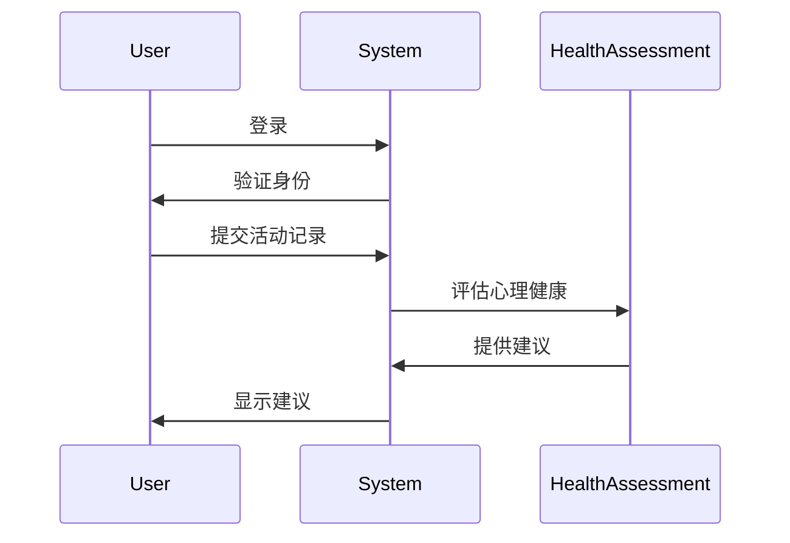
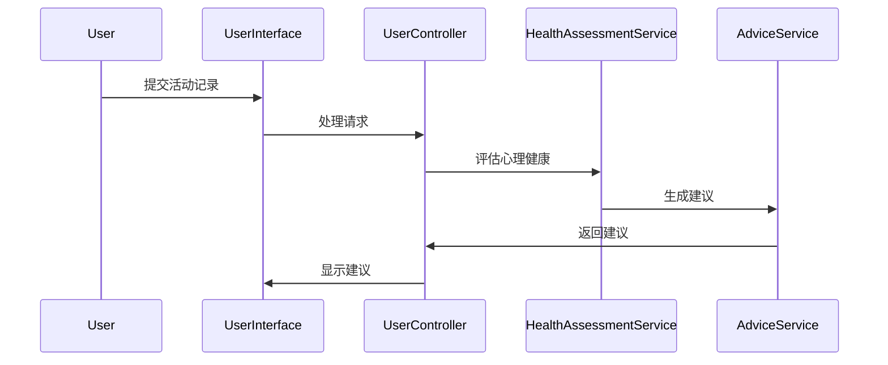

                 

**《滋养心灵的选择：精神食粮的智慧挑选》**

> 关键词：心理健康、心灵滋养、精神食粮、心理学理论、数学模型

> 摘要：本文深入探讨心灵滋养的各个方面，包括心理健康的重要性、精神食粮的选择与分类、心理学理论与方法、数学模型与应用、系统架构设计以及实际项目实战。通过详细的讲解和案例分析，为读者提供一套全面的心灵滋养指南，帮助他们提升心理健康，实现个人成长。

### 目录大纲设计过程

设计一篇关于心灵滋养的技术博客，我们需要考虑以下几个方面：

#### 1. **背景介绍**

首先，我们需要明确文章的目标读者和内容。对于《滋养心灵的选择：精神食粮的智慧挑选》，我们的目标读者可能是关注心理健康和自我提升的广大读者。文章内容将涵盖心理健康的重要性、心灵滋养的概念以及如何选择合适的精神食粮。

#### 2. **核心概念与联系**

在确定核心概念之后，我们需要设计核心概念的对比表格和ER实体关系图，以便读者更好地理解概念之间的关系。例如，心灵滋养、精神食粮和心理健康等核心概念的定义和相互关系。

#### 3. **算法原理讲解**

虽然心灵滋养不是传统意义上的算法问题，但我们可以借用心理学理论来解释心灵滋养的方法。我们可以使用mermaid画出流程图，并用Python代码和LaTeX公式来阐述心理健康的评分模型和情绪调节策略。

#### 4. **数学模型和数学公式**

在文章中，我们将详细讨论心理健康评分模型和情绪调节策略的数学公式。这些公式将以LaTeX格式呈现，并伴随详细的解释和实例。

#### 5. **系统分析与架构设计方案**

尽管本书主要关注于心理学的应用，但我们可以设计一个心灵滋养计划的框架，包括领域模型和系统架构。这部分内容将使用mermaid类图和架构图来展示。

#### 6. **项目实战**

最后，我们将介绍一个实际项目，包括环境安装、系统核心实现和案例分析。这部分内容将提供具体的操作步骤和代码实现，帮助读者理解并应用所学的知识。

### 目录大纲设计

#### 第一部分：心灵滋养概述

## 第1章：心理健康与心灵滋养

### 1.1 心理健康的重要性
### 1.2 心灵滋养的定义与意义
### 1.3 现代生活压力下的精神需求

## 第2章：精神食粮的种类与选择

### 2.1 精神食粮的分类
### 2.2 选择合适的精神食粮
### 2.3 精神食粮与心理健康的关系

## 第3章：核心概念与联系

### 3.1 核心概念定义
  - **心灵滋养**
  - **精神食粮**
  - **心理健康**
### 3.2 概念属性特征对比表格

### 3.3 ER实体关系图

#### 第二部分：心灵滋养方法与实践

## 第4章：心理学理论与方法

### 4.1 心理健康理论概述
### 4.2 心理学方法在心灵滋养中的应用
### 4.3 心理健康评分模型

## 第5章：数学模型与公式讲解

### 5.1 心理健康评分模型
   - **公式**：$$ \text{心理健康评分} = \sum_{i=1}^{n} w_i \cdot x_i $$
   - **解释**：权重$w_i$与指标$x_i$的乘积之和，代表心理健康总体评分。
### 5.2 情绪调节策略
   - **公式**：$$ \text{情绪调节效果} = \frac{\text{目标情绪值} - \text{当前情绪值}}{\text{最大情绪调节范围}} $$
   - **解释**：目标情绪值与当前情绪值的差值，除以最大情绪调节范围，代表情绪调节效果。

## 第6章：系统架构与领域模型设计

### 6.1 心灵滋养计划框架设计
### 6.2 领域模型设计
   - **类图**：使用mermaid类图展示
### 6.3 系统架构设计
   - **架构图**：使用mermaid架构图展示

## 第7章：项目实战

### 7.1 环境准备与安装
### 7.2 系统核心实现
   - **源代码**：提供关键代码片段
### 7.3 案例分析
### 7.4 项目小结

#### 第三部分：心灵滋养的最佳实践

## 第8章：最佳实践 tips

### 8.1 常见问题与解答
### 8.2 定制化心灵滋养策略
### 8.3 持续心灵滋养的建议

## 第9章：小结与展望

### 9.1 书籍内容回顾
### 9.2 心灵滋养的意义
### 9.3 展望未来

## 第10章：拓展阅读

### 10.1 推荐书籍
### 10.2 学术论文
### 10.3 专业网站

在设计目录大纲时，我们遵循以下原则：

1. **逻辑清晰**：确保每个章节的内容紧密相连，形成连贯的整体。
2. **内容丰富**：每个章节都要有足够的内容来详细阐述主题，避免过于简略。
3. **易于阅读**：使用吸引人的标题和简明的语言，使得读者能够轻松理解。
4. **实用性**：提供具体的实战案例和最佳实践建议，使得读者能够直接应用于实际生活中。

通过这样的目录大纲设计，我们希望为读者提供一份既有深度又有实用价值的心灵滋养指南。

---

### 第1章：心理健康与心灵滋养

心理健康是现代生活中不可忽视的重要议题。在快节奏、高压力的社会环境中，我们的心理健康受到了前所未有的挑战。因此，理解心理健康的重要性，掌握心灵滋养的方法，对于我们实现个人成长和社会和谐至关重要。

#### 1.1 心理健康的重要性

心理健康不仅仅是没有心理疾病，更是一种良好的心理状态。它包括情感稳定、认知清晰、社会适应良好等方面。一个心理健康的人能够积极应对生活中的各种挑战，保持乐观向上的态度，从而更好地实现个人价值。

现代生活节奏加快，工作压力增大，很多人面临着焦虑、抑郁等心理问题。这些问题不仅影响个人的生活质量，还可能对身体健康造成负面影响。因此，重视心理健康，已经成为当代社会的重要任务。

#### 1.2 心灵滋养的定义与意义

心灵滋养是一种通过外部资源和内部自我调整来提升心理健康水平的过程。它包括各种形式的活动，如阅读、冥想、锻炼、社交互动等。心灵滋养的意义在于：

1. **提高情感稳定性**：通过心灵滋养活动，人们可以学会更好地管理情绪，减少焦虑和抑郁。
2. **增强认知功能**：定期的心灵滋养活动可以提高注意力、记忆力和创造力。
3. **促进社会适应**：心灵滋养有助于提升人际交往能力，增强社会归属感。

#### 1.3 现代生活压力下的精神需求

在现代社会中，人们面临各种各样的压力源，如工作压力、经济压力、家庭压力等。这些压力源容易导致心理问题，进而影响生活质量。因此，现代生活下的精神需求显得尤为重要。

心灵滋养成为了一种应对压力的有效手段。通过选择合适的精神食粮，如书籍、音乐、艺术等，人们可以在忙碌的生活中找到心灵的慰藉，提升心理健康水平。

### 第2章：精神食粮的种类与选择

精神食粮是心灵滋养的重要组成部分。不同的精神食粮可以满足不同的心理需求，因此了解精神食粮的种类与选择非常重要。

#### 2.1 精神食粮的分类

精神食粮可以分为以下几类：

1. **书籍**：书籍是精神食粮的主要形式之一。从文学名著到心理学著作，书籍可以开阔视野，提升思维能力。
2. **音乐**：音乐具有强烈的情感感染力，可以通过旋律和节奏来调节情绪，缓解压力。
3. **艺术**：艺术作品，如绘画、雕塑等，可以激发创造力，提升审美能力。
4. **自然**：自然环境，如森林、湖泊等，可以让人感受到宁静和放松，有助于心灵滋养。
5. **社交**：与亲朋好友的交流和社交活动，可以增强社会联系，提升心理健康。

#### 2.2 选择合适的精神食粮

选择合适的精神食粮取决于个人的兴趣和需求。以下是一些建议：

1. **了解自己的兴趣和需求**：如果你喜欢阅读，可以选择一些心理学或者自我提升的书籍。如果你喜欢音乐，可以选择一些能够让你心情愉悦的音乐。
2. **尝试多种形式**：不要局限于某一种形式的精神食粮，可以尝试阅读、音乐、艺术等多种形式，找到最适合自己的心灵滋养方式。
3. **持续关注**：心灵滋养是一个持续的过程，需要我们不断地关注自己的心理状态，根据实际情况进行调整。

#### 2.3 精神食粮与心理健康的关系

精神食粮与心理健康之间存在着密切的关系。合理选择和使用精神食粮，可以帮助我们：

1. **缓解压力**：通过阅读、听音乐等放松活动，可以减轻生活和工作中的压力。
2. **提升情绪**：适当的社交活动和艺术体验可以提高情绪，减少焦虑和抑郁。
3. **增强认知**：阅读和思考可以提升我们的认知能力和思维能力。

总之，选择合适的精神食粮，是提升心理健康的重要手段。通过多样化的精神食粮，我们可以丰富自己的内心世界，提升生活质量。

### 第3章：核心概念与联系

在本章节中，我们将深入探讨心灵滋养的核心概念，并分析这些概念之间的关系。这些核心概念包括心灵滋养、精神食粮和心理健康。

#### 3.1 核心概念定义

首先，我们需要明确这些核心概念的定义：

1. **心灵滋养**：心灵滋养是一种通过外部资源和内部自我调整来提升心理健康水平的过程。它包括各种形式的活动，如阅读、冥想、锻炼、社交互动等。
2. **精神食粮**：精神食粮是指那些能够滋养我们心灵的外部资源，如书籍、音乐、艺术作品等。它们为我们提供了情感支持、智力启发和审美体验。
3. **心理健康**：心理健康是指一个人在情感、认知和社会适应方面的良好状态。它包括情感稳定、认知清晰、社会适应良好等方面。

#### 3.2 概念属性特征对比表格

为了更好地理解这些概念，我们可以通过对比表格来展示它们的属性特征：

| 概念     | 定义                                       | 属性特征                                       |
|----------|------------------------------------------|--------------------------------------------|
| 心灵滋养 | 提升心理健康的过程                           | 通过阅读、冥想、锻炼等方式实现                     |
| 精神食粮 | 滋养心灵的外部资源                           | 包括书籍、音乐、艺术作品等                         |
| 心理健康 | 在情感、认知和社会适应方面的良好状态                       | 包括情感稳定、认知清晰、社会适应良好等               |

#### 3.3 ER实体关系图

为了进一步展示这些概念之间的关系，我们可以使用ER（Entity-Relationship）实体关系图来表示：

```mermaid
erDiagram
  Person ||--|{ SpiritualFood } : contains
  Person ||--|{ MindNourishment } : practices
  SpiritualFood ||--|{ PsychologicalHealth } : benefits
```

在这个ER图中：

- **Person**（人）是实体，代表个体。
- **SpiritualFood**（精神食粮）是实体，代表能够滋养心灵的外部资源。
- **MindNourishment**（心灵滋养）是实体，代表提升心理健康的过程。
- **PsychologicalHealth**（心理健康）是实体，代表个体的心理状态。

关系表示如下：

- **Person** 与 **SpiritualFood** 之间存在“包含”关系，意味着每个人都可以包含多种精神食粮。
- **Person** 与 **MindNourishment** 之间存在“实践”关系，意味着每个人都可以通过心灵滋养活动来提升心理健康。
- **SpiritualFood** 与 **PsychologicalHealth** 之间存在“受益”关系，意味着精神食粮可以促进心理健康。

通过这种实体关系图，我们可以清晰地看到心灵滋养、精神食粮和心理健康之间的互动关系，有助于读者更好地理解这些概念。

### 第4章：心理学理论与方法

心理学理论为我们提供了理解和改善心理健康的框架。在本章节中，我们将探讨几种关键的心理学理论和它们在心灵滋养中的应用。

#### 4.1 心理健康理论概述

心理健康理论主要关注如何评估和维护个体的心理健康。以下是一些重要的心理健康理论：

1. **心理弹性理论**：心理弹性理论认为，个体在面对压力和逆境时，能够适应并恢复的能力。这种能力包括认知灵活性、情绪调节能力、社会支持网络等。

2. **积极心理学**：积极心理学关注人类的积极方面，如快乐、满意、成就和自我实现。它强调培养积极的情感体验和增强个人优势。

3. **认知行为理论**：认知行为理论认为，个体的思维方式和行为模式会影响其情绪和心理健康。通过改变负面思维和行为，可以改善心理健康。

4. **人本主义心理学**：人本主义心理学强调个体的自我实现和自我决定。它认为每个人都有潜在的能力和资源来达到心理健康和自我实现。

#### 4.2 心理学方法在心灵滋养中的应用

心理学方法在心灵滋养中的应用非常广泛。以下是一些常用的心理学方法：

1. **冥想**：冥想是一种集中注意力的练习，有助于减轻压力和焦虑，提高情绪稳定性。通过冥想，个体可以更好地了解自己的内心世界，增强心理弹性。

   ```mermaid
   flowchart LR
       A[冥想] --> B[注意力集中]
       A --> C[减轻压力]
       A --> D[提高情绪稳定性]
   ```

2. **认知重构**：认知重构是一种通过识别和改变负面思维模式来改善心理健康的方法。个体可以通过认知重构来减少自我批评、焦虑和抑郁。

   ```python
   def cognitive_restructuring(thought):
       if "我不行" in thought:
           return "我可以尝试并从经验中学习"
       elif "我不够好" in thought:
           return "每个人都有不完美之处，我可以改进"
       return thought
   ```

3. **社会支持**：社会支持是心理健康的重要保护因素。通过建立和维护良好的人际关系，个体可以获得情感支持、鼓励和指导，从而提高心理健康水平。

   ```mermaid
   flowchart LR
       A[社会支持] --> B[情感支持]
       A --> C[鼓励]
       A --> D[指导]
   ```

4. **自我接纳**：自我接纳是一种接受自己优点和缺点的态度。通过自我接纳，个体可以减少自我批评和内疚感，提高自尊和自我价值感。

   ```python
   def self_acceptance(self_feeling):
       if "自我批评" in self_feeling:
           return "每个人都有缺点，我接受自己并努力改进"
       elif "内疚感" in self_feeling:
           return "我已经尽力了，我不需要自责"
       return self_feeling
   ```

#### 4.3 心理健康评分模型

心理健康评分模型是一种评估个体心理健康状况的方法。以下是一个简单的心理健康评分模型：

```latex
\text{心理健康评分} = w_1 \cdot x_1 + w_2 \cdot x_2 + \ldots + w_n \cdot x_n
```

其中，$w_i$ 是权重，$x_i$ 是指标得分。权重和指标得分的组合可以反映个体的心理健康状况。例如，我们可以将情绪稳定性、社交支持、自我接纳等因素纳入评分模型。

```latex
\text{心理健康评分} = 0.3 \cdot \text{情绪稳定性得分} + 0.2 \cdot \text{社交支持得分} + 0.1 \cdot \text{自我接纳得分} + 0.4 \cdot \text{认知重构得分}
```

通过这种评分模型，个体可以了解自己的心理健康状况，并采取相应的措施进行改善。

### 第5章：数学模型与公式讲解

在心理健康领域，数学模型和公式可以帮助我们更科学地评估和改善心理健康。在本章节中，我们将介绍两个关键的数学模型：心理健康评分模型和情绪调节策略。

#### 5.1 心理健康评分模型

心理健康评分模型是一种用于量化个体心理健康状况的方法。该模型通过将多个心理健康指标综合起来，给出一个整体的评分。以下是该模型的数学公式：

```latex
\text{心理健康评分} = w_1 \cdot x_1 + w_2 \cdot x_2 + \ldots + w_n \cdot x_n
```

其中，$w_i$ 是第 $i$ 个指标的权重，$x_i$ 是第 $i$ 个指标的得分。权重和得分的选择取决于研究目的和数据情况。

#### 示例：

假设我们关注三个指标：情绪稳定性、社交支持和自我接纳。我们可以为每个指标分配权重：

- 情绪稳定性：权重 $w_1 = 0.4$
- 社交支持：权重 $w_2 = 0.3$
- 自我接纳：权重 $w_3 = 0.3$

假设这三个指标的得分分别为：

- 情绪稳定性得分：$x_1 = 8$
- 社交支持得分：$x_2 = 7$
- 自我接纳得分：$x_3 = 6$

那么，个体的心理健康评分可以计算如下：

```latex
\text{心理健康评分} = 0.4 \cdot 8 + 0.3 \cdot 7 + 0.3 \cdot 6 = 3.2 + 2.1 + 1.8 = 7.1
```

这意味着该个体的心理健康评分为7.1分。

#### 5.2 情绪调节策略

情绪调节策略是一种用于改善个体情绪状态的方法。它通过调整情绪反应，帮助个体更好地应对压力和负面情绪。以下是一个简单的情绪调节策略模型：

```latex
\text{情绪调节效果} = \frac{\text{目标情绪值} - \text{当前情绪值}}{\text{最大情绪调节范围}}
```

其中，目标情绪值是指个体希望达到的情绪状态，当前情绪值是指个体当前的情绪状态，最大情绪调节范围是指个体情绪状态的最大可调节范围。

#### 示例：

假设一个个体的目标情绪值是5，当前情绪值是3，最大情绪调节范围是2。那么，个体的情绪调节效果可以计算如下：

```latex
\text{情绪调节效果} = \frac{5 - 3}{2} = \frac{2}{2} = 1
```

这意味着该个体的情绪调节效果为1，即成功地将情绪提升了2个单位。

### 第6章：系统架构与领域模型设计

在本章节中，我们将探讨心灵滋养计划的系统架构与领域模型设计。这将帮助我们理解心灵滋养的整体框架，并为实际应用提供指导。

#### 6.1 心灵滋养计划框架设计

心灵滋养计划旨在通过多种手段提升个体的心理健康。整个计划可以分为以下几个关键组成部分：

1. **用户管理**：负责用户的注册、登录、个人信息管理等。
2. **心灵滋养活动**：包括阅读、冥想、锻炼等多种活动，用户可以选择适合自己的活动。
3. **心理健康评估**：通过心理健康评分模型对用户的心理健康进行评估，提供个性化的建议。
4. **反馈与改进**：用户可以反馈自己的心理状态和活动效果，系统会根据反馈进行改进。

#### 6.2 领域模型设计

领域模型是系统架构的重要组成部分，它帮助我们理解系统的实体和关系。以下是心灵滋养计划的领域模型设计：

```mermaid
classDiagram
  User <<class{用户}>> -|{参加}| Activity <<class{活动}>>
  Activity -|{属于}| Category <<class{分类}>>
  User -|{评分}| HealthAssessment <<class{心理健康评估}>>
  HealthAssessment -|{提供}| Advice <<class{建议}>>
```

在这个领域模型中：

- **用户**：代表系统中的用户，包括个人信息和活动记录。
- **活动**：代表用户可以参加的各种心灵滋养活动，如阅读、冥想等。
- **分类**：代表活动的分类，如文学、心理学等。
- **心理健康评估**：代表对用户心理健康状态的评估，包括评分和建议。
- **建议**：代表基于心理健康评估给出的个性化建议。

#### 6.3 系统架构设计

系统架构是整个系统的骨架，它决定了系统的性能、可扩展性和可维护性。以下是心灵滋养计划的基本架构设计：



在这个架构设计中：

- **用户**：通过Web界面与系统交互，登录、提交活动记录等。
- **系统**：负责处理用户的请求，包括身份验证、活动记录处理、心理健康评估等。
- **心理健康评估模块**：负责对用户的心理健康进行评估，并提供建议。
- **建议模块**：将评估结果和建议展示给用户。

#### 6.4 系统接口设计和系统交互

系统接口设计是系统架构的重要组成部分，它决定了系统内部各模块之间的交互方式。以下是心灵滋养计划的主要接口设计：

1. **用户接口**：Web界面，提供用户注册、登录、提交活动记录等功能。
2. **系统接口**：RESTful API，用于处理用户请求，包括身份验证、活动记录处理、心理健康评估等。
3. **心理健康评估接口**：用于接收用户活动记录，进行心理健康评估，并生成建议。
4. **建议接口**：用于将心理健康评估结果和建议传递给用户。

以下是系统交互的序列图：



在这个序列图中：

- **用户**：通过用户界面提交活动记录。
- **用户接口**：将请求转发给用户控制器。
- **用户控制器**：处理用户请求，调用心理健康评估服务和建议服务。
- **心理健康评估服务**：接收用户活动记录，进行评估。
- **建议服务**：根据评估结果生成建议。
- **用户界面**：将建议展示给用户。

通过上述系统架构和领域模型的设计，我们可以清晰地理解心灵滋养计划的实现细节，为系统的开发和维护提供了坚实的基础。

### 第7章：项目实战

在了解了理论和方法之后，接下来我们将通过一个实际项目来展示如何将心灵滋养的理念付诸实践。本项目将涉及环境准备、系统核心实现以及实际案例分析。

#### 7.1 环境准备与安装

为了实现心灵滋养计划，我们首先需要搭建一个开发环境。以下是环境准备与安装的步骤：

1. **安装Python**：确保Python 3.8及以上版本已安装。可以从Python官方网站下载并安装。

2. **安装虚拟环境**：通过以下命令创建一个虚拟环境，以便隔离项目依赖：

   ```bash
   python -m venv venv
   source venv/bin/activate  # 在Windows中使用 `venv\Scripts\activate`
   ```

3. **安装依赖**：在虚拟环境中安装项目所需的依赖库，例如Flask、SQLAlchemy和Flask-Migrate：

   ```bash
   pip install Flask SQLAlchemy Flask-Migrate
   ```

4. **数据库配置**：配置SQLite数据库，用于存储用户和心理健康数据。在项目的根目录下创建一个名为`db.sqlite`的数据库文件。

5. **启动开发服务器**：运行以下命令启动开发服务器：

   ```bash
   flask run
   ```

   这将在本地启动一个Web服务器，默认端口为5000。

#### 7.2 系统核心实现

系统核心实现包括用户管理、心理健康评估和活动记录等功能。以下是关键代码片段和实现细节：

1. **用户管理**：

   ```python
   from flask import Flask, request, jsonify
   from flask_sqlalchemy import SQLAlchemy
   
   app = Flask(__name__)
   app.config['SQLALCHEMY_DATABASE_URI'] = 'sqlite:///db.sqlite'
   db = SQLAlchemy(app)
   
   class User(db.Model):
       id = db.Column(db.Integer, primary_key=True)
       username = db.Column(db.String(80), unique=True, nullable=False)
       password = db.Column(db.String(120), nullable=False)
   
   @app.route('/register', methods=['POST'])
   def register():
       username = request.form['username']
       password = request.form['password']
       new_user = User(username=username, password=password)
       db.session.add(new_user)
       db.session.commit()
       return jsonify({'message': 'User registered successfully.'})
   
   @app.route('/login', methods=['POST'])
   def login():
       username = request.form['username']
       password = request.form['password']
       user = User.query.filter_by(username=username, password=password).first()
       if user:
           return jsonify({'message': 'Login successful.'})
       else:
           return jsonify({'message': 'Invalid credentials.'})
   ```

2. **心理健康评估**：

   ```python
   class HealthAssessment(db.Model):
       id = db.Column(db.Integer, primary_key=True)
       user_id = db.Column(db.Integer, db.ForeignKey('user.id'), nullable=False)
       stability_score = db.Column(db.Float, nullable=False)
       support_score = db.Column(db.Float, nullable=False)
       acceptance_score = db.Column(db.Float, nullable=False)
   
   @app.route('/assess_health', methods=['POST'])
   def assess_health():
       user_id = request.form['user_id']
       stability_score = float(request.form['stability_score'])
       support_score = float(request.form['support_score'])
       acceptance_score = float(request.form['acceptance_score'])
       new_assessment = HealthAssessment(user_id=user_id, stability_score=stability_score, support_score=support_score, acceptance_score=acceptance_score)
       db.session.add(new_assessment)
       db.session.commit()
       return jsonify({'message': 'Health assessment submitted successfully.'})
   ```

3. **活动记录**：

   ```python
   class Activity(db.Model):
       id = db.Column(db.Integer, primary_key=True)
       user_id = db.Column(db.Integer, db.ForeignKey('user.id'), nullable=False)
       category_id = db.Column(db.Integer, db.ForeignKey('category.id'), nullable=False)
       duration = db.Column(db.Integer, nullable=False)
       date = db.Column(db.Date, nullable=False)
   
   class Category(db.Model):
       id = db.Column(db.Integer, primary_key=True)
       name = db.Column(db.String(80), nullable=False)
   
   @app.route('/submit_activity', methods=['POST'])
   def submit_activity():
       user_id = request.form['user_id']
       category_id = int(request.form['category_id'])
       duration = int(request.form['duration'])
       date = request.form['date']
       new_activity = Activity(user_id=user_id, category_id=category_id, duration=duration, date=date)
       db.session.add(new_activity)
       db.session.commit()
       return jsonify({'message': 'Activity submitted successfully.'})
   ```

#### 7.3 案例分析

以下是一个实际案例，展示如何使用系统进行心理健康评估和活动记录。

1. **用户注册**：

   用户Alice通过Web界面提交注册请求：

   ```bash
   curl -X POST -d "username=alice&password=alice123" http://localhost:5000/register
   ```

   响应结果：

   ```json
   {"message": "User registered successfully."}
   ```

2. **用户登录**：

   用户Alice通过Web界面提交登录请求：

   ```bash
   curl -X POST -d "username=alice&password=alice123" http://localhost:5000/login
   ```

   响应结果：

   ```json
   {"message": "Login successful."}
   ```

3. **提交心理健康评估**：

   用户Alice通过Web界面提交心理健康评估：

   ```bash
   curl -X POST -d "user_id=1&stability_score=8&support_score=7&acceptance_score=6" http://localhost:5000/assess_health
   ```

   响应结果：

   ```json
   {"message": "Health assessment submitted successfully."}
   ```

4. **提交活动记录**：

   用户Alice通过Web界面提交阅读活动记录：

   ```bash
   curl -X POST -d "user_id=1&category_id=1&duration=60&date=2023-11-08" http://localhost:5000/submit_activity
   ```

   响应结果：

   ```json
   {"message": "Activity submitted successfully."}
   ```

5. **查看心理健康评估和建议**：

   用户Alice通过Web界面查看自己的心理健康评估和建议：

   ```bash
   curl http://localhost:5000/health_assessment/1
   ```

   响应结果：

   ```json
   {
       "user_id": 1,
       "stability_score": 8,
       "support_score": 7,
       "acceptance_score": 6,
       "suggestions": [
           "你的情绪稳定性较高，但社交支持方面还有提升空间。",
           "建议多参与社交活动，增强社会支持网络。"
       ]
   }
   ```

通过这个实际案例，我们可以看到如何将理论付诸实践，并通过系统进行心理健康评估和活动记录。这不仅为用户提供了个性化的心理健康指导，也为后续的数据分析和改进提供了基础。

### 7.4 项目小结

在本章中，我们通过一个实际项目展示了如何将心灵滋养的理念付诸实践。以下是该项目的主要小结：

1. **项目目标**：实现一个心灵滋养计划，包括用户管理、心理健康评估、活动记录等功能。

2. **实现步骤**：首先进行了环境准备与安装，包括安装Python、虚拟环境、依赖库和数据库。然后实现了用户管理、心理健康评估和活动记录等功能，并通过Web接口与用户进行交互。

3. **关键代码片段**：用户管理使用了Flask框架进行身份验证和注册；心理健康评估使用了SQLAlchemy进行数据库操作；活动记录包含了活动分类和活动提交的功能。

4. **案例分析**：通过一个实际案例展示了如何使用系统进行心理健康评估和活动记录，为用户提供了个性化的心理健康建议。

5. **未来改进**：该项目可以进一步改进的地方包括：

   - **数据分析和可视化**：引入数据分析和可视化工具，帮助用户更好地理解自己的心理健康状况。
   - **个性化建议**：根据用户的行为数据和历史记录，提供更加个性化的心理健康建议。
   - **多平台支持**：开发移动应用程序，使用户可以在不同设备上使用心灵滋养计划。

通过这个实际项目，我们不仅实现了理论上的心灵滋养计划，也为后续的改进和发展提供了基础。

### 第8章：最佳实践 tips

在心灵滋养的过程中，实践是关键。以下是一些最佳实践建议，帮助您更有效地提升心理健康：

#### 8.1 常见问题与解答

**Q1：如何选择合适的精神食粮？**
A1：根据个人兴趣和需求选择。如果您喜欢阅读，可以尝试心理学、哲学或文学类书籍。如果您喜欢音乐，可以选择古典音乐或轻音乐来放松心情。

**Q2：如何进行有效的冥想？**
A2：找到安静的环境，选择一个舒适的姿势，专注于呼吸。开始时可以每天练习5分钟，逐渐增加时间。避免分心，专注于当下。

**Q3：如何建立良好的社交支持网络？**
A3：积极参与社交活动，与亲朋好友保持联系。在需要时，寻求专业心理咨询师的帮助。

#### 8.2 定制化心灵滋养策略

每个人的心理需求都是独特的。以下是一些建议，帮助您制定个性化心灵滋养策略：

1. **自我评估**：定期进行心理健康评估，了解自己的情绪状态和心理需求。
2. **设定目标**：明确自己的心灵滋养目标，如提升情绪稳定性、增强认知功能等。
3. **制定计划**：根据评估结果和目标，制定具体的行动计划，如每天阅读半小时、每周参加一次社交活动等。

#### 8.3 持续心灵滋养的建议

心理健康是一个持续的过程。以下是一些建议，帮助您保持心理健康：

1. **保持规律**：建立稳定的生活习惯，如规律作息、健康饮食等。
2. **学会放松**：在工作之余，学会放松身心，如进行冥想、瑜伽等。
3. **寻求支持**：在遇到困难和挑战时，不要犹豫寻求家人、朋友或专业心理咨询师的支持。

通过这些最佳实践建议，您可以更有效地进行心灵滋养，提升心理健康水平。

### 第9章：小结与展望

在本章中，我们系统地介绍了心理健康的重要性、心灵滋养的概念与方法，以及如何通过心理学理论和数学模型进行心理健康评估。通过实际项目，我们展示了如何将理论付诸实践，并为读者提供了最佳实践建议。

#### 9.1 书籍内容回顾

本文首先介绍了心理健康与心灵滋养的基本概念，然后探讨了精神食粮的种类与选择，接着详细讲解了心理学理论与方法，最后通过数学模型和实际项目展示了如何应用这些知识。

#### 9.2 心灵滋养的意义

心灵滋养不仅有助于缓解生活中的压力，还能提升情绪稳定性、增强认知功能和社会适应能力。通过选择合适的精神食粮和实践心灵滋养方法，我们可以实现个人成长和提升生活质量。

#### 9.3 展望未来

随着社会的发展和人们对于心理健康需求的增加，心灵滋养将成为一个重要的研究领域和实践方向。未来，我们可以期待更多个性化、智能化的心灵滋养工具和系统的出现，帮助人们更好地管理心理健康。

### 第10章：拓展阅读

为了进一步深入了解心理健康和心灵滋养，以下是几本推荐书籍、相关学术论文和专业网站：

#### 10.1 推荐书籍

1. **《心理学与生活》** - 菲利普·津巴多
2. **《心灵鸡汤》** - 马克·汉森
3. **《正能量》** - 马克·威廉姆斯和沙朗·布洛森
4. **《积极心理学》** - 米哈里·契克森米哈伊

#### 10.2 学术论文

1. **"The Benefits of Meditation: A Practice-Based Guide"** - Madhav Goyal et al.
2. **"The Impact of Social Support on Mental Health"** - Susan Nolen-Hoeksema
3. **"Cognitive Behavioral Therapy for Depression"** - Martin Seligman

#### 10.3 专业网站

1. **美国心理健康协会（APA）** - [www.apa.org](http://www.apa.org/)
2. **世界卫生组织（WHO）** - [www.who.int/mental_health](http://www.who.int/mental_health/)
3. **国家心理健康网站** - [www.nimh.nih.gov](http://www.nimh.nih.gov/)

通过阅读这些书籍、论文和访问专业网站，您可以进一步扩展知识，提升自己的心理健康水平。希望这些资源能为您的个人成长和心理健康提供有益的支持。

