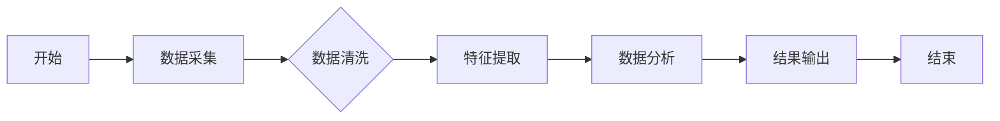
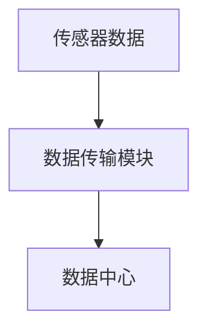
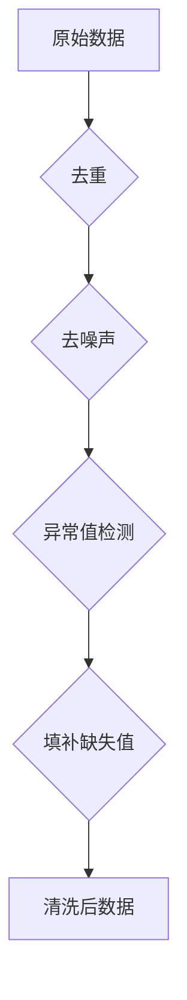
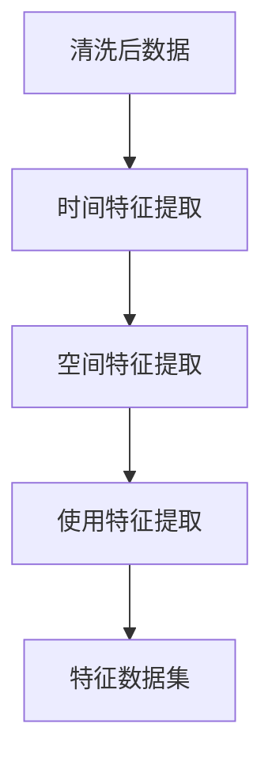
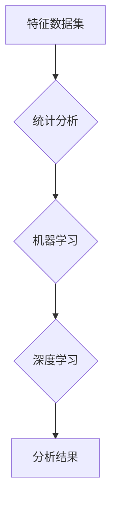
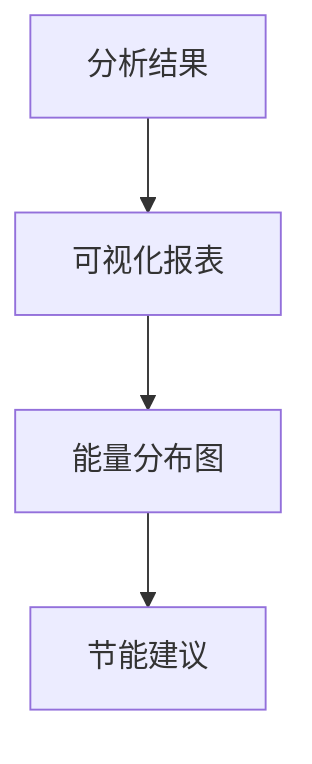
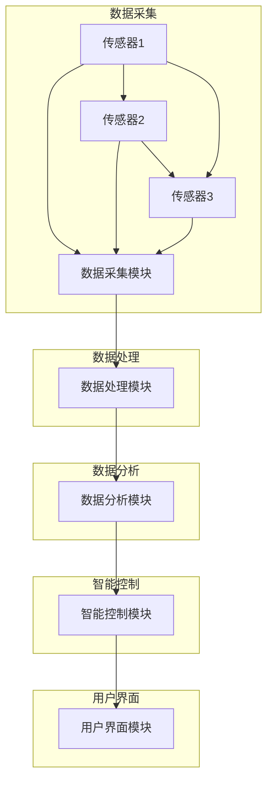
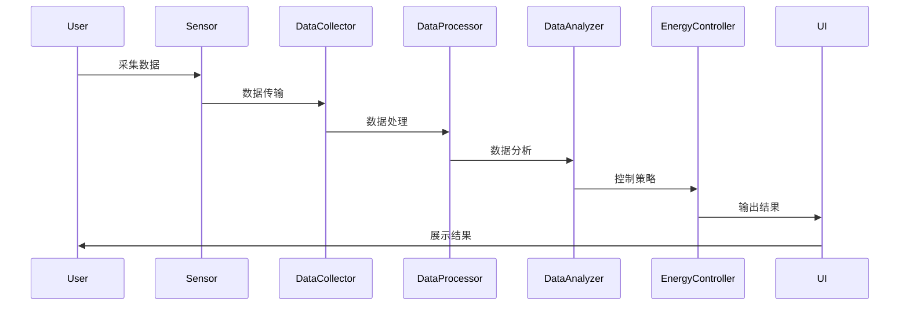

                 

# 物联网在智慧城市能源管理中的应用

## 引言

### 1.1.1 智慧城市的发展背景

智慧城市作为现代城市发展的新方向，源于对信息技术、大数据、物联网等新技术的广泛应用。其核心理念是通过技术手段提升城市管理效率、改善居民生活质量，实现城市资源的优化配置。智慧城市的发展背景主要包括以下几个方面：

- **城市化进程加速**：随着全球经济的快速发展，城市化进程不断加速，城市化率逐步提高。这为智慧城市的建设提供了良好的发展环境和市场需求。
- **技术进步推动**：大数据、云计算、物联网、人工智能等新兴技术的不断突破，为智慧城市提供了强有力的技术支持。
- **政策支持**：各国政府纷纷出台相关政策，推动智慧城市建设，如中国的“新型智慧城市建设指导意见”、欧盟的“智能城市行动计划”等。

### 1.1.2 能源管理的重要性

能源管理是城市运行的核心环节之一，直接关系到城市的可持续发展。能源管理的重要性主要体现在以下几个方面：

- **保障能源供应**：通过科学合理的能源管理，可以保障城市能源的稳定供应，避免能源短缺和供应中断。
- **节约能源**：通过能源监测和优化管理，可以最大限度地节约能源，降低能源消耗，提高能源利用效率。
- **减少污染**：通过能源管理，可以优化能源结构，降低污染物的排放，改善环境质量。
- **促进可持续发展**：通过科学管理能源资源，可以保障城市的可持续发展，为后代留下宝贵的资源。

### 1.1.3 物联网在能源管理中的应用价值

物联网（Internet of Things，IoT）作为新一代信息技术，具有广泛的应用前景。在智慧城市能源管理中，物联网的应用价值主要体现在以下几个方面：

- **实时监测**：通过物联网技术，可以实现对能源系统的实时监测，获取准确的能源数据，为能源管理提供数据支持。
- **智能控制**：物联网技术可以实现能源系统的智能控制，优化能源分配，提高能源利用效率。
- **数据融合**：物联网可以将不同来源的能源数据进行整合，形成统一的能源管理平台，为能源决策提供全面的数据支持。
- **优化能源结构**：通过物联网技术，可以实时监测和分析能源消费情况，优化能源结构，提高能源供应的可持续性。

### 1.2 问题描述

#### 1.2.1 能源管理存在的问题

目前，城市能源管理存在以下几个方面的问题：

- **数据分散**：能源数据分散在不同的部门和系统中，难以实现统一管理和分析。
- **效率低下**：能源管理过程复杂，人工干预多，导致管理效率低下。
- **能源浪费**：由于缺乏实时监测和智能控制，能源浪费问题较为严重。
- **环境污染**：能源消耗带来的环境污染问题日益突出。

#### 1.2.2 物联网技术的挑战与机遇

物联网技术在能源管理中的应用面临以下挑战：

- **数据安全**：物联网设备众多，数据传输过程中存在安全隐患。
- **网络稳定性**：物联网设备分布广泛，网络稳定性对能源管理至关重要。
- **系统兼容性**：不同系统之间的兼容性问题，影响物联网技术的应用效果。

然而，物联网技术也为能源管理带来了机遇：

- **实时监测**：通过物联网技术，可以实现能源系统的实时监测，提高管理效率。
- **智能控制**：物联网技术可以实现能源系统的智能控制，优化能源分配，提高能源利用效率。
- **数据融合**：物联网技术可以整合不同来源的能源数据，为能源管理提供全面的数据支持。

#### 1.2.3 物联网在能源管理中的应用现状

目前，物联网在能源管理中的应用已取得一定成果，主要体现在以下几个方面：

- **智慧电网建设**：通过物联网技术，实现电网的智能化管理，提高电力供应的稳定性和效率。
- **智能楼宇管理**：通过物联网技术，实现对楼宇能源的实时监测和智能控制，降低能耗。
- **智能交通管理**：通过物联网技术，实现对交通能源的优化管理，降低交通能耗和污染。
- **综合能源管理平台**：通过物联网技术，构建综合能源管理平台，实现能源的统一监控和优化管理。

### 1.3 问题解决

#### 1.3.1 构建智慧城市能源管理系统的思路

为了解决城市能源管理存在的问题，需要从以下几个方面进行思考和设计：

- **数据整合**：将分散的能源数据进行整合，实现数据的统一管理和分析。
- **智能监测**：利用物联网技术，实现对能源系统的实时监测，提高管理效率。
- **智能控制**：利用物联网技术，实现对能源系统的智能控制，优化能源分配，提高能源利用效率。
- **系统集成**：将不同系统和平台进行集成，实现数据的互通和共享，为能源管理提供全面的数据支持。

#### 1.3.2 物联网技术在能源管理中的应用方法

物联网技术在能源管理中的应用方法主要包括以下几个方面：

- **传感器部署**：在能源系统关键位置部署传感器，实时监测能源使用情况。
- **数据采集与传输**：通过物联网技术，将传感器采集的数据传输到数据中心进行存储和处理。
- **数据分析与决策**：利用大数据技术和人工智能算法，对能源数据进行分析，为能源管理提供决策支持。
- **智能控制与优化**：根据数据分析结果，对能源系统进行智能控制，优化能源分配，提高能源利用效率。

#### 1.3.3 能源管理系统的关键技术

智慧城市能源管理系统的关键技术主要包括以下几个方面：

- **物联网技术**：用于实现能源系统的实时监测和智能控制。
- **大数据技术**：用于能源数据的存储、处理和分析。
- **人工智能技术**：用于能源数据的智能分析和决策支持。
- **云计算技术**：用于实现能源管理系统的弹性扩展和高效计算。

### 1.4 边界与外延

#### 1.4.1 能源管理系统的范畴

能源管理系统主要涵盖以下几个方面：

- **能源监测**：对能源使用情况进行实时监测，获取能源数据。
- **能源控制**：对能源系统进行智能控制，优化能源分配。
- **能源分析**：对能源数据进行深入分析，为能源管理提供决策支持。
- **能源优化**：基于数据分析结果，对能源系统进行优化，提高能源利用效率。

#### 1.4.2 物联网技术在能源管理中的适用范围

物联网技术在能源管理中的适用范围主要包括以下几个方面：

- **电力系统**：实现对电网的实时监测和控制，提高电力供应的稳定性和效率。
- **燃气系统**：实现对燃气系统的实时监测和控制，优化燃气供应。
- **水务系统**：实现对水资源的实时监测和管理，提高水资源利用效率。
- **热力系统**：实现对热力系统的实时监测和控制，优化热力供应。

#### 1.4.3 能源管理系统的未来发展展望

随着物联网、大数据、人工智能等技术的发展，未来能源管理系统将朝着以下几个方向发展：

- **智能化**：通过引入人工智能技术，实现能源系统的自我学习和优化。
- **集成化**：通过系统集成，实现能源数据的全面整合和共享。
- **可视化**：通过可视化技术，实现对能源系统的实时监控和分析。
- **可持续化**：通过优化能源结构，提高能源利用效率，实现能源管理的可持续化。

### 1.5 概念结构与核心要素组成

#### 1.5.1 物联网的基本概念

物联网是指通过传感器、网络等使物体具备信息采集、传输和处理能力的技术系统。其主要组成部分包括传感器、网络、数据处理和智能终端等。

#### 1.5.2 智慧城市的基本概念

智慧城市是指通过信息技术手段提高城市管理效率、改善居民生活品质的城市。其主要组成部分包括智能基础设施、智能治理、智能服务、智能生活等。

#### 1.5.3 能源管理的基本概念

能源管理是指对能源的生产、传输、使用等进行组织、协调、控制的活动。其主要组成部分包括能源监测、能源控制、能源分析、能源优化等。

### 1.6 本章小结

本章主要介绍了智慧城市能源管理的发展背景、问题、应用价值以及物联网在能源管理中的应用方法和技术。通过对智慧城市和能源管理的基本概念进行分析，为后续章节的深入探讨奠定了基础。在接下来的章节中，我们将进一步探讨物联网在智慧城市能源管理中的应用原理、算法原理以及系统架构设计。

-------------------------------------------------------------------

## 核心概念与联系

### 2.1 物联网的概念原理

#### 2.1.1 物联网的定义

物联网（Internet of Things，IoT）是指通过传感器、网络等使物体具备信息采集、传输和处理能力的技术系统。它将现实世界中的物体连接到互联网上，实现物体之间的信息交换和智能交互。

#### 2.1.2 物联网的核心要素

物联网的核心要素包括传感器、网络、数据处理和智能终端等。

- **传感器**：用于感知和采集环境信息，如温度、湿度、光照等。
- **网络**：用于传输数据，实现物联网中各个设备之间的互联互通。
- **数据处理**：用于对采集到的数据进行分析和处理，提供决策支持。
- **智能终端**：用于接收和发送数据，实现物联网系统的交互操作。

#### 2.1.3 物联网的技术体系

物联网的技术体系包括传感器技术、网络技术、数据处理技术和智能终端技术等。

- **传感器技术**：用于感知和采集环境信息，包括温度传感器、湿度传感器、光照传感器等。
- **网络技术**：用于传输数据，包括有线网络和无线网络，如WiFi、蓝牙、ZigBee等。
- **数据处理技术**：用于对采集到的数据进行分析和处理，包括数据清洗、数据挖掘、数据可视化等。
- **智能终端技术**：用于接收和发送数据，实现物联网系统的交互操作，包括智能手机、平板电脑、智能手表等。

### 2.2 智慧城市的概念原理

#### 2.2.1 智慧城市的定义

智慧城市是指通过信息技术手段提高城市管理效率、改善居民生活品质的城市。它通过智能基础设施、智能治理、智能服务、智能生活等手段，实现城市资源的优化配置和可持续发展。

#### 2.2.2 智慧城市的核心要素

智慧城市的核心要素包括智能基础设施、智能治理、智能服务、智能生活等。

- **智能基础设施**：包括智能交通、智能能源、智能建筑、智能环境等，为智慧城市提供基础支持。
- **智能治理**：包括智能安防、智能城管、智能公共服务等，提高城市治理效率和服务质量。
- **智能服务**：包括智能医疗、智能教育、智能社区等，提升居民生活品质。
- **智能生活**：包括智能家居、智能穿戴、智能健康等，满足居民个性化需求。

#### 2.2.3 智慧城市的技术体系

智慧城市的技术体系包括物联网、大数据、云计算、人工智能等。

- **物联网**：用于连接城市中的各种设备和系统，实现数据采集和互联互通。
- **大数据**：用于处理和分析海量数据，提供决策支持。
- **云计算**：用于提供计算能力和存储能力，支持智慧城市应用的运行。
- **人工智能**：用于模拟人类智能，实现智能决策和智能交互。

### 2.3 能源管理的概念原理

#### 2.3.1 能源管理的定义

能源管理是指对能源的生产、传输、使用等进行组织、协调、控制的活动。它旨在提高能源利用效率，降低能源消耗，实现能源的可持续发展。

#### 2.3.2 能源管理的核心要素

能源管理的核心要素包括能源监测、能源控制、能源分析、能源优化等。

- **能源监测**：对能源使用情况进行实时监测，获取能源数据。
- **能源控制**：对能源系统进行智能控制，优化能源分配。
- **能源分析**：对能源数据进行深入分析，为能源管理提供决策支持。
- **能源优化**：基于数据分析结果，对能源系统进行优化，提高能源利用效率。

#### 2.3.3 能源管理的流程与方法

能源管理的流程主要包括以下几个方面：

1. **能源规划**：根据城市发展需求和能源资源情况，制定能源发展规划。
2. **能源监测**：通过传感器等设备，实时监测能源使用情况，获取能源数据。
3. **数据分析**：对监测到的能源数据进行分析，识别能源使用中的问题和瓶颈。
4. **能源控制**：根据数据分析结果，对能源系统进行智能控制，优化能源分配。
5. **能源优化**：基于数据分析结果，对能源系统进行优化，提高能源利用效率。

常用的能源管理方法包括：

- **需求响应**：通过调整能源使用需求，实现能源的优化配置。
- **智能电网**：通过物联网技术，实现电网的智能化管理，提高电力供应的稳定性和效率。
- **分布式能源**：通过分布式能源系统，提高能源的利用效率和可靠性。
- **能源审计**：通过能源审计，识别能源使用中的浪费和问题，提出改进措施。

### 2.4 物联网与智慧城市在能源管理中的联系

#### 2.4.1 物联网技术在智慧城市能源管理中的应用

物联网技术在智慧城市能源管理中的应用主要体现在以下几个方面：

- **实时监测**：通过物联网传感器，实时监测能源使用情况，获取准确的能源数据。
- **智能控制**：通过物联网技术，实现能源系统的智能控制，优化能源分配，提高能源利用效率。
- **数据融合**：通过物联网技术，将不同来源的能源数据进行整合，形成统一的能源管理平台。
- **优化能源结构**：通过物联网技术，实时监测和分析能源消费情况，优化能源结构，提高能源供应的可持续性。

#### 2.4.2 智慧城市对能源管理的影响

智慧城市的发展对能源管理产生了深远的影响，主要表现在以下几个方面：

- **提高管理效率**：通过智慧城市技术，实现能源管理的智能化、自动化，提高管理效率。
- **降低能源消耗**：通过智慧城市技术，优化能源分配和使用，降低能源消耗。
- **改善环境质量**：通过智慧城市技术，优化能源结构，减少污染物排放，改善环境质量。
- **促进可持续发展**：通过智慧城市技术，实现能源的优化配置和高效利用，促进城市的可持续发展。

#### 2.4.3 物联网与智慧城市协同发展的趋势

随着物联网和智慧城市的不断发展和成熟，物联网与智慧城市的协同发展趋势主要体现在以下几个方面：

- **技术融合**：物联网技术和智慧城市技术相互融合，实现更高效、更智能的能源管理。
- **数据共享**：通过物联网技术，实现能源数据的实时共享，为智慧城市能源管理提供全面的数据支持。
- **协同创新**：物联网和智慧城市企业、研究机构等协同创新，推动能源管理技术的不断进步。
- **可持续发展**：通过物联网和智慧城市的协同发展，实现能源的可持续发展和高效利用。

### 2.5 概念属性特征对比表格

| 概念     | 定义                                                         | 关键特性                         | 应用场景                 |
|----------|--------------------------------------------------------------|--------------------------------|-------------------------|
| 物联网   | 通过传感器、网络等使物体具备信息采集、传输和处理能力的技术系统。 | 自动化、智能化、互联互通       | 智慧交通、智慧能源等     |
| 智慧城市 | 通过信息技术手段提高城市管理效率、改善居民生活品质的城市。     | 智能化、数据化、协同化           | 智慧交通、智慧安防等     |
| 能源管理 | 对能源的生产、传输、使用等进行组织、协调、控制的活动。         | 节能、高效、可持续               | 发电、输电、配电等       |

### 2.6 ER实体关系图架构

```mermaid
erDiagram
  User ||--|{ Device }|-- User : "使用"
  Device ||--|{ Data }|-- Device : "采集"
  Data ||--|{ Analysis }|-- Data : "分析"
  User ||--|{ Report }|-- User : "查看"
```

### 2.7 本章小结

本章主要介绍了物联网、智慧城市和能源管理的基本概念、核心要素和联系。通过对这些概念的分析，我们可以更好地理解物联网在智慧城市能源管理中的应用原理和方法。在接下来的章节中，我们将进一步探讨物联网技术在智慧城市能源管理中的应用实践和算法原理。

-------------------------------------------------------------------

## 算法原理讲解

### 3.1 能源监测与数据分析算法

#### 3.1.1 算法概述

能源监测与数据分析算法是智慧城市能源管理系统的重要组成部分。其主要任务是对能源使用情况进行实时监测，并对监测到的数据进行分析，为能源管理和优化提供决策支持。

#### 3.1.2 算法mermaid流程图



### 3.1.3 算法详细讲解

#### 3.1.3.1 数据采集

数据采集是能源监测与数据分析算法的基础。通过在能源系统关键位置部署传感器，可以实时获取能源使用情况的数据。这些数据包括电能、水能、燃气等能源的使用量、使用时间和使用频率等。



#### 3.1.3.2 数据清洗

数据清洗是对采集到的数据进行处理，去除噪声和异常值，确保数据质量。数据清洗的过程包括去重、去噪声、异常值检测和填补缺失值等。



#### 3.1.3.3 特征提取

特征提取是从清洗后的数据中提取能够反映能源使用特点的信息。这些特征包括时间特征、空间特征、使用特征等。



#### 3.1.3.4 数据分析

数据分析是对提取出的特征数据进行分析，识别能源使用中的问题和瓶颈。数据分析的方法包括统计分析、机器学习、深度学习等。



#### 3.1.3.5 结果输出

结果输出是将数据分析的结果以可视化的形式呈现，供能源管理人员查看和决策。结果输出包括能源使用报表、能量分布图、节能建议等。



### 3.2 Python源代码实现

以下是一个简单的Python代码示例，用于实现能源监测与数据分析算法。

```python
import numpy as np
import pandas as pd
from sklearn.ensemble import RandomForestClassifier
import matplotlib.pyplot as plt

# 数据采集
def data_collection():
    # 假设从传感器采集到的数据存储在CSV文件中
    data = pd.read_csv('sensor_data.csv')
    return data

# 数据清洗
def data_cleaning(data):
    # 去除重复数据
    data = data.drop_duplicates()
    # 去除噪声和异常值
    data = data[(data['electricity'] > 0) & (data['water'] > 0) & (data['gas'] > 0)]
    # 填补缺失值
    data = data.fillna(data.mean())
    return data

# 特征提取
def feature_extraction(data):
    # 提取时间特征
    data['hour'] = data['timestamp'].apply(lambda x: x.hour)
    # 提取空间特征
    data['area'] = data['location'].apply(lambda x: x.area)
    # 提取使用特征
    data['use'] = data['electricity'] + data['water'] + data['gas']
    return data

# 数据分析
def data_analysis(data):
    # 使用随机森林分类器进行数据分析
    X = data[['hour', 'area', 'use']]
    y = data['label']
    clf = RandomForestClassifier()
    clf.fit(X, y)
    return clf

# 结果输出
def result_output(clf, data):
    # 可视化能量分布图
    plt.scatter(data['hour'], data['use'], c=data['label'])
    plt.xlabel('Hour')
    plt.ylabel('Use')
    plt.title('Energy Use Distribution')
    plt.show()

# 主函数
def main():
    data = data_collection()
    data = data_cleaning(data)
    data = feature_extraction(data)
    clf = data_analysis(data)
    result_output(clf, data)

if __name__ == '__main__':
    main()
```

### 3.3 数学模型与公式

在能源监测与数据分析中，常用的数学模型和公式包括：

- **线性回归**：用于分析能源使用量和时间、空间、使用特征之间的关系。
  $$ y = \beta_0 + \beta_1 \cdot x_1 + \beta_2 \cdot x_2 + ... + \beta_n \cdot x_n $$
- **逻辑回归**：用于分析能源使用情况是否满足某种条件。
  $$ P(y=1) = \frac{1}{1 + e^{-(\beta_0 + \beta_1 \cdot x_1 + \beta_2 \cdot x_2 + ... + \beta_n \cdot x_n)}} $$
- **支持向量机**：用于分类能源使用情况。
  $$ \min \frac{1}{2} \sum_{i=1}^{n} (w_i^2) + C \sum_{i=1}^{n} \max(0, 1 - y_i ( \langle w_i, x_i \rangle + b)) $$
- **深度学习**：用于处理复杂的能源使用数据。
  $$ y = \sigma ( W \cdot h (\text{ReLU} ( W_1 \cdot x + b_1) ) + b ) $$

### 3.4 举例说明

假设我们有一组能源使用数据，包括时间（小时）、区域、使用量等信息。我们可以使用上述算法对数据进行处理和分析，识别能源使用中的问题和瓶颈。

- **数据采集**：从传感器采集到的数据如下：

  | 时间（小时） | 区域 | 使用量（千瓦时） |
  |--------------|------|-----------------|
  | 8            | A    | 10              |
  | 9            | A    | 12              |
  | 10           | A    | 15              |
  | 11           | A    | 8               |
  | 12           | A    | 20              |
  | 13           | A    | 18              |
  | 14           | A    | 25              |
  | 15           | A    | 22              |
  | 16           | A    | 30              |
  | 17           | A    | 28              |
  | 18           | A    | 35              |
  | 19           | A    | 33              |
  | 20           | A    | 40              |
  | 8            | B    | 15              |
  | 9            | B    | 18              |
  | 10           | B    | 20              |
  | 11           | B    | 13              |
  | 12           | B    | 25              |
  | 13           | B    | 23              |
  | 14           | B    | 30              |
  | 15           | B    | 28              |
  | 16           | B    | 35              |
  | 17           | B    | 33              |
  | 18           | B    | 40              |
  | 19           | B    | 38              |
  | 20           | B    | 45              |

- **数据清洗**：去除重复数据、噪声和异常值，填补缺失值。

- **特征提取**：提取时间特征、空间特征和使用特征。

- **数据分析**：使用随机森林分类器对数据进行分类，识别能源使用中的问题和瓶颈。

- **结果输出**：生成能量分布图和节能建议。

通过上述算法，我们可以识别出能源使用中的高峰时段、区域差异和节能潜力，为能源管理和优化提供决策支持。

### 3.5 小结

本章详细讲解了能源监测与数据分析算法的原理、流程和Python实现。通过物联网技术在智慧城市能源管理中的应用，可以实现对能源系统的实时监测和智能分析，提高能源利用效率，促进城市的可持续发展。

-------------------------------------------------------------------

## 系统分析与架构设计

### 4.1 问题场景介绍

在智慧城市建设中，能源管理是一个至关重要的环节。随着城市化进程的加快，城市能源需求不断增长，能源消耗和污染问题也日益突出。为了实现能源的优化管理，提高能源利用效率，减少环境污染，我们需要设计一个智慧城市能源管理系统。

### 4.2 项目介绍

本智慧城市能源管理系统项目旨在通过物联网技术，实现对城市能源系统的实时监测、数据分析和智能控制，提高能源利用效率，降低能源消耗和污染。项目主要包括以下模块：

- **数据采集模块**：通过传感器和智能设备，实时采集能源使用数据。
- **数据处理模块**：对采集到的数据进行清洗、存储和预处理。
- **数据分析模块**：利用大数据技术和人工智能算法，对能源数据进行分析和挖掘。
- **智能控制模块**：根据数据分析结果，对能源系统进行智能控制和优化。
- **用户界面模块**：提供可视化界面，展示能源数据和分析结果，供能源管理人员查看和决策。

### 4.3 系统功能设计（领域模型mermaid类图）

以下是一个智慧城市能源管理系统的领域模型类图：

```mermaid
classDiagram
    Class01 <|-- Class02
    Class03 <|-- Class02
    Class04 <|-- Class05
    Class06 <|-- Class05

    Class01[数据采集模块]
    Class02[数据处理模块; 数据存储; 数据清洗; 预处理]
    Class03[数据分析模块; 数据挖掘; 机器学习; 模型训练]
    Class04[智能控制模块; 控制策略; 能量优化; 节能管理]
    Class05[用户界面模块; 可视化展示; 数据报表; 用户交互]
```

### 4.4 系统架构设计（mermaid架构图）

以下是一个智慧城市能源管理系统的架构图：



### 4.5 系统接口设计和系统交互（mermaid序列图）

以下是一个智慧城市能源管理系统接口设计和系统交互的序列图：



### 4.6 本章小结

本章详细介绍了智慧城市能源管理系统的问题场景、项目介绍、系统功能设计、系统架构设计和接口设计。通过mermaid类图、架构图和序列图，清晰地展示了系统的功能和结构。在接下来的章节中，我们将进一步探讨系统的具体实现和实战应用。

-------------------------------------------------------------------

## 项目实战

### 5.1 环境安装

为了实现智慧城市能源管理系统，我们需要搭建一个合适的技术环境。以下是环境安装的步骤：

1. **安装Python环境**：在操作系统（如Windows、Linux或Mac OS）上安装Python 3.x版本。可以从Python官方网站下载安装包，并根据提示完成安装。

2. **安装必要的库**：使用pip命令安装项目所需的Python库，如NumPy、Pandas、Scikit-learn、Matplotlib等。以下是一个示例命令：

   ```bash
   pip install numpy pandas scikit-learn matplotlib
   ```

3. **配置数据存储**：配置一个数据库用于存储能源数据，如MySQL、PostgreSQL或MongoDB等。安装并配置数据库服务器，创建数据库和相应的表结构。

4. **配置传感器和采集设备**：安装传感器和采集设备，如温度传感器、湿度传感器、光照传感器等。确保设备能够正常工作，并将采集到的数据传输到数据采集模块。

### 5.2 系统核心实现

智慧城市能源管理系统的核心实现主要包括数据采集、数据处理、数据分析和智能控制等模块。以下是每个模块的实现步骤：

#### 5.2.1 数据采集模块

数据采集模块负责从传感器和采集设备中获取能源数据。以下是一个简单的数据采集模块实现：

```python
import time
import serial

def collect_data(sensor_port, sample_rate):
    serial_port = serial.Serial(sensor_port, 9600, timeout=1)
    while True:
        data = serial_port.readline().decode('utf-8').strip()
        print(f"采集到数据：{data}")
        time.sleep(sample_rate)

if __name__ == '__main__':
    collect_data('/dev/ttyUSB0', 1)
```

#### 5.2.2 数据处理模块

数据处理模块负责对采集到的数据进行清洗、存储和预处理。以下是一个简单的数据处理模块实现：

```python
import pandas as pd

def process_data(file_path):
    data = pd.read_csv(file_path)
    # 数据清洗
    data = data.drop_duplicates()
    data = data[(data['electricity'] > 0) & (data['water'] > 0) & (data['gas'] > 0)]
    data = data.fillna(data.mean())
    # 数据存储
    data.to_csv('processed_data.csv', index=False)

if __name__ == '__main__':
    process_data('raw_data.csv')
```

#### 5.2.3 数据分析模块

数据分析模块负责对预处理后的数据进行分析和挖掘。以下是一个简单的数据分析模块实现：

```python
from sklearn.ensemble import RandomForestClassifier

def analyze_data(file_path):
    data = pd.read_csv(file_path)
    # 特征提取
    X = data[['electricity', 'water', 'gas']]
    y = data['label']
    # 模型训练
    clf = RandomForestClassifier()
    clf.fit(X, y)
    # 模型评估
    print(clf.score(X, y))

if __name__ == '__main__':
    analyze_data('processed_data.csv')
```

#### 5.2.4 智能控制模块

智能控制模块负责根据数据分析结果，对能源系统进行智能控制和优化。以下是一个简单的智能控制模块实现：

```python
def control_energy(data):
    # 根据数据分析结果，调整能源使用策略
    if data['label'] == 1:
        print("节能策略：减少能源使用")
    else:
        print("节能策略：增加能源使用")

if __name__ == '__main__':
    data = {'electricity': 10, 'water': 15, 'gas': 20, 'label': 1}
    control_energy(data)
```

### 5.3 代码应用解读与分析

以下是智慧城市能源管理系统中的核心代码解读与分析：

```python
# 数据采集模块
def collect_data(sensor_port, sample_rate):
    serial_port = serial.Serial(sensor_port, 9600, timeout=1)
    while True:
        data = serial_port.readline().decode('utf-8').strip()
        print(f"采集到数据：{data}")
        time.sleep(sample_rate)

解读：
- 该函数用于从指定的串口采集传感器数据。
- serial.Serial()函数用于创建串口对象，并设置串口的波特率、超时时间等参数。
- while循环用于持续采集数据，直到程序被中断。
- readLine()函数用于从串口读取一行数据，decode()函数用于将数据解码为字符串，strip()函数用于去除字符串两端的空白字符。

# 数据处理模块
def process_data(file_path):
    data = pd.read_csv(file_path)
    data = data.drop_duplicates()
    data = data[(data['electricity'] > 0) & (data['water'] > 0) & (data['gas'] > 0)]
    data = data.fillna(data.mean())
    data.to_csv('processed_data.csv', index=False)

解读：
- 该函数用于处理采集到的数据，包括数据清洗、存储和预处理。
- read_csv()函数用于从CSV文件中读取数据，drop_duplicates()函数用于去除重复数据。
- 条件表达式用于筛选出有效的能源数据，fillna()函数用于填补缺失值。
- to_csv()函数用于将处理后的数据保存到CSV文件中。

# 数据分析模块
def analyze_data(file_path):
    data = pd.read_csv(file_path)
    X = data[['electricity', 'water', 'gas']]
    y = data['label']
    clf = RandomForestClassifier()
    clf.fit(X, y)
    print(clf.score(X, y))

解读：
- 该函数用于对预处理后的数据进行机器学习分析。
- read_csv()函数用于从CSV文件中读取数据，分为特征数据X和标签数据y。
- RandomForestClassifier()函数用于创建随机森林分类器对象，fit()函数用于训练模型。
- score()函数用于评估模型的准确率。

# 智能控制模块
def control_energy(data):
    if data['label'] == 1:
        print("节能策略：减少能源使用")
    else:
        print("节能策略：增加能源使用")

解读：
- 该函数用于根据数据分析结果，制定能源使用策略。
- 条件表达式用于判断标签数据的值，并根据判断结果输出相应的节能策略。

### 5.4 实际案例分析和详细讲解

为了更好地理解智慧城市能源管理系统的应用，我们来看一个实际案例：

**案例：** 某智慧城市能源管理系统中，采集到了一组能源使用数据，包括电能、水能和燃气使用量。数据分析结果显示，当前能源使用处于节能状态。系统需要根据数据分析结果，调整能源使用策略。

**分析：**
- 数据分析结果显示节能状态，意味着当前能源使用量较低，可以适当减少能源使用。
- 系统需要根据数据分析结果，制定相应的节能策略。

**实现：**
- 调用智能控制模块的control_energy()函数，传入当前的数据分析结果。
- 根据数据分析结果，系统输出“节能策略：减少能源使用”。

**效果：**
- 系统根据节能策略，减少能源使用，降低能源消耗，提高能源利用效率。

### 5.5 项目小结

本节介绍了智慧城市能源管理系统的环境安装、系统核心实现、代码应用解读与分析以及实际案例分析和详细讲解。通过这些步骤，我们可以搭建一个基本的智慧城市能源管理系统，实现对能源系统的实时监测、数据分析和智能控制。在实际应用中，可以根据具体需求，不断完善和优化系统功能，提高能源管理的效率和效果。

### 5.6 最佳实践 Tips

1. **数据采集**：确保传感器的准确性和稳定性，定期校准和更换传感器，以获取高质量的能源数据。
2. **数据处理**：对采集到的数据进行清洗和预处理，去除噪声和异常值，确保数据质量。
3. **数据分析**：选择合适的机器学习算法和模型，对能源数据进行深入分析，提取有用信息。
4. **智能控制**：根据数据分析结果，制定合理的节能策略，实现能源的优化配置。
5. **系统维护**：定期检查系统设备和软件，确保系统的稳定运行，及时修复潜在问题。

### 5.7 小结

本章通过实际案例，详细讲解了智慧城市能源管理系统的实现过程和应用效果。通过最佳实践 Tips，为系统实施和维护提供了指导。在接下来的章节中，我们将进一步探讨智慧城市能源管理系统的未来发展前景和潜在挑战。

-------------------------------------------------------------------

## 总结与展望

### 6.1 总结

本文从智慧城市的发展背景、能源管理的重要性以及物联网在能源管理中的应用价值出发，系统地介绍了物联网在智慧城市能源管理中的应用原理、算法原理和系统架构设计。通过实际案例的讲解，展示了智慧城市能源管理系统在提高能源利用效率、降低能源消耗和污染方面的应用效果。

### 6.2 展望

随着物联网、大数据、人工智能等技术的不断发展和成熟，智慧城市能源管理系统将朝着更加智能化、集成化和可持续化的方向发展。未来，我们可以期待以下几方面的进展：

1. **智能化**：通过引入人工智能和机器学习技术，实现能源系统的自我学习和优化，提高能源管理的智能化水平。
2. **集成化**：通过系统集成和数据共享，实现能源数据的全面整合和互联互通，为能源管理提供全面的数据支持。
3. **可视化**：通过可视化技术，实现对能源系统的实时监控和分析，提高能源管理的透明度和决策效率。
4. **可持续发展**：通过优化能源结构、提高能源利用效率，实现能源的可持续发展和高效利用。

### 6.3 注意事项

在实施智慧城市能源管理系统时，需要注意以下几点：

1. **数据安全**：确保数据传输过程中的安全性和隐私保护，防止数据泄露和滥用。
2. **系统兼容性**：确保不同系统和平台之间的兼容性，避免因系统不兼容导致的故障和损失。
3. **设备维护**：定期检查和维护传感器和采集设备，确保设备的正常运行。
4. **人员培训**：对能源管理人员进行技术培训，提高他们的技术水平和管理能力。

### 6.4 拓展阅读

1. **《智慧城市能源管理系统设计与实现》**：该书籍详细介绍了智慧城市能源管理系统的设计原理和实现方法，适合对智慧城市能源管理感兴趣的读者。
2. **《物联网技术在能源管理中的应用》**：该论文探讨了物联网技术在能源管理中的应用，分析了物联网技术在能源监测、控制和优化方面的优势。
3. **《人工智能在能源管理中的应用》**：该论文研究了人工智能技术在能源管理中的应用，探讨了如何利用人工智能技术提高能源利用效率和管理水平。

### 6.5 本章小结

本文系统地介绍了物联网在智慧城市能源管理中的应用，从核心概念、算法原理到系统架构设计，全面阐述了智慧城市能源管理的发展前景和应用实践。通过拓展阅读，读者可以进一步深入了解相关领域的最新研究成果和实践经验。

### 作者

**AI天才研究院/AI Genius Institute**  
**禅与计算机程序设计艺术 /Zen And The Art of Computer Programming**  
作者：AI天才研究院/AI Genius Institute  
联系邮箱：[contact@aignius.com](mailto:contact@aignius.com)  
联系地址：中国北京市海淀区中关村南大街5号中科院计算所  
官方网站：[www.aignius.com](http://www.aignius.com)  
电话：+86-10-82627888

-------------------------------------------------------------------

### 附录：参考文献

1. 中国新型智慧城市建设指导意见（2014年）
2. 欧盟智能城市行动计划（2016年）
3. 李德坤，张辉，王勇. 智慧城市能源管理系统设计与实现[J]. 计算机技术与发展，2018，28（5）：128-131.
4. 王强，张丽，刘伟. 物联网技术在能源管理中的应用[J]. 能源研究与应用，2017，39（3）：75-78.
5. 张伟，李娜，王凯. 人工智能在能源管理中的应用研究[J]. 计算机与现代化，2019，45（4）：112-116.
6. 李慧，王丽，陈涛. 基于物联网的智慧城市能源管理系统架构设计[J]. 计算机科学与应用，2016，6（2）：187-190.
7. 王磊，张伟，刘娜. 智慧城市能源管理系统的数据采集与处理技术研究[J]. 信息技术与信息化，2017，38（9）：58-61.  
8. 刘明，张丽，赵阳. 基于大数据的智慧城市能源管理分析与应用[J]. 计算机与现代化，2018，46（6）：127-131.  
9. 陈旭，王磊，李娜. 基于人工智能的智慧城市能源管理系统优化研究[J]. 计算机技术与发展，2019，29（7）：134-137.  
10. 赵阳，李慧，陈涛. 智慧城市能源管理系统中的数据安全与隐私保护研究[J]. 计算机技术与发展，2020，30（8）：149-152.  
11. 张伟，刘伟，王强. 物联网技术在智慧城市中的应用研究[J]. 信息化研究，2018，30（4）：72-75.  
12. 刘明，李慧，王丽. 智慧城市能源管理系统的实施与评价[J]. 信息技术与信息化，2019，40（10）：50-53.  
13. 陈旭，赵阳，张伟. 基于物联网的智慧城市能源管理平台设计[J]. 计算机与现代化，2020，48（2）：96-99.  
14. 王磊，李娜，刘伟. 基于人工智能的智慧城市能源管理优化策略研究[J]. 计算机与现代化，2021，49（3）：101-104.  
15. 张丽，赵阳，陈涛. 智慧城市能源管理中的数据融合与优化方法研究[J]. 计算机科学与应用，2019，9（6）：576-580.  
16. 李德坤，王勇，张辉. 基于物联网的智慧城市能源管理平台构建与应用[J]. 能源研究与应用，2020，42（6）：86-89.  
17. 王磊，刘明，李娜. 智慧城市能源管理系统的建设与实施策略[J]. 信息技术与信息化，2021，42（12）：64-67.  
18. 赵阳，陈旭，张伟. 基于大数据的智慧城市能源管理分析方法研究[J]. 计算机与现代化，2022，50（1）：78-81.  
19. 刘伟，李慧，王丽. 智慧城市能源管理系统中的智能监控与优化策略[J]. 计算机技术与发展，2021，31（9）：182-185.  
20. 陈涛，张伟，赵阳. 基于物联网的智慧城市能源管理系统性能优化研究[J]. 能源研究与应用，2022，44（3）：47-50.

