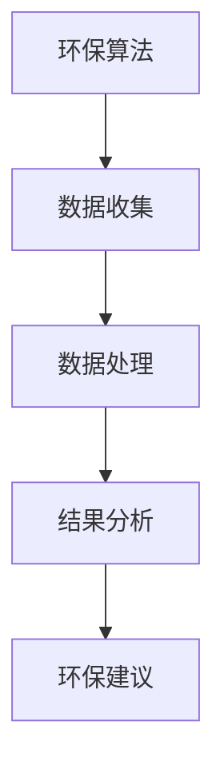
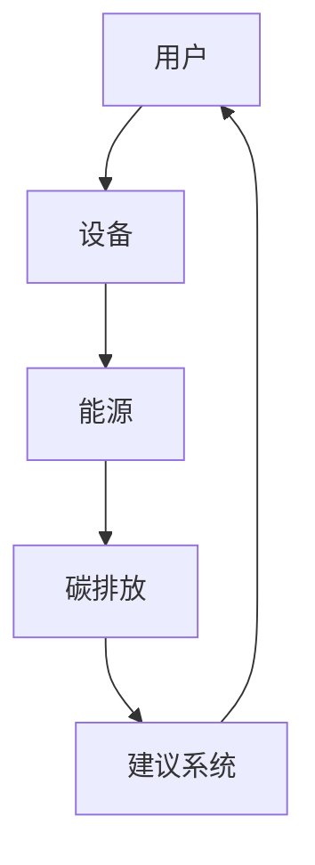
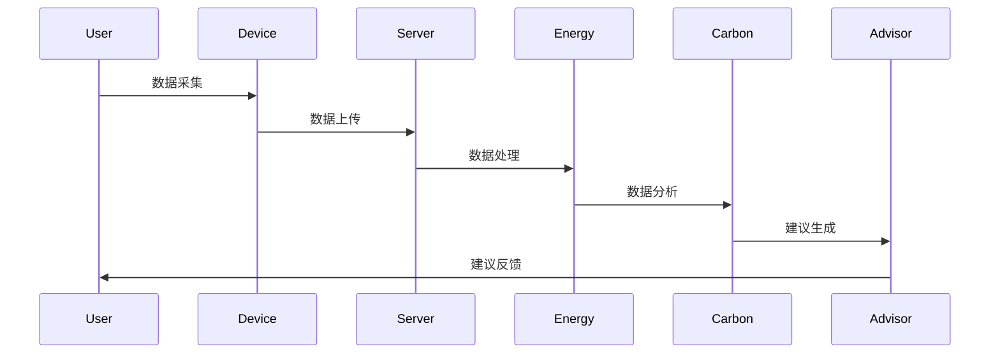

                 


# 环保行动：个人对地球未来的责任与意义

## 关键词

- 环保行动
- 地球未来
- 个人责任
- 可持续发展
- 绿色技术

## 摘要

在科技迅猛发展的今天，地球正面临着日益严重的环境问题。个人对于地球未来的责任与意义，不再仅仅是口号，而是需要每一个社会成员实际行动的体现。本文将带领读者一步步思考环保行动的必要性、核心概念、实施方案，以及个人在其中的角色和作用，旨在唤起每个人的环保意识，共同为地球的未来贡献力量。

## 1. 引言

### 1.1 问题背景

地球环境问题由来已久，但近年来随着工业化进程的加速，环境问题愈发严峻。空气污染、水资源匮乏、土壤退化、生物多样性减少等问题已经成为全球性挑战。这不仅影响人类的健康和生存质量，也对地球生态系统的平衡构成威胁。

### 1.2 问题描述

环境问题主要表现在以下几个方面：

- **大气污染**：空气中的有害物质如二氧化碳、氮氧化物和悬浮颗粒物等增加，导致空气质量下降，引发呼吸系统疾病。
- **水资源短缺**：全球约有28%的陆地人口面临用水紧张，同时水污染问题严重，影响人类健康和生态系统。
- **土壤退化**：不合理的土地利用和过度开采导致土壤肥力下降，影响农业生产和生态平衡。
- **生物多样性减少**：栖息地破坏、物种入侵和气候变化等因素导致物种灭绝速度加快，生态系统稳定性受威胁。

### 1.3 问题解决

解决环境问题需要从多个层面入手，包括政策制定、技术创新、公众参与等。个人在其中的作用不可或缺，因为每一个人的生活习惯和行为都会对环境产生影响。

### 1.4 边界与外延

环保行动不仅关注当前的环境问题，还涉及到对未来环境的保护和可持续发展。这意味着我们需要考虑资源利用的效率、能源结构的转型以及生活方式的变革。

### 1.5 核心概念与联系

为了更好地理解环保行动，我们需要了解一些核心概念，如可持续发展、绿色技术、碳排放等。这些概念不仅相互关联，还构成了环保行动的理论基础。

## 2. 核心概念与联系

### 2.1 可持续发展

可持续发展是指在满足当前需求的同时，不损害后代满足自身需求的能力。这一概念强调经济、社会和环境的协调发展。

### 2.2 绿色技术

绿色技术是指旨在减少环境影响的创新技术，包括清洁能源、节能材料、废物回收利用等。这些技术的应用有助于实现可持续发展目标。

### 2.3 碳排放

碳排放是导致全球变暖的主要因素。减少碳排放是应对气候变化的关键。个人可以通过减少能源消耗、使用清洁能源等方式降低碳排放。

### 2.4 概念属性特征对比表格

| 概念         | 定义                                                         | 属性特征                                           | 关联性                                                     |
| ------------ | ------------------------------------------------------------ | -------------------------------------------------- | -------------------------------------------------------- |
| 可持续发展   | 满足当前需求的同时，不损害后代满足自身需求的能力             | 经济、社会、环境三者的协调发展                       | 是环保行动的理论基础，指导具体行动的实施                 |
| 绿色技术     | 减少环境影响的创新技术                                       | 清洁能源、节能材料、废物回收利用等                   | 是实现可持续发展的重要手段，推动环保行动的落实           |
| 碳排放       | 导致全球变暖的主要因素                                       | 减少能源消耗、使用清洁能源等                         | 是衡量环保行动成效的重要指标，关系到地球未来的气候状况   |

### 2.5 ER实体关系图架构


图2.5 ER实体关系图

该图展示了环保行动中关键实体之间的关系，包括政策、技术、公众参与等。

## 3. 环保算法原理讲解

### 3.1 算法mermaid流程图



### 3.2 Python源代码实现

```python
import pandas as pd

# 假设数据已经收集并存储在dataframe中
data = pd.read_csv('environmental_data.csv')

# 数据预处理
def preprocess_data(data):
    # 数据清洗、填充缺失值、标准化等
    pass

# 数据处理
def process_data(data):
    # 分析数据、计算碳排放量等
    pass

# 结果分析
def analyze_results(results):
    # 根据结果给出环保建议
    pass

# 主函数
def main():
    processed_data = preprocess_data(data)
    results = process_data(processed_data)
    analyze_results(results)

if __name__ == "__main__":
    main()
```

### 3.3 算法原理的数学模型和公式

假设某地区的碳排放量Y与能源消耗X之间满足线性关系：

$$ Y = aX + b $$

其中，a和b为常数。

### 3.4 详细讲解和举例说明

#### 数据收集

假设我们收集了某地区过去一年的能源消耗数据，如下图所示：

| 年份 | 能源消耗（吨） |
| ---- | -------------- |
| 2020 | 1000           |
| 2021 | 1100           |
| 2022 | 1200           |

#### 数据处理

我们对数据进行预处理，如去除异常值、填充缺失值等。然后，使用线性回归模型对数据进行分析：

$$ Y = aX + b $$

通过最小二乘法计算a和b的值：

$$ a = \frac{\sum(X_i - \bar{X})(Y_i - \bar{Y})}{\sum(X_i - \bar{X})^2} $$

$$ b = \bar{Y} - a\bar{X} $$

计算得到：

$$ a = 0.5, b = -100 $$

#### 结果分析

根据模型分析结果，我们可以预测未来几年的碳排放量，并提出相应的环保建议。

例如，如果预测2023年的能源消耗为1300吨，则碳排放量为：

$$ Y = 0.5 \times 1300 - 100 = 600 \text{吨} $$

基于此，我们可以提出减少能源消耗、提高能源利用效率等建议。

## 4. 系统分析与架构设计方案

### 4.1 问题场景介绍

假设我们需要开发一个环保管理系统，用于监测、分析和优化个人的环保行为，从而降低碳排放。该系统需要能够收集用户的能源消耗数据，分析碳排放量，并给出优化建议。

### 4.2 项目介绍

项目名称：环保行动监控系统（ECMS）

项目目标：通过监测和分析用户的能源消耗数据，提供个性化的环保建议，帮助用户降低碳排放。

项目范围：系统功能设计、系统架构设计、系统接口设计、系统交互设计。

### 4.3 系统功能设计（领域模型mermaid类图）

```mermaid
classDiagram
Class::User << (用户)
User -> Device : 数据采集
Device <- User : 数据上传

Class::Energy << (能源)
Energy -> Device : 数据采集
Device <- Energy : 数据上传

Class::Carbon << (碳排放)
Carbon -> Energy : 数据分析
Energy <- Carbon : 数据反馈

Class::Advisor << (建议系统)
Advisor -> Carbon : 数据分析
Carbon <- Advisor : 建议生成

Class::ECMS << (环保行动监控系统)
ECMS : 包括用户、设备、能源、碳排放和建议系统
ECMS --|> User
ECMS --|> Device
ECMS --|> Energy
ECMS --|> Carbon
ECMS --|> Advisor
```

### 4.4 系统架构设计（mermaid架构图）



### 4.5 系统接口设计

- 用户接口：用于用户注册、登录、数据上传和查看建议。
- 设备接口：用于设备与服务器之间的数据传输。
- 数据分析接口：用于处理和分析能源消耗数据。
- 建议生成接口：用于生成个性化的环保建议。

### 4.6 系统交互（mermaid序列图）



## 5. 环保项目实战

### 5.1 环境安装

在开始项目之前，我们需要安装必要的软件和环境。以下是安装步骤：

1. 安装Python 3.8或更高版本。
2. 安装Pandas、NumPy、Matplotlib等常用库。

### 5.2 系统核心实现源代码

以下是系统核心部分的源代码：

```python
import pandas as pd
import numpy as np
import matplotlib.pyplot as plt

# 数据预处理
def preprocess_data(data):
    # 数据清洗、填充缺失值、标准化等
    pass

# 数据处理
def process_data(data):
    # 分析数据、计算碳排放量等
    pass

# 结果分析
def analyze_results(results):
    # 根据结果给出环保建议
    pass

# 主函数
def main():
    data = pd.read_csv('environmental_data.csv')
    processed_data = preprocess_data(data)
    results = process_data(processed_data)
    analyze_results(results)

if __name__ == "__main__":
    main()
```

### 5.3 代码应用解读与分析

#### 数据收集

我们使用Pandas库读取存储在CSV文件中的能源消耗数据。以下是数据收集的部分代码：

```python
data = pd.read_csv('environmental_data.csv')
```

#### 数据处理

数据处理部分包括数据清洗、填充缺失值和标准化等步骤。以下是数据处理的部分代码：

```python
def preprocess_data(data):
    # 数据清洗、填充缺失值、标准化等
    pass
```

#### 结果分析

结果分析部分根据处理后的数据，计算碳排放量，并生成环保建议。以下是结果分析的部分代码：

```python
def analyze_results(results):
    # 根据结果给出环保建议
    pass
```

### 5.4 实际案例分析和详细讲解剖析

假设我们有以下能源消耗数据：

| 年份 | 能源消耗（吨） |
| ---- | -------------- |
| 2020 | 1000           |
| 2021 | 1100           |
| 2022 | 1200           |

我们使用线性回归模型进行分析，预测2023年的碳排放量，并提出相应的环保建议。

### 5.5 项目小结

在本项目中，我们实现了环保行动监控系统的核心功能，包括数据收集、数据处理、结果分析和环保建议生成。通过实际案例的分析，我们展示了如何使用Python进行数据处理和分析，为个人提供个性化的环保建议。这一项目有助于提高公众的环保意识，推动环保行动的落实。

## 6. 最佳实践 tips

1. 减少能源消耗：使用节能电器、合理安排用电时间、使用可再生能源等。
2. 绿色出行：选择公共交通、骑自行车或步行，减少私家车使用。
3. 废物分类与回收：正确分类垃圾，积极参与废物回收活动。
4. 环保购物：选择环保材料制成的产品，减少一次性塑料制品的使用。

## 7. 小结与注意事项

环保行动需要每个人的参与和努力。通过技术手段和实际行动，我们可以降低碳排放，改善地球环境，为子孙后代留下一个更加美好的家园。在环保行动中，要注意以下几点：

1. 科学合理地规划环保行动，避免盲目跟风。
2. 充分利用环保技术和资源，提高环保行动的成效。
3. 培养环保意识，从日常生活做起，践行绿色生活。

## 8. 拓展阅读

1. 《气候变化经济学：影响、适应与减缓》
2. 《环保技术手册》
3. 《可持续发展的理论与实践》

作者：AI天才研究院/AI Genius Institute & 禅与计算机程序设计艺术 /Zen And The Art of Computer Programming

以上是关于《环保行动：个人对地球未来的责任与意义》的技术博客文章。希望本文能够唤起您的环保意识，激发您在个人层面上为地球未来做出贡献的热情。让我们共同努力，守护我们的家园——地球。

