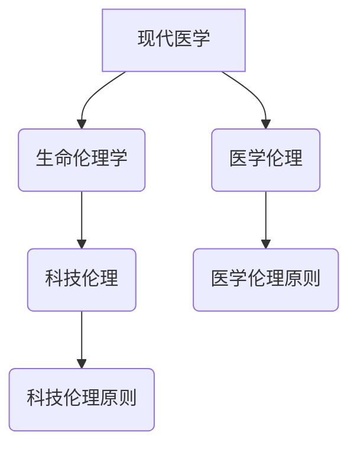

                 

### 现代医学与生命伦理：在科技进步与伦理底线间寻找平衡

#### 关键词：
- 现代医学
- 生命伦理学
- 科技进步
- 伦理底线
- 平衡

#### 摘要：
本文将深入探讨现代医学与生命伦理之间的关系，特别是在科技进步日新月异的背景下，如何在伦理底线与科技发展之间找到平衡点。通过对现代医学与生命伦理的基本概念、科技进步带来的伦理挑战及其解决方案的分析，本文旨在为相关领域提供有价值的见解和实用的指导。

----------------------------------------------------------------

## 第一部分: 现代医学与生命伦理概述

### 第1章: 现代医学与生命伦理的背景介绍

#### 1.1 问题背景

##### 1.1.1 现代医学的快速发展
随着医学技术的不断进步，从细胞学、分子生物学到基因组学，现代医学的发展为人类健康带来了前所未有的机遇。例如，精准医疗、基因治疗、干细胞研究等领域的新突破，为许多以往难以治愈的疾病提供了新的治疗手段。

##### 1.1.2 生命伦理学的兴起与发展
生命伦理学作为一门跨学科的研究领域，起源于20世纪中叶。它关注医学、生物学、环境科学等领域的伦理问题，旨在为科学技术的发展提供道德指导。随着现代医学的快速发展，生命伦理学的重要性日益凸显。

##### 1.1.3 科技进步带来的伦理挑战
科技进步在推动医学发展的同时，也带来了诸多伦理挑战。例如，基因编辑技术的出现引发了关于基因编辑伦理的争议；人工智能在医学诊断和治疗中的应用，则引发了关于数据隐私和算法透明性的担忧。

#### 1.2 问题描述

##### 1.2.1 医学伦理问题的多样性
医学伦理问题涵盖广泛，从医学研究中的知情同意、隐私保护，到基因编辑技术的伦理争议，每一个问题都关乎人类的基本权利和价值观。

##### 1.2.2 生命伦理学的基本原则
生命伦理学的基本原则包括尊重个体自主权、公平性、非歧视、善行与无害原则等。这些原则为医学实践提供了伦理指导。

##### 1.2.3 科技伦理与医学伦理的关系
科技伦理与医学伦理密切相关。科技伦理关注的是科技进步带来的社会和伦理问题，而医学伦理则更专注于医疗实践中的伦理问题。二者相互补充，共同为科技发展提供道德框架。

#### 1.3 问题解决

##### 1.3.1 伦理审查机制的建立与完善
为了应对医学伦理问题，各国建立了伦理审查机制。伦理审查委员会对涉及人类受试者的研究进行评估，确保研究符合伦理要求。

##### 1.3.2 生命伦理学教育的重要性
生命伦理学教育是培养医学专业人士伦理意识的重要途径。通过系统的教育，医生和研究人员能够更好地理解和应对伦理挑战。

##### 1.3.3 科学家与医生的职业责任
科学家和医生在推进科技进步的同时，必须承担起伦理责任。他们应当遵循伦理原则，确保研究与实践符合道德要求。

#### 1.4 边界与外延

##### 1.4.1 医学伦理与国际法的关系
医学伦理与国际法的结合，为跨国医学研究提供了伦理框架。国际法为医学伦理提供了法律保障，同时约束了医学研究的行为。

##### 1.4.2 生命伦理学的跨学科研究
生命伦理学不仅与医学相关，还涉及到社会学、法学、哲学等多个学科。跨学科研究有助于更全面地理解和解决伦理问题。

##### 1.4.3 现代医学与生命伦理的未来趋势
随着科技进步，现代医学与生命伦理将继续面临新的挑战。如何平衡科技发展与伦理底线，将是一个长期的研究课题。

### 第2章: 核心概念与联系

#### 2.1 核心概念原理

##### 2.1.1 现代医学的定义
现代医学是指基于科学研究和证据的医学实践，旨在通过诊断、治疗和预防疾病来维护和促进人类健康。

##### 2.1.2 生命伦理学的定义
生命伦理学是研究生物医学、生物技术和环境科学等领域伦理问题的学科，旨在为科技发展提供道德指导。

##### 2.1.3 生命伦理学的基本原则
生命伦理学的基本原则包括尊重个体自主权、公平性、非歧视、善行与无害原则等。

#### 2.2 概念属性特征对比

##### 2.2.1 医学伦理与生命伦理的对比
医学伦理主要关注医疗实践中的伦理问题，而生命伦理学则更广泛地涉及生物医学、生物技术和环境科学等领域的伦理问题。

##### 2.2.2 科技伦理与医学伦理的对比
科技伦理关注科技进步带来的社会和伦理问题，而医学伦理则更专注于医疗实践中的伦理问题。

#### 2.3 ER实体关系图架构

## 第二部分: 科技进步与伦理底线

### 第3章: 科技进步对医学伦理的影响

#### 3.1 人工智能在医学中的应用

##### 3.1.1 人工智能的定义与特点
人工智能是指通过计算机程序实现智能行为的技术。人工智能的特点包括自主学习、自主决策、高效处理大量数据等。

##### 3.1.2 人工智能在医学诊断中的应用
人工智能在医学诊断中的应用包括图像分析、病理分析、症状预测等。例如，AI系统可以通过分析医疗图像，辅助医生进行早期疾病诊断。

##### 3.1.3 人工智能在医学治疗中的应用
人工智能在医学治疗中的应用包括个性化治疗方案设计、药物研发等。通过分析大量临床数据，AI系统可以辅助医生制定更精准的治疗方案。

#### 3.2 基因编辑技术的伦理问题

##### 3.2.1 基因编辑技术的定义
基因编辑技术是指通过修改生物体的基因序列，实现对遗传信息的精确编辑。

##### 3.2.2 基因编辑技术的伦理争议
基因编辑技术的伦理争议包括基因编辑的安全性问题、基因编辑的伦理原则、基因编辑的社会影响等。

##### 3.2.3 基因编辑技术的监管与伦理审查
各国政府和国际组织对基因编辑技术进行了严格的监管与伦理审查，以确保技术的安全性和伦理性。

#### 3.3 克隆技术的伦理考量

##### 3.3.1 克隆技术的定义与进展
克隆技术是指通过体细胞核移植等方法，复制生物体的遗传信息。

##### 3.3.2 克隆技术的伦理问题
克隆技术的伦理问题包括克隆人的道德地位、克隆技术的潜在风险等。

##### 3.3.3 克隆技术的社会影响
克隆技术的社会影响涉及伦理、法律、经济等多个方面，需要全面评估。

### 第4章: 寻找科技进步与伦理底线的平衡

#### 4.1 伦理审查机制的重要性

##### 4.1.1 伦理审查的定义与目的
伦理审查是指对医学研究和医疗实践进行伦理评估，以确保研究符合伦理要求。

##### 4.1.2 伦理审查的程序与流程
伦理审查通常包括伦理委员会的成立、伦理审查的申请与审核、伦理审查的决定与执行等环节。

##### 4.1.3 伦理审查的国际经验与借鉴
各国和国际组织在伦理审查方面积累了丰富的经验，值得借鉴和推广。

#### 4.2 生命伦理学教育

##### 4.2.1 生命伦理学教育的现状
生命伦理学教育在各国医学教育体系中占据重要地位，但其范围和深度仍有待提升。

##### 4.2.2 生命伦理学教育的重要性
生命伦理学教育对于培养医学专业人才的伦理意识和判断力至关重要。

##### 4.2.3 生命伦理学教育的内容与方法
生命伦理学教育的内容涵盖伦理理论、案例分析、模拟训练等。教育方法包括讲座、研讨会、实践项目等。

#### 4.3 科学家与医生的职业责任

##### 4.3.1 职业道德的重要性
职业道德是科学家和医生在职业活动中遵循的行为准则。

##### 4.3.2 医学伦理与医生职业责任
医生在提供医疗服务时应遵循医学伦理原则，如尊重患者权利、确保患者安全等。

##### 4.3.3 科学家在生命伦理学中的角色与责任
科学家在推进科技进步的同时，也应承担起伦理责任，确保研究符合伦理要求。

## 第三部分: 平衡科技与伦理的最佳实践

### 第5章: 成功案例与经验分享

#### 5.1 案例一：基因编辑技术的伦理监管

##### 5.1.1 案例背景
2018年，中国科学家贺建奎宣布成功使用基因编辑技术创造世界首例基因编辑婴儿。这一事件引发了全球范围内的伦理争议。

##### 5.1.2 伦理争议
基因编辑技术的应用涉及伦理问题，包括基因编辑的安全性问题、基因编辑的伦理原则等。

##### 5.1.3 解决方案与效果
国际社会对此事件进行了严格的伦理审查和调查，提出了严格的监管措施，以防止类似事件再次发生。

#### 5.2 案例二：人工智能在医学领域的应用

##### 5.2.1 案例背景
人工智能在医学领域的应用已经取得了显著成果，但仍面临伦理挑战，如数据隐私、算法透明性等。

##### 5.2.2 应用场景
人工智能在医学诊断、个性化治疗、药物研发等领域有着广泛的应用。

##### 5.2.3 伦理考量与解决方案
通过建立伦理审查机制、加强数据隐私保护、提高算法透明度等措施，可以促进人工智能在医学领域的健康发展。

### 第6章: 拓展阅读与思考

#### 6.1 新兴技术与伦理问题的前瞻性探讨

##### 6.1.1 脑机接口技术的伦理挑战
脑机接口技术（Brain-Machine Interface, BMI）的发展引发了关于隐私、自主权等伦理问题的讨论。

##### 6.1.2 基因编辑技术的未来趋势
随着基因编辑技术的不断进步，未来可能会出现更多关于伦理问题的挑战，如人类基因设计、基因编辑技术的全球监管等。

##### 6.1.3 人工智能在医学中的潜在风险
人工智能在医学中的广泛应用可能带来数据泄露、算法偏见等潜在风险。

#### 6.2 生命伦理学的跨学科融合

##### 6.2.1 社会科学与生命伦理学
社会科学为生命伦理学提供了丰富的理论资源和实践经验，有助于更好地理解和解决伦理问题。

##### 6.2.2 法学与生命伦理学
法律为生命伦理学提供了重要的规范和约束，同时生命伦理学也为法律提供了伦理基础。

##### 6.2.3 生命伦理学与其他学科的关系
生命伦理学与其他学科的融合有助于更全面地解决伦理问题，如生物学、医学、计算机科学等。

### 第7章: 小结与展望

#### 7.1 本书内容的总结

##### 7.1.1 核心概念的理解与应用
本文深入探讨了现代医学与生命伦理的基本概念，并分析了科技进步带来的伦理挑战及其解决方案。

##### 7.1.2 科技进步与伦理底线的关系
科技进步与伦理底线之间存在密切的关系，如何在两者之间找到平衡是一个重要课题。

##### 7.1.3 寻求平衡的最佳实践
本文通过成功案例与经验分享，提出了一系列寻求科技进步与伦理底线平衡的最佳实践。

#### 7.2 现代医学与生命伦理的未来发展

##### 7.2.1 科技发展的前景
随着科技的不断进步，现代医学与生命伦理将继续面临新的挑战和机遇。

##### 7.2.2 伦理底线的演变
随着社会和文化背景的变化，伦理底线也将不断演变，需要持续关注和反思。

##### 7.2.3 平衡科技的策略
通过加强伦理审查、推进生命伦理学教育、强化科学家与医生的职业责任等措施，可以更好地平衡科技与伦理底线。

----------------------------------------------------------------

**作者：AI天才研究院/AI Genius Institute & 禅与计算机程序设计艺术 /Zen And The Art of Computer Programming**

