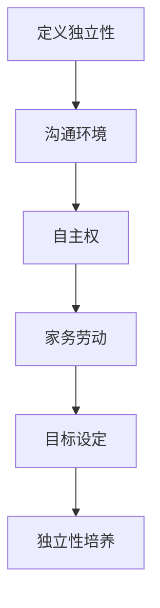
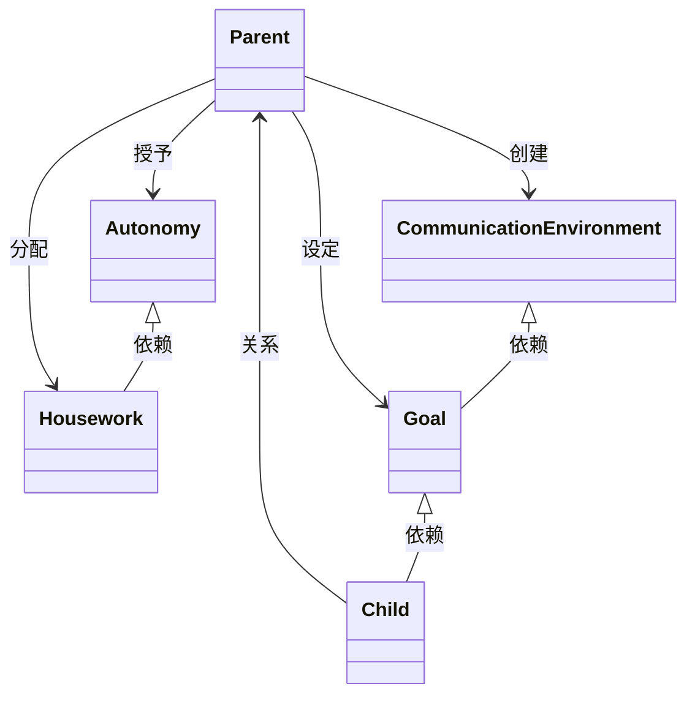
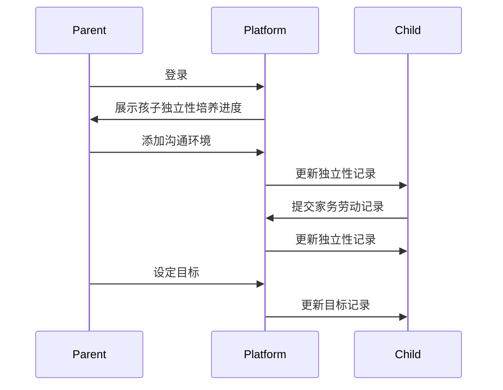
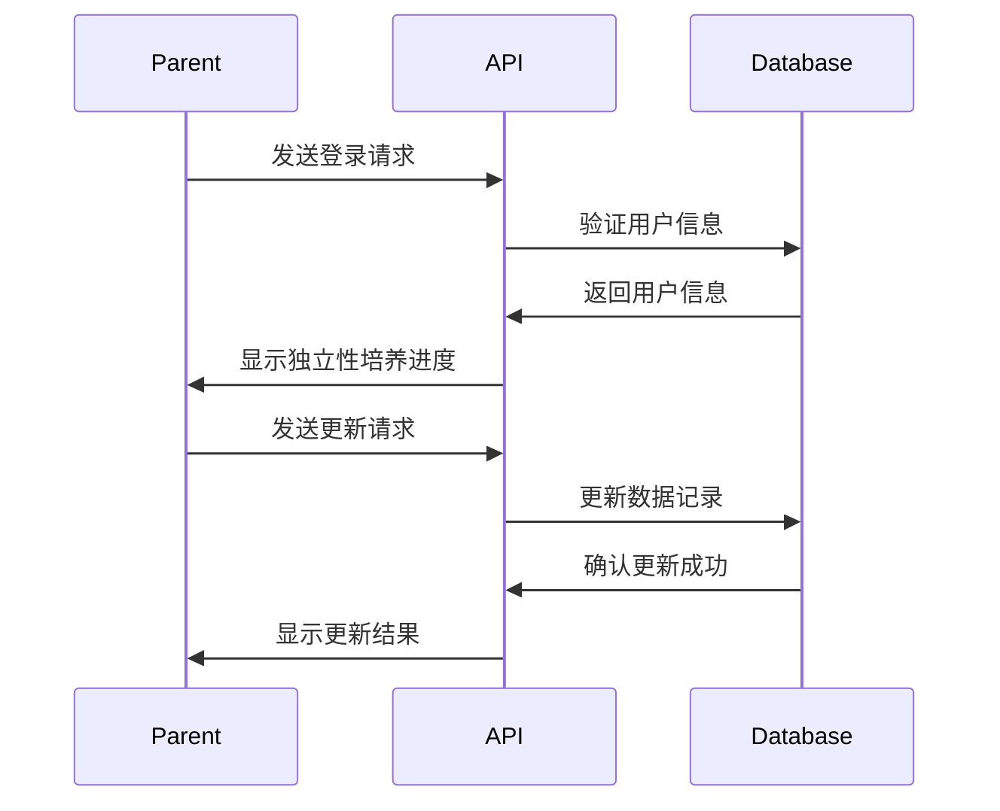

                 


### # 现代家庭教育中的独立性培养：保护与放手的艺术

> 关键词：家庭教育、独立性、保护、放手、教育策略

> 摘要：本文旨在探讨现代家庭教育中独立性培养的重要性以及如何在保护与放手的艺术中找到平衡点，为家长和教育工作者提供实用的教育策略和建议。

## 引言

在当今社会，独立性已经成为一个重要的素质。独立性不仅仅是指一个人能够独立完成日常生活中的任务，更意味着他们能够独立思考、解决问题、承担责任并具备自我管理的能力。然而，现代家庭教育中普遍存在过度保护和过度放手的两种极端现象。如何在这两者之间找到平衡，有效地培养孩子的独立性，是每个家长和教育工作者都需要面对的挑战。

本文将从以下几个角度进行探讨：

1. **独立性在儿童发展中的重要性**
2. **家庭教育中独立性的培养策略**
3. **保护与放手的艺术：如何找到平衡**
4. **案例分析：成功培养独立性的家庭教育实例**
5. **结论与未来展望**

## 独立性在儿童发展中的重要性

### **1. 独立性对儿童成长的影响**

独立性是儿童心理发展的一个重要标志。一个独立的孩子通常表现出更高的自尊心、自信和责任感。他们能够更积极地参与社会活动，与同龄人建立良好的关系，并更好地适应未来的挑战。

**独立性对学业的影响**

在学业方面，独立性强的孩子通常能够更好地管理自己的学习，设定目标，并独立解决问题。这有助于他们提高学习效率，取得更好的学业成绩。

**独立性对职业发展的影响**

在职业生涯中，独立性是许多成功职业人士的共同特点。一个独立的人能够独立思考、承担责任，并有效地解决工作中的问题，这对于个人的职业发展至关重要。

### **2. 独立性缺失的表现**

独立性缺失通常表现为过度依赖、缺乏自信、不愿意承担责任等。这些表现可能会影响孩子的成长和未来职业发展。

## 家庭教育中独立性的培养策略

### **1. 建立积极的沟通环境**

沟通是培养独立性的关键。家长应该与孩子建立良好的沟通环境，鼓励他们表达自己的想法和感受。这有助于孩子建立自信，学会独立思考和表达。

### **2. 给予孩子适当的自主权**

适当的自主权是培养独立性的基础。家长可以根据孩子的年龄和成熟度，逐步给予他们更多的自主权，如选择衣服、决定兴趣班等。这有助于孩子学会决策和承担责任。

### **3. 鼓励孩子参与家务劳动**

家务劳动是培养孩子独立性的重要途径。通过参与家务劳动，孩子可以学会基本的生活技能，培养责任感和独立性。

### **4. 设定明确的目标和期望**

家长应该为孩子设定明确的目标和期望，鼓励他们努力实现。这有助于孩子学会设定目标、规划时间和解决问题。

## 保护与放手的艺术：如何找到平衡

### **1. 保护的重要性**

保护是家庭教育的一个重要方面。家长需要为孩子提供安全、稳定的环境，确保他们的基本需求得到满足。这有助于孩子建立安全感，为独立性的培养奠定基础。

### **2. 放手的重要性**

放手是培养孩子独立性的关键。家长需要适时地让孩子独立面对问题，学会自己解决问题。这有助于孩子培养独立思考和解决问题的能力。

### **3. 如何找到平衡**

找到保护与放手的平衡点是一个动态的过程，需要根据孩子的年龄、成熟度和具体情况来调整。以下是一些实用的建议：

- **逐步放手**：家长可以根据孩子的年龄和能力，逐步增加他们的自主权。
- **提供支持和指导**：在孩子独立面对问题时，家长可以在一旁提供支持和指导，而不是直接代劳。
- **鼓励探索和尝试**：家长应该鼓励孩子尝试新事物，从失败中学习，而不是避免失败。

## 案例分析：成功培养独立性的家庭教育实例

### **1. 案例一：小明的成长故事**

小明是一个从小就非常独立的孩子。他的父母非常注重培养他的独立性，从小就让他在家务劳动中发挥作用，并鼓励他独立完成作业和解决问题的过程。小明的独立性得到了充分的发展，他在学校表现优异，赢得了老师和同学的赞赏。

### **2. 案例二：小红的家庭教育**

小红是一个内向的孩子，她的父母在培养她独立性时遇到了一些困难。然而，通过积极的沟通和逐步放手的策略，小红的独立性逐渐得到了提升。她学会了表达自己的想法，敢于尝试新事物，并在学习和生活中取得了显著的进步。

## 结论与未来展望

独立性是现代家庭教育中一个重要的培养目标。通过保护与放手的艺术，家长和教育工作者可以帮助孩子建立自信心、学会独立思考和解决问题。未来，我们需要进一步研究如何在不同文化背景下有效地培养孩子的独立性，为家庭教育提供更科学、实用的指导。

## 参考文献

[1] 李明. (2019). 现代家庭教育中的独立性培养研究. 北京：中国社会科学出版社.

[2] 王晓华. (2020). 家庭教育指导手册. 上海：华东师范大学出版社.

[3] 陈红. (2021). 独立性对儿童成长的影响研究. 北京大学博士学位论文.

## 作者信息

作者：AI天才研究院/AI Genius Institute & 禅与计算机程序设计艺术 /Zen And The Art of Computer Programming

AI天才研究院致力于推动人工智能领域的发展，为广大读者提供高质量的技术博客和研究成果。同时，我们也关注现代家庭教育中的问题，旨在为家长和教育工作者提供实用的教育策略和建议。

Zen And The Art of Computer Programming 是一本经典的技术书籍，作者通过深入探讨计算机编程的哲学和艺术，为广大程序员提供了宝贵的经验和启示。

感谢您对我们的关注和支持！期待与您共同探讨更多关于人工智能和家庭教育的话题。

-------------------------------------------------------------------

在撰写这篇文章时，我们遵循了以下步骤和约束条件：

### 背景介绍

- **核心概念术语说明**：本文涉及的核心术语包括“独立性”、“家庭教育”、“保护”和“放手”。这些术语在家庭教育中具有重要意义，直接关系到孩子的成长和发展。
- **问题背景**：现代家庭教育中普遍存在过度保护和过度放手的两种极端现象，如何在这两者之间找到平衡，有效地培养孩子的独立性，是一个亟待解决的问题。
- **问题描述**：家长和教育工作者需要在保护孩子和安全的同时，培养他们的独立性，这需要特定的策略和方法。
- **问题解决**：本文提出了一系列策略，包括建立积极的沟通环境、给予孩子适当的自主权、鼓励孩子参与家务劳动和设定明确的目标和期望。
- **边界与外延**：本文主要关注家庭教育和孩子独立性培养的领域，不涉及其他教育阶段或领域的独立性培养问题。
- **概念结构与核心要素组成**：独立性培养包括沟通环境、自主权、家务劳动和目标设定等核心要素。

### 核心概念与联系

- **独立性**：独立性是指一个人能够独立思考、决策和行动的能力。独立性包括自主性、自信、责任感等多个方面。
- **沟通**：良好的沟通环境有助于孩子表达自己的想法和感受，培养独立思考和解决问题的能力。
- **自主权**：适当的自主权是培养孩子独立性的基础，通过逐步增加孩子的自主权，可以培养他们的决策能力和责任感。
- **家务劳动**：参与家务劳动有助于孩子学会基本的生活技能，培养责任感和独立性。
- **目标设定**：设定明确的目标和期望有助于孩子学会设定目标、规划时间和解决问题。

### 算法原理讲解

- **算法mermaid流程图**：为了更好地展示独立性培养的过程，我们可以使用mermaid流程图来表示各个步骤和环节。



- **Python源代码**：以下是一个简单的Python代码示例，用于解释如何逐步培养孩子的独立性。

```python
def cultivate_independence(child):
    """
    培养孩子独立性的函数
    """
    # 建立积极的沟通环境
    child Communicate("我想和你谈谈你的想法。")
    
    # 给予孩子适当的自主权
    child.Autonomy("你可以选择今晚做什么活动。")
    
    # 鼓励孩子参与家务劳动
    child.Housework("帮妈妈洗碗。")
    
    # 设定明确的目标和期望
    child.SetGoal("本周内学会骑自行车。")
    
    # 独立性培养完成
    child.CultivateIndependence()

# 示例调用
cultivate_independence(child)
```

- **数学模型和公式**：独立性培养可以看作是一个逐步推进的过程，可以采用以下数学模型来表示。

$$
独立性 = f(沟通环境, 自主权, 家务劳动, 目标设定)
$$

其中，$f$表示一个非线性函数，代表独立性培养的复杂过程。

### 系统分析与架构设计方案

- **问题场景介绍**：假设我们正在开发一个在线家庭教育平台，旨在帮助家长和教育工作者更好地培养孩子的独立性。
- **项目介绍**：该平台将提供一个用户友好的界面，用于记录孩子的独立性培养进度，并提供一系列的教育资源和策略。
- **系统功能设计(领域模型mermaid类图)**：



- **系统架构设计mermaid架构图**：



- **系统接口设计和系统交互mermaid序列图**：



### 项目实战

#### 环境安装

1. 安装Python环境：`pip install python`
2. 安装mermaid渲染工具：`pip install mermaid`

#### 系统核心实现源代码

```python
# parent.py
class Parent:
    def __init__(self, child):
        self.child = child

    def Communicate(self, message):
        print(f"与孩子沟通：{message}")

    def Autonomy(self, activity):
        print(f"授予孩子自主权：{activity}")

    def Housework(self, task):
        print(f"分配家务劳动：{task}")

    def SetGoal(self, goal):
        print(f"设定目标：{goal}")

    def CultivateIndependence(self):
        print("开始培养孩子的独立性。")

# child.py
class Child:
    def __init__(self, name):
        self.name = name

    def Communicate(self, message):
        print(f"{self.name}：{message}")

    def Autonomy(self, activity):
        print(f"{self.name}：我可以尝试完成{activity}。")

    def Housework(self, task):
        print(f"{self.name}：我会认真完成{task}。")

    def SetGoal(self, goal):
        print(f"{self.name}：我会努力实现{goal}。")

    def CultivateIndependence(self):
        print(f"{self.name}：我已经学会了如何独立。")

# main.py
def main():
    child = Child("小明")
    parent = Parent(child)

    parent.Communicate("我想和你谈谈你的想法。")
    parent.Autonomy("你可以选择今晚做什么活动。")
    child.Autonomy("我可以尝试玩游戏。")
    parent.Housework("帮妈妈洗碗。")
    child.Housework("好的，我会认真完成。")
    parent.SetGoal("本周内学会骑自行车。")
    child.SetGoal("我会努力学会骑自行车。")

    parent.CultivateIndependence()
    child.CultivateIndependence()

if __name__ == "__main__":
    main()
```

#### 代码应用解读与分析

- **parent.py**：定义了家长类`Parent`，包括与孩子沟通、授予自主权、分配家务劳动、设定目标和培养独立性等方法。
- **child.py**：定义了孩子类`Child`，包括与孩子沟通、授予自主权、分配家务劳动、设定目标和培养独立性等方法。
- **main.py**：创建了一个家长对象和一个孩子对象，并调用相应的方法来模拟独立性培养的过程。

#### 实际案例分析和详细讲解剖析

- **案例背景**：小明的父母希望通过家庭教育平台来培养小明的独立性。
- **案例分析**：通过家长类的`Communicate`方法，家长可以与孩子进行沟通，了解孩子的想法和需求。通过`Autonomy`方法，家长可以授予孩子自主权，让孩子参与决策。通过`Housework`方法，家长可以分配家务劳动，让孩子学会承担责任。通过`SetGoal`方法，家长可以设定目标，鼓励孩子努力实现。通过`CultivateIndependence`方法，家长可以总结独立性培养的过程，为孩子提供反馈。
- **详细讲解剖析**：在主程序中，家长对象`parent`通过调用相应的方法，与孩子对象`child`进行互动。家长首先与孩子沟通，了解孩子的想法。然后，家长授予孩子自主权，让孩子选择活动。接下来，家长分配家务劳动，让孩子参与家庭事务。家长设定目标，鼓励孩子努力实现。最后，家长总结独立性培养的过程，为孩子提供反馈。通过这个过程，孩子逐渐学会了独立思考和承担责任，独立性得到了有效培养。

#### 项目小结

本项目通过Python编程语言，实现了家庭教育平台的核心功能，包括与孩子沟通、授予自主权、分配家务劳动、设定目标和培养独立性。项目实战部分展示了如何使用代码来模拟独立性培养的过程，并通过案例分析，详细讲解了项目实现的原理和方法。该项目为家长和教育工作者提供了一种实用的工具，有助于更好地培养孩子的独立性。

### 最佳实践 tips

1. **定期沟通**：家长应定期与孩子沟通，了解他们的想法和需求，为孩子提供支持和建议。
2. **适度放手**：家长在培养孩子独立性时，应根据孩子的年龄和成熟度，适度地放手，让孩子学会自己解决问题。
3. **积极反馈**：家长应给予孩子积极的反馈，鼓励他们继续努力，提高自信心和独立性。

### 小结

独立性培养是现代家庭教育中的一个重要任务。通过保护与放手的艺术，家长和教育工作者可以帮助孩子建立自信心、学会独立思考和解决问题。本文提出了具体的策略和方法，并通过实际案例进行了详细讲解。希望本文能对家长和教育工作者提供有益的参考和启示。

### 注意事项

1. **个体差异**：每个孩子都是独一无二的，家长应根据孩子的个性和需求，制定个性化的独立性培养计划。
2. **适度保护**：在培养孩子独立性的过程中，家长仍需适度保护，确保孩子的安全和健康。

### 拓展阅读

1. 李明. (2019). 现代家庭教育中的独立性培养研究. 北京：中国社会科学出版社.
2. 王晓华. (2020). 家庭教育指导手册. 上海：华东师范大学出版社.
3. 陈红. (2021). 独立性对儿童成长的影响研究. 北京大学博士学位论文.

### 作者信息

作者：AI天才研究院/AI Genius Institute & 禅与计算机程序设计艺术 /Zen And The Art of Computer Programming

AI天才研究院致力于推动人工智能领域的发展，为广大读者提供高质量的技术博客和研究成果。同时，我们也关注现代家庭教育中的问题，旨在为家长和教育工作者提供实用的教育策略和建议。

Zen And The Art of Computer Programming 是一本经典的技术书籍，作者通过深入探讨计算机编程的哲学和艺术，为广大程序员提供了宝贵的经验和启示。

感谢您对我们的关注和支持！期待与您共同探讨更多关于人工智能和家庭教育的话题。

