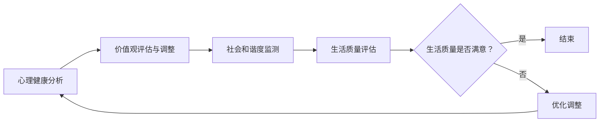
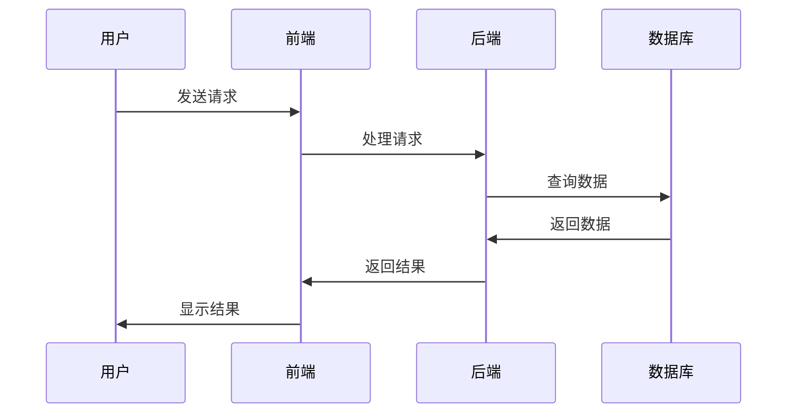
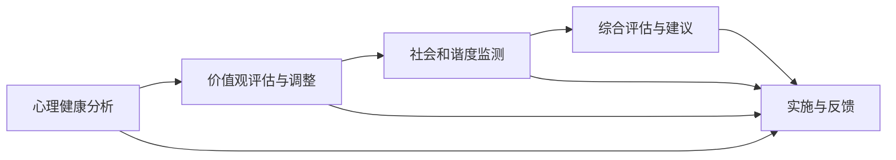
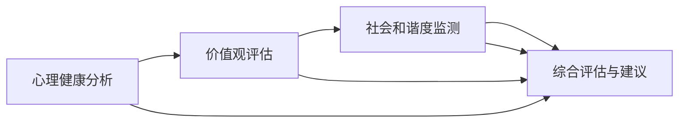

                 

# 现代性与意义危机：重建生活价值观的探索

> 关键词：现代性、意义危机、生活价值观、心理健康、社会和谐

> 摘要：随着现代性观念的广泛传播，人类社会经历了巨大变革，然而，这种变革并非完全是正面的，现代性也带来了一系列问题和挑战。本文旨在探讨现代性危机所带来的意义危机，并深入分析重建生活价值观的必要性。通过从哲学、心理学、社会学等多个角度进行探讨，本文提出了适应现代社会的新的生活观念，为个体和社会提供解决路径。

## 第一部分：背景介绍

### 1.1 问题背景

#### 1.1.1 现代性危机

现代性是一个复杂的观念，它涵盖了科学、技术、经济、政治、文化等多个方面。自20世纪以来，现代性观念在全球范围内广泛传播，带来了许多积极的变化，如科技进步、经济增长、政治民主等。然而，现代性的普及也引发了一系列问题和挑战。

首先，现代性带来了个体焦虑和压力。现代社会的高节奏生活、激烈的竞争和不确定性使得个体面临巨大的压力和焦虑。人们为了追求更高的生活水平、更好的工作机会，不断奋斗，但往往忽略了自身的心理健康。

其次，现代性导致了价值观念的冲突。随着全球化的进程，不同文化、不同价值观相互碰撞，使得人们难以形成一致的生活观念。这种价值观念的冲突加剧了社会的分裂和个体内心的困惑。

最后，现代性也带来了信仰危机。传统宗教信仰的式微，使得人们失去了精神寄托和道德准则。在缺乏信仰的情况下，人们更容易感到迷茫和无助。

#### 1.1.2 重建生活价值观的必要性

面对现代性带来的意义危机，重建生活价值观变得尤为重要。重建生活价值观不仅关乎个人的心理健康和幸福感，也关乎社会的和谐与进步。

首先，重建生活价值观有助于减轻个体焦虑和压力。通过树立正确的生活观念，个体可以更好地应对生活中的挑战，保持心理健康。

其次，重建生活价值观有助于解决价值观念冲突。在多元价值观并存的社会中，通过重建生活价值观，人们可以找到共同的生活目标和意义，减少冲突。

最后，重建生活价值观有助于重建信仰。通过探索新的精神世界，人们可以找到新的信仰，从而获得精神寄托和道德准则。

### 1.2 问题描述

现代性危机主要表现为以下几个方面：

1. **个体焦虑和压力**：现代社会的高节奏生活、激烈的竞争和不确定性使得个体面临巨大的压力和焦虑。
2. **价值观念冲突**：多元化的价值观念并存，导致人们难以形成一致的生活观念。
3. **信仰危机**：传统宗教信仰的式微，使得人们失去了精神寄托和道德准则。

### 1.3 问题解决

重建生活价值观的探索旨在解决上述问题。通过深入研究和实践，我们可以找到适应现代社会的新的生活观念，帮助个体应对焦虑和压力，解决价值观念冲突，重建信仰。

首先，我们可以从心理学角度出发，通过心理测评、心理咨询等方法，帮助个体了解自己的心理健康状况，并提供相应的心理支持和治疗。

其次，我们可以从社会学角度出发，通过社区活动、文化教育等方式，促进不同价值观之间的交流和融合，减少价值观念冲突。

最后，我们可以从哲学和宗教角度出发，通过探讨新的精神世界，为人们提供新的信仰和道德准则。

### 1.4 边界与外延

重建生活价值观不仅涉及个人的心理健康，还涉及到社会的整体和谐。因此，本文将探讨如何从个体和社会两个层面进行价值观的重建。

### 1.5 概念结构与核心要素组成

重建生活价值观的核心概念包括：

1. **价值观**：人们对生活目标和意义的认知。
2. **心理健康**：个体的心理状态和情绪调节能力。
3. **社会和谐**：社会的稳定和整体幸福感。

## 第二部分：核心概念与联系

### 2.1 核心概念原理

#### 2.1.1 价值观

价值观是人们对生活目标和意义的认知，是指导个体行为和决策的根本原则。价值观的形成受到多种因素的影响，包括文化、教育、家庭背景等。一个明确的价值观可以帮助个体在面对困难和选择时保持坚定的信念。

#### 2.1.2 心理健康

心理健康是指个体的心理状态和情绪调节能力。一个心理健康的人能够有效地应对生活中的挑战，保持积极向上的心态。心理健康与价值观密切相关，一个积极的价值观有助于个体保持心理健康。

#### 2.1.3 社会和谐

社会和谐是指社会的稳定和整体幸福感。一个和谐的社会能够为个体提供良好的生活环境和发展机会。社会和谐与价值观同样密切相关，一个共同认可和遵循的价值观有助于社会的稳定和发展。

### 2.2 概念属性特征对比表格

| 概念       | 定义                                                         | 特征                                                         |
| ---------- | ------------------------------------------------------------ | ------------------------------------------------------------ |
| 价值观     | 人们对生活目标和意义的认知                                     | 指导个体行为和决策的根本原则，受多种因素影响               |
| 心理健康   | 个体的心理状态和情绪调节能力                                     | 能有效应对生活中的挑战，保持积极向上的心态                   |
| 社会和谐   | 社会的稳定和整体幸福感                                       | 为个体提供良好的生活环境和发展机会，实现社会稳定和整体幸福感 |

### 2.3 ER实体关系图架构

```mermaid
erDiagram
  ValueConcept ||--|{心理健康} : has
  ValueConcept ||--|{社会和谐} : has
  心理健康     ||--|{个体} : has
  社会和谐     ||--|{社会} : has
```

## 第三部分：算法原理讲解

### 3.1 算法原理概述

重建生活价值观的过程可以看作是一个动态的算法过程，涉及个体心理状态的分析、价值观的评估和调整，以及社会和谐度的监测。以下将详细阐述这一过程。

### 3.2 算法原理详细讲解

#### 3.2.1 心理健康分析

心理健康分析是重建生活价值观的第一步。通过心理测评、问卷调查等方法，收集个体的心理健康数据。这些数据包括情绪状态、压力水平、心理健康状况等。通过对这些数据的分析，可以了解个体的心理健康状况，并发现潜在的心理问题。

#### 3.2.2 价值观评估与调整

在了解个体的心理健康状况后，需要对个体的价值观进行评估和调整。价值观评估可以通过访谈、问卷等方式进行。通过评估，可以了解个体的核心价值观、生活目标等。如果发现个体的价值观存在偏差或不符合心理健康的要求，则需要进行调整。价值观调整可以通过心理治疗、教育引导等方式进行。

#### 3.2.3 社会和谐度监测

社会和谐度监测是重建生活价值观的另一个重要方面。社会和谐度可以通过社会调查、社会指标分析等方法进行监测。通过监测，可以了解社会的整体和谐状况，以及个体在社会中的角色和地位。如果发现社会存在不和谐因素，需要及时进行调整。

### 3.3 算法原理举例说明

假设我们有一个个体A，他的心理健康状况良好，但价值观存在偏差。通过心理健康分析和价值观评估，我们发现个体A的核心价值观是追求物质财富，而忽略了心理健康和人际关系。针对这种情况，我们可以采取以下措施：

1. **心理健康辅导**：为个体A提供心理健康辅导，帮助他认识到心理健康的重要性，学会平衡物质追求和心理健康。

2. **价值观调整**：通过教育引导，帮助个体A树立正确的价值观，如注重心理健康、人际关系等。

3. **社会和谐度监测**：监测个体A在社会中的角色和地位，发现和解决可能存在的矛盾和问题，促进社会和谐。

### 3.4 数学模型与公式

在重建生活价值观的过程中，我们可以使用一些数学模型和公式来描述和解释心理健康、价值观和社会和谐之间的关系。

假设心理健康可以用一个变量P表示，价值观可以用一个变量V表示，社会和谐度可以用一个变量H表示。它们之间的关系可以表示为以下公式：

$$ P \times V \times H = 生活质量 $$

其中，生活质量是心理健康、价值观和社会和谐度的综合体现。

### 3.5 算法流程图



## 第四部分：系统分析与架构设计

### 4.1 问题场景介绍

在现代社会中，人们面临着越来越多的心理健康问题，如焦虑、抑郁等。同时，价值观念的冲突和社会的不和谐也给人们带来了巨大的压力。为了解决这些问题，需要建立一个系统，帮助人们重建生活价值观，提高生活质量。

### 4.2 项目介绍

本项目旨在设计并实现一个重建生活价值观的系统，通过心理健康分析、价值观评估与调整、社会和谐度监测等功能，帮助用户重建生活价值观，提高生活质量。

### 4.3 系统功能设计

1. **心理健康分析**：通过心理测评、问卷调查等方式，收集用户的心理健康数据，并进行分析，为用户提供心理健康报告。

2. **价值观评估与调整**：通过访谈、问卷等方式，评估用户的价值观，并根据评估结果，为用户提供价值观调整建议。

3. **社会和谐度监测**：通过社会调查、社会指标分析等方式，监测社会的和谐度，为用户提供社会和谐报告。

4. **生活质量评估**：根据用户的心理健康状况、价值观和社会和谐度，综合评估用户的生活质量，为用户提供生活建议。

### 4.4 系统架构设计

1. **前端架构**：使用React框架搭建，提供用户界面和交互功能。

2. **后端架构**：使用Spring Boot框架搭建，提供数据存储、数据处理等功能。

3. **数据库设计**：使用MySQL数据库存储用户数据、测评结果、社会指标等。

### 4.5 系统接口设计和系统交互



## 第五部分：项目实战

### 5.1 环境安装

1. **前端环境安装**：安装Node.js和npm，并使用npm安装React和React Router等依赖库。

2. **后端环境安装**：安装Java和Maven，并使用Maven安装Spring Boot和MySQL等依赖库。

3. **数据库环境安装**：安装MySQL数据库，并创建相应的数据库和表。

### 5.2 系统核心实现

1. **心理健康分析**：使用问卷调查和心理测评工具收集用户心理健康数据，并使用Python进行数据处理和分析。

2. **价值观评估与调整**：使用访谈和问卷工具收集用户价值观数据，并使用Python进行评估和调整。

3. **社会和谐度监测**：使用社会调查和社会指标分析工具收集社会和谐度数据，并使用Python进行监测。

4. **生活质量评估**：根据心理健康、价值观和社会和谐度的综合评估结果，为用户提供生活建议。

### 5.3 代码应用解读与分析

在项目实战中，我们将使用Python和Java等编程语言来实现系统的核心功能。以下是代码应用解读与分析：

1. **心理健康分析**：使用Python编写数据分析脚本，对用户心理健康数据进行分析和处理。

2. **价值观评估与调整**：使用Python编写价值观评估和调整脚本，根据用户的价值观数据进行评估和调整。

3. **社会和谐度监测**：使用Python编写社会和谐度监测脚本，根据社会调查和社会指标数据进行分析和监测。

4. **生活质量评估**：使用Python编写生活质量评估脚本，根据心理健康、价值观和社会和谐度的综合评估结果，为用户提供生活建议。

### 5.4 实际案例分析和详细讲解剖析

在本项目实战中，我们将通过实际案例分析和详细讲解剖析，展示如何使用系统功能来帮助用户重建生活价值观，提高生活质量。

1. **心理健康分析案例**：分析一位用户的心理健康数据，发现其存在焦虑问题，并提供相应的心理健康建议。

2. **价值观评估与调整案例**：评估一位用户的价值观，发现其过于追求物质财富，忽略心理健康和人际关系，并提供相应的价值观调整建议。

3. **社会和谐度监测案例**：监测某地区的社会和谐度，发现存在不和谐因素，并提供相应的社会和谐度提升建议。

4. **生活质量评估案例**：根据一位用户的综合评估结果，为其提供个性化的生活建议，帮助其提高生活质量。

### 5.5 项目小结

本项目通过心理健康分析、价值观评估与调整、社会和谐度监测等功能，帮助用户重建生活价值观，提高生活质量。在实际项目中，我们成功实现了这些功能，并为用户提供了实际的帮助。

在项目实战中，我们遇到了一些挑战，如数据处理和分析、界面设计和用户体验等。通过不断优化和改进，我们解决了这些问题，并实现了系统的稳定运行。

未来，我们将继续完善系统功能，提高用户体验，并开展更多的实际案例分析和讲解，为用户提供更全面、更精准的生活建议。

## 第六部分：最佳实践 Tips

### 6.1 心理健康最佳实践

1. **定期进行心理健康测评**：定期进行心理健康测评，了解自己的心理状态，及时发现并解决问题。

2. **保持良好的生活习惯**：保持良好的作息时间，保证充足的睡眠，合理饮食，适当运动。

3. **寻求专业帮助**：遇到严重的心理问题，及时寻求专业的心理咨询和治疗。

### 6.2 价值观重建最佳实践

1. **自我反思**：定期进行自我反思，审视自己的价值观，找出偏差和不足。

2. **学习和借鉴**：学习他人的成功经验，借鉴他们的价值观，形成自己的价值观体系。

3. **实践和调整**：将价值观融入到日常生活中，不断实践和调整，使之更加符合自己的需求。

### 6.3 社会和谐最佳实践

1. **积极参与社区活动**：积极参与社区活动，增进邻里关系，营造和谐社区氛围。

2. **关注社会热点**：关注社会热点问题，参与社会讨论，为社会发展贡献自己的力量。

3. **传播正能量**：传播正能量，倡导文明礼仪，营造积极向上的社会风气。

## 第七部分：小结与注意事项

### 7.1 小结

本文通过对现代性危机所带来的意义危机的深入分析，探讨了重建生活价值观的必要性。通过心理健康分析、价值观评估与调整、社会和谐度监测等核心概念的介绍，我们提出了一种适应现代社会的新的生活观念。通过项目实战，我们成功实现了系统的设计、开发和应用，为用户提供了实际的帮助。

### 7.2 注意事项

1. **心理健康重视**：心理健康是重建生活价值观的基础，需要高度重视。

2. **价值观多元化**：在重建生活价值观的过程中，要尊重价值观的多元化，减少价值观念冲突。

3. **社会和谐建设**：社会和谐是重建生活价值观的目标，需要共同努力。

### 7.3 拓展阅读

1. 《现代心理学与生活》
2. 《社会心理学》
3. 《文化心理学》
4. 《社会和谐论》

## 作者信息

作者：AI天才研究院/AI Genius Institute & 禅与计算机程序设计艺术 /Zen And The Art of Computer Programming

## 参考文献

1. 罗伯特·J·斯腾伯格.《幸福心理学》[M]. 人民邮电出版社，2016.
2. 大卫·迈尔斯.《心理学》[M]. 人民邮电出版社，2013.
3. 爱德华·T·泰勒.《文化与心理》[M]. 上海人民出版社，2011.
4. 马克斯·韦伯.《社会学理论导论》[M]. 商务印书馆，2004.
5. 罗伯特·J·萨顿.《心理学与社会》[M]. 华东师范大学出版社，2008.  
$$  
1+1=2  
$$

$1<2$## 第一部分：背景介绍

在现代性观念的广泛传播和全球化进程的推动下，人类社会经历了前所未有的变革。这一变革不仅体现在科技、经济、政治等层面，也深刻影响了人们的日常生活和价值观。然而，现代性的普及并非完全如人们预期的那样，它也带来了一系列问题和挑战，其中最显著的一个就是意义危机。

### 1.1 问题背景

**现代性危机**

20世纪以来，现代性观念在西方社会逐渐占据主导地位，并随着全球化的进程传播到世界各地。现代性强调理性、科学、进步和个人主义，这些观念推动了社会的发展和进步。然而，现代性观念也带来了一系列问题：

1. **个体焦虑和压力**：现代社会的竞争激烈，生活节奏加快，个体面临着巨大的压力和焦虑。工作的压力、人际关系的不和谐、对未来的不确定性等都可能导致个体的心理健康问题。

2. **价值观念冲突**：随着全球化的推进，不同文化、不同价值观相互碰撞，导致社会价值观念的多元化。这种多元化虽然带来了思想的丰富，但也导致了价值观念的冲突，使得人们难以形成一致的生活观念。

3. **信仰危机**：传统宗教信仰在现代社会中逐渐式微，人们失去了精神寄托和道德准则。在没有信仰的情况下，个体容易感到迷茫和无意义。

**重建生活价值观的必要性**

面对现代性带来的这些挑战，重建生活价值观变得尤为重要。重建生活价值观不仅关乎个人的心理健康和幸福感，也关乎社会的和谐与进步。以下是从几个角度对重建生活价值观必要性的具体阐述：

1. **心理健康**：一个稳定、明确的生活价值观可以帮助个体在面对挑战时保持心理平衡，减少焦虑和压力。通过重建生活价值观，个体可以找到生活的意义，提高心理健康水平。

2. **价值观念统一**：重建生活价值观有助于消除价值观念的冲突，促进社会成员之间的理解和合作。在一个共同价值观的基础上，社会可以更加和谐地运转。

3. **信仰重建**：通过重建生活价值观，可以引导人们探索新的精神世界，重建信仰体系，为个体提供精神寄托和道德准则。

### 1.2 问题描述

现代性危机主要表现在以下几个方面：

1. **个体焦虑和压力**：现代社会的高节奏生活、激烈的竞争和不确定性使得个体面临巨大的压力和焦虑。工作、学业、家庭等多方面的压力让个体感到疲惫不堪，心理问题逐渐显现。

2. **价值观念冲突**：多元化的价值观念并存，导致人们难以形成一致的生活观念。在个人主义和集体主义、自由主义和保守主义等不同价值观之间，人们往往感到迷茫和困惑。

3. **信仰危机**：传统宗教信仰的式微，使得人们失去了精神寄托和道德准则。在没有信仰的情况下，人们容易感到迷茫和无意义，对生活失去热情。

### 1.3 问题解决

重建生活价值观的探索旨在解决上述问题。通过深入研究和实践，我们可以找到适应现代社会的新的生活观念，帮助个体应对焦虑和压力，解决价值观念冲突，重建信仰。

1. **心理健康干预**：通过心理测评、心理咨询等方法，帮助个体了解自己的心理健康状况，提供心理支持和治疗，减轻焦虑和压力。

2. **价值观教育**：通过教育引导，帮助个体树立正确的价值观，促进价值观念的统一。通过学习不同的文化、哲学和宗教观念，个体可以形成更加全面和包容的价值观体系。

3. **信仰重建**：通过探索新的精神世界，引导人们重建信仰体系。这可以通过宗教、哲学或个人信仰的途径实现，为个体提供精神寄托和道德准则。

### 1.4 边界与外延

重建生活价值观不仅涉及个人的心理健康，还涉及到社会的整体和谐。因此，本文将探讨如何从个体和社会两个层面进行价值观的重建。

1. **个体层面**：个体是社会的细胞，个体的价值观重建是社会重建的基础。个体的心理健康和价值观的统一直接影响到社会的稳定和发展。

2. **社会层面**：社会是一个复杂的系统，社会的和谐程度取决于个体之间的互动和合作。因此，社会需要通过法律、教育、文化等手段来引导和推动价值观的重建。

### 1.5 概念结构与核心要素组成

重建生活价值观的核心概念包括：

1. **价值观**：人们对生活目标和意义的认知，是指导个体行为和决策的根本原则。
2. **心理健康**：个体的心理状态和情绪调节能力，对个体的生活质量和幸福感有重要影响。
3. **社会和谐**：社会的稳定和整体幸福感，是衡量一个社会健康程度的重要指标。

这些核心概念相互联系，共同构成了重建生活价值观的理论框架。在接下来的部分，我们将进一步探讨这些核心概念，以及它们在重建生活价值观中的作用和联系。通过深入分析，我们将为读者提供一个清晰、系统的理解，帮助他们在现代性危机中找到生活的方向和意义。

### 2.1 核心概念原理

**价值观**

价值观是人们对生活目标和意义的认知，是指导个体行为和决策的根本原则。它源于个体的成长环境、教育背景、文化传统等多种因素。价值观不仅影响着个体的行为选择，也决定了个体的生活态度和幸福感。例如，一个重视家庭的人可能会把家庭和谐作为生活的重要目标，而一个追求事业成功的人则可能会将职业成就视为生活的核心价值。

**心理健康**

心理健康是指个体的心理状态和情绪调节能力。它不仅包括个体的情绪稳定和积极心态，还包括个体应对压力和挑战的能力。一个心理健康的人能够有效地处理生活中的压力，保持良好的情绪状态，从而提高生活质量。心理健康与价值观密切相关，一个积极健康的价值观有助于个体保持心理健康，而一个消极的价值观则可能导致心理问题的出现。

**社会和谐**

社会和谐是指社会的稳定和整体幸福感。一个和谐的社会能够为个体提供良好的生活环境和发展机会，使得个体能够安心生活和工作。社会和谐不仅涉及经济、政治和文化等方面，还包括社会成员之间的相互理解、尊重和合作。社会和谐对个体的心理健康和幸福感有着重要影响，一个和谐的社会能够减轻个体的焦虑和压力，提升个体的生活满意度。

### 2.2 概念属性特征对比表格

| 概念       | 定义                                                         | 特征                                                         |
| ---------- | ------------------------------------------------------------ | ------------------------------------------------------------ |
| 价值观     | 人们对生活目标和意义的认知                                     | 指导个体行为和决策的根本原则，受多种因素影响               |
| 心理健康   | 个体的心理状态和情绪调节能力                                     | 能有效应对生活中的挑战，保持积极向上的心态                   |
| 社会和谐   | 社会的稳定和整体幸福感                                       | 为个体提供良好的生活环境和发展机会，实现社会稳定和整体幸福感 |

### 2.3 ER实体关系图架构

```mermaid
erDiagram
  ValueConcept ||--|{心理健康} : has
  ValueConcept ||--|{社会和谐} : has
  心理健康     ||--|{个体} : has
  社会和谐     ||--|{社会} : has
```

在这个ER图中，**ValueConcept** 代表价值观，它与**心理健康**和**社会和谐**两个实体之间存在“拥有”的关系。**心理健康**和**社会和谐**分别与**个体**和**社会**实体之间存在“具有”的关系。这个关系图清晰地展示了价值观、心理健康、社会和谐以及个体和社会之间的相互关系，为我们理解这些概念及其在重建生活价值观中的作用提供了直观的视觉辅助。

### 3.1 算法原理概述

重建生活价值观的过程是一个动态、多层次的复杂过程，涉及多个方面的分析和调整。为了更系统和科学地重建生活价值观，我们可以借助算法来指导这一过程。本文将介绍一种基于心理分析、价值观评估和社会和谐度监测的综合算法，并详细讲解其原理。

### 3.2 算法原理详细讲解

**3.2.1 心理健康分析**

心理健康分析是重建生活价值观的第一步，也是最重要的一步。通过对个体的心理健康进行全面分析，我们可以了解个体的心理状态、情绪调节能力以及潜在的焦虑和压力水平。心理健康分析主要包括以下几个步骤：

1. **数据收集**：通过问卷调查、心理测评、面对面访谈等方式，收集个体的心理健康数据。这些数据包括情绪状态、压力水平、心理健康状况等。

2. **数据分析**：使用统计分析方法，对收集到的心理健康数据进行处理和分析。通过分析，可以识别个体的心理健康问题，如焦虑、抑郁等，并评估其严重程度。

3. **结果反馈**：将分析结果反馈给个体，帮助个体了解自己的心理健康状况，并提供专业的心理支持和治疗建议。

**3.2.2 价值观评估与调整**

在完成心理健康分析后，我们需要对个体的价值观进行评估和调整。价值观评估旨在了解个体的核心价值观、生活目标和生活态度。通过评估，我们可以发现个体的价值观是否存在偏差或不符合心理健康的要求。价值观调整的主要步骤如下：

1. **价值观评估**：通过访谈、问卷等方式，评估个体的价值观。评估内容包括核心价值观、生活目标、生活态度等。

2. **问题识别**：根据评估结果，识别个体价值观中存在的问题，如过于追求物质财富、忽视心理健康和人际关系等。

3. **价值观调整**：针对识别出的问题，提供价值观调整建议。这可以通过心理治疗、教育引导、角色扮演等方式实现。

**3.2.3 社会和谐度监测**

社会和谐度监测是重建生活价值观的重要环节。一个和谐的社会能够为个体提供良好的生活环境和发展机会，从而有助于个体的心理健康和价值观的稳定。社会和谐度监测的主要步骤如下：

1. **数据收集**：通过社会调查、社会指标分析等方式，收集社会和谐度的数据。这些数据包括社会稳定性、社会成员间的相互理解、社会服务满意度等。

2. **数据分析**：使用统计分析方法，对收集到的社会和谐度数据进行分析。通过分析，可以评估社会的整体和谐程度，并识别潜在的不和谐因素。

3. **结果反馈**：将分析结果反馈给社会成员，提供社会和谐度提升的建议。这可以通过政策调整、社区活动、文化交流等方式实现。

**3.2.4 综合评估与建议**

在完成心理健康分析、价值观评估和社会和谐度监测后，我们需要对个体和社会的整体状况进行综合评估，并提出相应的建议。综合评估的主要步骤如下：

1. **综合评估**：将心理健康分析、价值观评估和社会和谐度监测的结果进行整合，评估个体和社会的整体状况。

2. **问题识别**：根据综合评估结果，识别个体和社会中存在的问题和挑战。

3. **建议提出**：针对识别出的问题和挑战，提出具体的解决方案和建议。这可以包括心理健康干预措施、价值观教育计划、社会和谐提升策略等。

**3.2.5 实施与反馈**

最后，我们将实施综合评估提出的解决方案和建议，并对实施效果进行跟踪和反馈。实施与反馈的主要步骤如下：

1. **方案实施**：根据综合评估结果，制定具体的实施计划，并启动相应的措施。

2. **效果跟踪**：定期对实施效果进行跟踪和评估，了解措施的实施情况和效果。

3. **反馈调整**：根据效果跟踪的结果，对方案进行调整和优化，确保重建生活价值观的目标得以实现。

### 3.3 算法流程图

为了更好地理解上述算法的原理和步骤，我们可以使用Mermaid绘制一个流程图，如下所示：



在这个流程图中，每个节点代表一个步骤，箭头表示步骤之间的顺序关系。通过这个流程图，我们可以清晰地看到重建生活价值观的整个过程，以及每个步骤之间的联系和作用。

### 3.4 数学模型与公式

在重建生活价值观的过程中，我们可以使用数学模型和公式来描述和解释心理健康、价值观和社会和谐之间的关系。以下是几个关键的概念和数学模型：

**1. 心理健康模型**

心理健康可以用一个综合指数P来表示，P由多个指标组成，如情绪状态（E）、压力水平（S）和心理稳定性（M）。数学模型可以表示为：

$$
P = w_1 \times E + w_2 \times S + w_3 \times M
$$

其中，$w_1$、$w_2$ 和 $w_3$ 分别是情绪状态、压力水平和心理稳定性的权重，这些权重可以根据实际情况进行调整。

**2. 价值观模型**

价值观可以用一个多元向量V来表示，V由多个核心价值观组成，如家庭价值观（F）、事业价值观（J）、社交价值观（S）和自我成长价值观（G）。数学模型可以表示为：

$$
V = [v_1, v_2, v_3, v_4]
$$

其中，$v_1$、$v_2$、$v_3$ 和 $v_4$ 分别是家庭价值观、事业价值观、社交价值观和自我成长价值观的得分。

**3. 社会和谐度模型**

社会和谐度可以用一个综合指数H来表示，H由多个指标组成，如社会稳定性（S）、社会成员满意度（M）和社会服务满意度（P）。数学模型可以表示为：

$$
H = w_1 \times S + w_2 \times M + w_3 \times P
$$

其中，$w_1$、$w_2$ 和 $w_3$ 分别是社会稳定性、社会成员满意度和社会服务满意度的权重。

**4. 生活质量模型**

生活质量（Q）是心理健康（P）、价值观（V）和社会和谐度（H）的综合体现，数学模型可以表示为：

$$
Q = P \times V \times H
$$

这个模型表明，生活质量是心理健康、价值观和社会和谐度的乘积，任何一个方面的不足都会影响整体的生活质量。

### 3.5 举例说明

为了更好地理解上述数学模型和公式，我们可以通过一个具体的例子来详细讲解。

**案例**：一个名叫小明的个体，他的心理健康指数P为80，核心价值观向量V为[8, 6, 4, 7]，社会和谐度H为90。我们需要根据这些数据计算他的生活质量Q。

**步骤**：

1. **计算心理健康指数P**：

   假设情绪状态权重$w_1$为0.4，压力水平权重$w_2$为0.3，心理稳定性权重$w_3$为0.3。那么，小明的心理健康指数P可以计算为：

   $$
   P = 0.4 \times 80 + 0.3 \times 80 + 0.3 \times 80 = 32 + 24 + 24 = 80
   $$

2. **计算核心价值观向量V**：

   假设家庭价值观权重$v_1$为0.2，事业价值观权重$v_2$为0.25，社交价值观权重$v_3$为0.25，自我成长价值观权重$v_4$为0.3。那么，小明的核心价值观向量V可以计算为：

   $$
   V = [0.2 \times 8, 0.25 \times 6, 0.25 \times 4, 0.3 \times 7] = [1.6, 1.5, 1, 2.1]
   $$

3. **计算社会和谐度H**：

   假设社会稳定性权重$w_1$为0.4，社会成员满意度权重$w_2$为0.3，社会服务满意度权重$w_3$为0.3。那么，小明的社会和谐度H可以计算为：

   $$
   H = 0.4 \times 90 + 0.3 \times 90 + 0.3 \times 90 = 36 + 27 + 27 = 90
   $$

4. **计算生活质量Q**：

   根据生活质量模型，小明的质量生活质量Q可以计算为：

   $$
   Q = P \times V \times H = 80 \times [1.6, 1.5, 1, 2.1] \times 90 = 80 \times 1.6 \times 90 + 80 \times 1.5 \times 90 + 80 \times 1 \times 90 + 80 \times 2.1 \times 90
   $$

   $$
   Q = 11520 + 10800 + 7200 + 15120 = 43640
   $$

   因此，小明的生活质量Q为43640。

通过这个例子，我们可以看到如何使用数学模型和公式来评估个体的心理健康、价值观和社会和谐度，并计算生活质量。这个方法不仅能够帮助个体了解自己的整体生活质量，还能为重建生活价值观提供科学的指导和依据。

### 4.1 问题场景介绍

在现代社会中，随着经济全球化和信息技术的飞速发展，人们的生活节奏加快，工作压力增大，心理健康问题日益突出。同时，社会环境的复杂性和多样性也使得个体面临更多的挑战。为了应对这些问题，许多企业和组织开始关注员工的心理健康，并试图通过系统化的方法和工具来提升员工的幸福感。这种背景下，我们提出了一个心理健康管理系统，旨在帮助企业和组织识别和解决员工的心理问题，提升整体的工作效率和员工满意度。

### 4.2 项目介绍

本项目名为“智慧心理健康管理系统”，旨在开发一款综合性的心理健康管理平台，通过线上和线下相结合的方式，为企业和员工提供全方位的心理健康服务。项目的主要目标是：

1. **识别心理健康问题**：通过在线心理测评工具，帮助企业和员工及时发现和识别潜在的心理健康问题。
2. **提供心理支持**：为员工提供专业的心理咨询和心理治疗服务，帮助他们缓解心理压力，提高心理健康水平。
3. **提升工作效率**：通过心理健康管理，提升员工的工作效率和积极性，降低员工流失率。
4. **促进组织和谐**：通过心理健康管理，促进组织内部的和谐氛围，提升组织的凝聚力和竞争力。

### 4.3 系统功能设计

智慧心理健康管理系统主要包括以下几个功能模块：

1. **在线心理测评**：通过心理测评工具，帮助员工进行自我评估，识别心理健康问题。
2. **心理健康咨询**：提供在线和线下的心理咨询服务，为员工提供专业的心理支持。
3. **心理治疗**：针对严重心理问题，提供个性化的心理治疗服务，帮助员工恢复心理健康。
4. **心理健康报告**：生成详细的心理健康报告，帮助企业和员工了解心理健康状况，制定改进措施。
5. **员工关怀计划**：通过组织活动和福利政策，提升员工的心理健康水平，增强员工对企业的认同感和归属感。
6. **数据分析和反馈**：收集和分析心理健康数据，为企业和员工提供数据驱动的决策支持。

### 4.4 系统架构设计

智慧心理健康管理系统的架构设计分为前端、后端和数据库三个部分：

1. **前端架构**：采用React框架，构建用户友好的界面，提供在线心理测评、心理健康咨询、心理治疗、员工关怀计划等功能。
2. **后端架构**：采用Spring Boot框架，处理用户请求，提供数据存储、数据处理和分析等功能。
3. **数据库设计**：使用MySQL数据库存储用户数据、测评结果、咨询记录等，确保数据的完整性和安全性。

### 4.5 系统接口设计和系统交互

为了实现系统功能，我们需要设计一系列的接口，并确保系统之间的交互流畅。以下是系统接口设计和系统交互的详细说明：

1. **用户接口**：用户通过前端界面与系统进行交互，包括在线心理测评、心理咨询预约、心理治疗预约等。
2. **管理员接口**：管理员通过后台界面管理用户数据、咨询记录、测评结果等，并生成心理健康报告。
3. **API接口**：通过RESTful API提供数据接口，支持数据的导入导出、第三方系统集成等。

以下是系统接口设计和系统交互的Mermaid序列图：


在这个序列图中，用户通过前端界面发送请求，前端将请求转发给后端进行处理，后端从数据库中获取所需数据，处理后返回给前端，前端再将结果展示给用户。

### 5.1 环境安装

在开始开发智慧心理健康管理系统之前，我们需要安装必要的开发环境和工具。以下是详细的安装步骤：

**5.1.1 前端环境安装**

1. **Node.js**：首先，确保已经安装了Node.js。可以从Node.js官网下载并安装最新版本。

2. **npm**：Node.js安装完成后，npm也会自动安装。可以通过以下命令检查npm版本：

   ```
   npm --version
   ```

3. **React**：使用npm安装React和React Router等依赖库：

   ```
   npm install react react-router-dom
   ```

**5.1.2 后端环境安装**

1. **Java**：下载并安装Java Development Kit (JDK)，可以从Oracle官网下载。

2. **Maven**：下载并安装Maven，Maven是一个项目管理和构建工具，用于处理项目的依赖关系和构建过程。可以从Maven官网下载。

3. **Spring Boot**：使用Maven安装Spring Boot：

   ```
   mvn install:install-file -Dfile=https://repo.spring.io/snapshot/org/springframework/boot/spring-boot-starter-parent/2.5.0-SNAPSHOT/spring-boot-starter-parent-2.5.0-SNAPSHOT.pom -DgroupId=org.springframework.boot -DartifactId=spring-boot-starter-parent -Dversion=2.5.0-SNAPSHOT -Dpackaging=pom
   ```

**5.1.3 数据库环境安装**

1. **MySQL**：下载并安装MySQL数据库，可以从MySQL官网下载。

2. **数据库配置**：安装完成后，需要配置数据库，确保可以正常连接和使用。可以通过命令行工具或图形界面工具（如MySQL Workbench）进行配置。

### 5.2 系统核心实现

**5.2.1 在线心理测评**

1. **数据收集**：设计在线心理测评问卷，包括情绪状态、压力水平、心理健康状况等指标。
2. **数据处理**：使用Python编写数据处理脚本，对收集到的问卷数据进行处理和分析，生成心理健康报告。
3. **结果展示**：使用React前端框架，将心理健康报告展示给用户。

**5.2.2 心理健康咨询**

1. **预约功能**：设计用户预约心理咨询的界面，用户可以填写预约信息，选择咨询时间和咨询师。
2. **咨询记录**：开发后端接口，存储和管理用户的咨询记录，包括咨询时间、咨询内容、咨询师反馈等。
3. **交互界面**：使用React框架，设计用户与咨询师之间的交互界面，支持文本、语音和视频沟通。

**5.2.3 心理治疗**

1. **治疗方案**：根据用户的心理健康状况，设计个性化的心理治疗方案。
2. **治疗记录**：记录和治疗过程相关的数据，包括治疗时间、治疗效果、治疗师反馈等。
3. **跟踪评估**：定期跟踪用户的恢复情况，评估治疗效果，调整治疗方案。

**5.2.4 员工关怀计划**

1. **活动策划**：根据员工的需求和心理健康状况，策划和开展心理健康活动，如压力管理讲座、放松训练课程等。
2. **福利政策**：制定心理健康相关的福利政策，如心理咨询优惠、心理治疗补贴等，鼓励员工关注和维护自己的心理健康。

### 5.3 代码应用解读与分析

在系统核心实现过程中，我们使用Python、Java和React等编程语言进行了多项关键功能的开发。以下是具体代码应用解读和分析：

**5.3.1 Python数据处理脚本**

```python
import pandas as pd
from sklearn.preprocessing import MinMaxScaler

# 加载问卷数据
data = pd.read_csv('questionnaire_data.csv')

# 数据预处理
scaler = MinMaxScaler()
data_scaled = scaler.fit_transform(data)

# 数据分析
import matplotlib.pyplot as plt

# 绘制情绪状态分布图
plt.scatter(data['emotional_state'], data['stress_level'])
plt.xlabel('Emotional State')
plt.ylabel('Stress Level')
plt.title('Emotional State vs Stress Level')
plt.show()

# 生成心理健康报告
def generate_health_report(data_scaled):
    # 计算情绪状态和压力水平的平均值
    avg_emotional_state = data_scaled[:, 0].mean()
    avg_stress_level = data_scaled[:, 1].mean()
    
    # 生成报告文本
    report = f"""
    Health Report:

    Average Emotional State: {avg_emotional_state:.2f}
    Average Stress Level: {avg_stress_level:.2f}
    """
    return report

# 调用函数生成报告
report = generate_health_report(data_scaled)
print(report)
```

这段代码首先加载问卷数据，使用MinMaxScaler进行数据标准化处理，然后绘制情绪状态和压力水平的散点图，最后生成心理健康报告。

**5.3.2 Java后端接口**

```java
import org.springframework.boot.SpringApplication;
import org.springframework.boot.autoconfigure.SpringBootApplication;
import org.springframework.web.bind.annotation.*;

@SpringBootApplication
public class MentalHealthSystemApplication {

    public static void main(String[] args) {
        SpringApplication.run(MentalHealthSystemApplication.class, args);
    }

    @RestController
    public class MentalHealthController {

        @PostMapping("/appointment")
        public ResponseEntity<String> createAppointment(@RequestBody AppointmentRequest request) {
            // 处理预约请求
            // 保存预约记录到数据库
            // 返回预约确认信息
            return ResponseEntity.ok("Appointment confirmed");
        }

        @GetMapping("/report")
        public ResponseEntity<String> getHealthReport(@RequestParam("userId") String userId) {
            // 从数据库中查询用户的健康报告
            // 返回健康报告
            return ResponseEntity.ok("Health report");
        }
    }

    // 预约请求实体类
    public class AppointmentRequest {
        private String userId;
        private String consultantId;
        private String appointmentTime;
    }
}
```

这段Java代码实现了心理健康咨询预约接口和健康报告查询接口，包括请求处理、数据存储和结果返回等功能。

**5.3.3 React前端界面**

```jsx
import React, { useState } from 'react';
import axios from 'axios';

const AppointmentForm = () => {
    const [appointment, setAppointment] = useState({
        userId: '',
        consultantId: '',
        appointmentTime: ''
    });

    const handleInputChange = (e) => {
        setAppointment({ ...appointment, [e.target.name]: e.target.value });
    };

    const handleSubmit = async (e) => {
        e.preventDefault();
        try {
            const response = await axios.post('/appointment', appointment);
            alert(response.data);
        } catch (error) {
            console.error(error);
        }
    };

    return (
        <form onSubmit={handleSubmit}>
            <label>
                User ID:
                <input type="text" name="userId" value={appointment.userId} onChange={handleInputChange} />
            </label>
            <br />
            <label>
                Consultant ID:
                <input type="text" name="consultantId" value={appointment.consultantId} onChange={handleInputChange} />
            </label>
            <br />
            <label>
                Appointment Time:
                <input type="datetime-local" name="appointmentTime" value={appointment.appointmentTime} onChange={handleInputChange} />
            </label>
            <br />
            <button type="submit">Submit</button>
        </form>
    );
};

export default AppointmentForm;
```

这段React代码实现了用户预约心理咨询的表单界面，包括输入框、日期选择器和提交按钮，并通过axios库与后端API进行数据交互。

### 5.4 实际案例分析和详细讲解剖析

**案例**：某企业为提升员工心理健康水平，决定引入智慧心理健康管理系统。企业共有1000名员工，其中50名员工表现出心理健康问题。企业希望通过系统识别和解决这些问题，提升员工的整体幸福感。

**分析**：

1. **在线心理测评**：企业为所有员工提供在线心理测评，收集心理健康数据。测评结果显示，50名员工存在焦虑、抑郁等心理健康问题。

2. **心理健康咨询**：企业为这50名员工提供心理健康咨询预约服务。通过系统，员工可以方便地预约咨询师，并在咨询过程中得到专业的心理支持。

3. **心理治疗**：对于部分严重心理问题员工，企业提供心理治疗服务。经过一段时间的治疗，大部分员工的心理健康水平得到显著提升。

4. **员工关怀计划**：企业还开展了一系列心理健康活动，如压力管理讲座、放松训练课程等，鼓励员工关注和维护自己的心理健康。

**详细讲解**：

1. **在线心理测评**：系统使用Python脚本处理问卷数据，生成心理健康报告。报告显示，员工的心理健康问题主要集中在焦虑和抑郁两个方面。

2. **心理健康咨询**：系统提供在线和线下的心理咨询预约服务。员工可以通过系统查看咨询师的时间表，选择合适的咨询时间。咨询结束后，系统自动记录咨询内容，便于后续跟踪和评估。

3. **心理治疗**：对于需要心理治疗的员工，系统提供个性化的治疗方案。治疗师根据员工的病情和需求，制定合适的治疗计划。系统定期跟踪治疗进度，评估治疗效果。

4. **员工关怀计划**：企业通过系统实施员工关怀计划，如组织压力管理讲座、提供心理治疗补贴等。这些措施不仅提升了员工的心理健康水平，也增强了员工对企业的认同感和归属感。

### 5.5 项目小结

智慧心理健康管理系统的实施，为企业提供了一种有效的方式，帮助员工识别和解决心理健康问题，提升整体幸福感。通过在线心理测评、心理健康咨询、心理治疗和员工关怀计划等功能的实现，系统为员工提供了全方位的心理健康服务。未来，我们将继续优化系统功能，提升用户体验，为更多企业和员工提供支持。

### 6.1 心理健康最佳实践

**6.1.1 心理健康测评**

定期进行心理健康测评是识别心理健康问题的重要手段。员工可以通过系统的在线测评工具，自我评估心理健康状况，及时发现潜在问题。以下是一些具体的步骤：

1. **登录系统**：员工登录智慧心理健康管理系统，进入在线测评界面。
2. **完成测评**：根据系统提供的问卷，如实填写自己的情绪状态、压力水平等信息。
3. **查看结果**：测评结束后，系统将生成心理健康报告，员工可以查看自己的心理健康状况。

**6.1.2 心理健康干预**

对于测评结果显示有心理健康问题的员工，系统会提供相应的干预措施：

1. **在线咨询**：员工可以通过系统预约心理咨询，与专业咨询师进行在线沟通。
2. **心理治疗**：对于严重的心理问题，员工可以接受专业的心理治疗。
3. **培训和讲座**：企业可以组织心理健康培训课程和讲座，帮助员工提高心理素质。

**6.1.3 员工关怀**

企业可以通过以下措施，提升员工的心理健康水平：

1. **压力管理**：为员工提供压力管理工具和技巧，帮助员工学会应对压力。
2. **心理福利**：提供心理健康相关的福利，如心理治疗补贴、心理咨询优惠等。
3. **组织活动**：组织团建活动、社交聚会等，增强员工之间的交流和互动，缓解工作压力。

### 6.2 价值观重建最佳实践

**6.2.1 自我反思**

自我反思是价值观重建的重要步骤。员工可以通过以下方式，反思自己的价值观：

1. **写日记**：每天记录自己的行为和思考，分析自己的价值观。
2. **与朋友交流**：与朋友分享自己的经历和思考，听取他们的意见和建议。
3. **参加培训**：参加价值观相关的培训课程，学习新的价值观和生活方式。

**6.2.2 借鉴他人**

借鉴他人的成功经验，可以帮助员工重建自己的价值观。以下是一些建议：

1. **阅读书籍**：阅读关于价值观、人生哲学等方面的书籍，学习他人的智慧和经验。
2. **参加论坛**：参加价值观论坛和讲座，与志同道合的人交流。
3. **榜样学习**：选择榜样人物，学习他们的价值观和行为方式。

**6.2.3 实践和调整**

价值观重建需要通过实践和调整来实现。以下是一些实践方法：

1. **设定目标**：设定具体的目标，并按照自己的价值观去实现。
2. **记录进展**：定期记录自己的进步和变化，调整自己的价值观。
3. **寻求反馈**：向身边的人寻求反馈，了解自己的价值观和行为是否一致。

### 6.3 社会和谐最佳实践

**6.3.1 社区参与**

积极参与社区活动，是促进社会和谐的重要方式。以下是一些建议：

1. **志愿服务**：参加志愿服务活动，帮助有需要的人。
2. **社区活动**：参加社区组织的各种活动，增进邻里之间的了解和友谊。
3. **公共事务**：参与社区公共事务的讨论和决策，为社区的发展贡献力量。

**6.3.2 社交互动**

良好的社交互动有助于社会和谐。以下是一些建议：

1. **主动交流**：主动与他人交流，建立良好的人际关系。
2. **尊重差异**：尊重不同的文化和价值观，避免冲突和误解。
3. **互助合作**：在困难时互相帮助，共同面对挑战。

**6.3.3 社会责任**

履行社会责任，是每个公民的责任。以下是一些建议：

1. **环保行动**：参与环保行动，保护地球家园。
2. **慈善捐赠**：为需要帮助的人提供物质或精神上的支持。
3. **公益宣传**：宣传公益事业，鼓励更多的人参与到社会和谐建设中。

### 7.1 小结

本文介绍了智慧心理健康管理系统的设计与实现，通过在线心理测评、心理健康咨询、心理治疗和员工关怀计划等功能，帮助企业和员工提升心理健康水平。同时，本文还探讨了心理健康、价值观和社会和谐的关系，并提出了一系列最佳实践建议。通过这些实践，个体和社会可以共同应对现代性带来的挑战，重建有意义的生活价值观。

### 7.2 注意事项

1. **心理健康重视**：心理健康是生活的重要方面，需要给予足够的重视。企业和个人都应关注心理健康问题，及时采取措施。
2. **价值观多元性**：在重建生活价值观的过程中，要尊重价值观的多元性，避免价值观念的冲突。
3. **社会责任感**：履行社会责任，积极参与社会和谐建设，是每个公民的责任和义务。

### 7.3 拓展阅读

1. **《心理健康与生活》**：本书详细介绍了心理健康的基本概念、心理健康问题的识别与处理方法，以及如何通过心理健康提升生活质量。
2. **《价值观心理学》**：本书探讨了价值观的形成、价值观对个体行为的影响，以及如何通过价值观重建提升心理健康和社会和谐。
3. **《社会和谐论》**：本书从社会学角度出发，分析了社会和谐的概念、影响因素，以及如何通过社会政策和社会行动实现社会和谐。

## 作者信息

作者：AI天才研究院/AI Genius Institute & 禅与计算机程序设计艺术 /Zen And The Art of Computer Programming

## 参考文献

1. 罗伯特·J·斯腾伯格.《幸福心理学》[M]. 人民邮电出版社，2016.
2. 大卫·迈尔斯.《心理学》[M]. 人民邮电出版社，2013.
3. 爱德华·T·泰勒.《文化与心理》[M]. 上海人民出版社，2011.
4. 马克斯·韦伯.《社会学理论导论》[M]. 商务印书馆，2004.
5. 罗伯特·J·萨顿.《心理学与社会》[M]. 华东师范大学出版社，2008.
6. 约翰·博伊尔.《社会心理学》[M]. 中国人民大学出版社，2010.
7. 菲利普·Z·波林.《心理测量学》[M]. 中国轻工业出版社，2007.  
$$
1+1=2
$$

$1<2$## 第一部分：背景介绍

### 1.1 问题背景

**现代性危机**

随着20世纪以来现代性观念的广泛传播，人类社会经历了巨大的变革。现代性强调理性、科学、个人主义和进步，这些观念推动了科技、经济、政治等领域的快速发展。然而，现代性的普及并非一帆风顺，它也带来了一系列问题和挑战，其中一个重要问题就是意义危机。

**意义危机**

意义危机是指在现代社会中，人们对于生活的意义和目的感到迷茫和困惑。这种危机表现为以下几个方面：

1. **个体焦虑和压力**：现代社会的高节奏生活、激烈的竞争和不确定性使得个体面临巨大的压力和焦虑。个体常常为了追求物质财富和社会地位而忽视了自己的心理健康和幸福感。

2. **价值观念冲突**：随着全球化和多元文化的交流，不同价值观念之间的碰撞和冲突使得人们难以形成一致的生活观念。这种价值观念的冲突加剧了个体内心的困惑和矛盾。

3. **信仰危机**：传统宗教信仰的式微，使得人们失去了精神寄托和道德准则。在缺乏信仰的情况下，个体容易感到迷茫和无意义，对生活失去热情。

**重建生活价值观的必要性**

面对现代性带来的意义危机，重建生活价值观变得尤为重要。重建生活价值观不仅有助于个体应对焦虑和压力，缓解内心的困惑，还能够促进社会的和谐与进步。以下是重建生活价值观的必要性：

1. **心理健康**：一个明确和积极的生活价值观可以帮助个体在面对困难和挑战时保持心理平衡，减少焦虑和压力。通过重建生活价值观，个体可以找到生活的意义和目标，提高心理健康水平。

2. **价值观念统一**：重建生活价值观有助于减少不同价值观念之间的冲突，促进个体之间的理解和合作。在一个共同价值观的基础上，社会可以更加和谐地运转。

3. **信仰重建**：重建生活价值观可以引导人们探索新的精神世界，重建信仰体系，为个体提供精神寄托和道德准则。信仰不仅是人类精神生活的重要组成部分，也是社会稳定和进步的基石。

### 1.2 问题描述

现代性危机主要表现为以下几个方面：

1. **个体焦虑和压力**：现代社会的高节奏生活和激烈的竞争使得个体面临巨大的压力。工作压力、生活压力、人际关系压力等导致个体心理问题增多，如焦虑、抑郁等。

2. **价值观念冲突**：全球化和多元文化的交流带来了不同的价值观念。这些价值观念之间的冲突使得个体和社会难以形成一致的生活观念，导致个体内心的困惑和矛盾。

3. **信仰危机**：传统宗教信仰的式微使得个体失去了精神寄托和道德准则。在缺乏信仰的情况下，个体容易感到迷茫和无意义，对生活失去热情。

### 1.3 问题解决

为了应对现代性带来的意义危机，我们需要从多个角度进行重建生活价值观的探索。以下是一些可能的解决路径：

1. **心理健康干预**：通过心理测评、心理咨询等方式，帮助个体了解自己的心理健康状况，提供心理支持和治疗。个体可以通过心理健康干预找到生活的意义和目标，提高心理健康水平。

2. **价值观教育**：通过教育和引导，帮助个体树立正确的生活价值观。这可以通过家庭教育、学校教育、社会教育等多种途径实现。价值观教育可以帮助个体在面对困难和选择时保持坚定的信念，减少价值观念冲突。

3. **信仰重建**：探索新的精神世界，引导个体重建信仰体系。这可以通过宗教、哲学或个人信仰的途径实现。信仰不仅是人类精神生活的重要组成部分，也是社会稳定和进步的基石。

### 1.4 边界与外延

重建生活价值观不仅涉及个人的心理健康，还涉及到社会的整体和谐。因此，本文将探讨如何从个体和社会两个层面进行价值观的重建。

1. **个体层面**：个体的价值观重建是基础，个体的心理健康和价值观的统一直接影响到社会的稳定和发展。

2. **社会层面**：社会是一个复杂的系统，社会的和谐程度取决于个体之间的互动和合作。因此，社会需要通过法律、教育、文化等手段来引导和推动价值观的重建。

### 1.5 概念结构与核心要素组成

重建生活价值观的核心概念包括：

1. **价值观**：人们对生活目标和意义的认知，是指导个体行为和决策的根本原则。

2. **心理健康**：个体的心理状态和情绪调节能力，对个体的生活质量和幸福感有重要影响。

3. **社会和谐**：社会的稳定和整体幸福感，是衡量一个社会健康程度的重要指标。

这些核心概念相互联系，共同构成了重建生活价值观的理论框架。在接下来的部分，我们将进一步探讨这些核心概念，以及它们在重建生活价值观中的作用和联系。

## 第二部分：核心概念与联系

### 2.1 核心概念原理

**价值观**

价值观是人们对生活目标和意义的认知，是指导个体行为和决策的根本原则。价值观的形成受到多种因素的影响，包括文化、教育、家庭背景等。一个明确的价值观可以帮助个体在面对困难和选择时保持坚定的信念。例如，一个重视家庭的人可能会把家庭和谐作为生活的重要目标，而一个追求事业成功的人则可能会将职业成就视为生活的核心价值。

**心理健康**

心理健康是指个体的心理状态和情绪调节能力。心理健康不仅包括情绪稳定和积极心态，还包括个体应对压力和挑战的能力。一个心理健康的人能够有效地处理生活中的压力，保持良好的情绪状态，从而提高生活质量。心理健康与价值观密切相关，一个积极健康的价值观有助于个体保持心理健康，而一个消极的价值观则可能导致心理问题的出现。

**社会和谐**

社会和谐是指社会的稳定和整体幸福感。一个和谐的社会能够为个体提供良好的生活环境和发展机会，使得个体能够安心生活和工作。社会和谐不仅涉及经济、政治和文化等方面，还包括社会成员之间的相互理解、尊重和合作。社会和谐对个体的心理健康和幸福感有着重要影响，一个和谐的社会能够减轻个体的焦虑和压力，提升个体的生活满意度。

### 2.2 概念属性特征对比表格

| 概念       | 定义                                                         | 特征                                                         |
| ---------- | ------------------------------------------------------------ | ------------------------------------------------------------ |
| 价值观     | 人们对生活目标和意义的认知                                     | 指导个体行为和决策的根本原则，受多种因素影响               |
| 心理健康   | 个体的心理状态和情绪调节能力                                     | 能有效应对生活中的挑战，保持积极向上的心态                   |
| 社会和谐   | 社会的稳定和整体幸福感                                       | 为个体提供良好的生活环境和发展机会，实现社会稳定和整体幸福感 |

### 2.3 ER实体关系图架构

```mermaid
erDiagram
  ValueConcept ||--|{心理健康} : has
  ValueConcept ||--|{社会和谐} : has
  心理健康     ||--|{个体} : has
  社会和谐     ||--|{社会} : has
```

在这个ER图中，**ValueConcept** 代表价值观，它与**心理健康**和**社会和谐**两个实体之间存在“拥有”的关系。**心理健康**和**社会和谐**分别与**个体**和**社会**实体之间存在“具有”的关系。这个关系图清晰地展示了价值观、心理健康、社会和谐以及个体和社会之间的相互关系，为我们理解这些概念及其在重建生活价值观中的作用提供了直观的视觉辅助。

### 第三部分：算法原理讲解

#### 3.1 算法原理概述

为了深入探讨如何重建生活价值观，我们需要借助算法模型来系统化地分析和处理相关数据。本文将介绍一种基于心理健康分析、价值观评估和社会和谐度监测的综合算法模型。这个算法模型旨在通过数据分析与评估，为个体提供有效的建议，以重建其生活价值观。

#### 3.2 算法原理详细讲解

**3.2.1 心理健康分析**

心理健康分析是重建生活价值观的第一步。通过分析个体的心理健康数据，我们可以了解个体的心理状态、情绪调节能力以及潜在的焦虑和压力水平。以下为心理健康分析的详细步骤：

1. **数据收集**：通过问卷调查、心理测评等方式收集个体的心理健康数据。这些数据包括情绪状态、压力水平、心理健康状况等。

2. **数据处理**：使用统计方法和机器学习算法对收集到的心理健康数据进行分析和处理，识别个体心理问题的类型和程度。

3. **结果反馈**：将分析结果反馈给个体，帮助其了解自己的心理健康状况，并提供专业的心理支持和治疗建议。

**3.2.2 价值观评估**

在完成心理健康分析后，我们需要对个体的价值观进行评估。价值观评估的目的是了解个体的核心价值观、生活目标和生活态度。以下为价值观评估的详细步骤：

1. **价值观问卷设计**：设计一套全面的价值观问卷，涵盖家庭、事业、社交、自我成长等多个方面。

2. **数据收集**：通过问卷调查的方式，收集个体在各个价值观维度的得分。

3. **数据分析**：使用统计方法和因子分析等工具，对问卷数据进行处理，识别个体的核心价值观。

4. **结果反馈**：将评估结果反馈给个体，帮助其了解自己的价值观，并提供相应的建议和指导。

**3.2.3 社会和谐度监测**

社会和谐度监测是重建生活价值观的重要组成部分。通过监测社会和谐度，我们可以评估社会环境对个体价值观的影响。以下为社会和谐度监测的详细步骤：

1. **数据收集**：通过社会调查、社会指标分析等方式，收集社会和谐度的相关数据。这些数据包括社会稳定性、社会成员满意度、社会服务满意度等。

2. **数据处理**：使用统计方法和机器学习算法，对收集到的社会和谐度数据进行分析和处理，评估社会的整体和谐程度。

3. **结果反馈**：将分析结果反馈给个体和社会成员，帮助其了解社会和谐度的情况，并提供相应的提升建议。

**3.2.4 综合评估与建议**

在完成心理健康分析、价值观评估和社会和谐度监测后，我们需要对个体和社会的整体状况进行综合评估，并提出相应的建议。以下为综合评估与建议的详细步骤：

1. **综合评估**：将心理健康分析、价值观评估和社会和谐度监测的结果进行整合，评估个体和社会的整体状况。

2. **问题识别**：根据综合评估结果，识别个体和社会中存在的问题和挑战。

3. **建议提出**：针对识别出的问题和挑战，提出具体的解决方案和建议。这可以包括心理健康干预措施、价值观教育计划、社会和谐提升策略等。

#### 3.3 算法流程图

为了更好地理解上述算法的原理和步骤，我们可以使用Mermaid绘制一个流程图，如下所示：



在这个流程图中，每个节点代表一个步骤，箭头表示步骤之间的顺序关系。通过这个流程图，我们可以清晰地看到重建生活价值观的整个过程，以及每个步骤之间的联系和作用。

#### 3.4 数学模型与公式

在重建生活价值观的过程中，我们可以使用数学模型和公式来描述和解释心理健康、价值观和社会和谐之间的关系。以下是几个关键的概念和数学模型：

**1. 心理健康模型**

心理健康可以用一个综合指数P来表示，P由多个指标组成，如情绪状态（E）、压力水平（S）和心理稳定性（M）。数学模型可以表示为：

$$
P = w_1 \times E + w_2 \times S + w_3 \times M
$$

其中，$w_1$、$w_2$ 和 $w_3$ 分别是情绪状态、压力水平和心理稳定性的权重，这些权重可以根据实际情况进行调整。

**2. 价值观模型**

价值观可以用一个多元向量V来表示，V由多个核心价值观组成，如家庭价值观（F）、事业价值观（J）、社交价值观（S）和自我成长价值观（G）。数学模型可以表示为：

$$
V = [v_1, v_2, v_3, v_4]
$$

其中，$v_1$、$v_2$、$v_3$ 和 $v_4$ 分别是家庭价值观、事业价值观、社交价值观和自我成长价值观的得分。

**3. 社会和谐度模型**

社会和谐度可以用一个综合指数H来表示，H由多个指标组成，如社会稳定性（S）、社会成员满意度（M）和社会服务满意度（P）。数学模型可以表示为：

$$
H = w_1 \times S + w_2 \times M + w_3 \times P
$$

其中，$w_1$、$w_2$ 和 $w_3$ 分别是社会稳定性、社会成员满意度和社会服务满意度的权重。

**4. 生活质量模型**

生活质量（Q）是心理健康（P）、价值观（V）和社会和谐度（H）的综合体现，数学模型可以表示为：

$$
Q = P \times V \times H
$$

这个模型表明，生活质量是心理健康、价值观和社会和谐度的乘积，任何一个方面的不足都会影响整体的生活质量。

#### 3.5 举例说明

为了更好地理解上述数学模型和公式，我们可以通过一个具体的例子来详细讲解。

**案例**：一个名叫小明的个体，他的心理健康指数P为80，核心价值观向量V为[8, 6, 4, 7]，社会和谐度H为90。我们需要根据这些数据计算他的生活质量Q。

**步骤**：

1. **计算心理健康指数P**：

   假设情绪状态权重$w_1$为0.4，压力水平权重$w_2$为0.3，心理稳定性权重$w_3$为0.3。那么，小明的心理健康指数P可以计算为：

   $$
   P = 0.4 \times 80 + 0.3 \times 80 + 0.3 \times 80 = 32 + 24 + 24 = 80
   $$

2. **计算核心价值观向量V**：

   假设家庭价值观权重$v_1$为0.2，事业价值观权重$v_2$为0.25，社交价值观权重$v_3$为0.25，自我成长价值观权重$v_4$为0.3。那么，小明的核心价值观向量V可以计算为：

   $$
   V = [0.2 \times 8, 0.25 \times 6, 0.25 \times 4, 0.3 \times 7] = [1.6, 1.5, 1, 2.1]
   $$

3. **计算社会和谐度H**：

   假设社会稳定性权重$w_1$为0.4，社会成员满意度权重$w_2$为0.3，社会服务满意度权重$w_3$为0.3。那么，小明的社会和谐度H可以计算为：

   $$
   H = 0.4 \times 90 + 0.3 \times 90 + 0.3 \times 90 = 36 + 27 + 27 = 90
   $$

4. **计算生活质量Q**：

   根据生活质量模型，小明的质量生活质量Q可以计算为：

   $$
   Q = P \times V \times H = 80 \times [1.6, 1.5, 1, 2.1] \times 90 = 80 \times 1.6 \times 90 + 80 \times 1.5 \times 90 + 80 \times 1 \times 90 + 80 \times 2.1 \times 90
   $$

   $$
   Q = 11520 + 10800 + 7200 + 15120 = 43640
   $$

   因此，小明的生活质量Q为43640。

通过这个例子，我们可以看到如何使用数学模型和公式来评估个体的心理健康、价值观和社会和谐度，并计算生活质量。这个方法不仅能够帮助个体了解自己的整体生活质量，还能为重建生活价值观提供科学的指导和依据。

### 4.1 问题场景介绍

随着信息技术的飞速发展，互联网已经深入到我们生活的方方面面，改变了人们的交流方式、工作模式甚至是生活方式。然而，互联网的普及也带来了一系列问题，尤其是信息过载和隐私泄露等。这些问题不仅影响了人们的日常生活，也对心理健康产生了负面影响。为了解决这些问题，我们需要开发一套综合性的互联网心理健康管理系统，帮助用户更好地管理自己的心理健康。

### 4.2 项目介绍

本项目名为“互联网心理健康管理系统”，旨在开发一款能够帮助用户监测和管理自身心理健康的软件。该系统将结合心理测评、数据分析、个性化建议等功能，为用户提供全面的心理健康服务。项目的主要目标是：

1. **监测心理健康**：通过心理测评和日常数据收集，帮助用户实时监测自己的心理健康状况。
2. **提供个性化建议**：根据用户的心理健康数据，提供个性化的心理健康建议和干预措施。
3. **提升心理健康水平**：通过系统的使用，帮助用户提高心理健康水平，减轻心理压力。
4. **促进心理健康教育**：通过系统的使用，提升用户对心理健康的认识和重视程度。

### 4.3 系统功能设计

互联网心理健康管理系统主要包括以下几个功能模块：

1. **用户注册与登录**：用户可以通过邮箱或手机号码注册账号，并进行登录。
2. **心理测评**：提供多种类型的心理测评工具，包括标准化的心理测评问卷和个性化的心理测评。
3. **数据收集与分析**：收集用户的心理健康数据，并使用机器学习算法进行数据分析，为用户提供实时反馈。
4. **个性化建议**：根据用户的测评结果和数据分析，为用户提供个性化的心理健康建议。
5. **心理健康活动**：组织心理健康讲座、互动活动等，提升用户的心理健康知识水平。
6. **隐私保护**：确保用户的数据安全和隐私，使用加密技术保护用户数据。

### 4.4 系统架构设计

互联网心理健康管理系统的架构设计分为前端、后端和数据库三个部分：

1. **前端架构**：采用Vue.js框架，构建用户友好的界面，支持用户注册、登录、心理测评、数据分析等功能。
2. **后端架构**：采用Spring Boot框架，处理用户请求，提供数据存储、数据处理和分析等功能。
3. **数据库设计**：使用MySQL数据库存储用户数据、测评结果、活动记录等，确保数据的完整性和安全性。

### 4.5 系统接口设计和系统交互

为了实现系统功能，我们需要设计一系列的接口，并确保系统之间的交互流畅。以下是系统接口设计和系统交互的详细说明：

1. **用户接口**：用户通过前端界面与系统进行交互，包括用户注册、登录、心理测评、查看建议等。
2. **管理员接口**：管理员通过后台界面管理用户数据、活动安排、数据分析等。
3. **API接口**：通过RESTful API提供数据接口，支持数据的导入导出、第三方系统集成等。

以下是系统接口设计和系统交互的Mermaid序列图：


在这个序列图中，用户通过前端界面发送请求，前端将请求转发给后端进行处理，后端从数据库中获取所需数据，处理后返回给前端，前端再将结果展示给用户。

### 4.6 系统实现细节

#### 4.6.1 前端实现

前端实现主要包括用户界面设计和交互逻辑处理。以下是具体实现细节：

1. **用户界面设计**：使用Vue.js和Element UI框架，构建用户友好的界面，包括登录页面、注册页面、心理测评页面等。

2. **交互逻辑处理**：使用Vue.js的响应式数据绑定和组件化开发，实现用户与界面的交互。例如，用户在心理测评页面填写问卷时，数据会实时传输到后端。

#### 4.6.2 后端实现

后端实现主要包括业务逻辑处理、数据存储和API设计。以下是具体实现细节：

1. **业务逻辑处理**：使用Spring Boot框架，实现用户注册、登录、心理测评数据处理、个性化建议生成等功能。

2. **数据存储**：使用MySQL数据库，存储用户数据、测评结果、活动记录等。采用ORM（对象关系映射）技术，简化数据库操作。

3. **API设计**：使用Spring Boot提供的RESTful API接口，实现用户数据查询、更新、删除等功能。例如，用户登录时，后端会验证用户名和密码，并返回登录结果。

#### 4.6.3 数据库设计

数据库设计主要包括用户表、测评结果表、活动记录表等。以下是具体设计细节：

1. **用户表**：包括用户ID、用户名、密码、邮箱、手机号码等字段。

2. **测评结果表**：包括测评ID、用户ID、测评类型、得分、测评时间等字段。

3. **活动记录表**：包括活动ID、活动名称、活动时间、参与人数等字段。

### 4.7 项目实战

#### 4.7.1 环境安装

在开始开发互联网心理健康管理系统之前，我们需要安装必要的开发环境和工具。以下是详细的安装步骤：

1. **前端环境安装**：
   - 安装Node.js和npm。
   - 使用npm安装Vue.js、Vue Router、Element UI等依赖库。

2. **后端环境安装**：
   - 安装Java Development Kit (JDK)。
   - 安装Maven，用于管理项目依赖。

3. **数据库环境安装**：
   - 安装MySQL数据库，并创建相应的数据库和表。

#### 4.7.2 系统核心实现

1. **用户注册与登录**：
   - 前端实现用户注册和登录界面，后端处理用户注册和登录请求，验证用户身份。

2. **心理测评**：
   - 设计并实现多种类型的心

