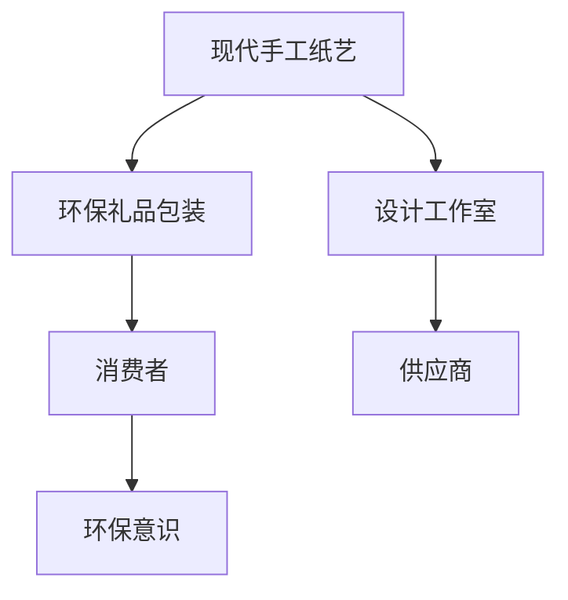

                 

# 现代手工纸艺包装设计工作室：环保礼品包装的创意集散地

## 关键词
现代手工纸艺、环保礼品包装、设计工作室、创意集散地、可持续发展

## 摘要
本文旨在探讨现代手工纸艺包装设计工作室如何成为环保礼品包装的创意集散地。我们将通过逐步分析现代手工纸艺包装设计的关键概念、材料、技术和设计流程，以及成功案例，展示这一领域的创新和可持续性。本文还将探讨手工纸艺包装设计工作室在促进环保意识和推动可持续发展方面的作用。

## 引言：背景与概述

### 环保包装的重要性

随着全球对环境保护意识的提高，环保包装已经成为包装行业的热门话题。传统包装材料如塑料、金属和玻璃等，不仅生产成本高，而且对环境造成严重污染。因此，寻求环保替代品成为当务之急。手工纸艺包装作为一种环保、可持续的包装解决方案，逐渐受到设计师和消费者的青睐。

### 环保礼品包装的需求

礼品包装不仅仅是保护产品的一种手段，更是一种传递情感和文化的方式。随着人们越来越重视环保和可持续发展，环保礼品包装的需求也在不断增长。消费者希望能够通过购买环保礼品来表达自己的环保理念和对受礼者的关心。

### 手工纸艺包装设计工作室的角色

现代手工纸艺包装设计工作室作为环保礼品包装的创意集散地，承担着以下几个重要角色：

1. **创新设计引领者**：工作室通过不断探索和实验，将现代设计理念与手工纸艺相结合，创造出独具特色和环保价值的礼品包装。
2. **环保意识的推广者**：工作室通过宣传和展示环保礼品包装的案例，提高消费者对环保包装重要性的认识。
3. **可持续发展的推动者**：工作室通过采用可持续的制造工艺和材料，为环保事业做出贡献。

## 核心概念与联系

### 核心概念

1. **现代手工纸艺**：指利用现代技术手段，结合传统手工技艺，制作出的具有独特艺术风格的纸张艺术品。
2. **环保礼品包装**：使用环保材料，设计制作的礼品包装，旨在减少对环境的负面影响。
3. **设计工作室**：专注于礼品包装设计的企业或机构，通常具有专业的团队和先进的技术设备。

### 概念属性特征对比表格

| 概念 | 特征 |
| ---- | ---- |
| 现代手工纸艺 | 创新性、艺术性、可持续性 |
| 环保礼品包装 | 环保性、美观性、实用性 |
| 设计工作室 | 专业性、创新性、服务性 |

### 实体关系图（ERD）

## 基本技术

### 手工纸艺的基本技术

1. **纸浆制作**：通过将植物纤维浸泡在水中，搅拌形成纸浆。
2. **纸成型**：将纸浆均匀铺在平板上，通过压力和水分的作用，形成所需的纸张形状。
3. **装饰**：在成型的纸张上进行绘画、雕刻、贴花等装饰，增加艺术性和独特性。

### 环保材料的选用

1. **再生纸**：使用回收的纸张作为原料，减少对森林资源的消耗。
2. **无毒性染料**：选用无毒、环保的染料进行纸张染色，确保对人体和环境无害。
3. **可降解材料**：使用可降解的天然材料，如稻草、麻绳等，减少对环境的污染。

## 设计过程和方法

### 设计原则

1. **环保性**：优先选择环保材料，减少对环境的负面影响。
2. **美观性**：设计具有艺术性和观赏价值，满足消费者的审美需求。
3. **实用性**：确保包装在保护产品的同时，方便消费者使用和回收。

### 设计流程

1. **市场调研**：了解目标市场的需求和趋势，确定设计方向。
2. **概念开发**：结合市场调研结果，提出多个设计概念，进行筛选和优化。
3. **原型制作**：制作初步的包装原型，进行试用和评估。
4. **设计优化**：根据原型测试结果，对设计进行修改和完善。
5. **批量生产**：完成设计后，进行批量生产，并进行质量检验。

## 创意案例研究

### 案例一：自然之韵礼品包装

#### 项目简介

自然之韵礼品包装项目旨在通过手工纸艺表达自然界的美丽，同时传达环保理念。项目包括礼品盒、礼品袋和包装纸等多个产品。

#### 设计过程

1. **灵感来源**：从自然界的图案和色彩中汲取灵感，如树叶、花朵和流水等。
2. **材料选择**：选用再生纸和天然染料，确保包装的环保性。
3. **装饰工艺**：在纸张上采用水印、贴花和手工绘画等工艺，增加艺术感。
4. **包装形式**：设计符合产品特点和消费者需求的包装形式，如礼品盒和礼品袋。

#### 影响与评价

自然之韵礼品包装项目在市场上取得了良好的反响。消费者不仅欣赏其独特的美感，更认可其环保价值。项目成功地将手工纸艺与环保理念相结合，为环保礼品包装开辟了新的方向。

### 案例二：可持续生活主题礼品包装

#### 项目简介

可持续生活主题礼品包装项目以可持续生活为主题，通过手工纸艺传达环保和可持续发展的理念。

#### 设计过程

1. **灵感来源**：从可持续生活的各个方面汲取灵感，如循环利用、减少浪费和生态平衡等。
2. **材料选择**：采用可降解材料和再生纸，减少对环境的负担。
3. **装饰工艺**：在纸张上采用环保油墨和天然染料，确保包装的无毒性和环保性。
4. **包装形式**：设计简洁、实用的包装形式，如纸质手提袋和礼品盒。

#### 影响与评价

可持续生活主题礼品包装项目在环保和可持续发展领域产生了积极的影响。项目不仅为消费者提供了环保、实用的礼品包装，还通过包装设计和主题传达了环保理念，促进了消费者对可持续发展的认识和重视。

## 结论

现代手工纸艺包装设计工作室作为环保礼品包装的创意集散地，通过创新的设计理念和环保的材料选择，为环保事业做出了重要贡献。随着消费者环保意识的提高，手工纸艺包装设计工作室的市场前景将更加广阔。未来，工作室应继续探索手工纸艺与环保理念的结合，为可持续发展做出更大的贡献。

## 最佳实践 tips

1. **选择环保材料**：在包装设计过程中，优先考虑环保、可持续的材料，减少对环境的负面影响。
2. **注重美观性**：环保礼品包装不仅要环保，还要美观，以满足消费者的审美需求。
3. **设计简洁实用**：简洁实用的包装设计不仅方便消费者使用，还能减少资源的浪费。

## 小结

本文通过分析现代手工纸艺包装设计工作室在环保礼品包装领域的创新和实践，展示了这一领域的重要性和潜力。随着环保意识的提高，手工纸艺包装设计工作室将在推动可持续发展方面发挥更大的作用。

## 注意事项

1. **材料选择**：在选用环保材料时，要注意其环保性和安全性，确保对人体无害。
2. **工艺流程**：在包装设计过程中，要遵循环保工艺流程，减少污染和浪费。
3. **市场调研**：在推出新产品前，要进行充分的市场调研，了解消费者的需求和喜好。

## 拓展阅读

1. 《现代手工纸艺包装设计教程》
2. 《可持续设计：环保礼品包装的创新实践》
3. 《环保包装：材料与技术的创新》

## 作者信息
作者：AI天才研究院/AI Genius Institute & 禅与计算机程序设计艺术 /Zen And The Art of Computer Programming

