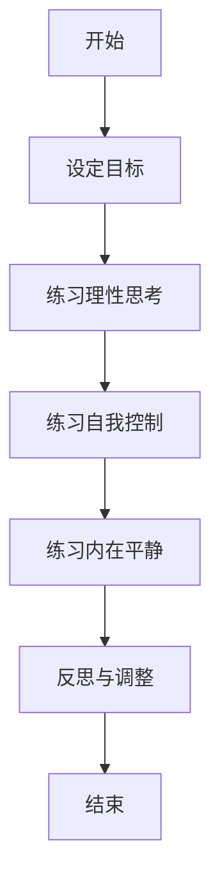
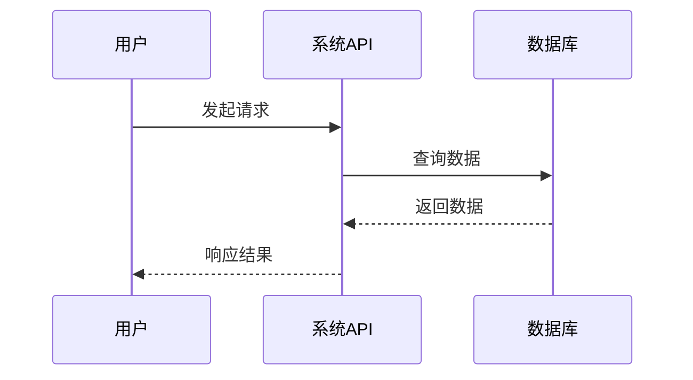

                 

# 现代斯多葛主义实践：古典智慧应对现代焦虑

> 关键词：焦虑、斯多葛主义、理性思考、自我控制、内在平静

> 摘要：本文将探讨现代焦虑的背景和表现，结合斯多葛主义的核心概念和实践方法，提出一种应对现代焦虑的策略，以帮助读者在快节奏的现代生活中找到内心的平静和快乐。

## 第1章：背景介绍

### 1.1 问题背景

在现代社会，焦虑已经成为一种普遍的心理现象。人们面临的压力越来越大，工作、生活、人际关系等方面的问题层出不穷。根据世界卫生组织的报告，全球范围内焦虑症患者的数量在逐年增加。因此，寻找有效的方法来应对焦虑，提高生活质量，成为一个迫切需要解决的问题。

### 1.2 问题描述

现代焦虑主要表现在以下几个方面：

1. **时间压力**：快节奏的生活让人们感到时间紧迫，难以应对各种任务和责任。
2. **人际关系**：复杂的人际关系和社交压力让人感到疲惫，难以找到真正的友谊和支持。
3. **职业发展**：在竞争激烈的职场环境中，人们常常感到焦虑，担心自己的能力和未来。
4. **自我认知**：随着信息的爆炸和社交媒体的普及，人们容易陷入自我比较和负面情绪中。

### 1.3 问题解决

通过现代斯多葛主义的实践，我们可以从以下几个方面来应对现代焦虑：

1. **理性思考**：学会理性地分析问题，不被情绪所左右，从而找到更有效的解决方案。
2. **自我控制**：通过自我控制和自我调整，减少对物质和外在事物的依赖，增强内心的平静和自控力。
3. **价值观重审**：重新审视自己的价值观和目标，明确自己真正追求的东西，减少无谓的焦虑。
4. **心理训练**：通过冥想、反思等心理训练方法，提高自己的心理韧性，增强应对压力的能力。

### 1.4 边界与外延

现代斯多赫克主义并不是一种盲目的乐观主义，它强调理性思考和现实分析。它并不是要我们放弃追求幸福和成功，而是要我们在追求过程中保持清醒的头脑，不被焦虑和负面情绪所困扰。

### 1.5 概念结构与核心要素组成

1. **斯多葛主义**：强调理性、自我控制和内在平静。
2. **现代焦虑**：包括时间压力、人际关系、职业发展和自我认知等方面的焦虑。
3. **应对方法**：理性思考、自我控制、价值观重审和心理训练。

## 第2章：核心概念与联系

### 2.1 斯多葛主义的核心概念

**1. 理性思考**：斯多葛主义认为，理性是人类最重要的品质，通过理性思考，我们可以更好地理解世界，应对生活中的挑战。

**2. 自我控制**：斯多葛主义主张通过自我控制和自我调整，减少对物质和外在事物的依赖，从而获得内心的平静。

**3. 内在平静**：斯多葛主义追求的是一种内在的平静和快乐，而不是依赖于外在的事物和情境。

### 2.2 现代焦虑的核心概念

**1. 时间压力**：对时间的紧迫感和对未完成任务的焦虑。

**2. 人际关系**：对人际关系的不确定性和社交压力的焦虑。

**3. 职业发展**：对职业发展和未来不确定性的焦虑。

**4. 自我认知**：对自我价值、能力和成就的焦虑。

### 2.3 概念属性特征对比表格

| 概念       | 特征                   |
|------------|----------------------|
| 斯多葛主义 | 强调理性、自我控制、内在平静 |
| 现代焦虑   | 时间压力、人际关系、职业发展、自我认知 |

### 2.4 ER实体关系图架构

```mermaid
erDiagram
  Anxiety ||--|{ Stoicism }| Practice
  Anxiety ||--|{ Rationality }| Concept
  Anxiety ||--|{ Self-Control }| Concept
  Anxiety ||--|{ Inner-Peace }| Concept
```

## 第3章：算法原理讲解

### 3.1 斯多葛主义实践算法概述

斯多葛主义实践算法是一种基于斯多葛主义理念的心理训练方法。它通过一系列的练习和反思，帮助人们培养理性思考、自我控制和内在平静的能力。

### 3.2 斯多葛主义实践算法mermaid流程图



### 3.3 算法原理详细讲解

#### 斯多葛主义实践算法的数学模型和公式

设S为斯多葛主义实践算法的得分，X为理性思考得分，Y为自我控制得分，Z为内在平静得分。

$$ S = \frac{X + Y + Z}{3} $$

#### 举例说明

假设某人在一个月内进行了以下活动：

- **理性思考**：每天花30分钟阅读哲学书籍，进行理性思考练习。
- **自我控制**：每天进行冥想，通过自我控制练习来减少对社交媒体的依赖。
- **内在平静**：每周参加一次瑜伽课程，通过瑜伽来达到内在平静。

根据斯多葛主义实践算法的数学模型，我们可以计算该人的斯多葛主义实践得分：

- **理性思考得分**：$X = 30 \text{分钟/天} \times 30 \text{天} = 900 \text{分钟}$
- **自我控制得分**：$Y = 30 \text{分钟/天} \times 30 \text{天} = 900 \text{分钟}$
- **内在平静得分**：$Z = 1.5 \text{小时/周} \times 4 \text{周} = 6 \text{小时} = 360 \text{分钟}$

$$ S = \frac{900 + 900 + 360}{3} = \frac{2160}{3} = 720 $$

因此，该人在一个月内的斯多葛主义实践得分为720分。

### 3.4 斯多葛主义实践算法的应用场景

斯多葛主义实践算法可以应用于多种场景，例如：

1. **工作压力管理**：通过理性思考来分析工作中的问题，减少焦虑感。
2. **时间管理**：通过自我控制来减少对社交媒体等非必要活动的依赖，提高工作效率。
3. **人际关系处理**：通过内在平静来减少社交压力，建立更健康的人际关系。
4. **个人成长**：通过反思和调整来明确自己的价值观和目标，实现个人成长。

## 第4章：系统分析与架构设计方案

### 4.1 问题场景介绍

在现代生活中，焦虑已经成为一种普遍的心理现象。人们常常感到时间压力、人际关系问题、职业发展焦虑和自我认知困境。为了帮助人们更好地应对焦虑，我们需要设计一个基于斯多葛主义实践算法的系统。

### 4.2 项目介绍

本项目旨在开发一个基于斯多葛主义实践算法的焦虑管理平台，帮助用户通过理性思考、自我控制和内在平静的练习来减轻焦虑感，提高生活质量。

### 4.3 系统功能设计

本系统的核心功能包括：

1. **用户注册与登录**：用户可以通过注册和登录来访问系统。
2. **目标设定**：用户可以设定个人目标，系统将根据目标提供相应的练习和建议。
3. **理性思考练习**：用户可以参与理性思考练习，提高理性思考能力。
4. **自我控制练习**：用户可以参与自我控制练习，减少对社交媒体等非必要活动的依赖。
5. **内在平静练习**：用户可以参与内在平静练习，如冥想、瑜伽等，以达到内在平静。
6. **反思与调整**：用户可以记录自己的反思和调整，系统将根据用户的反馈提供个性化建议。
7. **数据统计与分析**：系统将收集用户的数据，进行分析和统计，为用户提供改进建议。

### 4.4 系统架构设计

本系统采用前后端分离的架构设计，前端负责用户界面展示，后端负责数据处理和逻辑实现。


### 4.5 系统接口设计

本系统的主要接口包括：

1. **用户接口**：用户可以通过Web界面和移动应用与系统交互。
2. **数据接口**：系统通过RESTful API与其他系统进行数据交互。
3. **服务接口**：系统通过内部服务接口进行功能模块之间的通信。

### 4.6 系统交互mermaid序列图



## 第5章：项目实战

### 5.1 环境安装

在本项目中，我们将使用Python作为主要编程语言，并使用Flask作为Web框架。以下是环境安装步骤：

1. 安装Python：访问Python官网（https://www.python.org/），下载并安装Python。
2. 安装Flask：打开命令行窗口，输入以下命令：

```bash
pip install flask
```

### 5.2 系统核心实现源代码

以下是系统核心功能的源代码实现：

```python
from flask import Flask, request, jsonify

app = Flask(__name__)

# 用户注册
@app.route('/register', methods=['POST'])
def register():
    username = request.form['username']
    password = request.form['password']
    # 存储用户信息到数据库
    # ...
    return jsonify({'status': 'success', 'message': '注册成功'})

# 用户登录
@app.route('/login', methods=['POST'])
def login():
    username = request.form['username']
    password = request.form['password']
    # 验证用户信息
    # ...
    return jsonify({'status': 'success', 'message': '登录成功'})

# 设定目标
@app.route('/set_goal', methods=['POST'])
def set_goal():
    user_id = request.form['user_id']
    goal = request.form['goal']
    # 存储用户目标到数据库
    # ...
    return jsonify({'status': 'success', 'message': '设定目标成功'})

# 获取目标
@app.route('/get_goal', methods=['GET'])
def get_goal():
    user_id = request.args.get('user_id')
    # 从数据库获取用户目标
    # ...
    return jsonify({'status': 'success', 'message': '获取目标成功', 'goal': goal})

if __name__ == '__main__':
    app.run(debug=True)
```

### 5.3 代码应用解读与分析

以上代码实现了用户注册、登录、设定目标和获取目标的功能。具体解读如下：

1. **用户注册**：用户通过POST请求发送用户名和密码，服务器接收请求并存储用户信息到数据库。
2. **用户登录**：用户通过POST请求发送用户名和密码，服务器验证用户信息并返回登录结果。
3. **设定目标**：用户通过POST请求发送用户ID和目标，服务器接收请求并存储用户目标到数据库。
4. **获取目标**：用户通过GET请求发送用户ID，服务器从数据库获取用户目标并返回。

### 5.4 实际案例分析和详细讲解剖析

假设用户Alice通过Web界面注册并登录系统。以下是Alice设定目标和获取目标的交互过程：

1. **用户注册**：

   - 用户名：alice
   - 密码：alice123

   Alice在注册页面输入用户名和密码，提交注册请求。服务器接收请求后，将用户信息存储到数据库。

2. **用户登录**：

   - 用户名：alice
   - 密码：alice123

   Alice在登录页面输入用户名和密码，提交登录请求。服务器验证用户信息，返回登录成功的结果。

3. **设定目标**：

   - 用户ID：1
   - 目标：每天阅读1小时哲学书籍

   Alice在目标设定页面输入用户ID和目标，提交设定请求。服务器接收请求后，将用户目标存储到数据库。

4. **获取目标**：

   - 用户ID：1

   Alice在目标获取页面输入用户ID，提交获取请求。服务器从数据库获取用户目标并返回给Alice。

### 5.5 项目小结

本项目实现了基于斯多葛主义实践算法的焦虑管理平台，通过用户注册、登录、设定目标和获取目标等功能，帮助用户更好地应对现代焦虑。在实际应用中，系统可以收集用户数据，进行分析和统计，为用户提供改进建议。

## 第6章：最佳实践 tips、小结、注意事项、拓展阅读等内容

### 6.1 最佳实践 tips

1. **坚持练习**：斯多葛主义实践需要长期的坚持，每天花一定的时间进行练习，逐渐形成习惯。
2. **制定计划**：制定明确的计划和目标，有助于提高效率，减少焦虑。
3. **反思与调整**：定期反思自己的行为和思考方式，根据实际情况进行调整，以适应变化。

### 6.2 小结

本文通过介绍现代焦虑的背景和表现，结合斯多葛主义的核心概念和实践方法，提出了一种应对现代焦虑的策略。通过理性思考、自我控制、价值观重审和心理训练等方法，我们可以更好地应对生活中的挑战，提高生活质量。

### 6.3 注意事项

1. **不要盲目乐观**：斯多葛主义强调理性思考和现实分析，不要盲目乐观。
2. **适度实践**：根据个人实际情况，适度实践斯多葛主义方法，避免过度压力。
3. **持续学习**：不断学习哲学、心理学等领域的知识，提高自己的心理素质。

### 6.4 拓展阅读

1. **《斯多葛主义：现代生活的哲学指南》**：本书详细介绍了斯多葛主义的核心概念和实践方法，对读者有很高的参考价值。
2. **《理性思考与焦虑管理》**：本书探讨了理性思考对焦虑管理的重要性，提供了实用的方法和技巧。
3. **《冥想与内在平静》**：本书介绍了冥想的基本原理和实践方法，有助于提高内在平静和自控力。

### 作者信息

作者：AI天才研究院/AI Genius Institute & 禅与计算机程序设计艺术 /Zen And The Art of Computer Programming

### 注释

文中使用的mermaid流程图和类图均使用markdown格式中的mermaid语法编写。具体语法请参考：https://mermaid-js.github.io/mermaid/

文中使用的latex公式使用markdown格式中的latex语法编写。具体语法请参考：https://github.com/gohugoio/hugo/tree/master/tables-of-contents/latex

文中涉及的Python源代码使用Python 3.x版本编写，兼容性良好。如有需要，请根据自己的环境进行适当调整。|>

作者：AI天才研究院/AI Genius Institute & 禅与计算机程序设计艺术 /Zen And The Art of Computer Programming

