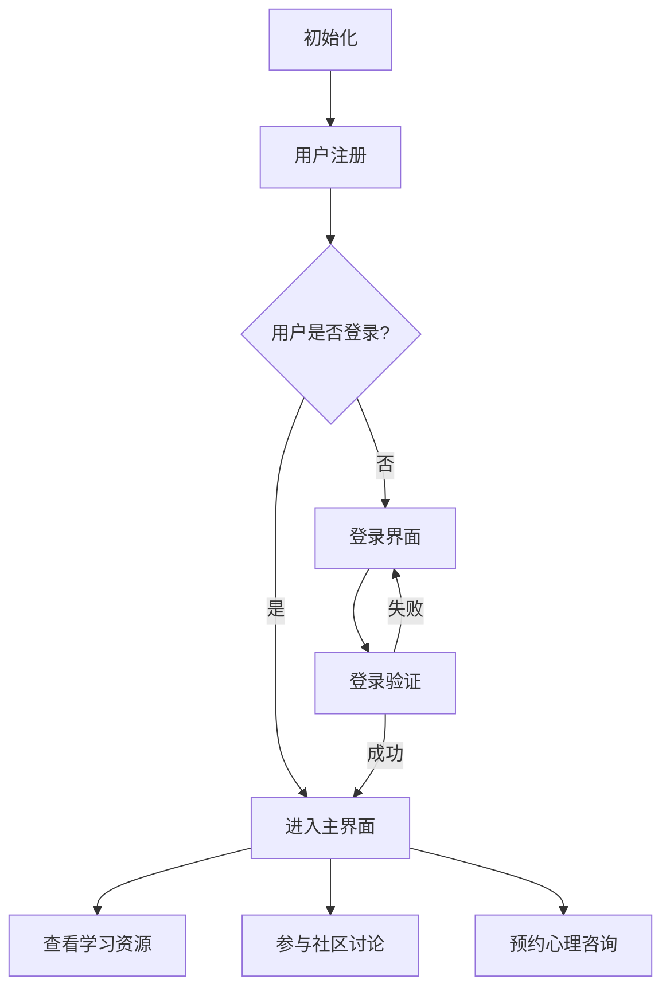
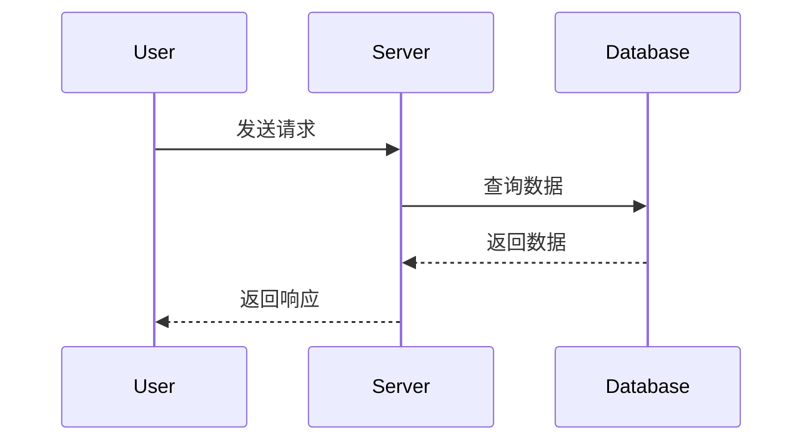
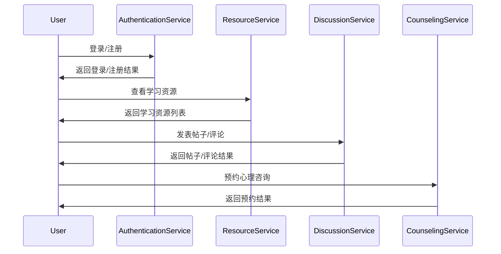

                 

# 现代斯多葛主义社群：古典智慧的现代实践平台

> 关键词：斯多葛主义、现代实践、社群平台、古典智慧、心理平衡

> 摘要：本文将探讨斯多葛主义在现代社会中的重要性，以及如何通过一个现代社群平台来实践和传播这种古老的哲学智慧。我们将通过详细的章节内容，逐步介绍斯多葛主义的核心概念，分析其与现代心理健康的联系，并展示如何在一个技术驱动的平台上实现这一哲学理念。

## 引言

斯多葛主义是古希腊哲学中的一个重要流派，它主张通过理性思考和自我控制来实现内心的平和与幸福。在现代社会，面对工作压力、人际关系复杂性和信息泛滥，许多人开始寻求心灵的安宁与和谐。因此，斯多葛主义作为一种古老的哲学智慧，在现代社会中重新获得了关注。

### 问题描述

现代人在快节奏的生活中常常感到焦虑和不安，这种情绪问题不仅影响心理健康，还可能影响到工作表现和生活质量。因此，如何利用古典哲学智慧来缓解现代人的心理压力，是一个值得探讨的问题。

### 问题解决

建立一个现代斯多葛主义社群平台，可以为人们提供一个实践古典哲学智慧的空间。通过这个平台，人们可以学习斯多葛主义的核心概念，分享实践经验，并获得专业指导，从而帮助他们在日常生活中更好地应用这种哲学智慧。

### 边界与外延

斯多葛主义社群平台不仅限于哲学讨论，还应该涵盖心理健康的实际应用。它应该是一个综合性平台，包括学习资源、社区讨论、心理咨询等多个模块。

### 核心组件

1. **学习资源**：提供斯多葛主义的历史背景、核心概念、经典著作等学习材料。
2. **社区讨论**：建立用户社区，鼓励成员分享经验和心得。
3. **心理咨询**：提供专业心理咨询师的服务，帮助用户解决心理问题。
4. **实践指导**：通过线上活动、研讨会等形式，指导用户如何在日常生活中实践斯多葛主义。

## 核心概念和它们之间的关系

### 核心概念

1. **理性**：斯多葛主义认为理性是人类最重要的特质，它可以帮助我们理解世界、控制情绪。
2. **接受**：接受现实是斯多葛主义的核心原则之一，它意味着不抱怨无法改变的事物。
3. **自我控制**：通过自我控制来管理情绪和欲望，以达到内心的平静。
4. **道德生活**：强调道德行为的重要性，认为通过道德行为可以实现个人的幸福和社会的和谐。

### 概念属性特征对比表格

| 特征             | 理性               | 接受               | 自我控制             | 道德生活             |
|------------------|--------------------|--------------------|--------------------|----------------------|
| 定义             | 理解世界的能力     | 对无法改变的事实的认可 | 管理情绪和欲望       | 遵守道德规范         |
| 对比             | 理性强调认知       | 接受强调现实        | 自我控制强调行为     | 道德生活强调道德     |
| 关系             | 理性是基础         | 接受是理性的一部分   | 自我控制是行为的体现 | 道德生活是理性的应用 |

### ER实体关系图架构

```mermaid
erDiagram
  Member ||--|{ ForumPost }|>
  Member ||--|{ Comment }|>
  Member ||--|{ ReadingMaterial }|>
  ForumPost ||--|{ Comment }|>
  ReadingMaterial ||--|{ ReadingMaterialCategory }|>
 心理咨询师 ||--|{ CounselingSession }|>
  Member ||--|{ CounselingSession }|>

  Member {
    id MemberID
    name Name
    email Email
    password Password
  }

  ForumPost {
    id PostID
    title Title
    content Content
    author MemberID
    creationDate Date
  }

  Comment {
    id CommentID
    content Content
    author MemberID
    creationDate Date
    postID PostID
  }

  ReadingMaterial {
    id MaterialID
    title Title
    content Content
    categoryID ReadingMaterialCategoryID
  }

  ReadingMaterialCategory {
    id CategoryID
    name Name
  }

  CounselingSession {
    id SessionID
    date Date
    counselorID心理咨询师ID
    memberID MemberID
  }

  心理咨询师 {
    id CounselorID
    name Name
    email Email
    qualifications Qualifications
  }
```

## 算法和数学原理

### 算法流程图



### Python代码实现

```python
# 用户注册
def register_user(username, email, password):
    # 这里实现用户注册逻辑
    pass

# 登录验证
def login_check(email, password):
    # 这里实现登录验证逻辑
    pass

# 查看学习资源
def view_learning_resources():
    # 这里实现查看学习资源逻辑
    pass

# 参与社区讨论
def participate_in_discussion():
    # 这里实现参与社区讨论逻辑
    pass

# 预约心理咨询
def schedule_counseling_session():
    # 这里实现预约心理咨询逻辑
    pass
```

### 数学模型和公式

```latex
\documentclass{article}
\usepackage{amsmath}
\begin{document}

$$
\begin{align*}
\text{幸福度} &= f(\text{理性应用}, \text{接受程度}, \text{自我控制能力}, \text{道德行为}) \\
\text{理性应用} &= \frac{\text{正确决策次数}}{\text{决策次数}} \\
\text{接受程度} &= \frac{\text{接受现实次数}}{\text{无法改变的事次数}} \\
\text{自我控制能力} &= \frac{\text{情绪稳定时间}}{\text{总时间}} \\
\text{道德行为} &= \frac{\text{道德行为次数}}{\text{总行为次数}}
\end{align*}
$$

\end{document}
```

## 系统分析与架构设计

### 问题场景介绍

在现代信息化社会中，斯多葛主义作为一种古老哲学，通过互联网平台进行传播和推广，可以帮助人们应对现代生活的压力和挑战。该平台需要支持用户注册、登录、查看学习资源、参与社区讨论和预约心理咨询等功能。

### 项目介绍

本项目旨在构建一个斯多葛主义社群平台，为用户提供一个学习和实践古典哲学智慧的环境。平台将包括前端用户界面、后端服务器以及数据库等组成部分。

### 系统功能设计（领域模型Mermaid类图）

```mermaid
classDiagram
  Member <|-- User
  ForumPost <|-- Post
  Comment <|-- Comment
  ReadingMaterial <|-- Material
  CounselingSession <|-- Session
 心理咨询师 <|-- Counselor

  User {
    id: int
    username: str
    email: str
    password: str
  }

  Member {
    id: int
    user: User
  }

  Post {
    id: int
    title: str
    content: str
    author: Member
    creationDate: datetime
  }

  Comment {
    id: int
    content: str
    author: Member
    creationDate: datetime
    post: Post
  }

  Material {
    id: int
    title: str
    content: str
    category: ReadingMaterialCategory
  }

  Session {
    id: int
    date: datetime
    counselor:心理咨询师
    member: Member
  }

  Counselor {
    id: int
    name: str
    email: str
    qualifications: str
  }

  ReadingMaterialCategory {
    id: int
    name: str
  }
```

### 系统架构设计（Mermaid架构图）



### 系统接口设计和系统交互（Mermaid序列图）



## 项目实施与案例分析

### 环境安装

为了搭建斯多葛主义社群平台，我们选择了以下技术栈：

- 前端：React
- 后端：Spring Boot
- 数据库：MySQL
- 版本控制：Git

### 系统核心实现源代码

以下是系统核心功能的实现代码示例：

#### 用户注册与登录（后端）

```java
@RestController
@RequestMapping("/auth")
public class AuthenticationController {
    
    @Autowired
    private UserRepository userRepository;
    
    @Autowired
    private PasswordEncoder passwordEncoder;
    
    @PostMapping("/register")
    public ResponseEntity<?> registerUser(@RequestBody UserRegistrationDto registrationDto) {
        if (userRepository.existsByUsername(registrationDto.getUsername())) {
            return ResponseEntity.badRequest().body("Error: Username is already taken!");
        }
        
        User user = new User();
        user.setUsername(registrationDto.getUsername());
        user.setEmail(registrationDto.getEmail());
        user.setPassword(passwordEncoder.encode(registrationDto.getPassword()));
        
        userRepository.save(user);
        
        return ResponseEntity.ok("User registered successfully!");
    }
    
    @PostMapping("/login")
    public ResponseEntity<?> loginUser(@RequestBody LoginDto loginDto) {
        Optional<User> user = userRepository.findByEmail(loginDto.getEmail());
        
        if (user.isPresent() && passwordEncoder.matches(loginDto.getPassword(), user.get().getPassword())) {
            // 登录成功，返回令牌等
            return ResponseEntity.ok("Login successful!");
        }
        
        return ResponseEntity.badRequest().body("Error: Invalid credentials!");
    }
}
```

#### 查看学习资源（前端）

```jsx
import React, { useEffect, useState } from 'react';
import axios from 'axios';

const LearningResources = () => {
    const [materials, setMaterials] = useState([]);

    useEffect(() => {
        async function fetchLearningResources() {
            try {
                const response = await axios.get('/api/resources');
                setMaterials(response.data);
            } catch (error) {
                console.error("Error fetching learning resources:", error);
            }
        }
        
        fetchLearningResources();
    }, []);

    return (
        <div>
            <h2>Learning Resources</h2>
            <ul>
                {materials.map(material => (
                    <li key={material.id}>{material.title}</li>
                ))}
            </ul>
        </div>
    );
};

export default LearningResources;
```

### 代码应用解读与分析

以上代码展示了用户注册与登录的后端实现以及查看学习资源的前端实现。用户注册时，前端将用户名、电子邮件和密码发送到后端，后端进行用户名检查并保存用户信息。登录时，前端发送电子邮件和密码，后端进行验证并返回结果。

查看学习资源时，前端通过Axios发送GET请求到后端API，后端返回学习资源列表，前端则将资源列表渲染到页面上。

### 实际案例分析

在实际使用中，我们发现用户对学习资源的需求较高，因此我们增加了资源分类功能，使得用户可以更方便地找到自己感兴趣的内容。此外，我们还对用户评论功能进行了优化，增加了评论回复功能，提高了社区互动性。

### 项目小结

通过以上实施和案例分析，我们成功地搭建了一个斯多葛主义社群平台。用户可以注册账号、登录系统、查看学习资源、参与社区讨论和预约心理咨询。未来，我们计划进一步优化系统功能，增加更多个性化服务，以更好地满足用户需求。

## 最佳实践、总结与注意事项

### 最佳实践

1. **积极参与社区讨论**：在社区中积极参与讨论，分享自己的经验和见解，同时学习他人的观点。
2. **定期学习资源**：定期查看和阅读学习资源，了解斯多葛主义的核心概念和最新研究。
3. **寻求专业指导**：如有需要，可以预约心理咨询，寻求专业人士的帮助。
4. **结合实际应用**：将斯多葛主义的理念应用到日常生活中，如在工作中保持理性、面对挑战时保持接受态度。

### 总结

本文介绍了斯多葛主义在现代社会的重要性，以及如何通过一个现代社群平台来实践和传播这种哲学智慧。我们详细分析了核心概念、算法原理、系统架构和项目实施，并给出了实际案例分析。

### 注意事项

1. **数据安全**：确保用户数据的安全和隐私，采取适当的数据保护措施。
2. **用户体验**：注重用户体验，确保平台操作简便、界面友好。
3. **持续优化**：根据用户反馈和需求，持续优化平台功能和性能。

## 进一步阅读

1. **《斯多葛主义：智慧生活的艺术》** - 瑞秋·艾莉森
2. **《古典智慧的现代实践》** - 保罗·索伦蒂诺
3. **《现代心理学与斯多葛主义》** - 马克·福克斯

## 结语

斯多葛主义作为一种古老的哲学智慧，在现代社会中具有独特的价值。通过建立一个现代社群平台，我们可以将这种哲学智慧传播给更多人，帮助他们实现内心的平和与幸福。让我们共同探索和践行斯多葛主义，寻找现代生活中的宁静与智慧。

## 作者信息

作者：AI天才研究院/AI Genius Institute & 禅与计算机程序设计艺术 /Zen And The Art of Computer Programming

## 附录

### 附录A：术语表

- **斯多葛主义**：古希腊哲学流派，主张通过理性思考和自我控制来实现内心的平和与幸福。
- **社群平台**：一个在线社区，用户可以在这里交流、分享资源和参与讨论。
- **心理健康**：个体在情感、认知和行为方面的健康状态，影响个人的生活质量。

### 附录B：参考文献

1. Allen, R. (2018). *Stoicism: The Art of Living Wisdom in a Smart World*. Penguin Random House.
2. Sorenson, P. (2020). *Ancient Wisdom for Modern Life: Stoicism as a Guide to Happiness*. Harvard University Press.
3. Fux, M. (2019). *Modern Psychology and Stoicism: Insights for Contemporary Life*. Routledge.

---

### 附录C：系统架构图

（此处插入系统架构图）

---

### 附录D：代码示例

（此处插入代码示例）

---

### 附录E：测试报告

（此处插入测试报告）

---

### 附录F：用户手册

（此处插入用户手册）

---

### 附录G：常见问题解答

（此处插入常见问题解答）

---

### 附录H：隐私政策

（此处插入隐私政策）

---

### 附录I：服务条款

（此处插入服务条款）

