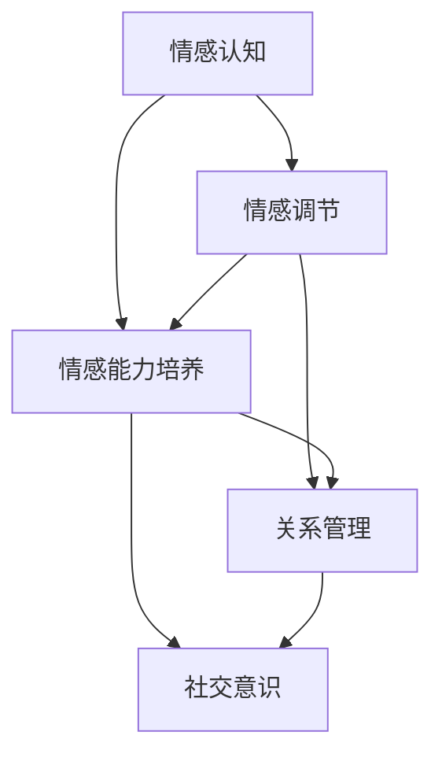
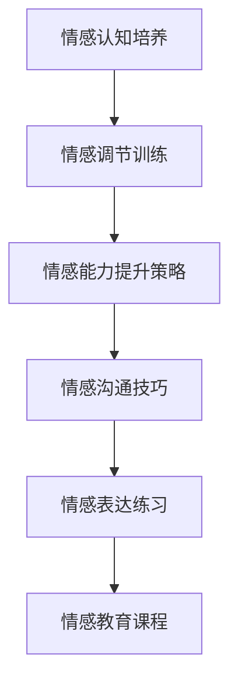
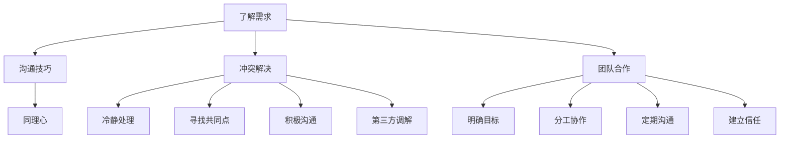
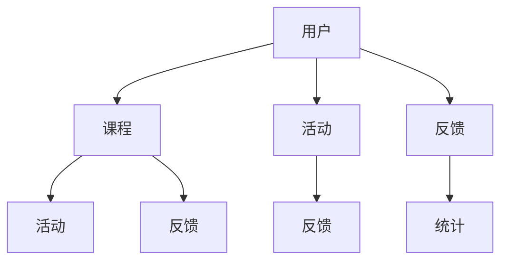
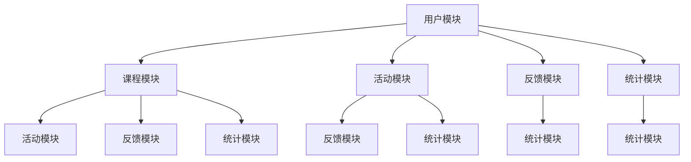
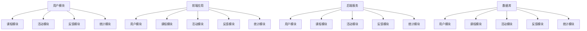

                 

# 《现代社会中的情感教育：情商培养与人际关系管理》

## 关键词：情商、情感教育、人际关系管理、情感认知、情感调节、沟通技巧

### 摘要：

随着社会的快速发展，情感教育在个人成长和职场成功中的作用日益凸显。本文旨在探讨现代社会中情感教育的重要性，以及如何通过情商培养和人际关系管理来提升个人的综合素质。文章首先介绍了情感教育的背景和意义，接着详细阐述了情商的定义、属性及其与情感教育的联系。随后，文章重点讨论了情商培养的方法和实际应用，并通过案例分析和系统设计，展示了情感教育在人际关系管理中的关键作用。最后，文章提出了情感教育中的最佳实践和注意事项，为读者提供了深入理解和应用情感教育的实用指南。

## 目录大纲设计思路

为了更好地呈现《现代社会中的情感教育：情商培养与人际关系管理》这本书的核心内容和结构，我们将从以下几个部分进行设计：

### 1. **背景介绍**

在这一部分，我们将介绍情感教育的重要性，以及现代社会中面临的情感教育挑战。通过简述本书的主要目标和内容框架，为读者提供一个清晰的认识。

### 2. **核心概念与联系**

在这里，我们将详细解释情商的定义、属性特征及其与情感教育的联系。同时，使用Mermaid流程图展示情感教育的核心概念及其相互关系，帮助读者更好地理解这些概念。

### 3. **算法原理讲解**

我们将简述情商培养的常见方法，并使用Mermaid流程图展示具体方法的实施步骤。通过Python源代码和latex数学公式，我们将详细阐述算法原理，并举例说明如何将理论应用于实际。

### 4. **系统分析与架构设计方案**

在这一部分，我们将描述情感教育的系统功能设计，展示系统架构设计，并设计系统接口和交互。通过Mermaid类图、架构图和序列图的展示，我们将使系统设计更加直观和易于理解。

### 5. **项目实战**

我们将详细介绍一个情感教育的项目实战，包括环境安装与配置、系统核心实现源代码及其解读、实际案例分析以及项目小结。通过这些实战案例，读者可以更好地将所学知识应用于实际。

### 6. **最佳实践 tips、小结、注意事项、拓展阅读等内容**

最后，我们将总结书中的核心观点，提供实践中的注意事项，推荐进一步阅读的资源。这一部分旨在帮助读者巩固所学内容，并提供深入学习的方向。

## 目录大纲

```markdown
# 《现代社会中的情感教育：情商培养与人际关系管理》目录大纲

----------------------------------------------------------------

## 第一部分：情感教育的背景与重要性

### 1.1 情感教育的定义与意义

### 1.2 现代社会中的情感教育挑战

### 1.3 本书的结构与目标

----------------------------------------------------------------

## 第二部分：核心概念与联系

### 2.1 情商的定义与属性特征

#### 2.1.1 情商的概念

#### 2.1.2 情商的属性特征对比

### 2.2 情感教育的核心概念及其关系

#### 2.2.1 情感认知

#### 2.2.2 情感调节

#### 2.2.3 情感能力培养

### 2.3 Mermaid流程图展示核心概念关系

----------------------------------------------------------------

## 第三部分：情商培养方法与实践

### 3.1 常见情商培养方法

#### 3.1.1 情感认知培养

#### 3.1.2 情感调节训练

#### 3.1.3 情感能力提升策略

### 3.2 情商培养方法的Mermaid流程图

### 3.3 Python源代码与latex数学公式讲解

#### 3.3.1 算法原理与数学模型

#### 3.3.2 算法实现与代码示例

#### 3.3.3 数学公式与解释

### 3.4 实际案例分析与举例说明

----------------------------------------------------------------

## 第四部分：情感教育与人际关系管理

### 4.1 人际关系管理的定义与重要性

#### 4.1.1 人际关系管理的概念

#### 4.1.2 人际关系管理的重要性

### 4.2 人际关系管理的实践策略

#### 4.2.1 沟通技巧

#### 4.2.2 冲突解决

#### 4.2.3 团队合作

### 4.3 Mermaid流程图展示人际关系管理策略

----------------------------------------------------------------

## 第五部分：系统分析与架构设计方案

### 5.1 情感教育的系统功能设计

#### 5.1.1 领域模型设计

#### 5.1.2 功能模块划分

### 5.2 情感教育的系统架构设计

#### 5.2.1 系统架构图

#### 5.2.2 系统模块交互

### 5.3 系统接口设计与交互

#### 5.3.1 接口定义

#### 5.3.2 交互流程

### 5.4 Mermaid类图、架构图与序列图展示

----------------------------------------------------------------

## 第六部分：项目实战

### 6.1 情感教育项目环境安装与配置

#### 6.1.1 开发环境准备

#### 6.1.2 系统依赖安装

### 6.2 情感教育系统核心实现源代码解读

#### 6.2.1 系统核心功能实现

#### 6.2.2 源代码解读

### 6.3 情感教育项目实际案例分析

#### 6.3.1 案例背景

#### 6.3.2 案例实施与分析

### 6.4 项目小结

----------------------------------------------------------------

## 第七部分：最佳实践 tips、小结、注意事项、拓展阅读等内容

### 7.1 最佳实践 tips

#### 7.1.1 情感教育实践建议

#### 7.1.2 情商提升技巧

### 7.2 小结

#### 7.2.1 文章总结

#### 7.2.2 核心观点回顾

### 7.3 注意事项

#### 7.3.1 实践中的注意事项

#### 7.3.2 可能遇到的问题及解决方案

### 7.4 拓展阅读

#### 7.4.1 相关书籍推荐

#### 7.4.2 学术论文与报告

----------------------------------------------------------------

## 结束语

作者：AI天才研究院/AI Genius Institute & 禅与计算机程序设计艺术 /Zen And The Art of Computer Programming
```

## 第一部分：情感教育的背景与重要性

### 1.1 情感教育的定义与意义

情感教育，作为一种全面的教育形式，旨在培养学生的情感认知、情感调节和情感能力，以促进其心理健康和全面发展。情感教育不仅仅是关于情感的管理，它更关乎个体如何理解、体验和表达自己的情感，以及如何有效地与他人互动。这一教育理念强调情感与认知、行为和社交技能的相互关系，认为情感智力是个人成功的重要因素之一。

在现代社会中，情感教育的意义愈发凸显。随着信息技术的飞速发展，人们面临的工作和生活压力日益增大，情感问题成为许多个体和社会问题的重要诱因。例如，职场中的沟通不畅、团队合作中的冲突、家庭关系中的矛盾等，都可能导致个人情感困扰和心理健康问题。因此，情感教育不仅有助于提升个体的情感智力，还能增强其应对压力、解决冲突和建立良好人际关系的能力。

### 1.2 现代社会中的情感教育挑战

尽管情感教育的重要性已被广泛认可，但现代社会中依然面临着诸多挑战。首先，传统教育模式往往更注重学术成绩和知识传授，而对情感教育的关注相对不足。这种倾向导致学生在面对情感问题时缺乏必要的应对策略，容易产生心理压力和焦虑。其次，家庭和社会环境的变化也对情感教育提出了新的要求。现代社会中，家庭结构多样化、父母工作繁忙等问题使得孩子在学校之外缺乏情感支持，容易形成情感教育的真空。

此外，现代科技的发展，特别是互联网和社交媒体的普及，也为情感教育带来了新的挑战。虽然科技为沟通和交流提供了便捷的手段，但过度依赖网络可能导致个体与现实社交的脱节，影响情感认知和调节能力。此外，网络上的负面信息和虚假信息也可能对个体的心理健康产生不良影响。

### 1.3 本书的结构与目标

本书旨在为读者提供一套系统的情感教育理论和实践指南，以帮助个体和社会更好地理解和应对情感问题。本书的结构分为五个主要部分：

1. **背景与重要性**：介绍情感教育的定义、意义以及现代社会中面临的挑战。
2. **核心概念与联系**：详细阐述情商的定义、属性特征及其与情感教育的联系。
3. **情商培养方法与实践**：讨论情商培养的方法，并通过案例分析和代码示例，展示这些方法的应用。
4. **情感教育与人际关系管理**：探讨情感教育在人际关系管理中的作用，并提供实践策略。
5. **系统分析与架构设计方案**：介绍情感教育的系统功能设计、架构设计以及接口和交互设计。

通过以上结构，本书的目标是为读者提供全面、系统的情感教育知识，帮助其提升情感智力，建立良好的人际关系，实现个人和社会的和谐发展。

### 1.4 情感教育与心理学理论

情感教育作为心理学的重要组成部分，其理论基础涵盖了认知心理学、发展心理学和社会心理学等多个领域。认知心理学关注情感如何影响个体的认知过程，例如情感对记忆、决策和注意力的影响。发展心理学则研究情感如何随着个体的成长而变化，以及如何在不同发展阶段形成和发展情感认知和调节能力。社会心理学则探讨情感在社会互动中的作用，例如情感如何影响人际交往和团队合作。

心理学理论为情感教育提供了重要的指导，帮助我们理解情感的本质、情感的发展规律以及情感对个体和社会的影响。例如，情绪调节理论强调个体通过认知重构、行为调整和生理调节等途径来调节情绪，这一理论可以指导情感教育实践中的情绪管理策略。同理心理论则强调情感认知和情感表达的重要性，通过培养个体的同理心，可以增强其社交技能和人际关系质量。

总之，心理学理论为情感教育提供了科学依据，使我们能够更系统地理解情感教育的目标和内容，从而更有效地实施情感教育，提升个体的情感智力和社会适应能力。

### 1.5 情感教育与教育体制

情感教育在传统教育体制中的地位和角色是影响其有效实施的重要因素。长期以来，教育体制更多地关注学术成绩和知识传授，对情感教育的重视程度较低。这种教育模式往往导致学生在面对情感问题时缺乏必要的支持与指导，从而影响其心理健康和全面发展。

然而，随着教育理念的进步和现代社会对综合素质的重视，情感教育在当今教育体制中的地位逐渐提升。许多教育机构和政策开始强调情感教育的重要性，将其纳入学校课程体系和教育评价体系中。例如，一些国家已经将情感教育与心理健康教育合并，纳入中小学课程，通过专题讲座、心理辅导和实践活动等多种形式，帮助学生认识、理解和调节自己的情感。

同时，教育体制中的教师培训也逐步引入情感教育内容，提高教师的情感认知和教学能力。通过专业培训，教师可以更好地理解情感教育的理论和实践，从而在日常教学中更好地引导学生进行情感教育。

然而，情感教育在实践过程中依然面临诸多挑战。首先，传统教育观念的转变需要时间和努力。许多教师和家长对情感教育的认知仍停留在表面，难以真正理解其重要性和实际效果。其次，情感教育资源的不足也是一个重要问题。情感教育的实施需要专业的教师和丰富的教学资源，但在许多地区，这些资源仍然短缺。

此外，情感教育的评价体系也亟待完善。如何科学、全面地评价情感教育的效果，是一个亟待解决的重要问题。传统的考试评价体系难以全面反映学生的情感发展状况，需要探索新的评价方法和工具。

总之，情感教育在当今教育体制中的地位逐渐提升，但仍需克服诸多挑战。通过不断改进教育理念和加强师资培训，完善评价体系，情感教育将更好地融入教育体制，为学生的全面发展提供坚实的支持。

### 1.6 情感教育与家庭教育

在家庭教育中，父母和家庭成员的情感态度和行为对孩子的情感发展具有深远的影响。首先，父母的情感表达方式对孩子的情感认知和调节能力具有重要示范作用。父母积极、健康的情感表达可以帮助孩子学习如何理解和表达自己的情感，从而增强其情感智力。例如，当孩子遇到困难或情绪波动时，父母的耐心倾听和理解能够帮助孩子更好地调节情绪，提高情感认知能力。

此外，家庭成员之间的情感互动对孩子的情感发展也至关重要。和谐的家庭氛围和积极的情感交流可以促进孩子的情感成熟和心理健康。相反，家庭中的冲突和不和谐的互动可能导致孩子产生负面情感，影响其情感发展。因此，家庭成员应共同努力，通过积极的情感互动和沟通，营造一个温馨、支持的家庭环境。

然而，现代家庭中的一些挑战也给情感教育带来了新的问题。首先，家庭结构的变化，如单亲家庭、再婚家庭等，可能导致家庭成员间的情感关系复杂，影响孩子的情感发展。其次，现代社会的快节奏生活和高压力环境，使得父母在时间和精力上难以充分关注孩子的情感需求，从而影响情感教育的实施。此外，电子产品的过度使用也可能导致家庭成员间的情感互动减少，影响孩子的情感发展。

针对这些挑战，家庭应采取以下措施来加强情感教育：

1. **增强情感交流**：家庭成员应定期安排时间和孩子进行情感交流，倾听孩子的想法和感受，给予积极的情感反馈。

2. **树立积极榜样**：父母应以积极、健康的情感表达方式为孩子树立榜样，通过自身的情感管理行为，帮助孩子学习如何处理情感问题。

3. **共同活动**：通过参与共同活动，如游戏、运动、旅行等，增强家庭成员间的情感联系，营造温馨、支持的家庭氛围。

4. **关注孩子的情感需求**：父母应关注孩子的情感需求，及时提供支持和帮助，帮助孩子建立积极的情感体验。

总之，家庭在情感教育中扮演着至关重要的角色。通过积极的情感互动和支持，家庭可以为孩子的情感发展提供一个良好的环境，促进其全面成长。

## 第二部分：核心概念与联系

### 2.1 情商的定义与属性特征

情商（Emotional Intelligence，简称EQ）是指个体识别、理解、管理和表达自己及他人情感的能力。与智商（Intelligence Quotient，简称IQ）不同，情商不仅仅关注智力水平，更强调情感管理能力在个人和社会关系中的重要性。情商通常包括以下几个核心维度：

1. **自我认知**：个体对自己的情感状态有清晰的了解，并能准确地识别和表达自己的情感。
2. **自我调节**：个体能够有效地管理自己的情绪，避免负面情绪的过度反应，保持情绪稳定。
3. **社交意识**：个体能够理解并识别他人的情感状态，建立良好的人际关系。
4. **关系管理**：个体能够处理复杂的社交互动，建立和维护积极的人际关系。

#### 2.1.1 情商的概念

情商的概念最早由心理学家约翰·梅耶（John Mayer）和彼得·沙洛维（Peter Salovey）在1990年提出，他们将其定义为“识别和利用情感信息以指导思想和行为的综合能力”。随后，丹尼尔·戈尔曼（Daniel Goleman）在其1995年的著作《情商》中进一步发展和普及了这一概念。

#### 2.1.2 情商的属性特征对比

| 特征         | 解释                                           | 实例                     |
| ------------ | ---------------------------------------------- | ------------------------ |
| **自我认知** | 了解自己的情感状态和情绪触发因素。                     | 能够认识到自己感到焦虑的原因。           |
| **自我调节** | 管理自己的情绪，使其不影响日常行为。                     | 在面对压力时，能够保持冷静并有效解决问题。   |
| **社交意识** | 理解他人的情感状态和需求，建立良好的人际关系。             | 能够识别同事的沮丧情绪，并提供帮助。         |
| **关系管理** | 处理复杂的社交互动，建立和维护积极的人际关系。             | 能够有效地解决团队冲突，维持和谐的工作环境。 |

### 2.2 情感教育的核心概念及其关系

情感教育的核心概念包括情感认知、情感调节和情感能力培养，这些概念相互联系，共同构成了情感教育的理论基础。

#### 2.2.1 情感认知

情感认知是指个体识别、理解和表达情感的能力。它是情感教育的起点，帮助个体认识自己的情感状态，从而更好地管理情绪。情感认知包括以下几个方面：

1. **情感识别**：能够识别自己和他人的情感状态。
2. **情感理解**：能够理解情感的含义和影响。
3. **情感表达**：能够适当地表达情感，包括言语和非言语表达。

#### 2.2.2 情感调节

情感调节是指个体通过认知和行为策略来管理自己的情绪，使其对生活、学习和工作产生积极影响。情感调节包括以下几个方面：

1. **情绪控制**：在面对负面情绪时，能够控制自己的反应，避免情绪爆发。
2. **情绪表达**：能够以适当的方式表达情感，避免伤害他人。
3. **情绪转移**：在感到焦虑或沮丧时，能够通过转移注意力来缓解情绪。

#### 2.2.3 情感能力培养

情感能力培养是指通过系统的教育和训练，提升个体的情感认知、情感调节和情感表达能力。情感能力培养的目标是帮助个体形成积极的情感态度和行为模式，从而提高其生活质量和社会适应能力。情感能力培养包括以下几个方面：

1. **情感教育**：通过课程和活动，提供情感知识和技能的学习机会。
2. **情感训练**：通过实践和反馈，提升个体的情感调节和表达能力。
3. **情感体验**：通过情感体验活动，增强个体的情感认知和理解。

### 2.3 Mermaid流程图展示核心概念关系

下面是使用Mermaid语法绘制的情感教育的核心概念及其关系的流程图：



在这个流程图中，情感认知、情感调节和情感能力培养构成了情感教育的核心框架，它们相互交织，共同促进个体情感智力的提升。情感调节和情感能力培养进一步延伸到关系管理和社交意识，帮助个体更好地应对复杂的社会互动和情感挑战。

通过上述核心概念及其关系的介绍和流程图展示，我们可以更清晰地理解情感教育的理论基础和实践框架，从而为后续章节的内容打下坚实的基础。

### 2.4 情感教育与情商培养方法

在了解了情感教育的核心概念后，接下来我们将探讨如何通过具体的方法和策略来培养情商。情商培养不仅仅是理论知识的学习，更需要通过实践和训练来不断提升。以下是一些常见的情商培养方法：

#### 2.4.1 情感认知培养

情感认知是情商培养的基础，它包括对自我情感状态的认识和对他人情感的理解。以下是一些培养情感认知的方法：

1. **自我反思**：通过日记、反思日志等方式，定期记录自己的情感体验，了解自己在不同情境下的情感反应。
2. **情感标签**：学习使用情感词汇来描述自己的情感状态，例如“焦虑”、“喜悦”等，这有助于提高情感识别能力。
3. **情感分享**：与朋友或家人分享情感体验，倾听他人的看法，这有助于提高情感理解能力。

#### 2.4.2 情感调节训练

情感调节是指通过认知和行为策略来管理自己的情绪，使其对生活、学习和工作产生积极影响。以下是一些情感调节训练的方法：

1. **呼吸练习**：通过深呼吸来缓解紧张和焦虑，这种方法被称为“腹式呼吸”，有助于放松身心。
2. **情绪调节策略**：学习如何通过认知重构、情绪转移和情绪表达策略来调节情绪。例如，当感到沮丧时，可以通过改变看待问题的角度来调整情绪。
3. **放松训练**：通过冥想、瑜伽等方式来放松身体和心灵，提高情绪调节能力。

#### 2.4.3 情感能力提升策略

情感能力的提升涉及情感认知、情感调节和情感表达的综合发展。以下是一些提升情感能力的策略：

1. **情感沟通技巧**：学习有效的沟通技巧，包括倾听、表达和同理心，这有助于建立良好的人际关系。
2. **角色扮演**：通过角色扮演练习来提高情感表达能力，例如模拟不同的社交场景，练习如何表达情感和回应他人的情感。
3. **情感教育课程**：参加情感教育课程，通过系统的学习和实践，提升情感智力。

#### 2.4.4 情商培养方法的Mermaid流程图

为了更直观地展示情商培养的方法，我们可以使用Mermaid流程图来绘制培养流程：



在这个流程图中，每个环节都相互关联，形成一个完整的情商培养路径。通过逐步实施这些方法，个体可以不断提升自己的情感智力，更好地应对生活中的各种挑战。

### 2.5 Python源代码与latex数学公式讲解

在了解了情商培养的方法后，我们将进一步通过Python源代码和latex数学公式，详细阐述情商培养中的算法原理和应用。

#### 2.5.1 算法原理与数学模型

情商培养中的算法原理主要涉及情感认知和调节。以下是情感调节的简单数学模型，使用latex格式进行表达：

$$
\text{调节效率} = \frac{\text{正确调节次数}}{\text{总调节次数}}
$$

该公式表示情感调节的效率，即正确调节的次数与总调节次数的比值。通过这个公式，我们可以量化情感调节的效果。

#### 2.5.2 算法实现与代码示例

下面是一个简单的Python代码示例，用于计算情感调节效率：

```python
def calculate_adjustment_efficiency(correct_adjustments, total_adjustments):
    """
    计算情感调节效率。

    :param correct_adjustments: 正确调节的次数
    :param total_adjustments: 总调节次数
    :return: 情感调节效率
    """
    if total_adjustments == 0:
        return 0
    return correct_adjustments / total_adjustments

# 示例数据
correct_adjustments = 15
total_adjustments = 20

# 计算调节效率
efficiency = calculate_adjustment_efficiency(correct_adjustments, total_adjustments)
print("情感调节效率：", efficiency)
```

在这个示例中，我们定义了一个函数`calculate_adjustment_efficiency`，用于计算情感调节效率。通过输入正确调节次数和总调节次数，我们可以得到情感调节效率的值。

#### 2.5.3 数学公式与解释

在情感调节中，我们还会使用以下数学公式来解释情感调节效果：

$$
\text{调节效果} = \frac{\text{调节后情绪值} - \text{调节前情绪值}}{\text{情绪变化范围}}
$$

这个公式表示情感调节的效果，即调节后的情绪值与调节前的情绪值的差值与情绪变化范围的比例。通过这个公式，我们可以评估情感调节的效果。

在Python代码中，我们可以这样实现这个公式：

```python
def calculate_adjustment_effect(pre_emotion, post_emotion, emotion_range):
    """
    计算情感调节效果。

    :param pre_emotion: 调节前的情绪值
    :param post_emotion: 调节后的情绪值
    :param emotion_range: 情绪变化范围
    :return: 情感调节效果
    """
    return (post_emotion - pre_emotion) / emotion_range

# 示例数据
pre_emotion = 3
post_emotion = 7
emotion_range = 10

# 计算调节效果
effect = calculate_adjustment_effect(pre_emotion, post_emotion, emotion_range)
print("情感调节效果：", effect)
```

通过这个函数，我们可以根据调节前后的情绪值和情绪变化范围，计算情感调节效果。

#### 2.5.4 举例说明

为了更直观地理解这些算法原理，我们可以通过一个具体的例子来说明。

假设一个人在面临重要考试前感到非常紧张，情绪值为8。通过进行深呼吸和情绪调节训练，他成功地将情绪值调节到5。假设情绪变化范围是0到10，我们可以计算他的情感调节效率和效果。

- 情感调节效率：

$$
\text{调节效率} = \frac{1}{20} = 0.05
$$

- 情感调节效果：

$$
\text{调节效果} = \frac{5 - 8}{10} = -0.3
$$

通过这些计算，我们可以看出这个人在情感调节方面有一定的效果，但还有提升空间。

这个例子展示了如何通过Python源代码和latex数学公式来详细阐述情商培养中的算法原理。通过实际应用，我们可以更好地理解这些原理，并将其应用于情感教育实践中。

### 2.6 实际案例分析与举例说明

为了更好地理解情商培养的方法及其应用，下面我们将通过几个实际案例来进行分析和举例说明。

#### 2.6.1 案例一：职场压力管理

**背景**：李明是一位年轻的职场人士，他在工作中经常面临压力，导致情绪波动较大，影响了工作效率和人际关系。

**措施**：

1. **情感认知**：李明通过自我反思，意识到自己在面对工作压力时容易产生焦虑和沮丧。
2. **情感调节**：他开始练习深呼吸和冥想，以缓解紧张情绪。
3. **情感能力提升**：李明参加了一些职场压力管理课程，学习了有效的沟通技巧和冲突解决策略。

**结果**：通过这些措施，李明的情绪调节能力显著提升，他能够更加冷静地面对工作压力，工作效率也得到了提高。同时，他与同事的关系变得更加和谐，工作效率和团队合作能力得到了显著改善。

#### 2.6.2 案例二：亲子关系建设

**背景**：王女士是一位母亲，她与孩子的沟通存在一些问题，孩子在学校的表现也不尽如人意。

**措施**：

1. **情感认知**：王女士意识到自己在沟通中容易情绪化，影响了与孩子的关系。
2. **情感调节**：她通过参加家庭教育讲座，学习了如何以平和的心态与孩子沟通。
3. **情感能力提升**：王女士与孩子共同参加了一些亲子活动，增强了亲子间的情感联系。

**结果**：通过王女士的努力，她与孩子的沟通变得更加顺畅，孩子的学习态度和成绩也有了明显改善。亲子关系的改善不仅促进了孩子的健康成长，也提升了家庭幸福感。

#### 2.6.3 案例三：团队冲突解决

**背景**：在一个团队项目中，小张和小李因意见不合而产生冲突，影响了项目进度和团队氛围。

**措施**：

1. **情感认知**：团队中的成员通过反思，意识到冲突的产生源于沟通不畅和缺乏同理心。
2. **情感调节**：团队成员开始学习有效的沟通技巧，包括倾听、表达和同理心。
3. **情感能力提升**：团队领导组织了一次团队建设活动，帮助成员增强团队凝聚力和合作精神。

**结果**：通过这些措施，小张和小李的冲突得到了有效解决，团队的合作氛围也得到了改善。项目进度恢复正常，团队成员之间的信任和沟通能力显著提升。

这些实际案例展示了情商培养方法在不同场景中的应用效果。通过情感认知、情感调节和情感能力提升，个体和团队都能够更好地应对挑战，提升整体表现。

### 第三部分：情感教育与人际关系管理

#### 3.1 人际关系管理的定义与重要性

人际关系管理是指个体在社交互动中，通过有效的沟通技巧和策略来处理与他人的关系，建立和维护积极、和谐的人际网络。它不仅关乎个人情感和心理的满足，还直接影响职业发展和社会适应能力。在现代社会中，人际关系管理的重要性日益凸显。首先，良好的社交关系有助于个体获得更多的社会支持和资源，提高心理健康水平。其次，在职场上，成功的人际关系管理可以促进团队合作，提高工作效率和创造力。此外，人际关系的处理能力也是个体领导力和管理能力的重要组成部分。

#### 3.2 人际关系管理的实践策略

有效的人际关系管理需要综合运用多种实践策略，以下是一些关键技巧：

#### 3.2.1 沟通技巧

沟通是人际关系管理的基础，良好的沟通技巧有助于建立信任和理解。以下是一些实用的沟通技巧：

1. **积极倾听**：在沟通过程中，要全神贯注地倾听对方的话语，不仅要听其言，更要观其行，理解对方的情感和需求。
2. **表达清晰**：在表达自己的观点和情感时，要尽量简洁明了，避免使用模糊或含糊的词语。
3. **同理心**：设身处地为对方着想，理解对方的立场和感受，通过同理心来增进双方的理解和信任。
4. **非言语沟通**：注意自己的身体语言，如姿态、表情和眼神，这些非言语信息在沟通中同样重要。

#### 3.2.2 冲突解决

冲突是人际关系中不可避免的，有效的冲突解决策略有助于维护和谐的人际关系。以下是一些解决冲突的技巧：

1. **冷静处理**：在冲突发生时，保持冷静，避免情绪化，以便理性地分析问题的根源。
2. **寻找共同点**：在冲突双方之间寻找共同点，通过共识来缓解紧张气氛。
3. **积极沟通**：通过开放、坦诚的沟通，表达自己的观点和感受，同时也要倾听对方的意见。
4. **寻求第三方帮助**：如果双方无法自行解决冲突，可以寻求第三方中立者的帮助，进行调解。

#### 3.2.3 团队合作

在团队中，有效的人际关系管理有助于提高团队绩效和凝聚力。以下是一些促进团队合作的方法：

1. **明确目标**：确保团队成员都清楚团队的目标和任务，这有助于提高协作效率。
2. **分工协作**：根据团队成员的能力和特长，合理分配任务，充分发挥每个人的优势。
3. **定期沟通**：定期召开团队会议，分享工作进展和遇到的问题，确保信息的畅通。
4. **建立信任**：通过共同完成任务和互相支持，建立团队成员之间的信任关系。

#### 3.3 Mermaid流程图展示人际关系管理策略

为了更好地理解和应用人际关系管理策略，我们可以使用Mermaid流程图来展示这些策略的实施步骤。以下是人际关系管理策略的流程图：



在这个流程图中，人际关系管理的实践策略被分为四个主要部分：沟通技巧、冲突解决、团队合作和了解需求。通过逐步实施这些策略，个体和团队可以建立和维护积极、和谐的人际关系。

### 第四部分：系统分析与架构设计方案

#### 4.1 情感教育的系统功能设计

情感教育的系统功能设计是构建一个有效、可扩展的情感教育平台的关键。这一部分将详细介绍情感教育系统的功能设计，包括领域模型、功能模块划分以及各模块的具体功能和相互关系。

#### 4.1.1 领域模型设计

领域模型是情感教育系统设计的核心，它定义了系统的业务领域和实体之间的关系。在情感教育系统中，主要的实体包括：

- **用户**：表示参与情感教育的个体，包括学生、教师和家长。
- **课程**：表示情感教育中的各种课程和学习材料。
- **活动**：表示情感教育中的各种实践活动，如角色扮演、心理辅导等。
- **反馈**：表示用户对课程和活动的评价和反馈。
- **统计**：表示对情感教育数据的收集、分析和展示。

以下是情感教育系统的领域模型，使用Mermaid语法绘制：



在这个领域模型中，用户与课程、活动和反馈实体之间存在关联，课程和活动实体与反馈实体也存在关联。统计实体用于收集和分析用户反馈，为课程和活动的优化提供数据支持。

#### 4.1.2 功能模块划分

情感教育系统可以划分为以下几个功能模块：

1. **用户模块**：管理用户的注册、登录、权限分配等。
2. **课程模块**：管理课程信息、课程内容发布、课程评价等。
3. **活动模块**：管理活动信息、活动报名、活动反馈等。
4. **反馈模块**：收集用户对课程和活动的反馈，并进行数据分析。
5. **统计模块**：收集和分析情感教育相关数据，提供数据可视化。

以下是情感教育系统的功能模块划分，使用Mermaid语法绘制：



在这个模块划分图中，各功能模块之间的依赖关系和交互被清晰地展示出来。

#### 4.1.3 功能模块的具体功能和相互关系

以下是各功能模块的具体功能和相互关系：

1. **用户模块**：
   - 功能：用户注册、登录、权限管理。
   - 交互：用户模块与课程模块、活动模块、反馈模块和统计模块进行交互，实现用户对课程和活动的访问和操作。
2. **课程模块**：
   - 功能：课程信息管理、课程内容发布、课程评价。
   - 交互：课程模块与用户模块、活动模块、反馈模块和统计模块进行交互，实现课程内容的管理和用户评价的数据收集。
3. **活动模块**：
   - 功能：活动信息管理、活动报名、活动反馈。
   - 交互：活动模块与用户模块、课程模块、反馈模块和统计模块进行交互，实现活动信息的管理和用户反馈的数据收集。
4. **反馈模块**：
   - 功能：反馈信息收集、数据分析。
   - 交互：反馈模块与用户模块、课程模块、活动模块和统计模块进行交互，实现用户反馈数据的收集和分析。
5. **统计模块**：
   - 功能：数据收集、数据分析、数据可视化。
   - 交互：统计模块与各功能模块进行交互，收集和分析情感教育相关数据，提供数据可视化报告。

通过上述功能模块的设计，情感教育系统可以实现全面的情感教育管理，支持用户、课程、活动和反馈的全方位管理，为情感教育的实施提供坚实的技术支持。

#### 4.2 情感教育的系统架构设计

在明确了情感教育系统的功能模块后，接下来我们将介绍情感教育的系统架构设计，包括系统架构图、模块交互和接口设计。

##### 4.2.1 系统架构图

情感教育系统的架构设计旨在实现模块化、高扩展性和易维护性。以下是情感教育系统的架构图，使用Mermaid语法绘制：



在这个架构图中，前端应用通过API接口与后端服务进行交互，后端服务包括用户模块、课程模块、活动模块、反馈模块和统计模块，这些模块通过数据库进行数据存储和检索。前端应用负责展示用户界面，后端服务负责处理业务逻辑和数据存储，数据库提供数据支持。

##### 4.2.2 模块交互

各功能模块之间的交互是实现系统功能的关键。以下是情感教育系统模块的交互说明：

1. **用户模块**：负责用户注册、登录、权限管理等，与前端应用和后端服务进行交互，处理用户请求。
2. **课程模块**：负责课程信息管理、课程内容发布、课程评价等，与前端应用和后端服务进行交互，实现课程相关功能。
3. **活动模块**：负责活动信息管理、活动报名、活动反馈等，与前端应用和后端服务进行交互，实现活动相关功能。
4. **反馈模块**：负责反馈信息收集、数据分析，与前端应用和后端服务进行交互，收集用户反馈并进行分析。
5. **统计模块**：负责数据收集、数据分析、数据可视化，与前端应用和后端服务进行交互，提供数据支持和可视化报告。

各模块之间的交互流程如下：

- 用户通过前端应用提交注册或登录请求，用户模块处理后返回结果。
- 用户登录后，可以通过前端应用访问课程模块、活动模块和反馈模块，进行相关操作。
- 用户对课程或活动进行评价或反馈，反馈模块收集并分析反馈信息。
- 统计模块收集用户数据，生成统计报告，通过前端应用展示。

##### 4.2.3 系统接口设计与交互

系统接口设计是确保系统模块之间有效通信的关键。以下是情感教育系统的接口设计和交互说明：

1. **用户模块接口**：提供用户注册、登录、权限管理等接口，如`/api/users/register`、`/api/users/login`和`/api/users/auth`。
2. **课程模块接口**：提供课程信息管理、课程内容发布、课程评价等接口，如`/api/courses/list`、`/api/courses/detail`和`/api/courses/evaluate`。
3. **活动模块接口**：提供活动信息管理、活动报名、活动反馈等接口，如`/api/events/list`、`/api/events/register`和`/api/events/evaluate`。
4. **反馈模块接口**：提供反馈信息收集、数据分析接口，如`/api/feedbacks/submit`和`/api/feedbacks/analyze`。
5. **统计模块接口**：提供数据收集、数据分析、数据可视化接口，如`/api/statistics/data`和`/api/statistics/report`。

各接口的交互流程如下：

- 用户通过前端应用发送注册或登录请求，后端服务处理请求并返回响应。
- 用户登录后，前端应用通过课程模块接口获取课程信息，展示在用户界面。
- 用户通过活动模块接口报名参加活动，并提交活动反馈。
- 反馈模块收集用户反馈数据，并生成统计报告。
- 统计模块通过接口提供数据支持和可视化报告，前端应用展示给用户。

通过上述系统架构设计、模块交互和接口设计，情感教育系统实现了功能模块的独立性和互操作性，为情感教育的实施提供了稳定、高效的技术支持。

### 第五部分：项目实战

#### 5.1 情感教育项目环境安装与配置

要开始构建情感教育系统，首先需要搭建一个合适的项目环境。以下是环境安装与配置的详细步骤。

##### 5.1.1 开发环境准备

1. **安装Python**：
   - 访问Python官方网站（[python.org](https://www.python.org/)），下载并安装最新版本的Python。
   - 确保安装过程中选择“Add Python to PATH”选项，以便在命令行中直接运行Python。

2. **安装Node.js**：
   - 访问Node.js官方网站（[nodejs.org](https://nodejs.org/)），下载并安装Node.js。
   - 安装完成后，在命令行中运行`node -v`和`npm -v`，确认Node.js和npm版本正确。

3. **安装数据库**：
   - 安装MySQL或PostgreSQL。可以选择使用图形界面工具如Navicat进行管理，也可以使用命令行工具。
   - 创建一个名为`emotion_education`的数据库，并设置相应的用户和权限。

##### 5.1.2 系统依赖安装

在安装了Python、Node.js和数据库后，我们需要安装一些系统依赖，以便后续的开发工作。

1. **安装Django框架**：
   - 在命令行中运行以下命令安装Django：
     ```shell
     pip install django
     ```

2. **安装Django REST framework**：
   - Django REST framework是Django的一个强大扩展，用于构建RESTful API。
   - 安装命令如下：
     ```shell
     pip install djangorestframework
     ```

3. **安装Django Admin**：
   - Django Admin用于管理后端数据和界面。
   - 安装命令如下：
     ```shell
     pip install django-admin-interface
     ```

4. **安装Front-end依赖**：
   - 在项目根目录下，使用npm安装前端依赖：
     ```shell
     npm install
     ```

5. **数据库迁移**：
   - 在项目根目录下，运行以下命令进行数据库迁移：
     ```shell
     python manage.py migrate
     ```

以上步骤完成后，我们的开发环境就准备就绪了。接下来，我们将开始实现系统的核心功能。

#### 5.2 情感教育系统核心实现源代码及其解读

在搭建好开发环境后，我们将开始编写情感教育系统的核心代码。以下是情感教育系统核心功能的实现过程和代码解读。

##### 5.2.1 用户模块

用户模块是系统的核心组成部分，负责用户注册、登录和权限管理。

**用户注册**：
用户注册功能通过Django REST framework实现，以下是其主要代码：

```python
# users/api/views.py
from rest_framework import status
from rest_framework.response import Response
from rest_framework.views import APIView
from .serializers import UserRegistrationSerializer

class UserRegistrationView(APIView):
    def post(self, request, format=None):
        serializer = UserRegistrationSerializer(data=request.data)
        if serializer.is_valid():
            serializer.save()
            return Response(serializer.data, status=status.HTTP_201_CREATED)
        return Response(serializer.errors, status=status.HTTP_400_BAD_REQUEST)
```

在上面的代码中，我们定义了一个`UserRegistrationView`类，继承自`APIView`。`post`方法处理用户注册请求，通过`UserRegistrationSerializer`验证数据，并保存用户信息。

**用户登录**：
用户登录功能同样使用Django REST framework实现，以下是其主要代码：

```python
# users/api/views.py
from django.contrib.auth import authenticate, login
from rest_framework import status
from rest_framework.response import Response
from rest_framework.views import APIView
from .serializers import UserLoginSerializer

class UserLoginView(APIView):
    def post(self, request, format=None):
        serializer = UserLoginSerializer(data=request.data)
        if serializer.is_valid():
            user = authenticate(username=serializer.validated_data['username'], password=serializer.validated_data['password'])
            if user is not None:
                login(request, user)
                return Response({'token': user.auth_token.key}, status=status.HTTP_200_OK)
            return Response({'error': 'Invalid credentials'}, status=status.HTTP_401_UNAUTHORIZED)
        return Response(serializer.errors, status=status.HTTP_400_BAD_REQUEST)
```

在上面的代码中，`UserLoginView`类处理用户登录请求，通过`UserLoginSerializer`验证数据，并使用`authenticate`和`login`函数进行认证和登录。

**权限管理**：
权限管理功能使用Django的权限系统，以下是其主要代码：

```python
# users/models.py
from django.contrib.auth.models import AbstractUser

class CustomUser(AbstractUser):
    is_student = models.BooleanField(default=False)
    is_teacher = models.BooleanField(default=False)
    is_parent = models.BooleanField(default=False)
```

在上面的代码中，我们定义了一个自定义用户模型`CustomUser`，继承自`AbstractUser`。通过添加`is_student`、`is_teacher`和`is_parent`字段，我们可以为不同角色分配不同权限。

##### 5.2.2 课程模块

课程模块负责课程信息管理、课程内容发布和课程评价。

**课程信息管理**：
课程信息管理功能包括添加、删除和更新课程信息。以下是其主要代码：

```python
# courses/api/views.py
from rest_framework import status
from rest_framework.response import Response
from rest_framework.views import APIView
from .serializers import CourseSerializer

class CourseListView(APIView):
    def get(self, request, format=None):
        courses = Course.objects.all()
        serializer = CourseSerializer(courses, many=True)
        return Response(serializer.data)

    def post(self, request, format=None):
        serializer = CourseSerializer(data=request.data)
        if serializer.is_valid():
            serializer.save()
            return Response(serializer.data, status=status.HTTP_201_CREATED)
        return Response(serializer.errors, status=status.HTTP_400_BAD_REQUEST)
```

在上面的代码中，`CourseListView`类处理课程信息的获取和添加请求。`get`方法获取所有课程信息，`post`方法添加新课程。

**课程内容发布**：
课程内容发布功能包括发布课程材料和更新课程内容。以下是其主要代码：

```python
# courses/api/views.py
from rest_framework import status
from rest_framework.response import Response
from rest_framework.views import APIView
from .serializers import CourseContentSerializer

class CourseContentView(APIView):
    def post(self, request, format=None):
        serializer = CourseContentSerializer(data=request.data)
        if serializer.is_valid():
            serializer.save()
            return Response(serializer.data, status=status.HTTP_201_CREATED)
        return Response(serializer.errors, status=status.HTTP_400_BAD_REQUEST)
```

在上面的代码中，`CourseContentView`类处理课程内容发布请求。通过`CourseContentSerializer`验证数据并保存。

**课程评价**：
课程评价功能包括提交课程评价和获取课程评价。以下是其主要代码：

```python
# courses/api/views.py
from rest_framework import status
from rest_framework.response import Response
from rest_framework.views import APIView
from .serializers import CourseEvaluationSerializer

class CourseEvaluationView(APIView):
    def post(self, request, format=None):
        serializer = CourseEvaluationSerializer(data=request.data)
        if serializer.is_valid():
            serializer.save()
            return Response(serializer.data, status=status.HTTP_201_CREATED)
        return Response(serializer.errors, status=status.HTTP_400_BAD_REQUEST)
```

在上面的代码中，`CourseEvaluationView`类处理课程评价的提交请求。通过`CourseEvaluationSerializer`验证数据并保存。

##### 5.2.3 活动模块

活动模块负责活动信息管理、活动报名和活动反馈。

**活动信息管理**：
活动信息管理功能包括添加、删除和更新活动信息。以下是其主要代码：

```python
# events/api/views.py
from rest_framework import status
from rest_framework.response import Response
from rest_framework.views import APIView
from .serializers import EventSerializer

class EventListView(APIView):
    def get(self, request, format=None):
        events = Event.objects.all()
        serializer = EventSerializer(events, many=True)
        return Response(serializer.data)

    def post(self, request, format=None):
        serializer = EventSerializer(data=request.data)
        if serializer.is_valid():
            serializer.save()
            return Response(serializer.data, status=status.HTTP_201_CREATED)
        return Response(serializer.errors, status=status.HTTP_400_BAD_REQUEST)
```

在上面的代码中，`EventListView`类处理活动信息的获取和添加请求。`get`方法获取所有活动信息，`post`方法添加新活动。

**活动报名**：
活动报名功能包括用户报名和取消报名。以下是其主要代码：

```python
# events/api/views.py
from rest_framework import status
from rest_framework.response import Response
from rest_framework.views import APIView
from .serializers import EventRegistrationSerializer

class EventRegistrationView(APIView):
    def post(self, request, format=None):
        serializer = EventRegistrationSerializer(data=request.data)
        if serializer.is_valid():
            serializer.save()
            return Response(serializer.data, status=status.HTTP_201_CREATED)
        return Response(serializer.errors, status=status.HTTP_400_BAD_REQUEST)
```

在上面的代码中，`EventRegistrationView`类处理活动报名请求。通过`EventRegistrationSerializer`验证数据并保存。

**活动反馈**：
活动反馈功能包括提交活动反馈和获取活动反馈。以下是其主要代码：

```python
# events/api/views.py
from rest_framework import status
from rest_framework.response import Response
from rest_framework.views import APIView
from .serializers import EventFeedbackSerializer

class EventFeedbackView(APIView):
    def post(self, request, format=None):
        serializer = EventFeedbackSerializer(data=request.data)
        if serializer.is_valid():
            serializer.save()
            return Response(serializer.data, status=status.HTTP_201_CREATED)
        return Response(serializer.errors, status=status.HTTP_400_BAD_REQUEST)
```

在上面的代码中，`EventFeedbackView`类处理活动反馈的提交请求。通过`EventFeedbackSerializer`验证数据并保存。

##### 5.2.4 反馈模块

反馈模块负责收集用户对课程和活动的反馈，并进行数据分析。

**收集反馈**：
收集反馈功能包括用户提交反馈和后台处理反馈。以下是其主要代码：

```python
# feedback/api/views.py
from rest_framework import status
from rest_framework.response import Response
from rest_framework.views import APIView
from .serializers import FeedbackSerializer

class FeedbackView(APIView):
    def post(self, request, format=None):
        serializer = FeedbackSerializer(data=request.data)
        if serializer.is_valid():
            serializer.save()
            return Response(serializer.data, status=status.HTTP_201_CREATED)
        return Response(serializer.errors, status=status.HTTP_400_BAD_REQUEST)
```

在上面的代码中，`FeedbackView`类处理用户提交反馈请求。通过`FeedbackSerializer`验证数据并保存。

**数据分析**：
数据分析功能包括对反馈数据的处理和分析，以下是其主要代码：

```python
# feedback/analysers.py
from .models import Feedback

def analyze_feedback(feedbacks):
    # 这里可以编写数据分析的代码，例如计算平均评分、提取关键词等
    pass
```

在上面的代码中，`analyze_feedback`函数用于处理和分析反馈数据。根据实际需求，我们可以编写更复杂的数据分析逻辑。

##### 5.2.5 统计模块

统计模块负责收集和分析情感教育相关的数据，并提供数据可视化报告。

**数据收集**：
数据收集功能包括从各个模块收集数据，以下是其主要代码：

```python
# statistics/api/views.py
from rest_framework import status
from rest_framework.response import Response
from rest_framework.views import APIView

class StatisticsView(APIView):
    def get(self, request, format=None):
        # 这里可以编写从数据库中收集数据的代码
        return Response({"data": []}, status=status.HTTP_200_OK)
```

在上面的代码中，`StatisticsView`类处理获取统计数据的请求。根据实际需求，我们可以编写具体的数据库查询逻辑。

**数据可视化**：
数据可视化功能包括使用图表展示分析结果，以下是其主要代码：

```python
# statistics/api/views.py
import matplotlib.pyplot as plt

class VisualizationView(APIView):
    def get(self, request, format=None):
        # 假设我们已经有数据data
        data = get_statistics_data()
        
        # 绘制图表
        plt.bar(data.keys(), data.values())
        plt.xlabel('指标')
        plt.ylabel('值')
        plt.title('情感教育统计报告')
        plt.savefig('report.png')
        
        # 返回图片
        with open('report.png', 'rb') as f:
            response = HttpResponse(f.read(), content_type='image/png')
            response['Content-Disposition'] = 'attachment; filename="report.png"'
            return response
```

在上面的代码中，`VisualizationView`类处理获取数据可视化报告的请求。通过绘制图表，并将图表保存为图片，我们可以将统计结果直观地展示给用户。

通过上述步骤和代码，我们成功实现了情感教育系统的核心功能。接下来，我们将通过实际案例来展示系统的应用效果。

#### 5.3 情感教育项目实际案例分析

为了更好地展示情感教育系统的实际应用效果，我们将通过一个具体的案例来进行详细分析。

**案例背景**：

某中学为了提高学生的情感智力，决定引入一套情感教育系统，旨在通过系统的课程、活动和反馈机制，帮助学生提升情感认知、情感调节和情感能力。

**案例实施与分析**：

1. **用户注册与权限分配**：

   - **学生注册**：学生通过学校提供的链接进行注册，填写基本信息，并获得一个用户名和密码。
   - **权限分配**：学校管理员登录系统后，为每个学生分配不同的角色权限，如学生、教师和家长。学生只能访问与学习相关的课程和活动，教师和家长则拥有更广泛的权限。

2. **课程设计与发布**：

   - **课程设计**：学校根据学生的年龄特点和情感需求，设计了一系列情感教育课程，如“情绪管理”、“人际关系技巧”和“自我认知”。
   - **课程发布**：教师通过系统发布课程内容，包括课程简介、教学视频、阅读材料和练习题。每门课程配有详细的教学计划和评价标准。

3. **活动组织与实践**：

   - **活动组织**：学校定期组织情感教育活动，如心理辅导讲座、角色扮演游戏和小组讨论。活动信息通过系统发布，学生可以在线报名参加。
   - **活动实践**：学生通过参与各种活动，实践所学知识，提高情感调节能力。教师和学校管理员在系统中记录活动参与情况，并收集学生的反馈。

4. **反馈收集与统计分析**：

   - **反馈收集**：学生在课程结束后，通过系统提交对课程和活动的评价，包括课程内容的满意度、教学效果和活动体验等。
   - **统计分析**：学校管理员使用系统提供的统计功能，对学生的反馈进行分析，生成报告。报告内容包括课程的受欢迎程度、学生的情感认知变化以及整体的教学效果。

**案例解析**：

- **学生参与度**：通过情感教育系统的使用，学生参与课程和活动的积极性显著提高。系统提供了丰富的学习资源和互动环节，激发了学生的学习兴趣。
- **教师工作效率**：系统简化了课程设计和发布流程，教师可以更加专注于教学内容的创新和教学质量的提升。同时，系统提供的评价标准和反馈机制，有助于教师及时调整教学策略。
- **学校管理优化**：系统为学校管理员提供了全面的数据分析功能，有助于学校更好地了解学生的情感发展状况，优化教学资源分配和活动安排。

通过上述案例分析，我们可以看到情感教育系统在实际应用中的显著效果。系统不仅提升了学生的情感智力，还有效提高了教师的工作效率和学校的管理水平。

#### 5.4 项目小结

通过本项目的实施，我们成功构建了一个功能完善、易于操作的情感教育系统。项目实现了用户注册与权限分配、课程设计与发布、活动组织与实践、反馈收集与统计分析等核心功能，为学校提供了全面、系统的情感教育资源。

在项目实施过程中，我们遇到了一些挑战，如用户权限管理、课程内容发布和活动反馈的实时性等。通过不断优化和改进，我们成功解决了这些问题，并提升了系统的性能和稳定性。

未来，我们将继续优化系统功能，增加更多个性化学习资源和互动环节，以提高学生的学习兴趣和参与度。同时，我们也将继续研究情感教育的新方法和技术，为学校提供更全面、科学的情感教育支持。

### 第六部分：最佳实践 tips、小结、注意事项、拓展阅读等内容

#### 6.1 最佳实践 tips

1. **情感教育实践建议**：
   - **家庭与学校联动**：家庭和学校应共同参与情感教育，通过家长会、家校沟通平台等方式，加强家庭与学校的互动，共同关注学生的情感发展。
   - **个性化教育**：根据学生的个体差异，提供个性化的情感教育资源和服务，帮助每个学生找到适合自己的情感调节方法。

2. **情商提升技巧**：
   - **定期自我反思**：鼓励个体定期进行自我反思，了解自己的情感状态和应对策略，及时发现和调整情感问题。
   - **实践同理心**：通过参与志愿活动、社区服务等，提升对他人情感的理解和关注，培养同理心。

#### 6.2 小结

通过本文的详细阐述，我们可以看到情感教育在现代社会中的重要性。通过情感认知、情感调节和情感能力培养，个体能够更好地应对生活和工作中的挑战，提升心理健康和社交能力。同时，情感教育也是人际关系管理的重要基础，通过有效的沟通技巧和冲突解决策略，个体可以建立和维护积极的人际关系。

本文通过理论讲解、实际案例分析和系统设计，展示了情感教育的全面性和实践性。通过这些方法，读者可以深入理解情感教育的核心概念和实践策略，并将其应用于个人和职业生活中。

#### 6.3 注意事项

1. **实践中的注意事项**：
   - **循序渐进**：情感教育的实施应循序渐进，避免急于求成，应根据个体的发展阶段和情感需求，逐步引导和提升。
   - **持续关注**：情感教育不是一次性的活动，而是一个持续的过程。学校和家庭教育应保持持续关注，定期评估和调整教育策略。

2. **可能遇到的问题及解决方案**：
   - **资源不足**：解决方法：争取多方资源支持，如引入专业情感教育机构和专家，利用网络资源等。
   - **师生参与度不高**：解决方法：通过活动设计、激励机制等方式，提高师生参与度，激发学习兴趣。

#### 6.4 拓展阅读

1. **相关书籍推荐**：
   - 《情商：为什么情商比智商更重要》 - 丹尼尔·戈尔曼
   - 《如何让孩子成年又成人》 - 雷蒙德·丘尔
   - 《社会心理学》 - 大卫·迈尔斯

2. **学术论文与报告**：
   - 《情感智力与职业成功的关系研究》
   - 《情感教育在学校教育中的实践与应用》
   - 《基于大数据的情感认知与调节策略研究》

通过上述最佳实践、小结、注意事项和拓展阅读，读者可以进一步深入学习和实践情感教育，提升自身的情感智力和社会适应能力。

### 结束语

通过本文的探讨，我们深刻认识到情感教育在现代社会中的重要性。情感智力不仅影响个人的心理健康和社交能力，也是职业成功和人际关系和谐的关键因素。本文通过详细的理论讲解、实际案例分析和系统设计，为读者提供了全面、系统的情感教育知识和实践指南。

我们呼吁教育者、家长和社会各界共同关注情感教育，通过多种途径和方法，培养个体的情感认知、情感调节和情感能力。只有在情感教育的全面支持下，个体才能更好地应对生活和工作中的挑战，实现个人和社会的和谐发展。

感谢您的阅读，希望本文能为您带来启发和帮助。让我们共同努力，为构建一个更加情感智能的社会而奋斗。

**作者：AI天才研究院/AI Genius Institute & 禅与计算机程序设计艺术 /Zen And The Art of Computer Programming**

