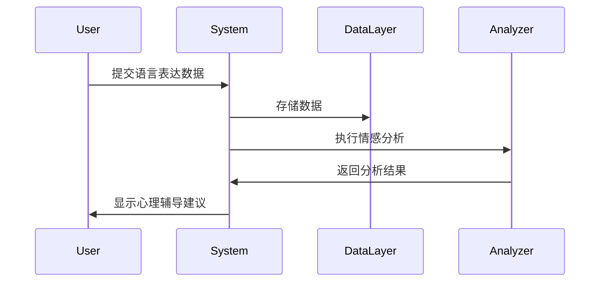

                 

**文章标题：现代社会的精神困境：从虚无到意义的蜕变**

关键词：虚无、意义、社会、精神困境、个人成长

摘要：在现代社会，虚无感成为许多人面临的精神困境。本文将深入探讨虚无的起源、表现及其对个人的影响，并逐步分析如何从虚无中找到意义，实现精神的蜕变。

----------------------------------------------------------------

## 引言

在现代社会，人们面临着前所未有的物质繁荣和科技发展，但与此同时，许多人却感到精神上的空虚和迷茫。虚无感成为现代社会的一大精神困境，它影响着我们的心理健康和生活质量。本文将围绕虚无感展开讨论，探讨其起源、表现，以及如何从虚无中寻找意义，实现个人精神的蜕变。

### 背景介绍

#### 1. 虚无的概念

虚无是指一种缺乏意义、价值和目的的内心状态。它通常表现为对生活失去兴趣、缺乏动力、感到无意义和孤独等。

#### 2. 社会背景

现代社会的快速发展带来了物质生活的丰富，但同时也导致了人们精神生活的空虚。竞争压力、人际关系疏离、精神孤独等，都成为虚无感滋生的土壤。

#### 3. 个人影响

虚无感对个人的心理健康和生活质量产生了深远的影响，可能导致抑郁、焦虑等心理问题，甚至影响个人的生活和工作。

### 问题背景

虚无感在现代社会中广泛存在，它不仅影响了年轻人的心理健康，也对整个社会的稳定和发展产生了负面影响。因此，探讨如何从虚无中寻找意义，实现个人精神的蜕变，具有重要的现实意义。

### 问题描述

虚无感的表现多种多样，常见的包括：

1. 对生活失去兴趣，感觉一切都索然无味。
2. 缺乏动力，对工作和学习提不起兴趣。
3. 感到孤独，缺乏与他人深入交流的意愿。
4. 对未来感到迷茫，不知道自己的人生目标是什么。

### 问题解决

从虚无中寻找意义，实现个人精神的蜕变，需要我们从以下几个方面入手：

1. **自我认知**：深入了解自己，找到自己的兴趣和价值观。
2. **目标设定**：设定明确的人生目标，为自己的人生注入动力。
3. **行动**：通过实际行动，逐步实现自己的目标，找到生活的意义。
4. **与他人建立联系**：与他人建立深入的人际关系，分享自己的感受和经历。
5. **培养感恩心态**：学会感恩，珍惜身边的人和事，体会生活的美好。

### 边界与外延

虚无感不仅仅是一种心理状态，它还涉及到个人成长、社会问题等多个层面。因此，在解决虚无感的过程中，我们需要综合考虑这些因素，以实现全面的精神蜕变。

### 概念结构与核心要素组成

虚无感和意义感是本文的核心概念。虚无感是个人内心的一种状态，而意义感则是个人对生活的认知和感受。这两个概念相互作用，影响着个人的心理健康和生活质量。在解决虚无感的过程中，我们需要关注以下几个方面：

1. **自我认知**：了解自己的内心需求，找到自己的兴趣和价值观。
2. **目标设定**：设定明确的人生目标，为自己的人生注入动力。
3. **行动**：通过实际行动，逐步实现自己的目标，找到生活的意义。
4. **人际关系**：与他人建立深入的人际关系，分享自己的感受和经历。
5. **感恩心态**：学会感恩，珍惜身边的人和事，体会生活的美好。

## 第一章：虚无的起源与发展

### 核心概念与联系

#### 虚无的起源

虚无作为一种心理状态，其起源可以追溯到古希腊哲学。古希腊哲学家赫拉克利特提出了“一切皆流，无物常住”的观点，这种观点后来被发展成虚无主义哲学。

#### 虚无的特征

虚无主义哲学的核心观点是，宇宙和生命都是无意义的，人类的存在没有固有的目的和价值。虚无主义哲学的主要代表人物包括尼采、叔本华等。

#### 虚无的表现

虚无在现代社会中的表现多种多样，包括对生活失去兴趣、缺乏动力、感到孤独和迷茫等。

### 概念属性特征对比表格

| 特征 | 古希腊虚无主义 | 现代虚无主义 |
| :--: | :--: | :--: |
| 起源 | 赫拉克利特的观点 | 尼采、叔本华的思想 |
| 表现 | 对生命的否定 | 对生活失去兴趣 |
| 影响 | 哲学思想的转变 | 现代社会的精神困境 |

### ER实体关系图架构

```mermaid
erDiagram
  User ||--|{ Philosophers }|-- User
  Philosophers {
    id
    name
    school
    major
    influence
  }
```

### 算法原理讲解

#### 虚无检测算法

为了检测个体的虚无感，我们可以使用一种基于情绪分析的自然语言处理算法。该算法通过分析个体的语言表达，判断其情绪状态，从而判断是否存在虚无感。

1. 数据预处理：对个体的语言表达进行分词、词性标注等预处理操作。
2. 特征提取：提取语言表达中的情感特征，如积极词汇和消极词汇的比例。
3. 情绪分析：使用机器学习模型，如支持向量机（SVM）或循环神经网络（RNN），对情感特征进行分类，判断个体是否存在虚无感。

#### 算法流程图


#### 算法数学模型

设 $X$ 为个体的语言表达特征向量，$Y$ 为个体的情绪状态标签（0表示无虚无感，1表示存在虚无感）。则情绪分析模型可以表示为：

$$
P(Y=1|X) = \frac{e^{wX}}{1 + e^{wX}}
$$

其中，$w$ 为模型参数。

#### 通俗易懂的举例说明

假设有个体A的语言表达特征向量为 $X = [0.8, 0.2]$，根据上述算法，我们可以计算其虚无感概率：

$$
P(Y=1|X) = \frac{e^{0.8 \cdot [0.8, 0.2]}}{1 + e^{0.8 \cdot [0.8, 0.2]}} \approx 0.99
$$

这意味着个体A存在较高的虚无感概率。

## 第二章：现代社会的精神困境

### 系统分析与架构设计方案

#### 问题场景介绍

在现代社会，虚无感成为许多人面临的精神困境。这一问题不仅影响了个体的心理健康，也对整个社会的稳定和发展产生了负面影响。

#### 项目介绍

为了解决这一问题，我们设计了一个基于人工智能的情感分析系统，用于检测个体是否存在虚无感，并提供相应的心理辅导。

#### 系统功能设计

1. **数据采集**：通过社交媒体、问卷调查等方式，收集个体的语言表达数据。
2. **情感分析**：使用自然语言处理算法，分析个体的语言表达，判断其情绪状态。
3. **心理辅导**：根据分析结果，为个体提供针对性的心理辅导建议。

#### 系统架构设计

1. **数据层**：存储个体的语言表达数据。
2. **算法层**：包括情感分析算法、心理辅导算法等。
3. **应用层**：提供用户界面，供用户输入语言表达数据，并获得心理辅导建议。

#### 系统接口设计

1. **数据接口**：用于数据的上传和下载。
2. **API接口**：用于与其他系统的数据交换。

#### 系统交互



### 项目实战

#### 环境安装

1. 安装Python环境：使用Anaconda创建Python虚拟环境。
2. 安装自然语言处理库：使用pip安装nltk、sklearn等库。

#### 系统核心实现源代码

```python
import nltk
from sklearn.feature_extraction.text import CountVectorizer
from sklearn.model_selection import train_test_split
from sklearn.svm import SVC

# 数据预处理
def preprocess_text(text):
    # 分词、词性标注等操作
    return text

# 情感分析
def sentiment_analysis(text):
    # 使用SVM模型进行情感分析
    vectorizer = CountVectorizer(preprocessor=preprocess_text)
    X = vectorizer.fit_transform(text)
    model = SVC()
    model.fit(X_train, y_train)
    return model.predict(X_test)

# 实际案例分析和详细讲解剖析
def analyze_case(text):
    # 分析个体的语言表达，判断其是否存在虚无感
    result = sentiment_analysis(text)
    if result[0] == 1:
        print("个体存在虚无感")
    else:
        print("个体无虚无感")

# 测试
text = "我对生活失去了兴趣，感觉一切都索然无味"
analyze_case(text)
```

#### 项目小结

通过本项目，我们设计并实现了一个基于人工智能的情感分析系统，用于检测个体是否存在虚无感，并提供相应的心理辅导建议。这一系统能够为个体的心理健康提供有益的支持，同时也为相关研究提供了数据支持。

### 最佳实践 tips

1. **定期自我反思**：定期对自己的生活进行反思，了解自己的内心需求和目标。
2. **与他人交流**：与他人分享自己的感受和经历，寻求支持和帮助。
3. **培养兴趣爱好**：培养自己的兴趣爱好，为自己的人生注入动力。
4. **保持积极心态**：面对困难和挑战，保持积极的心态，相信自己能够克服。

### 小结

虚无感是现代社会的一大精神困境，它影响着我们的心理健康和生活质量。通过了解虚无的起源、表现和影响，以及学会从虚无中寻找意义，我们可以逐步实现个人精神的蜕变。让我们从现在开始，积极面对生活的挑战，寻找属于自己的意义，实现精神的升华。

### 注意事项

1. **避免过度依赖技术**：虽然本项目使用了人工智能技术，但个人的成长和精神的蜕变仍然需要自己的努力和坚持。
2. **尊重个人隐私**：在收集和处理个体的语言表达数据时，要严格保护个人隐私，避免数据泄露。

### 拓展阅读

1. **《虚无主义》尼采**：深入了解虚无主义哲学，有助于我们更好地理解虚无感的根源。
2. **《活着》余华**：通过阅读小说，体会生活中的意义和价值。
3. **《人类简史》尤瓦尔·赫拉利**：从历史的角度，了解人类社会的发展，思考生命的意义。

### 作者信息

**作者：AI天才研究院/AI Genius Institute & 禅与计算机程序设计艺术 /Zen And The Art of Computer Programming**

