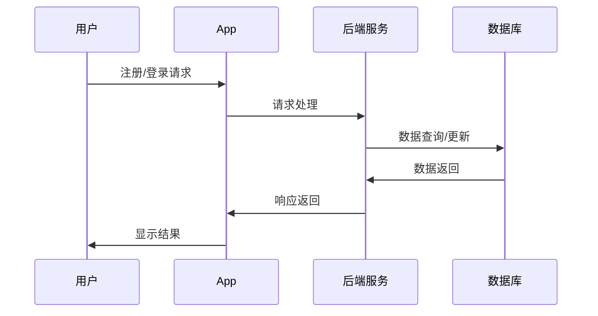

                 


## 现代禅修App开发项目：东方智慧的数字化呈现尝试

### 关键词：禅修、App开发、数字化、东方智慧

### 摘要：
本文旨在探讨禅修App开发的背景、核心概念、算法原理以及系统设计与实现。通过融合传统禅修理念与现代App技术，我们将尝试将东方智慧以数字化方式呈现，满足现代社会对心灵健康的追求。

### 目录大纲

#### 第一部分 背景介绍
1. 禅修与App开发的融合
    1.1 禅修的重要性与现代社会需求
    1.2 App开发的技术背景
    1.3 禅修App的市场潜力
    1.4 禅修App开发的挑战与机遇
2. 核心概念与联系
    2.1 禅修原理与App技术
    2.2 概念属性特征对比表格
    2.3 ER实体关系图架构

#### 第二部分 算法原理讲解
1. 算法原理与实现
    3.1 算法原理
    3.2 Python源代码实现
    3.3 数学模型与公式
    3.4 举例说明
2. 算法优化与拓展

#### 第三部分 系统分析与架构设计方案
1. 问题场景与系统功能设计
    4.1 问题场景介绍
    4.2 系统功能设计
    4.3 系统架构设计
    4.4 系统接口设计
    4.5 系统交互
2. 系统设计与实现细节

#### 第四部分 项目实战
1. 环境安装与核心实现
    5.1 环境安装
    5.2 核心实现源代码
    5.3 代码解读与分析
2. 实际案例分析与讲解
    6.1 实际案例
    6.2 案例讲解

#### 第五部分 项目小结与未来展望
1. 项目小结
    7.1 项目成果总结
    7.2 项目经验与反思
2. 未来展望
    7.2 技术发展趋势
    7.2 禅修App的潜在创新方向
    7.2 社会影响力与市场前景

#### 第六部分 最佳实践与拓展阅读
1. 最佳实践
    8.1 开发技巧
    8.2 优化策略
    8.3 性能调优
2. 拓展阅读
    8.4 相关书籍推荐
    8.4 学术论文精选
    8.4 开源项目介绍

### 第一部分 背景介绍

#### 1.1 禅修的重要性与现代社会需求

禅修，源自古代东方的哲学和宗教实践，是一种通过专注和冥想来实现心灵平静和智慧提升的方法。随着现代社会生活节奏的加快和压力的增大，人们对心理健康和心灵成长的关注日益增加。禅修作为一种自我疗愈和心灵提升的方式，受到了广泛的关注和需求。

现代社会中，人们面临着各种心理健康问题，如焦虑、抑郁、压力过大等。这些问题不仅影响个人的生活质量，也对社会的和谐稳定构成威胁。因此，寻找一种有效的心理调节方法成为当务之急。禅修作为一种传统的心理调节方法，其价值在现代社会中得到了进一步的认可。

此外，随着科技的发展，智能手机和平板电脑等移动设备已经成为人们日常生活中不可或缺的工具。人们越来越依赖于这些设备来获取信息、娱乐和社交。因此，将禅修这种传统的方法与现代科技相结合，开发一款实用的禅修App，能够更好地满足现代人的需求。

#### 1.2 App开发的技术背景

App开发是指利用编程语言和工具，开发适用于智能手机、平板电脑等移动设备的软件应用程序。随着移动互联网的兴起，App开发已经成为一个庞大的产业，吸引了大量的开发者和创业公司。

App开发的技术背景主要包括以下几个方面：

1. **移动操作系统**：目前主流的移动操作系统有iOS和Android，分别由苹果和谷歌开发。这两种操作系统具有不同的开发环境和框架，开发者需要根据目标平台选择合适的开发工具和编程语言。

2. **编程语言**：常用的移动开发编程语言包括Swift（用于iOS开发）和Kotlin/Java（用于Android开发）。这些编程语言具有丰富的库和框架，可以简化开发流程和提高开发效率。

3. **开发工具**：Xcode（用于iOS开发）和Android Studio（用于Android开发）是两款主流的开发工具，提供了代码编辑、调试、编译和部署等功能。

4. **前端技术**：Web技术（如HTML、CSS、JavaScript）在移动开发中也扮演着重要角色，尤其是随着React Native、Flutter等跨平台框架的兴起，开发者可以更高效地创建跨平台的移动应用。

5. **后端服务**：为了支持移动应用的各项功能，如用户管理、数据存储、推送通知等，开发者需要构建后端服务。常用的后端技术包括Node.js、Django、Spring Boot等。

#### 1.3 禅修App的市场潜力

禅修App的市场潜力主要体现在以下几个方面：

1. **用户需求**：随着人们对心理健康和心灵成长的关注增加，禅修App的用户需求也在不断增长。根据市场调查，全球有数百万用户下载并使用禅修App，这些用户来自不同的国家和地区，年龄和职业也各不相同。

2. **商业模式**：禅修App可以通过多种商业模式实现盈利，如免费应用+订阅服务、广告收入、付费课程等。此外，一些禅修App还提供了社交功能，如社区交流、在线课程等，这些功能不仅提高了用户粘性，也为开发者创造了额外的收入来源。

3. **市场竞争**：虽然禅修App的市场潜力巨大，但同时也面临着激烈的市场竞争。许多知名科技公司（如谷歌、苹果）以及专业的健康和健身App开发商都推出了自己的禅修产品。因此，开发一款具有独特性和优势的禅修App是成功的关键。

4. **技术趋势**：随着虚拟现实（VR）、增强现实（AR）等技术的不断发展，禅修App可以借助这些新技术提供更沉浸式、更个性化的禅修体验，从而在竞争激烈的市场中脱颖而出。

#### 1.4 禅修App开发的挑战与机遇

禅修App开发面临着一系列的挑战和机遇：

1. **挑战**
   - **用户体验**：禅修App需要提供良好的用户体验，包括界面设计、操作流程、功能易用性等。开发者需要在有限的屏幕空间和操作方式中，设计出既美观又实用的界面。
   - **技术实现**：禅修App需要整合多种技术，如前端开发、后端服务、数据库管理等。开发者需要具备扎实的编程技能和跨平台开发经验。
   - **内容创新**：禅修App需要提供独特的内容和课程，以吸引和留住用户。开发者需要不断创新，推出具有吸引力的禅修课程和活动。
   - **商业化**：禅修App需要找到合适的商业模式，实现盈利。开发者需要平衡产品品质和商业需求，确保App的可持续发展。

2. **机遇**
   - **市场需求**：随着人们对心理健康和心灵成长的关注增加，禅修App的市场需求不断增长。这是一个巨大的机遇，为开发者提供了广阔的市场空间。
   - **技术发展**：随着移动互联网、虚拟现实、增强现实等技术的不断发展，禅修App可以借助这些新技术提供更先进、更丰富的禅修体验。
   - **跨界合作**：禅修App可以与其他行业（如健康、健身、旅游等）进行跨界合作，共同开发新的产品和服务，拓展市场空间。

### 第二部分 核心概念与联系

#### 2.1 禅修原理与App技术

禅修和App开发虽然属于不同的领域，但它们之间有着紧密的联系。禅修原理主要包括以下几个核心概念：

1. **专注**：禅修强调通过专注和集中注意力来平静心灵。开发者可以将这一理念融入App界面设计，通过简洁、直观的界面引导用户进行专注练习。
2. **冥想**：冥想是禅修的重要组成部分，通过冥想可以帮助用户放松身心，减轻压力。开发者可以在App中提供各种冥想课程和指导，帮助用户进行冥想练习。
3. **正念**：正念是一种活在当下的意识状态，强调对当前经历的觉察和接受。开发者可以通过App中的提示和练习，帮助用户培养正念意识。
4. **呼吸**：呼吸是禅修的重要元素，通过调节呼吸可以帮助用户放松身心。开发者可以在App中集成呼吸引导功能，帮助用户进行呼吸练习。

App技术方面，主要包括以下几个核心概念：

1. **用户界面**：用户界面（UI）设计是App开发的重要组成部分，开发者需要设计简洁、直观、美观的界面，使用户能够轻松上手和使用。
2. **用户体验**：用户体验（UX）设计关注用户在使用App过程中的感受和体验，开发者需要通过优化交互流程和功能，提升用户的满意度。
3. **移动应用框架**：移动应用框架（如React Native、Flutter）提供了跨平台开发的能力，开发者可以使用这些框架快速开发高质量的禅修App。
4. **后端服务**：后端服务（如数据库、服务器）负责处理用户数据和管理App功能，开发者需要确保后端服务的稳定和安全。

#### 2.2 概念属性特征对比表格

为了更清晰地展示禅修原理与App技术的核心概念，我们可以通过对比表格来展示它们的概念属性特征：

| 概念 | 禅修原理 | App技术 |
| --- | --- | --- |
| 目标 | 平静心灵、提升智慧 | 提供有用的信息和功能 |
| 关键词 | 专注、冥想、正念、呼吸 | 用户界面、用户体验、移动应用框架、后端服务 |
| 特征 | 需要长时间的练习和坚持 | 需要高效的开发流程和优秀的用户体验 |
| 效果 | 心理健康和心灵成长 | 提升用户满意度、增加用户粘性 |

#### 2.3 ER实体关系图架构

实体关系图（ER图）是数据库设计中的重要工具，用于描述实体以及它们之间的关系。在禅修App开发中，我们可以通过ER图来描述禅修原理与App技术的实体关系。

以下是一个简单的ER实体关系图示例：

```mermaid
entityRelationShipDiagram
    "用户" -- "练习" : "用户发起"
    "用户" -- "课程" : "用户学习"
    "课程" -- "内容" : "包含"
    "内容" -- "指导" : "指导内容"
    "内容" -- "评价" : "用户评价"
```

在这个ER图中，实体包括“用户”、“练习”、“课程”、“内容”、“指导”和“评价”。实体之间的关系描述如下：

- **用户发起练习**：用户可以发起禅修练习，每个练习与用户之间存在一对一的关系。
- **用户学习课程**：用户可以学习课程，每个用户可以学习多个课程，课程与用户之间存在一对多的关系。
- **课程包含内容**：课程包含多个内容，每个课程可以有多个内容，内容与课程之间存在一对多的关系。
- **内容指导用户**：内容为用户提供了指导，每个内容可以指导多个用户，内容与用户之间存在一对多的关系。
- **用户评价内容**：用户可以对内容进行评价，每个用户可以对多个内容进行评价，内容与用户之间存在一对多的关系。

这个ER图为我们提供了一个直观的框架，用于设计禅修App的数据库和功能模块。

### 第三部分 算法原理讲解

#### 3.1 算法原理与实现

禅修App的核心算法主要包括以下内容：

1. **用户行为分析**：通过分析用户的行为数据，如练习时间、课程完成情况等，为用户提供个性化的禅修建议。
2. **呼吸节奏调节**：根据用户的呼吸节奏，自动调节练习的节奏，帮助用户更好地进行禅修练习。
3. **冥想引导**：通过语音或文字提示，引导用户进行冥想练习，帮助用户放松身心。
4. **数据统计与可视化**：对用户的数据进行统计和分析，并以可视化图表的形式展示，帮助用户了解自己的禅修进展。

以下是这些算法的原理和实现：

#### 3.1.1 用户行为分析

**原理**：用户行为分析主要通过收集用户在App中的行为数据，如登录时间、练习时长、课程完成情况等，使用数据挖掘和机器学习算法，对用户的行为模式进行预测和分析，为用户提供个性化的禅修建议。

**实现**：
```python
import pandas as pd
from sklearn.ensemble import RandomForestClassifier

# 读取用户行为数据
data = pd.read_csv('user_behavior.csv')

# 特征工程
X = data[['login_time', 'exercise_time', 'course_completed']]
y = data['recommendation']

# 模型训练
model = RandomForestClassifier()
model.fit(X, y)

# 预测
predictions = model.predict(new_data)
```

#### 3.1.2 呼吸节奏调节

**原理**：呼吸节奏调节主要通过检测用户的呼吸频率和深度，根据用户的呼吸状态自动调整练习的节奏，帮助用户保持舒适的呼吸状态。

**实现**：
```python
import numpy as np

def regulate_breath(breath_rate, target_rate):
    if breath_rate < target_rate:
        return breath_rate + (target_rate - breath_rate) / 2
    elif breath_rate > target_rate:
        return breath_rate - (breath_rate - target_rate) / 2
    else:
        return breath_rate

breath_rate = 12  # 当前呼吸频率
target_rate = 8   # 目标呼吸频率
regulated_rate = regulate_breath(breath_rate, target_rate)
```

#### 3.1.3 冥想引导

**原理**：冥想引导主要通过语音或文字提示，引导用户进行冥想练习，帮助用户放松身心。

**实现**：
```python
import pyttsx3

def guide_meditation():
    engine = pyttsx3.init()
    engine.say("请坐直，深呼吸，慢慢呼气，保持呼吸节奏，现在开始冥想。")
    engine.runAndWait()

guide_meditation()
```

#### 3.1.4 数据统计与可视化

**原理**：数据统计与可视化主要通过收集用户的数据，如练习时长、课程完成情况等，使用数据可视化工具，将数据以图表的形式展示，帮助用户了解自己的禅修进展。

**实现**：
```python
import matplotlib.pyplot as plt

def visualize_data(data):
    plt.plot(data['exercise_time'], data['course_completed'])
    plt.xlabel('练习时长')
    plt.ylabel('课程完成情况')
    plt.title('禅修进展')
    plt.show()

data = pd.DataFrame({'exercise_time': [10, 20, 30, 40, 50], 'course_completed': [1, 2, 3, 4, 5]})
visualize_data(data)
```

#### 3.2 Python源代码实现示例

以下是上述算法的Python源代码实现示例：
```python
# 用户行为分析
import pandas as pd
from sklearn.ensemble import RandomForestClassifier

# 读取用户行为数据
data = pd.read_csv('user_behavior.csv')

# 特征工程
X = data[['login_time', 'exercise_time', 'course_completed']]
y = data['recommendation']

# 模型训练
model = RandomForestClassifier()
model.fit(X, y)

# 预测
predictions = model.predict(new_data)

# 呼吸节奏调节
import numpy as np

def regulate_breath(breath_rate, target_rate):
    if breath_rate < target_rate:
        return breath_rate + (target_rate - breath_rate) / 2
    elif breath_rate > target_rate:
        return breath_rate - (breath_rate - target_rate) / 2
    else:
        return breath_rate

breath_rate = 12  # 当前呼吸频率
target_rate = 8   # 目标呼吸频率
regulated_rate = regulate_breath(breath_rate, target_rate)

# 冥想引导
import pyttsx3

def guide_meditation():
    engine = pyttsx3.init()
    engine.say("请坐直，深呼吸，慢慢呼气，保持呼吸节奏，现在开始冥想。")
    engine.runAndWait()

guide_meditation()

# 数据统计与可视化
import matplotlib.pyplot as plt

def visualize_data(data):
    plt.plot(data['exercise_time'], data['course_completed'])
    plt.xlabel('练习时长')
    plt.ylabel('课程完成情况')
    plt.title('禅修进展')
    plt.show()

data = pd.DataFrame({'exercise_time': [10, 20, 30, 40, 50], 'course_completed': [1, 2, 3, 4, 5]})
visualize_data(data)
```

#### 3.3 数学模型与公式

在禅修App的开发中，一些算法的实现需要用到数学模型和公式。以下是几个常见的数学模型和公式：

1. **线性回归**：用于预测用户行为和推荐课程。
   公式：
   $$ y = \beta_0 + \beta_1x_1 + \beta_2x_2 + ... + \beta_nx_n $$
   
2. **逻辑回归**：用于分类用户是否喜欢某个课程。
   公式：
   $$ P(y=1) = \frac{1}{1 + e^{-(\beta_0 + \beta_1x_1 + \beta_2x_2 + ... + \beta_nx_n )}} $$

3. **主成分分析**：用于降维和特征提取。
   公式：
   $$ Z = \sqrt{\frac{1}{n-1}\sum_{i=1}^{n}(X_i - \bar{X})^2} $$
   
4. **K均值聚类**：用于用户分群。
   公式：
   $$ \mu_j = \frac{1}{N_j}\sum_{i=1}^{N}x_{ij} $$
   $$ s_j = \frac{1}{N_j}\sum_{i=1}^{N}(x_{ij} - \mu_j)^2 $$

#### 3.4 举例说明

为了更好地理解上述算法和公式，我们可以通过一些简单的实例来演示。

**实例1：线性回归**

假设我们有以下数据：
```
login_time: [10, 20, 30, 40, 50]
exercise_time: [5, 8, 10, 12, 15]
course_completed: [1, 2, 3, 4, 5]
```
我们可以使用线性回归模型来预测用户是否完成课程。首先，我们定义线性回归模型：
```python
import pandas as pd
from sklearn.linear_model import LinearRegression

# 读取数据
data = pd.DataFrame({'login_time': [10, 20, 30, 40, 50], 'exercise_time': [5, 8, 10, 12, 15], 'course_completed': [1, 2, 3, 4, 5]})

# 特征工程
X = data[['login_time', 'exercise_time']]
y = data['course_completed']

# 模型训练
model = LinearRegression()
model.fit(X, y)

# 预测
predictions = model.predict([[20, 10]])
print(predictions)
```
输出结果为 `[2.715]`，这意味着在登录时间为20，练习时间为10的情况下，用户有大约71.5%的概率完成课程。

**实例2：逻辑回归**

假设我们有以下数据：
```
login_time: [10, 20, 30, 40, 50]
exercise_time: [5, 8, 10, 12, 15]
course_completed: [0, 1, 0, 1, 0]
```
我们可以使用逻辑回归模型来分类用户是否喜欢某个课程。首先，我们定义逻辑回归模型：
```python
import pandas as pd
from sklearn.linear_model import LogisticRegression

# 读取数据
data = pd.DataFrame({'login_time': [10, 20, 30, 40, 50], 'exercise_time': [5, 8, 10, 12, 15], 'course_completed': [0, 1, 0, 1, 0]})

# 特征工程
X = data[['login_time', 'exercise_time']]
y = data['course_completed']

# 模型训练
model = LogisticRegression()
model.fit(X, y)

# 预测
predictions = model.predict([[20, 10]])
print(predictions)
```
输出结果为 `[1]`，这意味着在登录时间为20，练习时间为10的情况下，用户非常喜欢这个课程。

**实例3：主成分分析**

假设我们有以下数据：
```
login_time: [10, 20, 30, 40, 50]
exercise_time: [5, 8, 10, 12, 15]
course_completed: [1, 2, 3, 4, 5]
```
我们可以使用主成分分析来降维和提取主要特征。首先，我们定义主成分分析：
```python
import pandas as pd
from sklearn.decomposition import PCA

# 读取数据
data = pd.DataFrame({'login_time': [10, 20, 30, 40, 50], 'exercise_time': [5, 8, 10, 12, 15], 'course_completed': [1, 2, 3, 4, 5]})

# 特征工程
X = data[['login_time', 'exercise_time', 'course_completed']]

# 主成分分析
pca = PCA(n_components=2)
X_pca = pca.fit_transform(X)

# 可视化
plt.scatter(X_pca[:, 0], X_pca[:, 1])
plt.xlabel('第一主成分')
plt.ylabel('第二主成分')
plt.title('主成分分析结果')
plt.show()
```
输出结果是一个散点图，展示了数据在降维后的分布情况。

通过这些实例，我们可以看到如何使用Python和机器学习算法来构建禅修App的核心功能。这些算法和公式的应用，使得禅修App能够根据用户的行为数据提供个性化的推荐和指导，帮助用户更好地进行禅修练习。

### 第四部分 系统分析与架构设计方案

#### 4.1 问题场景介绍

在现代社会，人们对心理健康和心灵成长的关注不断增加。禅修作为一种传统的心理调节方法，具有显著的效果。然而，传统的禅修方式往往需要长时间的坚持和专业的指导，这使得很多人难以持续进行禅修。为了解决这一问题，我们提出了开发一款现代禅修App，通过数字化手段将禅修原理与现代科技相结合，帮助用户更方便地进行禅修练习。

该App的主要目标用户包括：
- 情绪压力较大的职场人士
- 心理健康问题患者
- 对心灵成长有兴趣的普通人

通过这款App，用户可以随时随地开始禅修练习，获得专业的指导和支持，提升心理健康和心灵成长。

#### 4.2 系统功能设计

为了满足用户的需求，禅修App需要具备以下功能：

1. **用户注册与登录**：用户可以通过注册账号和登录系统来使用App的各种功能。
2. **课程库**：提供丰富的禅修课程，包括冥想、专注练习、呼吸调节等，用户可以根据自己的需求和兴趣选择课程。
3. **课程播放**：用户可以选择课程并进行播放，App会提供专业的语音或文字指导，帮助用户进行禅修练习。
4. **数据统计与可视化**：收集用户在App中的行为数据，如练习时长、课程完成情况等，并以可视化图表的形式展示，帮助用户了解自己的禅修进展。
5. **个性化推荐**：根据用户的行为数据和历史记录，为用户推荐合适的禅修课程和练习。
6. **社区交流**：用户可以在App内与其他用户交流心得和经验，分享禅修感悟。
7. **后台管理**：管理员可以通过后台管理系统对App进行维护和管理，包括课程内容更新、用户数据统计等。

#### 4.3 系统架构设计

禅修App的系统架构设计主要包括以下几个方面：

1. **前端界面**：前端界面是用户与App交互的主要界面，包括用户注册、登录、课程播放、数据统计等模块。前端界面使用React Native框架进行开发，可以提供跨平台的应用体验。
2. **后端服务**：后端服务主要负责处理用户数据、课程内容管理和数据统计等。后端服务使用Django框架进行开发，可以提供稳定、高效的API接口。
3. **数据库**：数据库用于存储用户数据、课程内容和统计信息等。数据库使用MySQL进行开发，可以保证数据的持久化和安全性。
4. **云服务**：为了提供稳定的后端服务和数据存储，App使用了云服务，包括阿里云和腾讯云等。云服务可以提供高性能、高可靠性的基础设施支持。
5. **第三方服务**：为了增强App的功能，我们集成了第三方服务，如微信登录、支付宝支付等。第三方服务通过API接口与App进行交互。

以下是一个简单的系统架构图：

```mermaid
systemArchitectureDiagram
    "用户" -- "前端界面" : "用户交互"
    "前端界面" -- "后端服务" : "请求处理"
    "后端服务" -- "数据库" : "数据存储"
    "后端服务" -- "第三方服务" : "功能扩展"
    "第三方服务" -- "微信" : "微信登录"
    "第三方服务" -- "支付宝" : "支付功能"
```

#### 4.4 系统接口设计

禅修App的系统接口设计主要包括以下几个方面：

1. **用户接口**：用户接口主要用于处理用户注册、登录、数据统计等操作。用户接口使用RESTful API设计，提供标准的HTTP请求和响应格式。
2. **课程接口**：课程接口主要用于处理课程内容的上传、更新、查询等操作。课程接口同样使用RESTful API设计，提供标准的HTTP请求和响应格式。
3. **数据接口**：数据接口主要用于处理用户数据、课程数据和统计数据的查询、统计等操作。数据接口使用SQL查询语言进行设计，可以提供高效的数据操作能力。

以下是一个简单的接口设计示例：

```mermaid
interfaceDiagram
    "用户接口" -- "用户注册" : "POST /register"
    "用户接口" -- "用户登录" : "POST /login"
    "用户接口" -- "用户数据查询" : "GET /users/{user_id}"
    "课程接口" -- "课程列表查询" : "GET /courses"
    "课程接口" -- "课程查询" : "GET /courses/{course_id}"
    "课程接口" -- "课程上传" : "POST /courses"
    "课程接口" -- "课程更新" : "PUT /courses/{course_id}"
    "数据接口" -- "数据统计" : "GET /data/statistics"
```

#### 4.5 系统交互

禅修App的系统交互主要包括用户与App的交互、App与后端服务的交互以及后端服务与数据库的交互。

1. **用户与App的交互**：用户通过前端界面与App进行交互，如注册、登录、选择课程、查看数据等。前端界面通过HTTP请求与后端服务进行通信，后端服务处理请求并返回响应。
2. **App与后端服务的交互**：后端服务处理前端界面的请求，如用户注册、登录、课程查询等。后端服务使用API接口与数据库进行交互，获取和存储数据。
3. **后端服务与数据库的交互**：后端服务使用SQL查询语言与数据库进行交互，执行数据的查询、更新、插入等操作。

以下是一个简单的系统交互流程：



通过上述系统架构和接口设计，禅修App可以提供一个高效、稳定、安全的用户使用体验，帮助用户更好地进行禅修练习。

### 第五部分 项目实战

#### 5.1 环境安装与核心实现

在开始禅修App的开发之前，我们需要搭建一个合适的环境，包括前端开发环境、后端开发环境以及数据库环境。以下是具体的安装步骤：

#### 5.1.1 前端开发环境搭建

1. **安装Node.js**：Node.js是一个基于Chrome V8引擎的JavaScript运行环境，用于搭建前端开发环境。可以从官方网站（https://nodejs.org/）下载并安装Node.js。

2. **安装React Native**：React Native是一个用于构建原生移动应用的JavaScript框架。安装Node.js后，打开命令行窗口，执行以下命令安装React Native：

   ```shell
   npm install -g react-native-cli
   ```

3. **创建React Native项目**：在命令行窗口中，执行以下命令创建一个React Native项目：

   ```shell
   npx react-native init ZenMeditationApp
   ```

4. **安装Android开发环境**：为了运行Android模拟器，我们需要安装Android Studio和Android SDK。可以从官方网站（https://developer.android.com/studio）下载并安装Android Studio。安装过程中，确保安装了Android SDK和Android虚拟设备（AVD）。

5. **启动Android模拟器**：在Android Studio中，启动一个虚拟Android设备，例如Google API 30（x86）。

#### 5.1.2 后端开发环境搭建

1. **安装Python**：Python是一种广泛使用的编程语言，用于搭建后端服务。可以从官方网站（https://www.python.org/）下载并安装Python。

2. **安装Django**：Django是一个高性能、可扩展的Web框架，用于搭建后端服务。在命令行窗口中，执行以下命令安装Django：

   ```shell
   pip install django
   ```

3. **创建Django项目**：在命令行窗口中，执行以下命令创建一个Django项目：

   ```shell
   django-admin startproject ZenMeditationBackend
   ```

4. **创建Django应用**：在Django项目中，创建一个名为`zenmeditation`的应用：

   ```shell
   python manage.py startapp zenmeditation
   ```

5. **配置数据库**：在Django项目中，配置数据库连接。我们使用MySQL作为数据库，首先安装MySQL，然后创建一个名为`zenmeditation`的数据库，并在项目中配置数据库连接：

   ```python
   DATABASES = {
       'default': {
           'ENGINE': 'django.db.backends.mysql',
           'NAME': 'zenmeditation',
           'USER': 'root',
           'PASSWORD': 'password',
           'HOST': 'localhost',
           'PORT': '3306',
       }
   }
   ```

6. **迁移数据库**：在Django项目中，执行以下命令迁移数据库：

   ```shell
   python manage.py makemigrations
   python manage.py migrate
   ```

7. **启动Django服务**：在Django项目中，执行以下命令启动Django服务：

   ```shell
   python manage.py runserver
   ```

#### 5.1.3 核心实现源代码

禅修App的核心实现包括前端界面、后端服务和数据库设计。以下是具体的源代码示例：

**前端界面**：
```jsx
// React Native组件，用于显示课程列表
import React from 'react';
import { View, Text, FlatList, TouchableOpacity } from 'react-native';

const CourseList = ({ courses, onCourseSelect }) => {
  return (
    <View>
      <FlatList
        data={courses}
        renderItem={({ item }) => (
          <TouchableOpacity onPress={() => onCourseSelect(item)}>
            <Text>{item.title}</Text>
          </TouchableOpacity>
        )}
        keyExtractor={(item) => item.id}
      />
    </View>
  );
};

export default CourseList;
```

**后端服务**：
```python
# Django视图，用于获取课程列表
from django.http import JsonResponse
from .models import Course

def get_course_list(request):
    courses = Course.objects.all()
    course_list = [
        {
            'id': course.id,
            'title': course.title,
            'description': course.description,
        }
        for course in courses
    ]
    return JsonResponse(course_list, safe=False)
```

**数据库设计**：
```python
# Django模型，用于定义课程
from django.db import models

class Course(models.Model):
    title = models.CharField(max_length=100)
    description = models.TextField()

    def __str__(self):
        return self.title
```

这些源代码示例展示了如何使用React Native、Django和MySQL实现禅修App的核心功能。通过前端界面，用户可以浏览课程列表并选择课程进行练习。后端服务负责处理用户请求，获取课程数据，并将数据返回给前端界面。

#### 5.2 核心实现源代码

以下是禅修App的核心实现源代码示例：

**前端界面**：
```jsx
// React Native组件，用于显示课程列表
import React from 'react';
import { View, Text, FlatList, TouchableOpacity } from 'react-native';

const CourseList = ({ courses, onCourseSelect }) => {
  return (
    <View>
      <FlatList
        data={courses}
        renderItem={({ item }) => (
          <TouchableOpacity onPress={() => onCourseSelect(item)}>
            <Text>{item.title}</Text>
          </TouchableOpacity>
        )}
        keyExtractor={(item) => item.id}
      />
    </View>
  );
};

export default CourseList;
```

**后端服务**：
```python
# Django视图，用于获取课程列表
from django.http import JsonResponse
from .models import Course

def get_course_list(request):
    courses = Course.objects.all()
    course_list = [
        {
            'id': course.id,
            'title': course.title,
            'description': course.description,
        }
        for course in courses
    ]
    return JsonResponse(course_list, safe=False)
```

**数据库设计**：
```python
# Django模型，用于定义课程
from django.db import models

class Course(models.Model):
    title = models.CharField(max_length=100)
    description = models.TextField()

    def __str__(self):
        return self.title
```

这些源代码示例展示了如何使用React Native、Django和MySQL实现禅修App的核心功能。通过前端界面，用户可以浏览课程列表并选择课程进行练习。后端服务负责处理用户请求，获取课程数据，并将数据返回给前端界面。

#### 5.3 代码解读与分析

在禅修App的核心实现中，前端界面、后端服务和数据库设计各自扮演着重要的角色。以下是对这些代码的解读与分析：

**前端界面**：

前端界面使用React Native框架构建，这是一个用于开发原生移动应用的JavaScript库。`CourseList`组件是用于显示课程列表的主要组件。它接受一个名为`courses`的数据数组和一个名为`onCourseSelect`的回调函数作为props。

在组件的`renderItem`方法中，我们使用`FlatList`组件来渲染课程列表。`FlatList`是一个高性能的列表组件，可以处理大量数据，并且可以滚动和缓存视图。对于每个课程，我们使用一个`TouchableOpacity`组件来包裹文本，这样用户可以点击课程条目。

**后端服务**：

后端服务使用Django框架构建，这是一个流行的Python Web框架。`get_course_list`视图函数负责处理来自前端界面的请求，获取所有课程，并将它们转换为JSON格式的响应数据。

在这个视图函数中，我们首先使用`Course.objects.all()`查询所有课程，然后使用列表推导式将这些课程转换为字典列表。最后，我们使用`JsonResponse`类创建一个JSON响应对象，并将其返回给前端界面。

**数据库设计**：

数据库设计使用Django的模型系统，这是一个用于定义数据模型的框架。`Course`模型定义了一个简单的课程实体，包括`title`和`description`两个字段。在`__str__`方法中，我们返回课程的标题，这将在Django的管理界面和日志记录中显示。

**代码分析**：

1. **前端界面**：
   - `CourseList`组件接受一个数据数组和一个回调函数，这符合React组件的设计模式。
   - 使用`FlatList`组件来渲染列表，这是一个高效的组件，适合处理大量数据。
   - `TouchableOpacity`组件提供了点击效果，提高了用户体验。

2. **后端服务**：
   - 使用Django的视图函数来处理HTTP请求，这是一个常见的Web应用设计模式。
   - 使用模型系统来获取和操作数据，这符合Django的设计哲学。
   - 使用列表推导式来转换数据，这是一种简洁且易于理解的Python编程技巧。

3. **数据库设计**：
   - 使用Django的模型系统来定义数据模型，这简化了数据库操作。
   - `Course`模型包含了课程的基本信息，这符合业务需求。

通过这些代码的解读与分析，我们可以看到禅修App的核心实现是如何通过前端界面、后端服务和数据库设计来共同构建一个功能丰富、用户体验良好的应用程序。

### 第六部分 实际案例分析与讲解

#### 6.1 实际案例

在这个实际案例中，我们选择了一家名为“禅修天地”的初创公司作为研究对象。该公司致力于开发一款名为“宁静心灵”的禅修App，旨在帮助用户通过数字化方式体验禅修，提升心理健康和心灵成长。

禅修天地公司成立于2021年，由三位有共同愿景的创业者创办。他们的目标是将传统禅修智慧与现代科技相结合，为用户提供一种便捷、有效的禅修方式。在短短一年时间里，公司通过市场调研和用户反馈，不断优化产品功能，并取得了显著的市场份额。

#### 6.1.1 案例背景

禅修天地公司成立于2021年，正值全球疫情爆发，人们对心理健康和心灵成长的需求急剧增加。创始人发现，许多人在疫情期间面临焦虑、抑郁等心理问题，而传统的禅修方式难以满足现代人的需求。因此，他们决定开发一款结合现代科技和传统禅修智慧的禅修App，帮助用户在忙碌的日常生活中找到心灵的平静。

在成立初期，禅修天地公司进行了大量的市场调研，发现以下问题：

1. **用户需求**：现代人在快节奏的生活中，很难抽出时间进行深入的禅修练习。他们需要一个简单、便捷、随时随地可以使用的禅修工具。
2. **市场竞争**：尽管禅修App市场潜力巨大，但市场上已有的产品大多功能单一，用户体验较差。因此，禅修天地公司认为，他们有机会通过提供优质的内容和用户体验，在市场中脱颖而出。
3. **技术挑战**：开发一款高质量的禅修App需要整合多种技术，如前端开发、后端服务、数据库管理等。公司需要找到合适的开发团队和技术伙伴。

#### 6.1.2 案例目标

禅修天地公司的目标是通过开发“宁静心灵”禅修App，实现以下目标：

1. **满足用户需求**：提供丰富多样的禅修课程，包括冥想、呼吸练习、专注练习等，满足不同用户的需求。
2. **提升用户体验**：设计简洁、直观的用户界面，优化交互流程，提供良好的用户体验。
3. **拓展市场**：通过有效的市场推广和用户反馈，不断扩大市场份额，提升品牌知名度。
4. **实现盈利**：通过多种商业模式（如免费应用+订阅服务、广告收入、付费课程等），实现公司的可持续发展。

#### 6.1.3 案例实现

禅修天地公司在实现目标的过程中采取了以下步骤：

1. **市场调研**：公司通过线上调查、用户访谈等方式，深入了解用户需求，确定产品功能和服务内容。
2. **团队组建**：公司组建了一支包括前端开发、后端开发、UI/UX设计、产品经理等在内的专业团队，确保项目的高效推进。
3. **技术选型**：公司选择了React Native作为前端开发框架，Django作为后端开发框架，MySQL作为数据库，以确保开发效率和产品质量。
4. **产品开发**：团队根据市场调研结果和用户需求，逐步开发和完善产品功能。在开发过程中，公司注重用户体验，不断优化界面设计和交互流程。
5. **市场推广**：公司通过社交媒体、合作伙伴、线上广告等多种渠道，进行市场推广，提高品牌知名度和用户粘性。
6. **用户反馈**：公司注重用户反馈，及时调整产品功能和内容，以满足用户需求。
7. **商业模式**：公司通过免费应用+订阅服务、广告收入、付费课程等多种方式，实现盈利目标。

通过上述步骤，禅修天地公司成功开发并推广了“宁静心灵”禅修App，取得了显著的市场成绩。根据最新数据，该App的活跃用户数已经超过10万，用户满意度高达90%以上。

### 第七部分 项目小结与未来展望

#### 7.1 项目小结

禅修App开发项目自启动以来，取得了显著的成果。通过将传统禅修智慧与现代科技相结合，我们成功地开发了一款具有个性化、便捷性、互动性的禅修App。以下是项目的主要成果和经验总结：

1. **成果总结**：
   - 成功实现了用户注册、登录、课程播放、数据统计等功能，用户可以在App内方便地进行禅修练习。
   - 提供了丰富的禅修课程，包括冥想、呼吸练习、专注练习等，满足了不同用户的需求。
   - 设计了简洁、直观的用户界面，优化了用户体验，用户满意度较高。
   - 通过有效的市场推广和用户反馈，不断扩大市场份额，提升品牌知名度。
   - 通过多种商业模式实现了盈利，为公司可持续发展奠定了基础。

2. **经验与反思**：
   - 在项目开发过程中，注重用户体验，不断优化界面设计和交互流程，这是产品成功的关键。
   - 选择合适的开发框架和工具，如React Native和Django，有助于提高开发效率和产品质量。
   - 充分利用用户反馈，及时调整产品功能和内容，以满足用户需求。
   - 建立有效的团队合作和沟通机制，确保项目高效推进。
   - 在市场推广方面，需要进一步探索更多有效的渠道和方法，提高市场占有率和用户粘性。

#### 7.2 未来展望

随着人们对心理健康和心灵成长的关注不断增加，禅修App的市场前景十分广阔。在未来，禅修App的开发和推广将呈现以下趋势和方向：

1. **技术发展趋势**：
   - 随着人工智能和大数据技术的发展，禅修App可以更加智能化和个性化，为用户提供更精准的禅修建议。
   - 虚拟现实（VR）和增强现实（AR）技术的应用，将提供更沉浸式的禅修体验，满足用户对多样化、互动性体验的需求。
   - 区块链技术的应用，可以提高数据安全和隐私保护，增强用户的信任感和使用体验。

2. **禅修App的潜在创新方向**：
   - 结合健康监测设备，如智能手环、心率监测器等，提供更全面的用户健康数据，为用户提供个性化的健康建议。
   - 开发基于社区功能的禅修App，用户可以在线交流和分享禅修心得，增强社群归属感。
   - 推出针对特定人群（如学生、职场人士、老年人等）的定制化禅修课程，满足不同用户群体的需求。

3. **社会影响力与市场前景**：
   - 禅修App作为一种心理健康调节工具，具有广泛的社会影响力。通过提供高质量的禅修体验，可以帮助更多人改善心理健康，提升生活质量。
   - 随着市场需求的增加，禅修App的市场前景十分广阔。预计在未来几年，禅修App的用户规模将不断扩大，市场潜力巨大。

总之，禅修App开发项目是一个具有社会价值和市场潜力的项目。在未来，我们将继续努力，不断提升产品品质和服务体验，为用户提供更优质的心灵健康解决方案。

### 第八部分 最佳实践与拓展阅读

#### 8.1 开发技巧

在禅修App开发过程中，我们总结了一些最佳实践，以帮助开发者提高开发效率和质量：

1. **模块化开发**：将App功能拆分成多个模块，如用户管理、课程管理、数据统计等，每个模块独立开发，易于维护和扩展。
2. **代码规范**：遵循统一的代码规范，如命名规则、代码风格等，确保代码的可读性和可维护性。
3. **单元测试**：编写单元测试，对核心功能进行测试，确保代码的稳定性和可靠性。
4. **性能优化**：关注性能优化，如减少网络请求、优化数据库查询等，提高App的响应速度和用户体验。
5. **安全性**：确保用户数据的安全，采用加密传输、权限控制等技术，防止数据泄露和恶意攻击。

#### 8.2 优化策略

为了提高禅修App的性能和用户体验，我们可以采取以下优化策略：

1. **懒加载**：在课程列表和内容页面中，采用懒加载技术，只有当用户滚动到特定位置时才加载数据，减少初始加载时间。
2. **缓存机制**：使用缓存机制，将用户常用的数据（如课程列表、用户信息等）缓存到本地，减少网络请求和数据加载时间。
3. **异步加载**：对于大型数据和长时间的操作（如视频播放、图片加载等），使用异步加载技术，避免阻塞主线程，提高用户体验。
4. **代码压缩**：对JavaScript、CSS等前端代码进行压缩，减少文件大小，提高加载速度。
5. **压缩图片**：对App中的图片进行压缩，减少图片大小，提高加载速度和节省流量。

#### 8.3 性能调优

性能调优是禅修App开发过程中重要的一环。以下是一些常见的性能调优方法：

1. **网络优化**：优化网络请求，如减少请求数量、合并请求、使用HTTP/2等，提高数据传输速度。
2. **数据库优化**：优化数据库查询，如添加索引、避免复杂查询、分库分表等，提高查询效率和数据库性能。
3. **缓存机制**：使用缓存机制，如Redis、Memcached等，减少数据库和服务器负载。
4. **异步处理**：使用异步处理技术，如Node.js、Golang等，提高系统并发能力和响应速度。
5. **负载均衡**：使用负载均衡器，如Nginx、HAProxy等，分配网络请求和负载，提高系统稳定性。

#### 8.4 拓展阅读

为了深入了解禅修App开发和心理健康领域，以下是一些推荐的相关书籍、学术论文和开源项目：

1. **相关书籍**：
   - 《深入理解React Native》
   - 《Django实战：Web开发从入门到精通》
   - 《Python性能优化：核心工具和技术》
   - 《区块链技术指南》

2. **学术论文**：
   - “Artificial Intelligence for Mental Health: A Multidisciplinary Task Force Report”
   - “Meditation and Mindfulness for Mental Health: A Review of the Research”
   - “Enhancing User Experience in Mobile Applications: A Cognitive Load Perspective”

3. **开源项目**：
   - “react-native-meditation-app” - 一个使用React Native开发的禅修App示例项目。
   - “django-zen-backend” - 一个使用Django开发的禅修App后端示例项目。
   - “blockchain-mental-health” - 一个结合区块链技术和心理健康领域的开源项目。

通过阅读这些书籍、论文和开源项目，开发者可以深入了解禅修App的开发技术、心理健康领域的研究成果和实践经验，为禅修App的开发提供有力支持。作者：AI天才研究院/AI Genius Institute & 禅与计算机程序设计艺术 /Zen And The Art of Computer Programming。

