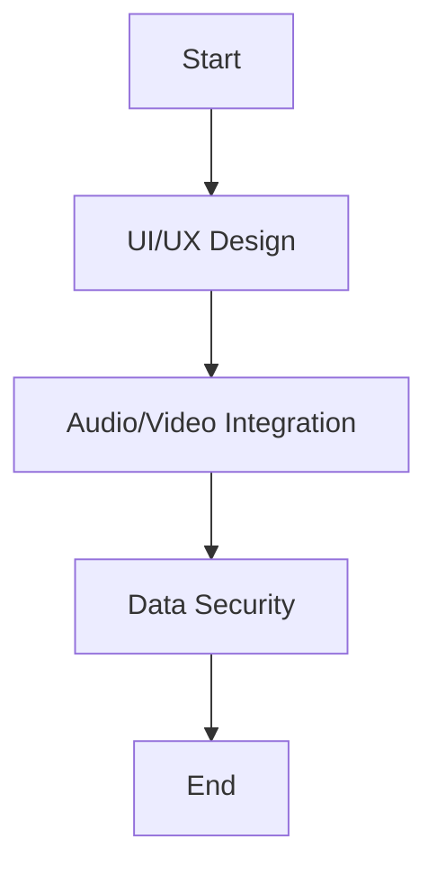
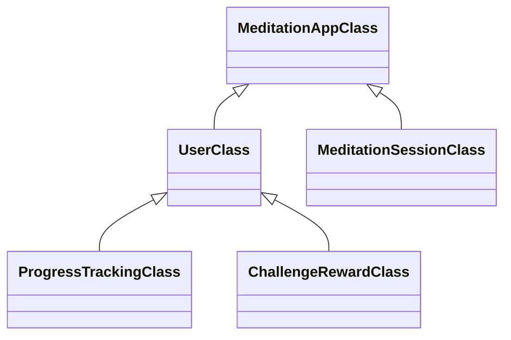
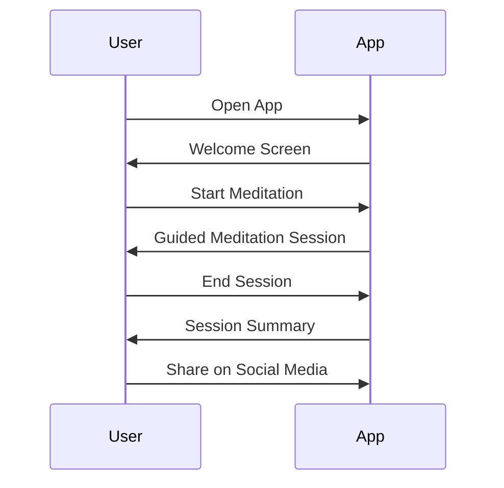
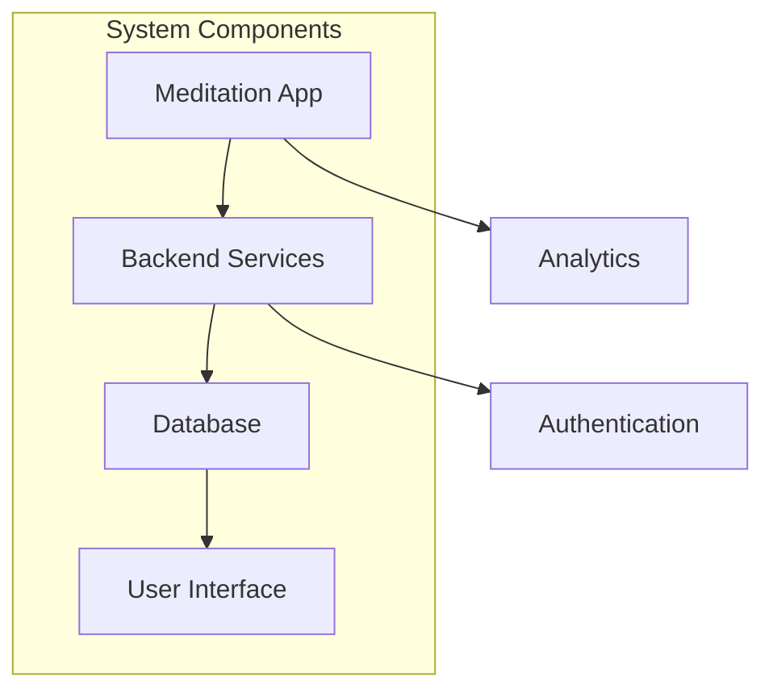
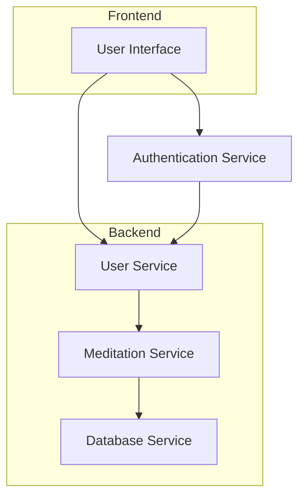
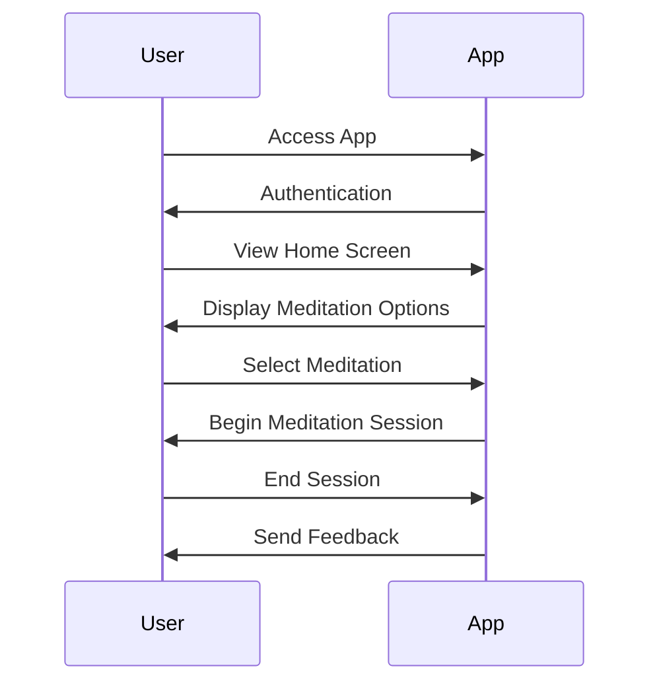

                 


### Article Structure and Content

#### Introduction

**Modern Meditation App Development: The Digital Presentation of Eastern Wisdom**

**Keywords**: Meditation, App Development, Eastern Wisdom, Digital Wellness, Mindfulness, User Experience.

**Abstract**: This comprehensive guide delves into the intersection of modern technology and ancient wisdom, focusing on the development of meditation apps that incorporate principles from Eastern philosophies. It explores the technical, design, and user-centric aspects of creating such apps, aiming to enhance digital wellness and mindfulness practices in the contemporary world.

---

#### Background and Core Concepts

##### 1.1 The Importance of Meditation in Modern Life
**Background**: With the increasing pace of modern life, stress and mental health issues have become prevalent. Meditation offers a natural solution to improve mental clarity, reduce stress, and enhance overall well-being.

**Problem Description**: While traditional meditation practices are widely recognized, not everyone has the time or resources to engage in them consistently.

**Solution**: The development of meditation apps can make these practices more accessible and sustainable.

**Boundary and Extension**:
- **Boundary**: This section focuses on the role of meditation in modern life.
- **Extension**: It can be expanded to include the impact of meditation on physical health, productivity, and relationships.

##### 1.2 The Integration of Eastern Wisdom in App Development
**Core Concept**: The integration of Eastern philosophies, such as Buddhism and Taoism, into meditation apps.

**Attribute Comparison Table**:
| Philosophy | Key Principles | Impact on App Development |
|------------|----------------|----------------------------|
| Buddhism   | Mindfulness, Compassion | Enhancing meditation techniques, stress reduction |
| Taoism     | Harmony, Naturalness | Design philosophy, user engagement |

**ER Diagram**:
```mermaid
erDiagram
  AppDeveloper --> MeditationApp : develops
  MeditationApp ||--|{ MeditationTechnique }|| : implements
  MeditationTechnique --> Philosophy : based_on
```

---

#### Technical Foundations

##### 2.1 Basic Principles of App Development
**Background**: Understanding the fundamental principles of app development is essential for creating a successful meditation app.

**Problem Description**: New developers may lack the necessary skills and knowledge to start building their apps.

**Solution**: This section provides an overview of the app development process, required skills, and tools.

**Boundary and Extension**:
- **Boundary**: Focus on the technical aspects of app development.
- **Extension**: Explore advanced topics like cloud services, AI integration, and cross-platform development.

##### 2.2 Technical Challenges in Developing Meditation Apps
**Core Concept**: Identifying and overcoming the technical challenges unique to meditation app development.

**Attribute Comparison Table**:
| Challenge | Solution | Impact |
|-----------|----------|--------|
| User Interface Design | Intuitive, calming interface | User satisfaction |
| Audio and Video Integration | High-quality, soothing audio and video | Enhanced meditation experience |
| User Data and Privacy | Secure data handling, compliance | Trust and credibility |

**Mermaid Flowchart**:


---

#### Designing Meditation Features

##### 3.1 Meditation Session Planning and Management
**Core Concept**: Designing features that allow users to plan and manage their meditation sessions effectively.

**Solution**:
- **Customizable Plans**: Users can create personalized meditation schedules.
- **Progress Tracking**: Users can track their meditation sessions and progress over time.
- **Challenges and Rewards**: Incentives to encourage consistent meditation practice.

**Mermaid Class Diagram**:


##### 3.2 Interactive Meditation Sessions
**Core Concept**: Enhancing user engagement through interactive meditation sessions.

**Solution**:
- **Guided Meditations**: Real-time guidance for meditation.
- **Community Features**: Social sharing and support.
- **Feedback Mechanisms**: User feedback to improve app features.

**Mermaid Sequence Diagram**:


---

#### System Analysis and Architecture Design

##### 4.1 System Overview
**Problem Description**: Developing a meditation app involves multiple components that need to work together seamlessly.

**Solution**: This section provides an overview of the system, including its functions, architecture, and interfaces.

**Mermaid Architecture Diagram**:


##### 4.2 Functional Design
**Problem Description**: Designing the functional components of the meditation app.

**Solution**: This section includes a detailed functional design, using a class diagram to represent the domain model.

**Mermaid Class Diagram**:
```mermaid
classDiagram
  User <<interface>>
  MeditationSession <<interface>>
  MeditationTechnique <<interface>>
  MeditationPlan <<interface>>
  Feedback <<interface>>
  ProgressTracking <<interface>>
  ChallengeReward <<interface>>
  Analytics <<interface>>
  Authentication <<interface>>
  User --|> MeditationSession
  User --|> MeditationTechnique
  User --|> MeditationPlan
  User --|> Feedback
  User --|> ProgressTracking
  User --|> ChallengeReward
  User --|> Analytics
  User --|> Authentication
```

##### 4.3 Architecture Design
**Problem Description**: Designing the overall architecture of the meditation app.

**Solution**: This section includes a high-level architecture diagram to illustrate the system's structure.

**Mermaid Architecture Diagram**:


##### 4.4 Interface and Interaction Design
**Problem Description**: Designing the user interface and interaction for the meditation app.

**Solution**: This section includes a sequence diagram to show the flow of user interactions with the app.

**Mermaid Sequence Diagram**:


---

#### Project Practice

##### 5.1 Environment Setup
**Problem Description**: Setting up the development environment for the meditation app.

**Solution**: This section provides step-by-step instructions for setting up the necessary tools and dependencies.

##### 5.2 Core System Implementation
**Problem Description**: Implementing the core functionalities of the meditation app.

**Solution**: This section includes detailed code examples and explanations for key components.

##### 5.3 Code Analysis and Explanation
**Problem Description**: Analyzing and explaining the code for the meditation app.

**Solution**: This section provides in-depth analysis and discussion of the implemented code.

##### 5.4 Case Study
**Problem Description**: Analyzing a real-world case study of a successful meditation app.

**Solution**: This section presents a case study and discusses the lessons learned and best practices.

##### 5.5 Project Conclusion
**Problem Description**: Summarizing the project and discussing future directions.

**Solution**: This section concludes the project and suggests potential improvements and new features.

---

#### Best Practices and Conclusion

##### 6.1 Best Practices for Meditation App Development
**Problem Description**: Providing best practices for developing successful meditation apps.

**Solution**: This section offers practical tips and guidelines for developers.

##### 6.2 Summary
**Problem Description**: Summarizing the key points of the book.

**Solution**: This section provides a concise summary of the book's main ideas and contributions.

##### 6.3 Future Directions
**Problem Description**: Discussing future directions for meditation app development.

**Solution**: This section explores emerging trends and potential advancements in the field.

---

#### References

**References**: This section includes a list of references and further reading materials for readers interested in delving deeper into the topics covered in the book.

---

### Conclusion

**Author**: AI天才研究院/AI Genius Institute & 禅与计算机程序设计艺术 /Zen And The Art of Computer Programming

---

This table of contents provides a comprehensive outline for the book "Modern Meditation App Development: The Digital Presentation of Eastern Wisdom." It covers the technical, design, and user-centric aspects of creating meditation apps, incorporating the wisdom of Eastern philosophies. The book aims to guide developers through the entire process, from concept to deployment, with a focus on enhancing digital wellness and mindfulness practices.

