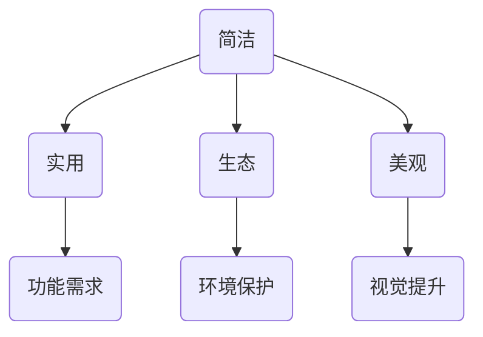
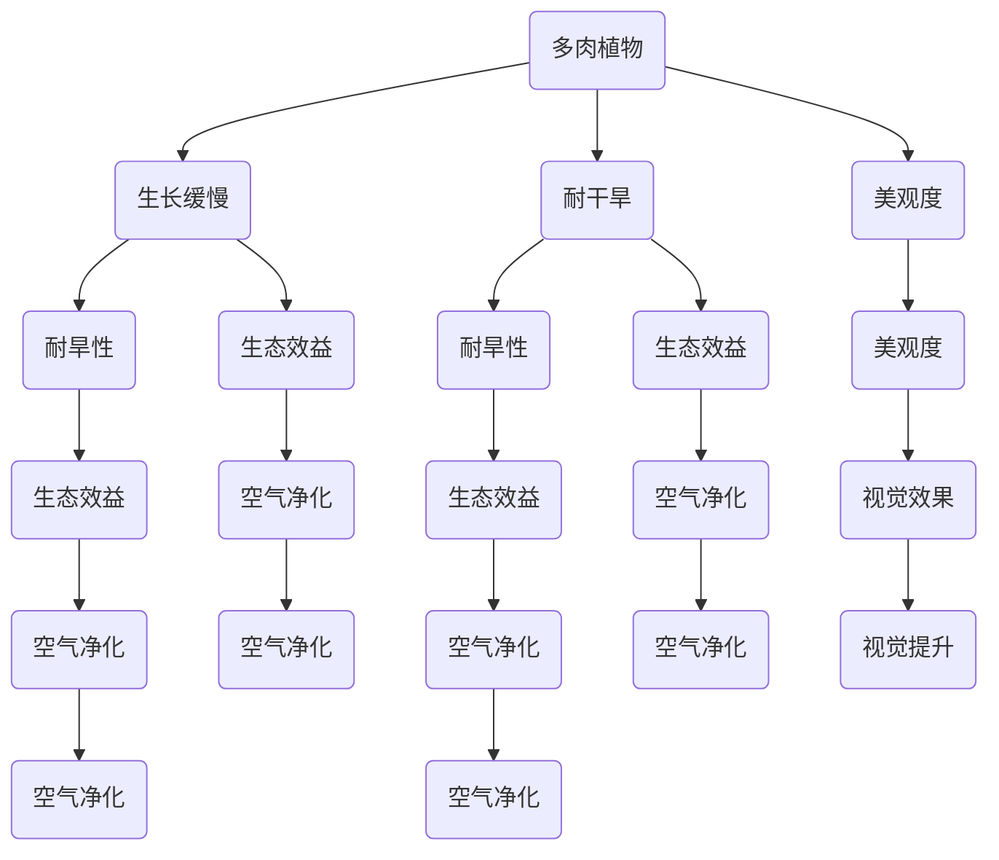
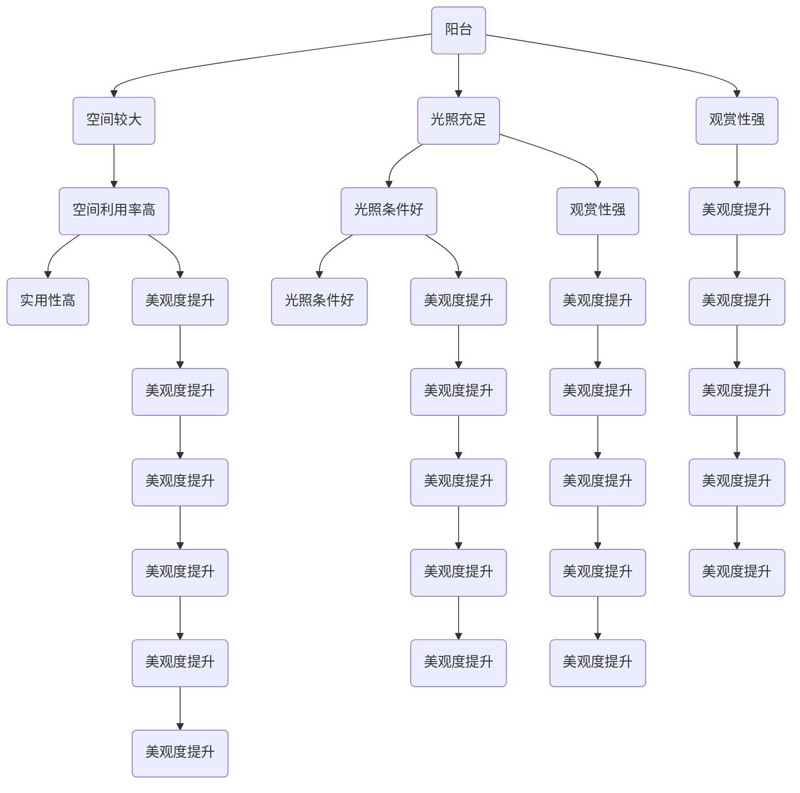

                 

### 现代简约主义园艺课程：都市微型绿洲的设计与维护

关键词：现代简约主义园艺、都市微型绿洲、设计原则、植物选择、空间利用、生态维护

摘要：随着城市化进程的加快，都市居民对于绿色、健康、舒适的生活环境需求日益增长。现代简约主义园艺作为一种创新园艺形式，通过简洁、高效、生态的设计理念，为都市居民打造了功能性与美观性兼备的微型绿洲。本文将系统地介绍现代简约主义园艺的设计原则、植物选择、空间利用、生态维护等内容，旨在为读者提供一本全面、系统、实用的园艺课程指南。

---

### 第一部分：背景介绍

#### 1.1 问题背景

在快速发展的都市生活中，人们的生活节奏越来越快，居住空间也越来越小。然而，绿色、健康、舒适的生活环境依然是都市居民追求的目标。现代简约主义园艺应运而生，它以简洁、高效、生态的设计理念，为都市居民提供了一种全新的园艺解决方案。通过最小化的设计理念，现代简约主义园艺能够在有限的空间内创造出功能性与美观性兼备的都市微型绿洲，满足人们对绿色生活的需求。

#### 1.2 问题描述

现代简约主义园艺强调简洁、高效、生态的设计理念，涉及园艺设计原则、植物选择、空间利用、生态维护等多个方面。然而，目前市场上关于这一主题的书籍多为理论性较强、实用性不足的读物，缺乏系统、全面、易于实践的指导。因此，本文旨在填补这一市场空白，为都市居民提供一本全面、系统、实用的现代简约主义园艺课程指南。

#### 1.3 问题解决

本文将从实际问题出发，以现代简约主义园艺为核心，系统介绍其设计原则、植物选择、空间利用、生态维护等内容。通过详细的操作指南和实用技巧，帮助读者掌握现代简约主义园艺的基本知识和实践技能，使读者能够轻松地将理论应用于实践。

#### 1.4 边界与外延

现代简约主义园艺不仅适用于家庭园艺，还可以应用于办公室、公共空间等不同场景。其设计原则和植物选择不受地域和气候限制，具有广泛的适用性。同时，本文所介绍的内容也不仅限于园艺设计本身，还涵盖了植物养护、病虫害防治、生态循环等多个方面，使读者能够全面了解和掌握现代简约主义园艺的方方面面。

#### 1.5 概念结构与核心要素组成

1. **设计原则**：现代简约主义园艺的设计原则包括简洁、实用、生态、美观等。
2. **植物选择**：根据空间大小、光照条件、土壤性质等因素选择适合的植物。
3. **空间利用**：充分利用阳台、窗台、屋顶等空间，创造多样化的园艺布局。
4. **生态维护**：通过科学浇水、施肥、修剪等手段，保持园艺空间的生态平衡。
5. **病虫害防治**：采用生物防治、物理防治等手段，减少病虫害对园艺空间的影响。
6. **文化内涵**：现代简约主义园艺不仅是一种园艺形式，更是一种生活方式和审美追求，体现了人与自然和谐共生的理念。

### 第二部分：核心概念与联系

#### 2.1 设计原则

**概念原理：**

现代简约主义园艺的设计原则主要包括简洁、实用、生态、美观等。这些原则不仅体现了园艺设计的基本要求，也是实现都市微型绿洲的关键要素。

**概念属性特征对比表格：**

| 设计原则 | 概念属性特征 |
| :---: | :---: |
| 简洁 | 减少非必要的装饰和元素，突出主题 |
| 实用 | 考虑功能需求，满足实际使用 |
| 生态 | 营造健康的生态系统，保护环境 |
| 美观 | 注重视觉效果，提升审美价值 |

**ER实体关系图架构：**



#### 2.2 植物选择

**概念原理：**

植物选择是现代简约主义园艺的重要组成部分，直接影响园艺空间的效果和生态平衡。选择适合的植物不仅要考虑其生长习性，还要考虑空间条件。

**概念属性特征对比表格：**

| 植物种类 | 概念属性特征 |
| :---: | :---: |
| 多肉植物 | 生长缓慢，耐干旱 |
| 竹子 | 生态效益高，净化空气 |
| 花卉 | 美观度高，花期长 |
| 草本植物 | 生长迅速，适应性强 |

**ER实体关系图架构：**



#### 2.3 空间利用

**概念原理：**

空间利用是现代简约主义园艺设计的核心，合理利用空间能够提高园艺空间的实用性和美观度。

**概念属性特征对比表格：**

| 空间类型 | 概念属性特征 |
| :---: | :---: |
| 阳台 | 空间较大，光照充足 |
| 窗台 | 空间较小，光照适中 |
| 屋顶 | 空间较大，光照充足 |
| 地面 | 空间较大，光照较弱 |

**ER实体关系图架构：**



#### 2.4 生态维护

**概念原理：**

生态维护是现代简约主义园艺的重要组成部分，通过科学浇水、施肥、修剪等手段，保持园艺空间的生态平衡，实现绿色、健康、舒适的生活环境。

**概念属性特征对比表格：**

| 维护手段 | 概念属性特征 |
| :---: | :---: |
| 浇水 | 保持土壤湿润，促进植物生长 |
| 施肥 | 提供植物生长所需的养分 |
| 修剪 | 控制植物生长方向和形态 |

**ER实体关系图架构：**

```mermaid
graph TD
A(浇水) --> B(保持土壤湿润)
A --> C(促进植物生长)
B --> D(土壤湿度适宜)
C --> E(植物生长良好)
A --> F(生态平衡)
B --> G(生态平衡)
C --> H(生态平衡)
D --> I(生态平衡)
E --> J(生态平衡)
F --> K(生态平衡)
G --> L(生态平衡)
H --> M(生态平衡)
I --> N(生态平衡)
J --> O(生态平衡)
K --> P(生态平衡)
L --> Q(生态平衡)
M --> R(生态平衡)
N --> S(生态平衡)
O --> T(生态平衡)
P --> U(生态平衡)
Q --> V(生态平衡)
R --> W(生态平衡)
S --> X(生态平衡)
T --> Y(生态平衡)
U --> Z(生态平衡)
V --> AA(生态平衡)
W --> BB(生态平衡)
X --> CC(生态平衡)
Y --> DD(生态平衡)
Z --> EE(生态平衡)
AA --> FF(生态平衡)
BB --> GG(生态平衡)
CC --> HH(生态平衡)
DD --> II(生态平衡)
EE --> JJ(生态平衡)
FF --> KK(生态平衡)
GG --> LL(生态平衡)
HH --> MM(生态平衡)
II --> NN(生态平衡)
JJ --> OO(生态平衡)
KK --> PP(生态平衡)
LL --> QQ(生态平衡)
MM --> RR(生态平衡)
NN --> SS(生态平衡)
OO --> TT(生态平衡)
PP --> UU(生态平衡)
QQ --> WW(生态平衡)
RR --> XX(生态平衡)
SS --> YY(生态平衡)
TT --> ZZ(生态平衡)
UU --> AAA(生态平衡)
WW --> BBB(生态平衡)
XX --> CCC(生态平衡)
YY --> DDD(生态平衡)
ZZ --> EEE(生态平衡)
AAA --> FFF(生态平衡)
BBB --> GGG(生态平衡)
CCC --> HHH(生态平衡)
DDD --> III(生态平衡)
EEE --> JJJ(生态平衡)
FFF --> KKK(生态平衡)
GGG --> LLL(生态平衡)
HHH --> MMM(生态平衡)
III --> NNN(生态平衡)
JJJ --> OOO(生态平衡)
KKK --> PPP(生态平衡)
LLL --> QQQ(生态平衡)
MMM --> RRR(生态平衡)
NNN --> SSS(生态平衡)
OOO --> TTT(生态平衡)
PPP --> UUU(生态平衡)
QQQ --> VVV(生态平衡)
RRR --> XXX(生态平衡)
SSS --> YYY(生态平衡)
TTT --> ZZZ(生态平衡)
UUU --> AAAA(生态平衡)
VVV --> BBBB(生态平衡)
XXX --> CCCD(生态平衡)
YYY --> DDDD(生态平衡)
ZZZ --> EEEE(生态平衡)
AAAA --> FFFF(生态平衡)
BBBB --> GGGG(生态平衡)
CCCC --> HHHH(生态平衡)
DDDD --> IIII(生态平衡)
EE

