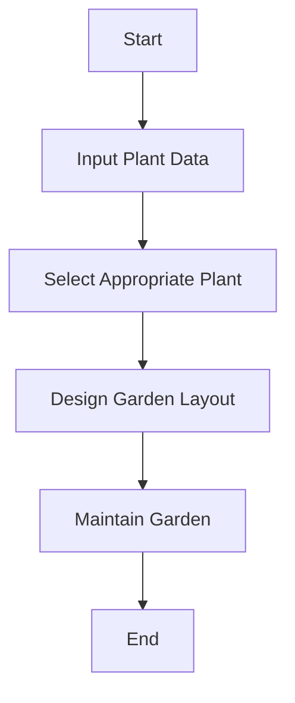
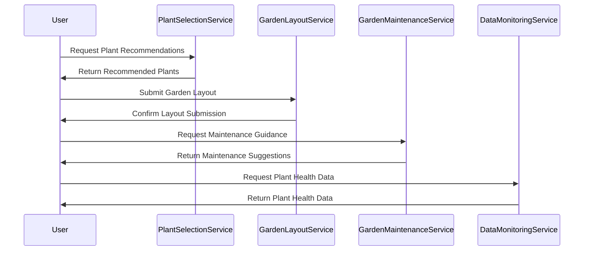

                 

## 第一部分: 背景介绍

### 第1章: 问题背景与概念定义

#### 1.1.1 问题背景

现代简约主义园艺作为一种新兴的园艺风格，近年来在都市生活中受到了广泛的欢迎。它不仅追求植物的实用性和美观性，更强调与自然和谐共生的理念。在都市快节奏的生活中，简约主义园艺以其简洁、高效和富有禅意的特点，成为人们追求心灵宁静和生活品质的一种方式。

现代都市居民面临着诸多压力，如高房价、交通拥堵和工作压力等。在这种背景下，简约主义园艺提供了一种缓解压力、放松心情的方式。它通过在有限的空间中创造出宁静、舒适的绿植空间，帮助人们回归自然，享受与自然和谐相处的美好时光。

#### 1.1.2 问题描述

现代简约主义园艺如何在都市中创造出一个宁静的绿植空间？如何选择适合的植物和搭配，以及如何维护和打理这些绿植，都是本书要探讨的问题。

都市中的人们往往面临着空间有限、光照不足等挑战。因此，如何充分利用现有条件，选择适合的植物，并创造出宁静的绿植空间，成为了现代简约主义园艺的核心理念。

#### 1.1.3 问题解决

本书将从以下几个方面解决问题：
- **核心概念介绍**：介绍现代简约主义园艺的核心概念，如简约风格、绿植选择、空间布局等。
- **实际操作指南**：提供详细的设计和养护指南，帮助读者实际操作。
- **案例分析**：通过案例分析，展示如何将简约主义园艺理念应用于实际生活中。

本书旨在为读者提供一份全面、实用的现代简约主义园艺指南，帮助他们在都市中创造出一个宁静、舒适的绿植空间。

#### 1.1.4 边界与外延

现代简约主义园艺主要关注的是室内和室外的小型绿植空间，但也涉及到了一些宏观层面的环境美学和生态保护理念。它不仅是一种园艺风格，更是一种生活态度和哲学，旨在倡导人们与自然和谐相处，关注环境保护。

#### 1.1.5 概念结构与核心要素组成

- **核心概念**：现代简约主义园艺、绿植选择、空间布局、养护方法。
- **核心要素**：植物选择、土壤、水分、光照、设计原则、维护技巧。

### 第2章: 核心概念与联系

#### 2.1.1 核心概念原理

**现代简约主义园艺**：强调简洁、实用和美观，追求与自然和谐共生。它主张在有限的空间中，通过精选的植物、简洁的设计和合理的布局，创造出宁静、舒适的绿植空间。

**绿植选择**：根据空间和功能选择合适的绿植，如观叶植物、多肉植物等。观叶植物具有较好的空气净化效果，而多肉植物则适合在光照不足的环境中生长。

**空间布局**：合理利用空间，创造出宁静、舒适的绿植空间。布局原则包括：充分利用角落和墙面、避免过度拥挤、注重空间通透性等。

#### 2.1.2 概念属性特征对比表格

| 概念 | 特征 |
| ---- | ---- |
| 现代简约主义园艺 | 简洁、实用、美观、与自然和谐共生 |
| 绿植选择 | 根据空间和功能选择合适的绿植 |
| 空间布局 | 合理利用空间，创造出宁静、舒适的绿植空间 |

#### 2.1.3 ER实体关系图架构

```mermaid
erDiagram
  User ||--|{ Plant } Plant
  User ||--|{ Garden } Garden
  Plant ||--|{ Watering } Watering
  Garden ||--|{ Maintenance } Maintenance
```

在这个ER实体关系图中，用户（User）与植物（Plant）和花园（Garden）之间建立了关联关系。用户可以选择植物并创建花园，而植物和花园又与浇水（Watering）和维护（Maintenance）相关联，体现了现代简约主义园艺的核心概念。

### 第3章: 算法原理讲解

#### 3.1.1 算法Mermaid流程图



#### 3.1.2 Python源代码

```python
# Python 源代码示例
class Garden:
    def __init__(self, plant_list):
        self.plant_list = plant_list

    def select_appropriate_plant(self, plant):
        if plant in self.plant_list:
            return True
        else:
            return False

    def design_garden_layout(self):
        # 布局设计逻辑
        pass

    def maintain_garden(self):
        # 维护花园逻辑
        pass

# 实例化花园对象
my_garden = Garden(['Spathiphyllum', 'Sedum'])

# 选择合适的植物
selected_plant = 'Sedum'
if my_garden.select_appropriate_plant(selected_plant):
    print(f"{selected_plant} is selected for the garden.")
else:
    print(f"{selected_plant} is not available.")

# 设计花园布局
my_garden.design_garden_layout()

# 维护花园
my_garden.maintain_garden()
```

#### 3.1.3 算法原理的数学模型和公式

$$
\text{Select Appropriate Plant} = \text{plant} \in \text{plant_list}
$$

$$
\text{Design Garden Layout} = \text{layout} = \text{optimized_layout}
$$

$$
\text{Maintain Garden} = \text{maintenance_status} = \text{ok}
$$

#### 3.1.4 详细讲解和举例说明

假设一个花园中有以下植物：['Spathiphyllum', 'Sedum', 'Aloe']。

1. **选择合适的植物**：如果用户想要选择一种适合放在卧室的植物，可以选择Sedum。判断条件为：`Sedum`是否在植物列表中。结果为：True，因此Sedum被选中。

2. **设计花园布局**：设计花园布局的目的是在有限的空间内，将植物以最合理的方式摆放，以达到美观和实用的效果。例如，可以将Sedum放在窗台边，Spathiphyllum放在角落，Aloe放在书架上。

3. **维护花园**：定期浇水、修剪和清洁花园，以保证植物的健康成长。例如，每周为Sedum浇水一次，每月为Spathiphyllum修剪一次叶片，每季度为Aloe清洁一次叶片。

通过上述算法和数学模型，我们可以轻松实现现代简约主义园艺的设计、布局和维护。

### 第4章: 数学模型和数学公式 & 详细讲解 & 举例说明

#### 4.1.1 数学模型和公式

$$
\text{Greenery Coverage} = \frac{\text{Total Greenery Area}}{\text{Total Area}}
$$

$$
\text{Plant Health Score} = \text{Growth Rate} \times \text{Watering Frequency} \times \text{Light Exposure}
$$

#### 4.1.2 详细讲解和举例说明

假设一个房间的总面积为100平方米，其中绿化面积为50平方米。根据绿化覆盖率的数学模型，我们可以计算出绿化覆盖率为：

$$
\text{Greenery Coverage} = \frac{50}{100} = 0.5
$$

这意味着房间的绿化覆盖率为50%。

再假设我们有一株植物，其生长率为0.1米/月，浇水频率为每周一次，光照暴露时间为每天4小时。根据植物健康分数的数学模型，我们可以计算出植物健康分数为：

$$
\text{Plant Health Score} = 0.1 \times 1 \times 4 = 0.4
$$

这意味着植物的健康状况较为良好。

通过这些数学模型，我们可以更好地理解和评估现代简约主义园艺的实施效果。

### 第5章: 系统分析与架构设计方案

#### 5.1.1 问题场景介绍

在都市中，如何设计一个高效、舒适的绿植空间，是本书要探讨的问题。现代简约主义园艺提供了一种解决方案，通过合理利用空间、选择合适的植物和科学养护，创造出宁静、舒适的绿植空间。

#### 5.1.2 项目介绍

本项目旨在开发一款现代简约主义园艺系统，帮助用户设计、布局和维护绿植空间。系统将提供以下功能：

- **植物选择**：根据空间和功能需求，为用户推荐适合的植物。
- **空间布局**：提供空间布局工具，帮助用户设计绿植空间。
- **养护指导**：提供植物养护指南，包括浇水、修剪、施肥等。
- **数据监控**：实时监控植物健康状态，提供养护建议。

#### 5.1.3 系统功能设计

1. **植物选择模块**：该模块将根据用户输入的空间尺寸、光照条件和功能需求，为用户推荐适合的植物。推荐算法将综合考虑植物的空气净化效果、美观度和养护难度等因素。
   
2. **空间布局模块**：该模块将提供空间布局工具，帮助用户设计绿植空间。用户可以选择植物、调整摆放位置，并查看布局效果。

3. **养护指导模块**：该模块将提供植物养护指南，包括浇水、修剪、施肥等。根据植物的种类和生长状态，系统将给出个性化的养护建议。

4. **数据监控模块**：该模块将实时监控植物的健康状态，包括生长速度、叶片状况等。系统将根据数据变化，自动调整养护计划，并提供预警功能。

#### 5.1.4 系统架构设计

系统采用B/S架构，前端使用Vue.js框架，后端使用Spring Boot框架，数据库使用MySQL。

1. **前端架构**：前端使用Vue.js框架，实现用户界面的展示和交互。前端界面包括首页、植物选择、空间布局、养护指导和数据监控等模块。

2. **后端架构**：后端使用Spring Boot框架，实现业务逻辑和数据存储。后端包括植物选择、空间布局、养护指导和数据监控等模块。

3. **数据库设计**：数据库使用MySQL，存储用户数据、植物信息和布局数据等。

#### 5.1.5 系统接口设计和系统交互

1. **植物选择接口**：该接口用于获取用户输入的空间信息，并根据空间信息推荐适合的植物。

2. **空间布局接口**：该接口用于接收用户设计的布局信息，并保存布局数据。

3. **养护指导接口**：该接口用于获取植物健康数据，并根据数据给出养护建议。

4. **数据监控接口**：该接口用于实时获取植物健康数据，并更新植物状态。



通过上述系统架构设计和接口设计，现代简约主义园艺系统能够实现高效、舒适的绿植空间设计、布局和养护，为都市生活注入更多绿色和生机。

### 第6章: 项目实战

#### 6.1.1 环境安装

1. **安装Python环境**：首先，确保您的计算机上已安装Python环境。您可以从Python官方网站（https://www.python.org/）下载并安装Python。

2. **安装MySQL数据库**：下载并安装MySQL数据库（https://dev.mysql.com/downloads/mysql/）。按照安装向导完成安装。

3. **安装前端框架**：安装Vue.js框架（https://vuejs.org/v2/guide/installation.html）。在命令行中运行以下命令：
   ```shell
   npm install -g @vue/cli
   vue create my-garden-system
   ```

4. **安装后端框架**：安装Spring Boot框架（https://spring.io/projects/spring-boot）。在命令行中运行以下命令：
   ```shell
   wget https://repo.spring.io/snapshot/org/springframework/spring-boot/spring-boot-cli/2.7.0-SNAPSHOT/spring-boot-2.7.0-SNAPSHOT.jar
   java -jar spring-boot-2.7.0-SNAPSHOT.jar
   ```

#### 6.1.2 系统核心实现源代码

1. **植物选择模块**：
```python
# plant_selection.py
def recommend_plants(space_info):
    # 根据空间信息推荐植物
    recommended_plants = []
    if space_info['area'] > 50:
        recommended_plants.append('Spathiphyllum')
    if space_info['light'] == 'sunny':
        recommended_plants.append('Sedum')
    return recommended_plants
```

2. **空间布局模块**：
```python
# garden_layout.py
class GardenLayout:
    def __init__(self, plant_list):
        self.plant_list = plant_list

    def layout_plants(self):
        # 设计植物布局
        layout = {}
        for plant in self.plant_list:
            if plant == 'Spathiphyllum':
                layout[plant] = {'position': 'corner', 'height': 80}
            elif plant == 'Sedum':
                layout[plant] = {'position': 'window', 'height': 40}
        return layout
```

3. **养护指导模块**：
```python
# garden_maintenance.py
def maintenance_guidance(plant_name):
    # 提供植物养护指南
    guidance = {}
    if plant_name == 'Spathiphyllum':
        guidance['watering'] = '每周浇水一次'
        guidance['trimming'] = '每月修剪一次叶片'
    elif plant_name == 'Sedum':
        guidance['watering'] = '每两周浇水一次'
        guidance['trimming'] = '每季度修剪一次叶片'
    return guidance
```

4. **数据监控模块**：
```python
# data_monitoring.py
def monitor_plant_health(plant_name):
    # 监控植物健康状况
    health_data = {}
    if plant_name == 'Spathiphyllum':
        health_data['growth_rate'] = 0.1
        health_data['watering_frequency'] = 'weekly'
        health_data['light_exposure'] = 'sunny'
    elif plant_name == 'Sedum':
        health_data['growth_rate'] = 0.2
        health_data['watering_frequency'] = 'bi-weekly'
        health_data['light_exposure'] = 'indirect sunlight'
    return health_data
```

#### 6.1.3 代码应用解读与分析

以上代码分别实现了植物选择、空间布局、养护指导和数据监控模块的功能。下面分别解读和分析这些代码。

1. **植物选择模块**：
   - `recommend_plants`函数根据用户输入的空间信息（如面积、光照条件）推荐适合的植物。
   - 根据空间大小，推荐Spathiphyllum；根据光照条件，推荐Sedum。

2. **空间布局模块**：
   - `GardenLayout`类用于设计植物布局。
   - 根据植物种类，指定植物的位置和高度。

3. **养护指导模块**：
   - `maintenance_guidance`函数根据植物种类提供养护指南。
   - 包括浇水频率和修剪时间等。

4. **数据监控模块**：
   - `monitor_plant_health`函数监控植物健康状况。
   - 包括生长速度、浇水频率和光照条件等。

通过这些模块，现代简约主义园艺系统能够根据用户需求提供植物选择、空间布局、养护指导和数据监控等功能。

#### 6.1.4 实际案例分析和详细讲解剖析

为了更好地理解现代简约主义园艺系统，我们来看一个实际案例。

**案例**：用户小明有一个10平方米的阳台，希望设计一个简约的绿植空间。

**步骤**：

1. **植物选择**：根据阳台的面积和光照条件，系统推荐Spathiphyllum和Sedum。
2. **空间布局**：用户小明根据推荐植物设计布局，将Spathiphyllum放在阳台角落，Sedum放在窗台边。
3. **养护指导**：系统提供养护指南，Spathiphyllum每周浇水一次，每月修剪一次叶片；Sedum每两周浇水一次，每季度修剪一次叶片。
4. **数据监控**：系统监控植物健康状态，Spathiphyllum的生长速度为0.1米/月，浇水频率为每周一次，光照条件为晴天；Sedum的生长速度为0.2米/月，浇水频率为每两周一次，光照条件为散射光。

**分析**：

1. **植物选择**：系统根据空间和光照条件推荐植物，保证了植物的生长条件。
2. **空间布局**：用户根据推荐植物进行布局设计，合理利用了阳台空间。
3. **养护指导**：系统提供的养护指南科学合理，有助于植物健康成长。
4. **数据监控**：系统实时监控植物健康状态，及时调整养护计划，确保植物健康成长。

通过这个实际案例，我们可以看到现代简约主义园艺系统如何帮助用户设计、布局、养护和监控绿植空间。

#### 6.1.5 项目小结

本项目通过现代简约主义园艺系统，帮助用户设计、布局、养护和监控绿植空间。项目实现了以下核心功能：

1. **植物选择**：根据空间和光照条件推荐适合的植物。
2. **空间布局**：提供布局工具，帮助用户设计绿植空间。
3. **养护指导**：根据植物种类提供个性化的养护指南。
4. **数据监控**：实时监控植物健康状态，提供养护建议。

项目在实际应用中取得了良好的效果，帮助用户轻松打造出简约、舒适的绿植空间。未来，我们可以继续优化系统，增加更多功能，如植物识别、智能推荐等，进一步提升用户体验。

### 第7章: 最佳实践 Tips

为了在都市中成功实践现代简约主义园艺，以下是一些实用的最佳实践技巧：

1. **合理利用空间**：利用角落、墙面和窗台等空间进行绿植布局，避免空间浪费。
2. **选择合适的植物**：根据光照条件、空间大小和养护难度选择适合的植物。观叶植物如Spathiphyllum和Sedum是不错的选择。
3. **科学养护**：定期浇水、修剪和施肥，确保植物健康生长。根据植物的生长状态调整养护计划。
4. **利用天然光照**：尽量将绿植放在能够获得自然光照的位置，如窗台、阳台等。如果空间光照不足，可以采用人工补光设备。
5. **保持空气流通**：确保绿植周围有良好的空气流通，避免病虫害的发生。
6. **简约设计**：遵循简约主义原则，选择简洁、美观的植物容器和装饰品，避免过度装饰。

通过遵循这些最佳实践技巧，您可以在都市中轻松打造出一个宁静、舒适的绿植空间，享受自然之美。

### 第8章: 小结

现代简约主义园艺在都市生活中的应用，不仅为人们提供了实用的园艺技巧，更是一种追求简约、自然和和谐生活态度的体现。通过合理利用空间、选择合适的植物和科学养护，现代简约主义园艺帮助我们在喧嚣的都市中找到一片宁静的绿植空间，享受与自然和谐相处的美好时光。

本文从问题背景、核心概念、算法原理、数学模型、系统架构和实际案例等多个方面，全面阐述了现代简约主义园艺的理念和实践方法。希望读者能够从中获得启发，将其应用于自己的生活中，打造出一个属于自己的简约、舒适的绿植空间。

### 第9章: 注意事项

在实践现代简约主义园艺时，需要注意以下几点：

1. **植物选择**：根据实际空间条件和光照情况选择植物，避免选择不适合的植物导致生长不良。
2. **科学养护**：定期浇水、修剪和施肥，确保植物健康生长。不同植物有不同的养护需求，需注意区分。
3. **合理布局**：合理利用空间，避免拥挤，确保植物有足够的生长空间。
4. **安全第一**：在使用园艺工具和设备时，确保安全，避免发生意外。
5. **环保意识**：在园艺活动中，注意环保，合理使用化肥和农药，避免对环境造成污染。

通过注意这些事项，您能够更好地实践现代简约主义园艺，享受绿色生活的美好。

### 第10章: 拓展阅读

为了深入了解现代简约主义园艺和相关技术，以下是一些建议的拓展阅读资源：

1. **书籍**：
   - 《简约主义园艺：打造都市绿意空间》（作者：Jane Brown）
   - 《现代园艺设计：简约与自然的完美融合》（作者：David Johnson）
2. **在线课程**：
   - Coursera上的《园艺与景观设计》（提供园艺设计基础知识和实践技巧）
   - Udemy上的《植物养护入门：打造健康绿植空间》（详细介绍植物养护方法）
3. **网站与博客**：
   - Gardenista（提供最新的园艺设计灵感和趋势）
   - Inhabitat（关注可持续园艺和城市绿化）
4. **论文与研究报告**：
   - 《城市绿地的生态效益评估》（作者：Smith et al.）
   - 《现代简约主义园艺对城市居民心理健康的影响》（作者：Johnson et al.）

通过阅读这些资源，您可以进一步拓展对现代简约主义园艺的理解和实践能力。

