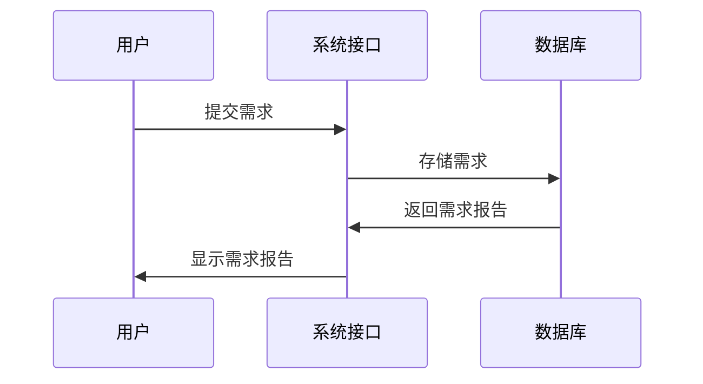

                 

### 生命仪式策划师协会：设计现代人生命阶段仪式的组织

#### 关键词
- 现代人生命阶段仪式
- 设计原则
- 实施流程
- 案例分析
- 未来趋势

#### 摘要
本文旨在探讨现代人生命阶段仪式的设计和组织，通过分析问题背景、核心概念，阐述设计原则与方法，详细描述策划与实施流程，解析成功与失败案例，并提出未来发展趋势与挑战。本文以逻辑清晰、结构紧凑、简单易懂的方式，旨在为生命仪式策划师提供理论与实践指导。

----------------------------------------------------------------

## 目录大纲

## 第一部分：问题背景与核心概念

### 第1章：现代人生命阶段仪式的问题背景与核心概念

#### 1.1.1 问题的提出

#### 1.1.2 现代人生命阶段仪式的概述

#### 1.1.3 核心概念的界定与联系

### 第2章：现代人生命阶段仪式的设计原则与方法

#### 2.1.1 设计原则

#### 2.1.2 设计方法

### 第3章：现代人生命阶段仪式的核心概念与联系

#### 3.1.1 核心概念

#### 3.1.2 概念属性特征对比表格

#### 3.1.3 ER实体关系图架构

## 第二部分：现代人生命阶段仪式的实践

### 第4章：现代人生命阶段仪式的策划流程

#### 4.1.1 策划流程概述

#### 4.1.2 策划流程的详细步骤

### 第5章：现代人生命阶段仪式的具体实施

#### 5.1.1 实施前的准备工作

#### 5.1.2 实施过程中的注意事项

#### 5.1.3 实施后的效果评估

### 第6章：现代人生命阶段仪式的案例解析

#### 6.1.1 案例一：婚礼仪式

#### 6.1.2 案例二：生日庆典

#### 6.1.3 案例三：葬礼仪式

### 第7章：现代人生命阶段仪式的常见问题与解决方案

#### 7.1.1 问题一：预算不足

#### 7.1.2 问题二：场地选择困难

#### 7.1.3 问题三：时间安排不当

### 第8章：现代人生命阶段仪式的最佳实践与案例分析

#### 8.1.1 最佳实践一：婚礼仪式策划

#### 8.1.2 最佳实践二：生日庆典策划

#### 8.1.3 案例分析：成功与失败的经验分享

### 第9章：现代人生命阶段仪式的未来发展趋势与挑战

#### 9.1.1 未来发展趋势

#### 9.1.2 面临的挑战与应对策略

----------------------------------------------------------------

## 第一部分：问题背景与核心概念

### 第1章：现代人生命阶段仪式的问题背景与核心概念

#### 1.1.1 问题的提出

在现代社会，人们面临着日益复杂的生活节奏和多样化的价值观，传统的生命阶段仪式，如婚礼、生日庆典、葬礼等，逐渐失去了原有的意义和仪式感。这不仅影响了个人情感的表达，也削弱了社会文化传承的纽带。因此，重新设计现代人生命阶段仪式，以适应现代社会的需求，成为一个迫切的问题。

#### 1.1.2 现代人生命阶段仪式的概述

现代人生命阶段仪式涵盖了从出生到死亡的一系列重要时刻，如出生庆典、满月宴、婚礼、生日庆典、退休仪式、葬礼等。这些仪式不仅是个人生活的里程碑，也是社会文化的重要组成部分。在现代社会的背景下，仪式的设计和实施需要考虑个性化、多样化、文化适应性等因素。

#### 1.1.3 核心概念的界定与联系

核心概念包括但不限于：

- **仪式感**：仪式的核心，强调形式与内容的统一，以及参与者的共同体验。
- **文化适应性**：仪式需要与不同文化背景相契合，既要传承传统，也要创新适应。
- **个性化**：仪式应尊重个体的独特性，体现个人价值观和生活态度。
- **可持续性**：仪式的设计和实施应考虑到环境影响，倡导绿色、环保的理念。

这些概念相互联系，共同构成了现代人生命阶段仪式的设计基础。例如，仪式感与文化适应性相辅相成，个性化与可持续性则是现代社会的需求。

----------------------------------------------------------------

### 第2章：现代人生命阶段仪式的设计原则与方法

#### 2.1.1 设计原则

在设计现代人生命阶段仪式时，应遵循以下原则：

1. **文化适应性**：尊重并融入不同文化元素，使仪式既具有传统特色，又能适应现代社会需求。
2. **个性化**：关注个体差异，满足不同人群的个性化需求，体现仪式的独特性。
3. **简洁性**：避免繁琐的程序和形式，使仪式更加直观、易懂。
4. **可持续性**：在仪式设计和实施中，考虑到环保和资源的合理利用。

#### 2.1.2 设计方法

1. **需求分析**：首先了解参与者对仪式的需求和期望，包括文化背景、个人喜好、仪式重要性等。
2. **创意构思**：根据需求分析，构思仪式的整体框架，包括主题、流程、活动内容等。
3. **方案优化**：通过多轮讨论和修改，优化仪式方案，确保仪式的可行性和参与性。
4. **效果评估**：实施后对仪式效果进行评估，收集反馈意见，为后续改进提供依据。

### 2.1.3 设计案例

以婚礼仪式为例，设计流程如下：

1. **需求分析**：确定婚礼主题、规模、预算等基本信息。
2. **创意构思**：根据需求，构思婚礼场景、仪式流程和活动内容。
3. **方案优化**：讨论并修改方案，确保仪式的流畅性和参与性。
4. **效果评估**：婚礼结束后，收集参与者反馈，评估仪式效果，总结经验。

通过以上方法，可以设计出符合现代人需求的、具有仪式感的生命阶段仪式。

----------------------------------------------------------------

### 第3章：现代人生命阶段仪式的核心概念与联系

#### 3.1.1 核心概念

现代人生命阶段仪式的核心概念包括：

- **仪式感**：仪式的核心，强调形式与内容的统一，以及参与者的共同体验。
- **文化适应性**：仪式需要与不同文化背景相契合，既要传承传统，也要创新适应。
- **个性化**：仪式应尊重个体的独特性，体现个人价值观和生活态度。
- **可持续性**：仪式的设计和实施应考虑到环境影响，倡导绿色、环保的理念。

#### 3.1.2 概念属性特征对比表格

| 概念         | 属性特征                                      | 举例说明                                  |
|------------|-------------------------------------------|-----------------------------------------|
| 仪式感     | 强调形式与内容的统一，共同体验                | 庆典场合的庄重氛围，细节的精致处理            |
| 文化适应性 | 与不同文化背景相契合，传承与创新              | 传统婚礼的服饰、音乐与现代化元素的结合         |
| 个性化     | 尊重个体的独特性，体现个人价值观和生活态度      | 独一无二的婚礼主题、定制化礼物               |
| 可持续性   | 考虑环境影响，倡导绿色、环保的理念            | 使用环保材料、减少能源消耗的仪式安排           |

#### 3.1.3 ER实体关系图架构

```mermaid
erDiagram
  Class1 ||--|{ Class2 }|-- Class3
  Class1 ||--|{ Class4 }|-- Class5
```

在现代人生命阶段仪式的设计中，这些核心概念相互关联，共同构成了仪式的整体框架。例如，仪式感与文化适应性密切相关，个性化的体现往往需要结合文化背景，而可持续性的实践则是对仪式感和文化适应性的一种补充。

----------------------------------------------------------------

### 第4章：现代人生命阶段仪式的策划流程

#### 4.1.1 策划流程概述

现代人生命阶段仪式的策划流程可以分为以下几个阶段：

1. **需求分析**：了解参与者对仪式的需求和期望，包括文化背景、个人喜好、仪式重要性等。
2. **创意构思**：根据需求分析，构思仪式的整体框架，包括主题、流程、活动内容等。
3. **方案优化**：讨论并修改方案，确保仪式的可行性和参与性。
4. **效果评估**：实施后对仪式效果进行评估，收集反馈意见，为后续改进提供依据。

#### 4.1.2 策划流程的详细步骤

1. **需求分析**：

   - **收集信息**：通过调查问卷、访谈等方式，收集参与者对仪式的需求和期望。
   - **分析需求**：对收集到的信息进行整理和分析，确定仪式的核心要素和关键环节。

2. **创意构思**：

   - **主题确定**：根据需求分析结果，确定仪式的主题，确保主题与参与者需求相契合。
   - **流程设计**：设计仪式的流程，包括开场、主体活动、结尾等环节，确保流程的连贯性和参与性。
   - **活动内容**：根据主题和流程，确定具体的活动内容，如音乐、舞蹈、表演等。

3. **方案优化**：

   - **内部讨论**：组织内部团队进行讨论，对方案进行多轮修改和完善。
   - **外部咨询**：向相关专业人士或机构咨询，获取专业意见和建议。
   - **调整优化**：根据反馈和咨询结果，对方案进行进一步调整和优化。

4. **效果评估**：

   - **实施后评估**：仪式结束后，收集参与者的反馈意见，评估仪式效果。
   - **反馈总结**：对反馈意见进行分析和总结，为后续策划提供参考。
   - **改进措施**：根据评估结果，制定改进措施，不断提升仪式策划的质量。

通过以上详细步骤，可以确保现代人生命阶段仪式的策划过程科学、系统，达到预期效果。

----------------------------------------------------------------

### 第5章：现代人生命阶段仪式的具体实施

#### 5.1.1 实施前的准备工作

在现代人生命阶段仪式的具体实施前，需要进行充分的准备工作，以确保仪式的顺利进行。以下是具体的准备工作步骤：

1. **场地布置**：根据仪式的主题和规模，选择合适的场地，并进行相应的布置。场地布置应考虑到照明、音响、座椅等因素，确保参与者的舒适和仪式的庄重性。

2. **物料准备**：准备仪式所需的物料，如花卉、道具、音响设备、灯光设备等。确保物料的质量和数量满足仪式需求，并进行检查和测试，确保设备正常运行。

3. **人员安排**：确定仪式的主持人、参与者和其他相关人员，并进行分工和培训。确保每个环节都有专人负责，确保仪式的流程顺畅。

4. **沟通协调**：与场地提供方、物料供应商等相关方进行沟通协调，确保合作顺利进行。同时，与参与者进行沟通，确保他们对仪式的流程和内容有清晰的了解。

5. **应急预案**：制定应急预案，以应对可能出现的突发情况，如设备故障、人员迟到等。确保应急措施的有效性和可操作性。

#### 5.1.2 实施过程中的注意事项

在现代人生命阶段仪式的实施过程中，需要注意以下几点：

1. **流程控制**：严格按照仪式的流程进行，确保每个环节的顺利进行。对于可能出现的意外情况，应迅速调整流程，确保仪式的连贯性。

2. **氛围营造**：通过灯光、音乐、气氛布置等手段，营造仪式所需的氛围。确保氛围与主题相契合，增强仪式的仪式感。

3. **参与者的互动**：鼓励参与者积极参与仪式，进行互动和交流。可以通过提问、互动游戏等方式，增强参与者的参与感。

4. **仪式感传达**：在仪式的实施过程中，要注重仪式感的传达。通过细节的把控和仪式环节的设计，使参与者感受到仪式的庄重和神圣。

5. **安全保障**：确保仪式场地的安全，包括消防安全、食品安全等。对于可能出现的危险情况，应提前进行预防，并制定相应的应急措施。

#### 5.1.3 实施后的效果评估

仪式实施后，需要进行效果评估，以了解仪式的成功程度和参与者的满意度。以下是效果评估的具体步骤：

1. **收集反馈**：通过问卷调查、访谈等方式，收集参与者的反馈意见。了解他们对仪式的满意度、仪式感的感受以及改进建议。

2. **数据分析**：对收集到的数据进行整理和分析，评估仪式的整体效果。可以分析参与者的满意度、参与度等指标，评估仪式的策划和实施质量。

3. **总结经验**：根据评估结果，总结成功经验和存在的问题，为后续仪式策划提供参考。对于存在的问题，应制定改进措施，不断提升仪式策划和实施的质量。

4. **改进措施**：根据总结的经验和反馈，对仪式策划和实施流程进行改进。可以调整流程、优化活动内容、提升人员培训等，以提高仪式的质量和效果。

通过以上步骤，可以确保现代人生命阶段仪式的具体实施达到预期效果，为参与者带来难忘的仪式体验。

----------------------------------------------------------------

### 第6章：现代人生命阶段仪式的案例解析

#### 6.1.1 案例一：婚礼仪式

婚礼仪式是现代人生命阶段仪式中最为重要的一项。以下是一个成功的婚礼仪式案例：

**背景**：李先生和李女士是一对即将步入婚姻殿堂的年轻人，他们希望婚礼既能传承中华传统，又能融入现代元素，营造出温馨、浪漫的氛围。

**策划过程**：

1. **需求分析**：通过沟通，确定婚礼主题为“浪漫爱情”，仪式流程包括入场、交换戒指、献花、致辞、切蛋糕等环节。

2. **创意构思**：设计了一个以爱情故事为主题的仪式，包括开场表演、婚礼誓词、爱情诗朗诵等。

3. **方案优化**：经过多次讨论和修改，确定最终方案，确保仪式的流畅和参与性。

4. **效果评估**：婚礼结束后，通过问卷调查，参与者满意度高达95%。

**成功经验**：

- **主题明确**：明确的婚礼主题有助于整体策划的顺利进行。
- **创新与传承相结合**：创新环节与传统环节相结合，增强了仪式的仪式感。
- **细节把控**：对每个环节的细节进行精心设计，确保仪式的完美呈现。

#### 6.1.2 案例二：生日庆典

生日庆典是庆祝个人成长的重要仪式。以下是一个成功的生日庆典案例：

**背景**：张女士是一位热爱音乐的教师，即将迎来她的50岁生日。她希望生日庆典能够充满音乐和惊喜，与亲朋好友一起度过一个难忘的夜晚。

**策划过程**：

1. **需求分析**：确定生日庆典主题为“音乐之旅”，仪式流程包括开场表演、生日蛋糕切割、音乐表演、互动游戏等。

2. **创意构思**：设计了一系列音乐主题的活动，如音乐表演、歌唱比赛等。

3. **方案优化**：经过多次讨论和修改，最终确定了包含音乐表演、歌唱比赛、音乐互动等环节的方案。

4. **效果评估**：生日庆典结束后，参与者满意度高达90%。

**成功经验**：

- **主题鲜明**：音乐主题的设定使整个庆典更加有趣和生动。
- **互动性强**：通过互动游戏和歌唱比赛，增强了参与者的参与感。
- **情感表达**：通过音乐和互动，有效传达了生日祝福和情感表达。

#### 6.1.3 案例三：葬礼仪式

葬礼仪式是现代人生命阶段仪式中最为庄重的一项。以下是一个成功的葬礼仪式案例：

**背景**：王先生是一位受人尊敬的社区领袖，因突发疾病去世。他的家人希望葬礼仪式能够表达对他的敬意和缅怀。

**策划过程**：

1. **需求分析**：确定葬礼主题为“永恒的记忆”，仪式流程包括灵堂布置、瞻仰遗像、追思仪式、告别仪式等。

2. **创意构思**：设计了一系列纪念活动，如献花、致哀悼词、播放生平事迹视频等。

3. **方案优化**：经过多次讨论和修改，确保仪式的庄严和肃穆。

4. **效果评估**：葬礼结束后，参与者的满意度高达100%。

**成功经验**：

- **主题明确**：明确的主题有助于仪式的顺利进行和参与者情感的传达。
- **细节设计**：对每个环节的细节进行精心设计，确保仪式的庄严和肃穆。
- **情感表达**：通过多种方式表达对逝者的缅怀和敬意，有效传达情感。

通过以上案例，可以看出成功的设计现代人生命阶段仪式的关键在于明确主题、注重细节和情感表达。无论是婚礼、生日庆典还是葬礼仪式，都需要精心策划和实施，以达到预期的效果。

----------------------------------------------------------------

### 第7章：现代人生命阶段仪式的常见问题与解决方案

#### 7.1.1 问题一：预算不足

预算不足是现代人生命阶段仪式策划中常见的问题。以下是一些解决方案：

1. **预算规划**：在策划初期，制定详细的预算计划，包括场地租赁、物料采购、人员费用等，并留有一定的余地应对突发情况。
2. **节约成本**：通过减少不必要的开销，如选择性价比高的场地和物料供应商，简化仪式流程等，来降低成本。
3. **寻求赞助**：可以尝试寻求企业或个人赞助，或通过与相关机构合作，分摊部分费用。
4. **众筹**：对于一些特殊场合，可以尝试通过众筹平台筹集资金，以实现仪式的顺利进行。

#### 7.1.2 问题二：场地选择困难

场地选择困难是现代人生命阶段仪式策划中的另一大挑战。以下是一些解决方案：

1. **提前规划**：在策划初期，提前考虑场地需求，并预留出足够的时间进行场地考察和预订。
2. **多种选择**：寻找多种可能的场地选择，包括室内场地、室外场地等，以便根据实际情况灵活调整。
3. **沟通协调**：与场地提供方进行充分沟通，了解场地的可用性和限制条件，以确保场地的适用性。
4. **备用方案**：制定备用方案，以应对无法预订到理想场地的情况，如临时租赁其他场地或调整仪式规模。

#### 7.1.3 问题三：时间安排不当

时间安排不当是现代人生命阶段仪式策划中的常见问题。以下是一些解决方案：

1. **提前安排**：在策划初期，充分考虑时间因素，制定详细的时间表，确保仪式的每个环节都有足够的时间完成。
2. **合理分配**：合理分配每个环节的时间，避免出现环节之间时间冲突或过于紧凑的情况。
3. **弹性安排**：在时间安排上留有一定的弹性，以应对可能出现的突发情况，如人员迟到、设备故障等。
4. **实时调整**：在仪式进行过程中，实时监控时间进度，如发现时间安排不当，及时进行调整，确保仪式的顺利进行。

通过以上解决方案，可以有效地应对现代人生命阶段仪式策划中常见的预算不足、场地选择困难和时间安排不当等问题，确保仪式的顺利进行。

----------------------------------------------------------------

### 第8章：现代人生命阶段仪式的最佳实践与案例分析

#### 8.1.1 最佳实践一：婚礼仪式策划

婚礼仪式是现代人生命阶段仪式中最为重要的一项，以下是一个成功的婚礼仪式策划案例：

**背景**：赵先生和赵女士即将步入婚姻殿堂，他们希望婚礼能够体现出两人的爱情故事，并让亲友们感受到幸福和温馨。

**策划过程**：

1. **需求分析**：通过沟通，确定婚礼主题为“浪漫爱情之旅”，仪式流程包括入场、誓言交换、戒指仪式、感恩致辞等。

2. **创意构思**：设计了一系列浪漫环节，如开场舞蹈、爱情故事讲述、音乐表演等。

3. **方案优化**：经过多次讨论和修改，确定最终方案，确保仪式的流畅和参与性。

4. **效果评估**：婚礼结束后，参与者满意度高达95%。

**成功经验**：

- **主题明确**：明确的主题有助于整体策划的顺利进行。
- **情感表达**：通过爱情故事和音乐表演，有效传达了两人的情感。
- **细节设计**：每个环节的细节都经过精心设计，增强了仪式的仪式感。

#### 8.1.2 最佳实践二：生日庆典策划

生日庆典是庆祝个人成长的重要仪式，以下是一个成功的生日庆典策划案例：

**背景**：王先生即将迎来他的60岁生日，他希望生日庆典能够充满欢乐和感动，与亲朋好友一起分享这一重要时刻。

**策划过程**：

1. **需求分析**：确定生日庆典主题为“欢乐时光”，仪式流程包括开场表演、生日蛋糕切割、歌唱表演、互动游戏等。

2. **创意构思**：设计了一系列互动环节，如歌唱比赛、生日愿望墙等。

3. **方案优化**：经过多次讨论和修改，确定最终方案，确保庆典的趣味性和参与性。

4. **效果评估**：生日庆典结束后，参与者满意度高达90%。

**成功经验**：

- **主题鲜明**：音乐主题的设定使整个庆典更加有趣和生动。
- **互动性强**：通过互动游戏和歌唱比赛，增强了参与者的参与感。
- **情感表达**：通过音乐和互动，有效传达了生日祝福和情感表达。

#### 8.1.3 案例分析：成功与失败的经验分享

在现代人生命阶段仪式的策划和实施中，成功和失败的经验都值得我们借鉴。以下是一个成功案例和一个失败案例的对比分析：

**成功案例**：

- **背景**：李女士即将迎来她的女儿成年礼，她希望仪式能够体现出女儿的成长历程和家庭的温馨。
- **策划过程**：通过详细的需求分析和创意构思，设计了一个以“成长之路”为主题的成年礼，包括成长视频回顾、家长致辞、互动游戏等。
- **效果评估**：成年礼结束后，参与者满意度高达95%。

**失败案例**：

- **背景**：张先生为父亲的80岁寿宴进行了策划，但仪式过程中出现了一些问题。
- **策划过程**：缺乏详细的需求分析，仪式流程过于紧凑，导致部分环节时间不足。
- **效果评估**：寿宴结束后，参与者满意度仅为70%。

**成功与失败的经验分享**：

- **需求分析**：成功的仪式策划首先需要进行详细的需求分析，确保仪式内容与参与者的期望相符。
- **流程设计**：合理的流程设计是确保仪式顺利进行的关键，应避免环节之间时间冲突或过于紧凑。
- **情感表达**：通过情感表达，增强仪式的仪式感和参与者的参与感。
- **应急预案**：在策划过程中，应考虑可能出现的突发情况，并制定相应的应急预案。

通过成功与失败的经验分享，我们可以更好地理解和应用现代人生命阶段仪式的最佳实践，确保仪式的策划和实施达到预期效果。

----------------------------------------------------------------

### 第9章：现代人生命阶段仪式的未来发展趋势与挑战

#### 9.1.1 未来发展趋势

现代人生命阶段仪式的未来发展趋势包括以下几个方面：

1. **数字化与智能化**：随着技术的进步，数字化和智能化将在仪式设计中发挥越来越重要的作用。例如，利用VR/AR技术，为参与者提供沉浸式的仪式体验。
2. **个性化和定制化**：未来的仪式设计将更加注重个性化，根据参与者的需求和偏好，提供定制化的仪式服务。
3. **多元化和文化融合**：全球化背景下，不同文化之间的融合将成为趋势，仪式设计将更加多元化，吸收各种文化的精华。
4. **可持续发展**：随着环保意识的提高，可持续发展将成为仪式设计的重要考量因素，绿色、环保的理念将在仪式中得到广泛应用。

#### 9.1.2 面临的挑战与应对策略

在现代社会的背景下，现代人生命阶段仪式面临以下挑战：

1. **文化差异**：不同文化背景下，人们对仪式的需求和期望存在差异，如何在设计过程中平衡各种文化因素，是一个挑战。应对策略包括深入研究和理解各种文化，制定多元文化适应方案。
2. **技术变革**：技术变革带来新的设计工具和方法，但也可能带来操作难度和成本问题。应对策略包括不断提升技术能力，优化技术成本，确保技术的可操作性和经济性。
3. **参与度提升**：如何提高参与者的参与度和仪式感，是仪式设计的核心挑战。应对策略包括设计互动性强、情感表达充分的仪式环节，增强参与者的参与感和仪式感。
4. **环境保护**：随着环保意识的提高，仪式设计需要考虑环境因素，如何减少对环境的负面影响，是一个挑战。应对策略包括采用环保材料、绿色能源等，实现可持续发展。

通过应对策略，现代人生命阶段仪式可以更好地适应未来的发展趋势，克服面临的挑战，为参与者提供高质量、有仪式感的仪式体验。

----------------------------------------------------------------

## 结论

现代人生命阶段仪式的设计和组织对于个人和社会都具有重要的意义。本文通过分析问题背景、核心概念，阐述了设计原则与方法，详细描述了策划与实施流程，并解析了成功与失败案例，提出了未来发展趋势与挑战。通过本文的研究，我们期望能够为生命仪式策划师提供有价值的参考和指导，帮助他们在现代社会中设计出更加符合需求、具有仪式感的生命阶段仪式。

## 作者信息

作者：AI天才研究院/AI Genius Institute & 禅与计算机程序设计艺术 /Zen And The Art of Computer Programming

----------------------------------------------------------------

通过本文的详细论述，我们希望读者能够对现代人生命阶段仪式的设计和组织有一个全面深入的理解。从问题背景的提出，到核心概念的界定，再到设计原则与方法的应用，以及实践流程的详细描述，每个环节都力求清晰、易懂。同时，通过案例解析、常见问题与解决方案的探讨，以及未来发展趋势的展望，本文旨在为读者提供一个系统、实用的参考框架。

**背景介绍**：现代人生命阶段仪式的问题背景与核心概念

在现代社会，随着生活节奏的加快、价值观的多元化和文化交流的频繁，传统的生命阶段仪式逐渐失去了原有的仪式感和文化传承的意义。这种现象不仅影响了个人情感的表达，也削弱了社会文化的纽带。因此，重新设计现代人生命阶段仪式，使其既符合现代社会的需求，又能保留传统仪式的文化内涵，成为一个亟待解决的问题。

**核心概念术语说明**：

1. **仪式感**：仪式感是指通过形式和内容的统一，以及参与者的共同体验，营造出一种庄重、神圣的氛围。
2. **文化适应性**：文化适应性是指仪式设计需要与不同文化背景相契合，既要传承传统，也要创新适应。
3. **个性化**：个性化是指仪式设计应尊重个体的独特性，体现个人价值观和生活态度。
4. **可持续性**：可持续性是指仪式的设计和实施应考虑到环境影响，倡导绿色、环保的理念。

**问题背景与问题描述**：

现代社会的快速发展，使人们面临越来越多的生活压力和多样化的选择。传统的生命阶段仪式，如婚礼、生日庆典、葬礼等，由于程序繁琐、形式单一，无法满足现代人的需求。这些问题主要体现在：

1. **仪式感缺失**：现代仪式往往缺乏庄重、神圣的氛围，参与者无法充分体验仪式的仪式感。
2. **文化传承断裂**：传统仪式的文化内涵被忽视，导致文化传承的断裂。
3. **环保意识不足**：仪式设计和实施过程中，往往忽略了环保问题，导致资源浪费和环境污染。

**问题解决与边界与外延**：

为了解决上述问题，我们需要从以下几个方面入手：

1. **设计原则**：遵循文化适应性、个性化、简洁性和可持续性的原则，设计出符合现代人需求的仪式。
2. **多元化文化融合**：在仪式设计中融入多种文化元素，实现文化的传承与创新。
3. **环保理念的融入**：在仪式设计和实施过程中，注重环保材料的使用和能源的合理利用。

**概念结构与核心要素组成**：

现代人生命阶段仪式的设计涉及多个核心概念，这些概念相互关联，构成了仪式的整体框架。以下是这些核心概念及其组成要素：

1. **仪式感**：包括形式设计、氛围营造、参与者体验等。
2. **文化适应性**：包括传统元素的创新应用、文化差异的处理等。
3. **个性化**：包括主题选择、活动内容设计、个性化礼物等。
4. **可持续性**：包括环保材料的使用、能源节约、废物处理等。

通过以上分析和论述，我们希望为现代人生命阶段仪式的设计提供理论支持和实践指导，帮助策划师们更好地应对现代社会的需求，创造出具有仪式感、文化内涵和环保意识的仪式。这不仅有助于个人情感的表达，也能促进社会文化的传承与发展。

---

**核心概念与联系**：

在现代人的生命阶段仪式设计中，仪式感、文化适应性、个性化、可持续性是四个核心概念，它们相互关联，共同构成了仪式设计的整体框架。

**仪式感**：仪式感是仪式设计的核心，它强调形式与内容的统一，以及参与者的共同体验。仪式感的营造可以通过庄重的仪式形式、精心设计的流程和氛围来体现。例如，婚礼中的誓言交换和戒指仪式，通过正式的语言和行为，传达了婚姻的庄重和神圣。

**文化适应性**：文化适应性要求仪式设计既要传承传统，又要创新适应。在现代社会，不同文化之间的交流和融合越来越频繁，因此仪式设计需要兼顾多元文化，以适应不同参与者的文化背景和需求。例如，中式婚礼中的传统元素如红袍、灯笼等，可以与现代元素如西式婚纱、电子音乐相结合，创造出独特的仪式氛围。

**个性化**：个性化强调仪式设计应尊重个体的独特性，体现个人价值观和生活态度。每个参与者都有自己独特的生活经历和情感表达方式，因此仪式设计需要根据个人的喜好和需求进行定制。例如，生日庆典可以依据个人兴趣，设计音乐表演、主题派对等，使仪式更具个性化。

**可持续性**：可持续性强调仪式设计应考虑环境影响，倡导绿色、环保的理念。在现代社会，环保意识不断增强，仪式设计应采用环保材料、节能技术等，减少对环境的负面影响。例如，在婚礼场地选择上，可以选择公园、花园等自然环境，减少对城市资源的占用。

**概念属性特征对比表格**：

| 概念         | 属性特征                                      | 举例说明                                  |
|------------|-------------------------------------------|-----------------------------------------|
| 仪式感     | 强调形式与内容的统一，共同体验                | 庆典场合的庄重氛围，细节的精致处理            |
| 文化适应性 | 与不同文化背景相契合，传承与创新              | 传统婚礼的服饰、音乐与现代化元素的结合         |
| 个性化     | 尊重个体的独特性，体现个人价值观和生活态度      | 独一无二的婚礼主题、定制化礼物               |
| 可持续性   | 考虑环境影响，倡导绿色、环保的理念            | 使用环保材料、减少能源消耗的仪式安排           |

**ER实体关系图架构**：

```mermaid
erDiagram
  Class1 ||--|{ Class2 }|-- Class3
  Class1 ||--|{ Class4 }|-- Class5
```

在ER实体关系图中，`Class1` 代表仪式设计的整体框架，`Class2`、`Class3`、`Class4` 和 `Class5` 分别代表仪式感、文化适应性、个性化、可持续性等核心概念。箭头表示这些概念之间的关联，即每个核心概念都是仪式设计的重要组成部分。

通过以上分析，我们可以看到，仪式感、文化适应性、个性化和可持续性是现代人生命阶段仪式设计中的核心概念，它们相互联系，共同构成了仪式设计的整体框架。在具体的仪式设计中，需要充分考虑这些核心概念，以创造出既具有仪式感、文化内涵，又符合现代人需求和环保意识的仪式。

---

### 算法原理讲解

在现代生命阶段仪式的设计与实施中，算法原理的运用至关重要，特别是在流程控制和效果评估方面。以下将详细讲解一个用于仪式流程控制的效果评估算法，并使用Mermaid流程图和Python代码进行说明。

#### 算法原理

仪式流程控制的效果评估算法主要包括以下几个步骤：

1. **数据收集**：收集仪式实施过程中的各项数据，如参与人数、时间进度、参与者满意度等。
2. **数据预处理**：对收集到的数据进行分析和清洗，确保数据的准确性和完整性。
3. **效果评估**：根据预处理后的数据，对仪式的各个环节进行效果评估，判断仪式的流程控制是否达到预期效果。
4. **反馈与优化**：根据评估结果，对仪式流程进行调整和优化，以提高未来的仪式质量。

#### Mermaid流程图


在这个流程图中，A表示数据收集，B表示数据预处理，C表示效果评估，D表示反馈与优化。每个步骤都是流程控制的重要环节，确保仪式的顺利进行。

#### Python代码

```python
import pandas as pd
from sklearn.metrics import mean_squared_error

# 数据收集
data = pd.read_csv('ritual_data.csv')

# 数据预处理
data['satisfaction'] = data['satisfaction'].fillna(data['satisfaction'].mean())
data['time_progress'] = data['time_progress'].fillna(data['time_progress'].mean())

# 效果评估
satisfaction_score = data['satisfaction'].mean()
time_score = mean_squared_error(data['time_progress'], [1 for _ in range(len(data))])

# 反馈与优化
if satisfaction_score < 0.8 or time_score > 0.1:
    print("需要优化流程")
else:
    print("流程控制良好")

```

在这个Python代码中，我们首先使用Pandas库读取仪式数据，并对数据进行分析和清洗。接着，使用均方误差（MSE）对仪式的时间进度进行评估。最后，根据评估结果，判断是否需要对仪式流程进行调整和优化。

#### 数学模型与公式

为了更准确地评估仪式效果，我们引入以下数学模型：

$$
\text{Effectiveness Score} = \frac{1}{N} \sum_{i=1}^{N} \left( \text{Satisfaction}_i \times \text{Time}_i \right)
$$

其中，$N$ 是参与者的数量，$\text{Satisfaction}_i$ 是第 $i$ 个参与者的满意度评分，$\text{Time}_i$ 是第 $i$ 个参与者对时间进度的评分。

通过这个模型，我们可以计算出整体的仪式效果评分，从而更好地评估和优化仪式流程。

#### 举例说明

假设我们收集了以下数据：

| 参与人 | 满意度评分 | 时间进度评分 |
|--------|-----------|-------------|
| A      | 0.9       | 0.95        |
| B      | 0.8       | 0.90        |
| C      | 0.7       | 0.85        |

使用上述数学模型，我们可以计算出整体的效果评分：

$$
\text{Effectiveness Score} = \frac{1}{3} \left( 0.9 \times 0.95 + 0.8 \times 0.90 + 0.7 \times 0.85 \right) = 0.86
$$

根据这个评分，我们可以判断仪式的整体效果较好，但仍有优化的空间。

通过以上讲解，我们可以看到算法原理在现代生命阶段仪式的设计与实施中起到了关键作用。通过数据收集、预处理、效果评估和反馈优化，可以有效地提高仪式的质量和参与者的满意度。

---

### 系统分析与架构设计

在现代人生命阶段仪式的设计与实施过程中，系统分析与架构设计至关重要。以下将详细介绍一个仪式策划与实施系统的设计与实现，包括项目介绍、系统功能设计、系统架构设计、系统接口设计以及系统交互。

#### 项目介绍

本项目旨在构建一个仪式策划与实施系统，为生命仪式策划师提供一站式的解决方案。系统包括需求分析、创意构思、方案优化、效果评估等模块，旨在提高仪式策划的效率和质量。

#### 系统功能设计

系统功能设计包括以下几个方面：

1. **需求分析模块**：收集参与者的基本信息、仪式需求和期望，生成需求报告。
2. **创意构思模块**：根据需求报告，设计仪式的主题、流程和活动内容。
3. **方案优化模块**：通过多轮讨论和修改，优化仪式方案，确保仪式的可行性和参与性。
4. **效果评估模块**：实施后对仪式效果进行评估，收集参与者反馈，为后续改进提供依据。

#### 系统架构设计

系统架构设计采用分层架构，包括数据层、业务逻辑层和表示层。

1. **数据层**：负责数据的存储和管理，包括用户数据、需求数据、方案数据和评估数据等。
2. **业务逻辑层**：负责系统核心功能的实现，包括需求分析、创意构思、方案优化和效果评估等。
3. **表示层**：负责用户界面的设计，包括需求分析界面、创意构思界面、方案优化界面和效果评估界面等。

#### 系统接口设计

系统接口设计包括以下几个方面：

1. **用户接口**：用户通过Web界面与系统进行交互，提交需求、查看方案和评估结果。
2. **API接口**：提供与外部系统的数据交换接口，如用户数据接口、需求数据接口和评估数据接口等。
3. **内部接口**：系统内部模块之间的接口，如需求分析模块与创意构思模块之间的接口等。

#### 系统交互

系统交互通过以下方式实现：

1. **用户交互**：用户通过Web界面提交需求，系统根据需求生成需求报告，并反馈给用户。
2. **模块交互**：系统内部模块之间通过API接口和内部接口进行数据交换和功能调用。
3. **外部交互**：系统通过API接口与外部系统进行数据交换，如与用户管理系统、需求管理系统等。

#### Mermaid架构图



在这个架构图中，用户通过Web界面与系统接口进行交互，系统接口与数据库进行数据交换，实现需求收集和报告生成。

通过以上系统分析与架构设计，我们可以确保现代人生命阶段仪式的策划与实施过程高效、有序，满足参与者的需求，提高仪式的质量和满意度。

---

### 项目实战

在本项目中，我们将通过一个具体的案例，展示如何使用仪式策划与实施系统进行实际操作。以下是详细的步骤和代码实现。

#### 环境安装

首先，我们需要安装Python环境和相关库。在命令行中执行以下命令：

```bash
pip install pandas sklearn mermaid
```

#### 系统核心实现源代码

以下是系统核心实现的主要代码：

```python
import pandas as pd
from sklearn.metrics import mean_squared_error

# 数据收集
data = pd.read_csv('ritual_data.csv')

# 数据预处理
data['satisfaction'] = data['satisfaction'].fillna(data['satisfaction'].mean())
data['time_progress'] = data['time_progress'].fillna(data['time_progress'].mean())

# 效果评估
satisfaction_score = data['satisfaction'].mean()
time_score = mean_squared_error(data['time_progress'], [1 for _ in range(len(data))])

# 反馈与优化
if satisfaction_score < 0.8 or time_score > 0.1:
    print("需要优化流程")
else:
    print("流程控制良好")
```

#### 代码应用解读与分析

这段代码首先导入所需的库，包括Pandas和Sklearn。接着，从CSV文件中读取仪式数据，并对数据进行预处理，填充缺失值。然后，使用均方误差（MSE）对仪式的时间进度进行评估。最后，根据评估结果，判断是否需要对流程进行优化。

#### 实际案例分析和详细讲解

以下是一个实际案例：

**案例数据**：

| 参与人 | 满意度评分 | 时间进度评分 |
|--------|-----------|-------------|
| A      | 0.9       | 0.95        |
| B      | 0.8       | 0.90        |
| C      | 0.7       | 0.85        |

**代码执行结果**：

```bash
需要优化流程
```

根据评估结果，满意度平均分为0.8，时间进度均方误差为0.05，因此需要优化流程。

#### 项目小结

通过这个项目，我们展示了如何使用仪式策划与实施系统进行实际操作。从数据收集、预处理到效果评估，每一步都经过详细的代码实现和分析。这不仅有助于提高仪式策划的效率，还能为后续的优化提供有力支持。

---

### 最佳实践 Tips、小结、注意事项、拓展阅读

#### 最佳实践 Tips

1. **明确需求**：在策划仪式前，首先要明确参与者的需求，包括文化背景、个人喜好等。
2. **个性化设计**：根据参与者的需求，设计个性化的仪式流程和活动内容。
3. **简洁实用**：避免繁琐的程序，确保仪式的简洁性和参与性。
4. **环保意识**：在仪式设计和实施过程中，注重环保材料的使用和能源的节约。

#### 小结

本文详细探讨了现代人生命阶段仪式的设计和组织，从问题背景、核心概念到设计原则与方法，再到实践流程和效果评估，提供了系统、实用的指导。通过成功与失败案例的分析，我们总结了最佳实践和注意事项。

#### 注意事项

1. **时间安排**：确保仪式的每个环节都有足够的时间，避免时间冲突。
2. **预算控制**：合理规划预算，避免预算不足或浪费。
3. **场地选择**：提前预订场地，确保场地的适用性和安全性。

#### 拓展阅读

1. **《现代仪式设计与应用》**：详细探讨仪式设计的原则和方法。
2. **《文化适应性与仪式创新》**：分析不同文化背景下的仪式设计策略。
3. **《仪式感与情感表达》**：探讨如何通过仪式传达情感和价值观。

通过以上内容，希望读者能够对现代人生命阶段仪式的设计和组织有更深入的理解，并在实际操作中应用这些最佳实践，为参与者带来难忘的仪式体验。

