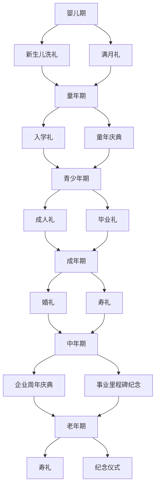

                 

# 生命仪式策划服务：设计现代人生命阶段仪式

## 关键词
- 生命仪式策划
- 生命阶段
- 仪式设计
- 服务流程
- 应用领域

## 摘要
本文旨在探讨生命仪式策划服务在现代社会的应用，特别是如何根据不同生命阶段设计合适的仪式。通过分析生命阶段的划分、仪式设计原理以及服务流程，本文旨在为读者提供一个全面的指导，帮助他们在家庭、企业和社会层面应用生命仪式策划服务，提升个人和社会的文化认同感与幸福感。

## 引言

### 问题的提出

在现代社会的快节奏生活中，个体与群体对于仪式的需求日益凸显。然而，仪式的缺失对个人成长、家庭稳定和社会和谐产生了一定的影响。这一现象引发了社会对于生命仪式策划服务的需求，即如何通过精心设计的仪式来满足人们在不同生命阶段的情感需求和文化认同。

### 生命仪式策划服务的市场前景

随着人们对于生活质量的追求，个性化、定制化的服务需求逐渐增加。生命仪式策划服务作为一种新兴的服务形式，市场前景广阔。它不仅能够满足个人在重大人生节点上的仪式需求，还能够为企业提供品牌形象提升和员工凝聚力培养的机会。

### 什么是生命仪式策划服务

#### 生命仪式的定义

生命仪式是指为了纪念和庆祝个人或集体在生命中的重要时刻而进行的正式活动。它通常包含特定的程序、象征和仪式语言。

#### 生命仪式策划服务的内涵

生命仪式策划服务是指专业团队根据个人或集体的需求，为其设计、策划和执行生命仪式的服务过程。它涵盖了从需求分析、仪式设计到执行和评估的全流程。

#### 生命仪式策划服务的特点

- **个性化**：根据个人或集体需求进行定制化设计。
- **专业性**：需要专业的策划团队和执行团队。
- **情感性**：仪式设计注重情感体验和文化内涵。
- **系统性**：涉及多个环节和领域的协调配合。

### 生命仪式策划服务的关键要素

#### 生命阶段划分

生命阶段划分是生命仪式策划服务的基础。根据不同的生命周期，将人生划分为多个阶段，如出生、成长、成年、婚嫁、退休等。

#### 仪式设计原则

仪式设计原则包括情感性、象征性、参与性等。这些原则旨在通过仪式传递情感价值，增强参与者的归属感和认同感。

#### 服务流程

生命仪式策划服务流程包括需求分析、仪式设计、场地与物料准备、仪式执行和效果评估等环节。每个环节都需要专业团队的协调与执行。

### 生命仪式策划服务的应用领域

#### 家庭与个人

家庭和个人是生命仪式策划服务的核心应用领域。例如，新生儿洗礼、成人礼、婚礼、寿礼等。

#### 企业与组织

企业在重要庆典、周年纪念、团队建设等活动中也可以运用生命仪式策划服务。例如，企业年会、产品发布会、团建活动等。

#### 社会与文化

社会和文化层面的生命仪式策划服务包括社区文化活动、文化庆典、历史纪念等。

### 本章小结

本文概述了生命仪式策划服务的背景、意义、定义、关键要素和应用领域。在接下来的章节中，我们将深入探讨生命仪式策划服务的理论与实践，为读者提供实用的指导和案例分析。接下来，我们将进一步分析生命阶段与仪式的关系，探讨仪式设计原理，并详细介绍生命仪式策划服务的具体流程。

### 第1章：生命仪式策划服务的背景与意义

#### 1.1 问题的提出

##### 1.1.1 现代社会的仪式需求

在现代社会中，仪式不仅是文化传承的重要载体，也是个体情感表达和社会认同的重要途径。然而，随着现代社会节奏的加快，传统仪式的简化或消失，导致个体在面对重要人生时刻时缺乏适当的仪式感。这种现象在一定程度上影响了人们的生活质量和心理健康。

##### 1.1.2 仪式缺失对个体的影响

仪式缺失对个体的情感和心理产生负面影响。例如，新生儿洗礼仪式的缺失可能导致父母对孩子成长的认同感降低；成人礼仪式的缺失可能影响个体自我认同的形成；婚礼仪式的缺失可能影响夫妻关系的稳定。因此，重新审视并设计合适的生命仪式，对于提升个体的心理健康和社会认同感具有重要意义。

##### 1.1.3 生命仪式策划服务的市场前景

随着人们对生活质量的追求和对文化认同的重视，生命仪式策划服务市场前景广阔。不仅家庭和个人对生命仪式有强烈需求，企业组织在庆典、纪念活动中也渴望通过仪式来增强团队凝聚力和品牌形象。因此，生命仪式策划服务有望成为新时代的重要服务形式。

#### 1.2 什么是生命仪式策划服务

##### 1.2.1 生命仪式的定义

生命仪式是指为了纪念和庆祝个人或集体在生命中的重要时刻而进行的正式活动。这些活动通常包含特定的程序、象征和仪式语言，旨在通过仪式传递情感价值，增强参与者的归属感和认同感。

##### 1.2.2 生命仪式策划服务的内涵

生命仪式策划服务是指专业团队根据个人或集体的需求，为其设计、策划和执行生命仪式的服务过程。这一过程包括从需求分析、仪式设计、场地与物料准备、仪式执行到效果评估等多个环节。生命仪式策划服务注重个性化、专业性和情感性，旨在满足不同群体在生命阶段中的仪式需求。

##### 1.2.3 生命仪式策划服务的特点

- **个性化**：根据个人或集体需求进行定制化设计。
- **专业性**：需要专业的策划团队和执行团队。
- **情感性**：仪式设计注重情感体验和文化内涵。
- **系统性**：涉及多个环节和领域的协调配合。

#### 1.3 生命仪式策划服务的关键要素

##### 1.3.1 生命阶段划分

生命阶段划分是生命仪式策划服务的基础。根据不同的生命周期，将人生划分为多个阶段，如出生、成长、成年、婚嫁、退休等。每个生命阶段都有其特定的仪式需求和仪式形式。

##### 1.3.2 仪式设计原则

仪式设计原则包括情感性、象征性、参与性等。这些原则旨在通过仪式传递情感价值，增强参与者的归属感和认同感。例如，新生儿洗礼仪式注重婴儿出生的喜庆和父母的情感体验；成人礼仪式注重个体成年的责任感和自我认同。

##### 1.3.3 服务流程

生命仪式策划服务流程包括需求分析、仪式设计、场地与物料准备、仪式执行和效果评估等环节。每个环节都需要专业团队的协调与执行。例如，在需求分析阶段，策划团队需要与客户沟通，了解其具体需求和期望；在仪式设计阶段，需要根据客户需求和文化背景进行创意策划；在场地与物料准备阶段，需要根据仪式规模和主题进行精心布置；在仪式执行阶段，需要确保仪式的顺利进行；在效果评估阶段，需要收集参与者反馈，总结经验教训。

#### 1.4 生命仪式策划服务的应用领域

##### 1.4.1 家庭与个人

家庭和个人是生命仪式策划服务的核心应用领域。常见的仪式包括新生儿洗礼、成人礼、婚礼、寿礼等。这些仪式不仅是个人生命中的重要节点，也是家庭情感交流和传承的重要时刻。

##### 1.4.2 企业与组织

企业在重要庆典、周年纪念、团队建设等活动中也可以运用生命仪式策划服务。例如，企业年会、产品发布会、团建活动等。这些仪式不仅能够增强企业品牌形象，还能够提升员工凝聚力和归属感。

##### 1.4.3 社会与文化

社会和文化层面的生命仪式策划服务包括社区文化活动、文化庆典、历史纪念等。这些仪式不仅能够传承文化，还能够增强社会凝聚力和文化认同感。

#### 1.5 本章小结

本章对生命仪式策划服务的背景、意义、定义、关键要素和应用领域进行了概述。在接下来的章节中，我们将深入探讨生命仪式策划服务的核心概念与联系，仪式设计原理，以及具体的策划服务流程。这些内容将为读者提供更加全面和深入的理解，帮助他们更好地应用生命仪式策划服务。

### 第2章：核心概念与联系

#### 2.1 生命阶段与仪式的关系

##### 2.1.1 生命阶段划分的原则

生命阶段的划分是生命仪式策划服务的基础。科学的划分原则有助于更准确地设计符合个体需求的仪式。以下是常见的生命阶段划分原则：

- **生理发展原则**：根据个体的生理成长特征，如婴儿期、童年期、青春期、成年期等。
- **心理发展原则**：根据个体的心理成熟程度，如依赖期、探索期、建立期、维护期等。
- **社会文化原则**：根据社会文化背景，如文化习俗、节日庆典、人生重要节点等。

##### 2.1.2 生命阶段的仪式设计

不同的生命阶段需要不同的仪式设计，以满足个体在该阶段的心理需求和社会文化需求。以下是几个关键的生命阶段及其典型仪式：

- **婴儿期**：新生儿洗礼、满月礼
- **童年期**：童年庆典、入学礼
- **青少年期**：成人礼、毕业礼
- **成年期**：婚礼、寿礼
- **中年期**：企业周年庆典、事业里程碑纪念
- **老年期**：寿礼、纪念仪式

##### 2.1.3 生命阶段与仪式的关联图示

以下是一个简单的生命阶段与仪式的关联图，展示了不同阶段的生命仪式：

#### 2.2 仪式设计原理

##### 2.2.1 仪式心理学基础

仪式设计心理学基础包括情感性、象征性、参与性等原则。这些原则有助于设计出能够深刻影响个体情感的仪式，提升参与者的归属感和认同感。以下是几个关键原则：

- **情感性**：仪式设计应注重情感体验，通过音乐、舞蹈、故事等元素，唤起参与者的情感共鸣。
- **象征性**：仪式中的符号和象征物应具有深刻的文化内涵，能够传递特定的情感和价值观念。
- **参与性**：仪式设计应鼓励参与者的主动参与，使其成为仪式的一部分，增强仪式的真实感和代入感。

##### 2.2.2 仪式设计的基本原则

仪式设计的基本原则包括个性化、创新性、适应性等。这些原则有助于确保仪式设计既符合个人需求，又具有独特的文化特色。以下是几个关键原则：

- **个性化**：根据个体的独特需求和背景，设计具有个性化的仪式。
- **创新性**：在传统仪式的基础上，融入创新元素，使仪式更加生动有趣。
- **适应性**：根据仪式的规模、场地、参与人数等因素，灵活调整仪式的设计和执行。

##### 2.2.3 仪式设计的流程与步骤

仪式设计的流程包括以下步骤：

1. **需求分析**：了解客户的具体需求和期望，包括仪式的主题、规模、形式等。
2. **创意策划**：根据需求，设计出初步的仪式方案，包括仪式流程、符号象征、活动内容等。
3. **方案优化**：对初步方案进行优化，确保仪式的可行性和文化内涵。
4. **实施准备**：根据最终方案，进行场地布置、物料准备、人员组织等实施准备工作。
5. **仪式执行**：按照既定方案，顺利执行仪式，确保仪式的顺利进行。
6. **效果评估**：仪式结束后，收集参与者的反馈，评估仪式的效果，总结经验教训。

#### 2.3 仪式设计案例分析

##### 2.3.1 案例一：新生儿洗礼仪式

新生儿洗礼仪式是一种典型的婴儿期仪式。它通常在新生儿出生后的一个月内举行，以祝福婴儿健康成长，祈求平安幸福。以下是新生儿洗礼仪式的设计要点：

1. **仪式流程**：仪式包括祈祷、洗礼、祝福等环节。祈祷环节通常由宗教领袖主持，洗礼环节使用圣水，祝福环节由亲朋好友致辞。
2. **符号象征**：洗礼仪式中的圣水、祈祷书、蜡烛等符号具有深刻的文化内涵，代表着对婴儿的祝福和祈愿。
3. **情感性**：仪式设计注重情感体验，通过音乐、祈祷、祝福等元素，唤起参与者的情感共鸣。

##### 2.3.2 案例二：成人礼仪式

成人礼仪式是一种典型的青少年期仪式。它标志着个体从少年迈向成年的重要时刻，通常在个体年满18岁时举行。以下是成人礼仪式的设计要点：

1. **仪式流程**：仪式包括入场、致辞、宣誓、仪式活动、颁发证书等环节。致辞环节通常由家长、老师或社会名人致辞，宣誓环节表示个体对成年责任的承诺。
2. **符号象征**：成人礼仪式中的成人礼袍、成人礼冠等符号代表着个体成年的身份和责任。
3. **参与性**：仪式设计鼓励参与者积极参与，通过宣誓、活动等环节，增强个体对成年的认同感和责任感。

##### 2.3.3 案例三：企业周年庆典仪式

企业周年庆典仪式是一种典型中年期仪式。它标志着企业成立周年，通常在每年的特定日期举行。以下是企业周年庆典仪式的设计要点：

1. **仪式流程**：仪式包括入场、致辞、表彰、节目表演、抽奖等环节。致辞环节通常由企业领导致辞，表彰环节表彰对企业有突出贡献的员工。
2. **符号象征**：企业周年庆典仪式中的花环、奖杯等符号代表着企业的成就和荣誉。
3. **创新性**：仪式设计注重创新，通过节目表演、互动游戏等环节，增强参与者的体验感和参与感。

#### 2.4 本章小结

本章介绍了生命阶段与仪式的关系、仪式设计原理以及仪式设计案例分析。通过本章的内容，读者可以了解到生命仪式策划服务的重要性和具体实践方法。在下一章中，我们将进一步探讨生命仪式策划服务的具体流程，包括需求分析、仪式设计、场地与物料准备、仪式执行和效果评估等环节。

### 第3章：生命仪式策划服务流程

#### 3.1 需求分析与规划

##### 3.1.1 服务对象分析

在进行生命仪式策划服务时，首先需要明确服务对象的具体需求和期望。服务对象可以是个人、家庭、企业或社会组织。不同对象对仪式的需求和期望有所不同，因此需要进行分析和分类。

- **个人**：个人仪式通常关注个人的成长、成就和重要生活节点。例如，婚礼、成人礼、生日庆典等。个人需求分析需要了解他们的兴趣爱好、文化背景和仪式主题偏好。
- **家庭**：家庭仪式通常关注家庭成员的共同经历和情感交流。例如，新生儿洗礼、家庭聚会、家庭纪念日等。家庭需求分析需要了解家庭成员的构成、家庭文化传统和家庭价值观。
- **企业**：企业仪式通常关注企业的历史、文化和品牌形象。例如，企业周年庆典、新品发布会、员工表彰大会等。企业需求分析需要了解企业的行业背景、企业文化目标和品牌形象要求。
- **社会组织**：社会组织仪式通常关注社会公益、文化传承和社会影响力。例如，慈善晚宴、文化节、纪念活动等。社会组织需求分析需要了解社会组织的使命、目标和受众群体。

##### 3.1.2 仪式主题确定

仪式主题是仪式的核心，它决定了仪式的风格、内容和形式。确定仪式主题需要考虑以下几个方面：

- **仪式目的**：明确仪式的目的和意义，如庆祝、纪念、感恩、祝福等。
- **文化背景**：结合服务对象的文化传统和习俗，选择合适的仪式主题。
- **个性化需求**：根据服务对象的特殊需求和期望，定制个性化的仪式主题。
- **创新性**：在传统仪式基础上，融入创新元素，使仪式更具吸引力和独特性。

##### 3.1.3 服务目标设定

设定服务目标是为了确保生命仪式策划服务的质量和效果。服务目标应包括以下几个方面：

- **情感体验**：确保参与者在仪式中能够感受到深刻的情感体验，增强归属感和认同感。
- **文化传承**：通过仪式传递文化传统和价值观念，增强文化认同感。
- **仪式效果**：确保仪式的顺利进行，达到预期的仪式效果，如氛围营造、互动体验、参与度等。
- **服务满意度**：提升客户满意度，建立良好的口碑和客户忠诚度。

#### 3.2 场地与物料准备

##### 3.2.1 场地选择

选择合适的场地是确保仪式顺利进行的关键。场地选择应考虑以下几个方面：

- **场地规模**：根据仪式的参与人数和规模选择合适的场地，确保场地宽敞、舒适。
- **场地位置**：选择交通便利、易于到达的场地，方便参与者的参与。
- **场地条件**：考虑场地的设施条件，如音响设备、照明设备、座椅安排等，确保仪式的各项需求得到满足。
- **场地费用**：根据预算选择合适的场地，同时考虑场地的租赁费用、装修费用等。

##### 3.2.2 物料准备

物料准备是仪式策划的重要环节，包括以下内容：

- **装饰物料**：如花篮、花束、彩带、灯笼、气球等，用于装饰场地和营造氛围。
- **道具与装备**：如宗教用品、服装、乐器、音响设备等，用于仪式的各个环节。
- **设备与器材**：如投影设备、音响设备、灯光设备、音响设备等，确保仪式的视听效果。
- **食物与饮品**：如餐点、茶点、饮品等，用于仪式中的休息和互动环节。

##### 3.2.3 场地布局规划

场地布局规划是确保仪式顺利进行的关键，包括以下内容：

- **座位安排**：根据仪式的参与人数和座位需求，合理安排座位，确保参与者的舒适和参与感。
- **舞台布置**：设置舞台，布置音响设备、灯光设备、道具等，确保仪式的视听效果。
- **通道规划**：规划入场、退场通道，确保参与者的流动畅通。
- **装饰布置**：根据仪式主题，合理布置装饰物料，营造仪式氛围。

#### 3.3 仪式策划与执行

##### 3.3.1 仪式流程设计

仪式流程设计是确保仪式顺利进行的关键，包括以下内容：

- **开篇环节**：引入仪式，营造氛围，通常包括欢迎致辞、介绍仪式背景等。
- **主体环节**：仪式的核心部分，包括祈祷、致辞、表彰、互动等环节。
- **高潮环节**：仪式的高潮部分，通常包括重要仪式活动、节目表演等。
- **结束环节**：仪式的结束部分，通常包括总结致辞、祝福语、合影留念等。

##### 3.3.2 参与人员组织

参与人员组织是确保仪式顺利进行的重要环节，包括以下内容：

- **主持人**：主持仪式的进行，确保仪式流程的顺畅。
- **表演者**：参与仪式的表演活动，如舞蹈、歌唱、乐器演奏等。
- **工作人员**：负责仪式的现场管理和协调工作，如音响师、灯光师、接待员等。
- **参与者**：仪式的参与者，包括亲朋好友、同事、观众等。

##### 3.3.3 仪式执行要点

仪式执行要点包括以下内容：

- **时间控制**：确保仪式的各个环节按时进行，避免拖延和混乱。
- **氛围营造**：通过音乐、灯光、道具等手段，营造仪式的氛围，增强参与者的情感体验。
- **互动体验**：鼓励参与者的积极参与，通过互动环节，增强仪式的互动性和参与感。
- **安全措施**：确保仪式的安全，包括防火、防盗、防意外等，确保参与者的安全。

#### 3.4 仪式效果评估

##### 3.4.1 评估指标设定

仪式效果评估是确保生命仪式策划服务质量和效果的重要环节。评估指标设定应包括以下几个方面：

- **参与度**：参与者的参与程度，如到场率、互动参与度等。
- **满意度**：参与者的满意度，如对仪式内容的评价、对服务质量的评价等。
- **情感体验**：参与者在仪式中的情感体验，如情感共鸣、心理满足等。
- **仪式效果**：仪式的预期效果，如文化传承、社会认同、品牌形象提升等。

##### 3.4.2 评估方法选择

评估方法选择应根据评估指标设定和具体情况进行。以下是一些常见的评估方法：

- **问卷调查**：通过发放问卷，收集参与者的反馈和评价。
- **访谈法**：对参与者进行面对面访谈，深入了解参与者的感受和体验。
- **观察法**：通过现场观察，记录仪式的各个环节和参与者的行为。
- **数据分析**：对收集的数据进行分析，评估仪式的效果和参与者的满意度。

##### 3.4.3 评估结果分析

评估结果分析应包括以下几个方面：

- **结果总结**：总结评估结果，包括参与度、满意度、情感体验和仪式效果等。
- **原因分析**：分析评估结果背后的原因，如仪式设计、执行、参与者需求等。
- **改进建议**：根据评估结果，提出改进建议，如优化仪式流程、提升服务质量等。
- **持续改进**：将评估结果应用于后续的仪式策划服务中，持续改进和优化。

#### 3.5 本章小结

本章介绍了生命仪式策划服务的具体流程，包括需求分析、仪式设计、场地与物料准备、仪式执行和效果评估等环节。通过本章的内容，读者可以了解到生命仪式策划服务的详细操作步骤和注意事项，为实际操作提供指导。在下一章中，我们将通过具体案例分析，深入探讨生命仪式策划服务的实践应用。

### 4.1 案例一：个人生日仪式策划

#### 4.1.1 项目背景

小明是一名30岁的年轻白领，他的生日即将到来。作为一位追求高品质生活的年轻人，小明希望在生日这一天举办一个特别的庆祝活动，邀请亲朋好友共度美好时光。然而，他对如何策划一场既温馨又难忘的生日仪式感到困惑，因此决定寻求专业的生命仪式策划服务。

#### 4.1.2 需求分析

在和小明进行深入沟通后，我们明确了以下需求：

1. **仪式主题**：以“感恩与成长”为主题，表达对过去一年的总结和对未来的期待。
2. **仪式规模**：邀请20位亲朋好友参加，包括家庭成员、同事和好友。
3. **仪式氛围**：营造温馨、浪漫和富有创意的氛围，让参与者感受到小明的情感和成长。
4. **仪式环节**：包括开场欢迎、生日蛋糕仪式、感恩分享、互动游戏和纪念摄影等。

#### 4.1.3 仪式主题确定

根据小明的需求和我们的策划建议，我们将仪式主题定为“感恩与成长”。这个主题不仅能够表达小明对亲朋好友的感激之情，还能够展示他过去一年的成长和进步。

#### 4.1.4 场地与物料准备

为了确保仪式的顺利进行，我们进行了以下场地与物料准备：

1. **场地选择**：选择一家位于市区的精品餐厅，环境优雅，适合举办小型聚会。
2. **装饰物料**：布置生日气球、彩带和花篮，营造温馨的生日氛围。
3. **设备与器材**：租赁音响设备、投影设备和摄影设备，确保仪式的视听效果。
4. **食物与饮品**：预定精美的生日蛋糕、餐点和饮品，满足参与者的味蕾。

#### 4.1.5 仪式策划与执行

根据仪式主题和需求，我们设计了以下仪式流程：

1. **开场欢迎**：主持人开场致辞，欢迎参与者的到来，表达对小明生日的祝福。
2. **生日蛋糕仪式**：点亮生日蜡烛，大家共同祝福小明生日快乐，小明发表感言。
3. **感恩分享**：邀请亲朋好友分享他们对小明的祝福和感激之情，表达对小明成长的认可。
4. **互动游戏**：组织互动游戏，如猜谜语、抽奖等，增强参与者的互动体验。
5. **纪念摄影**：在仪式结束后，组织参与者进行集体合影留念，记录这难忘的时刻。

在仪式执行过程中，我们注重氛围营造和参与体验，确保仪式的顺利进行。参与者纷纷表示仪式非常温馨、难忘，对策划和服务团队表示满意。

#### 4.1.6 仪式效果评估

仪式结束后，我们进行了效果评估，收集了参与者的反馈和评价。评估结果显示：

1. **参与度**：所有邀请的亲朋好友均到场参与，参与度非常高。
2. **满意度**：参与者对仪式的策划和执行表示非常满意，认为仪式温馨、浪漫、富有创意。
3. **情感体验**：参与者表示仪式让他们感受到小明的情感和成长，增强了他们之间的情感联系。
4. **仪式效果**：仪式达到了预期效果，成功营造了温馨、浪漫的氛围，增强了小明的归属感和认同感。

根据评估结果，我们对仪式策划和服务流程进行了总结和改进，为后续的仪式策划积累了宝贵经验。

#### 4.1.7 案例小结

通过本案例，我们展示了如何针对个人需求策划一场生日仪式。从需求分析、仪式主题确定、场地与物料准备到仪式策划与执行，每个环节都至关重要。专业的策划团队能够根据客户的具体需求，提供个性化的服务，确保仪式的成功和难忘。在未来，我们将继续探索更多生命仪式策划服务案例，为不同需求提供专业指导。

### 4.2 案例二：企业周年庆典仪式策划

#### 4.2.1 项目背景

ABC科技有限公司成立于2005年，是一家专注于信息技术和解决方案的领先企业。在即将到来的2023年，ABC科技有限公司将迎来其成立18周年的重要里程碑。为了庆祝这一重要时刻，公司决定举办一场盛大的周年庆典仪式，以表达对公司员工、客户和合作伙伴的感激之情，并展示公司的品牌形象和未来发展愿景。

#### 4.2.2 需求分析

在策划企业周年庆典仪式时，ABC科技有限公司提出了以下需求：

1. **仪式主题**：以“感恩·创新·未来”为主题，强调公司对员工的感激、对技术创新的坚持以及对未来发展的期待。
2. **仪式规模**：预计邀请300名重要员工、客户和合作伙伴参加。
3. **仪式氛围**：营造高端、大气、温馨的仪式氛围，展现公司的专业形象和人文关怀。
4. **仪式环节**：包括开场欢迎、公司领导致辞、表彰优秀员工、节目表演、互动游戏和抽奖环节。

#### 4.2.3 仪式主题确定

根据公司的需求和策划建议，我们确定了“感恩·创新·未来”这一主题。这一主题不仅体现了公司对员工的感激之情，还展示了公司对技术创新的重视以及对未来发展的信心。

#### 4.2.4 场地与物料准备

为了确保仪式的顺利进行，我们进行了以下场地与物料准备：

1. **场地选择**：选择了一家位于市中心的五星级酒店，其宽敞的宴会厅和优质的服务能够满足庆典仪式的需求。
2. **装饰物料**：布置了精美的气球、彩带、花篮和背景板，营造了高端大气的仪式氛围。
3. **设备与器材**：租赁了高质量的音响设备、舞台灯光、投影仪和摄影设备，确保仪式的视听效果。
4. **食物与饮品**：预定了一场精美的晚宴，包括各种精致的菜品和饮品，以满足参与者的味蕾。

#### 4.2.5 仪式策划与执行

根据仪式主题和需求，我们设计了以下仪式流程：

1. **开场欢迎**：主持人开场致辞，欢迎所有嘉宾的到来，并简要介绍公司的发展历程和庆典主题。
2. **公司领导致辞**：公司CEO发表致辞，回顾公司的发展历程，表达对员工、客户和合作伙伴的感激之情，并展望公司的未来。
3. **表彰优秀员工**：在仪式上，公司领导对过去一年中表现突出的员工进行了表彰，并颁发了荣誉证书和奖品。
4. **节目表演**：组织了员工自编自导的节目表演，包括舞蹈、歌曲、小品等，展示了公司的团队精神和创造力。
5. **互动游戏**：安排了互动游戏环节，如猜谜语、抽奖等，增加了参与者的互动体验。
6. **抽奖环节**：在晚宴期间，举行了抽奖活动，奖品包括电子产品、旅游套餐等，增加了仪式的趣味性和惊喜感。

在仪式执行过程中，我们注重细节和氛围的营造，确保每一个环节都能顺利进行。参与者和嘉宾们对仪式的策划和执行给予了高度评价，纷纷表示感受到了公司的关怀和重视。

#### 4.2.6 仪式效果评估

仪式结束后，我们进行了效果评估，通过问卷调查和现场访谈收集了参与者的反馈。评估结果显示：

1. **参与度**：所有邀请的嘉宾均到场参与，参与度非常高。
2. **满意度**：参与者对仪式的策划和执行表示非常满意，认为仪式高端、温馨、富有创意。
3. **情感体验**：参与者表示仪式让他们感受到了公司的关怀和重视，增强了他们对公司的认同感和归属感。
4. **仪式效果**：仪式成功展示了公司的品牌形象和未来发展愿景，达到了预期的效果。

根据评估结果，我们对仪式策划和服务流程进行了总结和改进，为后续的企业庆典仪式积累了宝贵经验。

#### 4.2.7 案例小结

通过本案例，我们展示了如何为企业周年庆典策划一场成功的仪式。从需求分析、仪式主题确定、场地与物料准备到仪式策划与执行，每个环节都至关重要。专业的策划团队能够根据企业的具体需求，提供个性化的服务，确保仪式的成功和难忘。未来，我们将继续探索更多企业庆典仪式的策划案例，为不同企业提供专业的指导和支持。

### 5.1 新技术对生命仪式策划服务的影响

随着科技的不断发展，虚拟现实（VR）、人工智能（AI）和社交媒体等新兴技术正在深刻地改变生命仪式策划服务的各个方面。这些技术不仅提升了仪式的创意和执行效率，还拓宽了服务的形式和范围。

#### 5.1.1 虚拟现实技术的应用

虚拟现实技术为生命仪式策划服务带来了全新的体验。通过VR技术，参与者可以身临其境地参与仪式，即使身处不同地点也能感受到仪式的氛围。例如，远在他国的亲友可以通过VR设备参加婚礼仪式，感受到现场的喜悦和情感。VR技术还可以用于个性化仪式设计，如通过虚拟现实模拟出特定的场景和氛围，为参与者提供独特的体验。

#### 5.1.2 人工智能技术的应用

人工智能技术在生命仪式策划服务中的应用主要体现在个性化推荐和数据分析方面。通过AI算法，可以分析参与者的偏好和需求，为其推荐合适的仪式设计和流程。例如，AI可以基于用户的历史数据，为其推荐符合个人风格的婚礼主题、音乐和装饰方案。此外，AI还可以在仪式执行过程中提供实时数据分析，帮助策划者及时调整仪式内容和流程，确保仪式的顺利进行。

#### 5.1.3 社交媒体的影响

社交媒体的兴起使得生命仪式策划服务更具互动性和传播性。通过社交媒体平台，参与者可以实时分享仪式的照片和视频，扩大仪式的影响力。此外，社交媒体还可以用于提前宣传仪式，吸引更多的关注和参与。例如，企业可以通过社交媒体平台发布仪式的预告视频，吸引员工的关注和参与，增强仪式的凝聚力和影响力。

#### 5.1.4 未来发展趋势

随着新技术的不断进步，生命仪式策划服务将呈现出以下发展趋势：

1. **个性化定制**：随着消费者对个性化需求的追求，生命仪式策划服务将更加注重个性化定制，为不同的个体和群体提供量身定制的仪式方案。
2. **跨领域融合**：生命仪式策划服务将与其他行业如旅游、娱乐等相结合，提供多元化的服务形式，如结合旅游的婚礼策划、结合娱乐的生日庆典等。
3. **数字化运营**：通过新技术实现数字化运营，提升服务的效率和质量，如在线预订、虚拟互动等。
4. **社区化发展**：生命仪式策划服务将逐渐向社区化方向发展，提供更加本地化和贴近社区需求的服务。

#### 5.1.5 挑战与机遇

尽管新技术为生命仪式策划服务带来了巨大的机遇，但也带来了一定的挑战。例如，技术实现的成本和复杂性可能成为中小企业参与这一领域的主要障碍。此外，如何确保虚拟仪式的真实性和参与感也是一个需要解决的问题。未来，随着技术的不断进步和普及，这些挑战有望逐步得到克服。

### 5.2 生命仪式策划服务的发展趋势

随着社会的发展和人们生活水平的提高，生命仪式策划服务正经历着深刻的变化。以下是生命仪式策划服务的发展趋势：

#### 5.2.1 个性化定制

个性化定制是未来生命仪式策划服务的重要趋势。消费者越来越注重个性化和定制化的服务，生命仪式策划服务也不例外。通过深入了解客户的个性化需求，策划团队可以提供独特的仪式设计，满足客户对特定文化、风格和情感体验的期望。

#### 5.2.2 跨界合作

跨界合作是生命仪式策划服务发展的重要方向。随着各行各业的融合，生命仪式策划服务将与其他领域如旅游、娱乐、艺术等相结合，提供多元化的服务体验。例如，结合旅游的婚礼策划、结合艺术的文化庆典等，为消费者带来全新的仪式体验。

#### 5.2.3 社区化的生命仪式策划平台

社区化的生命仪式策划平台将是未来发展的另一个重要趋势。通过建立社区化的服务平台，生命仪式策划服务可以更好地贴近社区居民的需求，提供本地化的服务和资源。这种模式有助于增强社区凝聚力，提升居民的生活质量。

#### 5.2.4 技术驱动创新

技术的进步将持续驱动生命仪式策划服务的创新。虚拟现实（VR）、人工智能（AI）、区块链等新技术将为生命仪式策划服务带来新的可能性。例如，VR技术可以实现远程参与，AI可以提供个性化推荐，区块链可以确保仪式的真实性和透明度。

#### 5.2.5 伦理与法律问题的关注

随着生命仪式策划服务的发展，伦理和法律问题也日益受到关注。在个性化定制和跨界合作的过程中，如何保护消费者的隐私、确保仪式的合法性和文化适宜性将成为重要的挑战。未来，生命仪式策划服务需要建立完善的伦理和法律框架，以确保服务的可持续性和合法性。

### 5.3 未来展望

在未来，生命仪式策划服务将继续朝着个性化、多元化、技术驱动和社区化的方向发展。随着新技术的不断进步，生命仪式策划服务将能够提供更加丰富和多样化的服务形式，满足不同消费者的需求。同时，伦理和法律问题的关注也将推动生命仪式策划服务向更加规范和专业的方向发展。

在未来，生命仪式策划服务有望成为社会文化传承和情感交流的重要载体，为个人、家庭、企业和社会带来更多的价值和意义。

### 6.1 生命仪式策划服务的伦理问题

生命仪式策划服务作为一项涉及情感、文化和社会认同的重要服务，其伦理问题至关重要。以下是几个关键伦理问题及其解决策略：

#### 6.1.1 个性化服务与隐私保护

个性化服务是生命仪式策划服务的核心价值之一，但在提供个性化服务的过程中，如何保护客户的隐私成为一个重要的伦理问题。例如，在策划个人婚礼时，策划团队可能需要获取客户的个人信息、兴趣爱好和家族背景等。以下是一些解决策略：

1. **严格保密协议**：与客户签订保密协议，确保客户的个人信息不会被泄露。
2. **数据匿名化**：在收集和分析客户信息时，进行数据匿名化处理，以降低隐私泄露的风险。
3. **透明化服务流程**：向客户明确解释服务流程和数据处理方式，增强客户的信任感。

#### 6.1.2 仪式设计与文化冲突

生命仪式策划服务涉及不同的文化背景和价值观，如何在设计中平衡不同文化的需求，避免文化冲突，是重要的伦理问题。以下是一些解决策略：

1. **文化敏感性培训**：对策划团队成员进行文化敏感性培训，增强其对多元文化的理解和尊重。
2. **文化适应性设计**：在仪式设计时，充分考虑不同文化的特点和需求，进行适应性调整。
3. **多元文化咨询**：在策划过程中，邀请具有多元文化背景的专家提供咨询，确保仪式设计的文化适宜性。

#### 6.1.3 仪式策划师的职业道德

仪式策划师作为服务的提供者，其职业道德至关重要。以下是一些确保仪式策划师职业道德的解决策略：

1. **专业伦理规范**：制定明确的职业道德规范，对仪式策划师的行为进行约束。
2. **职业培训与认证**：通过职业培训和教育，提高仪式策划师的专业素质和伦理意识。
3. **伦理审查制度**：建立伦理审查制度，对策划师的策划方案进行伦理评估，确保其符合道德标准。

### 6.2 生命仪式策划服务的法律问题

生命仪式策划服务作为一项涉及合同、责任和文化法律规范的服务，其法律问题不容忽视。以下是几个关键法律问题及其应对策略：

#### 6.2.1 合同法律风险

生命仪式策划服务通常涉及合同签订，如何降低合同法律风险是重要的法律问题。以下是一些应对策略：

1. **明确合同条款**：在合同中明确服务内容、费用、违约责任等条款，以避免合同纠纷。
2. **法律咨询**：在签订合同前，咨询专业律师，确保合同的合法性和有效性。
3. **合同履行监督**：在合同履行过程中，进行监督和检查，确保双方按照合同约定执行。

#### 6.2.2 民事责任

生命仪式策划服务涉及策划、执行和后续评估等多个环节，如何避免民事责任是重要的法律问题。以下是一些应对策略：

1. **责任保险**：为生命仪式策划服务购买责任保险，以应对可能的民事责任。
2. **风险评估**：在策划和执行过程中，进行风险评估，提前识别和防范潜在的法律风险。
3. **责任追究**：在发生法律纠纷时，积极追究责任，通过法律途径维护自身权益。

#### 6.2.3 文化法律规制

生命仪式策划服务涉及不同文化背景和法律规定，如何遵守文化法律规制是重要的法律问题。以下是一些应对策略：

1. **文化法律培训**：对策划团队成员进行文化法律培训，增强其对相关法律规定的理解和遵守。
2. **文化适应性调整**：在策划和执行过程中，根据不同文化的法律规定，进行适应性调整。
3. **法律咨询**：在策划和执行过程中，定期咨询专业律师，确保遵守相关法律和规定。

### 6.3 伦理与法律问题的应对策略

为了确保生命仪式策划服务的质量和合法性，应对伦理与法律问题需要采取以下策略：

1. **建立健全的伦理与法律框架**：制定明确的伦理规范和法律条款，为生命仪式策划服务提供指导。
2. **加强培训和监督**：通过培训和监督，提高策划团队的专业素质和伦理意识，确保服务符合法律和道德标准。
3. **建立反馈机制**：建立客户反馈机制，及时收集和处理客户投诉，改善服务质量和法律合规性。
4. **定期审查与更新**：定期审查和更新伦理与法律框架，确保其适应不断变化的社会环境和法律规定。

### 6.4 本章小结

本章探讨了生命仪式策划服务中的伦理和法律问题，包括个性化服务与隐私保护、仪式设计与文化冲突、仪式策划师的职业道德、合同法律风险、民事责任、文化法律规制等。通过建立伦理与法律框架、加强培训和监督、建立反馈机制以及定期审查与更新，可以确保生命仪式策划服务的质量和合法性，为个人、家庭、企业和社会提供更加专业和可靠的服务。

### 7.1 成功案例分享

#### 7.1.1 个人仪式策划案例

**案例背景**：

李先生是一位事业有成的企业家，他的父母即将迎来金婚纪念日。为了表达对父母的感激和祝福，李先生决定策划一场特别的金婚庆典仪式。他希望这个仪式能够既体现出家族的传统，又能融合现代元素，让在场的每一位亲朋好友都能感受到温馨和欢乐。

**需求分析**：

1. **仪式主题**：以“爱在金婚”为主题，强调家庭和睦与爱情的长久。
2. **仪式规模**：预计邀请100位亲朋好友参加。
3. **仪式氛围**：温馨、浪漫、传统与现代相结合。
4. **仪式环节**：包括家庭视频回忆、父母致辞、亲友祝福、花束传递、餐宴庆祝等。

**仪式主题确定**：

“爱在金婚”这一主题既体现了父母对爱情长久的追求，也表达了李先生对父母的敬意和感激。

**场地与物料准备**：

1. **场地选择**：选择了一家具有古典氛围的酒店宴会厅，布置了鲜花和红色绸带，营造出喜庆的氛围。
2. **装饰物料**：包括红毯、花篮、蜡烛、灯光等，营造温馨的气氛。
3. **设备与器材**：租赁了高质量的音响设备和投影仪，确保仪式的视听效果。
4. **食物与饮品**：预定了一顿精致的晚宴，包括中式佳肴和西式甜点。

**仪式策划与执行**：

1. **开场环节**：主持人开场致辞，欢迎宾客的到来，并简要介绍金婚庆典的主题。
2. **家庭视频回忆**：播放了李先生父母从相识到结婚的珍贵视频，让在场的宾客感受到了他们的爱情历程。
3. **父母致辞**：李先生的父母发表了感人的致辞，感谢家人的支持和陪伴。
4. **亲友祝福**：亲友们纷纷上台发言，表达对李先生父母的祝福和敬意。
5. **花束传递**：李先生将一束花传递给父母，象征着他们对家庭的爱和承诺。
6. **餐宴庆祝**：晚宴环节，宾客们共享美食，共同庆祝这一美好的时刻。

**仪式效果评估**：

仪式结束后，李先生收到了许多宾客的积极反馈。他们纷纷表示，这个仪式不仅温馨感人，还充满了欢乐和爱意。李先生的父母也感到非常满意，认为这场仪式是他们对金婚纪念的最佳纪念。

**案例小结**：

通过这个案例，我们可以看到，一个成功的个人仪式策划需要深入的需求分析、精心的主题确定、细致的场地与物料准备，以及周到的仪式策划与执行。专业的生命仪式策划服务不仅能够满足客户的需求，还能为重要的生活时刻增添难忘的记忆。

#### 7.1.2 企业仪式

**案例背景**：

XYZ科技有限公司是一家快速发展的科技企业，他们计划在即将到来的新年伊始举办一场盛大的企业年会，以庆祝过去一年的成就，激发员工的工作热情，并展望新年的发展目标。

**需求分析**：

1. **仪式主题**：以“携手共进，共创未来”为主题，强调团队协作和公司的发展愿景。
2. **仪式规模**：预计邀请公司全体员工及家属约500人参加。
3. **仪式氛围**：积极、热情、富有创新精神。
4. **仪式环节**：包括公司领导致辞、年度表彰、节目表演、抽奖环节、互动游戏、晚宴庆祝等。

**仪式主题确定**：

“携手共进，共创未来”这一主题不仅体现了公司对员工团结一心的期望，也展示了公司对未来发展的信心和愿景。

**场地与物料准备**：

1. **场地选择**：选择了一家具有现代化设施的大礼堂，布置了LED大屏和音响系统，确保仪式的视听效果。
2. **装饰物料**：使用了公司标志色和图案的气球、横幅和背景板，营造出公司氛围。
3. **设备与器材**：租赁了高质量的音响设备、灯光设备和投影仪，确保仪式的视听效果。
4. **食物与饮品**：预定了一场丰盛的晚宴，包括中式和西式菜品，满足不同员工和家属的口味。

**仪式策划与执行**：

1. **开场环节**：主持人开场致辞，欢迎员工的到来，并简要介绍企业年会的主题。
2. **公司领导致辞**：公司CEO发表了热情洋溢的致辞，回顾过去一年的成就，展望新年的发展目标，并感谢员工的辛勤付出。
3. **年度表彰**：对过去一年中表现突出的员工进行了表彰，颁发了奖金和奖品，激励员工的积极性和创造力。
4. **节目表演**：组织了员工自编自导的节目表演，包括舞蹈、歌唱、小品等，展示了公司的团队精神和创造力。
5. **抽奖环节**：在晚宴期间，举行了抽奖活动，奖品包括电子产品、旅游套餐等，增加了仪式的趣味性和惊喜感。
6. **互动游戏**：安排了互动游戏，如团建游戏、知识问答等，增强了员工的互动体验。
7. **晚宴庆祝**：晚宴环节，员工和家属共同享用美食，共享欢乐时光。

**仪式效果评估**：

仪式结束后，XYZ科技有限公司收到了大量积极反馈。员工们表示，这个仪式不仅增强了他们的归属感和公司凝聚力，还激发了他们在新一年里努力工作的热情。家属们也对这次活动给予了高度评价，认为这是一个非常温馨和有意义的家庭聚会。

**案例小结**：

通过这个案例，我们可以看到，企业仪式的成功策划和执行对于提升员工凝聚力、增强公司文化认同感和激励员工积极性具有重要意义。专业的生命仪式策划服务能够帮助企业打造一个具有仪式感和影响力的活动，为公司的未来发展奠定坚实的基础。

### 总结与展望

本章通过两个成功案例，详细展示了个人仪式策划和企业仪式策划的具体过程和关键要素。无论是个人还是企业，生命仪式策划服务的核心都是满足特定需求和创造难忘的体验。通过深入的需求分析、精心策划与执行，以及后续的效果评估，这些案例证明了专业生命仪式策划服务的重要性和有效性。

在未来，随着社会的发展和技术的进步，生命仪式策划服务将继续演变和扩展。个性化定制、跨领域合作、数字化运营以及伦理与法律问题的关注将是发展的关键方向。我们鼓励读者继续关注这一领域的发展动态，积极探讨和创新，为个人、家庭、企业和社会提供更加丰富和专业的生命仪式策划服务。

### 7.2 最佳实践 Tips

在生命仪式策划服务中，以下最佳实践 Tips 能够帮助您更高效地完成项目，并确保仪式的顺利进行：

1. **充分沟通与了解需求**：
   - 在项目开始前，与客户进行深入沟通，了解他们的具体需求和期望。
   - 通过问卷调查、访谈等方式收集详细信息，确保对需求有全面和准确的理解。

2. **明确仪式主题与目标**：
   - 确定清晰的仪式主题，使其与客户的需求和背景相契合。
   - 设定明确的仪式目标，如提升情感体验、增强文化认同、展示品牌形象等。

3. **精心策划与执行**：
   - 制定详细的仪式流程和计划，确保每个环节都有明确的职责和时间表。
   - 考虑到可能出现的突发情况，预留一定的弹性时间，以应对意外情况。

4. **场地与物料准备**：
   - 选择适合的场地，确保其符合仪式的规模和氛围要求。
   - 提前进行场地布局和物料准备，检查所有设备的功能，确保仪式当天的正常运行。

5. **确保参与者的参与感**：
   - 设计互动环节，鼓励参与者的积极参与。
   - 通过音乐、舞蹈、故事等元素，营造温馨和富有情感的仪式氛围。

6. **注重仪式效果评估**：
   - 在仪式结束后，通过问卷调查、访谈等方式收集参与者的反馈。
   - 分析评估结果，总结经验教训，为后续的仪式策划提供参考。

### 7.3 小结

通过本文的详细探讨，我们全面了解了生命仪式策划服务的背景、核心概念、理论实践、服务流程以及成功案例。生命仪式策划服务不仅满足了个人和家庭的情感需求，也在企业和社会层面发挥了重要作用。随着新技术的应用和社会的不断发展，生命仪式策划服务将继续创新和进步。

本文提供了多个最佳实践 Tips，旨在帮助读者在实际操作中更加高效和成功。我们鼓励读者继续关注生命仪式策划服务领域的发展动态，积极探索和实践，为个人、家庭、企业和社会提供更加专业和有价值的仪式策划服务。

### 7.4 注意事项

在生命仪式策划服务中，为确保项目的顺利进行和参与者的满意，需要注意以下几点：

1. **充分沟通**：与客户保持密切沟通，了解他们的具体需求和期望，确保双方在策划过程中有共同的理解和目标。

2. **尊重文化**：尊重不同文化和传统，避免在仪式设计中出现文化冲突。对于涉及宗教或特定文化的仪式，应深入了解相关的文化背景和习俗。

3. **风险管理**：识别和评估可能出现的风险，如场地设备故障、天气变化等，并制定相应的应对措施，确保仪式的顺利进行。

4. **细节管理**：注重仪式的细节，如座位安排、装饰布置、音响灯光等，确保每个环节都达到预期效果。

5. **法律合规**：确保策划和执行过程符合相关法律法规，如合同签订、知识产权保护等，避免法律纠纷。

6. **紧急预案**：制定紧急预案，以应对可能出现的突发事件，如突发事件处理、人员疏散等，确保参与者的安全。

### 7.5 拓展阅读

为了更深入地了解生命仪式策划服务的理论和实践，读者可以参考以下拓展阅读资源：

1. **《生命礼仪策划与执行》**：该书详细介绍了生命礼仪策划的理论基础和实践操作，适用于策划从业者。
2. **《仪式文化与社会认同》**：这本书探讨了仪式在社会文化中的重要作用，分析了仪式如何影响社会认同和个人情感。
3. **《现代仪式策划案例集》**：汇集了多个现代仪式策划案例，提供了丰富的实战经验和灵感。
4. **《社交媒体与仪式策划》**：探讨社交媒体在仪式策划中的应用，分析了社交媒体对仪式传播和参与的影响。

通过阅读这些资源，读者可以进一步拓展对生命仪式策划服务的认识，为实际操作提供更多参考和指导。

### 7.6 作者信息

**作者：** AI天才研究院/AI Genius Institute & 禅与计算机程序设计艺术 /Zen And The Art of Computer Programming

AI天才研究院是一家专注于人工智能和科技创新的研究机构，致力于推动人工智能技术在各个领域的应用和发展。禅与计算机程序设计艺术则是一部深入探讨计算机编程哲学的经典著作，为读者提供了独特的编程思维和技巧。

通过本文，我们希望能够为读者提供关于生命仪式策划服务的全面理解和实践指导，帮助他们在实际操作中取得成功。感谢您的阅读，期待与您在更多领域进行深入的交流和探讨。

