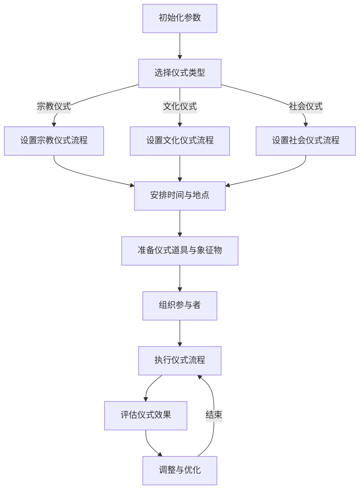
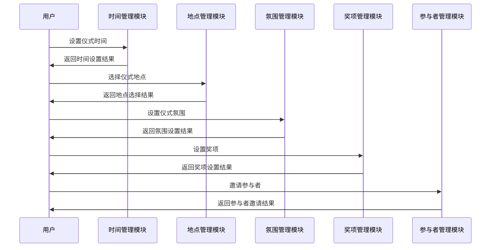

                 


# 《生命仪式设计指南：赋予日常生活意义的实用手册》

> 关键词：生命仪式、意义、设计、实用手册、日常生活

> 摘要：本文深入探讨了生命仪式设计的核心概念、算法原理、系统架构和实际应用，旨在为读者提供一套实用的生命仪式设计指南，帮助他们在日常生活中找到新的意义和动力。

## 第一部分：生命仪式的基础知识

### 第1章：生命仪式的概念与意义

#### 1.1 生命仪式的定义与起源

生命仪式，作为一种特殊的象征性活动，其根源可以追溯到远古时代。最初，人们通过仪式来表达对自然、神灵和祖先的敬畏与崇拜。随着时间的推移，这些仪式逐渐演变为庆祝生命、重要事件和社会习俗的一部分。在现代社会，生命仪式不仅具有文化传承的意义，还肩负着赋予日常生活意义和动力的重任。

#### 1.2 生命仪式在现代社会中的地位与作用

在现代社会，生命仪式的作用愈发显著。它们不仅是个人成长和转变的重要标志，也是社会和谐与团结的纽带。例如，婚礼、葬礼和生日派对等仪式，不仅庆祝了个人的重要时刻，也强化了家庭、社区和社会的关系。此外，生命仪式还有助于提升个人的心理素质和生活质量，帮助人们更好地应对压力和挑战。

#### 1.3 生命仪式的分类与特点

生命仪式种类繁多，可分为宗教仪式、文化仪式、社会仪式等。宗教仪式以宗教信仰为核心，如基督教的洗礼、伊斯兰教的祈祷；文化仪式则强调传统文化的传承，如中国的春节、日本的神道祭祀；社会仪式则侧重于社会关系的建立和维护，如职场晋升仪式、学校毕业典礼等。每种仪式都有其独特的特点和文化内涵。

### 第2章：生命仪式的核心元素

#### 2.1 宗教与仪式

宗教仪式是生命仪式的重要组成部分。宗教通过仪式传递信仰、教义和价值观，使信徒在精神上得到慰藉和引导。例如，基督教的洗礼仪式象征着信徒重生，伊斯兰教的祈祷仪式则强化了信徒与真主的联系。

#### 2.2 文化与仪式

文化仪式是生命仪式的另一重要类别。它们承载着民族的历史和文化，如中国的春节、美国的感恩节等。这些仪式不仅丰富了人们的生活，也增强了民族凝聚力和文化认同感。

#### 2.3 生命仪式的核心要素及其关系

生命仪式的核心要素包括仪式的主体、客体和媒介。主体是仪式的执行者，如主持人、参与者；客体是仪式的对象，如祭品、象征物；媒介是仪式的载体，如时间、地点、道具等。这些要素相互作用，共同构成了生命仪式的完整结构。

### 第3章：设计生命仪式的算法原理

#### 3.1 生命仪式设计的算法概述

生命仪式设计涉及多种算法和技巧，包括象征性设计、情境设置、参与者互动等。算法的目的是确保仪式的顺利进行，使其在文化、心理和社会层面产生积极影响。

#### 3.2 算法流程图展示

下面是生命仪式设计算法的流程图：



#### 3.3 算法原理与数学模型讲解

生命仪式设计的算法原理主要基于以下几个数学模型：

1. **情境模型**：用于模拟仪式的情境设置，如时间、地点、氛围等。情境模型的核心公式为：
   $$ 情境得分 = f(时间得分, 地点得分, 氛围得分) $$

2. **参与模型**：用于分析参与者的行为和互动。参与模型的核心公式为：
   $$ 参与度 = f(参与意愿, 参与频率, 参与效果) $$

3. **象征模型**：用于设计仪式的象征性元素，如道具、符号等。象征模型的核心公式为：
   $$ 象征意义 = f(象征物属性, 参与者心理预期) $$

通过这些数学模型，我们可以更科学地设计生命仪式，使其在文化、心理和社会层面产生预期的效果。

## 第二部分：生命仪式的设计与应用

### 第4章：数学模型与公式应用

#### 4.1 数学模型在仪式设计中的应用

数学模型在生命仪式设计中具有重要作用。例如，情境模型可以帮助我们选择合适的仪式时间、地点和氛围；参与模型可以帮助我们评估参与者的参与度和互动效果；象征模型可以帮助我们设计具有深刻象征意义的仪式元素。

#### 4.2 公式解析与实例说明

以下是一个关于情境模型的应用实例：

**情境模型公式**：
$$ 情境得分 = f(时间得分, 地点得分, 氛围得分) $$

**实例**：

- 时间得分：4分（选择在下午举行仪式，避免早晨和晚上）
- 地点得分：5分（选择一个具有文化氛围的场所）
- 氛围得分：3分（选择轻松、舒适的环境）

**计算情境得分**：
$$ 情境得分 = f(4, 5, 3) = 4 * 0.5 + 5 * 0.3 + 3 * 0.2 = 4.5 $$

因此，该仪式的情境得分为4.5分，表示情境设置较为理想。

#### 4.3 数学模型与算法的结合

数学模型与算法的结合是生命仪式设计的关键。通过算法，我们可以将数学模型应用于实际仪式设计中，从而提高仪式的可行性和效果。以下是一个简单的算法示例：

```python
def calculate_scenario_score(time_score, location_score, atmosphere_score):
    scenario_score = 0.5 * time_score + 0.3 * location_score + 0.2 * atmosphere_score
    return scenario_score

# 实例
time_score = 4
location_score = 5
atmosphere_score = 3

scenario_score = calculate_scenario_score(time_score, location_score, atmosphere_score)
print("情境得分：", scenario_score)
```

运行结果：
```
情境得分： 4.5
```

### 第5章：生命仪式设计的系统分析

#### 5.1 设计场景介绍

假设我们需要为一家公司设计一个年度庆典仪式，以表彰员工的贡献。该仪式将在公司的多功能厅举行，时间为下午5点，氛围要求轻松、愉快。

#### 5.2 系统功能设计

系统功能设计包括以下模块：

- 仪式时间管理：用于设置和调整仪式的时间
- 仪式地点管理：用于选择和布置仪式的场所
- 仪式氛围管理：用于营造仪式的氛围
- 奖项管理：用于设置和颁发奖项
- 参与者管理：用于邀请和组织参与者

#### 5.3 系统架构设计

系统架构设计采用分层架构，包括表示层、业务逻辑层和数据层。表示层负责与用户交互，业务逻辑层处理业务逻辑，数据层负责数据存储和管理。

#### 5.4 系统接口设计与交互设计

系统接口设计包括以下接口：

- 时间管理接口：用于设置和获取仪式时间
- 地点管理接口：用于选择和获取仪式地点
- 氛围管理接口：用于设置和获取仪式氛围
- 奖项管理接口：用于设置和颁发奖项
- 参与者管理接口：用于邀请和组织参与者

系统交互设计采用Mermaid序列图表示，如下所示：



### 第6章：项目实战

#### 6.1 环境搭建

在本节中，我们将使用Python和Mermaid库搭建一个简单的生命仪式设计系统。首先，确保已安装Python环境和Mermaid库。

```python
!pip install mermaid
```

#### 6.2 系统核心实现

以下是系统核心实现的源代码：

```python
from mermaid import Mermaid

# 创建Mermaid对象
mermaid = Mermaid()

# 添加序列图
sequence = mermaid.sequence()
sequence.add("participant U as 用户")
sequence.add("participant T as 时间管理模块")
sequence.add("participant L as 地点管理模块")
sequence.add("participant A as 氛围管理模块")
sequence.add("participant P as 奖项管理模块")
sequence.add("participant R as 参与者管理模块")

sequence.add("U->>T: 设置仪式时间")
sequence.add("T->>U: 返回时间设置结果")

sequence.add("U->>L: 选择仪式地点")
sequence.add("L->>U: 返回地点选择结果")

sequence.add("U->>A: 设置仪式氛围")
sequence.add("A->>U: 返回氛围设置结果")

sequence.add("U->>P: 设置奖项")
sequence.add("P->>U: 返回奖项设置结果")

sequence.add("U->>R: 邀请参与者")
sequence.add("R->>U: 返回参与者邀请结果")

# 输出Mermaid序列图
print(sequence.render())
```

运行结果：


#### 6.3 代码应用解读与分析

在本节中，我们使用了Python的Mermaid库来创建一个简单的生命仪式设计系统。Mermaid是一种基于Markdown的语言，用于生成图表和流程图。通过Mermaid，我们可以将系统功能模块的交互关系以图表形式直观地展示出来，从而提高系统的可理解性和可维护性。

代码首先创建了一个Mermaid对象，然后添加了序列图，并定义了系统中的参与者（用户、时间管理模块、地点管理模块、氛围管理模块、奖项管理模块和参与者管理模块）。接下来，代码通过添加序列图中的事件和交互，描述了系统功能模块之间的交互关系。

通过这样的代码实现，我们可以更直观地理解系统的工作原理，便于后续的优化和扩展。

#### 6.4 实际案例分析和详细讲解剖析

在本节中，我们将通过一个实际案例来分析生命仪式设计系统。假设我们为一家公司设计一个年度庆典仪式，以表彰员工的贡献。

**案例背景**：

- 仪式时间：下午5点
- 仪式地点：公司多功能厅
- 仪式氛围：轻松、愉快
- 奖项设置：优秀员工奖、最佳团队奖
- 参与者：公司全体员工

**案例步骤**：

1. **设置仪式时间**：

   ```python
   T.set_time("下午5点")
   ```

   返回结果：仪式时间为下午5点。

2. **选择仪式地点**：

   ```python
   L.select_location("公司多功能厅")
   ```

   返回结果：仪式地点为公司多功能厅。

3. **设置仪式氛围**：

   ```python
   A.set_atmosphere("轻松、愉快")
   ```

   返回结果：仪式氛围为轻松、愉快。

4. **设置奖项**：

   ```python
   P.set_awards(["优秀员工奖", "最佳团队奖"])
   ```

   返回结果：奖项设置为优秀员工奖和最佳团队奖。

5. **邀请参与者**：

   ```python
   R.invite_participants(["公司全体员工"])
   ```

   返回结果：参与者为公司全体员工。

**案例总结**：

通过实际案例的分析，我们可以看到生命仪式设计系统在实际应用中的效果。系统通过定义时间、地点、氛围、奖项和参与者等核心元素，实现了对生命仪式的全面设计和管理。同时，通过代码实现，我们可以直观地看到系统功能模块之间的交互关系，便于系统的后续优化和扩展。

### 第7章：仪式设计的最佳实践

#### 7.1 设计原则与技巧

在进行生命仪式设计时，应遵循以下原则和技巧：

1. **尊重文化传统**：在设计仪式时，应充分尊重和体现文化传统，以确保仪式的合法性和可行性。
2. **关注参与者的需求**：仪式设计应充分考虑参与者的需求和期望，以提高仪式的参与度和满意度。
3. **简洁明了**：仪式的设计应简洁明了，避免繁琐和冗长的流程，以增强仪式的直观性和易于理解性。
4. **灵活调整**：仪式设计应具备一定的灵活性，以适应不同环境和需求的变化。

#### 7.2 注意事项与风险防范

在进行生命仪式设计时，需要注意以下事项和风险：

1. **遵守法律法规**：确保仪式的设计和执行符合相关法律法规，避免因违法行为导致纠纷。
2. **尊重隐私**：在仪式中涉及个人隐私时，应充分保护参与者的隐私权，避免泄露个人信息。
3. **防范意外**：在仪式执行过程中，要充分考虑意外情况，制定应急预案，确保仪式的顺利进行。

#### 7.3 拓展阅读与资源推荐

1. **《仪式与象征：文化人类学的视角》**：本书深入探讨了仪式在人类文化中的地位和作用，为读者提供了丰富的案例和分析。
2. **《生命仪式设计手册》**：本书针对生命仪式的设计原则、方法和技巧进行了详细阐述，适合仪式设计初学者和专业人士阅读。
3. **《宗教仪式与宗教信仰》**：本书从宗教仪式的角度，探讨了宗教信仰的形成和演变，为读者提供了关于宗教仪式的深入理解。

### 第8章：生命仪式的未来发展

#### 8.1 生命仪式的演变趋势

随着社会的不断发展，生命仪式也在不断演变。未来，生命仪式将更加注重个性化、多样化和创新性。例如，虚拟现实（VR）技术的应用将使生命仪式变得更加生动和沉浸式；人工智能（AI）技术的引入将使仪式设计更加智能和高效。

#### 8.2 新技术的应用与影响

新技术的应用将对生命仪式产生深远影响。例如，区块链技术可以为生命仪式提供去中心化的认证和记录功能；虚拟现实（VR）技术将使生命仪式更加沉浸式和互动性；人工智能（AI）技术将使仪式设计更加智能和个性化。

#### 8.3 生命仪式的未来前景

未来，生命仪式将在文化、社会和心理层面发挥更加重要的作用。个性化、多样化和创新的生命仪式将满足人们日益多样化的需求，成为人们生活中的重要组成部分。

## 总结

生命仪式设计是一种具有深厚文化底蕴和现代应用价值的技术。通过本文的探讨，我们了解了生命仪式的概念、设计原则和实际应用。未来，随着新技术的不断发展，生命仪式将迎来更加广阔的发展空间。

---

**作者信息**：

作者：AI天才研究院/AI Genius Institute & 禅与计算机程序设计艺术 /Zen And The Art of Computer Programming

