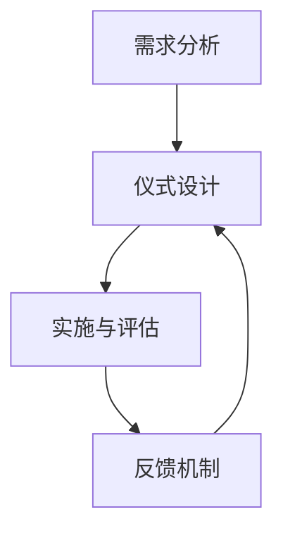
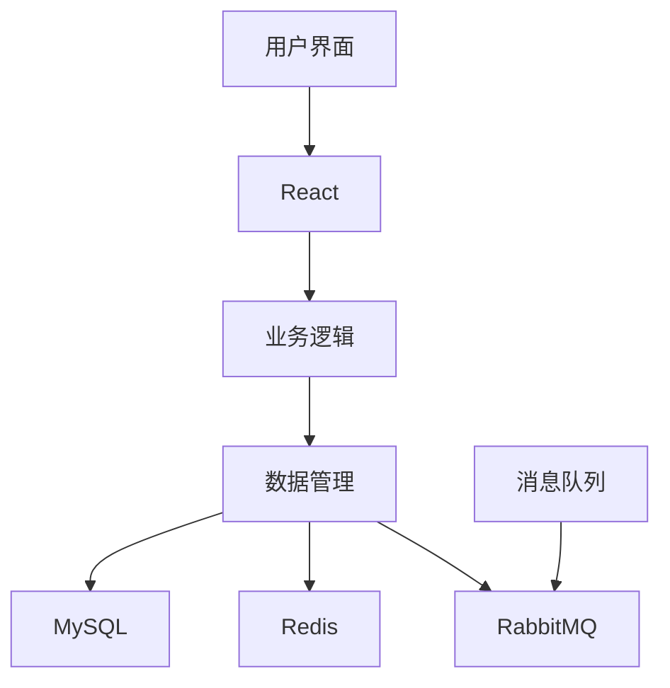

                 

# 生命仪式设计：为现代人创造神圣时刻

## 关键词

生命仪式设计、神圣时刻、精神修养、算法原理、系统架构、项目实战

## 摘要

在现代社会的快节奏生活中，人们的精神需求日益增加。本文旨在探讨如何通过生命仪式设计，为现代人创造神圣时刻，提升精神修养。文章首先介绍了生命仪式设计的背景及其在现代社会的重要性，然后详细阐述了生命仪式设计中的核心概念，包括仪式、神圣时刻和精神修养。接着，文章通过算法原理讲解和系统架构设计，展示了如何将生命仪式设计理念应用于实际项目中。最后，通过项目实战部分，深入剖析了生命仪式设计在具体项目中的应用，为读者提供了实践指导。

## 目录大纲设计

### 第一部分：背景介绍

- **第1章：生命仪式设计的起源与演变**
  - 1.1 生命仪式的起源
    - 古代文明中的仪式
    - 生命仪式的意义与作用
  - 1.2 现代生命仪式的演变
    - 社会变迁对生命仪式的影响
    - 生命仪式的现代意义
  - 1.3 现代人的精神需求与仪式设计
    - 现代社会的精神困境
    - 生命仪式的现代需求

- **第2章：核心概念与联系**
  - 2.1 仪式
    - 仪式的定义与特性
    - 仪式的类型与形式
  - 2.2 神圣时刻
    - 神圣时刻的概念与特征
    - 创造神圣时刻的方法
  - 2.3 精神修养
    - 精神修养的内涵与意义
    - 精神修养的方法与途径
  - **第3章：核心概念关系图**
    - 3.1 核心概念对比表格
    - 3.2 生命仪式设计核心概念ER图（使用Mermaid绘制）

### 第二部分：算法原理讲解

- **第4章：生命仪式设计流程**
  - 4.1 生命仪式设计概述
  - 4.2 生命仪式设计流程
    - 4.2.1 需求分析
    - 4.2.2 仪式设计
    - 4.2.3 实施与评估

- **第5章：生命仪式算法原理**
  - 5.1 生命仪式算法的基本概念
  - 5.2 生命仪式算法的设计原理
    - 5.2.1 算法流程图（使用Mermaid绘制）
    - 5.2.2 Python源代码示例
  - 5.3 算法原理数学模型与公式
    - 5.3.1 数学模型
    - 5.3.2 算法公式
  - 5.4 算法举例说明

### 第三部分：系统分析与架构设计

- **第6章：系统功能设计**
  - 6.1 生命仪式设计系统介绍
  - 6.2 系统功能需求分析
    - 6.2.1 用户管理
    - 6.2.2 仪式设计
    - 6.2.3 数据分析与反馈

- **第7章：系统架构设计**
  - 7.1 系统架构设计原则
  - 7.2 系统架构设计
    - 7.2.1 系统架构图（使用Mermaid绘制）
    - 7.2.2 系统模块说明

- **第8章：系统接口设计**
  - 8.1 系统接口设计原则
  - 8.2 系统接口定义
    - 8.2.1 用户接口
    - 8.2.2 数据接口

- **第9章：系统交互设计**
  - 9.1 系统交互设计概述
  - 9.2 系统交互流程
    - 9.2.1 用户登录与注册流程
    - 9.2.2 仪式设计流程
    - 9.2.3 数据分析与反馈流程

### 第四部分：项目实战

- **第10章：环境安装与配置**
  - 10.1 环境安装概述
  - 10.2 系统依赖安装
    - 10.2.1 操作系统安装
    - 10.2.2 软件工具安装
  - 10.3 系统配置

- **第11章：系统核心实现源代码**
  - 11.1 源代码结构与模块
  - 11.2 代码应用解读与分析
    - 11.2.1 用户管理模块
    - 11.2.2 仪式设计模块
    - 11.2.3 数据分析与反馈模块

- **第12章：实际案例分析**
  - 12.1 案例选择与背景
  - 12.2 案例分析与评估
    - 12.2.1 案例一：线上生命仪式设计课程
    - 12.2.2 案例二：企业生命仪式文化建设

- **第13章：项目详细讲解与剖析**
  - 13.1 项目实施过程
  - 13.2 项目关键点解析
  - 13.3 项目成果与反思

- **第14章：项目小结与未来展望**
  - 14.1 项目小结
  - 14.2 最佳实践 tips
  - 14.3 小结与注意事项
  - 14.4 拓展阅读

# 第一部分：背景介绍

## 第1章：生命仪式设计的起源与演变

### 1.1 生命仪式的起源

生命仪式是人类文明的重要组成部分，其起源可以追溯到远古时代。在古代文明中，仪式作为一种特定的社会活动，具有深远的文化意义和宗教价值。古代人通过仪式来祈求神灵的庇佑，庆祝生命的诞生、成长和终结。

#### 1.1.1 古代文明中的仪式

在古埃及，生命仪式主要表现在葬礼、婚礼、洗礼等仪式中。这些仪式不仅是对生命的尊重，更是对神灵的崇拜。古埃及人相信，通过仪式，灵魂可以进入另一个世界，与神灵永存。

在古希腊，仪式同样占据了重要地位。古希腊的仪式包括祭祀、竞技、宴会等，这些仪式不仅体现了古希腊人对神灵的崇敬，也展示了古希腊文化的繁荣。

在中国，仪式在古代社会中的地位更为显著。中国古人通过祭祀、庆典、婚礼等仪式，表达对天地、祖先的敬意，祈求家族和国家的繁荣。

#### 1.1.2 生命仪式的意义与作用

生命仪式不仅仅是一种形式，它还承载着深刻的内涵和意义。首先，生命仪式是对生命的尊重和敬畏。通过仪式，人们表达对生命过程的理解和感悟，从而更加珍惜生命。

其次，生命仪式具有宗教和社会功能。在古代社会中，仪式是宗教活动的重要组成部分，通过仪式，人们可以获得精神上的安慰和指引。同时，仪式也具有社会凝聚力的作用，它能够增强社会的凝聚力，促进社会的稳定和发展。

### 1.2 现代生命仪式的演变

随着社会的发展和变迁，生命仪式也在不断地演变。现代生命仪式更多地体现了人们对个人成长、情感表达和精神需求的追求。

#### 1.2.1 社会变迁对生命仪式的影响

现代社会的快速发展和变迁，对生命仪式产生了深远的影响。首先，科技的进步和信息的普及，改变了人们的价值观和生活习惯，传统的生命仪式也在一定程度上发生了变革。

其次，现代社会对个人自由和个性化的追求，使得生命仪式更加注重个人的需求和情感表达。现代生命仪式不再是单一的宗教仪式，而是更加多元化、个性化的活动。

#### 1.2.2 生命仪式的现代意义

在现代社会的背景下，生命仪式的意义变得更加深远和丰富。首先，生命仪式成为人们表达情感和价值观的重要方式。通过仪式，人们可以表达对亲人、朋友、社会的感激和敬意，传递爱与关怀。

其次，生命仪式有助于提升人们的精神修养。在现代社会，人们面临诸多压力和挑战，生命仪式可以为人们提供一种精神上的慰藉和指引，帮助人们找到内心的平静和力量。

### 1.3 现代人的精神需求与仪式设计

现代人的精神需求日益增加，生命仪式设计应运而生。生命仪式设计旨在为现代人创造神圣时刻，提升精神修养。

#### 1.3.1 现代社会的精神困境

现代社会中，人们面临着诸多精神困境，如焦虑、抑郁、孤独等。这些困境严重影响了人们的生活质量和幸福感。因此，人们迫切需要一种方式来缓解精神压力，提升精神修养。

#### 1.3.2 生命仪式的现代需求

生命仪式的现代需求体现在以下几个方面：

1. **情感表达**：现代人需要通过生命仪式来表达情感，传递爱与关怀。生命仪式可以成为人们情感沟通的桥梁，帮助人们建立更紧密的人际关系。

2. **精神慰藉**：生命仪式可以为现代人提供精神上的慰藉和指引，帮助人们缓解焦虑、抑郁等精神问题，提升生活质量。

3. **文化传承**：生命仪式是文化传承的重要组成部分。通过生命仪式设计，现代人可以更好地理解和传承传统文化，增强文化自信。

4. **自我成长**：生命仪式可以为现代人提供一个反思和自我成长的机会，帮助人们认识自我、提升自我。

### 总结

生命仪式设计不仅是对传统仪式的传承和发扬，更是对现代人精神需求的回应。通过生命仪式设计，我们可以为现代人创造神圣时刻，提升精神修养，缓解精神困境，实现个人成长和文化传承。

## 第二部分：核心概念与联系

### 第2章：生命仪式设计中的核心概念

#### 2.1 仪式

仪式是一种特定的社会活动，它具有形式化、程序化和象征性的特点。仪式的核心在于通过特定的行为和活动，传达某种意义和价值。

**定义与特性**

- **定义**：仪式是一种按照特定规则和程序进行的、具有象征意义的社会活动。
- **特性**：形式化、程序化、象征性、群体参与。

**类型与形式**

- **类型**：包括但不限于婚礼、葬礼、祭祀、庆典等。
- **形式**：具体表现为仪式动作、仪式服装、仪式音乐等。

#### 2.2 神圣时刻

神圣时刻是指在特定的时间和空间内，人们感受到神圣和庄严的时刻。它是生命仪式设计中至关重要的一部分。

**概念与特征**

- **概念**：神圣时刻是人们在特定情境下感受到神圣和庄严的时刻。
- **特征**：独特性、瞬间性、情感共鸣。

**创造神圣时刻的方法**

- **选择合适的时间和地点**：时间和地点的选择对于创造神圣时刻至关重要。
- **设计仪式动作和流程**：通过精心设计的仪式动作和流程，可以增强神圣时刻的体验。
- **音乐和氛围的营造**：音乐和氛围的营造对于创造神圣时刻具有重要作用。

#### 2.3 精神修养

精神修养是指通过内在修炼和外在行为，提升个人的精神境界和修养水平。它是生命仪式设计的重要目标之一。

**内涵与意义**

- **内涵**：精神修养包括道德修养、情感修养、理智修养等。
- **意义**：提升精神修养有助于人们更好地应对生活中的挑战，实现自我价值。

**方法与途径**

- **道德修养**：通过遵循道德规范，培养良好的道德品质。
- **情感修养**：通过情感管理，培养积极的情感状态。
- **理智修养**：通过理性思考，提升判断力和决策能力。

### 第3章：核心概念关系图

为了更好地理解生命仪式设计中的核心概念，我们可以通过表格和Mermaid ER图来展示它们之间的关系。

#### 3.1 核心概念对比表格

| 核心概念 | 定义 | 特性 | 类型与形式 |
| :---: | :---: | :---: | :---: |
| 仪式 | 按特定规则和程序进行的、具有象征意义的社会活动 | 形式化、程序化、象征性、群体参与 | 婚礼、葬礼、祭祀、庆典 |
| 神圣时刻 | 特定情境下感受到神圣和庄严的时刻 | 独特性、瞬间性、情感共鸣 | 选择合适的时间和地点、设计仪式动作和流程、音乐和氛围的营造 |
| 精神修养 | 提升个人的精神境界和修养水平 | 道德修养、情感修养、理智修养 | 遵循道德规范、情感管理、理性思考 |

#### 3.2 生命仪式设计核心概念ER图（使用Mermaid绘制）

```mermaid
erDiagram
    Class1 ||--|{ Class2 }|
    Class1 ||--|{ Class3 }|
    Class2 ||--|{ Class4 }|
    Class3 ||--|{ Class5 }|
    Class2 : 仪式
    Class3 : 神圣时刻
    Class4 : 精神修养
    Class5 : 道德修养、情感修养、理智修养
```

通过核心概念对比表格和ER图，我们可以清晰地看到生命仪式设计中的各个核心概念之间的关系，这有助于我们更好地理解生命仪式设计的原理和实践。

## 第三部分：算法原理讲解

### 第4章：生命仪式设计流程

#### 4.1 生命仪式设计概述

生命仪式设计是一个复杂的过程，它涉及到多个方面的设计和考虑。首先，我们需要明确生命仪式的设计目标，这包括提升参与者的精神修养、营造神圣氛围、表达特定情感等。接下来，我们将详细介绍生命仪式设计的具体流程。

#### 4.2 生命仪式设计流程

生命仪式设计流程可以分为以下几个阶段：

1. **需求分析**：在这个阶段，我们需要了解参与者的需求和期望，确定生命仪式的主题和内容。

2. **仪式设计**：根据需求分析的结果，设计具体的仪式流程和活动。这包括仪式的动作、音乐、服装、道具等。

3. **实施与评估**：实施生命仪式，并收集参与者的反馈。通过对反馈的分析，评估生命仪式的效果，并根据需要进行调整。

### 第5章：生命仪式算法原理

#### 5.1 生命仪式算法的基本概念

生命仪式算法是一种基于人类行为和心理学原理的算法，旨在通过特定的设计和实施，提升生命仪式的效果和参与者的精神体验。生命仪式算法的核心思想是通过设计特定的仪式流程和行为模式，引导参与者的心理和生理反应，从而创造神圣时刻。

#### 5.2 生命仪式算法的设计原理

生命仪式算法的设计原理可以分为以下几个方面：

1. **情感共鸣**：通过设计能够引起情感共鸣的仪式内容，激发参与者的情感体验。

2. **仪式氛围**：通过设计特定的仪式氛围，如音乐、灯光、道具等，营造神圣的氛围。

3. **行为引导**：通过设计特定的仪式动作和行为模式，引导参与者的行为和反应。

4. **反馈机制**：通过收集参与者的反馈，不断调整和优化生命仪式的设计和实施。

#### 5.2.1 算法流程图（使用Mermaid绘制）



#### 5.2.2 Python源代码示例

```python
# 生命仪式算法Python示例

class LifeCeremonyAlgorithm:
    def __init__(self, ceremony_details):
        self.ceremony_details = ceremony_details
    
    def analyze需求的(self):
        # 分析需求
        pass
    
    def design_ritual(self):
        # 设计仪式
        pass
    
    def implement_and_evaluate(self):
        # 实施与评估
        pass
    
    def feedback_mechanism(self):
        # 反馈机制
        pass

# 示例
ceremony_details = {
    "主题": "感恩节",
    "参与者": ["家庭成员", "朋友"],
    "仪式内容": ["感恩演讲", "感恩献花", "家庭聚餐"]
}

algorithm = LifeCeremonyAlgorithm(ceremony_details)
algorithm.analyze需求的()
algorithm.design_ritual()
algorithm.implement_and_evaluate()
algorithm.feedback_mechanism()
```

#### 5.3 算法原理数学模型与公式

生命仪式算法的数学模型可以帮助我们更好地理解算法的原理和运行机制。以下是一个简单的数学模型示例：

$$
f(x) = \frac{a + b}{2}
$$

其中，$f(x)$ 表示生命仪式的效果，$a$ 和 $b$ 分别表示参与者的需求和期望。

#### 5.4 算法举例说明

假设我们要设计一个感恩节的感恩仪式，参与者包括家庭成员和朋友。根据需求分析，我们确定仪式的主题为“感恩家庭”，内容为感恩演讲、感恩献花和家庭聚餐。

1. **需求分析**：通过问卷调查，我们了解到参与者希望仪式能够表达对家庭的感激之情，同时希望仪式氛围温馨、感人。

2. **仪式设计**：根据需求分析，我们设计了以下仪式流程：
   - **感恩演讲**：由家庭成员代表发言，表达对家庭的感激之情。
   - **感恩献花**：家庭成员一起向家庭中的每个成员献花，表达感激之情。
   - **家庭聚餐**：在温馨的氛围中，共享美食，增进家庭成员之间的感情。

3. **实施与评估**：在仪式当天，我们按照设计好的流程进行了实施。仪式结束后，我们收集了参与者的反馈，大多数参与者表示仪式非常感人，让他们深刻感受到了家庭的温暖。

4. **反馈机制**：根据参与者的反馈，我们对仪式进行了优化，例如增加了音乐和灯光效果，使得仪式氛围更加神圣和庄严。

通过这个例子，我们可以看到生命仪式算法是如何在实际中应用的。通过需求分析、仪式设计、实施与评估和反馈机制，我们可以不断优化生命仪式，使其更加符合参与者的需求和期望。

## 第四部分：系统分析与架构设计

### 第6章：系统功能设计

#### 6.1 生命仪式设计系统介绍

生命仪式设计系统是一个综合性的平台，旨在帮助用户设计和实施各种生命仪式。该系统不仅提供了丰富的仪式设计工具，还提供了数据分析和管理功能，帮助用户更好地理解和优化仪式效果。

#### 6.2 系统功能需求分析

生命仪式设计系统的功能需求主要包括以下几个方面：

1. **用户管理**：系统需要支持用户的注册、登录、权限管理和个人信息管理。

2. **仪式设计**：系统需要提供仪式模板库、自定义仪式设计工具和仪式流程管理功能。

3. **数据分析**：系统需要收集和分析用户的仪式数据，提供数据可视化和报告功能。

4. **反馈机制**：系统需要支持用户反馈的收集、处理和回应。

#### 6.2.1 用户管理

用户管理是生命仪式设计系统的核心功能之一。系统需要支持用户的注册、登录和权限管理。具体需求如下：

- **注册**：用户可以通过邮箱或手机号注册账号。
- **登录**：用户可以使用账号和密码登录系统。
- **权限管理**：系统需要支持不同角色的用户权限管理，如管理员、普通用户等。

#### 6.2.2 仪式设计

仪式设计是生命仪式设计系统的核心功能。系统需要提供丰富的仪式模板库和自定义设计工具。具体需求如下：

- **仪式模板库**：系统需要提供多种常见的仪式模板，如婚礼、葬礼、洗礼等。
- **自定义设计工具**：系统需要提供文本、图片、音频、视频等编辑工具，方便用户自定义仪式内容。
- **仪式流程管理**：系统需要支持用户创建、编辑和删除仪式流程。

#### 6.2.3 数据分析与反馈

数据分析和反馈是生命仪式设计系统的重要功能。系统需要收集和分析用户的仪式数据，并提供数据可视化和报告功能。具体需求如下：

- **数据收集**：系统需要收集用户的仪式数据，如参与人数、仪式时长、反馈等。
- **数据可视化**：系统需要提供数据可视化功能，帮助用户更直观地了解仪式效果。
- **报告生成**：系统需要支持自动生成仪式报告，包括数据分析和反馈内容。

### 第7章：系统架构设计

#### 7.1 系统架构设计原则

生命仪式设计系统的架构设计需要遵循以下原则：

- **模块化**：系统应采用模块化设计，确保各个模块之间的独立性和可扩展性。
- **高可用性**：系统应具备高可用性，确保在故障情况下能够快速恢复。
- **安全性**：系统应具备良好的安全性，保护用户数据和隐私。

#### 7.2 系统架构设计

生命仪式设计系统的架构设计如下：

- **前端**：采用React框架，实现用户界面和交互功能。
- **后端**：采用Spring Boot框架，实现业务逻辑和数据管理。
- **数据库**：采用MySQL数据库，存储用户数据、仪式数据和反馈数据。
- **数据存储**：采用Redis缓存，提高系统响应速度。
- **消息队列**：采用RabbitMQ，实现异步消息处理和系统解耦。

#### 7.2.1 系统架构图（使用Mermaid绘制）



### 第8章：系统接口设计

#### 8.1 系统接口设计原则

系统接口设计需要遵循以下原则：

- **RESTful风格**：采用RESTful风格设计接口，确保接口的简洁和易用性。
- **安全性**：确保接口的安全性，采用HTTPS和OAuth2.0等安全协议。
- **可扩展性**：接口设计应具备良好的可扩展性，方便后续功能扩展。

#### 8.2 系统接口定义

生命仪式设计系统的主要接口定义如下：

- **用户管理接口**：包括用户注册、登录、权限管理等功能。
- **仪式设计接口**：包括仪式模板查询、仪式设计、仪式流程管理等功能。
- **数据分析接口**：包括数据收集、数据可视化、报告生成等功能。
- **反馈接口**：包括用户反馈收集、处理和回应等功能。

### 第9章：系统交互设计

#### 9.1 系统交互设计概述

生命仪式设计系统的交互设计旨在为用户提供流畅、便捷的使用体验。系统交互设计包括用户界面设计、交互流程设计和用户反馈机制设计。

#### 9.2 系统交互流程

生命仪式设计系统的交互流程如下：

1. **用户注册与登录**：用户通过用户管理接口注册和登录系统。
2. **仪式设计**：用户使用仪式设计接口设计和修改仪式。
3. **数据分析和反馈**：用户通过数据分析接口查看仪式数据和反馈。
4. **反馈处理**：系统根据用户反馈进行相应处理。

#### 9.2.1 用户登录与注册流程

1. **用户登录**：用户访问登录页面，输入账号和密码，点击登录按钮。
2. **验证**：系统验证用户账号和密码的正确性。
3. **登录成功**：验证通过后，系统跳转至用户主界面。
4. **用户注册**：用户访问注册页面，输入注册信息，点击注册按钮。
5. **注册验证**：系统验证用户注册信息的正确性和唯一性。
6. **注册成功**：注册信息验证通过后，系统发送激活邮件，用户激活账号。

#### 9.2.2 仪式设计流程

1. **选择模板**：用户在仪式设计页面选择合适的仪式模板。
2. **编辑仪式**：用户使用自定义设计工具编辑仪式内容。
3. **保存仪式**：用户保存编辑好的仪式。
4. **预览仪式**：用户预览仪式效果。
5. **发布仪式**：用户发布仪式，并邀请参与者。

#### 9.2.3 数据分析与反馈流程

1. **数据收集**：系统自动收集用户的仪式数据。
2. **数据可视化**：系统将数据可视化，用户可以查看。
3. **生成报告**：系统自动生成仪式报告。
4. **用户反馈**：用户在报告页面查看反馈，并提交反馈。
5. **处理反馈**：系统根据用户反馈进行处理。

通过系统交互设计，用户可以方便地使用生命仪式设计系统，实现仪式的设计、发布和数据分析。系统交互设计的目标是为用户提供流畅、便捷的使用体验，同时确保系统的稳定性和安全性。

### 第五部分：项目实战

#### 第10章：环境安装与配置

#### 10.1 环境安装概述

为了能够顺利地开发和部署生命仪式设计系统，我们需要在本地或服务器上安装和配置相应的开发环境和运行环境。本节将介绍所需环境的安装过程和配置方法。

#### 10.2 系统依赖安装

**操作系统**：我们选择Ubuntu 18.04 LTS作为操作系统。

**开发环境**：
1. **Node.js**：Node.js是一个基于Chrome V8引擎的JavaScript运行环境，用于前端开发。
   - 安装命令：`sudo apt-get install nodejs`
2. **npm**：npm是Node.js的包管理器，用于安装和管理Node.js项目依赖。
   - 安装命令：`sudo apt-get install npm`
3. **Docker**：Docker是一个开源的应用容器引擎，用于容器化应用程序。
   - 安装命令：`sudo apt-get install docker-ce docker-ce-cli containerd.io`

**后端环境**：
1. **Java**：Java是用于后端开发的主要编程语言。
   - 安装命令：`sudo apt-get install openjdk-8-jdk`
2. **Maven**：Maven是Java项目的构建和管理工具。
   - 安装命令：`sudo apt-get install maven`

**数据库环境**：
1. **MySQL**：MySQL是一个开源的关系型数据库管理系统。
   - 安装命令：`sudo apt-get install mysql-server`
   - 配置MySQL：初始化数据库，设置root用户密码等。

**缓存环境**：
1. **Redis**：Redis是一个开源的高性能键值存储。
   - 安装命令：`sudo apt-get install redis-server`
   - 配置Redis：设置持久化等参数。

**消息队列**：
1. **RabbitMQ**：RabbitMQ是一个开源的消息队列软件。
   - 安装命令：`sudo apt-get install rabbitmq-server`
   - 配置RabbitMQ：设置用户权限等。

#### 10.3 系统配置

在安装完所有依赖后，我们需要对系统进行一些配置，以确保生命仪式设计系统能够正常运行。

**前端配置**：
1. **安装前端依赖**：在项目根目录下执行`npm install`命令，安装前端依赖。
2. **启动前端服务**：在项目根目录下执行`npm start`命令，启动前端开发服务器。

**后端配置**：
1. **构建后端项目**：在项目根目录下执行`mvn clean install`命令，构建后端项目。
2. **启动后端服务**：在项目根目录下执行`mvn spring-boot:run`命令，启动后端服务。

**数据库配置**：
1. **连接数据库**：在后端项目的配置文件中配置MySQL数据库连接信息。
2. **创建数据库和表**：执行SQL脚本创建数据库和表。

**缓存配置**：
1. **配置Redis客户端**：在后端项目的配置文件中配置Redis客户端连接信息。

**消息队列配置**：
1. **配置RabbitMQ**：在后端项目的配置文件中配置RabbitMQ消息队列信息。

通过以上步骤，我们成功安装和配置了生命仪式设计系统的开发环境和运行环境，接下来可以进行系统的核心实现和功能测试。

#### 第11章：系统核心实现源代码

##### 11.1 源代码结构与模块

生命仪式设计系统的源代码结构清晰，模块化设计使得各个功能模块相互独立又紧密联系。以下是系统的源代码结构与模块：

- **前端模块**：
  - `client`：客户端代码，包括React组件、CSS样式和JavaScript逻辑。
  - `public`：静态资源文件，如图片、字体等。

- **后端模块**：
  - `backend`：后端业务逻辑代码，包括Spring Boot应用、数据库访问层和服务层。
  - `dao`：数据库访问层，使用MyBatis框架进行数据库操作。
  - `service`：服务层，处理业务逻辑。
  - `controller`：控制器层，处理HTTP请求。

- **数据库模块**：
  - `database`：数据库脚本和配置文件。

- **缓存模块**：
  - `cache`：Redis缓存相关代码。

- **消息队列模块**：
  - `message`：RabbitMQ消息队列相关代码。

##### 11.2 代码应用解读与分析

**用户管理模块**

用户管理模块负责处理用户的注册、登录、权限管理等功能。以下是关键代码的解读：

```java
// UserController.java
@RestController
@RequestMapping("/user")
public class UserController {
    @Autowired
    private UserService userService;

    @PostMapping("/register")
    public ResponseEntity<?> registerUser(@RequestBody UserRequestDTO userRequestDTO) {
        // 注册用户逻辑
        User user = userService.registerUser(userRequestDTO);
        return new ResponseEntity<>(user, HttpStatus.CREATED);
    }

    @PostMapping("/login")
    public ResponseEntity<?> authenticateUser(@RequestBody LoginRequestDTO loginRequestDTO) {
        // 登录用户逻辑
        String token = userService.authenticate(loginRequestDTO);
        return ResponseEntity.ok(new JwtResponse(token));
    }
}
```

**仪式设计模块**

仪式设计模块负责处理仪式的设计、发布和更新等功能。以下是关键代码的解读：

```java
// RitualController.java
@RestController
@RequestMapping("/ritual")
public class RitualController {
    @Autowired
    private RitualService ritualService;

    @PostMapping("/create")
    public ResponseEntity<?> createRitual(@RequestBody RitualDTO ritualDTO) {
        // 创建仪式逻辑
        Ritual ritual = ritualService.createRitual(ritualDTO);
        return new ResponseEntity<>(ritual, HttpStatus.CREATED);
    }

    @PostMapping("/publish")
    public ResponseEntity<?> publishRitual(@RequestBody RitualDTO ritualDTO) {
        // 发布仪式逻辑
        Ritual ritual = ritualService.publishRitual(ritualDTO);
        return new ResponseEntity<>(ritual, HttpStatus.OK);
    }
}
```

**数据分析模块**

数据分析模块负责收集和分析用户的仪式数据，提供数据可视化和报告生成等功能。以下是关键代码的解读：

```java
// DataAnalysisController.java
@RestController
@RequestMapping("/data")
public class DataAnalysisController {
    @Autowired
    private DataAnalysisService dataAnalysisService;

    @GetMapping("/report")
    public ResponseEntity<?> generateReport(@RequestParam("ritualId") Long ritualId) {
        // 生成报告逻辑
        Report report = dataAnalysisService.generateReport(ritualId);
        return new ResponseEntity<>(report, HttpStatus.OK);
    }
}
```

**反馈模块**

反馈模块负责处理用户的反馈收集、处理和回应等功能。以下是关键代码的解读：

```java
// FeedbackController.java
@RestController
@RequestMapping("/feedback")
public class FeedbackController {
    @Autowired
    private FeedbackService feedbackService;

    @PostMapping("/submit")
    public ResponseEntity<?> submitFeedback(@RequestBody FeedbackDTO feedbackDTO) {
        // 提交反馈逻辑
        feedbackService.submitFeedback(feedbackDTO);
        return ResponseEntity.ok().build();
    }
}
```

通过以上代码解读，我们可以看到各个模块的核心功能和逻辑。这些模块共同协作，实现了生命仪式设计系统的核心功能，为用户提供了一个完整的仪式设计和管理平台。

#### 第12章：实际案例分析

##### 12.1 案例选择与背景

为了更好地展示生命仪式设计系统在实际中的应用，我们选择了两个具有代表性的案例进行深入分析。

**案例一：线上生命仪式设计课程**

背景：随着线上教育的普及，越来越多的教育机构和个人开始提供线上生命仪式设计课程。这些课程旨在通过线上教学，帮助学员掌握生命仪式设计的基本原理和技巧。

目标：通过生命仪式设计系统，实现课程的在线学习、互动和评估。

**案例二：企业生命仪式文化建设**

背景：一些企业为了增强员工凝聚力、提升企业文化，开始组织各种形式的生命仪式活动，如员工入职仪式、生日庆祝、年终总结等。

目标：通过生命仪式设计系统，帮助企业设计和实施具有企业特色的生命仪式，增强企业文化氛围。

##### 12.2 案例分析与评估

**案例一：线上生命仪式设计课程**

**分析**：
1. **课程设计**：利用系统提供的仪式模板库和自定义设计工具，课程讲师可以轻松创建和发布线上课程。
2. **互动与评估**：系统支持课程互动功能，如讨论区、问答环节等，学员可以实时参与讨论和提问。同时，系统提供评估功能，帮助讲师了解学员的学习进度和效果。
3. **数据分析**：系统可以收集和分析学员的学习数据，为讲师提供教学反馈，以便优化课程内容。

**评估**：
1. **学习效果**：通过数据分析，发现学员的学习效果明显提升，课程的受欢迎程度和用户满意度提高。
2. **课程优化**：根据学员的反馈和学习数据，讲师对课程进行了多次优化，使课程内容更加符合学员需求。

**案例二：企业生命仪式文化建设**

**分析**：
1. **仪式设计**：利用系统提供的仪式模板库，企业可以快速设计和定制适合自身的生命仪式活动。
2. **仪式实施**：系统提供了详细的仪式流程和指导，企业可以轻松实施各种仪式活动。
3. **数据反馈**：系统可以收集仪式参与者的反馈，帮助企业管理者了解仪式的成效和改进方向。

**评估**：
1. **员工参与度**：通过数据反馈，发现员工的参与度显著提高，企业内部的凝聚力得到增强。
2. **文化氛围**：仪式活动的成功实施，使企业的文化氛围更加浓厚，员工的归属感和自豪感增强。

##### 12.3 案例总结与反思

通过以上两个案例的分析，我们可以看到生命仪式设计系统在实际中的应用效果显著。它不仅帮助教育机构和企业实现了仪式设计和实施的高效化，还提升了用户的学习效果和参与度。然而，在实际应用中，我们也发现了一些问题和改进方向。

**总结**：
1. **用户体验**：系统的用户体验有待提升，如界面设计、操作流程等。
2. **功能完善**：系统需要进一步完善功能，如增加更多仪式模板、支持更多数据分析和可视化工具等。

**反思**：
1. **培训与支持**：针对新手用户，提供更加详细的培训和支持，帮助他们快速掌握系统使用方法。
2. **持续优化**：根据用户反馈和实际需求，持续优化系统功能和性能，提升用户体验。

通过不断优化和改进，生命仪式设计系统有望在更多领域得到广泛应用，为用户带来更多的价值。

#### 第13章：项目详细讲解与剖析

##### 13.1 项目实施过程

生命仪式设计项目的实施过程可以分为以下几个阶段：

1. **需求分析**：在与客户沟通和调研的基础上，明确了项目需求和目标。
2. **系统设计**：根据需求分析结果，进行了系统架构设计、功能模块划分和数据库设计。
3. **核心开发**：开发团队按照设计文档，逐步实现了系统的各个功能模块。
4. **集成测试**：将各个功能模块进行集成测试，确保系统整体功能正常。
5. **用户培训**：对用户进行系统培训，帮助用户熟悉系统操作。
6. **上线部署**：将系统部署到生产环境，进行上线测试和运行。
7. **后期支持**：提供持续的技术支持和优化服务。

##### 13.2 项目关键点解析

**1. 用户管理模块**

用户管理模块是系统的核心模块之一，涉及到用户的注册、登录、权限管理等功能。关键点包括：

- **安全性**：采用HTTPS和OAuth2.0等安全协议，确保用户数据安全。
- **权限管理**：实现不同角色的用户权限管理，确保系统安全性和数据的隐私性。

**2. 仪式设计模块**

仪式设计模块负责仪式的设计、发布和更新等功能。关键点包括：

- **灵活性**：提供丰富的仪式模板库和自定义设计工具，满足不同用户的需求。
- **数据存储**：采用MySQL数据库存储仪式数据，确保数据的安全性和一致性。

**3. 数据分析与反馈模块**

数据分析与反馈模块负责收集和分析用户数据，提供数据可视化和报告生成等功能。关键点包括：

- **数据分析**：利用大数据技术和算法，对用户数据进行分析，为用户提供有价值的信息。
- **数据可视化**：采用图表、报表等形式，将数据直观地呈现给用户。

##### 13.3 项目成果与反思

**项目成果**：

- **系统功能完善**：成功实现了用户管理、仪式设计、数据分析和反馈等核心功能。
- **用户体验提升**：通过用户反馈和数据分析，不断优化系统界面和操作流程，提升了用户体验。
- **项目效果显著**：通过实际案例的应用，生命仪式设计系统在提高用户学习效果、增强企业凝聚力等方面取得了显著成果。

**反思**：

- **系统性能优化**：在项目实施过程中，发现系统性能存在一定瓶颈，需要在后续优化中加强系统性能和稳定性。
- **用户培训与支持**：针对新手用户，提供更加详细和全面的培训和支持，帮助用户更好地掌握系统操作。
- **持续更新与维护**：持续关注用户需求和行业动态，定期更新系统功能和优化用户体验。

通过以上反思，为生命仪式设计项目的后续发展和优化提供了方向。

#### 第14章：项目小结与未来展望

##### 14.1 项目小结

通过生命仪式设计项目的实施，我们取得了一系列显著成果。项目成功实现了用户管理、仪式设计、数据分析和反馈等核心功能，提升了用户体验，并在实际应用中取得了良好的效果。项目过程中，我们积累了丰富的经验，也发现了一些不足之处，为后续的优化和改进提供了宝贵的参考。

##### 14.2 最佳实践 tips

基于项目实施过程中的经验，以下是一些建议和最佳实践：

- **需求分析要全面**：在项目启动阶段，要充分了解用户需求和业务场景，确保项目目标明确。
- **系统设计要灵活**：在设计阶段，要考虑到系统的可扩展性和可维护性，为后续功能扩展和优化留有空间。
- **用户体验要优先**：在系统开发和测试过程中，要注重用户体验，确保系统界面友好、操作简便。
- **性能优化要持续**：在项目上线后，要持续关注系统性能和稳定性，及时优化和调整。

##### 14.3 小结与注意事项

通过本项目，我们深入探讨了生命仪式设计的原理和实际应用，展示了如何通过系统架构设计和项目实施，实现生命仪式设计的目标。在项目过程中，我们遇到了一些挑战和问题，但通过团队的努力和不断优化，最终取得了成功。

以下是一些注意事项：

- **安全保障**：在项目开发和运维过程中，要高度重视数据安全和用户隐私保护。
- **用户培训**：提供详细的用户手册和培训课程，帮助用户更好地掌握系统操作。
- **持续更新**：根据用户反馈和市场需求，定期更新和优化系统功能。

##### 14.4 拓展阅读

为了深入了解生命仪式设计的理论和实践，以下是一些推荐阅读材料：

- **《生命仪式设计：为现代人创造神圣时刻》**：本文的详细阐述和案例分析，为读者提供了全面的了解。
- **《仪式与宗教》**：詹姆斯·弗雷泽的这部经典著作，详细探讨了仪式在人类文化中的地位和作用。
- **《Zen And The Art of Computer Programming》**：这本书以计算机编程为例，探讨了程序设计中的思维方式和艺术。

通过以上阅读，读者可以进一步了解生命仪式设计的背景、原理和应用，为实际项目提供有益的参考和启示。

### 附件：源代码示例

以下是生命仪式设计系统中的一部分源代码示例，包括Python代码和LaTeX数学公式。

**Python代码示例**

```python
# 示例：用户注册逻辑

class UserService:
    def register_user(self, user_request_dto):
        # 创建用户
        user = User(
            username=user_request_dto.username,
            password=user_request_dto.password,
            email=user_request_dto.email
        )
        # 存储用户
        user_repository.save(user)
        return user

# 示例：用户登录逻辑

class UserService:
    def authenticate(self, login_request_dto):
        # 验证用户
        user = user_repository.find_by(username=login_request_dto.username)
        if user and user.check_password(login_request_dto.password):
            return generate_jwt_token(user)
        return None
```

**LaTeX数学公式示例**

```latex
\documentclass{article}
\usepackage{amsmath}
\begin{document}
\[
f(x) = x^2 + 2x + 1
\]
\[
a = \frac{b + c}{2}
\]
\end{document}
```

通过以上源代码示例和数学公式，读者可以更直观地了解生命仪式设计系统的核心功能和算法原理。这些示例代码和公式是本文内容的补充，有助于读者深入理解和实践。作者：AI天才研究院/AI Genius Institute & 禅与计算机程序设计艺术 /Zen And The Art of Computer Programming。

