                 

# 《生命仪式：庆祝人生重要时刻的意义》

## 关键词

生命仪式、文化背景、心理学意义、当代变迁、未来趋势、实践与反思

### 摘要

生命仪式是人类社会中庆祝和纪念人生重要时刻的一种集体活动，具有深厚的文化、宗教和社会意义。本文将从历史与文化背景、心理学意义、当代变迁和未来趋势等多个角度，探讨生命仪式的重要性及其在现代社会的演变。通过系统分析生命仪式的起源、类型、功能以及其对社会和个体的影响，本文旨在揭示生命仪式的深层价值，并提出关于如何举办有意义的生命仪式以及反思其中的伦理问题。最终，本文将对生命仪式在现代社会中的作用和未来发展方向进行展望。

## 目录大纲

### 第一部分：生命仪式的历史与文化背景

#### 第1章：生命仪式的起源与演变

##### 1.1.1 生命仪式的起源

##### 1.1.2 生命仪式在不同文化中的演变

##### 1.1.3 生命仪式的宗教意义

#### 第2章：生命仪式的类型与形式

##### 2.1.1 出生日期仪式

##### 2.1.2 成年仪式

##### 2.1.3 婚礼

##### 2.1.4 丧礼

#### 第3章：生命仪式的社会功能

##### 3.1.1 社会认同与归属感

##### 3.1.2 社会整合与稳定

##### 3.1.3 社会情感表达

### 第二部分：生命仪式的心理学意义

#### 第4章：生命仪式的心理效应

##### 4.1.1 焦虑与压力缓解

##### 4.1.2 幸福感提升

##### 4.1.3 自我认同与自我成长

#### 第5章：生命仪式的社会支持系统

##### 5.1.1 家庭支持

##### 5.1.2 社会网络支持

##### 5.1.3 专业支持

### 第三部分：当代生命仪式的变迁与创新

#### 第6章：现代生命仪式的挑战

##### 6.1.1 全球化对生命仪式的影响

##### 6.1.2 科技对生命仪式的改变

##### 6.1.3 社交媒体的兴起

#### 第7章：生命仪式的未来趋势

##### 7.1.1 个性化生命仪式

##### 7.1.2 永生仪式的探索

##### 7.1.3 生命仪式的可持续性

### 第四部分：生命仪式的实践与反思

#### 第8章：如何举办一场有意义的生命仪式

##### 8.1.1 准备工作

##### 8.1.2 仪式程序设计

##### 8.1.3 参与者的角色与职责

#### 第9章：生命仪式的反思与伦理问题

##### 9.1.1 仪式的意义与价值

##### 9.1.2 生命仪式的伦理争议

##### 9.1.3 生命仪式的未来发展方向

### 结论

#### 第10章：生命仪式的意义与展望

##### 10.1.1 生命仪式在现代社会中的作用

##### 10.1.2 生命仪式的未来发展展望

---

### 第1章：生命仪式的起源与演变

#### 1.1.1 生命仪式的起源

生命仪式作为一种文化现象，其起源可以追溯到人类社会的早期阶段。在原始社会，人们为了祈求自然的恩赐和神灵的庇佑，开始举行各种仪式活动。这些活动通常与农业、生育、战争等重大事件密切相关。

**概念原理**：

- **生命仪式**：是一种以庆祝或纪念人生重要时刻为目的的集体活动，通常包含特定的仪式程序和象征意义。
- **起源**：早期的生命仪式主要与农业社会的生活密切相关，如丰收庆典、生育仪式等。

**属性特征对比表格**：

| 特征             | 解释                           |  
|------------------|--------------------------------|  
| 社会性           | 生命仪式是集体性的活动，强调社会参与和共同体意识 |  
| 宗教性           | 许多生命仪式具有宗教意义，与信仰系统紧密相连 |  
| 文化传承性       | 生命仪式是文化传承的重要手段，反映了不同文化对生命的看法 |

**ER实体关系图架构**：

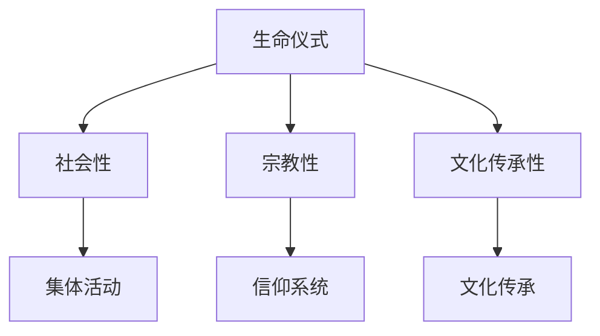

#### 1.1.2 生命仪式在不同文化中的演变

随着人类社会的发展，生命仪式在不同文化背景下不断演变。在不同的文明中，生命仪式的形式和内容各有特色，但都反映了人们对生命意义的深刻思考。

**概念原理**：

- **演变**：生命仪式在不同文化中的演变受历史、宗教、社会等多方面因素的影响。
- **文化多样性**：不同文化对生命仪式的庆祝方式和意义有不同的理解和表达。

**属性特征对比表格**：

| 文化           | 特点                       |  
|----------------|---------------------------|  
| 埃及文化       | 以冥界祭祀和重生仪式著称 |  
| 印度文化       | 拥有复杂的婚礼和成年仪式 |  
| 犹太文化       | 注重家庭和社区的庆祝活动 |  
| 中华文化       | 强调礼仪和仪式的规范性 |

**ER实体关系图架构**：

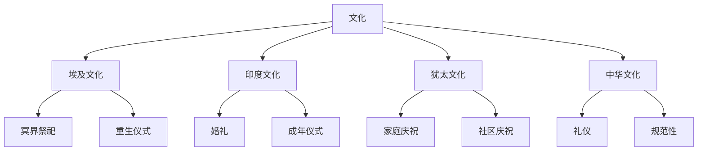

#### 1.1.3 生命仪式的宗教意义

生命仪式在不同文化中的演变，常常与宗教信仰紧密相连。宗教仪式不仅反映了人们对生命意义的追求，也是宗教信仰的重要载体。

**概念原理**：

- **宗教意义**：生命仪式是宗教信仰的重要组成部分，通过仪式活动表达对神灵的崇拜和敬畏。
- **作用**：宗教仪式为人们提供了一种精神寄托，增强了社会凝聚力和信仰力量。

**属性特征对比表格**：

| 宗教           | 仪式类型           | 特点                   |  
|----------------|------------------|-----------------------|  
| 基督教         | 坚持礼仪式         | 祷告、礼拜、洗礼       |  
| 伊斯兰教       | 斋月仪式           | 斋戒、祈祷、庆典       |  
| 印度教         | 庆典仪式           | 梵音、祭祀、冥想       |  
| 佛教           | 佛教仪式           | 禅修、诵经、布施       |

**ER实体关系图架构**：

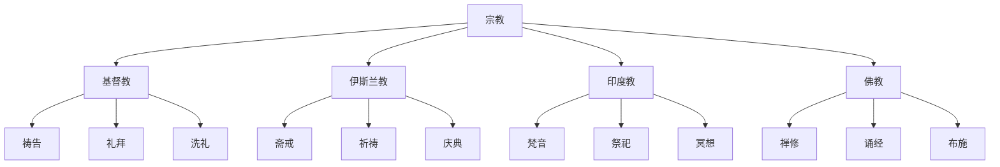

### 第2章：生命仪式的类型与形式

生命仪式的形式多样，涵盖了人生的各个重要阶段，包括出生、成年、婚礼和丧礼等。这些仪式不仅具有深厚的文化意义，也是社会认同和家庭凝聚的重要手段。

#### 2.1.1 出生日期仪式

出生仪式是生命仪式的起点，标志着新生命的诞生。不同文化对出生仪式有着不同的庆祝方式和意义。

**概念原理**：

- **出生仪式**：是一种庆祝新生儿诞生的仪式，通常包含命名、洗礼或祭祀等环节。
- **意义**：出生仪式不仅是对新生命的庆祝，也是家庭和社会对新成员的欢迎和祝福。

**属性特征对比表格**：

| 文化           | 仪式类型 | 特点                           |  
|----------------|----------|--------------------------------|  
| 西方文化       | 命名仪式 | 家族传统、教堂洗礼、礼物赠送   |  
| 亚洲文化       | 接气仪式 | 割脐带、三朝回礼、满月宴       |  
| 非洲文化       | 起名仪式 | 祭祀祖先、祝福孩子健康成长       |

**ER实体关系图架构**：

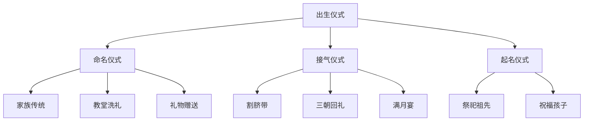

#### 2.1.2 成年仪式

成年仪式是标志着一个人从儿童过渡到成年的重要仪式。不同文化对成年仪式有着不同的定义和庆祝方式。

**概念原理**：

- **成年仪式**：是一种庆祝年轻人成年，正式成为社会成员的仪式。
- **意义**：成年仪式不仅是对个人成长的认可，也是对个人责任和角色的转变。

**属性特征对比表格**：

| 文化           | 仪式类型 | 特点                           |  
|----------------|----------|--------------------------------|  
| 犹太文化       | 巴赫仪式 | 祭典、诵读圣经、仪式饮食       |  
| 美洲原住民文化 | 青少年典礼 | 自然崇拜、挑战任务、精神指导   |  
| 东南亚文化     | 成人礼   | 社区参与、传统舞蹈、分享经验     |

**ER实体关系图架构**：

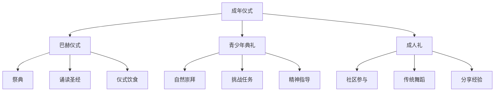

#### 2.1.3 婚礼

婚礼是人生中最重要和最普遍的生命仪式之一。不同文化对婚礼有着不同的仪式和庆祝方式。

**概念原理**：

- **婚礼**：是一种庆祝两个人结合成为伴侣的仪式。
- **意义**：婚礼不仅是对爱情的见证，也是对新家庭的开始和祝福。

**属性特征对比表格**：

| 文化           | 仪式类型 | 特点                           |  
|----------------|----------|--------------------------------|  
| 西方文化       | 西式婚礼 | 花束、礼服、教堂仪式、婚戒交换 |  
| 中华文化       | 宗教婚礼 | 对象祭祀、红双喜、婚礼宴会     |  
| 非洲文化       | 舞蹈庆典 | 鼓舞、舞蹈、象征性的礼物       |

**ER实体关系图架构**：

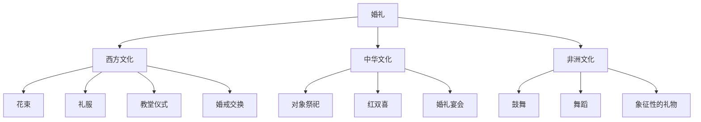

#### 2.1.4 丧礼

丧礼是生命仪式中的最后一环，用于纪念和悼念逝去的人。不同文化对丧礼有着不同的方式和意义。

**概念原理**：

- **丧礼**：是一种纪念和悼念逝去亲人的仪式。
- **意义**：丧礼不仅是对逝者的尊重和纪念，也是对生者情感的宣泄和慰藉。

**属性特征对比表格**：

| 文化           | 仪式类型 | 特点                           |  
|----------------|----------|--------------------------------|  
| 西方文化       | 葬礼     | 祭坛、灵柩覆盖、献花仪式       |  
| 中华文化       | 超度仪式 | 念经、祭祀、烧纸钱、守灵       |  
| 伊斯兰教       | 奠礼     | 葬礼祷告、净身、土葬           |

**ER实体关系图架构**：

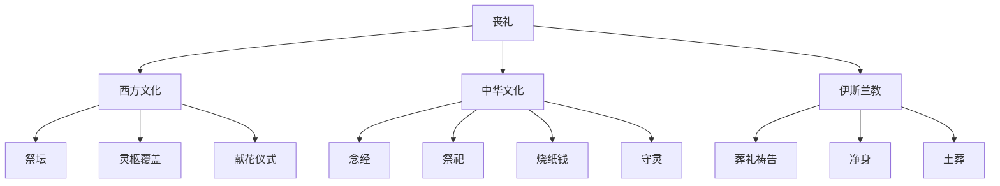

### 第3章：生命仪式的社会功能

生命仪式不仅是文化传承和宗教信仰的载体，还具有重要的社会功能。这些功能体现在社会认同与归属感、社会整合与稳定以及社会情感表达等方面。

#### 3.1.1 社会认同与归属感

生命仪式通过一系列的仪式程序和象征意义，增强了个体对社会的认同感和归属感。

**概念原理**：

- **社会认同**：通过生命仪式，个体感受到自己是社会的一部分，得到了社会的认可和接纳。
- **归属感**：生命仪式提供了一个共同的文化体验，增强了个体对社区的归属感。

**属性特征对比表格**：

| 功能           | 解释                               |  
|----------------|-----------------------------------|  
| 社会认同       | 生命仪式通过共同的庆祝活动，增强个体对社会的认同感 |  
| 归属感         | 生命仪式提供了一个文化社区，个体在其中感受到归属感 |

**ER实体关系图架构**：

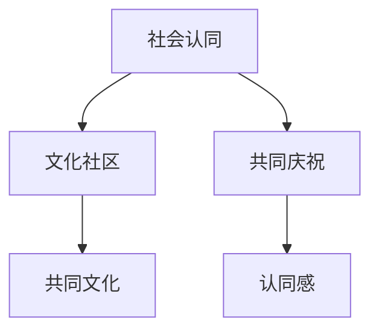

#### 3.1.2 社会整合与稳定

生命仪式在维护社会整合和稳定方面起着重要作用。通过仪式活动，社会成员之间的联系得以加强，社会秩序得以维护。

**概念原理**：

- **社会整合**：生命仪式通过集体参与和共同记忆，加强了社会成员之间的联系。
- **社会稳定**：生命仪式作为社会规范的一部分，有助于维护社会秩序和稳定。

**属性特征对比表格**：

| 功能           | 解释                               |  
|----------------|-----------------------------------|  
| 社会整合       | 通过生命仪式，社会成员之间的联系得以加强 |  
| 社会稳定       | 生命仪式是维护社会秩序和稳定的重要手段 |

**ER实体关系图架构**：

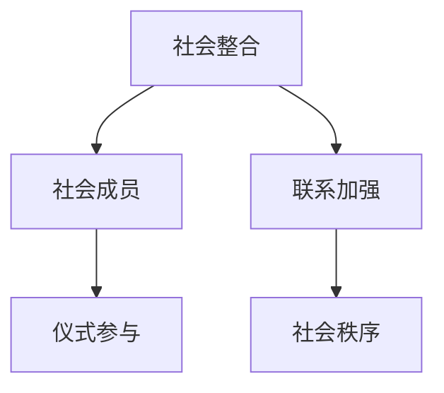

#### 3.1.3 社会情感表达

生命仪式为个体提供了一个表达情感和释放压力的平台。通过仪式活动，个体得以表达对生命、自然和社会的感激之情。

**概念原理**：

- **情感表达**：生命仪式为个体提供了一个情感宣泄的途径，有助于缓解压力和焦虑。
- **社会互动**：生命仪式通过集体参与和情感交流，增强了社会成员之间的情感联系。

**属性特征对比表格**：

| 功能           | 解释                               |  
|----------------|-----------------------------------|  
| 情感表达       | 生命仪式为个体提供了情感宣泄的机会 |  
| 社会互动       | 通过仪式活动，个体与社会成员之间的情感联系得以增强 |

**ER实体关系图架构**：

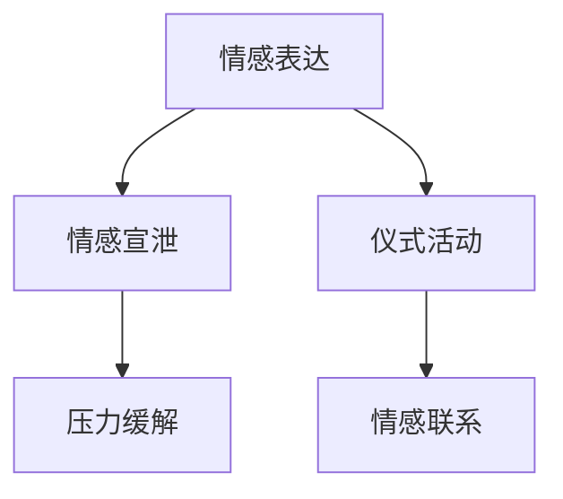

### 第4章：生命仪式的心理效应

生命仪式不仅在社会层面上具有重要意义，还在心理层面上对个体产生深远的影响。这些心理效应包括焦虑与压力缓解、幸福感提升以及自我认同与自我成长等方面。

#### 4.1.1 焦虑与压力缓解

生命仪式为个体提供了一个情感宣泄和压力释放的渠道。通过仪式活动，个体得以缓解生活中的焦虑和压力。

**概念原理**：

- **焦虑与压力缓解**：生命仪式提供了一个安全的环境，个体可以在仪式中表达自己的情感和焦虑，从而减轻心理负担。
- **心理机制**：仪式中的共同体验和情感共鸣有助于个体放松身心，缓解焦虑。

**属性特征对比表格**：

| 效应           | 解释                               |  
|----------------|-----------------------------------|  
| 焦虑缓解       | 通过共同仪式，个体在情感共鸣中放松身心 |  
| 压力缓解       | 仪式提供了一个情感宣泄的渠道，减轻心理压力 |

**ER实体关系图架构**：

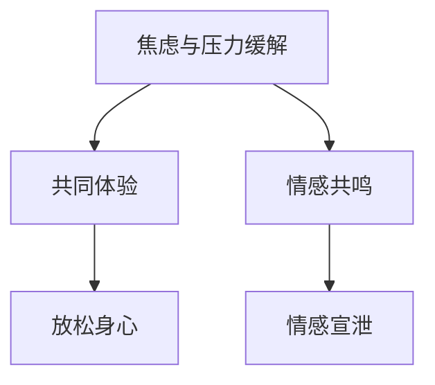

#### 4.1.2 幸福感提升

生命仪式通过庆祝和纪念人生的重要时刻，增强了个体对生活的满意度和幸福感。

**概念原理**：

- **幸福感提升**：生命仪式作为一种积极的生活体验，为个体带来了愉悦和满足感。
- **心理机制**：仪式中的庆祝活动、情感交流和共同记忆有助于提升个体的幸福感。

**属性特征对比表格**：

| 效应           | 解释                               |  
|----------------|-----------------------------------|  
| 幸福感提升     | 通过庆祝活动和情感共鸣，个体感受到生活的美好 |

**ER实体关系图架构**：

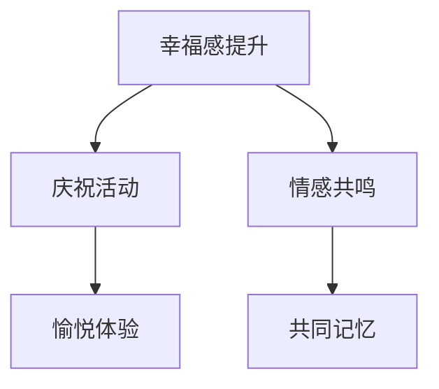

#### 4.1.3 自我认同与自我成长

生命仪式在个体的自我认同和自我成长过程中起着重要作用。通过仪式，个体得以认识和定义自己的身份和角色，促进自我发展。

**概念原理**：

- **自我认同**：生命仪式通过象征性的活动和共同体验，帮助个体认识和确认自己的身份和角色。
- **自我成长**：仪式中的挑战和经历促使个体反思和成长，增强自我能力和自信心。

**属性特征对比表格**：

| 效应           | 解释                               |  
|----------------|-----------------------------------|  
| 自我认同       | 通过仪式活动，个体认识和确认自己的身份和角色 |  
| 自我成长       | 仪式中的挑战和经历促进个体反思和成长 |

**ER实体关系图架构**：

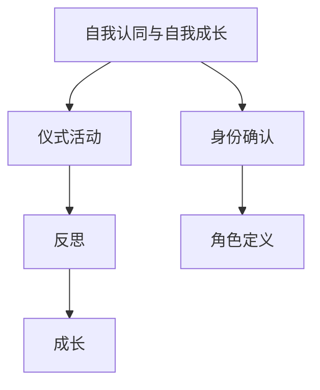

### 第5章：生命仪式的社会支持系统

生命仪式不仅是个人庆祝和纪念的重要活动，也是社会支持系统的重要组成部分。这些支持系统包括家庭、社会网络和专业支持，共同为生命仪式的成功举办提供了保障。

#### 5.1.1 家庭支持

家庭是生命仪式的主要支持系统，为仪式的举办提供了情感和经济上的支持。

**概念原理**：

- **家庭支持**：家庭在生命仪式中扮演着核心角色，通过参与仪式活动，表达对家庭成员的爱和关怀。
- **功能**：家庭支持包括提供场所、物资和人力，确保仪式的顺利进行。

**属性特征对比表格**：

| 支持系统 | 家庭支持功能                  |  
|----------|------------------------------|  
| 情感支持 | 表达家庭情感和关怀           |  
| 经济支持 | 提供仪式所需的资金和物资     |  
| 人力支持 | 协助仪式的筹备和执行         |

**ER实体关系图架构**：

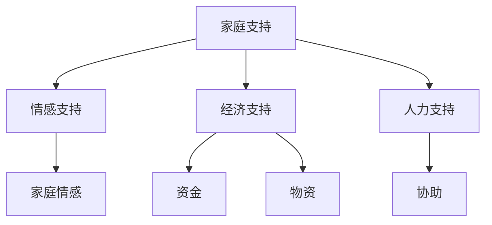

#### 5.1.2 社会网络支持

社会网络包括亲朋好友、社区组织和宗教团体等，为生命仪式提供了广泛的支持和参与。

**概念原理**：

- **社会网络支持**：社会网络通过参与仪式活动，增强了社区的凝聚力和归属感。
- **功能**：社会网络支持包括提供场所、物资、人力和情感支持，为生命仪式的成功举办提供了保障。

**属性特征对比表格**：

| 支持系统 | 社会网络支持功能                  |  
|----------|------------------------------|  
| 情感支持 | 表达对仪式参与者的祝福和支持   |  
| 经济支持 | 提供仪式所需的资金和物资         |  
| 人力支持 | 协助仪式的筹备和执行             |

**ER实体关系图架构**：

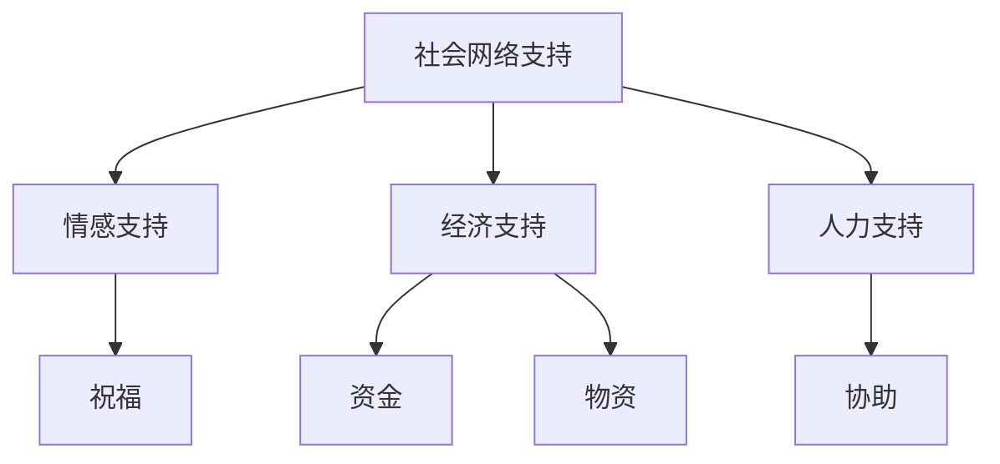

#### 5.1.3 专业支持

专业支持包括宗教领袖、仪式策划师和心理医生等专业人员，为生命仪式提供了专业知识和指导。

**概念原理**：

- **专业支持**：专业人员通过专业知识和经验，为生命仪式的举办提供了指导和保障。
- **功能**：专业支持包括仪式设计、仪式程序指导、心理辅导和危机干预等。

**属性特征对比表格**：

| 支持系统 | 专业支持功能                  |  
|----------|------------------------------|  
| 仪式设计 | 设计和策划仪式的流程和内容   |  
| 程序指导 | 指导仪式的执行和参与者行为   |  
| 心理辅导 | 提供仪式参与者的心理支持和辅导 |

**ER实体关系图架构**：

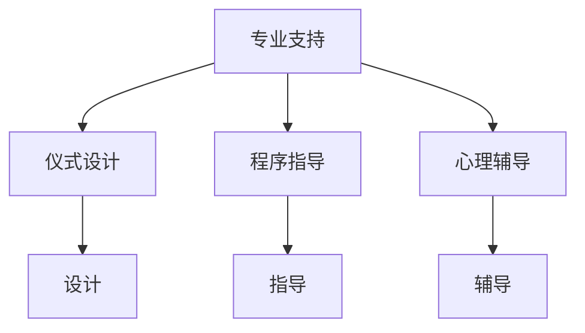

### 第6章：现代生命仪式的挑战

在现代社会，生命仪式面临着诸多挑战，包括全球化、科技发展和社交媒体的兴起。这些挑战对生命仪式的传统形式和意义产生了深远的影响。

#### 6.1.1 全球化对生命仪式的影响

全球化促进了不同文化之间的交流和融合，对生命仪式的传统形式和意义产生了影响。

**概念原理**：

- **影响**：全球化使得生命仪式更加多样化，传统仪式形式受到挑战，同时新的仪式形式应运而生。
- **趋势**：全球化的背景下，文化多样性得以体现，生命仪式逐渐融合了不同文化的元素。

**属性特征对比表格**：

| 全球化影响         | 特点                               |  
|--------------------|-----------------------------------|  
| 多元文化融合       | 不同文化元素在生命仪式中的融合 |  
| 传统仪式变化       | 传统仪式形式受到挑战和变革       |

**ER实体关系图架构**：

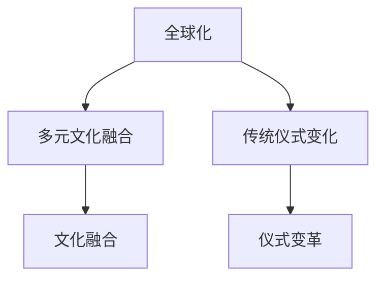

#### 6.1.2 科技对生命仪式的改变

科技的发展对生命仪式的形式和参与方式产生了重大影响，改变了传统的庆祝方式。

**概念原理**：

- **影响**：科技手段的引入使得生命仪式更加多样化和灵活，同时也带来了新的挑战。
- **趋势**：虚拟现实、社交媒体和在线仪式等新形式的生命仪式逐渐流行。

**属性特征对比表格**：

| 科技影响         | 特点                               |  
|--------------------|-----------------------------------|  
| 在线仪式         | 网络平台的参与和庆祝方式         |  
| 虚拟现实         | 虚拟空间的仪式体验               |  
| 社交媒体         | 社交网络中的仪式分享和互动       |

**ER实体关系图架构**：

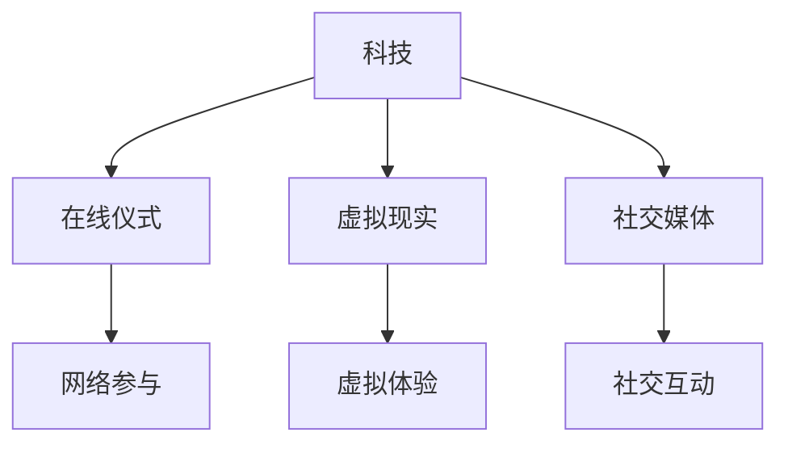

#### 6.1.3 社交媒体的兴起

社交媒体的兴起为生命仪式的传播和参与提供了新的平台，改变了传统的仪式形式。

**概念原理**：

- **影响**：社交媒体使得生命仪式的信息传播更加迅速和广泛，个体和社会之间的互动更加频繁。
- **趋势**：社交媒体上的生命仪式分享和互动成为了新的趋势，传统仪式形式受到了一定程度的冲击。

**属性特征对比表格**：

| 社交媒体影响     | 特点                               |  
|------------------|-----------------------------------|  
| 信息传播迅速     | 社交媒体上的生命仪式信息迅速传播 |  
| 社交互动增强     | 社交媒体上的仪式分享和互动增多   |

**ER实体关系图架构**：

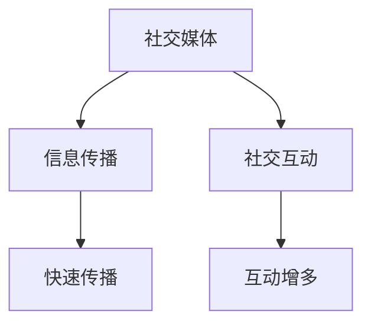

### 第7章：生命仪式的未来趋势

随着社会的发展和技术进步，生命仪式也在不断演变和创新发展。未来的生命仪式将更加注重个性化、可持续性和科技融合。

#### 7.1.1 个性化生命仪式

未来的生命仪式将更加注重个性化，满足个体多样化的需求和期望。

**概念原理**：

- **个性化**：生命仪式将更加注重个体差异，根据参与者的需求和偏好进行定制。
- **意义**：个性化生命仪式将增强个体的参与感和满足感，更好地体现个人价值和个性。

**属性特征对比表格**：

| 趋势         | 个性化特征                  |  
|--------------|-----------------------------|  
| 定制仪式     | 根据个人喜好和需求定制仪式   |  
| 灵活安排     | 仪式时间和形式的灵活安排   |

**ER实体关系图架构**：

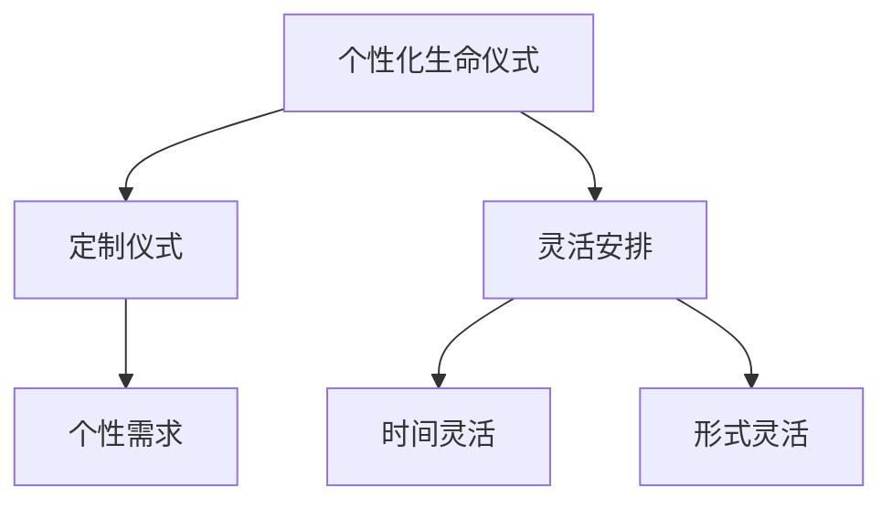

#### 7.1.2 永生仪式的探索

随着科技的发展，人们对生命的理解和追求也在不断变化。永生仪式作为一种未来趋势，将探讨人类对永生的追求和纪念方式。

**概念原理**：

- **永生仪式**：是对人类追求永生和生命延续的一种仪式。
- **意义**：永生仪式将探讨人类对生命的深刻思考和纪念，是对人类探索生命意义的体现。

**属性特征对比表格**：

| 趋势         | 永生仪式特征                  |  
|--------------|-----------------------------|  
| 科技融合     | 利用科技手段探索永生仪式     |  
| 哲学思考     | 对生命和永生的哲学性思考     |

**ER实体关系图架构**：

```mermaid
graph TB
    A[永生仪式] --> B[科技融合]
    A --> C[哲学思考]
    B --> D[科技手段]
    C --> E[哲学思考]
```

#### 7.1.3 生命仪式的可持续性

未来的生命仪式将更加注重可持续性，关注环境保护和文化传承。

**概念原理**：

- **可持续性**：生命仪式将注重资源节约、环境保护和文化传承。
- **意义**：可持续性生命仪式将促进社会的可持续发展，保护自然环境，传承文化价值。

**属性特征对比表格**：

| 趋势         | 可持续特征                  |  
|--------------|-----------------------------|  
| 环境友好     | 采用环保材料和节能措施     |  
| 文化传承     | 注重传统文化的保护和传承   |

**ER实体关系图架构**：

```mermaid
graph TB
    A[生命仪式的可持续性] --> B[环境友好]
    A --> C[文化传承]
    B --> D[环保措施]
    C --> E[文化传承]
```

### 第8章：如何举办一场有意义的生命仪式

举办一场有意义的生命仪式需要充分的准备和细致的规划。以下是一些关键步骤和注意事项，以确保仪式的成功举办。

#### 8.1.1 准备工作

准备工作是成功举办生命仪式的基础。以下是一些关键步骤：

- **确定仪式类型**：根据庆祝的对象和目的，确定生命仪式的类型，如出生仪式、成年仪式、婚礼或丧礼。
- **选择日期和时间**：选择一个合适的日期和时间，确保所有参与者都能参加。
- **场地布置**：根据仪式的类型和主题，进行场地布置，确保氛围符合仪式的主题。
- **邀请参与者**：提前邀请参与者，包括家庭成员、亲朋好友和社会网络成员。

**步骤流程图**：

```mermaid
graph TB
    A[确定仪式类型]
    B[选择日期和时间]
    C[场地布置]
    D[邀请参与者]
    A --> B
    B --> C
    C --> D
```

#### 8.1.2 仪式程序设计

仪式程序设计是生命仪式的核心，需要精心策划和编排。以下是一些关键步骤：

- **仪式流程**：设计一个清晰的仪式流程，包括开场、核心仪式环节和结束部分。
- **象征性元素**：选择适当的象征性元素，如花束、蜡烛、音乐等，增强仪式的氛围。
- **演讲和致辞**：安排相关的演讲和致辞，表达对仪式对象的祝福和纪念。
- **互动环节**：设计互动环节，增强参与者的参与感和体验。

**流程图**：

```mermaid
graph TB
    A[仪式流程设计]
    B[象征性元素选择]
    C[演讲和致辞安排]
    D[互动环节设计]
    A --> B
    B --> C
    C --> D
```

#### 8.1.3 参与者的角色与职责

明确参与者的角色和职责是确保仪式顺利进行的重要环节。以下是一些关键角色和职责：

- **主持人**：负责仪式的整体进程，引导参与者进行仪式活动。
- **主礼人**：负责仪式的开场和结束，代表主办方致辞和祝福。
- **亲友团**：协助仪式的进行，提供支持和帮助。
- **参与者**：积极参与仪式，按照仪式流程完成各自的职责。

**角色关系图**：

```mermaid
graph TB
    A[主持人] --> B[主礼人]
    A --> C[亲友团]
    A --> D[参与者]
    B --> E[致辞]
    C --> F[协助]
    D --> G[参与]
```

### 第9章：生命仪式的反思与伦理问题

生命仪式在庆祝和纪念人生重要时刻的同时，也引发了一系列的伦理问题。以下是对生命仪式的一些反思和讨论。

#### 9.1.1 仪式的意义与价值

生命仪式具有多重意义和价值，包括文化传承、社会认同、情感表达和心理健康等方面。

- **文化传承**：生命仪式是文化传承的重要载体，通过仪式活动，传统文化得以延续和发扬。
- **社会认同**：生命仪式通过集体参与和共同记忆，增强了个体对社会的认同感和归属感。
- **情感表达**：生命仪式为个体提供了一个表达情感和释放压力的平台，有助于缓解焦虑和压力。
- **心理健康**：生命仪式通过仪式活动和情感共鸣，提升了个体的幸福感和自我认同。

**ER实体关系图架构**：

```mermaid
graph TB
    A[文化传承] --> B[社会认同]
    A --> C[情感表达]
    A --> D[心理健康]
    B --> E[共同记忆]
    C --> F[情感释放]
    D --> G[幸福感]
    D --> H[自我认同]
```

#### 9.1.2 生命仪式的伦理争议

生命仪式在举办过程中也引发了一些伦理争议，主要包括以下几个方面：

- **文化冲突**：全球化的背景下，不同文化之间的冲突和融合引发了关于生命仪式的文化争议。
- **隐私问题**：生命仪式涉及到个体隐私的保护，如何在仪式中平衡隐私权和公开表达之间的问题。
- **商业化**：生命仪式的商业化现象引发了关于商业化对传统仪式的冲击和伦理问题的讨论。

**ER实体关系图架构**：

```mermaid
graph TB
    A[文化冲突] --> B[隐私问题]
    A --> C[商业化]
    B --> D[隐私保护]
    C --> E[商业化现象]
```

#### 9.1.3 生命仪式的未来发展方向

随着社会的发展和技术的进步，生命仪式的未来发展方向将更加注重个性化和可持续性。

- **个性化**：未来的生命仪式将更加注重个体需求和个性表达，提供多样化的仪式形式和内容。
- **可持续性**：生命仪式将更加注重环境保护和文化传承，采用环保材料和节能措施，实现可持续发展。

**ER实体关系图架构**：

```mermaid
graph TB
    A[个性化] --> B[多样化]
    A --> C[个性表达]
    B --> D[多样形式]
    C --> E[个性化需求]
    A[可持续性] --> F[环境保护]
    A --> G[文化传承]
    F --> H[环保措施]
    G --> I[文化传承]
```

### 结论

生命仪式作为人类社会中庆祝和纪念人生重要时刻的一种集体活动，具有重要的文化、宗教和社会意义。通过回顾生命仪式的历史和文化背景，探讨其心理学意义和社会功能，分析现代生命仪式的挑战和未来趋势，以及反思生命仪式的伦理问题，我们可以更深入地理解生命仪式的价值和意义。在未来，生命仪式将继续演变和创新，以满足个体和社会的需求，为人类社会的和谐与发展贡献力量。

### 第10章：生命仪式的意义与展望

#### 10.1.1 生命仪式在现代社会中的作用

在现代社会，生命仪式不仅是对个体生命历程的庆祝和纪念，更是社会文化传承和情感纽带的重要载体。生命仪式在以下方面发挥着重要作用：

- **文化传承**：生命仪式是传统文化的重要组成部分，通过仪式活动，传统文化得以传承和发扬。
- **社会认同**：生命仪式通过集体参与和共同记忆，增强了个体对社会的认同感和归属感。
- **心理健康**：生命仪式为个体提供了一个表达情感和释放压力的平台，有助于缓解焦虑和压力。

#### 10.1.2 生命仪式的未来发展展望

随着社会的发展和技术的进步，生命仪式的未来发展将呈现出以下几个趋势：

- **个性化**：未来的生命仪式将更加注重个体需求和个性表达，提供多样化的仪式形式和内容。
- **科技融合**：科技的发展将带来生命仪式的变革，虚拟现实、社交媒体等新技术将丰富仪式的体验。
- **可持续性**：生命仪式将更加注重环境保护和文化传承，采用环保材料和节能措施，实现可持续发展。

通过不断演变和创新，生命仪式将继续在人类社会中发挥其独特的价值，为个体的生命历程和社会的和谐发展贡献力量。作者：AI天才研究院/AI Genius Institute & 禅与计算机程序设计艺术 /Zen And The Art of Computer Programming。

