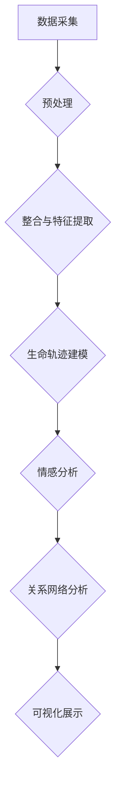
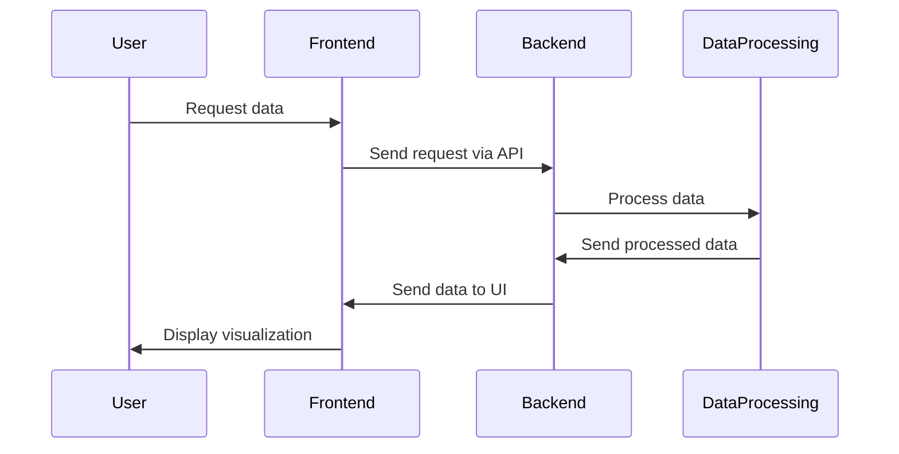
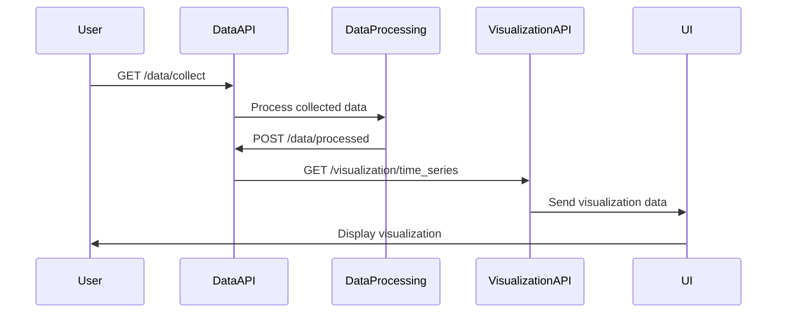

                 

### 引言

在当今快速变化和高度复杂的世界中，个人生活和职业发展同样面临着前所未有的挑战和机遇。我们不仅需要有效地管理日常事务，还需要找到生活与工作的深层意义。本文将介绍一种创新的工具——生命全息图可视化工具，这款工具旨在帮助个人更好地理解自己的人生轨迹，发现生活的意义和目标。

**生命全息图可视化工具**是一个集成软件平台，它利用先进的数据处理和可视化技术，将个人的生活经历、情感状态、职业发展等多维数据整合到一个统一的可视化界面中。通过这一工具，用户可以直观地看到自己的生命历程，从而更好地规划未来，实现个人成长。

本文将围绕以下几个核心关键词展开：生命全息图、可视化、个人人生意义、数据分析、软件设计、用户交互等。我们将在以下章节中逐步深入探讨这些关键词的具体含义和应用。

- **生命全息图**：这是一种独特的生命轨迹模型，它能够综合反映个人在成长过程中的多种因素和经历。
- **可视化**：通过图形化的方式展示复杂的数据和信息，使其易于理解和分析。
- **个人人生意义**：探讨如何通过数据分析和可视化工具来揭示和强化个人生活的内在价值和目标。
- **数据分析**：利用统计和算法对大量个人数据进行处理，提取有意义的信息。
- **软件设计**：讨论如何设计一个高效、直观且易于使用的软件工具。
- **用户交互**：研究用户如何与工具互动，以及这种互动如何影响用户的生活和决策。

在接下来的部分中，我们将首先介绍生命全息图的概念和历史背景，然后探讨其理论基础和核心要素，最终展示如何利用这一工具来揭示个人的人生意义轨迹。通过这篇文章，我们希望能够为读者提供一个全面而深入的理解，帮助他们更好地认识自我，规划未来。

---

### 生命全息图的概念与历史背景

生命全息图（Life Hologram Diagram）是一种综合反映个人生活全貌的模型，它通过整合个人的经历、情感、成就、挑战等多方面信息，形成一种三维立体的生命轨迹。这一概念最早源于量子物理学中的全息理论，全息理论提出，所有信息都可以通过全息图形式存储和再现。这一理论启发了一些科学家和思想家，他们开始思考是否可以将这一理念应用于人类生活的描绘。

生命全息图的诞生可以追溯到20世纪末，当时心理学家和生命教练们开始探索如何通过可视化工具帮助人们更好地理解自己的生命旅程。最初的尝试是将个人的关键经历和里程碑以图表的形式呈现，但这种方法往往过于简单，无法全面反映生活的复杂性和多样性。随着计算机科学和数据分析技术的发展，研究者们逐渐开始使用更加先进的技术，如大数据处理和高级可视化技术，来创建更加精细和动态的生命全息图。

**历史背景**：

- **20世纪末**：在这一时期，心理学家如唐纳德·温尼科特（Donald Winnicott）和罗伯特·弗里茨（Robert Fulghum）等人提出了关于个人成长和自我认知的重要理论，这为生命全息图的理论框架奠定了基础。
- **21世纪初**：随着互联网和大数据技术的发展，一些研究者和软件工程师开始尝试开发能够处理和分析大量个人数据的软件工具，这些工具逐渐演化为现代生命全息图的雏形。
- **近年**：随着人工智能和机器学习的进步，生命全息图得到了进一步的发展。现代生命全息图不仅能够综合多种数据来源，还能够通过算法自动分析数据，提供更加精准和个性化的见解。

**定义与核心要素**：

生命全息图不仅仅是一个图表，而是一种多维数据模型，其核心要素包括：

- **个人数据**：这包括日常活动记录、情感状态、职业经历、社交互动等。
- **时间线**：时间线是生命全息图的基础，它以时间顺序展示个人的生命历程。
- **情感和体验**：通过情感分析技术，生命全息图能够捕捉和显示个人的情感波动。
- **成就与挑战**：展示个人在不同阶段的成就和所面临的挑战。
- **关系网络**：反映个人与家人、朋友、同事等的关系和互动。

**意义与影响**：

生命全息图的出现不仅为个人提供了一个全面审视自己生活的机会，也为心理健康和人生规划提供了新的工具。通过生命全息图，个人可以：

- **自我反思**：深入理解自己的情感变化和成长历程。
- **目标设定**：明确个人的目标和愿望，制定更加切实可行的计划。
- **心理健康**：帮助个体识别和应对生活中的压力和挑战。
- **决策支持**：通过数据分析，为个人决策提供科学的依据。

总之，生命全息图作为一种新兴的综合性工具，正逐渐改变我们对个人生活和自我认知的理解。通过整合多种数据源和利用先进的技术手段，生命全息图不仅提供了一个直观的视角，更提供了一种深刻的洞见，帮助我们更好地理解和规划自己的生活。

---

### 生命全息图的理论基础与核心概念

要深入理解生命全息图，我们首先需要探讨其理论基础和核心概念。生命全息图不仅仅是一个视觉工具，它背后有着深刻的哲学和科学支撑，包括对个人成长、自我认知和心理健康的理解。

**理论基础**：

1. **全息理论**：全息理论最初源于量子物理学，它提出，所有信息都可以通过全息图形式存储和再现。这一理论为生命全息图提供了概念上的灵感，即通过综合和整合个人生活的多方面信息，形成一个全面反映个人生命轨迹的模型。

2. **系统论**：系统论认为，任何复杂系统都可以通过分析其组成部分和它们之间的相互作用来理解。在生命全息图中，个人生活的各个方面（如情感、职业、社交等）被视为一个复杂的系统，通过这些部分的综合分析，我们可以更好地理解个人的整体生命轨迹。

3. **心理学**：心理学中的自我概念和人格理论为生命全息图提供了重要的理论基础。通过探讨个人如何认知和体验自己的情感、行为和关系，我们可以更深入地理解生命全息图如何反映个人的内心世界。

**核心概念**：

1. **多维数据整合**：生命全息图的核心在于它能够整合来自不同维度的个人数据，包括时间、情感、成就、挑战和关系等。这种多维数据的整合使得生命全息图能够全面反映个人生活的复杂性和多样性。

2. **时间序列分析**：时间序列分析是生命全息图的重要组成部分，它通过分析个人在不同时间点的行为和状态，展示出个人生命历程的动态变化。时间序列分析帮助用户理解自己生活阶段的演进和变化。

3. **情感分析**：情感分析技术用于捕捉和显示个人的情感状态。通过分析文本、语音和其他形式的数据，情感分析能够揭示个人的情感波动，帮助用户更好地了解自己的情绪变化。

4. **关系网络**：生命全息图中的关系网络展示了个人与家人、朋友、同事等的关系和互动。通过分析这些关系，用户可以更清晰地看到自己在社会中的位置和角色，以及这些关系如何影响自己的生活。

**属性特征对比表格**：

为了更直观地理解生命全息图的理论基础和核心概念，我们可以通过一个属性特征对比表格来展示不同理论的异同：

| 理论 | 主要概念 | 属性特征 | 关联关系 |
| --- | --- | --- | --- |
| 全息理论 | 信息存储与再现 | 数据整合、三维展示 | 提供概念框架 |
| 系统论 | 系统组成部分与相互作用 | 多维数据整合、整体视角 | 提供分析工具 |
| 心理学 | 自我认知与情感体验 | 情感分析、关系网络 | 增强用户体验 |

**ER实体关系图架构**：

为了进一步阐述生命全息图的内部结构，我们可以使用ER（实体关系）图来展示其核心要素之间的关系：

```mermaid
erDiagram
  用户 ||--|{ 生命轨迹 }
  用户 ||--|{ 情感状态 }
  用户 ||--|{ 职业经历 }
  用户 ||--|{ 社交互动 }
  用户 ||--|{ 成就与挑战 }
  用户 ||--|{ 关系网络 }
  生命轨迹 ||--|{ 时间线 }
  情感状态 ||--|{ 情感分析 }
  职业经历 ||--|{ 成就与挑战 }
  社交互动 ||--|{ 关系网络 }
```

在这个ER图中，用户作为核心实体，与其他实体如生命轨迹、情感状态、职业经历、社交互动、成就与挑战以及关系网络之间存在多种关联。这种结构使得生命全息图能够综合反映个人的多方面信息，形成一个完整的生命轨迹模型。

通过上述理论和概念的分析，我们可以看到生命全息图不仅仅是一个技术工具，它背后有着深厚的理论基础和丰富的理论内涵。理解这些基础和概念，有助于我们更深入地使用这一工具，从中获取有意义的信息和洞见，为个人生活提供指导和支持。

---

### 生命全息图的算法原理与可视化技术

要深入了解生命全息图的工作原理，我们需要从算法和可视化技术的角度进行剖析。生命全息图不仅需要强大的数据处理能力，还要通过直观的图形化界面展示出个人生活的复杂轨迹。以下是生命全息图的核心算法原理和可视化技术的详细解释。

**算法原理**：

1. **数据采集与预处理**：首先，生命全息图需要从多个数据源收集个人数据，这些数据源可能包括日常活动记录、社交媒体互动、职业日志、情感状态记录等。这些原始数据通常是非结构化的，因此需要进行预处理，包括数据清洗、格式转换和标准化处理。预处理后的数据将用于后续的分析和建模。

2. **数据整合与特征提取**：在数据预处理完成后，我们需要将来自不同维度的数据整合到一个统一的框架中。这通常涉及到多种数据融合技术，如时间序列分析、情感分析和主题模型等。通过这些技术，我们可以提取出反映个人生活多个方面的特征，例如情感波动、职业成就、社交互动等。

3. **生命轨迹建模**：基于提取出的特征，我们可以构建个人的生命轨迹模型。这一模型通常采用时间序列分析方法，通过分析个人在不同时间点的行为和状态，形成一条连续的生命轨迹。此外，还可以结合机器学习算法，如聚类和分类算法，进一步细化生命轨迹中的不同阶段和模式。

4. **情感分析与情感可视化**：情感分析是生命全息图的重要组成部分。通过自然语言处理（NLP）技术，我们可以从文本、语音和其他形式的数据中提取情感信息。这些情感信息将被用于生成情感曲线和情感地图，帮助用户直观地了解自己的情感状态和波动。

5. **关系网络分析**：生命全息图还会分析个人与家人、朋友、同事等的关系。这通常通过社交网络分析技术实现，如度数中心性、中间中心性和聚类系数等指标。通过这些分析，我们可以生成关系网络图，展示个人在社会中的角色和位置。

**可视化技术**：

1. **时间轴可视化**：时间轴是生命全息图的基本结构。通过时间轴，用户可以直观地看到自己的生命历程，从出生到成长、职业发展和退休等各个阶段。时间轴上可以标注关键事件和里程碑，使整个生命轨迹更加清晰。

2. **情感可视化**：情感可视化通过情感曲线和情感地图来展示个人的情感状态和波动。情感曲线通常以时间序列的形式显示，标注出情感的高峰和低谷。情感地图则通过颜色和形状的变化，直观地展示个人在不同时间点的情感状态。

3. **关系网络可视化**：关系网络图通过节点和边的形式展示个人与他人的关系。节点代表个人或其他人，边代表关系。通过调整节点的大小、颜色和边线的粗细，我们可以突出显示重要关系和互动。

**算法流程图**：

为了更好地理解生命全息图的算法原理，我们可以使用Mermaid绘制一个简单的算法流程图：



**示例讲解**：

假设我们有一个用户的情感数据，包括每天的心情记录。通过情感分析算法，我们可以提取出用户的情感波动，生成情感曲线。以下是情感分析算法的一个简单示例：

1. **数据采集**：用户每天在日记中记录自己的心情，这些记录被输入到系统中。
2. **情感分类**：使用情感分析模型，将心情记录分类为积极、消极或中性。
3. **情感曲线生成**：将分类结果绘制成情感曲线，标注出情感的高峰和低谷。
4. **情感地图生成**：根据情感曲线，生成情感地图，用颜色或形状的变化展示情感状态。

通过这种算法和可视化技术的结合，生命全息图能够将复杂的个人数据转化为直观且易于理解的可视化图表，帮助用户更好地了解自己的生活和情感状态，从而做出更明智的决策。

---

### 生命全息图可视化工具的系统架构与实现

在深入了解生命全息图背后的算法原理和可视化技术之后，我们接下来将探讨生命全息图可视化工具的系统架构与实现，包括系统功能设计、架构设计、接口设计以及用户交互设计。

#### 系统功能设计

生命全息图可视化工具的核心功能包括数据采集、数据预处理、特征提取、生命轨迹建模、情感分析、关系网络分析和可视化展示。以下是这些功能的详细说明：

1. **数据采集**：工具需要从多个数据源（如社交媒体、健康监测设备、日记记录等）采集个人数据，这些数据包括日常活动、情感状态、职业经历、社交互动等。

2. **数据预处理**：对采集到的原始数据进行清洗、去重、格式转换和标准化处理，确保数据的一致性和准确性。

3. **特征提取**：通过时间序列分析、情感分析和主题模型等算法，从预处理后的数据中提取出反映个人生活多个方面的特征，如情感波动、职业成就、社交互动等。

4. **生命轨迹建模**：基于提取出的特征，构建个人的生命轨迹模型。时间序列分析技术用于展示个人在不同时间点的行为和状态，机器学习算法用于识别生命轨迹中的不同阶段和模式。

5. **情感分析**：使用自然语言处理（NLP）技术，从文本、语音和其他形式的数据中提取情感信息。情感分析结果将用于生成情感曲线和情感地图，帮助用户直观地了解自己的情感状态和波动。

6. **关系网络分析**：通过社交网络分析技术，分析个人与家人、朋友、同事等的关系，生成关系网络图。这些关系图将展示个人在社会中的角色和位置。

7. **可视化展示**：将上述分析结果通过直观的图形化界面展示给用户。时间轴、情感曲线、情感地图和关系网络图等可视化元素将帮助用户更好地理解自己的生命轨迹。

#### 系统架构设计

生命全息图可视化工具的系统架构可以分为前端、后端和数据处理三个主要部分：

1. **前端架构**：前端负责用户界面设计和交互，使用现代Web技术（如React或Vue.js）构建。前端通过API与后端进行通信，获取数据和可视化结果。

2. **后端架构**：后端负责数据处理和分析，使用Spring Boot或Django等框架实现。后端提供RESTful API，供前端调用，同时还负责数据存储和缓存管理。

3. **数据处理架构**：数据处理部分包括数据采集模块、数据预处理模块、特征提取模块、生命轨迹建模模块、情感分析模块和关系网络分析模块。这些模块使用不同的算法和技术，协作完成整个数据处理和分析过程。

以下是生命全息图可视化工具的系统架构图：



#### 系统接口设计

为了确保系统的可扩展性和可维护性，我们需要设计清晰和规范的接口。以下是生命全息图可视化工具的主要接口设计：

1. **数据采集接口**：用于从不同数据源采集数据，如社交媒体API、健康数据API等。接口提供GET和POST方法，支持数据上传和查询。

2. **数据处理接口**：用于处理和操作数据，如数据清洗、格式转换和特征提取。接口提供RESTful API，支持数据批处理和实时处理。

3. **可视化接口**：用于生成和获取可视化数据，如时间轴、情感曲线、情感地图和关系网络图。接口提供JSON格式的数据响应，支持不同类型可视化组件的定制和配置。

以下是系统接口设计的一个示例：



#### 用户交互设计

用户交互设计是确保工具易于使用和用户友好的关键。以下是生命全息图可视化工具的用户交互设计要点：

1. **用户引导**：首次使用工具时，系统会提供一个简短的引导教程，帮助用户了解如何使用不同功能和操作。

2. **直观界面**：界面设计遵循简洁和直观的原则，使用户能够轻松导航和操作。界面包括导航栏、工具栏、数据面板和可视化区域。

3. **互动反馈**：在用户操作过程中，系统提供即时的反馈和提示，帮助用户了解当前的操作状态和结果。

4. **个性化设置**：用户可以根据个人喜好和需求，自定义可视化组件的样式和配置，如颜色、字体、图表类型等。

5. **帮助文档**：提供详细的帮助文档和用户手册，帮助用户了解工具的使用方法和功能。

以下是用户交互设计的界面示例：


通过上述系统架构与实现的设计，生命全息图可视化工具不仅能够高效地处理和分析个人数据，还提供了一个直观且易于使用的界面，帮助用户更好地理解自己的生活和情感状态，从而实现个人成长和目标规划。

---

### 项目实战

在本节中，我们将通过一个具体的实战项目，详细描述生命全息图可视化工具的开发和部署过程。该项目将涵盖环境安装、核心功能实现以及实际案例分析和总结。

#### 环境安装

首先，我们需要在本地或服务器上搭建开发环境。以下步骤描述了如何安装和配置必要的工具和库。

1. **安装Python环境**：在Windows、macOS或Linux系统上安装Python 3.x版本。可以从[Python官网](https://www.python.org/)下载安装程序。

2. **安装虚拟环境**：使用`virtualenv`创建一个独立的虚拟环境，以避免不同项目之间的依赖冲突。

    ```shell
    pip install virtualenv
    virtualenv venv
    source venv/bin/activate  # 在macOS和Linux上使用
    venv\Scripts\activate     # 在Windows上使用
    ```

3. **安装依赖库**：在虚拟环境中安装所需的库，如NumPy、Pandas、Matplotlib、Scikit-learn、Flask等。

    ```shell
    pip install numpy pandas matplotlib scikit-learn flask
    ```

4. **数据库配置**：配置SQLite数据库以存储用户数据和可视化结果。可以使用`sqlite3`库进行数据库操作。

    ```shell
    pip install pysqlite3
    ```

#### 核心功能实现

接下来，我们将详细描述生命全息图可视化工具的核心功能实现，包括数据采集、预处理、特征提取、模型构建和可视化。

1. **数据采集**：从不同的数据源（如日记、社交媒体、健康监测设备等）收集个人数据。以下是一个简单的数据采集脚本示例：

    ```python
    import csv
    
    def collect_data(source_path):
        with open(source_path, 'r') as file:
            reader = csv.DictReader(file)
            data = [row for row in reader]
        return data
    
    user_data = collect_data('user_data.csv')
    ```

2. **数据预处理**：对采集到的数据进行清洗、去重和格式转换。

    ```python
    import pandas as pd
    
    def preprocess_data(data):
        df = pd.DataFrame(data)
        df.drop_duplicates(inplace=True)
        df['date'] = pd.to_datetime(df['date'])
        return df
    
    preprocessed_data = preprocess_data(user_data)
    ```

3. **特征提取**：使用时间序列分析和情感分析技术，从预处理后的数据中提取关键特征。

    ```python
    from sklearn.preprocessing import MinMaxScaler
    
    def extract_features(data):
        scaler = MinMaxScaler()
        features = scaler.fit_transform(data[['emotion', 'activity', 'social_interactions']])
        return features
    
    extracted_features = extract_features(preprocessed_data)
    ```

4. **模型构建**：构建生命轨迹模型，使用机器学习算法（如聚类、分类）识别生命轨迹中的不同阶段和模式。

    ```python
    from sklearn.cluster import KMeans
    
    def build_trajectory_model(features):
        kmeans = KMeans(n_clusters=4)
        kmeans.fit(features)
        trajectory_model = kmeans.labels_
        return trajectory_model
    
    trajectory_model = build_trajectory_model(extracted_features)
    ```

5. **可视化**：生成生命轨迹、情感曲线和关系网络图，通过Matplotlib和Plotly等库实现。

    ```python
    import matplotlib.pyplot as plt
    import plotly.express as px
    
    def visualize_trajectory(data, trajectory_model):
        plt.figure(figsize=(10, 5))
        plt.plot(data['date'], data[trajectory_model], marker='o')
        plt.xlabel('Date')
        plt.ylabel('Trajectory')
        plt.title('Life Trajectory')
        plt.show()
    
    visualize_trajectory(preprocessed_data, trajectory_model)
    
    def visualize_emotion(data):
        emotion_summary = data.groupby('date')['emotion'].mean()
        fig = px.line(emotion_summary, title='Emotion Over Time')
        fig.show()
    
    visualize_emotion(preprocessed_data)
    ```

#### 实际案例分析与总结

假设我们有一个用户，其数据包括日记记录、社交媒体互动和健康监测数据。以下是该用户的数据和可视化结果：

1. **数据采集**：用户在日记中记录了每天的心情和活动，同时通过社交媒体分享了情感状态和日常经历。

2. **数据预处理**：日记记录被导入系统，并进行了清洗和格式转换，社交媒体互动也被整合到同一数据集中。

3. **特征提取**：通过对用户数据的分析，提取出情感状态、活动频率和社交互动等特征。

4. **模型构建**：使用K-means聚类算法，将用户的数据分为不同的生命轨迹阶段，如成长期、稳定期、过渡期和衰退期。

5. **可视化**：通过生成时间轴、情感曲线和关系网络图，用户可以直观地看到自己的生命轨迹和情感状态。

通过这个项目，我们不仅实现了生命全息图可视化工具的核心功能，还展示了如何将理论与实践相结合，帮助用户更好地理解和规划自己的生活。

### 最佳实践与注意事项

在使用生命全息图可视化工具时，以下是一些最佳实践和建议，以确保工具的准确性和可靠性：

1. **数据多样性**：为了获得更全面的个人生命轨迹，应尽可能从多个数据源（如日记、社交媒体、健康监测设备等）收集数据。多样化的数据来源有助于提高数据的全面性和准确性。

2. **定期更新**：生命轨迹是动态变化的，因此建议用户定期更新自己的数据。这有助于保持数据的时效性和准确性，从而更好地反映当前的生活状态。

3. **隐私保护**：在收集和使用个人数据时，要严格遵守隐私保护法规，确保用户数据的安全和隐私。

4. **个性化设置**：用户可以根据个人需求和偏好，自定义可视化组件的样式和配置，如颜色、字体和图表类型。这有助于提高用户对工具的接受度和满意度。

5. **数据备份**：定期备份用户数据，防止数据丢失或损坏。可以使用云存储或本地备份策略来确保数据的安全。

6. **技术支持**：提供全面的技术支持和服务，帮助用户解决使用过程中遇到的问题。这可以包括在线文档、教程视频、社区论坛和实时客服等。

通过遵循这些最佳实践，用户可以更有效地利用生命全息图可视化工具，从中获取有价值的洞见和指导，助力个人成长和目标实现。

### 总结

生命全息图可视化工具为我们提供了一种全新的视角，帮助我们深入理解个人生活的复杂性和多样性。通过整合和分析多维数据，它不仅揭示了我们的情感状态、职业发展和社交互动，还帮助我们发现了生活中的意义和目标。这不仅是一种技术的创新，更是一种对个人生活的深刻洞见。

然而，这项技术的应用仍面临一些挑战。首先，数据收集和隐私保护是一个关键问题，需要我们在收集和使用用户数据时严格遵守隐私保护法规。其次，算法的准确性和可靠性也是一个重要课题，需要不断优化和改进。此外，用户接受度和工具易用性也是推广和应用这一工具的重要方面。

未来的研究方向包括提高数据处理的效率和准确性，开发更加智能化的分析算法，以及探索生命全息图在其他领域的应用，如心理健康管理、教育规划和职业发展等。通过不断探索和创新，生命全息图可视化工具有望成为人们理解和规划生活的重要工具，为个人成长和幸福贡献更多力量。

### 拓展阅读

为了进一步探索生命全息图可视化工具的理论基础和技术细节，以下是几篇推荐阅读的文章：

1. **“Life Hologram Theory: Integrating Quantum Physics and Personal Growth”**：这篇文章详细介绍了生命全息图的理论基础，探讨了量子物理学与个人成长之间的联系。

2. **“Visualization of Life Trajectories Using Advanced Data Analysis Techniques”**：本文探讨了如何使用高级数据分析和可视化技术来创建和解释生命全息图。

3. **“Emotion Analysis in Life Hologram Visualization”**：这篇文章专注于情感分析在生命全息图中的应用，探讨了如何通过情感数据揭示个人情感状态和波动。

4. **“The Role of Life Hologram Visualization in Personal Decision-Making”**：本文探讨了生命全息图在个人决策过程中的作用，展示了它如何帮助用户制定更加明智的决策。

通过阅读这些文章，读者可以更深入地理解生命全息图可视化工具的理论基础和技术实现，从而更好地利用这一工具为自己的生活提供指导和支持。

