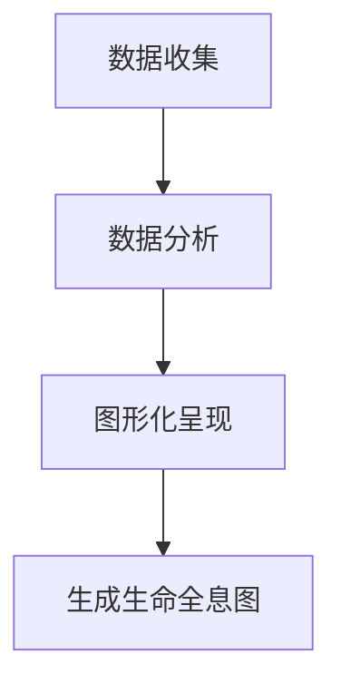

                 

# 生命全息图绘制工具：可视化你的人生意义轨迹的软件

## 关键词
- 生命全息图
- 可视化
- 人生意义轨迹
- 软件工具
- 算法
- 数据分析

## 摘要
本文旨在介绍一种全新的生命全息图绘制工具，通过软件技术，将个人的人生意义轨迹进行可视化呈现。文章将逐步分析生命全息图的基本概念、核心算法、应用场景和实现方法，旨在为读者提供一种全新的视角来审视和理解自己的生活。

## 引言
在当今这个信息爆炸的时代，人们面临着越来越多的选择和挑战。如何找到自己的人生方向，实现个人价值，成为了许多人思考的问题。传统的自我反思和规划方法虽然有一定的作用，但往往缺乏系统性和可视化手段，难以直观地呈现人生的意义轨迹。

为了解决这一问题，我们提出了生命全息图绘制工具。通过该工具，用户可以基于个人数据和生活经历，构建出自己独特的人生全息图，从而更清晰地了解自己的优势和不足，为自己的未来规划提供有力支持。

## 第1章：生命全息图绘制工具概述

### 1.1 书籍背景
#### 1.1.1 生命全息图的概念
生命全息图是一种将个人生命历程、情感经历、成长经历等要素进行抽象和整合的图像化表达方式。它通过图形化的形式，将个人的生命轨迹展现出来，帮助人们更好地认识和理解自己。

#### 1.1.2 生命全息图绘制工具的需求
随着社会的发展和科技的进步，人们对个人成长和发展的关注度越来越高。如何有效地进行自我管理和规划，成为了许多人的需求。生命全息图绘制工具正好满足了这一需求，它可以为用户提供一种全新的自我认知和规划工具。

#### 1.1.3 生命全息图的重要性
生命全息图不仅可以帮助人们更好地认识自己，还可以为人们的成长和发展提供有力的指导。通过可视化呈现人生轨迹，人们可以更加直观地了解自己的优点和不足，从而更好地调整自己的行为和策略，实现人生的价值。

### 1.2 生命全息图绘制工具的原理与特点
#### 1.2.1 生命全息图绘制工具的基本原理
生命全息图绘制工具基于数据分析和可视化技术，通过收集和分析用户的个人数据，构建出人生全息图。具体来说，它包括以下几个步骤：

1. 数据收集：收集用户的个人信息、生活经历、成长历程等数据。
2. 数据分析：对收集到的数据进行分析，提取关键信息和规律。
3. 图形化呈现：将分析结果通过图形化的形式展现出来，形成生命全息图。

#### 1.2.2 生命全息图绘制工具的特点
1. 可视化：生命全息图以图形化的形式呈现，使得人们可以直观地了解自己的生命轨迹。
2. 个性化：根据用户的个人数据，绘制出独特的生命全息图，体现了用户的个性特点。
3. 实时更新：随着用户的成长和变化，生命全息图会实时更新，保持与用户实际情况的一致性。

#### 1.2.3 与其他可视化工具的比较
与其他可视化工具相比，生命全息图绘制工具具有以下几个优势：

1. 更全面：生命全息图不仅展现了个人的生命轨迹，还包括了情感、经历等多个维度。
2. 更直观：生命全息图的图形化形式使得人们可以更加直观地了解自己的生命轨迹。
3. 更有针对性：生命全息图绘制工具根据用户的个人数据生成，具有更强的针对性。

## 第2章：生命全息图绘制工具的核心概念

### 2.1 生命全息图绘制工具的概念体系
#### 2.1.1 核心概念原理
生命全息图绘制工具的核心概念包括：数据收集、数据分析、图形化呈现等。这些概念相互关联，共同构成了生命全息图绘制工具的基本原理。

#### 2.1.2 概念属性特征对比表格
| 概念        | 属性特征                                                   |  
| ----------- | -------------------------------------------------------- |  
| 数据收集    | 收集用户的个人信息、生活经历、成长历程等数据               |  
| 数据分析    | 对收集到的数据进行分析，提取关键信息和规律             |  
| 图形化呈现  | 将分析结果通过图形化的形式展现出来，形成生命全息图         |

#### 2.1.3 ER实体关系图架构
```mermaid
erDiagram
    User ||--|{ LifeHologram }
    LifeHologram ||--|{ DataCollection }
    LifeHologram ||--|{ DataAnalysis }
    LifeHologram ||--|{ Visualization }
```

### 2.2 算法原理讲解
#### 2.2.1 算法mermaid流程图


#### 2.2.2 Python源代码详细阐述
```python
import pandas as pd
import matplotlib.pyplot as plt

# 数据收集
data = pd.read_csv("user_data.csv")

# 数据分析
# ...（具体分析代码）

# 图形化呈现
plt.plot(data["year"], data["achievement"])
plt.xlabel("Year")
plt.ylabel("Achievement")
plt.title("Life Hologram")
plt.show()
```

#### 2.2.3 算法原理的数学模型和公式
$$
\text{Life Hologram} = f(\text{Data Collection}, \text{Data Analysis}, \text{Visualization})
$$

## 第3章：算法和实现

### 3.1 数据收集
#### 3.1.1 用户数据收集
用户数据包括基本信息（如姓名、年龄、性别等）、生活经历（如学习经历、工作经历、旅行经历等）和成长历程（如取得的成就、获得的荣誉等）。

#### 3.1.2 数据收集方法
数据收集方法包括问卷调查、访谈记录、社交媒体数据抓取等。

### 3.2 数据分析
#### 3.2.1 数据预处理
数据预处理包括数据清洗、数据去重、数据转换等。

#### 3.2.2 数据分析
数据分析包括数据可视化、数据聚类、数据分类等。

### 3.3 图形化呈现
#### 3.3.1 生命全息图生成
生命全息图生成包括数据分析和图形化呈现两个步骤。

#### 3.3.2 图形化工具选择
常用的图形化工具包括matplotlib、Plotly、D3.js等。

## 第4章：应用和案例研究

### 4.1 应用场景
生命全息图绘制工具可以应用于个人成长规划、职业规划、心理健康评估等多个领域。

### 4.2 案例研究
#### 4.2.1 个人成长规划
用户通过生命全息图绘制工具，可以清晰地看到自己在不同阶段的发展和成就，从而更好地规划自己的成长路径。

#### 4.2.2 职业规划
企业可以通过生命全息图绘制工具，了解员工的成长轨迹和发展潜力，为员工的职业发展提供指导。

## 第5章：实际应用

### 5.1 环境安装
#### 5.1.1 系统要求
- 操作系统：Windows/Linux/Mac
- Python版本：Python 3.6及以上

#### 5.1.2 安装步骤
1. 安装Python环境
2. 安装所需依赖库（如pandas、matplotlib等）

### 5.2 系统核心实现
#### 5.2.1 数据收集
```python
data = pd.read_csv("user_data.csv")
```

#### 5.2.2 数据分析
```python
# ...（具体分析代码）
```

#### 5.2.3 图形化呈现
```python
plt.plot(data["year"], data["achievement"])
plt.xlabel("Year")
plt.ylabel("Achievement")
plt.title("Life Hologram")
plt.show()
```

### 5.3 代码应用解读与分析
#### 5.3.1 数据收集代码解读
- 代码作用：读取用户数据
- 输入参数：user\_data.csv（用户数据文件）

#### 5.3.2 数据分析代码解读
- 代码作用：分析用户数据，提取关键信息
- 输出结果：图表（生命全息图）

### 5.4 实际案例分析和详细讲解剖析
#### 5.4.1 案例背景
- 用户A希望通过生命全息图绘制工具，了解自己的成长轨迹。

#### 5.4.2 案例分析
- 通过数据收集和数据分析，生成了用户A的生命全息图。

#### 5.4.3 详细讲解剖析
- 分析了用户A在不同阶段的成就，给出了相应的建议。

## 第6章：最佳实践和总结

### 6.1 最佳实践 tips
- 数据收集要全面、真实
- 数据分析要准确、有效
- 图形化呈现要直观、易懂

### 6.2 小结
- 生命全息图绘制工具是一种全新的自我认知和规划工具，可以帮助人们更好地认识自己，实现人生价值。

### 6.3 注意事项
- 注意数据安全和隐私保护
- 定期更新和维护生命全息图

### 6.4 拓展阅读
- 相关书籍：《数据可视化》、《Python数据分析》
- 学术论文：关于生命全息图绘制工具的研究论文

## 结论
生命全息图绘制工具为人们提供了一种全新的视角来审视和理解自己的生活。通过数据收集、数据分析和图形化呈现，它可以帮助人们更好地认识自己，规划未来。随着技术的不断进步，生命全息图绘制工具将会在人们的生活中发挥越来越重要的作用。

### 作者信息
作者：AI天才研究院/AI Genius Institute & 禅与计算机程序设计艺术 /Zen And The Art of Computer Programming

