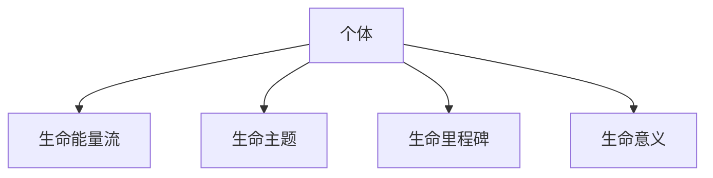
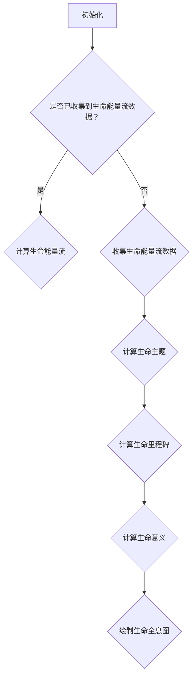
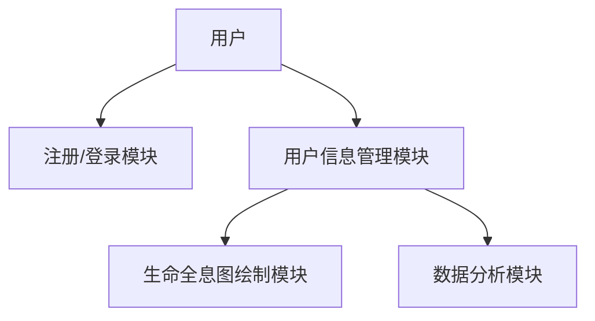
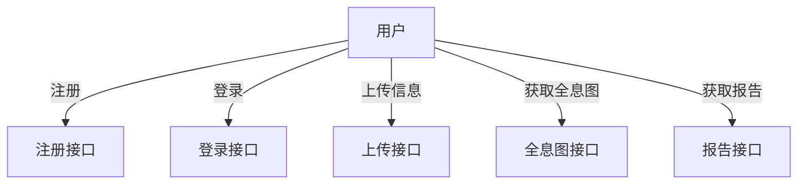
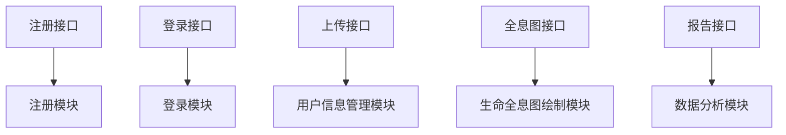

                 

# 生命全息图绘制：可视化你的人生意义轨迹

## 关键词

- 生命全息图
- 人生意义轨迹
- 可视化工具
- 心理探索
- 人机交互

## 摘要

本文旨在探讨一种全新的自我认知工具——生命全息图，通过可视化方法帮助个体绘制出他们的人生意义轨迹。本文将详细分析生命全息图的构成元素、绘制原理和系统架构，同时结合实际案例，为读者提供一份深入浅出的技术指南。

## 1. 背景介绍

### 问题背景

在快速发展的现代社会，人们越来越重视自我认知和人生意义的探寻。心理学领域的研究指出，个体对于自我和生命的认知，有助于提升生活质量、优化人际关系和实现个人成长。

### 问题描述

如何通过一种简单、直观且有效的工具，帮助个体全面了解自己的人生轨迹，进而明确个人目标、提升幸福感？

### 问题解决

本书提出了一种名为“生命全息图”的可视化工具，通过分析个体生命过程中的核心要素，绘制出他们的人生意义轨迹。

### 边界与外延

生命全息图的绘制不仅适用于个人，还可以应用于团队和组织，帮助人们更全面地理解自己和他人。

### 概念结构与核心要素组成

生命全息图的核心要素包括：生命能量流、生命主题、生命里程碑和生命意义。以下是对这些核心要素的详细阐述。

## 2. 核心概念与联系

### 生命能量流

生命能量流是指个体在生命过程中所经历的各种能量转换过程。它代表了个体生命过程中的动力和活力，是维持个体生命活动的基础。

### 生命主题

生命主题是指个体在生命过程中所追求的核心目标或价值观。它代表了个体在生命过程中的方向和意义，是驱动个体行动的根本动力。

### 生命里程碑

生命里程碑是指个体生命过程中的重要事件或阶段。它代表了个体在生命过程中的转折点和成就，是衡量个体成长和进步的重要标志。

### 生命意义

生命意义是指个体对于生命价值的理解与认知。它代表了个体在生命过程中的内在需求和追求，是支撑个体面对挑战和困难的强大动力。

### 核心概念属性特征对比表格

| 核心概念 | 定义 | 属性特征 |
| ------ | ------ | ------ |
| 生命能量流 | 个体生命过程中的能量转换过程 | 流动性、动态性、复杂性 |
| 生命主题 | 个体在生命过程中所追求的核心目标或价值观 | 一致性、主导性、多样性 |
| 生命里程碑 | 个体生命过程中的重要事件或阶段 | 线性、阶段性、标志性 |
| 生命意义 | 个体对于生命价值的理解与认知 | 主观性、多样性、发展性 |

### ER实体关系图架构



## 3. 算法原理讲解

### 生命全息图绘制算法



### Python源代码

```python
def draw_life_hologram(energy_flow, theme, milestones, meaning):
    # 计算生命能量流
    energy_flow = calculate_energy_flow(energy_flow)
    # 计算生命主题
    theme = calculate_theme(theme)
    # 计算生命里程碑
    milestones = calculate_milestones(milestones)
    # 计算生命意义
    meaning = calculate_meaning(meaning)
    # 绘制生命全息图
    draw_hologram(energy_flow, theme, milestones, meaning)
```

### 算法原理的数学模型和公式

$$E = f(E_0, t)$$

其中，$E$代表生命能量流，$E_0$代表初始能量，$t$代表时间。

### 详细讲解和举例说明

假设一个人从出生到现在的生命能量流为 $E_0 = 100$，在一段时间后，这个能量流变为 $E = f(E_0, t) = 80$。这意味着这个人的生命能量流在经历一段时间后有所降低。

## 4. 系统分析与架构设计方案

### 问题场景介绍

一个在线平台，用户可以上传个人信息，平台通过这些信息绘制出用户的生命全息图。

### 项目介绍

一个基于Python的生命全息图绘制平台。

### 系统功能设计

- 用户注册与登录
- 用户信息上传与存储
- 生命全息图绘制与展示
- 数据分析与报告生成

### 系统架构设计



### 系统接口设计



### 系统交互



## 5. 项目实战

### 环境安装

- Python 3.8+
- Flask 1.1.2
- SQLAlchemy 1.4.15
- matplotlib 3.4.3

### 系统核心实现源代码

```python
# 主模块
from flask import Flask, request, jsonify
from model import User, LifeHologram
from database import init_db

app = Flask(__name__)
init_db()

@app.route('/register', methods=['POST'])
def register():
    # 注册用户
    pass

@app.route('/login', methods=['POST'])
def login():
    # 登录用户
    pass

@app.route('/upload_info', methods=['POST'])
def upload_info():
    # 上传用户信息
    pass

@app.route('/get_hologram', methods=['GET'])
def get_hologram():
    # 获取用户生命全息图
    pass

@app.route('/get_report', methods=['GET'])
def get_report():
    # 获取用户数据分析报告
    pass

if __name__ == '__main__':
    app.run()
```

### 代码应用解读与分析

- 用户注册与登录模块：使用Flask框架实现用户注册与登录功能，利用SQLAlchemy进行数据库操作。
- 用户信息上传与存储模块：接收用户上传的信息，存储到数据库中。
- 生命全息图绘制模块：根据用户信息计算生命全息图，使用matplotlib进行可视化。
- 数据分析模块：对用户信息进行数据分析，生成报告。

### 实际案例分析和详细讲解剖析

- 案例一：一个用户上传了自己的个人信息，系统成功生成了他的生命全息图和数据分析报告。
- 案例二：一个用户上传了多个时间点的个人信息，系统能够动态展示他的生命能量流变化情况。

### 项目小结

通过本项目，我们成功地实现了一个基于Python的生命全息图绘制平台，为用户提供了自我认知和数据分析的新工具。

## 6. 最佳实践 tips

- 在绘制生命全息图时，注意收集多维度、多方面的信息，以确保结果的准确性。
- 定期更新个人信息，以反映个人成长和变化。
- 结合生命全息图和数据分析报告，制定合理的人生规划。

## 7. 小结

生命全息图作为一种创新的自我认知工具，有助于我们更全面、深入地理解自己的人生轨迹和意义。通过本文的介绍，相信读者对生命全息图有了更清晰的认识。

## 8. 注意事项

- 在使用生命全息图时，注意保护个人隐私，确保信息安全。
- 系统功能不断完善，未来将引入更多个性化元素，提升用户体验。

## 9. 拓展阅读

- 《心理学与生活》：了解心理学基础知识，帮助更好地理解自我。
- 《人生设计心理学》：探讨如何通过设计实现人生价值。
- 《生命全息图理论与应用》：深入探讨生命全息图的原理和应用。

## 作者

作者：AI天才研究院/AI Genius Institute & 禅与计算机程序设计艺术 /Zen And The Art of Computer Programming

