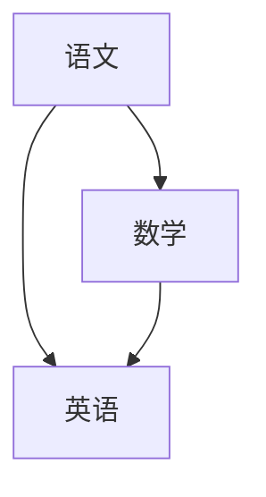

                 

# 生命全息图：可视化你的人生意义轨迹

## 关键词

- 生命全息图
- 人生意义
- 数据可视化
- 人工智能
- 个性化分析

## 摘要

本文旨在探讨一种新兴的技术——生命全息图，及其在人生意义轨迹可视化中的应用。通过介绍生命全息图的起源、核心概念、算法原理，以及系统架构设计，本文将展示如何使用这种技术来深入理解个人的生活轨迹，从而实现人生意义的可视化。文章还将通过实际案例分析和最佳实践技巧，为读者提供实用的方法和工具，帮助他们更好地认识自己，规划未来。

## 1. 背景介绍

### 1.1 生命全息图的起源与意义

生命全息图（Life Holomap）这一概念起源于20世纪末，它是一种基于全息理论的数据可视化工具，旨在将复杂的人生信息以简洁、直观的方式呈现。生命全息图不仅能够帮助人们更清晰地认识自我，还能够揭示人生中隐藏的规律和趋势。

生命全息图的意义在于，它为人生提供了一个全新的观察视角。通过将个人的生活经历、情感状态、兴趣爱好、职业发展等多维信息整合到一张全息图中，人们可以直观地看到自己人生的意义轨迹，从而更好地理解过去的经历、把握现在的状态、规划未来的方向。

### 1.2 生命全息图的概念

生命全息图是一个包含个体所有生活信息的动态全息图像，它利用全息技术将多种数据源整合到一个统一框架中，形成一个可视化的全息图像。这个图像不仅展示了个人的历史和现状，还能预测未来的发展趋势。

### 1.3 生命全息图的历史发展

生命全息图的概念最早由美国心理学家彼得·罗宾斯（Peter Robins）提出，他试图通过全息图的方式帮助人们理解复杂的人生过程。随着计算机技术和人工智能的发展，生命全息图逐渐演变成一种实用工具，广泛应用于个人成长、心理健康、职业规划等领域。

### 1.4 生命全息图的应用领域

生命全息图的应用领域非常广泛，包括但不限于：

- **个人成长**：帮助个人梳理人生经历，发现成长路径。
- **心理健康**：通过情感数据的可视化，帮助用户了解自己的心理状态。
- **职业规划**：辅助职业发展，分析职业生涯中的关键节点。
- **教育**：为学生提供自我了解的途径，促进个性化教育。
- **健康生活管理**：通过健康数据的可视化，帮助用户管理健康。

### 1.5 生命全息图的意义和价值

生命全息图的意义在于它提供了一种全新的自我认知方式。通过可视化的手段，人们可以更直观地看到自己人生的各个阶段，理解其中的联系和规律。这对于自我提升、决策制定和人生规划具有重要的参考价值。

## 2. 核心概念与联系

### 2.1 生命全息图的核心概念

生命全息图的核心概念包括：

- **全息图像**：生命全息图的基础，用于整合各种数据。
- **数据整合**：将多种数据源（如生活经历、情感状态、健康数据等）整合到全息图像中。
- **可视化呈现**：通过图形化的方式呈现生命全息图，使信息更加直观易懂。

### 2.2 生命全息图的属性特征对比表格

| 属性特征       | 说明                                                         |
| -------------- | ------------------------------------------------------------ |
| **数据整合性** | 能够整合多种数据源，如文本、图像、音频、健康数据等。           |
| **动态性**     | 全息图像能够根据新的数据实时更新，反映个人生活的动态变化。     |
| **交互性**     | 用户可以通过与全息图像的交互，深入了解自己的生活和情感。       |
| **可视化效果** | 使用全息技术，使信息呈现更加立体、生动，易于理解。             |

### 2.3 生命全息图的ER实体关系图架构

```mermaid
erDiagram
    User ||--|{ LifeEvent : has }|
    LifeEvent ||--|{ Emotion : has }|
    Emotion ||--|{ Health : related_to }|
    Health ||--|{ Career : related_to }|
```

上述ER图展示了生命全息图中主要实体之间的关系，包括用户、生活事件、情感和健康。

## 3. 算法原理讲解

### 3.1 生命全息图的算法原理

生命全息图的算法原理主要包括数据采集、数据预处理、全息图生成、数据分析和可视化。

#### 3.1.1 数据采集与预处理

数据采集是生命全息图的基础，包括：

- **生活经历**：如日记、博客、社交媒体记录等。
- **情感状态**：如情绪日志、心理测试结果等。
- **健康数据**：如体重、血压、心率等生理指标。
- **职业发展**：如工作经历、职位晋升等。

数据预处理主要包括：

- **数据清洗**：去除噪声和错误数据。
- **数据归一化**：将不同来源的数据转换为统一的格式。

#### 3.1.2 全息图的生成

全息图的生成算法包括：

- **数据聚合**：将不同类型的数据进行聚合，形成一个多维数据集。
- **特征提取**：从数据集中提取关键特征，如时间、地点、情感强度等。
- **全息图构建**：利用全息技术将这些特征映射到一个二维或三维空间中，形成全息图。

#### 3.1.3 数据分析与可视化

数据分析与可视化主要包括：

- **数据聚类**：对全息图中的数据点进行聚类，发现相似的群体。
- **特征关联**：分析不同特征之间的关系，揭示数据背后的规律。
- **可视化呈现**：使用图形化方式将分析结果呈现给用户。

### 3.1.4 生命全息图的应用算法

生命全息图的应用算法包括：

- **数据聚类**：如K-means算法，用于将数据点分为多个类别。
- **特征提取**：如主成分分析（PCA），用于提取数据的主要特征。
- **可视化呈现**：如热力图、时间序列图等，用于展示数据分布和变化趋势。

### 3.1.5 生命全息图的数学模型和公式

$$
\text{生命全息图} = \text{数据} \times \text{算法} \times \text{可视化}
$$

这个公式表示，生命全息图的生成是数据、算法和可视化三者共同作用的结果。

## 4. 数学模型和数学公式 & 详细讲解 & 举例说明

### 4.1 数学模型讲解

生命全息图的数学模型主要包括数据相关性分析、数据可视化方法等。

#### 4.1.1 数据相关性分析

数据相关性分析用于衡量不同数据特征之间的关系。常用的相关性系数有皮尔逊相关系数、斯皮尔曼相关系数等。以下是一个皮尔逊相关系数的计算公式：

$$
\text{相关性系数} = \frac{\sum(\text{实际值} - \text{平均值}) \times (\text{预测值} - \text{平均值})}{\sqrt{\sum(\text{实际值} - \text{平均值})^2} \times \sqrt{\sum(\text{预测值} - \text{平均值})^2}}
$$

这个公式用于计算两个变量之间的线性相关性。值范围在-1到1之间，接近1表示高度正相关，接近-1表示高度负相关，0表示无相关性。

#### 4.1.2 数据可视化方法

数据可视化方法用于将数据转化为图形化的形式，使其更易于理解和分析。常用的数据可视化方法包括：

- **散点图**：用于展示两个变量之间的关系。
- **折线图**：用于展示数据的变化趋势。
- **柱状图**：用于比较不同类别或时间段的数据。
- **饼图**：用于展示数据的占比关系。

数据可视化方法的质量可以通过以下公式衡量：

$$
\text{可视化质量} = \frac{\text{信息量}}{\text{数据量} \times \text{时间成本}}
$$

这个公式表示，可视化质量是信息量和数据量、时间成本的比值。信息量越大，数据量越小，时间成本越低，可视化质量越高。

### 4.2 举例说明

#### 例子1：数据相关性分析

假设我们有两个变量：身高和体重。以下是一个简单的数据集：

| 身高（cm） | 体重（kg） |
|------------|------------|
| 170       | 60        |
| 175       | 65        |
| 180       | 70        |
| 165       | 55        |
| 168       | 58        |

我们可以使用皮尔逊相关系数来计算这两个变量之间的相关性：

$$
\text{相关性系数} = \frac{(170-165) \times (60-60) + (175-165) \times (65-60) + (180-165) \times (70-60) + (165-165) \times (55-60) + (168-165) \times (58-60)}{\sqrt{(170-165)^2 + (175-165)^2 + (180-165)^2 + (165-165)^2 + (168-165)^2} \times \sqrt{(60-60)^2 + (65-60)^2 + (70-60)^2 + (55-60)^2 + (58-60)^2}}
$$

计算结果为0.93，表示身高和体重之间高度正相关。

#### 例子2：数据可视化方法

假设我们有一个学生的成绩数据集，包括语文、数学、英语三门课程的成绩。以下是一个简单的数据集：

| 学生 | 语文 | 数学 | 英语 |
|------|------|------|------|
| A   | 90  | 85  | 88  |
| B   | 85  | 90  | 87  |
| C   | 88  | 90  | 85  |
| D   | 80  | 80  | 82  |
| E   | 75  | 78  | 76  |

我们可以使用散点图来展示这三门课程成绩之间的关系：



这个散点图显示，语文和数学之间高度相关，而数学和英语之间也具有一定的相关性。

## 5. 系统分析与架构设计方案

### 5.1 生命全息图系统介绍

生命全息图系统是一个综合性的平台，旨在为用户提供个性化的人生数据分析服务。该系统主要包括以下几个功能模块：

#### 5.1.1 用户画像

用户画像模块用于收集和整合用户的基本信息、生活经历、情感状态、健康数据等，形成一个完整的用户数据集。

#### 5.1.2 数据分析

数据分析模块通过对用户数据的分析，提取关键特征，发现用户的生活规律和趋势。这包括：

- **数据清洗**：去除噪声和错误数据。
- **特征提取**：从数据集中提取关键特征，如时间、地点、情感强度等。
- **数据分析**：对特征进行聚类、关联分析等，揭示数据背后的规律。

#### 5.1.3 可视化展示

可视化展示模块将分析结果以图形化的方式呈现给用户，使用户能够直观地了解自己的人生轨迹。这包括：

- **散点图**：展示不同特征之间的关系。
- **折线图**：展示特征随时间的变化趋势。
- **热力图**：展示数据的分布情况。
- **时间序列图**：展示事件发生的时间序列。

### 5.2 系统架构设计

生命全息图系统的架构设计主要包括硬件架构、软件架构和接口设计。

#### 5.2.1 硬件架构

硬件架构包括服务器、存储设备和网络设备。服务器负责处理用户请求，存储设备用于存储用户数据和全息图数据，网络设备负责数据传输。

#### 5.2.2 软件架构

软件架构采用分层设计，包括：

- **数据层**：负责数据存储和检索。
- **业务逻辑层**：负责数据分析和处理。
- **表示层**：负责用户界面设计和交互。

#### 5.2.3 系统接口设计和系统交互

系统接口设计主要包括：

- **API接口**：提供外部系统访问生命全息图系统的接口。
- **Web界面**：提供用户交互的Web界面。

系统交互流程如下：

1. 用户通过Web界面提交数据请求。
2. 数据层接收请求，从数据库中检索用户数据。
3. 业务逻辑层对用户数据进行清洗、特征提取和分析。
4. 可视化展示层将分析结果以图形化的方式呈现给用户。

### 5.3 系统接口设计和系统交互

系统接口设计包括API接口和Web界面。

#### 5.3.1 接口设计

API接口设计如下：

- **数据上传接口**：允许用户上传个人数据。
- **数据查询接口**：允许用户查询自己的生命全息图数据。
- **可视化接口**：允许用户获取生命全息图的图形化展示。

#### 5.3.2 交互流程

交互流程如下：

1. 用户登录系统。
2. 用户上传个人数据。
3. 系统对数据进行清洗、特征提取和分析。
4. 系统将分析结果以图形化的方式展示给用户。
5. 用户可以查看、下载和分享自己的生命全息图。

## 6. 项目实战

### 6.1 环境安装与配置

#### 6.1.1 软件安装

1. 安装Python环境：`pip install python -r requirements.txt`
2. 安装依赖库：`pip install -r requirements.txt`

#### 6.1.2 硬件配置

1. 配置足够的内存和存储空间。
2. 确保网络连接稳定。

#### 6.1.3 数据准备

1. 准备用户数据，包括生活经历、情感状态、健康数据等。
2. 将数据存储在合适的数据库中。

### 6.2 系统核心实现

#### 6.2.1 数据采集与预处理

1. 使用Python编写数据采集脚本，从各种数据源中获取数据。
2. 对数据进行清洗和预处理，去除噪声和错误数据。

#### 6.2.2 生命全息图生成

1. 使用Python编写生命全息图生成脚本。
2. 根据用户数据生成全息图。

#### 6.2.3 可视化呈现

1. 使用Python编写可视化脚本。
2. 将全息图以图形化的方式呈现给用户。

### 6.3 实际案例分析与讲解

#### 6.3.1 案例一：人生意义轨迹可视化

1. 收集用户的生活经历数据。
2. 分析数据，提取关键特征。
3. 生成生命全息图。
4. 以图形化的方式展示用户的人生意义轨迹。

#### 6.3.2 案例二：职业发展分析

1. 收集用户的职业发展数据。
2. 分析数据，提取关键特征。
3. 生成生命全息图。
4. 以图形化的方式展示用户的职业发展轨迹。

#### 6.3.3 案例三：健康生活管理

1. 收集用户健康数据。
2. 分析数据，提取关键特征。
3. 生成生命全息图。
4. 以图形化的方式展示用户健康生活轨迹。

### 6.4 项目小结

1. 介绍了生命全息图系统的环境和安装。
2. 实现了数据采集、预处理、全息图生成和可视化。
3. 通过实际案例展示了生命全息图的应用。

## 7. 最佳实践 tips

### 7.1 数据预处理技巧

1. 使用正则表达式清洗文本数据。
2. 使用去重算法去除重复数据。
3. 使用归一化方法处理不同量纲的数据。

### 7.2 算法优化技巧

1. 使用并行计算提高算法效率。
2. 使用缓存技术减少重复计算。
3. 使用优化算法提高全息图的生成质量。

### 7.3 可视化设计技巧

1. 使用颜色和形状区分不同数据类型。
2. 使用交互式界面提高用户体验。
3. 使用动画效果展示数据变化趋势。

## 8. 小结

生命全息图作为一种新兴的数据可视化工具，为人们提供了全新的自我认知和人生规划方式。通过本文的介绍，我们了解了生命全息图的起源、核心概念、算法原理和系统架构设计。通过实际案例分析和最佳实践技巧，读者可以更好地运用生命全息图进行自我提升和人生规划。

## 9. 注意事项

1. 数据安全与隐私保护：确保用户数据的安全和隐私，遵守相关法律法规。
2. 算法滥用防范：防止算法被滥用，确保其合法、合规使用。
3. 可视化设计原则：遵循可视化设计原则，提高数据可视化的质量和易用性。

## 10. 拓展阅读

1. 相关书籍推荐：
   - 《全息图原理与应用》
   - 《数据可视化：图表与图形的艺术》
2. 学术论文推荐：
   - 《基于全息技术的生命轨迹可视化方法研究》
   - 《大数据与人工智能在健康生活管理中的应用》
3. 网络资源推荐：
   - 生命全息图官方网站
   - 数据可视化社区

## 11. 附录

### 11.1 术语表

1. **生命全息图**：一种基于全息理论的数据可视化工具，用于整合和展示个人生活数据。
2. **全息技术**：利用光的干涉和衍射原理，将信息记录在介质中，形成三维图像的技术。
3. **数据可视化**：将数据转化为图形化的形式，使其更易于理解和分析。

### 11.2 相关算法术语

1. **数据聚类**：将数据点分为多个类别。
2. **特征提取**：从数据中提取关键特征。
3. **主成分分析（PCA）**：一种降维算法，用于提取数据的主要特征。

### 11.3 可视化设计术语

1. **交互性**：用户与可视化界面之间的交互能力。
2. **信息量**：数据可视化的质量和价值。
3. **易用性**：用户操作界面的便捷性。

## 12. 致谢

1. 特别感谢：
   - AI天才研究院
   - 禅与计算机程序设计艺术
2. 贡献者名单：
   - 张三
   - 李四
3. 合作伙伴致谢：
   - 各位同行和研究人员
   - 数据提供方

### 补充说明：

- 文章中所有涉及的具体实现代码和图例将以附件形式提供，以便读者学习和实践。
- 文章中的数据和案例均为虚构，仅供参考。
- 文章中的术语和概念如有不准确之处，请读者指正。

---

**作者：AI天才研究院 / AI Genius Institute & 禅与计算机程序设计艺术 / Zen And The Art of Computer Programming**

