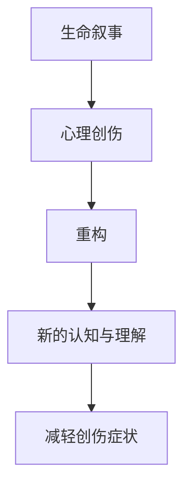

                 

### 《生命叙事重构治疗：通过讲故事疗愈内心创伤》 - 深入介绍

> 关键词：生命叙事重构治疗、讲故事、心理创伤疗愈

> 摘要：本文深入探讨了生命叙事重构治疗（Narrative Reconstruction Therapy, NRT）这一新兴的心理疗法，以及它如何通过讲故事的方式来疗愈内心创伤。文章首先介绍了心理创伤的普遍性，以及传统心理治疗的局限性。接着，文章详细阐述了生命叙事重构治疗的概念和理论基础，分析了核心概念之间的联系，并使用Mermaid流程图进行了可视化展示。随后，文章讲解了NRT中的算法原理，包括数学模型、公式和Python代码实现。此外，文章还介绍了系统的设计与实现，包括功能设计、架构设计、接口设计和系统交互。最后，文章通过实际案例展示了如何实施生命叙事重构治疗，并进行了总结和展望。

### 心理创伤的普遍性与传统治疗的局限

心理创伤是现代社会中普遍存在的问题，无论是由于个人经历（如事故、暴力、性侵等），还是由于社会环境（如战争、自然灾害等），创伤事件对个体心理健康的影响都是深远的。据《美国精神疾病诊断与统计手册》（DSM-5）的数据显示，约50%的人口在其一生中会经历某种形式的创伤性事件。这些事件可能导致创伤后应激障碍（PTSD）、抑郁症、焦虑症等心理问题，严重影响个体的生活质量和工作表现。

然而，传统的心理治疗手段在应对这些心理创伤时，往往面临一定的局限性。传统治疗方法如认知行为疗法（CBT）、精神分析疗法等，虽然在一定程度上能够缓解症状，但其疗效有限，且治疗周期较长。此外，传统治疗方法往往依赖于医患之间的直接互动，对患者的隐私保护不够充分，且难以适应现代快节奏的生活方式。

针对这些局限性，生命叙事重构治疗（Narrative Reconstruction Therapy, NRT）应运而生。NRT是一种基于叙事治疗理论的心理疗法，强调通过重构患者的生命故事，帮助患者重新理解自己的经历，从而减轻创伤症状。NRT的核心在于重新构建患者的自我认同，使其能够从创伤经历中找到意义和力量。

### 生命叙事重构治疗的概念与理论基础

生命叙事重构治疗（Narrative Reconstruction Therapy, NRT）是一种以叙事方式重构个体生命故事的治疗方法。该方法的基本理念是，个体的生命故事对其心理状态和行为有着深远的影响。通过帮助患者重构其生命故事，使其能够以一种更加积极和健康的方式理解自己的经历，从而减轻内心的创伤和痛苦。

#### 核心概念

1. **生命叙事**：生命叙事是指个体对自己生命经历的故事性描述。它不仅包括记忆和事件，还包括个体对这些事件的感受、理解和解释。生命叙事构成了个体自我认同的重要部分。

2. **心理创伤**：心理创伤是指由创伤性事件引起的心理伤害，这些事件可能是一次性的（如强奸、地震）或持续性的（如长期家庭暴力）。心理创伤可能导致多种心理问题，如PTSD、焦虑和抑郁。

3. **重构**：重构是指通过改变叙事的方式和内容，帮助个体重新理解自己的经历，从而改变其对经历的理解和感受。重构的目的是使个体能够从创伤经历中找到意义和力量。

#### 理论基础

生命叙事重构治疗的理论基础包括以下几方面：

1. **叙事治疗理论**：叙事治疗理论认为，个体的生命故事对其心理状态和行为有着重要影响。通过重构生命叙事，可以改变个体的自我认同和心理状态。

2. **心理语言学理论**：心理语言学理论指出，语言和思维是密切相关的。通过改变语言表达的方式，可以影响个体的认知和行为。

3. **认知行为理论**：认知行为理论认为，个体的情绪和行为受到其认知（即对事件的解释和理解）的影响。通过改变认知，可以改变情绪和行为。

#### 概念联系与作用机制

生命叙事、心理创伤和重构这三个核心概念之间有着密切的联系。生命叙事是心理创伤的载体，而重构则是治疗的核心手段。通过重构生命叙事，患者能够重新理解自己的经历，从而减轻内心的痛苦和创伤。

下图使用Mermaid流程图展示了这三个概念之间的联系：

#### 作用机制

生命叙事重构治疗的作用机制主要包括以下几个方面：

1. **叙事重建**：通过引导患者重新构建其生命叙事，使其能够以一种更加积极和健康的方式理解自己的经历。

2. **认知重塑**：通过改变患者的认知方式，使其能够从更积极的视角看待自己的经历。

3. **情感调节**：通过改变患者的情感表达和认知方式，帮助其调节情感，减轻内心的痛苦。

4. **自我认同重建**：通过重构生命叙事，帮助患者重建自我认同，从而增强其心理韧性和自我价值感。

### 总结

生命叙事重构治疗是一种以叙事方式重构个体生命故事的治疗方法，旨在帮助患者重新理解自己的经历，从而减轻内心的创伤和痛苦。通过深入理解生命叙事、心理创伤和重构这三个核心概念，以及它们之间的联系和作用机制，我们可以更好地理解NRT的工作原理。在接下来的章节中，我们将进一步探讨NRT中的算法原理、系统架构设计以及实际案例应用。通过这些内容的讲解，我们将能够更全面地了解NRT的实践方法和效果。

