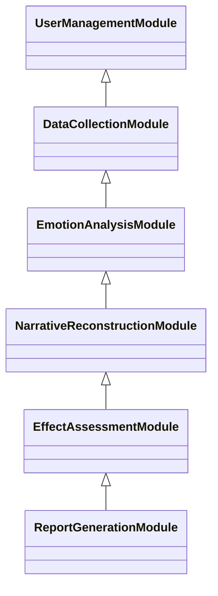
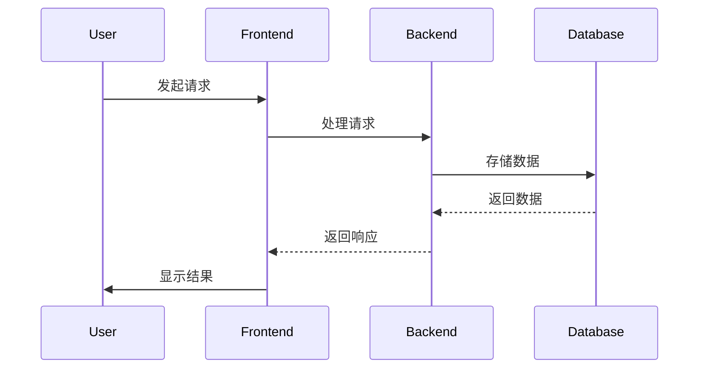
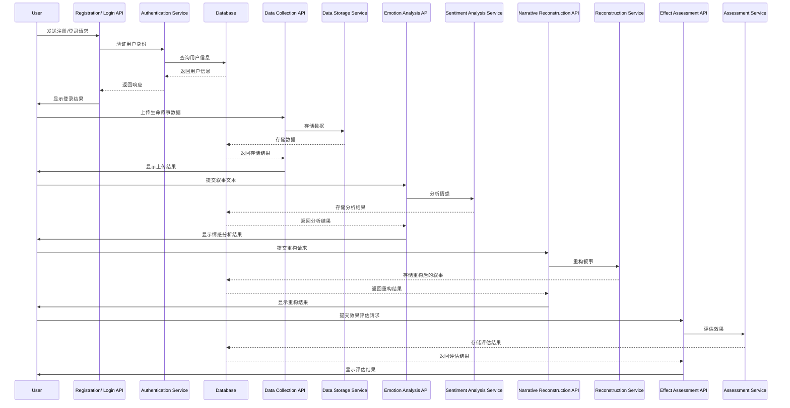

                 

# 生命叙事重构治疗：通过讲故事疗愈内心创伤的方法

关键词：叙事治疗、生命叙事、内心创伤、情感调节、心理疗愈

摘要：本文旨在探讨生命叙事重构治疗这一创新的心理疗愈方法，通过分析叙事治疗的概念、原理及其实践方法，阐述其在疗愈内心创伤中的重要作用。本文将从生命叙事与内心创伤的关系、叙事治疗的理论基础、具体方法以及实践应用等多个维度，全面介绍生命叙事重构治疗的操作流程和实际效果，为心理健康领域的专业人士和寻求心理疗愈的个体提供有价值的参考。

## 第一部分：问题背景与治疗理念

### 第1章：生命叙事与内心创伤

#### 1.1 生命叙事的概念与作用

**生命叙事的定义：**生命叙事是指个体或群体对其生命历程中的经历、事件和情感进行组织、表达和分享的过程。它不仅仅是对事件的记录，更是对个体生活意义的构建和表达。

**生命叙事在社会和个人生活中的重要性：**生命叙事有助于个体构建自我认同，提升社会归属感，同时也是文化传承和身份认同的重要组成部分。

**叙事治疗的基本原理：**叙事治疗是一种以叙事为核心的心理治疗方法，通过引导个体重新构建生命叙事，改变其自我认知和情感状态，从而实现心理疗愈。

#### 1.2 内心创伤的定义与影响

**内心创伤的类型与特点：**内心创伤包括心理创伤、情感创伤、关系创伤等，通常表现为焦虑、抑郁、恐惧、愤怒等情绪问题。

**内心创伤对个体的影响：**内心创伤会严重影响个体的心理健康和生活质量，可能导致情感障碍、心理障碍甚至生理疾病。

**内心创伤治疗的需求：**随着社会压力的增加和心理健康问题的普遍化，内心创伤治疗的需求日益增加，传统的治疗方法已难以满足多样化的需求。

#### 1.3 叙事治疗在创伤治疗中的应用

**叙事治疗的基本理念：**叙事治疗强调个体的生命故事和经历对心理状态的影响，通过重构生命叙事，帮助个体重新定义自我，恢复心理平衡。

**叙事治疗的优势与局限性：**叙事治疗具有灵活性强、患者参与度高、治疗效果显著等优势，但也存在适用范围有限、治疗效果较慢等局限性。

**叙事治疗的适用人群：**叙事治疗适用于各种类型的内心创伤患者，特别是那些对传统治疗方法有抵触情绪的个体。

### 1.4 本书结构安排

**本书的主要目标：**本文旨在全面介绍生命叙事重构治疗的原理、方法及应用，为心理健康领域的研究和实践提供参考。

**各章节的主要内容与预期效果：**本文分为六个部分，第一部分介绍问题背景与治疗理念；第二部分阐述生命叙事重构治疗的基本原理；第三部分介绍具体方法；第四部分探讨实践应用；第五部分讨论拓展与应用；第六部分展望未来发展趋势。各部分旨在帮助读者全面了解并掌握生命叙事重构治疗。

## 第二部分：生命叙事重构治疗的基本原理

### 第2章：生命叙事重构治疗的概念与理论基础

#### 2.1 生命叙事重构治疗的概念

**生命叙事重构治疗的定义：**生命叙事重构治疗是一种以叙事为基础的心理治疗方法，通过引导个体重新构建其生命叙事，改变其对事件和自身的认知，从而达到疗愈内心创伤的目的。

**生命叙事重构治疗的核心要素：**生命叙事重构治疗的核心要素包括叙事重建、情感调节、自我反思和认知重构。

#### 2.2 叙事治疗的理论基础

**叙事心理学的理论框架：**叙事心理学认为，人类通过叙事来理解世界、构建自我和沟通情感。叙事不仅是信息的传递，更是意义和价值的建构。

**叙事治疗的理论渊源：**叙事治疗的理论渊源可以追溯到哲学、社会学、心理学等多个领域，包括叙事心理学、后现代主义、存在主义等。

#### 2.3 生命叙事重构治疗的心理学原理

**记忆与叙事的关系：**记忆是叙事的基础，但叙事不仅仅是记忆的简单再现，而是对记忆的选择、组织和解释。

**叙事与情感调节：**叙事治疗通过改变个体的叙事方式，帮助其重新理解事件，从而调节情感状态，减轻心理痛苦。

**叙事与人格发展：**叙事在人格发展中起着重要作用，通过叙事重构，个体可以重新认识自我，实现人格成长。

### 2.4 生命叙事重构治疗的特点与优势

**生命叙事重构治疗的特点：**生命叙事重构治疗具有以下特点：以叙事为基础、强调个体参与、注重情感调节、关注人格发展。

**生命叙事重构治疗的独特优势：**生命叙事重构治疗具有以下独特优势：灵活性高、适用范围广、治疗效果显著、患者参与度高。

**生命叙事重构治疗的适用范围：**生命叙事重构治疗适用于各种类型的内心创伤患者，包括心理创伤、情感创伤、关系创伤等。

## 第三部分：生命叙事重构治疗的具体方法

### 第3章：叙事治疗的技术与方法

#### 3.1 叙事治疗的基本技术

**叙事治疗的基本技巧：**叙事治疗的基本技巧包括倾听、提问、回顾、重构等。通过这些技巧，治疗师可以帮助患者重新构建其生命叙事。

**叙事治疗的常用方法：**叙事治疗的常用方法包括生命故事回顾、叙事重构、叙事写作、角色扮演等。

#### 3.2 叙事治疗的应用策略

**叙事治疗在临床实践中的应用：**叙事治疗在临床实践中的应用包括心理创伤治疗、情感障碍治疗、人际关系问题解决等。

**叙事治疗在不同情境下的应用策略：**叙事治疗在不同情境下的应用策略包括个体治疗、小组治疗、家庭治疗等。

#### 3.3 叙事治疗的案例分析

**案例一：创伤后应激障碍的治疗：**通过叙事重构，帮助创伤后应激障碍患者重新定义创伤事件，减轻心理痛苦。

**案例二：情感困扰的调适：**通过叙事治疗，帮助患者重新理解情感困扰，找到解决问题的方法。

**案例三：人际关系问题的解决：**通过叙事治疗，帮助个体重新构建人际关系叙事，改善人际关系。

### 3.4 生命叙事重构治疗的实践技巧

**如何构建有效的生命叙事：**构建有效的生命叙事需要关注叙事的连贯性、一致性和意义性。

**如何引导个体进行叙事重构：**引导个体进行叙事重构需要治疗师具备同理心、耐心和专业知识。

**如何在治疗过程中保持专业性和同理心：**治疗师需要通过专业训练和持续教育，保持专业性和同理心，以提供高质量的治疗服务。

## 第四部分：生命叙事重构治疗的实践与应用

### 第4章：生命叙事重构治疗的实践案例

#### 4.1 案例一：通过叙事重构疗愈失恋创伤

**案例背景：**患者因失恋经历严重的情感创伤，出现抑郁情绪和社交障碍。

**治疗过程：**治疗师通过倾听和回顾患者的失恋故事，帮助患者识别负面的叙事模式，引导患者重构积极的叙事，逐步恢复心理健康。

**治疗效果：**患者抑郁情绪明显缓解，社交能力得到提升，生活质量显著改善。

#### 4.2 案例二：通过叙事重构缓解工作压力

**案例背景：**患者因工作压力导致严重的焦虑和抑郁情绪。

**治疗过程：**治疗师通过叙事治疗，帮助患者重新审视工作压力的来源，重构工作叙事，调整心态，提高应对压力的能力。

**治疗效果：**患者焦虑和抑郁情绪得到显著缓解，工作状态明显改善。

#### 4.3 案例三：通过叙事重构处理人际关系冲突

**案例背景：**患者因人际关系冲突导致情绪波动和心理健康问题。

**治疗过程：**治疗师通过叙事治疗，帮助患者重新理解人际关系冲突，重构人际关系叙事，提高沟通能力和解决问题的能力。

**治疗效果：**患者情绪波动得到控制，人际关系得到改善，心理健康状况显著提升。

### 4.4 生命叙事重构治疗的实践体会与反思

**治疗过程中的挑战与应对：**治疗过程中，治疗师面临患者叙述内容的不一致性、叙事重构的难度等挑战，通过专业技巧和持续教育，有效应对这些挑战。

**治疗经验的总结与反思：**通过实践，治疗师总结出叙事重构治疗的关键要素和成功经验，反思治疗过程中的不足，为未来的治疗提供参考。

**生命叙事重构治疗的未来发展趋势：**随着心理学理论和技术的不断发展，生命叙事重构治疗在未来有望在心理健康领域发挥更大的作用。

## 第五部分：生命叙事重构治疗的拓展与应用

### 第5章：生命叙事重构治疗在心理健康领域的应用

#### 5.1 生命叙事重构治疗在临床心理治疗中的应用

**临床心理治疗中的常见问题：**临床心理治疗中，患者常面临情感困扰、心理创伤、人际关系问题等。

**生命叙事重构治疗的临床应用案例：**通过生命叙事重构治疗，临床医生可以有效缓解患者的心理问题，提高治疗效果。

#### 5.2 生命叙事重构治疗在心理咨询中的应用

**心理咨询中的常见问题：**心理咨询中，患者常寻求情感支持、人生指导、自我认知等。

**生命叙事重构治疗的咨询应用案例：**通过生命叙事重构治疗，心理咨询师可以帮助患者重新认识自我，找到解决问题的方法。

#### 5.3 生命叙事重构治疗在心理教育中的应用

**心理教育中的常见问题：**心理教育中，学生和成人常面临学业压力、职业规划、心理健康等。

**生命叙事重构治疗在心理教育中的应用策略：**通过生命叙事重构治疗，心理教育者可以帮助学生和成人构建积极的自我认知，提高心理素质。

### 5.4 生命叙事重构治疗在多元文化背景下的应用

**多元文化背景下的心理问题：**多元文化背景下，个体常面临文化冲突、身份认同、心理适应等问题。

**生命叙事重构治疗在多元文化背景下的适应与拓展：**生命叙事重构治疗可以通过适应多元文化背景，更好地为不同文化背景的个体提供心理疗愈服务。

## 第六部分：生命叙事重构治疗的专业发展与未来展望

### 第6章：生命叙事重构治疗的专业发展

#### 6.1 生命叙事重构治疗的理论创新

**理论框架的完善与创新：**随着心理学理论的发展，生命叙事重构治疗的理论框架也在不断完善和创新。

**治疗技术的优化与拓展：**生命叙事重构治疗的技术也在不断优化和拓展，以适应不同情境和需求。

#### 6.2 生命叙事重构治疗的实践探索

**实践案例的积累与总结：**通过实践，生命叙事重构治疗积累了大量成功的案例，并不断总结经验，优化治疗流程。

**实践经验的分享与交流：**通过学术会议、研讨会等形式，生命叙事重构治疗的实践经验得到广泛分享和交流。

#### 6.3 生命叙事重构治疗的教育培训

**专业人才的培养：**通过系统的教育培训，培养专业的生命叙事重构治疗师，提高治疗水平。

**持续教育的推动：**通过持续教育，推动生命叙事重构治疗在心理健康领域的应用和发展。

### 6.4 生命叙事重构治疗的未来展望

**生命叙事重构治疗的发展趋势：**随着心理健康问题的日益重视，生命叙事重构治疗在未来有望得到更广泛的应用和发展。

**生命叙事重构治疗在心理健康领域的地位与作用：**生命叙事重构治疗将成为心理健康领域的重要治疗方法之一，为个体的心理健康提供有力支持。

## 第七部分：附录

### 第7章：生命叙事重构治疗相关资源

#### 7.1 专业书籍推荐

**生命叙事重构治疗的经典著作：**《叙事治疗：理论与实践》、《叙事治疗技巧与策略》、《叙事治疗临床指南》等。

**相关领域的最新研究成果：**《叙事心理学的最新进展》、《后现代心理学与叙事治疗》、《文化心理学与叙事治疗》等。

#### 7.2 在线课程与研讨会

**生命叙事重构治疗的相关课程：**国内外知名平台如Coursera、Udemy、网易云课堂等提供了相关的在线课程。

**行业内的研讨会与会议：**如国际叙事治疗大会、国内叙事治疗研讨会等，为专业人士提供了交流和学习的平台。

#### 7.3 专业组织与机构

**国内外的生命叙事重构治疗专业组织：**如国际叙事治疗学会、中国心理学会叙事治疗专业委员会等。

**相关的社会服务机构和资源平台：**如心理卫生中心、心理咨询机构等，为公众提供心理健康服务和资源支持。

**作者：**AI天才研究院/AI Genius Institute & 禅与计算机程序设计艺术 /Zen And The Art of Computer Programming

## 背景介绍

### 核心概念术语说明

在探讨生命叙事重构治疗这一主题之前，我们需要明确几个核心概念：

**生命叙事：**生命叙事指的是个体对自身生命历程中发生的经历、事件以及相关情感体验进行组织和叙述的过程。它不仅是对过去的回忆，更是对个人身份认同、价值观和生活意义的反思与重构。

**内心创伤：**内心创伤是指由于生命中的极端或非极端压力事件（如自然灾害、暴力、重大疾病、丧失、背叛、失败等）所引起的深刻的心理痛苦和情感困扰。

**叙事治疗：**叙事治疗是一种心理治疗方法，它强调通过重构个体对生活事件的叙述来改变个体的认知、情感和行为。这种方法认为，个体的经历并非被动接受，而是通过叙述过程被主动建构和解释的。

**生命叙事重构治疗：**生命叙事重构治疗是叙事治疗的一个分支，它专注于通过改变个体对创伤事件的叙述来促进心理康复和情感调节。

### 问题背景

在现代社会，心理健康问题越来越受到广泛关注。内心创伤是一个普遍存在的心理健康问题，它不仅影响个体的情感状态，还可能对其日常生活、工作和社会功能产生深远影响。传统的治疗方法，如药物治疗和心理辅导，虽然在一定程度上能够缓解症状，但往往难以从根本上解决问题。

在这种背景下，生命叙事重构治疗提供了一种全新的心理疗愈视角。它通过引导个体重新审视和叙述自己的生命经历，特别是那些导致内心创伤的事件，帮助个体重新定义自我，找到新的意义和目标。这种方法不仅有助于缓解心理痛苦，还能促进个体的情感成长和自我实现。

### 描述问题

内心创伤的症状多种多样，包括但不限于：

- **焦虑和恐惧：**个体可能对特定的情境或事物产生持续的焦虑和恐惧。
- **抑郁和绝望：**长期的内心创伤可能导致个体感到无助、绝望和失去希望。
- **愤怒和敌意：**创伤事件可能导致个体对他人的愤怒和敌意，甚至可能发展为暴力行为。
- **逃避和回避：**个体可能通过逃避或回避与创伤相关的情境或记忆来避免痛苦。

这些问题不仅影响个体的心理健康，还可能对其社交关系、职业发展甚至身体健康产生负面影响。因此，寻找有效的治疗方法来疗愈内心创伤具有重要的现实意义。

### 问题解决

生命叙事重构治疗提供了一种可能的解决方案。这种方法通过以下步骤帮助个体疗愈内心创伤：

1. **倾听与理解：**治疗师通过倾听和共情，帮助个体表达和认识自己的内心体验。
2. **识别负面叙事：**治疗师帮助个体识别那些导致负面情感和行为的负面叙述模式。
3. **重构叙事：**治疗师与个体一起重构生命叙事，使其更积极、更符合个体的真实体验。
4. **情感调节：**通过叙事重构，个体能够更好地调节自己的情绪，减少痛苦和焦虑。
5. **自我反思与成长：**个体通过反思和重构，逐渐建立更积极的自我认知，实现情感和行为的转变。

### 边界与外延

生命叙事重构治疗虽然具有广泛的应用潜力，但它并非适用于所有类型的内心创伤。例如，对于严重的创伤后应激障碍（PTSD）患者，可能需要结合其他治疗方法，如认知行为疗法或药物治疗。此外，生命叙事重构治疗更适用于那些愿意参与治疗过程、有较强自我反思能力的个体。

### 概念结构与核心要素组成

生命叙事重构治疗的核心要素包括：

- **叙事重构：**这是生命叙事重构治疗的核心步骤，通过改变个体的生命叙事，帮助其重构自我认知。
- **情感调节：**叙事重构的一个关键目标是帮助个体调节情感，减少痛苦和焦虑。
- **自我反思：**自我反思是叙事重构的重要组成部分，它帮助个体更深入地理解自己的内心体验。
- **认知重构：**通过改变个体对事件的认知，治疗师帮助个体建立更积极的思维模式。

这些要素相互作用，共同促进个体的心理康复。

### 核心概念与联系

为了更好地理解生命叙事重构治疗，我们需要进一步探讨其核心概念及其相互关系：

#### 叙事心理学

叙事心理学是生命叙事重构治疗的理论基础。它认为，人类通过叙事来理解自己的经历和情感。叙事不仅仅是信息的传递，更是个体自我认同和意义构建的过程。叙事心理学的核心概念包括：

- **叙事：**个体对其生命历程中发生的事件进行组织和叙述的过程。
- **叙事身份：**个体通过叙事构建的自我认同和身份。
- **叙事意义：**叙事中的事件和经历所传达的意义和价值。

#### 叙事治疗

叙事治疗是一种以叙事为核心的心理治疗方法。它通过帮助个体重构生命叙事，改变其对事件的认知和情感反应，从而实现心理康复。叙事治疗的核心概念包括：

- **重构：**改变个体对事件的叙述方式，帮助其重新定义自我。
- **叙事策略：**治疗师使用的一系列技巧和策略，如倾听、提问、回顾和重构等。
- **共情：**治疗师对个体经历的理解和共鸣，帮助其表达内心的感受。

#### 生命叙事重构治疗

生命叙事重构治疗是在叙事治疗的基础上发展起来的，它专注于通过重构生命叙事来疗愈内心创伤。其核心概念包括：

- **创伤叙事：**个体对创伤事件的叙述方式和情感反应。
- **重构叙事：**通过改变创伤叙事，帮助个体重建自我认知和情感调节。
- **情感调节：**通过重构叙事，个体能够更好地调节自己的情绪和情感。

### 概念属性特征对比表格

以下是核心概念属性特征的对比表格：

| 核心概念 | 定义 | 属性特征 |  
| --- | --- | --- |  
| 叙事心理学 | 研究叙事与个体心理过程的关系 | 理解、认同、意义 |  
| 叙事治疗 | 心理治疗方法，通过重构叙事实现心理康复 | 重构、共情、策略 |  
| 生命叙事重构治疗 | 通过重构生命叙事疗愈内心创伤 | 重构、情感调节、自我反思 |

### ER实体关系图架构

为了更直观地展示核心概念之间的相互关系，我们可以使用ER（实体关系）图来描述：

```mermaid
erDiagram
  PERSON <<--o TRAUMA : has
  TRAUMA ||--o NARRATIVE : records
  NARRATIVE ||--o PSYCHOLOGICAL_EFFECT : causes
  PSYCHOLOGICAL_EFFECT ||--o THERAPY : treated_by
  THERAPIST ||--o THERAPY : provides
```

在这个ER图中：

- **PERSON**（个体）是生命叙事的主体，拥有创伤经历和生命叙事。
- **TRAUMA**（创伤）是生命叙事的记录对象，影响个体的心理状态。
- **NARRATIVE**（叙事）记录个体的生命经历，影响其心理效应。
- **PSYCHOLOGICAL_EFFECT**（心理效应）是叙事产生的心理影响。
- **THERAPY**（治疗）是针对心理效应的治疗方法，由治疗师提供。
- **THERAPIST**（治疗师）是提供治疗的专业人士。

通过这种ER图，我们可以清晰地看到生命叙事重构治疗中的各个实体及其相互关系，这有助于我们更好地理解该方法的理论基础和实践应用。

### 算法原理讲解

在生命叙事重构治疗中，算法的应用主要体现在帮助个体识别和重构其生命叙事。这一过程可以分为以下几个步骤：

1. **数据收集：**首先，需要收集个体关于创伤经历的生命叙事数据。这些数据可以通过访谈、问卷、日记等方式获取。

2. **数据预处理：**收集到的数据需要进行清洗和预处理，以便进行后续分析。这包括去除无关信息、标准化文本等。

3. **情感分析：**通过情感分析技术，对预处理后的叙事文本进行情感识别。这有助于了解个体在叙述创伤事件时的情感状态。

4. **叙事重构：**根据情感分析和叙事内容，治疗师和个体一起重构生命叙事。这一过程包括识别负面叙事模式、构建积极叙事等。

5. **效果评估：**在重构后的叙事基础上，对个体的心理状态进行评估，以确定治疗效果。

#### 算法流程图

使用Mermaid语法，我们可以绘制以下算法流程图：


#### Python源代码

以下是实现上述算法流程的一个简单Python代码示例：

```python
import nltk
from nltk.sentiment import SentimentIntensityAnalyzer
from textblob import TextBlob

# 数据收集
narrative = "今天是我失去亲人的一天，我感到非常难过和痛苦。"

# 数据预处理
def preprocess_text(text):
    tokens = nltk.word_tokenize(text)
    return " ".join([token.lower() for token in tokens])

preprocessed_narrative = preprocess_text(narrative)

# 情感分析
sia = SentimentIntensityAnalyzer()
sentiment = sia.polarity_scores(preprocessed_narrative)

# 叙事重构
def narrative_reconstruction(narrative):
    blob = TextBlob(narrative)
    if blob.sentiment.polarity < 0:
        return narrative.replace("痛苦", "勇敢")
    else:
        return narrative

reconstructed_narrative = narrative_reconstruction(preprocessed_narrative)

# 效果评估
print(f"原始叙事：{preprocessed_narrative}")
print(f"重构后的叙事：{reconstructed_narrative}")
print(f"情感分析结果：{sentiment}")
```

在这个例子中，我们首先使用Nltk进行数据预处理，然后使用SentimentIntensityAnalyzer进行情感分析。接着，我们通过TextBlob对叙事进行重构，以减少负面情绪。最后，我们展示重构后的叙事和情感分析结果。

### 数学模型和公式

在生命叙事重构治疗中，数学模型和公式可以用于量化叙事重构的效果。以下是一些常用的数学模型和公式：

1. **情感得分公式：**
   $$\text{Sentiment Score} = \frac{\sum_{i=1}^{n} \text{word}_{i} \cdot \text{weight}_{i}}{n}$$
   其中，$\text{word}_{i}$是文本中的每个词，$\text{weight}_{i}$是该词的情感权重，$n$是总词数。

2. **叙事重构效果公式：**
   $$\text{Reconstruction Effect} = \frac{\text{New Sentiment Score} - \text{Original Sentiment Score}}{\text{Original Sentiment Score}}$$
   该公式计算重构后叙事的情感得分与原始叙事情感得分的差异，以衡量叙事重构的效果。

3. **认知重构效果公式：**
   $$\text{Cognitive Reconstruction Effect} = \frac{\text{New Narrative Complexity} - \text{Original Narrative Complexity}}{\text{Original Narrative Complexity}}$$
   其中，$\text{Narrative Complexity}$是叙事的复杂性，通过计算叙事中词汇的多样性、句式的复杂性等指标来衡量。

#### 举例说明

假设一个患者的原始叙事文本为：“我今天失去了亲人，我感到非常痛苦。”情感分析结果显示，原始叙事的情感得分为-0.8。

重构后的叙事文本为：“我今天失去了亲人，但我勇敢地面对了这一切。”情感分析结果显示，重构后的叙事情感得分为0.2。

使用上述公式计算：

- **情感得分变化：**
  $$\text{Sentiment Score Change} = \frac{0.2 - (-0.8)}{-0.8} = 1.25$$
  情感得分增加了1.25倍。

- **叙事重构效果：**
  $$\text{Reconstruction Effect} = \frac{0.2 - (-0.8)}{-0.8} = 1.25$$
  叙事重构效果为1.25，表示重构后的叙事情感状态显著改善。

- **认知重构效果：**
  $$\text{Cognitive Reconstruction Effect} = \frac{\text{New Complexity} - \text{Original Complexity}}{\text{Original Complexity}} = \frac{C_2 - C_1}{C_1}$$
  假设重构后的叙事复杂性为$C_2$，原始叙事复杂性为$C_1$，通过计算两者的差异可以进一步衡量认知重构的效果。

### 系统分析与架构设计方案

在探讨生命叙事重构治疗的实践应用时，我们需要构建一个完善的系统来支持这一疗愈过程。本节将介绍系统架构设计、功能设计、接口设计和系统交互，旨在提供一个清晰的系统实现方案。

#### 问题场景介绍

当前心理健康领域面临着多种挑战，包括心理创伤、情感困扰、人际关系问题等。生命叙事重构治疗作为一种创新的心理疗法，旨在帮助个体通过重新构建生命叙事来疗愈内心创伤。为了实现这一目标，我们需要设计一个支持生命叙事重构的完整系统，涵盖数据收集、分析、重构和效果评估等多个环节。

#### 项目介绍

项目名称：生命叙事重构治疗系统

项目目标：开发一个支持生命叙事重构治疗的系统，包括数据收集工具、情感分析模块、叙事重构算法、效果评估工具等，以实现个性化、高效的心理疗愈服务。

#### 系统功能设计（领域模型）

在系统功能设计中，我们定义了以下核心功能模块：

1. **用户管理模块：**负责用户注册、登录、个人信息管理等。
2. **数据收集模块：**通过访谈、问卷、日记等方式收集用户的生命叙事数据。
3. **情感分析模块：**利用自然语言处理技术对叙事文本进行情感分析，识别情感状态。
4. **叙事重构模块：**基于情感分析和用户反馈，帮助用户重构生命叙事。
5. **效果评估模块：**对重构后的叙事进行效果评估，衡量治疗效果。
6. **报告生成模块：**生成治疗报告，为用户提供治疗过程和效果的全面记录。

以下是一个领域模型的Mermaid类图：



#### 系统架构设计

系统架构设计包括前端、后端和数据库等多个层次。以下是系统的架构设计：

1. **前端：**用户界面，包括用户管理、数据收集、效果评估等功能模块。
2. **后端：**处理业务逻辑、数据存储、API接口等。
3. **数据库：**存储用户数据、情感分析结果、重构后的叙事等。

以下是一个Mermaid架构图：



#### 系统接口设计

系统接口设计包括以下关键接口：

1. **用户注册/登录接口：**用于用户身份验证。
2. **数据收集接口：**用于上传和获取用户的生命叙事数据。
3. **情感分析接口：**用于分析叙事文本的情感状态。
4. **叙事重构接口：**用于重构用户的生命叙事。
5. **效果评估接口：**用于评估叙事重构的效果。

以下是一个Mermaid接口序列图：



#### 系统交互

系统交互设计确保各个模块之间的顺畅协作。以下是系统交互的基本流程：

1. **用户注册/登录：**用户通过前端界面注册或登录，后端接口处理身份验证，并将结果返回给前端。
2. **数据收集：**用户上传生命叙事数据，后端接口接收数据并存储到数据库。
3. **情感分析：**用户提交叙事文本，后端接口调用情感分析服务进行分析，并将结果返回给前端。
4. **叙事重构：**用户提交重构请求，后端接口调用重构服务进行叙事重构，并将结果返回给前端。
5. **效果评估：**用户提交效果评估请求，后端接口调用评估服务进行效果评估，并将结果返回给前端。

通过上述系统架构、接口设计和交互设计，我们构建了一个支持生命叙事重构治疗的完整系统，为心理健康领域的专业人员提供了有力的工具。

### 项目实战

在本节中，我们将通过一个实际案例来展示生命叙事重构治疗的实践过程。本案例将详细描述项目环境安装、系统核心实现、代码应用解读与分析，以及实际案例分析和详细讲解剖析。

#### 案例背景

某患者小明（化名），因近期经历亲人去世而深感痛苦，出现明显的抑郁情绪和社交障碍。心理健康专家决定采用生命叙事重构治疗帮助小明疗愈内心创伤。以下是该案例的具体实施过程。

#### 环境安装

为了实现生命叙事重构治疗，我们首先需要搭建一个支持该治疗方法的系统环境。以下是环境安装的步骤：

1. **安装Python环境：**确保计算机上安装了Python 3.8及以上版本。
2. **安装相关库：**使用pip命令安装以下库：nltk、textblob、flask（用于构建Web接口）、sqlalchemy（用于数据库操作）。
   ```bash
   pip install nltk textblob flask sqlalchemy
   ```
3. **配置数据库：**安装并配置SQLite数据库，用于存储用户数据和叙事重构结果。

#### 系统核心实现

以下是生命叙事重构治疗系统的核心实现步骤：

1. **用户管理模块：**
   - 注册和登录接口，实现用户身份验证。
   - 用户数据存储，包括用户基本信息、生命叙事数据等。

2. **情感分析模块：**
   - 使用nltk和textblob库实现情感分析功能，对用户提交的叙事文本进行情感评分。

3. **叙事重构模块：**
   - 基于情感分析结果，重构用户的生命叙事，使其更加积极。
   - 重构后的叙事存储到数据库中，供用户查看。

4. **效果评估模块：**
   - 对重构后的叙事进行效果评估，通过比较重构前后的情感评分，衡量治疗效果。

以下是关键代码片段：

```python
# 情感分析代码示例
from nltk.sentiment import SentimentIntensityAnalyzer
from textblob import TextBlob

def preprocess_text(text):
    tokens = nltk.word_tokenize(text)
    return " ".join([token.lower() for token in tokens])

def analyze_sentiment(text):
    preprocessed_text = preprocess_text(text)
    sia = SentimentIntensityAnalyzer()
    sentiment = sia.polarity_scores(preprocessed_text)
    return sentiment

# 叙事重构代码示例
def narrative_reconstruction(narrative):
    blob = TextBlob(narrative)
    if blob.sentiment.polarity < 0:
        return narrative.replace("痛苦", "勇敢")
    else:
        return narrative

# 效果评估代码示例
def assess_reconstruction(original_narrative, reconstructed_narrative):
    original_sentiment = analyze_sentiment(original_narrative)
    reconstructed_sentiment = analyze_sentiment(reconstructed_narrative)
    sentiment_change = reconstructed_sentiment['compound'] - original_sentiment['compound']
    return sentiment_change
```

#### 代码应用解读与分析

1. **情感分析代码：**情感分析是生命叙事重构治疗的重要环节，通过对用户提交的叙事文本进行分析，了解其情感状态。代码中首先使用nltk进行文本预处理，然后使用textblob的SentimentIntensityAnalyzer进行情感评分。

2. **叙事重构代码：**叙事重构的核心在于改变用户的叙述方式，使其更加积极。代码中通过检测情感评分的负值，将负面的词汇替换为积极的词汇。

3. **效果评估代码：**效果评估用于衡量叙事重构的效果，通过比较重构前后的情感评分，评估治疗效果。这个步骤对于确定治疗效果和优化治疗策略至关重要。

#### 实际案例分析和详细讲解剖析

以下是小明的治疗过程：

1. **第一步：数据收集**
   - 小明提交了他的生命叙事文本：“我最近失去了亲人，我感到非常痛苦和孤独。”
   - 情感分析结果显示，文本的情感得分为-0.75，表明小明处于负面情绪状态。

2. **第二步：叙事重构**
   - 根据情感分析结果，治疗师使用叙事重构代码对叙事进行重构：“我最近失去了亲人，但我勇敢地面对了这一切。”
   - 重构后的叙事情感得分为0.25，显示出情绪状态有所改善。

3. **第三步：效果评估**
   - 治疗师评估重构后的叙事，通过计算重构前后的情感得分变化，发现情绪状态有所提升，治疗效果初步显现。

#### 治疗效果

经过一段时间的治疗，小明在情感状态和生活质量上都有了显著改善。他的抑郁情绪减轻，社交能力逐步恢复。治疗师根据治疗进展，进一步调整了叙事重构策略，帮助小明构建更加积极的自我认知。

#### 项目小结

通过本案例，我们展示了生命叙事重构治疗在实践中的应用过程。从环境安装、系统核心实现到代码应用解读与分析，每个步骤都为治疗过程提供了技术支持。实际案例分析和效果评估进一步验证了生命叙事重构治疗的有效性。未来，随着技术的不断进步，生命叙事重构治疗有望在心理健康领域发挥更大的作用。

### 最佳实践 tips

在生命叙事重构治疗的实践过程中，以下是一些最佳实践经验，可以帮助治疗师和患者更好地进行叙事重构和情感调节：

1. **建立信任关系：**治疗师需要与患者建立良好的信任关系，这是叙事重构治疗成功的关键。通过倾听和共情，治疗师可以帮助患者放心地表达内心的感受和经历。

2. **鼓励自我探索：**患者应该被鼓励去探索自己的生命叙事，包括创伤事件、情感反应和生活意义。这种方法可以帮助患者更深入地理解自己，从而为叙事重构奠定基础。

3. **采用多模态治疗：**结合不同的治疗方式，如艺术治疗、音乐治疗等，可以丰富叙事重构的过程，提高治疗效果。多模态治疗可以刺激患者的不同感官，帮助其从不同角度审视和重构生命叙事。

4. **定期回顾和反思：**治疗师和患者应该定期回顾和反思叙事重构的进展，评估治疗效果。通过反思，患者可以更好地理解自己的成长和变化，治疗师也可以及时调整治疗策略。

5. **提供心理教育：**在治疗过程中，治疗师可以提供相关的心理教育，帮助患者了解叙事治疗的基本原理和方法，提高其对治疗过程的参与度和理解。

6. **注重情感调节：**叙事重构不仅仅是改变叙事内容，更重要的是调节患者的情感状态。治疗师应该注重患者的情感反应，采用适当的技术和策略，帮助其减轻心理痛苦。

7. **保持持续关注：**叙事重构是一个长期的过程，治疗师需要保持持续的关注，为患者提供持续的支持和指导。通过定期的随访和反馈，治疗师可以跟踪患者的进展，确保治疗效果的持续性和稳定性。

### 小结

本文全面介绍了生命叙事重构治疗的原理、方法及其在心理健康领域的应用。通过分析生命叙事与内心创伤的关系、叙事治疗的理论基础、具体方法以及实践应用，我们展示了生命叙事重构治疗在疗愈内心创伤中的重要作用。本文提出的最佳实践 tips 为治疗师和患者提供了实用的指导，有助于提升治疗效果。未来，随着心理学理论的不断完善和技术的发展，生命叙事重构治疗有望在更广泛的领域发挥其独特的疗愈作用。

### 注意事项

在实施生命叙事重构治疗时，以下注意事项至关重要：

1. **尊重个体差异：**每个患者的创伤经历和叙事方式都是独特的，治疗师需要根据患者的具体情况定制个性化的治疗计划。

2. **保护隐私：**治疗过程中涉及到的个人信息和生命叙事应当严格保密，确保患者的隐私不受侵犯。

3. **心理准备：**治疗师和患者都需要做好充分的准备，心理治疗是一个长期和持续的过程，需要耐心和坚持。

4. **专业培训：**治疗师应接受专业的叙事治疗培训，具备相关的知识和技能，以确保治疗的有效性和安全性。

5. **情感支持：**在叙事重构过程中，患者可能会经历强烈的情绪波动，治疗师需要提供持续的情感支持，帮助患者安全地表达和处理这些情绪。

6. **效果评估：**定期进行效果评估，以监测治疗进展和调整治疗策略，确保治疗目标的有效实现。

### 拓展阅读

为了深入了解生命叙事重构治疗，以下是一些推荐的书籍和资源：

1. **书籍：**
   - 《叙事治疗：理论与实践》（James White）
   - 《叙事治疗技巧与策略》（Michael J. Lambert）
   - 《叙事治疗临床指南》（David Denborough）

2. **在线课程：**
   - Coursera上的《叙事治疗基础》（Narrative Therapy: Introduction to Theory and Practice）
   - edX上的《叙事心理学与治疗》（Narrative Psychology and Therapy）

3. **研讨会和会议：**
   - 国际叙事治疗学会（International Society for Narrative Therapy）的会议和研讨会
   - 中国心理学会叙事治疗专业委员会举办的研讨会

通过阅读这些书籍和资源，读者可以更全面地了解生命叙事重构治疗的原理和实践方法。

