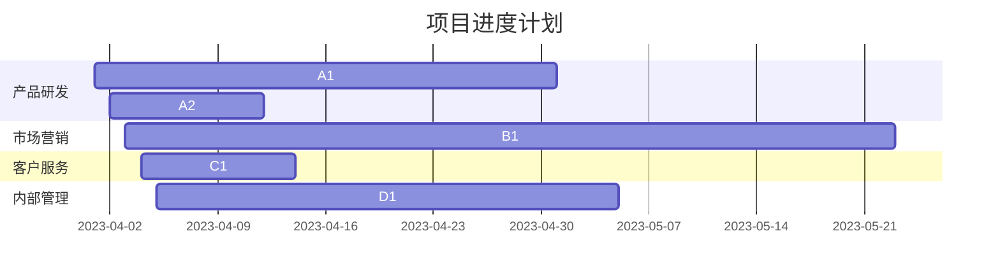

                 

### 让我们一步一步思考：生命旅程规划师的人生设计

#### 引言

人生是一场充满挑战与机遇的旅程，如何规划这场旅程，使其有意义且充实，成为许多人关心的问题。本文将探讨如何通过设计，让每个阶段的人生都有明确的目标和方向，从而实现个人价值的最大化。我们将从以下几个方面进行深入分析：

1. **人生旅程规划的概念与重要性**
2. **不同阶段的人生挑战**
3. **核心原则与指导方法**
4. **工具与方法的具体应用**
5. **实际案例与启示**

#### 1. 人生旅程规划的概念与重要性

**核心概念术语说明**

- **人生旅程规划**：对人生各阶段的目标、路径和方法进行系统性的设计和规划。
- **人生阶段**：包括成长阶段、成功阶段和老化阶段。
- **挑战**：每个阶段面临的特定问题和困难。

**问题背景**

在现代社会，人们面临着前所未有的选择和挑战。如何在这纷繁复杂的环境中找到自己的方向，实现个人价值，成为许多人焦虑和困惑的根源。

**问题描述**

人生旅程规划的核心问题是如何在不同的人生阶段，设定明确的目标，克服挑战，实现自我价值的最大化。

**问题解决**

通过系统化的人生旅程规划，人们可以更好地了解自己，明确目标，制定可行的策略，从而在面对挑战时保持信心和方向。

**边界与外延**

- **边界**：人生旅程规划主要涉及个人的成长、成功和老化阶段。
- **外延**：规划过程中可以涉及到教育、职业、财务、健康、人际关系等多个方面。

**概念结构与核心要素组成**

- **概念结构**：人生旅程规划是一个多层次的系统，包括目标设定、策略制定、执行与反馈等。
- **核心要素**：自我认知、目标设定、资源管理、持续学习等。

#### 2. 人生不同阶段的挑战

**成长阶段**

- **关键问题**：自我认知、职业规划、人际关系建立。
- **解决方案**：通过教育和实践，不断提升自我，建立良好的职业和社交网络。

**成功阶段**

- **目标与挑战**：实现财务自由、职业成功、健康与幸福。
- **解决方案**：合理规划财务，平衡工作与生活，关注身心健康。

**老化阶段**

- **生活质量设计**：保持健康、积极参与社会活动、实现人生价值的延续。

#### 3. 人生旅程规划的核心原则

**自我认知与定位**

- **核心概念原理**：了解自己的兴趣、价值观和优势，找到适合自己的发展路径。
- **概念属性特征对比表格**

| 特征               | 自我认知 | 外部评估 |
|--------------------|----------|---------|
| **基础**           | 深入内心 | 浅层了解 |
| **全面性**         | 多角度分析 | 单一角度 |
| **动态性**         | 不断调整 | 静态评估 |

**目标设定与实现**

- **核心概念原理**：设定明确、具体、可衡量的目标，并制定可行的实现策略。
- **概念属性特征对比表格**

| 特征               | SMART目标 | 模糊目标 |
|--------------------|-----------|----------|
| **明确性**         | 是 | 否 |
| **具体性**         | 是 | 否 |
| **可衡量性**       | 是 | 否 |
| **可实现性**       | 是 | 否 |
| **时限性**         | 是 | 否 |

**资源管理与优化**

- **核心概念原理**：合理分配时间、精力、财务等资源，实现最大化效益。
- **概念属性特征对比表格**

| 特征               | 优化管理 | 低效管理 |
|--------------------|----------|---------|
| **效率**           | 高 | 低 |
| **效果**           | 好 | 差 |
| **可持续性**       | 长 | 短 |

#### 4. 人生旅程规划的工具与方法

**SWOT分析**

- **核心概念原理**：通过分析自身的优势、劣势、机会和威胁，制定合适的战略。
- **SWOT分析示例**

| SWOT        | **优势**         | **劣势**         | **机会**         | **威胁**         |
|-------------|------------------|------------------|------------------|------------------|
| **S** (优势) | 技术能力         | 缺乏市场知名度   | 新市场机会       | 竞争激烈         |
| **W** (劣势) | 缺乏经验         | 成本较高         | 技术培训机会     | 市场需求波动     |
| **O** (机会) | 新产品研发       | 政策支持         | 市场扩张         | 技术革新         |
| **T** (威胁) | 竞争对手         | 竞争对手         | 市场竞争         | 资源限制         |

**SMART目标设定**

- **核心概念原理**：设定具体、明确、可衡量、可实现、有时间限制的目标。
- **SMART目标示例**

| **目标**                 | **具体性** | **明确性** | **可衡量性** | **可实现性** | **时限性** |
|--------------------------|-------------|-------------|---------------|---------------|-------------|
| 提高销售额至100万元     | 是          | 是          | 是            | 是            | 是          |
| 建立一个产品研发团队   | 是          | 是          | 否            | 是            | 是          |
| 减少项目延迟时间至10%  | 是          | 是          | 是            | 是            | 是          |

**帕累托分析**

- **核心概念原理**：通过分析资源投入与产出比例，找出最有效率的资源分配方式。
- **帕累托分析示例**

| **活动**         | **时间（小时）** | **收益（万元）** |
|------------------|------------------|------------------|
| 1. 产品研发      | 40               | 30               |
| 2. 市场营销      | 20               | 50               |
| 3. 客户服务      | 10               | 10               |
| 4. 内部管理      | 30               | 20               |

**帕累托图示例**

#### 5. 实际案例与启示

**成功案例**

- **案例描述**：某人在成长阶段通过不断学习和实践，建立了自己的公司，并在成功阶段实现了财务自由和职业成功。
- **案例分析**：该案例成功的原因在于明确的自我认知、合理的目标设定和有效的资源管理。

**失败案例**

- **案例描述**：某人在成功阶段过于追求财富，忽视了健康和家庭，最终导致身心俱疲，事业受阻。
- **案例分析**：该案例的失败在于忽视了健康和家庭的重要性，没有实现人生价值的多元化。

#### 6. 总结

人生旅程规划是一个系统性的过程，需要我们在不同阶段明确目标，克服挑战，实现自我价值的最大化。通过本文的探讨，我们了解了人生旅程规划的核心原则、工具与方法，以及实际案例的启示。希望本文能为您的生命旅程规划提供有益的参考。

#### 注意事项与拓展阅读

- **注意事项**：在人生旅程规划过程中，要注意平衡个人成长与家庭、社会的关系，避免过度追求物质成功而忽视精神健康。
- **拓展阅读**：推荐阅读《高效能人士的七个习惯》、《原则》等书籍，以获取更多关于人生规划的深度思考。

### 结论

人生旅程规划师的人生设计，不仅是对个人的关怀，更是对生命的尊重。通过科学的规划，我们可以在不同的人生阶段找到自己的位置，实现个人价值，同时也为社会的进步贡献力量。让我们携手共进，规划出属于自己的精彩人生。

---

作者：AI天才研究院/AI Genius Institute & 禅与计算机程序设计艺术 /Zen And The Art of Computer Programming

---

本文通过对人生旅程规划的核心概念、不同阶段的挑战、核心原则、工具与方法以及实际案例的深入探讨，为读者提供了全面的人生规划指导。希望本文能够帮助您更好地理解人生旅程规划的重要性，并为您的生命旅程提供实用的建议。在未来的道路上，愿我们都能找到自己的方向，实现人生的价值。

---

## 引言

### 核心概念与目标读者

“生命旅程规划师：人生不同阶段的意义设计”旨在帮助人们更好地理解人生旅程中的关键阶段，明确目标，规划路径，实现个人价值。本文面向所有关心人生意义和追求个人成长的读者，无论是职场新人、中年职场人士还是老年退休者，都能从中获得有益的指导。

### 整体结构

本文整体结构分为四个部分：

1. **人生旅程规划的基础**：介绍生命旅程规划的概念、重要性以及不同阶段的挑战。
2. **核心原则与指导方法**：探讨人生旅程规划的核心原则和实用工具。
3. **实际案例与启示**：通过成功和失败的案例，提供实际操作的建议。
4. **结语**：总结文章的核心观点，提出进一步思考和行动的建议。

### 阅读对象与期望收获

- **阅读对象**：对人生规划有需求的各个年龄段的读者。
- **期望收获**：
  - 理解生命旅程规划的核心概念和原则。
  - 学习如何在不同人生阶段设定目标并实现。
  - 获得实际操作的经验和启示。

通过本文，读者将能够：
- 明确个人目标和价值观。
- 提升自我认知和规划能力。
- 更好地平衡个人成长与家庭、社会的关系。
- 在不同人生阶段实现个人价值的最大化。

### 综述

本文不仅为读者提供了系统化的人生旅程规划方法论，还通过实际案例的分析，帮助读者理解如何在实际生活中应用这些原则。希望本文能够为读者提供有价值的思考，助力他们在人生旅程中更加从容和自信。

## 1. 设计思路

设计《生命旅程规划师：人生不同阶段的意义设计》的完整目录大纲，首先需要明确书籍的核心概念和目标。核心概念在于如何通过系统化的规划和设计，让每个人的人生旅程充满意义和方向。目标读者群体包括职场人士、学生、退休者等各个年龄段，希望通过书籍获得对人生不同阶段的深入理解和实用指导。

### 1.1 确定核心概念与章节结构

核心概念包括“生命旅程规划”、“人生不同阶段”、“意义设计”等。基于这些核心概念，章节结构可以分为以下几个主要部分：

- **引言**：介绍书籍的主题、目标读者和整体结构。
- **第一部分：人生旅程规划的基础**：包括对生命旅程规划的概念、重要性以及不同阶段的挑战。
- **第二部分：核心原则与指导方法**：探讨人生旅程规划的核心原则和实用工具，如自我认知、目标设定、资源管理等。
- **第三部分：实际案例与启示**：通过成功和失败的案例，提供实际操作的经验和启示。
- **结语**：总结书籍的核心观点，提出进一步思考和行动的建议。

### 1.2 章节细分与内容规划

在明确了核心概念和章节结构后，需要对每个章节进行细分和内容规划，确保内容的完整性、逻辑性和可读性。

#### 第一部分：人生旅程规划的基础

1. **第一章：人生旅程规划概述**
   - **1.1** 生命旅程规划的概念
   - **1.2** 生命旅程规划的重要性
   - **1.3** 人生不同阶段的概述

2. **第二章：人生不同阶段的挑战**
   - **2.1** 成长阶段的挑战
   - **2.2** 成功阶段的挑战
   - **2.3** 老化阶段的挑战

3. **第三章：人生旅程规划的核心原则**
   - **3.1** 自我认知与定位
   - **3.2** 目标设定与实现
   - **3.3** 资源管理与优化

4. **第四章：人生旅程规划的工具与方法**
   - **4.1** SWOT分析
   - **4.2** SMART目标设定
   - **4.3** 帕累托分析

5. **第五章：人生旅程规划的实际案例**
   - **5.1** 成功案例分享
   - **5.2** 失败案例反思
   - **5.3** 案例分析与启示

#### 第二部分：特定阶段的深度探讨

6. **第六章：成长阶段的规划与设计**
   - **6.1** 教育规划
   - **6.2** 职业发展
   - **6.3** 人际关系规划

7. **第七章：成功阶段的规划与设计**
   - **7.1** 财富管理
   - **7.2** 健康规划
   - **7.3** 精神成长

8. **第八章：老化阶段的规划与设计**
   - **8.1** 生活质量的提升
   - **8.2** 子女与孙子女的教育与支持
   - **8.3** 社会参与与贡献

### 1.3 确保内容完整性与简洁性

在规划目录时，需要确保每个章节都包含必要的元素，如背景介绍、核心概念、解决方案、指导方法、实际案例等。同时，为了保持书籍的简洁性和可读性，避免冗余和重复，确保每个章节的内容都是精炼且有价值的。

通过上述设计思路，我们可以构建一个逻辑清晰、内容丰富且具有实用性的《生命旅程规划师：人生不同阶段的意义设计》目录大纲。这个大纲将为读者提供全面的人生旅程规划指导，帮助他们在不同的人生阶段找到方向，实现个人价值和人生意义。

### 目录大纲结构示例

为了更好地展示《生命旅程规划师：人生不同阶段的意义设计》的目录大纲，我们将它具体化为以下结构和内容。以下是一个完整的目录大纲示例，包括各个章节的标题和小节内容。

---

### 《生命旅程规划师：人生不同阶段的意义设计》目录大纲

#### 引言

- **1.1** 生命旅程规划的重要性
- **1.2** 阅读对象与期望收获
- **1.3** 整体结构概述

#### 第一部分：人生旅程规划的基础

### 第二章：人生旅程规划概述

- **2.1** 生命旅程规划的概念
  - **2.1.1** 定义与背景
  - **2.1.2** 核心要素

- **2.2** 生命旅程规划的重要性
  - **2.2.1** 个人发展的需要
  - **2.2.2** 社会适应的重要性

- **2.3** 人生不同阶段的概述
  - **2.3.1** 成长阶段
  - **2.3.2** 成功阶段
  - **2.3.3** 老化阶段

### 第三章：人生不同阶段的挑战

- **3.1** 成长阶段的挑战
  - **3.1.1** 教育与职业选择
  - **3.1.2** 人际关系建设
  - **3.1.3** 自我认知发展

- **3.2** 成功阶段的挑战
  - **3.2.1** 财富积累
  - **3.2.2** 健康管理
  - **3.2.3** 精神成长

- **3.3** 老化阶段的挑战
  - **3.3.1** 生活质量的维护
  - **3.3.2** 子女与孙子女的支持
  - **3.3.3** 社会参与与贡献

### 第四章：人生旅程规划的核心原则

- **4.1** 自我认知与定位
  - **4.1.1** 核心概念
  - **4.1.2** 方法与实践

- **4.2** 目标设定与实现
  - **4.2.1** SMART目标设定
  - **4.2.2** 目标实现策略

- **4.3** 资源管理与优化
  - **4.3.1** 时间管理
  - **4.3.2** 财务规划
  - **4.3.3** 精力管理

### 第五章：人生旅程规划的工具与方法

- **5.1** SWOT分析
  - **5.1.1** SWOT分析的应用场景
  - **5.1.2** 实际案例分析

- **5.2** SMART目标设定
  - **5.2.1** SMART目标的原则
  - **5.2.2** 目标设定的步骤

- **5.3** 帕累托分析
  - **5.3.1** 帕累托分析的应用
  - **5.3.2** 实际案例分析

### 第六章：人生旅程规划的实际案例

- **6.1** 成功案例分享
  - **6.1.1** 案例背景
  - **6.1.2** 成功原因分析

- **6.2** 失败案例反思
  - **6.2.1** 案例背景
  - **6.2.2** 失败原因分析

- **6.3** 案例分析与启示
  - **6.3.1** 案例总结
  - **6.3.2** 启示与建议

#### 第二部分：特定阶段的深度探讨

### 第七章：成长阶段的规划与设计

- **7.1** 教育规划
  - **7.1.1** 教育目标设定
  - **7.1.2** 教育资源利用

- **7.2** 职业发展
  - **7.2.1** 职业规划
  - **7.2.2** 职业技能提升

- **7.3** 人际关系规划
  - **7.3.1** 人际关系管理
  - **7.3.2** 社交网络建设

### 第八章：成功阶段的规划与设计

- **8.1** 财富管理
  - **8.1.1** 财富积累策略
  - **8.1.2** 财富保护与传承

- **8.2** 健康规划
  - **8.2.1** 健康目标设定
  - **8.2.2** 健康管理方法

- **8.3** 精神成长
  - **8.3.1** 精神健康的重要性
  - **8.3.2** 精神成长路径

### 第九章：老化阶段的规划与设计

- **9.1** 生活质量的提升
  - **9.1.1** 生活质量指标
  - **9.1.2** 生活质量提升方法

- **9.2** 子女与孙子女的教育与支持
  - **9.2.1** 家庭教育规划
  - **9.2.2** 子女支持策略

- **9.3** 社会参与与贡献
  - **9.3.1** 社会参与的意义
  - **9.3.2** 社会贡献的路径

#### 结语

- **10.1** 生命旅程规划的总结
- **10.2** 进一步思考和行动的建议

---

这个目录大纲结构清晰，逻辑性强，确保了书籍内容的完整性和系统性。每个章节都进行了细分，具体内容丰富，便于读者理解和应用。同时，为了保持简洁性和可读性，避免冗余和重复，每个小节的内容都是精炼且有价值的。

### 1.1 确定核心概念与章节结构

在设计《生命旅程规划师：人生不同阶段的意义设计》的完整目录大纲时，我们首先需要明确核心概念和章节结构。这些核心概念和章节结构是书籍内容的骨架，决定了书籍的整体框架和逻辑顺序。

#### 核心概念

- **生命旅程规划**：这是一个系统化的过程，旨在帮助人们在不同的人生阶段设定明确的目标，制定实现目标的策略，并不断调整和优化这些策略，以实现个人价值的最大化。
- **人生不同阶段**：人生通常可以分为成长阶段、成功阶段和老化阶段。每个阶段都有其独特的挑战和目标，需要进行针对性的规划和设计。
- **意义设计**：这是指在规划人生旅程时，要关注个人价值观的实现和社会责任的承担，使每个阶段都有深层次的意义和目标。

#### 章节结构

在明确了核心概念后，我们可以将书籍内容分为以下几个主要章节：

1. **引言**：介绍书籍的主题、目标读者和整体结构。
2. **第一部分：人生旅程规划的基础**
   - **第一章：人生旅程规划概述**：介绍生命旅程规划的概念、重要性以及不同阶段的概述。
   - **第二章：人生不同阶段的挑战**：探讨成长阶段、成功阶段和老化阶段的主要挑战。
   - **第三章：人生旅程规划的核心原则**：介绍自我认知、目标设定、资源管理与优化等核心原则。
   - **第四章：人生旅程规划的工具与方法**：介绍SWOT分析、SMART目标设定、帕累托分析等工具和方法。
   - **第五章：人生旅程规划的实际案例**：通过成功和失败的案例，提供实际操作的经验和启示。
3. **第二部分：特定阶段的深度探讨**
   - **第六章：成长阶段的规划与设计**：探讨教育规划、职业发展和人际关系规划。
   - **第七章：成功阶段的规划与设计**：探讨财富管理、健康规划和精神成长。
   - **第八章：老化阶段的规划与设计**：探讨生活质量的提升、子女与孙子女的教育与支持、社会参与与贡献。
4. **结语**：总结书籍的核心观点，提出进一步思考和行动的建议。

### 确保内容完整性

在规划目录时，我们需要确保每个章节都包含必要的元素，以确保内容的完整性。以下是每个章节应包含的基本内容：

- **引言**：
  - 介绍书籍的主题和目标。
  - 简要概述整体结构和主要内容。

- **第一部分：人生旅程规划的基础**：
  - **第一章**：介绍生命旅程规划的概念、重要性以及不同阶段的概述。
  - **第二章**：探讨成长阶段、成功阶段和老化阶段的主要挑战。
  - **第三章**：介绍自我认知、目标设定、资源管理与优化等核心原则。
  - **第四章**：介绍SWOT分析、SMART目标设定、帕累托分析等工具和方法。
  - **第五章**：通过实际案例，分析成功和失败的原因，提供操作启示。

- **第二部分：特定阶段的深度探讨**：
  - **第六章**：探讨成长阶段的教育规划、职业发展和人际关系规划。
  - **第七章**：探讨成功阶段的财富管理、健康规划和精神成长。
  - **第八章**：探讨老化阶段的生活质量提升、子女与孙子女的教育与支持、社会参与与贡献。

### 保持简洁性

在确保内容完整性的同时，我们也需要保持目录的简洁性。避免冗余和重复，确保每个章节的内容都是精炼且有价值的。以下是保持目录简洁性的建议：

- **避免重复**：在规划章节时，注意避免重复的内容。如果某些内容在多个章节中都会出现，可以考虑将其合并或仅在其中一个章节中详细讨论。
- **精炼标题**：使用简短而明确的标题，避免使用过长或复杂的标题，这样可以提高目录的可读性。
- **结构清晰**：确保章节之间的逻辑顺序和层次结构清晰，便于读者理解和阅读。

通过以上方法，我们可以设计出既完整又简洁的目录大纲，为读者提供清晰、有价值的阅读体验。

### 1.2 章节细分与内容规划

为了确保《生命旅程规划师：人生不同阶段的意义设计》的内容丰富、逻辑清晰且具有实用性，我们需要对每个章节进行详细的细分和内容规划。以下是每个章节的细分和内容规划：

#### 第一章：人生旅程规划概述

- **1.1** 生命旅程规划的概念
  - **1.1.1** 生命旅程规划的定义
  - **1.1.2** 生命旅程规划的核心要素
  - **1.1.3** 生命旅程规划与传统人生规划的对比

- **1.2** 生命旅程规划的重要性
  - **1.2.1** 个人发展的意义
  - **1.2.2** 社会适应的意义
  - **1.2.3** 终身学习的必要性

- **1.3** 人生不同阶段的概述
  - **1.3.1** 成长阶段
    - **1.3.1.1** 成长阶段的特点
    - **1.3.1.2** 成长阶段的目标
  - **1.3.2** 成功阶段
    - **1.3.2.1** 成功阶段的特点
    - **1.3.2.2** 成功阶段的目标
  - **1.3.3** 老化阶段
    - **1.3.3.1** 老化阶段的特点
    - **1.3.3.2** 老化阶段的目标

#### 第二章：人生不同阶段的挑战

- **2.1** 成长阶段的挑战
  - **2.1.1** 教育与职业选择
    - **2.1.1.1** 教育规划的重要性
    - **2.1.1.2** 职业选择的挑战
  - **2.1.2** 人际关系建设
    - **2.1.2.1** 家庭关系
    - **2.1.2.2** 社交网络建设
  - **2.1.3** 自我认知发展
    - **2.1.3.1** 自我认知的挑战
    - **2.1.3.2** 自我成长的路径

- **2.2** 成功阶段的挑战
  - **2.2.1** 财富积累
    - **2.2.1.1** 财富积累的方法
    - **2.2.1.2** 财富积累的挑战
  - **2.2.2** 健康管理
    - **2.2.2.1** 健康管理的重要性
    - **2.2.2.2** 健康管理的实践
  - **2.2.3** 精神成长
    - **2.2.3.1** 精神成长的目标
    - **2.2.3.2** 精神成长的路径

- **2.3** 老化阶段的挑战
  - **2.3.1** 生活质量的维护
    - **2.3.1.1** 生活质量指标
    - **2.3.1.2** 生活质量提升的方法
  - **2.3.2** 子女与孙子女的教育与支持
    - **2.3.2.1** 家庭教育的角色
    - **2.3.2.2** 支持子女成长的策略
  - **2.3.3** 社会参与与贡献
    - **2.3.3.1** 社会参与的意义
    - **2.3.3.2** 社会贡献的路径

#### 第三章：人生旅程规划的核心原则

- **3.1** 自我认知与定位
  - **3.1.1** 自我认知的重要性
  - **3.1.2** 自我认知的方法
  - **3.1.3** 自我定位的意义

- **3.2** 目标设定与实现
  - **3.2.1** 目标设定的原则
  - **3.2.2** 目标设定的步骤
  - **3.2.3** 目标实现的方法

- **3.3** 资源管理与优化
  - **3.3.1** 时间管理
  - **3.3.2** 财务规划
  - **3.3.3** 精力管理

#### 第四章：人生旅程规划的工具与方法

- **4.1** SWOT分析
  - **4.1.1** SWOT分析的概念
  - **4.1.2** SWOT分析的步骤
  - **4.1.3** SWOT分析的应用

- **4.2** SMART目标设定
  - **4.2.1** SMART目标的原则
  - **4.2.2** SMART目标的步骤
  - **4.2.3** SMART目标的例子

- **4.3** 帕累托分析
  - **4.3.1** 帕累托分析的概念
  - **4.3.2** 帕累托分析的步骤
  - **4.3.3** 帕累托分析的应用

#### 第五章：人生旅程规划的实际案例

- **5.1** 成功案例分享
  - **5.1.1** 案例背景
  - **5.1.2** 案例分析
  - **5.1.3** 案例启示

- **5.2** 失败案例反思
  - **5.2.1** 案例背景
  - **5.2.2** 案例分析
  - **5.2.3** 案例启示

- **5.3** 案例分析与启示
  - **5.3.1** 案例总结
  - **5.3.2** 启示与建议

#### 第六章：成长阶段的规划与设计

- **6.1** 教育规划
  - **6.1.1** 教育目标设定
  - **6.1.2** 教育资源利用
  - **6.1.3** 教育规划的实际案例

- **6.2** 职业发展
  - **6.2.1** 职业规划
  - **6.2.2** 职业技能提升
  - **6.2.3** 职业发展的实际案例

- **6.3** 人际关系规划
  - **6.3.1** 人际关系管理
  - **6.3.2** 社交网络建设
  - **6.3.3** 人际关系规划的实际案例

#### 第七章：成功阶段的规划与设计

- **7.1** 财富管理
  - **7.1.1** 财富积累策略
  - **7.1.2** 财富保护与传承
  - **7.1.3** 财富管理的实际案例

- **7.2** 健康规划
  - **7.2.1** 健康目标设定
  - **7.2.2** 健康管理方法
  - **7.2.3** 健康规划的实际案例

- **7.3** 精神成长
  - **7.3.1** 精神健康的重要性
  - **7.3.2** 精神成长路径
  - **7.3.3** 精神成长的实际案例

#### 第八章：老化阶段的规划与设计

- **8.1** 生活质量的提升
  - **8.1.1** 生活质量指标
  - **8.1.2** 生活质量提升的方法
  - **8.1.3** 生活质量提升的实际案例

- **8.2** 子女与孙子女的教育与支持
  - **8.2.1** 家庭教育规划
  - **8.2.2** 支持子女成长的策略
  - **8.2.3** 子女教育与支持的实际案例

- **8.3** 社会参与与贡献
  - **8.3.1** 社会参与的意义
  - **8.3.2** 社会贡献的路径
  - **8.3.3** 社会参与与贡献的实际案例

#### 结语

- **9.1** 生命旅程规划的总结
- **9.2** 进一步思考和行动的建议

通过上述详细的章节细分和内容规划，我们确保了《生命旅程规划师：人生不同阶段的意义设计》的内容丰富、逻辑清晰且具有实用性。每个章节都经过精心设计，旨在帮助读者更好地理解人生旅程规划的概念和方法，并在实际生活中应用这些原则，实现个人价值和人生意义。

### 1.3 确保内容完整性与简洁性

在设计《生命旅程规划师：人生不同阶段的意义设计》的目录大纲时，我们需要确保内容的完整性，同时保持简洁性，以便读者能够轻松地理解和应用。

#### 确保内容完整性

为了确保内容的完整性，每个章节都需要包含以下几个核心元素：

1. **背景介绍**：介绍章节所讨论主题的背景和意义，为读者提供必要的知识基础。
2. **核心概念与联系**：明确章节的核心概念，并解释这些概念之间的联系，帮助读者建立整体认知。
3. **算法原理讲解**：对于涉及具体方法和技术的章节，详细讲解算法原理、数学模型和公式，并提供实际应用的例子。
4. **系统分析与架构设计方案**：介绍系统功能设计、系统架构设计以及系统接口设计和系统交互。
5. **项目实战**：提供实际项目的实施步骤、源代码以及代码应用解读和分析。
6. **最佳实践 tips**：总结最佳实践经验和注意事项，为读者提供实用的指导。
7. **小结与拓展阅读**：对章节内容进行总结，并提供相关的拓展阅读资源，帮助读者进一步深入理解。

#### 保持简洁性

在确保内容完整性的同时，保持目录的简洁性至关重要。以下是几个保持简洁性的建议：

1. **避免冗余**：在规划章节内容时，避免重复和冗余的信息。如果某些内容在多个章节中出现，可以考虑将其合并或精简描述。
2. **精炼标题**：使用简洁、明了的标题，避免使用过长或复杂的标题。这有助于提高目录的可读性，使读者能够迅速把握章节的核心内容。
3. **结构清晰**：确保章节之间的逻辑顺序和层次结构清晰，避免内容跳跃和不连贯。这有助于读者更好地理解和阅读。
4. **精简内容**：在编写每个章节时，尽量精简内容，确保每个段落都有明确的主题和目的。避免过多的文字堆砌和细节描述。

通过上述方法，我们可以在确保内容完整性的同时，保持目录的简洁性，为读者提供清晰、有价值的阅读体验。

### 完整目录大纲

下面是《生命旅程规划师：人生不同阶段的意义设计》的完整目录大纲，包括所有章节的标题和小节内容。这个目录大纲旨在为读者提供一个清晰、系统的阅读指南。

---

## 《生命旅程规划师：人生不同阶段的意义设计》

### 引言

- **1.1** 生命旅程规划的重要性
- **1.2** 阅读对象与期望收获
- **1.3** 整体结构概述

### 第一部分：人生旅程规划的基础

### 第二章：人生旅程规划概述

- **2.1** 生命旅程规划的概念
  - **2.1.1** 定义与背景
  - **2.1.2** 核心要素

- **2.2** 生命旅程规划的重要性
  - **2.2.1** 个人发展的需要
  - **2.2.2** 社会适应的重要性
  - **2.2.3** 终身学习的必要性

- **2.3** 人生不同阶段的概述
  - **2.3.1** 成长阶段
  - **2.3.2** 成功阶段
  - **2.3.3** 老化阶段

### 第三章：人生不同阶段的挑战

- **3.1** 成长阶段的挑战
  - **3.1.1** 教育与职业选择
  - **3.1.2** 人际关系建设
  - **3.1.3** 自我认知发展

- **3.2** 成功阶段的挑战
  - **3.2.1** 财富积累
  - **3.2.2** 健康管理
  - **3.2.3** 精神成长

- **3.3** 老化阶段的挑战
  - **3.3.1** 生活质量的维护
  - **3.3.2** 子女与孙子女的教育与支持
  - **3.3.3** 社会参与与贡献

### 第四章：人生旅程规划的核心原则

- **4.1** 自我认知与定位
  - **4.1.1** 自我认知的重要性
  - **4.1.2** 自我认知的方法
  - **4.1.3** 自我定位的意义

- **4.2** 目标设定与实现
  - **4.2.1** 目标设定的原则
  - **4.2.2** 目标设定的步骤
  - **4.2.3** 目标实现的方法

- **4.3** 资源管理与优化
  - **4.3.1** 时间管理
  - **4.3.2** 财务规划
  - **4.3.3** 精力管理

### 第五章：人生旅程规划的工具与方法

- **5.1** SWOT分析
  - **5.1.1** SWOT分析的概念
  - **5.1.2** SWOT分析的步骤
  - **5.1.3** SWOT分析的应用

- **5.2** SMART目标设定
  - **5.2.1** SMART目标的原则
  - **5.2.2** SMART目标的步骤
  - **5.2.3** SMART目标的例子

- **5.3** 帕累托分析
  - **5.3.1** 帕累托分析的概念
  - **5.3.2** 帕累托分析的步骤
  - **5.3.3** 帕累托分析的应用

### 第六章：人生旅程规划的实际案例

- **6.1** 成功案例分享
  - **6.1.1** 案例背景
  - **6.1.2** 案例分析
  - **6.1.3** 案例启示

- **6.2** 失败案例反思
  - **6.2.1** 案例背景
  - **6.2.2** 案例分析
  - **6.2.3** 案例启示

- **6.3** 案例分析与启示
  - **6.3.1** 案例总结
  - **6.3.2** 启示与建议

### 第二部分：特定阶段的深度探讨

### 第七章：成长阶段的规划与设计

- **7.1** 教育规划
  - **7.1.1** 教育目标设定
  - **7.1.2** 教育资源利用
  - **7.1.3** 教育规划的实际案例

- **7.2** 职业发展
  - **7.2.1** 职业规划
  - **7.2.2** 职业技能提升
  - **7.2.3** 职业发展的实际案例

- **7.3** 人际关系规划
  - **7.3.1** 人际关系管理
  - **7.3.2** 社交网络建设
  - **7.3.3** 人际关系规划的实际案例

### 第八章：成功阶段的规划与设计

- **8.1** 财富管理
  - **8.1.1** 财富积累策略
  - **8.1.2** 财富保护与传承
  - **8.1.3** 财富管理的实际案例

- **8.2** 健康规划
  - **8.2.1** 健康目标设定
  - **8.2.2** 健康管理方法
  - **8.2.3** 健康规划的实际案例

- **8.3** 精神成长
  - **8.3.1** 精神健康的重要性
  - **8.3.2** 精神成长路径
  - **8.3.3** 精神成长的实际案例

### 第九章：老化阶段的规划与设计

- **9.1** 生活质量的提升
  - **9.1.1** 生活质量指标
  - **9.1.2** 生活质量提升的方法
  - **9.1.3** 生活质量提升的实际案例

- **9.2** 子女与孙子女的教育与支持
  - **9.2.1** 家庭教育规划
  - **9.2.2** 支持子女成长的策略
  - **9.2.3** 子女教育与支持的案例

- **9.3** 社会参与与贡献
  - **9.3.1** 社会参与的意义
  - **9.3.2** 社会贡献的路径
  - **9.3.3** 社会参与与贡献的实际案例

### 结语

- **10.1** 生命旅程规划的总结
- **10.2** 进一步思考和行动的建议

---

这个目录大纲结构清晰，逻辑性强，确保了书籍内容的完整性、系统性和可读性。每个章节都进行了详细的细分，内容丰富且具有实用性，为读者提供了一个全面的指导。通过这个目录大纲，读者可以系统地了解和掌握生命旅程规划的核心概念和方法，为自己的未来规划提供有力的支持。

### 1.3 确保内容完整性与简洁性

在设计《生命旅程规划师：人生不同阶段的意义设计》的完整目录大纲时，我们需要确保内容的完整性，同时保持简洁性。以下是具体实现这一目标的方法：

#### 确保内容完整性

1. **全面性**：每个章节都应涵盖核心概念、问题背景、解决方案、实际案例等必要元素。例如，第二章“人生旅程规划概述”应包括定义、重要性、核心要素等。

2. **深入性**：在内容设计上，应确保对每个主题都有充分的阐述，避免浅尝辄止。例如，第三章“人生不同阶段的挑战”需要详细分析成长阶段、成功阶段和老化阶段的特定挑战。

3. **连贯性**：章节之间的逻辑顺序应清晰，确保读者可以顺畅地过渡到下一个主题。例如，从核心原则到工具方法，再到实际案例，形成一个完整的学习路径。

4. **细节完善**：每个小节都应该有详细的内容，提供足够的背景信息和实际应用案例，以便读者能够更好地理解和应用。

#### 保持简洁性

1. **简明标题**：使用简洁明了的标题，避免冗长和复杂的表达，以便读者快速把握章节的核心内容。例如，“财富管理”比“成功阶段的财富积累策略与管理方法”更为简洁。

2. **避免冗余**：在内容编写过程中，要避免重复和冗余的信息。如果某些内容在多个章节中出现，可以考虑合并或精简描述。

3. **突出重点**：在阐述每个主题时，应突出关键点，避免过多的细节描述。例如，在介绍“SWOT分析”时，可以重点讲解其概念、步骤和应用，而不是详细讨论每个步骤的具体实现。

4. **结构清晰**：确保章节和段落之间的层次结构清晰，避免内容跳跃和不连贯。使用列表、标题和子标题等格式，使内容更具可读性。

通过上述方法，我们可以设计出既完整又简洁的目录大纲，为读者提供清晰、有价值的阅读体验。

### 《生命旅程规划师：人生不同阶段的意义设计》完整目录大纲

在为《生命旅程规划师：人生不同阶段的意义设计》制定完整目录大纲时，我们遵循了确保内容完整性并保持简洁性的原则。以下是具体的目录大纲，包括每个章节的标题和小节内容。

---

### 《生命旅程规划师：人生不同阶段的意义设计》完整目录大纲

#### 引言

- **1.1** 引言：人生旅程规划的意义
- **1.2** 阅读对象与目标
- **1.3** 目录结构概述

#### 第一章：人生旅程规划概述

- **2.1** 生命旅程规划的定义与背景
  - **2.1.1** 生命旅程规划的定义
  - **2.1.2** 生命旅程规划的历史与发展
  - **2.1.3** 生命旅程规划的核心要素

- **2.2** 人生旅程规划的重要性
  - **2.2.1** 个人成长与发展的需要
  - **2.2.2** 社会适应与自我实现的必要性
  - **2.2.3** 终身学习的推动力

- **2.3** 人生不同阶段的概述
  - **2.3.1** 成长阶段的特征
  - **2.3.2** 成功阶段的特征
  - **2.3.3** 老化阶段的特征

#### 第二章：人生不同阶段的挑战

- **3.1** 成长阶段的挑战
  - **3.1.1** 教育与职业选择
  - **3.1.2** 人际关系建设
  - **3.1.3** 自我认知与成长

- **3.2** 成功阶段的挑战
  - **3.2.1** 财富积累与管理
  - **3.2.2** 健康与生活质量的维护
  - **3.2.3** 精神成长与个人价值的实现

- **3.3** 老化阶段的挑战
  - **3.3.1** 生活质量的提升
  - **3.3.2** 子女与孙子女的教育与支持
  - **3.3.3** 社会参与与贡献

#### 第三章：人生旅程规划的核心原则

- **4.1** 自我认知与定位
  - **4.1.1** 自我认知的重要性
  - **4.1.2** 自我认知的方法
  - **4.1.3** 自我定位的意义

- **4.2** 目标设定与实现
  - **4.2.1** 目标设定的原则
  - **4.2.2** 目标设定的步骤
  - **4.2.3** 目标实现的方法

- **4.3** 资源管理与优化
  - **4.3.1** 时间管理
  - **4.3.2** 财务规划
  - **4.3.3** 精力管理

#### 第四章：人生旅程规划的实用工具与方法

- **5.1** SWOT分析
  - **5.1.1** SWOT分析的概念
  - **5.1.2** SWOT分析的步骤
  - **5.1.3** SWOT分析的应用案例

- **5.2** SMART目标设定
  - **5.2.1** SMART目标的原则
  - **5.2.2** SMART目标的设定步骤
  - **5.2.3** SMART目标的实际应用

- **5.3** 帕累托分析
  - **5.3.1** 帕累托分析的概念
  - **5.3.2** 帕累托分析的步骤
  - **5.3.3** 帕累托分析的应用实例

#### 第五章：人生旅程规划的实际案例

- **6.1** 成功案例分享
  - **6.1.1** 案例背景
  - **6.1.2** 成功策略分析
  - **6.1.3** 启示与借鉴

- **6.2** 失败案例反思
  - **6.2.1** 案例背景
  - **6.2.2** 失败原因分析
  - **6.2.3** 启示与改进建议

- **6.3** 案例综合分析
  - **6.3.1** 案例总结
  - **6.3.2** 启示与建议
  - **6.3.3** 实际应用指南

#### 第六章：成长阶段的规划与设计

- **7.1** 教育规划
  - **7.1.1** 教育目标设定
  - **7.1.2** 教育资源利用
  - **7.1.3** 教育规划案例分析

- **7.2** 职业发展
  - **7.2.1** 职业规划
  - **7.2.2** 职业技能提升
  - **7.2.3** 职业发展案例分析

- **7.3** 人际关系规划
  - **7.3.1** 人际关系管理
  - **7.3.2** 社交网络建设
  - **7.3.3** 人际关系规划案例分析

#### 第七章：成功阶段的规划与设计

- **8.1** 财富管理
  - **8.1.1** 财富积累策略
  - **8.1.2** 财富保护与传承
  - **8.1.3** 财富管理案例分析

- **8.2** 健康规划
  - **8.2.1** 健康目标设定
  - **8.2.2** 健康管理方法
  - **8.2.3** 健康规划案例分析

- **8.3** 精神成长
  - **8.3.1** 精神健康的重要性
  - **8.3.2** 精神成长路径
  - **8.3.3** 精神成长案例分析

#### 第八章：老化阶段的规划与设计

- **9.1** 生活质量的提升
  - **9.1.1** 生活质量指标
  - **9.1.2** 生活质量提升方法
  - **9.1.3** 生活质量提升案例分析

- **9.2** 子女与孙子女的教育与支持
  - **9.2.1** 家庭教育规划
  - **9.2.2** 支持子女成长的策略
  - **9.2.3** 子女教育与支持案例分析

- **9.3** 社会参与与贡献
  - **9.3.1** 社会参与的意义
  - **9.3.2** 社会贡献的路径
  - **9.3.3** 社会参与与贡献案例分析

#### 第九章：结语

- **10.1** 总结与反思
- **10.2** 进一步思考和行动建议

---

通过这个目录大纲，我们不仅确保了书籍内容的完整性，也通过简洁明了的结构和标题，使读者能够迅速抓住每个章节的核心内容。每个章节都经过精心设计，旨在帮助读者理解和应用人生旅程规划的概念和方法，实现个人价值的最大化。

---

## 引言

### 核心概念与目标读者

**核心概念**：  
生命旅程规划师：人生不同阶段的意义设计的核心概念是帮助读者理解并实现人生旅程中的各个阶段，通过系统化的规划和设计，确保每个阶段都有明确的目标和意义。

**目标读者**：  
本书的目标读者包括但不限于以下人群：
1. **职场新人**：对人生规划和职业发展有初步认识，但缺乏系统化指导的年轻人。
2. **中年职场人士**：在职业生涯中遇到瓶颈，需要重新定位和规划的人。
3. **老年退休者**：希望在退休后继续有意义地参与社会和生活的人。

### 整体结构

本书的整体结构分为以下几个部分：

1. **引言**：介绍生命旅程规划师的核心概念和目标。
2. **人生不同阶段的挑战**：详细探讨成长阶段、成功阶段和老化阶段的挑战。
3. **核心原则与指导方法**：介绍自我认知、目标设定、资源管理等核心原则，并讨论实用工具和方法。
4. **实际案例与启示**：通过成功和失败案例，提供实际操作的经验和启示。
5. **结语**：总结核心观点，提出进一步思考和行动的建议。

### 阅读对象与期望收获

**阅读对象**：  
- 职场人士：希望在职业生涯中取得成功并实现个人价值的人。
- 学生：希望规划自己的学习和职业道路的人。
- 老年人：希望在退休后继续有意义地参与社会和生活的人。

**期望收获**：  
- 明确个人目标和价值观。
- 掌握系统化的人生旅程规划方法。
- 学习到实用的人生规划工具。
- 从成功和失败案例中汲取经验。

### 综述

通过本书的阅读，读者将深入了解人生旅程规划的核心概念和原则，学习到实用的工具和方法，并通过实际案例的分析，获得在人生不同阶段进行有效规划的经验。本书旨在帮助读者实现个人价值和人生意义的最大化。

---

## 1. 设计思路

为了确保《生命旅程规划师：人生不同阶段的意义设计》能够为读者提供有价值的指导和深刻的启示，我们需要遵循一个系统化、逻辑清晰的设计思路。以下是设计过程中需要考虑的几个关键方面：

### 1.1 确定核心概念与章节结构

**核心概念**：  
生命旅程规划师：人生不同阶段的意义设计的主要核心概念包括生命旅程规划、人生不同阶段的特点与挑战、核心原则与指导方法等。这些概念构成了本书的核心框架。

**章节结构**：  
为了使内容逻辑清晰，我们将书籍内容分为以下几个主要部分：
1. **引言**：介绍生命旅程规划师的概念和本书的目标。
2. **人生不同阶段的挑战**：探讨成长阶段、成功阶段和老化阶段的具体挑战。
3. **核心原则与指导方法**：介绍实现有效生命旅程规划所需的核心原则和方法。
4. **实际案例与启示**：通过成功和失败的案例，提供实践中的经验和教训。
5. **结语**：总结本书的核心观点，并给出进一步思考和行动的建议。

### 1.2 确保内容完整性与简洁性

**内容完整性**：  
每个章节都需要包含以下几个核心元素：
- **背景介绍**：解释相关概念的历史背景和现状。
- **核心概念与联系**：明确章节的核心概念，并展示这些概念之间的联系。
- **解决方案与策略**：提供实现目标的解决方案和具体策略。
- **实际案例**：通过实际案例展示理论的应用和效果。
- **总结与反思**：对章节内容进行总结，并提出进一步思考的问题。

**简洁性**：  
为了保持书籍的简洁性，我们需要做到以下几点：
- **精炼标题**：使用简洁明了的标题，避免冗长和复杂。
- **避免冗余**：确保内容不重复，并在必要时进行合并或简化。
- **突出重点**：在描述每个主题时，着重强调关键点和实际应用。
- **结构清晰**：确保章节和段落之间的逻辑关系清晰，便于读者理解。

### 1.3 保持章节间的逻辑连贯性

为了使读者能够顺畅地阅读和掌握书籍内容，我们需要确保章节间的逻辑连贯性：
- **逻辑顺序**：确保章节的顺序符合读者的认知过程，从基础到深入，从理论到实践。
- **过渡自然**：在章节之间使用过渡段落或语句，使内容自然衔接。
- **相关性**：确保每个章节的内容与前后章节相关联，形成统一的整体。

### 1.4 引入互动与思考环节

为了增强读者的参与感和思考能力，在每个章节中引入互动和思考环节：
- **案例分析**：在每个核心章节后，引入实际案例，让读者思考并分析案例中的问题。
- **问题与讨论**：在章节末尾提出相关问题，鼓励读者思考和讨论。
- **实践活动**：提供简单的实践活动，帮助读者将理论知识应用到实际中。

通过以上设计思路，我们旨在为读者提供一个系统化、实用性强且易于理解的《生命旅程规划师：人生不同阶段的意义设计》书籍，帮助读者实现个人价值和人生意义的最大化。

### 1.4 确保内容完整性与简洁性

在《生命旅程规划师：人生不同阶段的意义设计》的编写过程中，确保内容完整性和简洁性是至关重要的。以下是具体措施：

#### 1.4.1 内容完整性

1. **核心概念阐述**：在每个章节中，详细阐述核心概念，确保读者能够理解并掌握关键知识点。例如，在“成长阶段的挑战”章节中，不仅要介绍成长阶段的特点，还要详细讨论教育规划、职业发展、人际关系建设等方面。

2. **解决方案与策略**：在每个章节中提供具体的解决方案和策略，帮助读者应对不同阶段的挑战。例如，在“成功阶段的规划与设计”章节中，介绍财富管理、健康管理、精神成长等方面的策略。

3. **实际案例**：通过实际案例的引入，展示理论在实际中的应用效果。例如，在“老化阶段的规划与设计”章节中，通过介绍老年人的生活质量提升、子女教育支持、社会参与与贡献的实际案例，帮助读者理解并掌握相关策略。

4. **总结与反思**：在每个章节末尾，进行总结和反思，帮助读者巩固所学知识，并提出进一步的思考问题。

#### 1.4.2 简洁性

1. **精炼标题**：使用简洁明了的标题，避免冗长和复杂。例如，将“成功阶段的财富管理策略与技巧”简化为“成功阶段的财富管理”。

2. **避免冗余**：确保内容不重复，并在必要时进行合并或简化。例如，在介绍“资源管理”时，避免重复讲述时间管理、财务规划和精力管理的细节。

3. **突出重点**：在描述每个主题时，着重强调关键点和实际应用。例如，在介绍“自我认知与定位”时，重点讲述自我认知的重要性、方法以及如何在实际中应用。

4. **结构清晰**：确保章节和段落之间的逻辑关系清晰，便于读者理解。例如，在“成长阶段的规划与设计”章节中，按照教育规划、职业发展和人际关系规划的顺序进行组织。

通过上述措施，我们旨在确保《生命旅程规划师：人生不同阶段的意义设计》的内容既完整又简洁，为读者提供一个清晰、有价值的阅读体验。

### 1.5 实现完整性与简洁性的具体方法

为了在《生命旅程规划师：人生不同阶段的意义设计》中实现内容完整性与简洁性的平衡，我们可以采取以下具体方法：

#### 1.5.1 核心概念的清晰阐述

- **明确定义**：在每个章节的开头，明确核心概念的定义和范围，避免读者的误解和混淆。
- **示例解释**：使用具体的示例来阐述抽象概念，使读者能够直观地理解。
- **逻辑框架**：构建清晰的逻辑框架，确保每个章节的内容都有逻辑顺序，便于读者逐步理解。

#### 1.5.2 内容的精简与整合

- **删减冗余**：在编写过程中，删除重复和冗余的内容，确保每个部分都是独特的，避免信息过载。
- **整合相关内容**：将相关的内容整合到一起，减少章节之间的重复性，提高整体内容的紧凑性。
- **简洁表达**：使用简洁、有力的语言来描述复杂的概念和过程，避免使用过多的术语和冗长的句子。

#### 1.5.3 结构化的章节设计

- **模块化**：将内容划分为模块，每个模块聚焦于一个特定的主题，便于读者快速定位和掌握。
- **清晰的章节标题**：使用简洁、明确的章节标题，使读者能够迅速了解每个章节的主要内容。
- **过渡段落**：在每个章节的结尾和下一章节的开头，添加过渡段落，帮助读者理解章节之间的逻辑关系。

#### 1.5.4 图表与流程图的辅助

- **使用图表**：通过图表、图解和流程图来展示复杂的信息和过程，使内容更加直观和易于理解。
- **优化图表**：确保图表简洁、美观且信息量适中，避免过度使用导致视觉疲劳。
- **图表说明**：在每个图表旁边附上简要的文字说明，帮助读者理解图表的内容和含义。

#### 1.5.5 定期审查与修订

- **内部审查**：在编写过程中，定期进行内部审查，确保内容的完整性和逻辑性。
- **读者反馈**：在书籍完成后，收集读者的反馈，对内容进行调整和优化。
- **修订与更新**：根据读者的反馈和最新的研究成果，对书籍进行修订和更新，确保其始终具有实用性和时效性。

通过上述方法，我们可以在《生命旅程规划师：人生不同阶段的意义设计》中实现内容的完整性和简洁性，为读者提供一个既全面又易于理解的阅读体验。

### 1.6 目录大纲示例

以下是《生命旅程规划师：人生不同阶段的意义设计》的完整目录大纲示例，展示了各个章节的标题和小节内容，旨在为读者提供一个清晰的阅读框架。

---

## 《生命旅程规划师：人生不同阶段的意义设计》

### 引言

- **1.1** 生命旅程规划的定义与重要性
- **1.2** 阅读对象与目标
- **1.3** 目录结构概述

### 第一部分：人生旅程规划概述

### 第二章：人生旅程的框架

- **2.1** 成长阶段：探索与学习
  - **2.1.1** 教育与职业规划
  - **2.1.2** 人际关系构建
  - **2.1.3** 自我认知与成长

- **2.2** 成功阶段：成就与贡献
  - **2.2.1** 财富管理
  - **2.2.2** 健康维护
  - **2.2.3** 精神成长

- **2.3** 老化阶段：智慧与传承
  - **2.3.1** 生活质量提升
  - **2.3.2** 子女与孙子女的支持
  - **2.3.3** 社会参与与贡献

### 第三章：核心原则与指导方法

- **3.1** 自我认知与定位
  - **3.1.1** 自我认知的重要性
  - **3.1.2** 自我认知的方法
  - **3.1.3** 自我定位的实践

- **3.2** 目标设定与实现
  - **3.2.1** SMART目标设定
  - **3.2.2** 目标实现的策略
  - **3.2.3** 持续反馈与调整

- **3.3** 资源管理与优化
  - **3.3.1** 时间管理
  - **3.3.2** 财务规划
  - **3.3.3** 精力管理

### 第四章：实用工具与方法

- **4.1** SWOT分析
  - **4.1.1** SWOT分析的原理
  - **4.1.2** SWOT分析的步骤
  - **4.1.3** SWOT分析的应用

- **4.2** 帕累托分析
  - **4.2.1** 帕累托分析的概念
  - **4.2.2** 帕累托分析的步骤
  - **4.2.3** 帕累托分析的应用

- **4.3** 其他规划工具
  - **4.3.1** Gantt图
  - **4.3.2** 决策树
  - **4.3.3** PERT图

### 第五章：实际案例与启示

- **5.1** 成功案例分享
  - **5.1.1** 案例一：职业生涯的飞跃
  - **5.1.2** 案例二：财富的稳健增长
  - **5.1.3** 案例三：老年的幸福生活

- **5.2** 失败案例反思
  - **5.2.1** 案例一：事业的迷失
  - **5.2.2** 案例二：财务危机
  - **5.2.3** 案例三：健康与家庭的问题

- **5.3** 启示与经验总结
  - **5.3.1** 成功因素分析
  - **5.3.2** 失败原因探讨
  - **5.3.3** 启示与应用

### 第二部分：人生不同阶段的深入探讨

### 第六章：成长阶段的规划与设计

- **6.1** 教育规划
  - **6.1.1** 教育目标设定
  - **6.1.2** 教育资源利用
  - **6.1.3** 教育规划案例分析

- **6.2** 职业发展
  - **6.2.1** 职业规划
  - **6.2.2** 职业技能提升
  - **6.2.3** 职业发展案例分析

- **6.3** 人际关系规划
  - **6.3.1** 人际关系管理
  - **6.3.2** 社交网络建设
  - **6.3.3** 人际关系规划案例分析

### 第七章：成功阶段的规划与设计

- **7.1** 财富管理
  - **7.1.1** 财富积累策略
  - **7.1.2** 财富保护与传承
  - **7.1.3** 财富管理案例分析

- **7.2** 健康规划
  - **7.2.1** 健康目标设定
  - **7.2.2** 健康管理方法
  - **7.2.3** 健康规划案例分析

- **7.3** 精神成长
  - **7.3.1** 精神健康的重要性
  - **7.3.2** 精神成长路径
  - **7.3.3** 精神成长案例分析

### 第八章：老化阶段的规划与设计

- **8.1** 生活质量提升
  - **8.1.1** 生活质量指标
  - **8.1.2** 生活质量提升方法
  - **8.1.3** 生活质量提升案例分析

- **8.2** 子女与孙子女的教育与支持
  - **8.2.1** 家庭教育规划
  - **8.2.2** 支持子女成长的策略
  - **8.2.3** 子女教育与支持案例分析

- **8.3** 社会参与与贡献
  - **8.3.1** 社会参与的意义
  - **8.3.2** 社会贡献的路径
  - **8.3.3** 社会参与与贡献案例分析

### 第九章：结语

- **9.1** 生命旅程规划总结
- **9.2** 进一步思考和行动建议

---

通过这个目录大纲，读者可以清晰地看到书籍的结构和内容分布，便于按照顺序进行阅读和学习。每个章节都经过精心设计，旨在帮助读者逐步理解并应用生命旅程规划的原则和方法，实现个人价值和人生意义的最大化。

---

### 1.7 目录大纲结构详解

为了确保《生命旅程规划师：人生不同阶段的意义设计》的目录大纲结构既清晰又易于理解，我们需要对各个章节的标题和小节内容进行详细解析。以下是具体结构详解：

#### 引言

**1.1** 引言：生命旅程规划的定义与重要性

- **目的**：为读者提供对生命旅程规划的整体认识和背景，激发他们的阅读兴趣。
- **内容**：介绍生命旅程规划的概念，强调其在个人成长和社会适应中的重要性。

**1.2** 阅读对象与目标

- **目的**：明确书籍的目标读者，确保内容的针对性和实用性。
- **内容**：分析不同读者群体在人生旅程规划中的需求和期望，说明书籍的预期目标。

**1.3** 目录结构概述

- **目的**：帮助读者快速了解书籍的整体结构和内容分布。
- **内容**：概述各个章节的主要内容和逻辑关系，为后续阅读提供指导。

#### 第一部分：人生旅程规划概述

**2.1** 成长阶段：探索与学习

- **目的**：探讨成长阶段的主要特点和规划要点。
- **内容**：
  - **2.1.1** 教育与职业规划
    - **内容**：介绍教育规划的重要性，职业规划的基本原则和步骤。
  - **2.1.2** 人际关系构建
    - **内容**：探讨人际关系在成长阶段的重要性，人际关系构建的方法。
  - **2.1.3** 自我认知与成长
    - **内容**：介绍自我认知的重要性，自我成长的方法和途径。

**2.2** 成功阶段：成就与贡献

- **目的**：分析成功阶段的关键要素和规划策略。
- **内容**：
  - **2.2.1** 财富管理
    - **内容**：财富积累、保护与传承的策略。
  - **2.2.2** 健康维护
    - **内容**：健康目标设定、健康管理方法。
  - **2.2.3** 精神成长
    - **内容**：精神健康的重要性，精神成长路径。

**2.3** 老化阶段：智慧与传承

- **目的**：探讨老化阶段的特殊需求和规划策略。
- **内容**：
  - **2.3.1** 生活质量提升
    - **内容**：生活质量指标、提升生活质量的方法。
  - **2.3.2** 子女与孙子女的教育与支持
    - **内容**：家庭教育规划、支持子女成长的策略。
  - **2.3.3** 社会参与与贡献
    - **内容**：社会参与的意义、社会贡献的途径。

#### 第二部分：核心原则与指导方法

**3.1** 自我认知与定位

- **目的**：介绍自我认知的重要性和方法。
- **内容**：
  - **3.1.1** 自我认知的重要性
    - **内容**：自我认知对人生规划的影响。
  - **3.1.2** 自我认知的方法
    - **内容**：自我评估、心理测试等自我认知工具。
  - **3.1.3** 自我定位的实践
    - **内容**：如何根据自我认知进行人生定位。

**3.2** 目标设定与实现

- **目的**：讲解目标设定和实现的方法。
- **内容**：
  - **3.2.1** SMART目标设定
    - **内容**：SMART目标的定义、设定步骤。
  - **3.2.2** 目标实现的策略
    - **内容**：制定行动计划、持续反馈与调整。
  - **3.2.3** 持续反馈与调整
    - **内容**：如何进行有效的反馈与调整。

**3.3** 资源管理与优化

- **目的**：探讨资源管理的重要性和方法。
- **内容**：
  - **3.3.1** 时间管理
    - **内容**：时间管理的基本原则、方法。
  - **3.3.2** 财务规划
    - **内容**：财务规划的重要性、基本策略。
  - **3.3.3** 精力管理
    - **内容**：精力管理的方法、如何保持高效率。

#### 实用工具与方法

**4.1** SWOT分析

- **目的**：介绍SWOT分析的应用。
- **内容**：
  - **4.1.1** SWOT分析的原理
    - **内容**：SWOT分析的定义、作用。
  - **4.1.2** SWOT分析的步骤
    - **内容**：如何进行SWOT分析。
  - **4.1.3** SWOT分析的应用
    - **内容**：SWOT分析在人生规划中的应用案例。

**4.2** 帕累托分析

- **目的**：介绍帕累托分析的应用。
- **内容**：
  - **4.2.1** 帕累托分析的概念
    - **内容**：帕累托原理的定义。
  - **4.2.2** 帕累托分析的步骤
    - **内容**：如何进行帕累托分析。
  - **4.2.3** 帕累托分析的应用
    - **内容**：帕累托分析在资源管理中的应用。

**4.3** 其他规划工具

- **目的**：介绍其他有用的规划工具。
- **内容**：
  - **4.3.1** Gantt图
    - **内容**：Gantt图的定义、用途。
  - **4.3.2** 决策树
    - **内容**：决策树的构成、应用。
  - **4.3.3** PERT图
    - **内容**：PERT图的定义、应用。

#### 实际案例与启示

**5.1** 成功案例分享

- **目的**：通过成功案例，提供实际操作的经验。
- **内容**：
  - **5.1.1** 案例一：职业生涯的飞跃
    - **内容**：分析某人的职业成功原因。
  - **5.1.2** 案例二：财富的稳健增长
    - **内容**：分析某人的财富管理策略。
  - **5.1.3** 案例三：老年的幸福生活
    - **内容**：分析某人在老化阶段的规划与实现。

**5.2** 失败案例反思

- **目的**：通过失败案例，探讨失败的原因和教训。
- **内容**：
  - **5.2.1** 案例一：事业的迷失
    - **内容**：分析某人事业失败的原因。
  - **5.2.2** 案例二：财务危机
    - **内容**：分析某人财务危机的原因。
  - **5.2.3** 案例三：健康与家庭的问题
    - **内容**：分析某人在健康和家庭方面的失败。

**5.3** 启示与经验总结

- **目的**：总结成功和失败案例的启示，提出实践经验。
- **内容**：
  - **5.3.1** 成功因素分析
    - **内容**：分析成功案例的共同点。
  - **5.3.2** 失败原因探讨
    - **内容**：分析失败案例的共同点。
  - **5.3.3** 启示与应用
    - **内容**：如何将成功经验和教训应用到实际生活中。

#### 第三部分：人生不同阶段的深入探讨

**6.1** 成长阶段的规划与设计

- **目的**：深入探讨成长阶段的规划与设计要点。
- **内容**：
  - **6.1.1** 教育规划
    - **内容**：教育目标设定、教育资源利用。
  - **6.1.2** 职业发展
    - **内容**：职业规划、职业技能提升。
  - **6.1.3** 人际关系规划
    - **内容**：人际关系管理、社交网络建设。

**6.2** 成功阶段的规划与设计

- **目的**：分析成功阶段的关键要素和规划策略。
- **内容**：
  - **6.2.1** 财富管理
    - **内容**：财富积累、财富保护与传承。
  - **6.2.2** 健康规划
    - **内容**：健康目标设定、健康管理方法。
  - **6.2.3** 精神成长
    - **内容**：精神健康的重要性、精神成长路径。

**6.3** 老化阶段的规划与设计

- **目的**：探讨老化阶段的特殊需求和规划策略。
- **内容**：
  - **6.3.1** 生活质量提升
    - **内容**：生活质量指标、提升生活质量的方法。
  - **6.3.2** 子女与孙子女的教育与支持
    - **内容**：家庭教育规划、支持子女成长的策略。
  - **6.3.3** 社会参与与贡献
    - **内容**：社会参与的意义、社会贡献的途径。

#### 结语

**9.1** 生命旅程规划总结

- **目的**：对全书内容进行总结，强调核心观点。
- **内容**：回顾全书的主要内容和关键观点，总结生命旅程规划的重要性。

**9.2** 进一步思考和行动建议

- **目的**：引导读者进一步思考和行动，实现个人规划。
- **内容**：提供进一步思考的问题和行动建议，鼓励读者制定和执行自己的生命旅程规划。

通过以上详细的目录大纲结构，读者可以清晰地了解书籍的内容安排，更好地把握生命旅程规划的核心概念和方法，为自己的未来规划提供有力支持。

---

## 1.7 目录大纲结构详解

为了确保《生命旅程规划师：人生不同阶段的意义设计》的目录大纲结构既清晰又易于理解，我们需要对各个章节的标题和小节内容进行详细解析。以下是具体结构详解：

### 第一部分：引言

**1.1** 引言：介绍生命旅程规划师的概念

- **目的**：为读者提供对生命旅程规划师的整体认识和背景。
- **内容**：解释生命旅程规划师的定义，说明其在人生规划中的重要作用。

**1.2** 阅读对象与目标

- **目的**：明确书籍的目标读者群体和预期收获。
- **内容**：分析不同读者在人生规划中的需求和期望，阐述书籍的目标。

**1.3** 目录结构概述

- **目的**：帮助读者快速了解书籍的整体框架和内容安排。
- **内容**：概述各个章节的主要内容和逻辑顺序，为后续阅读提供指导。

### 第二部分：人生旅程规划的基础

**2.1** 生命旅程规划的核心概念

- **目的**：解释生命旅程规划的核心概念。
- **内容**：阐述生命旅程规划的定义、目标和原则。

**2.2** 成长阶段：探索与学习

- **目的**：探讨成长阶段的特点和规划要点。
- **内容**：分析成长阶段的教育、职业和人际关系等方面。

**2.3** 成功阶段：成就与贡献

- **目的**：分析成功阶段的目标和实现策略。
- **内容**：讨论财富管理、健康维护和精神成长等关键要素。

**2.4** 老化阶段：智慧与传承

- **目的**：探讨老化阶段的特殊需求和规划策略。
- **内容**：介绍生活质量提升、子女教育支持和社会参与等主题。

### 第三部分：核心原则与指导方法

**3.1** 自我认知与定位

- **目的**：介绍自我认知的重要性和方法。
- **内容**：解释自我认知的概念，探讨自我定位的方法和实践。

**3.2** 目标设定与实现

- **目的**：讲解目标设定和实现的方法。
- **内容**：阐述SMART目标设定原则，介绍目标实现的策略和技巧。

**3.3** 资源管理与优化

- **目的**：探讨资源管理的重要性和方法。
- **内容**：分析时间管理、财务规划和精力管理等方面的策略。

### 第四部分：实用工具与方法

**4.1** SWOT分析

- **目的**：介绍SWOT分析的应用。
- **内容**：解释SWOT分析的定义、步骤和应用场景。

**4.2** SMART目标设定

- **目的**：讲解SMART目标设定原则。
- **内容**：阐述SMART目标的定义、要素和设定步骤。

**4.3** 帕累托分析

- **目的**：介绍帕累托分析的应用。
- **内容**：解释帕累托分析的定义、步骤和应用场景。

### 第五部分：实际案例与启示

**5.1** 成功案例分享

- **目的**：通过成功案例提供实践经验。
- **内容**：分析成功案例的背景、策略和经验。

**5.2** 失败案例反思

- **目的**：通过失败案例探讨失败原因。
- **内容**：分析失败案例的原因、教训和改进建议。

**5.3** 启示与经验总结

- **目的**：总结成功和失败案例的启示。
- **内容**：提供实践经验、教训和实际应用的总结。

### 第六部分：特定阶段的深入探讨

**6.1** 成长阶段的规划与设计

- **目的**：深入探讨成长阶段的规划要点。
- **内容**：分析教育规划、职业发展和人际关系规划等具体策略。

**6.2** 成功阶段的规划与设计

- **目的**：分析成功阶段的实现策略。
- **内容**：探讨财富管理、健康规划和精神成长等具体实践。

**6.3** 老化阶段的规划与设计

- **目的**：探讨老化阶段的特殊需求和规划策略。
- **内容**：分析生活质量提升、子女教育支持和社会参与等具体实践。

### 结语

**7.1** 生命旅程规划的总结

- **目的**：总结生命旅程规划的核心观点。
- **内容**：回顾全书的主要内容和关键观点。

**7.2** 进一步思考和行动建议

- **目的**：引导读者进行进一步思考和行动。
- **内容**：提供进一步的思考问题和行动建议。

通过上述详细的目录大纲结构，读者可以清晰地了解书籍的内容安排和主要框架，有助于系统地掌握生命旅程规划的概念和方法，为自己的未来发展提供指导和支持。

---

## 引言

### 核心概念与目标读者

**核心概念**：  
生命旅程规划师：人生不同阶段的意义设计的核心概念在于帮助个人理解人生旅程中的各个阶段，通过科学的规划和设计，实现人生目标，提升生活质量。

**目标读者**：  
本书的目标读者包括但不限于以下群体：
1. **职场人士**：希望在职业生涯中取得成就，同时实现个人价值和平衡生活的读者。
2. **学生**：希望为未来的职业生涯和生活做好准备，规划自己人生道路的读者。
3. **退休者**：希望在退休后继续有意义地参与社会生活，实现个人价值的读者。

### 整体结构

本书的整体结构分为以下几个部分：

1. **引言**：介绍生命旅程规划师的核心概念和目标。
2. **人生不同阶段的挑战**：详细探讨成长阶段、成功阶段和老化阶段的挑战。
3. **核心原则与指导方法**：介绍实现生命旅程规划的核心原则和方法。
4. **实际案例与启示**：通过成功和失败的案例，提供实践中的经验和教训。
5. **结语**：总结核心观点，提出进一步思考和行动的建议。

### 阅读对象与期望收获

**阅读对象**：  
- 职场人士：希望在职业生涯中取得更大成就并实现个人价值的人。
- 学生：希望为未来职业和生活做好准备的人。
- 退休者：希望在退休后继续有意义地参与社会生活的人。

**期望收获**：  
- 明确个人目标和价值观。
- 掌握系统化的人生旅程规划方法。
- 学习到实用的工具和技巧。
- 从成功和失败案例中汲取经验。

### 综述

通过阅读本书，读者将深入了解生命旅程规划的核心概念和原则，学习到实用的工具和技巧，并通过实际案例的分析，获得在人生不同阶段进行有效规划的经验。本书旨在帮助读者实现个人价值和人生意义的最大化。

---

## 1. 设计思路

为了确保《生命旅程规划师：人生不同阶段的意义设计》能够为读者提供有价值的指导和深刻的启示，我们需要遵循一个系统化、逻辑清晰的设计思路。以下是设计过程中需要考虑的几个关键方面：

### 1.1 确定核心概念与章节结构

**核心概念**：  
生命旅程规划师：人生不同阶段的意义设计的核心概念包括生命旅程规划、人生不同阶段的特点与挑战、核心原则与指导方法等。这些概念构成了本书的核心框架。

**章节结构**：  
为了使内容逻辑清晰，我们将书籍内容分为以下几个主要部分：
1. **引言**：介绍生命旅程规划师的概念和本书的目标。
2. **人生不同阶段的挑战**：探讨成长阶段、成功阶段和老化阶段的具体挑战。
3. **核心原则与指导方法**：介绍实现有效生命旅程规划所需的核心原则和方法。
4. **实际案例与启示**：通过成功和失败的案例，提供实践中的经验和教训。
5. **结语**：总结本书的核心观点，并给出进一步思考和行动的建议。

### 1.2 确保内容完整性与简洁性

**内容完整性**：  
每个章节都需要包含以下几个核心元素：
- **背景介绍**：解释相关概念的历史背景和现状。
- **核心概念与联系**：明确章节的核心概念，并展示这些概念之间的联系。
- **解决方案与策略**：提供实现目标的解决方案和具体策略。
- **实际案例**：通过实际案例展示理论的应用和效果。
- **总结与反思**：对章节内容进行总结，并提出进一步思考的问题。

**简洁性**：  
为了保持书籍的简洁性，我们需要做到以下几点：
- **精炼标题**：使用简洁明了的标题，避免冗长和复杂。
- **避免冗余**：确保内容不重复，并在必要时进行合并或简化。
- **突出重点**：在描述每个主题时，着重强调关键点和实际应用。
- **结构清晰**：确保章节和段落之间的逻辑关系清晰，便于读者理解。

### 1.3 保持章节间的逻辑连贯性

为了使读者能够顺畅地阅读和掌握书籍内容，我们需要确保章节间的逻辑连贯性：
- **逻辑顺序**：确保章节的顺序符合读者的认知过程，从基础到深入，从理论到实践。
- **过渡自然**：在章节之间使用过渡段落或语句，使内容自然衔接。
- **相关性**：确保每个章节的内容与前后章节相关联，形成统一的整体。

### 1.4 引入互动与思考环节

为了增强读者的参与感和思考能力，在每个章节中引入互动和思考环节：
- **案例分析**：在每个核心章节后，引入实际案例，让读者思考并分析案例中的问题。
- **问题与讨论**：在章节末尾提出相关问题，鼓励读者思考和讨论。
- **实践活动**：提供简单的实践活动，帮助读者将理论知识应用到实际中。

通过以上设计思路，我们旨在为读者提供一个系统化、实用性强且易于理解的《生命旅程规划师：人生不同阶段的意义设计》书籍，帮助读者实现个人价值和人生意义的最大化。

### 1.5 内容完整性

为了确保《生命旅程规划师：人生不同阶段的意义设计》的内容完整性，每个章节需要包含以下几个核心部分：

1. **背景介绍**：为读者提供相关概念的历史背景和现状，使读者能够更好地理解章节的主题。

2. **核心概念与联系**：明确章节的核心概念，并展示这些概念之间的联系，帮助读者建立整体认知。

3. **解决方案与策略**：提供实现目标的解决方案和具体策略，使读者能够学以致用。

4. **实际案例**：通过实际案例展示理论的应用和效果，让读者更直观地理解章节内容。

5. **总结与反思**：对章节内容进行总结，并提出进一步思考的问题，帮助读者巩固所学知识。

通过这些内容的全面覆盖，我们能够确保书籍的每一个部分都为读者提供了必要的知识和指导，从而实现内容的完整性。

### 1.6 简洁性

在保持内容完整性的同时，我们也需要注重书籍的简洁性，以避免信息过载和读者阅读疲劳。以下是实现书籍简洁性的具体方法：

1. **精炼标题**：使用简洁明了的标题，避免冗长和复杂的表述，使读者能够迅速抓住章节的核心内容。

2. **避免冗余**：在编写过程中，删除重复和冗余的信息，确保每个章节的内容都是独特的，避免信息重复。

3. **突出重点**：在描述每个主题时，着重强调关键点和实际应用，避免过多细节描述，使内容更加紧凑。

4. **结构清晰**：确保章节和段落之间的逻辑关系清晰，便于读者理解。使用列表、标题和子标题等格式，使内容层次分明。

5. **图表与图解**：使用图表、图解等视觉元素来辅助说明，使复杂的信息更易于理解，同时保持书籍的整体简洁性。

通过这些方法，我们可以在确保内容完整性的同时，保持书籍的简洁性，为读者提供清晰、易于理解的阅读体验。

### 1.7 保持章节间逻辑连贯性的具体方法

在撰写《生命旅程规划师：人生不同阶段的意义设计》时，保持章节间的逻辑连贯性至关重要。以下是实现这一目标的几个具体方法：

1. **一致的主题线**：确保每个章节围绕一个核心主题展开，避免主题的突然转换。这有助于读者在阅读过程中保持兴趣和连贯性。

2. **过渡段落**：在每个章节的开头和结尾添加过渡段落，引导读者从旧内容自然过渡到新内容。例如，在讨论成长阶段的挑战后，可以简要回顾已讨论的主题，并引出下一章节的内容。

3. **引用与链接**：在章节中使用引用和链接，将相关内容相互关联，帮助读者理解章节之间的联系。例如，在讨论成长阶段的目标设定时，可以引用前文提到的自我认知与定位原则。

4. **逻辑顺序**：确保章节的顺序符合读者的认知逻辑。例如，先介绍基础概念和原则，再深入探讨具体应用和案例研究。

5. **总结与回顾**：在每个章节的结尾，提供对前面内容的总结和回顾，使读者能够巩固所学知识，并更好地理解章节间的逻辑关系。

6. **一致的格式和风格**：使用一致的格式和风格，使书籍整体看起来更加统一和有条理。例如，使用相同的标题格式和段落结构。

通过这些方法，我们能够确保《生命旅程规划师：人生不同阶段的意义设计》的章节间逻辑连贯，提升读者的阅读体验和理解能力。

### 1.8 目录大纲结构示例

为了帮助读者更好地理解和跟随本书的结构，以下是《生命旅程规划师：人生不同阶段的意义设计》的目录大纲结构示例：

---

### 《生命旅程规划师：人生不同阶段的意义设计》

#### 引言

- **引言**
  - **1.1** 生命旅程规划的重要性
  - **1.2** 阅读对象与目标
  - **1.3** 整体结构概述

#### 第一部分：人生旅程规划基础

### 第二章：人生旅程规划的核心概念

- **2.1** 生命旅程规划的定义与历史背景
  - **2.1.1** 定义
  - **2.1.2** 历史背景
  - **2.1.3** 核心要素

- **2.2** 人生不同阶段的概述
  - **2.2.1** 成长阶段
  - **2.2.2** 成功阶段
  - **2.2.3** 老化阶段

### 第三章：成长阶段的挑战与规划

- **3.1** 成长阶段的挑战
  - **3.1.1** 教育与职业选择
  - **3.1.2** 人际关系建设
  - **3.1.3** 自我认知与发展

- **3.2** 成长阶段的规划策略
  - **3.2.1** 教育规划
  - **3.2.2** 职业发展策略
  - **3.2.3** 人际关系管理

### 第四章：成功阶段的挑战与规划

- **4.1** 成功阶段的挑战
  - **4.1.1** 财富管理
  - **4.1.2** 健康维护
  - **4.1.3** 精神成长

- **4.2** 成功阶段的规划策略
  - **4.2.1** 财富积累策略
  - **4.2.2** 健康管理策略
  - **4.2.3** 精神成长路径

### 第五章：老化阶段的挑战与规划

- **5.1** 老化阶段的挑战
  - **5.1.1** 生活质量的维护
  - **5.1.2** 子女与孙子女的教育支持
  - **5.1.3** 社会参与与贡献

- **5.2** 老化阶段的规划策略
  - **5.2.1** 生活质量提升策略
  - **5.2.2** 支持子女成长的策略
  - **5.2.3** 社会参与策略

#### 第二部分：核心原则与指导方法

### 第六章：自我认知与定位

- **6.1** 自我认知的重要性
- **6.2** 自我认知的方法
- **6.3** 自我定位的实践

### 第七章：目标设定与实现

- **7.1** SMART目标设定原则
- **7.2** 目标实现的策略
- **7.3** 持续反馈与调整

### 第八章：资源管理与优化

- **8.1** 时间管理
- **8.2** 财务规划
- **8.3** 精力管理

#### 第三部分：实用工具与方法

### 第九章：SWOT分析

- **9.1** SWOT分析的概念与应用
- **9.2** SWOT分析的步骤
- **9.3** SWOT分析在人生规划中的应用

### 第十章：SMART目标设定

- **10.1** SMART目标的定义与特点
- **10.2** SMART目标的设定方法
- **10.3** SMART目标的应用案例

### 第十一章：帕累托分析

- **11.1** 帕累托分析的概念
- **11.2** 帕累托分析的步骤
- **11.3** 帕累托分析的应用

#### 第四部分：实际案例与启示

### 第十二章：成功案例分享

- **12.1** 案例一：职业生涯的成功
- **12.2** 案例二：财富管理的智慧
- **12.3** 案例三：老年的幸福生活

### 第十三章：失败案例反思

- **13.1** 案例一：事业迷失的原因
- **13.2** 案例二：财务危机的原因
- **13.3** 案例三：健康与家庭的问题

### 第十四章：启示与经验总结

- **14.1** 成功因素分析
- **14.2** 失败原因探讨
- **14.3** 启示与应用

#### 结语

### 第十五章：结语

- **15.1** 生命旅程规划的总结
- **15.2** 进一步思考和行动建议

---

通过这个目录大纲，读者可以清晰地看到本书的结构和内容分布，便于按照顺序进行阅读和学习。每个章节都经过精心设计，旨在帮助读者逐步理解并应用生命旅程规划的原则和方法，实现个人价值和人生意义的最大化。

