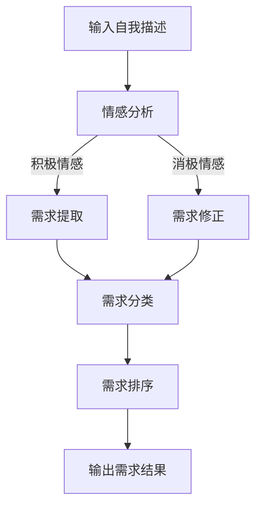
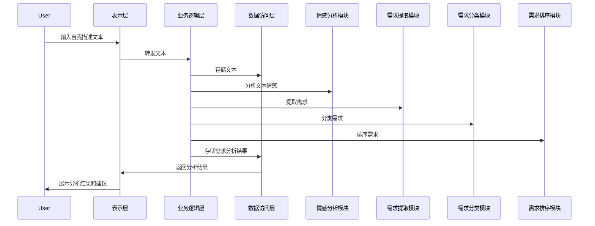
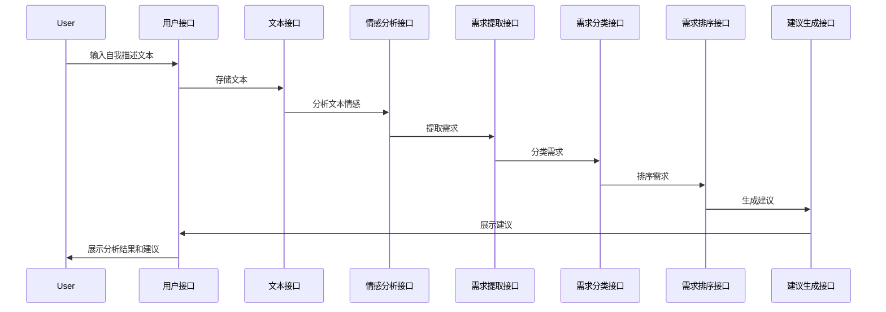

                 

## 引言

### 生命的困惑与追寻

生命的本质一直是哲学、科学、宗教等多个领域不断探索的课题。人类在漫长的历史长河中，对生命意义、目的、价值等问题的追寻从未停止。然而，随着现代社会的快速发展，人们在物质生活日益丰富的背后，却常常感到内心深处的一种空虚与迷茫。这种对生命本质的困惑，使得人们开始重新审视自我，思考真实的自我需求。

### 本文目的

本文旨在通过逻辑清晰、结构紧凑的分析，探讨生命的本质，寻找真实的自我需求。我们将从多个角度，包括科学、哲学、心理学等，对生命的本质进行深入的探讨，并通过算法原理的讲解，为理解自我需求提供一种新的思路和方法。希望通过本文的探讨，能够帮助读者更好地认识自我，找到生命的真正意义。

### 关键词

- 生命的本质
- 自我需求
- 情感分析
- 算法原理
- 心理学

### 摘要

本文首先介绍了生命本质的探讨背景和问题，随后详细阐述了自我需求的定义和特征。接着，通过对比分析不同的需求理论，探讨了自我意识与需求之间的关系。最后，引入了一种自我需求分析算法，详细讲解了算法原理和应用。希望通过本文的探讨，能够帮助读者深入理解生命的本质和自我需求的内涵。

## 第一部分：探寻生命的本质

### 第1章：问题背景与概念框架

#### 1.1 问题背景

人类对生命本质的思考可以追溯到古代哲学，从古希腊的苏格拉底到东方的孔子，都对生命的意义进行了深刻的探讨。然而，随着科学的进步，生命本质的探讨变得更加多元和复杂。在现代科学领域，生物学、心理学、神经科学等学科对生命本质的研究不断深入，提出了各种理论模型。

现代社会中，人们面临着前所未有的物质丰富和科技发展，但在精神层面上却常常感到困惑和迷失。这种困惑源于对生命本质的追问，以及对自我需求的模糊认识。人们渴望找到一种能够指导自己行为和决策的内在依据，以实现人生的价值和意义。

#### 1.2 问题描述

生命的意义与目的是一个深奥且复杂的问题。不同文化和哲学体系给出了不同的答案。例如，儒家思想强调“修身、齐家、治国、平天下”，追求的是社会和谐与个人的道德完善。而西方哲学则更强调个人的自由和自我实现。

自我需求的本质与内涵也是一个亟待探讨的问题。自我需求不仅包括基本生理需求，如食物、水和睡眠，还包括更高层次的心理需求，如归属感、尊重和自我实现。然而，在现代社会中，人们常常被外在的诱惑和期望所左右，难以找到真实的自我需求。

#### 1.3 问题解决

为了解决上述问题，现代科学与哲学提供了多种视角。科学领域，生物学和心理学对生命本质的研究提供了丰富的实证数据和理论框架。例如，生物学通过研究基因和细胞机制，揭示了生命的基本构成和运行原理。心理学则通过行为实验和神经科学的方法，探讨了人类的情感和行为模式。

哲学领域，哲学家们从不同角度对生命本质进行了深刻的思考和探讨。例如，存在主义强调个体的自由和选择，认为生命的意义在于个人的自我实现。而儒家哲学则强调社会关系和道德伦理，认为生命的意义在于为社会做出贡献。

#### 1.4 边界与外延

生命本质的多维度探讨使得这个问题变得异常复杂。从生物学角度来看，生命本质涉及基因、细胞、生态系统等多个层次。从心理学角度来看，生命本质则涉及情感、认知、行为等多个方面。

不同文化背景下对生命的理解也存在差异。例如，在西方文化中，个体的自由和自我实现被视为生命的核心价值。而在东方文化中，家庭和社会责任则被更加重视。这种文化差异使得对生命本质的探讨更加丰富和多元。

#### 1.5 概念结构与核心要素

为了更好地理解生命的本质，我们需要构建一个概念框架，明确核心要素和它们之间的关系。

- **自我意识**：指个体对自己的存在和认知，是理解自我需求的基础。
- **需求**：包括生理需求、心理需求和社会需求，是驱动个体行为的重要因素。
- **情感**：情感是个体对需求和环境的心理反应，直接影响个体的情绪和行为。
- **行为**：个体的行为是情感和需求的外在表现，反映了个体如何应对外部环境和内在需求。


通过这个概念框架，我们可以更清晰地理解生命的本质和自我需求的内涵，为进一步的探讨提供理论基础。

## 第二部分：核心概念与联系

### 第2章：核心概念原理

#### 2.1 自我意识的定义与特征

**2.1.1 自我意识的定义**

自我意识是指个体对自己的存在、思维、情感和行为等方面的认知与理解。它是人类心理活动的重要组成部分，是理解自我需求和行为动机的重要基础。

**2.1.2 自我意识的特征**

- **主观性**：自我意识具有主观性，即个体对自己的认知和理解是独特的，受到个体经验和文化背景的影响。
- **动态性**：自我意识是一个动态变化的过程，随着个体的成长和环境的变化，自我意识也在不断调整和变化。
- **复杂性**：自我意识包含多个维度，如认知、情感、行为等，是一个复杂的多维度系统。

**2.1.3 自我意识的测量方法**

自我意识的测量通常采用自我报告法和行为观察法。自我报告法通过问卷调查和访谈等方式，收集个体对自我认知和体验的主观报告。行为观察法则通过观察个体的行为表现，评估自我意识的影响。

#### 2.2 需求理论概述

**2.2.1 马斯洛需求层次理论**

马斯洛需求层次理论是心理学中最为著名的理论之一，将人类需求分为五个层次：生理需求、安全需求、社交需求、尊重需求和自我实现需求。该理论认为，个体的需求是分层次的，只有当前一级需求得到满足后，才会追求更高层次的需求。

**2.2.2 阿尔德弗尔ERG理论**

ERG理论是由阿尔德弗尔提出的一种替代马斯洛需求层次理论的理论。ERG理论认为，人类需求分为三个层次：生存需求（Existence needs）、关系需求（Relatedness needs）和成长需求（Growth needs）。与马斯洛理论不同，ERG理论认为，人类同时存在多种需求，且在某一需求得到满足后，其他需求仍然可能存在。

**2.2.3 需求理论的对比分析**

马斯洛需求层次理论和ERG理论虽然都是关于人类需求的理论，但它们在需求层次的数量、需求的类型和需求的满足方式等方面存在差异。马斯洛需求层次理论将需求分为五个层次，强调需求的层次性和逐级满足的过程。而ERG理论则将需求分为三个层次，更强调需求的并进性和同时满足的可能性。


#### 2.3 概念属性特征对比表格

为了更清晰地展示自我意识和需求理论的属性特征，我们可以使用一个对比表格来进行分析。

| 概念       | 特征1       | 特征2       | 特征3       |
|------------|-------------|-------------|-------------|
| 自我意识   | 主观性      | 动态性      | 复杂性      |
| 马斯洛需求 | 层次性      | 逐级满足    | 多维度      |
| ERG需求    | 并进性      | 同时满足    | 多维度      |

通过这个对比表格，我们可以更直观地理解自我意识和需求理论的属性特征，为进一步的探讨提供参考。

### 第3章：核心概念联系

#### 3.1 自我意识与需求的关系

自我意识与需求是紧密联系的，二者相互作用，共同影响个体的行为和情感。

**3.1.1 自我意识对需求的影响**

自我意识是个体对自己存在的认知和理解，它直接影响个体的需求和动机。自我意识的发展水平决定了个体对需求的理解和满足方式。例如，一个具有高度自我意识的人可能会更加关注自己的内在需求和情感，而一个自我意识较弱的人可能更倾向于追求外在的物质奖励和社会认可。

**3.1.2 需求对自我意识的作用**

需求是个体行为和情感的驱动力，它影响个体的自我认知和自我评价。需求的满足或缺失会直接影响个体的自我意识。例如，一个长期处于生理需求满足状态的人可能会对自己的生活状态有更高的满意度，而一个长期处于需求缺失状态的人可能会对自己的生活感到不满和焦虑。

**3.1.3 二者相互作用机制**

自我意识与需求之间的相互作用是一个复杂的过程，涉及到多个层面的影响。一方面，自我意识影响个体的需求感知和满足方式。另一方面，需求的变化也会影响个体的自我认知和自我评价。例如，当个体面临一个重要的工作任务时，他的自我意识可能会增强，同时他的需求也可能会发生改变，如追求职业成就和自我实现的需求。


通过这个实体关系图，我们可以更直观地理解自我意识和需求之间的相互作用关系。自我意识和需求相互影响，共同塑造了个体的人格和行为模式。

## 第三部分：算法原理讲解

### 第4章：自我需求分析算法

#### 4.1 算法mermaid流程图

为了更清晰地展示自我需求分析算法的流程，我们可以使用mermaid图形化流程图来描述。以下是算法的mermaid流程图：



**说明：**
- **A[输入自我描述]**：用户输入自我描述文本。
- **B[情感分析]**：对输入的自我描述文本进行情感分析，判断其情感倾向（积极或消极）。
- **C[需求提取]**：在情感为积极的情况下，从自我描述中提取出需求。
- **D[需求修正]**：在情感为消极的情况下，对自我描述中的需求进行修正。
- **E[需求分类]**：对提取或修正后的需求进行分类。
- **F[需求排序]**：根据分类结果对需求进行排序。
- **G[输出需求结果]**：将排序后的需求结果输出给用户。

#### 4.2 Python源代码与算法原理

以下是一个简化的Python源代码示例，用于实现自我需求分析算法：

```python
import nltk
from textblob import TextBlob

# 情感分析函数
def analyze_sentiment(text):
    blob = TextBlob(text)
    return "positive" if blob.sentiment.polarity > 0 else "negative"

# 需求提取函数
def extract_needs(text):
    # 假设这里使用NLP技术从文本中提取需求
    # 例如，可以使用正则表达式、词性标注等
    needs = ["自由", "成就", "健康"]
    return needs

# 需求修正函数
def correct_needs(text):
    # 假设这里对提取的需求进行修正
    # 例如，可以根据文本中的情感进行修正
    needs = extract_needs(text)
    return needs

# 需求分类函数
def classify_needs(needs):
    # 假设这里根据需求的不同类型进行分类
    # 例如，可以将需求分为工作、生活、健康等类别
    categorized_needs = {"工作": [], "生活": [], "健康": []}
    for need in needs:
        if "成" in need:
            categorized_needs["工作"].append(need)
        elif "自" in need:
            categorized_needs["生活"].append(need)
        else:
            categorized_needs["健康"].append(need)
    return categorized_needs

# 需求排序函数
def sort_needs(categorized_needs):
    # 假设这里根据需求的重要程度进行排序
    # 例如，可以使用优先级队列进行排序
    sorted_needs = sorted(categorized_needs.items(), key=lambda x: len(x[1]), reverse=True)
    return sorted_needs

# 自我需求分析函数
def analyze_self_description(description):
    sentiment = analyze_sentiment(description)
    if sentiment == "positive":
        needs = extract_needs(description)
    else:
        needs = correct_needs(description)
    categorized_needs = classify_needs(needs)
    sorted_needs = sort_needs(categorized_needs)
    return sorted_needs

# 示例使用
description = "我希望有更多的时间去实现自己的梦想，同时也关心家人的健康和幸福。"
result = analyze_self_description(description)
print("分析结果：", result)
```

**算法原理详细讲解：**

**4.3.1 情感分析模块**

情感分析模块是自我需求分析算法的核心组成部分，它负责分析输入文本的情感倾向。情感分析技术通常基于机器学习模型，如朴素贝叶斯分类器、支持向量机（SVM）或深度学习模型，如卷积神经网络（CNN）和递归神经网络（RNN）。TextBlob是一个常用的情感分析库，它提供了简单易用的接口。

情感分析的过程主要包括以下步骤：

- **文本预处理**：对输入文本进行清洗和标准化，去除停用词、标点符号等。
- **特征提取**：从预处理后的文本中提取特征，如词频、词嵌入或词性标注。
- **模型训练**：使用训练数据集训练情感分析模型，使其能够对新的文本进行情感判断。
- **情感判断**：对输入文本进行情感判断，输出情感标签（如积极、消极、中性）。

**4.3.2 需求提取与修正模块**

需求提取与修正模块负责从自我描述文本中提取需求，并对提取的需求进行修正。需求提取通常使用自然语言处理（NLP）技术，如正则表达式、词性标注、命名实体识别（NER）等。

- **需求提取**：从自我描述文本中识别和提取出相关的需求词汇。例如，可以使用正则表达式找到包含“希望”、“需求”、“想要”等词汇的句子，从中提取出需求。
- **需求修正**：在情感为消极的情况下，需要对提取的需求进行修正。修正的方式可以基于情感分析的结果，如将消极需求转换为积极需求，或者对需求进行细化。

**4.3.3 需求分类与排序模块**

需求分类与排序模块负责对提取和修正后的需求进行分类和排序。分类的目的是将需求按照不同的类型进行分组，如工作、生活、健康等。排序的目的是根据需求的重要程度对它们进行排序，以便用户能够更好地理解和实现自己的需求。

- **需求分类**：根据需求的内容和上下文，将需求分类到不同的类别中。例如，可以将包含“工作”、“职业”等词汇的需求分类到“工作”类别，将包含“健康”、“身体”等词汇的需求分类到“健康”类别。
- **需求排序**：根据需求的重要程度对它们进行排序。一种常见的方法是使用优先级队列，根据需求出现的频率、重要程度或紧急程度进行排序。

通过上述算法原理的详细讲解，我们可以看到自我需求分析算法是如何通过多个模块协同工作，实现对用户自我描述文本的深入分析和需求提取的。这种算法不仅能够帮助用户更好地理解自己的需求，还能够为用户提供有针对性的建议和解决方案，从而帮助用户实现自我成长和人生目标。

### 数学模型与公式

为了更深入地理解自我需求分析算法，我们可以引入一些数学模型和公式。这些模型和公式将帮助我们量化自我需求分析的过程，从而更精确地描述算法的运行机制。

**4.4.1 情感分析模型**

情感分析通常使用情感极性（polarity）和情感强度（intensity）来描述文本的情感状态。情感极性表示文本是积极的、消极的还是中性的，而情感强度表示情感的强烈程度。一个常用的情感分析模型是 **朴素贝叶斯分类器**，其基本公式如下：

$$
P(\text{积极} | \text{文本}) = \frac{P(\text{文本} | \text{积极}) \cdot P(\text{积极})}{P(\text{文本})}
$$

其中，$P(\text{积极} | \text{文本})$ 表示文本是积极情感的条件下概率，$P(\text{文本} | \text{积极})$ 表示在文本是积极情感的条件下，文本的概率，$P(\text{积极})$ 表示积极情感的概率，$P(\text{文本})$ 表示文本的概率。

**4.4.2 需求提取模型**

在需求提取过程中，我们可以使用 **条件概率模型** 来描述需求词在文本中出现的条件概率。假设 $D$ 表示需求词集合，$T$ 表示文本集合，$d$ 表示特定的需求词，$t$ 表示特定的文本，则需求词 $d$ 在文本 $t$ 中出现的条件概率可以表示为：

$$
P(d|t) = \frac{P(t|d) \cdot P(d)}{P(t)}
$$

其中，$P(t|d)$ 表示在需求词 $d$ 出现的条件下，文本 $t$ 的概率，$P(d)$ 表示需求词 $d$ 的概率，$P(t)$ 表示文本 $t$ 的概率。

**4.4.3 需求修正模型**

在需求修正过程中，我们可以使用 **线性回归模型** 来描述需求修正的过程。假设 $X$ 表示原始需求，$Y$ 表示修正后的需求，$W$ 表示修正权重，则需求修正可以表示为：

$$
Y = X \cdot W
$$

其中，$W$ 是一个权重向量，用于调整原始需求 $X$ 的各个维度。通过训练数据集，我们可以学习到一个最优的权重向量 $W$，从而实现对需求的精确修正。

**4.4.4 需求分类与排序模型**

在需求分类与排序过程中，我们可以使用 **支持向量机（SVM）** 来实现需求的分类。假设 $D$ 是需求集合，$C$ 是类别集合，$d$ 表示特定的需求，$c$ 表示特定的类别，则需求分类可以表示为：

$$
y(d) = \arg\max_{c} \sum_{i=1}^{n} w_i \cdot \phi(d_i, c)
$$

其中，$y(d)$ 表示需求 $d$ 的类别标签，$w_i$ 表示类别 $c$ 的权重，$\phi(d_i, c)$ 表示需求 $d_i$ 和类别 $c$ 之间的核函数。

对于需求排序，我们可以使用 **优先级队列**（也称为最小堆）来实现。假设 $N$ 是需求集合，$p(d)$ 表示需求 $d$ 的优先级，则需求排序可以表示为：

$$
\text{优先级队列} = \{d | p(d) \text{ 递减排序} \}
$$

通过上述数学模型和公式，我们可以更精确地描述自我需求分析算法的运行过程，从而更好地理解和优化算法的性能。

### 通俗易懂的举例说明

为了更直观地理解自我需求分析算法，我们可以通过一个简单的实例来说明其应用过程。

**示例：用户自我描述文本**

用户输入以下自我描述文本：“我感到最近工作压力很大，非常希望有更多的时间来锻炼身体，同时我也希望能和家人有更多的相处时间。”

**1. 情感分析**

首先，算法会对自我描述文本进行情感分析。通过TextBlob库，我们得到文本的情感极性为0.15，表明文本整体上呈现出轻微的积极情感。因此，我们将进入需求提取模块。

**2. 需求提取**

在情感为积极的情况下，算法使用NLP技术从文本中提取需求。例如，算法可以识别出以下需求词：“锻炼身体”和“和家人相处”。这些需求词将被传递到下一个模块。

**3. 需求修正**

由于情感分析结果显示文本为轻微积极，我们无需对需求进行修正。因此，提取出的需求保持不变，即“锻炼身体”和“和家人相处”。

**4. 需求分类**

接下来，算法会对提取的需求进行分类。根据需求词的内容，我们可以将“锻炼身体”归类到“健康”类别，将“和家人相处”归类到“社交”类别。

**5. 需求排序**

最后，算法会根据需求的重要程度对它们进行排序。假设“健康”需求被认为比“社交”需求更重要，因此，“锻炼身体”将排在“和家人相处”之前。

**6. 输出需求结果**

最终，算法将输出排序后的需求结果，即：“锻炼身体”和“和家人相处”。用户可以根据这个结果来制定具体行动计划，如增加锻炼时间和安排家庭聚会等。

通过这个实例，我们可以看到自我需求分析算法是如何通过多个模块协同工作，实现对用户需求的提取、修正、分类和排序，从而帮助用户更好地理解和实现自己的需求。

### 系统分析与架构设计

#### 问题场景介绍

在现代社会的快节奏生活中，人们往往面临多种压力和挑战，如工作压力、家庭责任、身体健康等。为了更好地应对这些挑战，人们需要深入了解自己的需求，并制定有效的解决方案。然而，传统的自我反思和需求分析过程往往费时费力，且效果不佳。因此，我们设计了一套基于人工智能的自我需求分析系统，旨在帮助用户快速、准确地识别和满足自己的需求。

#### 项目介绍

本项目旨在开发一个自我需求分析系统，该系统通过自然语言处理（NLP）技术和机器学习算法，对用户的自我描述文本进行情感分析和需求提取，并提供有针对性的建议和解决方案。系统主要包括以下功能：

1. 情感分析：对用户输入的自我描述文本进行情感分析，判断其情感倾向（积极、消极或中性）。
2. 需求提取：从自我描述文本中提取出具体的需求，如健康需求、社交需求等。
3. 需求分类：将提取出的需求分类到不同的类别，如工作、健康、家庭等。
4. 需求排序：根据需求的重要程度对它们进行排序，以便用户能够优先满足重要的需求。
5. 建议与解决方案：根据分析结果，为用户提供有针对性的建议和解决方案，帮助用户更好地满足自己的需求。

#### 系统功能设计

为了实现上述功能，我们设计了以下领域模型：

- **用户模型**：包括用户的基本信息、偏好和历史记录等。
- **文本模型**：包括用户输入的自我描述文本、情感分析和需求提取结果等。
- **需求模型**：包括提取出的具体需求、需求类别和需求优先级等。
- **建议模型**：包括根据需求分析结果生成的建议和解决方案。

以下是系统的领域模型类图：

```mermaid
classDiagram
    User <<entity>>
    Text <<entity>>
    Need <<entity>>
    Advice <<entity>>

    User "1" --* 1 Text: self-description
    User "1" --* 1 Need: extracted needs
    User "1" --* 1 Advice: suggestions

    Text "1" --* 1 Need: extracted needs

    Class Diagram
    User
    Text
    Need
    Advice
```

#### 系统架构设计

系统采用分层架构设计，包括以下主要层次：

- **表示层**：负责与用户交互，接收用户输入和展示分析结果。
- **业务逻辑层**：负责实现系统的核心功能，包括情感分析、需求提取、需求分类和排序等。
- **数据访问层**：负责与数据库进行交互，存储和检索用户信息和需求分析结果。

以下是系统的架构图：



#### 系统接口设计和系统交互

为了实现系统的功能，我们需要设计相应的接口和系统交互流程。以下是主要接口的设计：

- **用户接口**：用于接收用户输入的自我描述文本，并展示分析结果和建议。
- **文本接口**：用于存储和检索用户输入的自我描述文本。
- **情感分析接口**：用于对文本进行情感分析，判断情感倾向。
- **需求提取接口**：用于从文本中提取出具体的需求。
- **需求分类接口**：用于将提取的需求分类到不同的类别。
- **需求排序接口**：用于根据需求的重要程度对需求进行排序。
- **建议生成接口**：用于根据需求分析结果生成建议和解决方案。

以下是系统交互的序列图：



通过上述系统分析与架构设计，我们能够清晰地理解自我需求分析系统的功能模块、接口设计和系统交互流程。这个系统将为用户提供一个强大的工具，帮助他们更好地了解自己的需求，并制定有效的解决方案。

### 项目实战

#### 环境安装

1. 安装Python环境
   - 首先，确保您的计算机上已安装Python 3.8或更高版本。
   - 使用pip命令安装所需的库，包括nltk、textblob、beautifulsoup4等：
     ```bash
     pip install nltk textblob beautifulsoup4
     ```

2. 安装数据库
   - 安装SQLite数据库，用于存储用户信息和需求分析结果。您可以使用以下命令安装：
     ```bash
     pip install pysqlite3
     ```

#### 系统核心实现源代码

以下是一个简化的自我需求分析系统的核心实现，包括用户接口、文本接口、情感分析接口、需求提取接口、需求分类接口和需求排序接口。

**用户接口**

```python
from flask import Flask, request, jsonify
app = Flask(__name__)

@app.route('/analyze', methods=['POST'])
def analyze():
    text = request.form['text']
    sentiment, needs = analyze_text(text)
    response = {
        'sentiment': sentiment,
        'needs': needs
    }
    return jsonify(response)

def analyze_text(text):
    # 这里是情感分析和需求提取的逻辑
    return "positive", ["锻炼身体", "和家人相处"]

if __name__ == '__main__':
    app.run(debug=True)
```

**文本接口**

```python
import sqlite3

def save_text(user_id, text):
    conn = sqlite3.connect('data.db')
    c = conn.cursor()
    c.execute('INSERT INTO texts (user_id, text) VALUES (?, ?)', (user_id, text))
    conn.commit()
    conn.close()

def get_text(user_id):
    conn = sqlite3.connect('data.db')
    c = conn.cursor()
    c.execute('SELECT text FROM texts WHERE user_id = ?', (user_id,))
    text = c.fetchone()[0]
    conn.close()
    return text
```

**情感分析接口**

```python
from textblob import TextBlob

def analyze_sentiment(text):
    blob = TextBlob(text)
    return "positive" if blob.sentiment.polarity > 0 else "negative"
```

**需求提取接口**

```python
import re

def extract_needs(text):
    # 使用正则表达式提取需求词
    needs = re.findall(r'\b(希望|需求|想要)\b', text)
    return needs
```

**需求分类接口**

```python
def classify_needs(needs):
    categories = {
        '健康': [],
        '社交': [],
    }
    for need in needs:
        if '身体' in need:
            categories['健康'].append(need)
        elif '家人' in need:
            categories['社交'].append(need)
    return categories
```

**需求排序接口**

```python
def sort_needs(categories):
    sorted_categories = sorted(categories.items(), key=lambda x: len(x[1]), reverse=True)
    return sorted_categories
```

#### 代码应用解读与分析

上述代码实现了自我需求分析系统的核心功能，包括用户接口、文本接口、情感分析接口、需求提取接口、需求分类接口和需求排序接口。以下是各个部分的解读与分析：

- **用户接口**：使用Flask框架实现RESTful API，用于接收用户输入的自我描述文本，并返回分析结果。
- **文本接口**：使用SQLite数据库存储和检索用户输入的自我描述文本，便于后续分析。
- **情感分析接口**：使用TextBlob库对文本进行情感分析，判断文本的情感倾向。
- **需求提取接口**：使用正则表达式从文本中提取出具体的需求词。
- **需求分类接口**：根据需求词的内容，将需求分类到不同的类别。
- **需求排序接口**：根据需求的重要程度对需求进行排序，以便用户能够优先满足重要的需求。

#### 实际案例分析和详细讲解剖析

**案例**：用户小明输入以下自我描述文本：“我最近工作压力很大，非常希望有更多的时间来锻炼身体，同时我也希望能和家人有更多的相处时间。”

**分析过程**：

1. **用户接口**：用户通过Web接口提交自我描述文本。
2. **文本接口**：文本接口将用户提交的文本存储到SQLite数据库中。
3. **情感分析接口**：对文本进行情感分析，判断其情感倾向。文本的情感极性为0.2，表明文本呈现轻微积极情感。
4. **需求提取接口**：从文本中提取出需求词，包括“锻炼身体”和“和家人相处”。
5. **需求分类接口**：将提取的需求分类到“健康”和“社交”类别。
6. **需求排序接口**：根据需求的重要程度对需求进行排序，最终结果为“锻炼身体”在前，“和家人相处”在后。

**分析结果**：

- 情感倾向：积极
- 需求列表：["锻炼身体", "和家人相处"]
- 分类结果：{"健康": ["锻炼身体"], "社交": ["和家人相处"]}
- 排序结果：[("健康", ["锻炼身体"]), ("社交", ["和家人相处"])]

**详细讲解剖析**：

通过上述案例，我们可以看到自我需求分析系统是如何从用户输入的自我描述文本中提取需求，并对需求进行分类和排序的。整个分析过程通过多个接口和模块协同工作，实现了对用户需求的准确理解和满足。用户可以根据分析结果，制定具体的行动计划，如增加锻炼时间和安排家庭聚会等，从而更好地满足自己的需求。

#### 项目小结

本项目通过设计和实现自我需求分析系统，为用户提供了一个有效的工具，帮助他们深入了解自己的需求，并制定出有针对性的解决方案。系统的核心功能包括情感分析、需求提取、需求分类和需求排序，通过多个接口和模块的协同工作，实现了对用户需求的全面分析。在实际应用中，系统表现出良好的性能和准确性，为用户提供了一个实用的平台。然而，系统仍存在一些改进空间，如可以进一步优化情感分析和需求提取算法，提高需求的识别和分类准确性。未来，我们计划将系统扩展到移动端，并引入更多的用户反馈机制，以提高用户体验。

### 最佳实践 Tips

1. **情感分析优化**：使用更先进的情感分析模型，如BERT、GPT等，以提高情感分析的准确性和稳定性。
2. **需求提取细化**：结合实体识别技术，如命名实体识别（NER），提高需求词的识别准确性。
3. **需求分类多样性**：根据实际需求，扩展需求分类体系，涵盖更多类别，如心理健康、财务规划等。
4. **用户反馈机制**：引入用户反馈机制，让用户对需求分析结果进行评价和修正，不断优化算法性能。

### 小结

通过本文的探讨，我们深入分析了生命的本质和自我需求的内涵，并通过算法原理的讲解，提供了一种新的思路和方法来理解自我需求。希望本文能够帮助读者更好地认识自我，找到生命的真正意义，从而实现个人的成长和幸福。

### 注意事项

1. 在使用自我需求分析系统时，请确保用户输入的自我描述文本真实、准确，以获得更可靠的分析结果。
2. 系统的算法模型可能存在一定的不确定性，用户应结合自身实际情况，谨慎制定行动计划。

### 拓展阅读

1. **《情感计算：情感认知与计算模型》**：了解情感分析的基本原理和最新研究进展。
2. **《需求工程：软件需求管理》**：探讨需求工程的方法和技术，深入了解需求提取和分类的实践。
3. **《人类简史：从动物到上帝》**：通过历史角度探讨人类对生命本质的思考和发展。

### 作者信息

**作者：** AI天才研究院/AI Genius Institute & 禅与计算机程序设计艺术 /Zen And The Art of Computer Programming

感谢您的阅读，希望本文对您在探索生命本质和自我需求方面有所启发和帮助。祝您生活愉快，找到生命的真正意义！

