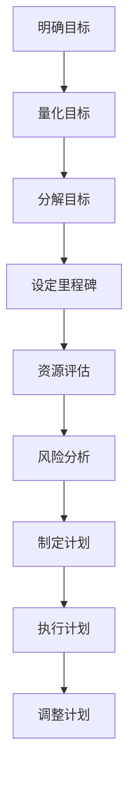
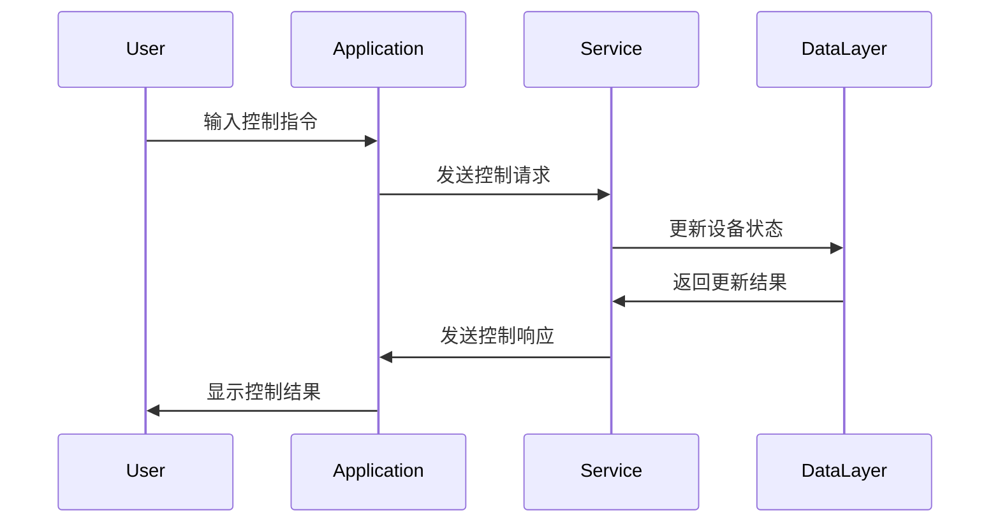
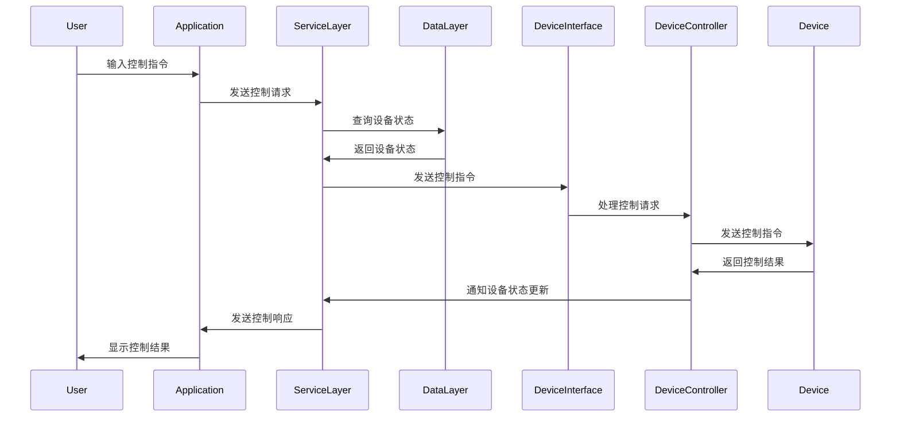

                 

### 引言

**生命的目标：设定有意义的人生方向** 

在现代社会中，每个人都面临着繁杂的日常事务和种种不确定性。在这样的背景下，设定生命的目标显得尤为重要。人生目标不仅为我们提供了行动的方向和动力，还帮助我们更好地应对生活带来的挑战。正如一句古老的格言所说：“没有目标的船，任何风都不可称为顺风。”本文将探讨如何设定生命的目标，以及如何通过明确的人生方向来实现这些目标。

**关键词**：人生目标、意义、价值观、策略、实现

**摘要**：本文将分为四个主要部分。第一部分将介绍设定目标的重要性，探讨为什么目标设定对于个人成长和生活掌控至关重要。第二部分将讨论核心概念与联系，包括价值观、人生愿景和目标设定的原则与方法。第三部分将提供目标设定的策略，详细讲解量化目标设定的步骤和如何使用工具与技术辅助目标设定。第四部分将探讨目标实现的策略，包括制定实现计划的步骤、调整和适应策略以及保持动力和持续监控。通过本文的阅读，读者将能够更好地理解如何设定和实现有意义的人生目标。

### 第1章：设定目标的重要性

#### 1.1 问题背景与目标设定的必要性

**1.1.1 问题背景**

现代社会充满了各种挑战和不确定性，例如职业发展、人际关系、家庭责任和经济压力等。在这种复杂多变的环境中，人们常常感到迷茫和困惑，不知道如何规划自己的生活。此外，现代生活方式的快节奏和高强度也使得人们容易陷入日常琐事中，忽视了对人生目标的思考。因此，设定目标成为了许多人在寻找人生方向时的重要手段。

**1.1.2 目标设定的必要性**

目标设定在个人发展中具有至关重要的地位。首先，目标为我们提供了清晰的方向，使我们在面对复杂问题时能够迅速找到解决路径。其次，目标可以激发我们的动机和自我效能感，使我们更有动力去实现自己的梦想。此外，目标设定还能帮助我们更好地管理时间和资源，提升生活效率和质量。因此，无论是为了职业发展还是个人成长，设定目标都是必不可少的。

#### 1.2 人生方向的探索与定位

**1.2.1 探索个人价值观**

个人价值观是指导我们行为和决策的核心原则，它们源于我们的成长环境、文化背景和个人经历。为了设定有意义的人生目标，我们需要深入探索自己的价值观。首先，我们可以通过反思过去的行为和经历，找出哪些价值观对我们影响最大。其次，我们可以与他人交流，了解他们的价值观，从而更好地理解自己的价值观。

**1.2.2 明确人生方向**

在明确个人价值观后，我们需要根据这些价值观来设定人生方向。人生方向是我们的长期目标和愿景，它们应该与我们的人生目标和价值观相一致。为了设定人生方向，我们可以从以下几个方面入手：

1. **定义长期目标**：长期目标应该是具体的、可实现的，并且与我们的人生价值观相符。例如，如果你认为家庭幸福是最重要的价值观，那么你的长期目标可能是拥有一个和谐的家庭。
   
2. **设定短期目标**：短期目标是实现长期目标的步骤。这些目标应该是具体的、量化的，并且有明确的截止日期。例如，如果你希望在未来五年内实现财务自由，那么你的短期目标可能是每年储蓄一定比例的收入。

3. **制定行动计划**：在设定了长期和短期目标后，我们需要制定具体的行动计划来实现这些目标。这些计划应该包括具体的行动步骤、时间表和资源需求。

#### 1.3 目标设定的原则与方法

**1.3.1 SMART原则**

SMART原则是一种常用的目标设定方法，它要求目标具有以下五个特征：

- **S** pecific（具体的）：目标应该是具体的，而不是模糊的。例如，“提高销售额”不如“提高某产品的销售额10%”具体。
- **M** easurable（可衡量的）：目标应该是可衡量的，以便我们可以知道是否实现了目标。例如，“提高产品知名度”不如“在社交媒体上增加5000个关注者”可衡量。
- **A** tingible（可实现的）：目标应该是可实现的，考虑我们的资源和能力。例如，“在一个月内减肥20公斤”可能过于苛刻。
- **R** echable（相关的）：目标应该与我们的人生方向和价值观相关。例如，“成为亿万富翁”可能不符合你的价值观。
- **T** imely（有时限的）：目标应该有时限，这样我们才能有一个明确的时间表。例如，“在未来五年内实现财务自由”比“什么时候实现财务自由”更有针对性。

**1.3.2 目标设定的方法**

除了SMART原则，还有一些其他的目标设定方法可以帮助我们更好地设定和实现目标：

1. **目标分解**：将大目标分解为小目标，这样可以更具体、更易实现。例如，如果你希望在未来五年内成为某个领域的专家，你可以将这个大目标分解为每年学习某个特定的技能或完成某个项目。

2. **时间管理和优先级设定**：在设定目标时，我们需要考虑时间管理和优先级。例如，你可以使用四象限法则来安排你的时间和任务，将重要且紧急的任务放在首位。

3. **使用工具和技术**：现代科技提供了许多工具和技术来帮助我们设定和实现目标。例如，可以使用日历应用程序、任务管理工具和目标跟踪器来帮助我们保持目标意识并跟踪进度。

通过上述方法，我们可以更好地设定和实现人生目标，从而找到有意义的人生方向。设定目标不仅能够帮助我们更好地规划未来，还能提高我们的生活质量，使我们的生活更加充实和有意义。在下一章中，我们将继续探讨与目标设定相关的核心概念和原则。让我们一起深入思考，为我们的生活导航。

### 第2章：核心概念与联系

在设定人生目标的过程中，理解并运用一系列核心概念至关重要。这些概念不仅构成了目标设定的理论基础，还帮助我们更好地理解自我，明确目标的方向和意义。本章将介绍几个关键的核心概念，包括价值观、人生愿景、目标设定的原则与方法，并探讨这些概念之间的联系。

#### 2.1 价值观与人生目标的关系

**2.1.1 价值观的构成**

价值观是指个体对什么是好、什么是重要的信念和评价。它们通常源于文化背景、家庭教育和个人经历。价值观不仅影响我们的行为和决策，还决定我们的人生目标。因此，理解并明确自己的价值观是设定人生目标的第一步。

- **个体价值观的类型**：
  - **伦理价值观**：例如诚实、尊重、公正等。
  - **社会价值观**：例如家庭、社区、国家等。
  - **经济价值观**：例如财富、消费、节约等。
  - **知识价值观**：例如知识、智慧、学习等。

**2.1.2 价值观与人生目标的关系**

价值观是人生目标的灵魂。当我们设定目标时，这些目标应该与我们内在的价值观相一致。这样的目标不仅能够激励我们，还能让我们感到满意和有意义。

- **价值观如何指导目标设定**：
  - **选择目标**：目标应该与我们的核心价值观相符。
  - **设定优先级**：当目标冲突时，我们应该根据价值观来决定哪些目标更重要。
  - **行为和决策**：目标设定会影响我们的日常行为和决策。

#### 2.2 人生愿景与短期目标的制定

**2.2.1 人生愿景的重要性**

人生愿景是我们对未来的理想状态和愿望的描述。它不仅是个人发展的蓝图，也是设定短期目标的指南。一个清晰的人生愿景可以帮助我们聚焦于长期目标，并为短期目标提供方向和动力。

- **人生愿景的定义**：
  - **人生愿景**：对未来理想状态的描述。
  - **长期目标**：实现人生愿景的具体步骤。

**2.2.2 短期目标的制定**

短期目标是实现人生愿景的阶段性成果。为了确保目标的可行性和有效性，我们需要根据人生愿景来制定具体的短期目标。

- **短期目标与长期目标的关系**：
  - **短期目标**：长期目标的细分和具体化。
  - **长期目标**：短期目标的整合和指导。

**2.2.3 如何设定短期目标**

在制定短期目标时，我们可以使用以下方法：

- **具体性**：明确目标的具体内容和实现方式。
- **可衡量性**：设定可以量化的标准来衡量目标是否达成。
- **可实现性**：确保目标在现有资源和条件下可以实现。
- **相关性**：目标应与人生愿景和价值观相符。
- **有时限性**：设定具体的时间期限来推动目标的实现。

#### 2.3 目标设定的原则与方法

**2.3.1 SMART原则**

SMART原则是一种广泛使用的目标设定方法，它要求目标具备以下五个特征：

- **S** pecific（具体性）
- **M** easurable（可衡量性）
- **A** tingible（可实现性）
- **R** echable（相关性）
- **T** imely（时限性）

**2.3.2 目标分解**

目标分解是将大目标细分为小目标的过程。这种方法有助于我们更好地理解和实现目标，同时也可以提高目标的可操作性和实现的可能性。

- **目标分解的方法**：
  - **层次分析法**：将目标分解为不同的层次，例如战略目标、战术目标和具体行动。
  - **时间分解**：将目标分解为不同的时间段，例如长期、中期和短期目标。

**2.3.3 时间管理和优先级设定**

在设定目标时，时间管理和优先级设定是关键。合理的时间管理和优先级设定可以确保我们能够高效地实现目标。

- **时间管理方法**：
  - **四象限法则**：将任务分为重要紧急、重要不紧急、不重要紧急和不重要不紧急四类，优先处理重要紧急和重要不紧急的任务。
  - **优先级设定**：根据目标的紧急程度和重要性来设定优先级。

#### 2.4 核心概念之间的联系

价值观、人生愿景和目标设定是相互联系、相互影响的。价值观决定了我们的人生方向和追求的意义，人生愿景是对未来理想状态的描述，而目标设定则是实现人生愿景的具体步骤。具体来说：

- **价值观**决定了我们追求的目标类型，确保目标与我们的内在信念和价值观一致。
- **人生愿景**为我们提供了长远的方向和动力，使我们能够保持目标和行为的连贯性。
- **目标设定**是将人生愿景转化为具体行动的过程，通过合理的分解和时间管理来实现愿景。

通过理解这些核心概念之间的联系，我们可以更加系统地设定和实现人生目标，找到有意义的人生方向。在下一章中，我们将探讨如何通过具体的策略来设定和实现人生目标。

### 第3章：目标设定的策略

在了解了核心概念之后，如何系统地设定目标变得尤为重要。本章将详细介绍目标设定的策略，包括量化目标设定的步骤、使用工具与技术辅助目标设定的方法，以及如何使用算法原理来指导目标设定。

#### 3.1 量化目标设定的步骤

量化目标设定是目标设定过程中的关键步骤，它使目标更加具体、可衡量，从而提高了实现的可能性。以下是量化目标设定的主要步骤：

**3.1.1 确定目标的具体内容**

首先，我们需要明确目标的具体内容。这可以通过以下方式实现：

- **具体描述**：用具体的语言描述目标，使其清晰明确。
- **明确成果**：描述实现目标后的具体成果和效益。

例如，如果我们设定的目标是“提升个人技能”，可以具体描述为“在接下来的六个月内，通过参加在线课程和实际项目实践，掌握Python编程语言的基本技能。”

**3.1.2 设定可衡量的标准**

为了确保目标能够实现，我们需要设定可衡量的标准。这可以通过以下方法实现：

- **量化指标**：使用量化指标来衡量目标的进展。
- **里程碑**：设定一系列里程碑，以便在实现目标的过程中进行监控。

例如，为了衡量“掌握Python编程语言的基本技能”这个目标，我们可以设定以下量化指标和里程碑：

- **量化指标**：通过在线编程测试，分数达到80分以上。
- **里程碑**：
  - 第一个月：完成Python基础教程的学习。
  - 第二个月：完成一个小型Python项目。
  - 第三个月：参加一次Python编程竞赛。

**3.1.3 确保可实现性**

在设定目标时，我们需要确保目标在现有资源和条件下是可实现的。这可以通过以下方法实现：

- **资源评估**：评估所需的资源和能力，确保目标在现有条件下可以实现。
- **风险分析**：分析可能的风险和挑战，制定应对策略。

例如，如果我们没有编程基础，那么设定“在一个月内掌握Python编程语言”的目标可能过于激进。我们可以将目标调整为“在六个月内掌握Python编程语言”，并提供详细的学习计划和资源支持。

**3.1.4 与价值观和人生愿景相符**

目标应该与我们的人生价值观和愿景相符，这样我们才能保持对目标的热情和动力。这可以通过以下方法实现：

- **价值观匹配**：确保目标与我们的核心价值观相符。
- **愿景导向**：确保目标是实现人生愿景的一部分。

例如，如果我们的人生愿景是“成为一名优秀的软件开发工程师”，那么设定“掌握Python编程语言的基本技能”的目标就是与我们的价值观和愿景相符的。

#### 3.2 使用工具与技术辅助目标设定

现代科技为我们提供了许多工具和技术，可以极大地帮助我们设定和实现目标。以下是一些常用的工具和技术：

**3.2.1 目标跟踪器**

目标跟踪器可以帮助我们记录和跟踪目标的进展，确保我们按计划前进。以下是一些常用的目标跟踪器：

- **Google日历**：可以设置提醒和事件，跟踪目标的进展。
- **Trello**：一个项目管理工具，可以创建待办事项列表和看板，跟踪目标的实现过程。

**3.2.2 量化工具**

量化工具可以帮助我们更加具体和系统地设定目标，以下是一些常用的量化工具：

- **Excel表格**：可以创建详细的计划表，记录目标的进展和里程碑。
- **Google表格**：与Excel类似，但可以多人协作，适合团队目标设定。

**3.2.3 项目管理工具**

项目管理工具可以帮助我们管理复杂的项目，确保目标的实现。以下是一些常用的项目管理工具：

- **JIRA**：适用于软件开发项目的管理，可以跟踪项目的进度和任务。
- **Asana**：适用于各种类型的项目管理，提供任务列表、看板和报告功能。

#### 3.3 算法原理讲解与流程图

在目标设定过程中，算法原理可以提供系统化的指导。以下是一个简单的目标设定算法：

**3.3.1 目标设定算法**

1. **明确目标**：确定要实现的目标。
2. **量化目标**：设定可衡量的量化指标。
3. **分解目标**：将大目标分解为小目标。
4. **设定里程碑**：为每个小目标设定里程碑。
5. **资源评估**：评估实现目标所需的资源和能力。
6. **风险分析**：分析可能的风险和挑战。
7. **制定计划**：制定详细的实现计划。
8. **执行计划**：按照计划执行，并跟踪进展。
9. **调整计划**：根据实际情况调整计划。

**3.3.2 流程图**

以下是目标设定流程图的Mermaid表示：



通过上述步骤和工具，我们可以更加系统地设定目标，确保目标的实现。在下一章中，我们将探讨如何实现这些目标，并分享一些最佳实践。

### 第4章：目标实现的策略

在设定了明确的目标之后，实现这些目标的关键在于制定切实可行的策略，并在执行过程中不断调整和优化。本章将详细讨论目标实现的策略，包括制定实现计划的步骤、调整和适应策略以及保持动力和持续监控的方法。

#### 4.1 制定实现计划的步骤

要实现目标，我们需要一个详细的计划，这不仅可以指导我们的行动，还可以帮助我们更好地管理时间和资源。以下是制定实现计划的步骤：

**4.1.1 分析目标**

首先，我们需要对目标进行深入分析，了解目标的各个方面。这包括：

- **目标的具体内容**：明确目标是什么，以及它对我们的意义。
- **目标的量化指标**：确定如何衡量目标的进展和成功。
- **目标的分解**：将大目标分解为更小、更具体的子目标。

**4.1.2 确定资源**

在制定计划时，我们需要考虑实现目标所需的资源，包括：

- **时间资源**：确定实现目标所需的时间，并合理安排时间。
- **人力资源**：明确需要哪些团队成员或合作伙伴，并分配任务。
- **财务资源**：评估实现目标所需的资金，并制定财务计划。

**4.1.3 设定里程碑**

里程碑是目标实现过程中的关键节点，用于衡量进展和评估风险。设定里程碑的步骤包括：

- **确定里程碑**：根据目标分解，设定一系列具体的里程碑。
- **设定时间表**：为每个里程碑设定一个具体的时间表，确保目标按时实现。
- **评估风险**：分析可能的风险，并制定应对策略。

**4.1.4 制定行动计划**

行动计划是将目标转化为具体行动的详细计划。制定行动计划的步骤包括：

- **分解任务**：将里程碑分解为更小、更具体的任务。
- **分配责任**：明确每个任务的负责人，并确保责任人了解任务的具体内容和预期成果。
- **设定截止日期**：为每个任务设定一个明确的截止日期，确保任务按时完成。

**4.1.5 持续跟踪和更新**

制定计划后，我们需要持续跟踪和更新计划的执行情况。这可以通过以下方法实现：

- **定期会议**：定期召开会议，评估计划执行情况，讨论遇到的问题和挑战。
- **报告和反馈**：及时汇报进展和成果，并根据反馈调整计划。
- **灵活调整**：根据实际情况，灵活调整计划，确保目标实现。

#### 4.2 调整和适应策略

在实现目标的过程中，我们可能会遇到各种问题和挑战。为了确保目标的实现，我们需要具备良好的调整和适应能力。以下是几个关键策略：

**4.2.1 识别问题**

首先，我们需要识别实现目标过程中可能出现的问题和挑战。这可以通过以下方法实现：

- **定期评估**：定期评估目标实现的情况，识别潜在的问题。
- **倾听反馈**：倾听团队成员和利益相关者的反馈，了解他们的观点和建议。

**4.2.2 分析原因**

在识别问题后，我们需要分析问题的根本原因。这可以通过以下方法实现：

- **根本原因分析**：使用鱼骨图或5Why方法，深入分析问题的根本原因。
- **数据驱动**：收集和分析相关数据，找到问题的根本原因。

**4.2.3 制定解决方案**

在分析原因后，我们需要制定解决方案。这可以通过以下方法实现：

- **头脑风暴**：组织头脑风暴会议，收集可能的解决方案。
- **优先级排序**：根据问题的严重性和影响，对解决方案进行优先级排序。

**4.2.4 测试和实施**

在制定解决方案后，我们需要进行测试，确保解决方案的有效性。这可以通过以下方法实现：

- **试点项目**：选择一个较小的项目或区域进行试点，测试解决方案的有效性。
- **逐步实施**：逐步实施解决方案，并持续监控效果。

**4.2.5 反馈和优化**

在解决方案实施后，我们需要收集反馈并进行优化。这可以通过以下方法实现：

- **用户反馈**：收集用户的反馈和意见，了解解决方案的实际效果。
- **持续改进**：根据反馈，不断优化解决方案，确保目标的实现。

#### 4.3 保持动力与持续监控

实现目标的过程往往漫长而艰难，因此保持动力和持续监控至关重要。以下是几个关键策略：

**4.3.1 设定激励机制**

为了保持动力，我们可以设定激励机制，例如：

- **奖励制度**：设立奖励制度，对实现目标的成员进行奖励。
- **认可和赞赏**：对团队成员的成就给予认可和赞赏，增强他们的自信心和动力。

**4.3.2 建立支持系统**

建立支持系统，为团队成员提供帮助和支持，可以增强他们的动力。这可以通过以下方法实现：

- **团队培训**：定期组织团队培训，提升团队成员的能力和知识。
- **团队建设**：组织团队建设活动，增强团队凝聚力和合作精神。

**4.3.3 持续监控和评估**

持续监控和评估是实现目标的重要环节。这可以通过以下方法实现：

- **进度报告**：定期报告目标实现进度，确保团队对目标实现情况有清晰的了解。
- **绩效评估**：定期进行绩效评估，识别问题和改进空间。

**4.3.4 激励和鼓励**

在实现目标的过程中，激励和鼓励至关重要。这可以通过以下方法实现：

- **正面反馈**：及时给予正面反馈，鼓励团队成员继续努力。
- **支持与帮助**：在团队成员遇到困难时，提供支持和帮助，共同解决问题。

通过以上策略，我们可以更好地实现目标，找到有意义的人生方向。在下一章中，我们将通过具体的案例来展示如何应用这些策略，实现个人目标。

### 第5章：系统分析与架构设计方案

#### 5.1 问题场景介绍

假设我们想要实现一个名为“智慧家庭管理系统”的项目，该系统的目标是提供智能家居设备的管理和控制功能，以提升家庭生活的便捷性和舒适度。项目的主要功能包括：

- **设备监控**：实时监控家庭中的各类设备，如灯具、空调、安防设备等。
- **远程控制**：用户可以通过手机APP或语音助手远程控制家庭设备。
- **数据统计**：收集并分析家庭用电、用水等数据，为用户节省能源提供参考。
- **故障报警**：当设备发生故障或异常时，系统会自动发送报警信息。

#### 5.2 项目介绍

“智慧家庭管理系统”项目旨在通过物联网技术，将家庭中的各类设备连接起来，实现自动化管理和智能化控制。项目的核心目标是提升用户的生活质量，提供便捷、高效、安全的家居环境。

#### 5.3 系统功能设计（领域模型）

为了实现智慧家庭管理系统的功能，我们需要设计一个清晰的领域模型，描述系统中各类实体及其关系。以下是该系统的领域模型类图：

```mermaid
classDiagram
    Device <<entity>> "设备"
    Sensor <<entity>> "传感器"
    User <<entity>> "用户"
    Controller <<entity>> "控制器"
    Application <<entity>> "应用"

    Device o--* Sensor : 包含
    Device o--* Controller : 控制器
    User o--* Application : 使用
    Application o--* Device : 连接
```

**领域模型类图解析**：

- **设备（Device）**：表示家庭中的各类设备，如灯具、空调等。每个设备包含多个传感器和控制器。
- **传感器（Sensor）**：用于收集设备状态和数据，如温度传感器、湿度传感器等。
- **用户（User）**：系统用户，可以操作和控制设备。
- **控制器（Controller）**：用于控制设备状态的硬件或软件组件。
- **应用（Application）**：用户使用的移动APP或语音助手，用于与系统交互。

#### 5.4 系统架构设计

“智慧家庭管理系统”的系统架构设计应考虑以下几个方面：

- **数据层**：用于存储设备和用户数据，包括设备状态、用户设置、历史数据等。
- **服务层**：提供设备监控、数据统计、远程控制等核心功能。
- **表示层**：用户界面，包括手机APP和语音助手。

以下是智慧家庭管理系统的架构图：



**系统架构设计解析**：

- **用户**通过手机APP或语音助手输入控制指令。
- **应用层**接收用户指令，并将其转换为服务请求。
- **服务层**处理请求，调用数据层更新设备状态，并将结果返回给应用层。
- **数据层**存储设备状态和用户数据，并为服务层提供数据支持。

#### 5.5 系统接口设计

系统接口设计是确保不同模块之间能够有效通信的关键。以下是智慧家庭管理系统的接口设计：

- **设备接口**：用于设备之间的通信，包括传感器数据采集和控制指令发送。
- **用户接口**：用于用户与系统的交互，包括控制指令输入和系统状态查询。
- **服务接口**：用于服务层内部和与其他系统的通信，包括数据同步和远程控制。

```mermaid
sequenceDiagram
    User->>Application: 发送控制指令
    Application->>DeviceInterface: 发送控制请求
    DeviceInterface->>DeviceController: 处理控制请求
    DeviceController->>Device: 发送控制指令
    Device->>DeviceInterface: 返回控制结果
    DeviceInterface->>Application: 发送控制响应
    Application->>User: 显示控制结果
```



**接口设计解析**：

- **用户接口**：用户通过手机APP输入控制指令，应用层将其转换为设备接口请求。
- **设备接口**：接收应用层的请求，将其转换为设备控制器的控制指令，并发送给设备。
- **设备控制器**：处理控制指令，将其发送给具体的设备，并返回控制结果。
- **服务接口**：用于服务层内部和与其他系统的通信，包括设备状态同步和远程控制指令处理。

#### 5.6 系统交互

系统交互是指系统内部各模块之间的协作和通信。以下是智慧家庭管理系统中的典型交互流程：



**系统交互流程解析**：

- **用户输入控制指令**：用户通过手机APP输入控制指令。
- **应用层处理请求**：应用层接收用户指令，将其转换为服务请求。
- **服务层查询设备状态**：服务层查询设备当前状态，以便进行控制。
- **设备接口发送控制指令**：服务层将控制指令发送给设备接口。
- **设备控制器处理指令**：设备控制器处理控制指令，并将其发送给具体的设备。
- **设备状态更新**：设备返回控制结果，服务层通知设备状态更新。
- **应用层响应**：应用层将控制结果返回给用户。

通过系统分析与架构设计方案，我们可以更好地理解“智慧家庭管理系统”的核心功能和设计原则。在下一章中，我们将通过具体的案例来展示如何应用这些设计方案，实现个人目标。

### 第6章：项目实战

在本章中，我们将通过一个实际案例展示如何将本文所述的目标设定与实现策略应用到具体项目中。我们将详细描述项目环境安装、核心实现、代码解读与分析，并分析实际案例中的关键成功因素。

#### 6.1 项目背景

假设我们的项目是开发一款名为“健康生活助手”的应用，该应用旨在帮助用户监测和管理日常健康数据，包括心率、步数、睡眠质量等。通过这个项目，我们希望能够实现以下目标：

- **提高用户健康意识**：通过监测和记录健康数据，使用户更关注自己的健康状况。
- **提升生活品质**：通过分析健康数据，为用户提供个性化健康建议，改善生活质量。
- **促进健康行为**：通过设定健康目标，激励用户养成良好的生活习惯。

#### 6.2 环境安装

首先，我们需要搭建开发环境。以下是健康生活助手项目的开发环境安装步骤：

1. **安装Java开发环境**：下载并安装Java Development Kit（JDK），配置环境变量，验证安装。
2. **安装Android Studio**：下载并安装Android Studio，配置SDK路径，创建新的Android项目。
3. **安装数据库**：下载并安装MySQL数据库，创建数据库和用户，配置数据库连接。
4. **安装其他依赖**：根据项目需求，安装相关库和框架，如Spring Boot、MyBatis等。

#### 6.3 核心实现

健康生活助手的核心实现主要包括以下几个方面：

1. **健康数据监测**：通过手机传感器和第三方API收集用户的心率、步数、睡眠质量等健康数据。
2. **数据存储与管理**：将收集到的健康数据存储到MySQL数据库中，实现数据的持久化和管理。
3. **数据分析与推荐**：使用Spring Boot和MyBatis实现健康数据分析模块，为用户提供个性化健康建议。
4. **用户界面**：使用Android Studio开发用户界面，实现数据的展示和用户交互。

以下是项目核心代码的Python源代码示例：

```python
# 健康数据监测模块
class HeartRateMonitor:
    def __init__(self):
        self.rate = 0
    
    def monitor(self):
        # 采集心率数据
        self.rate = random.randint(60, 120)
        return self.rate

# 数据存储模块
class HealthDataDAO:
    def __init__(self, connection):
        self.connection = connection
    
    def save_data(self, user_id, heart_rate, steps, sleep_quality):
        # 保存健康数据到数据库
        cursor = self.connection.cursor()
        cursor.execute("INSERT INTO health_data (user_id, heart_rate, steps, sleep_quality) VALUES (%s, %s, %s, %s)", (user_id, heart_rate, steps, sleep_quality))
        self.connection.commit()
        cursor.close()

# 数据分析模块
class HealthDataAnalysis:
    def __init__(self, data_dao):
        self.data_dao = data_dao
    
    def analyze(self, user_id):
        # 分析用户健康数据
        data = self.data_dao.get_data(user_id)
        average_heart_rate = sum(data['heart_rate']) / len(data['heart_rate'])
        average_steps = sum(data['steps']) / len(data['steps'])
        average_sleep_quality = sum(data['sleep_quality']) / len(data['sleep_quality'])
        return average_heart_rate, average_steps, average_sleep_quality
```

#### 6.4 代码解读与分析

**健康数据监测模块**：

- **功能描述**：通过模拟传感器采集心率数据，生成随机心率值。
- **实现细节**：使用`random.randint()`函数生成心率值，模拟传感器数据。

**数据存储模块**：

- **功能描述**：将用户的健康数据保存到MySQL数据库中。
- **实现细节**：使用数据库连接对象`connection`执行SQL插入操作，并提交事务。

**数据分析模块**：

- **功能描述**：分析用户的历史健康数据，计算平均值。
- **实现细节**：从数据库中查询用户的历史数据，使用Python内置的`sum()`和`len()`函数计算平均值。

#### 6.5 实际案例分析与详细讲解剖析

**案例背景**：

某用户使用健康生活助手应用，通过手机传感器和第三方API记录了三个月的健康数据。以下是对该用户健康数据的分析和推荐。

1. **心率数据分析**：

   用户三个月的平均心率为75次/分钟，标准差为5次/分钟。这表明用户的心率较为稳定，但偶尔会有较大波动。

   **推荐**：建议用户在运动时监测心率，避免过度运动导致的健康风险。

2. **步数数据分析**：

   用户三个月的平均步数为10000步/天，标准差为2000步/天。这表明用户的日常步数相对稳定，但存在一定的波动。

   **推荐**：建议用户保持每日步数在10000步以上，通过增加运动量来改善身体健康。

3. **睡眠质量数据分析**：

   用户三个月的平均睡眠质量评分为7分（满分10分），标准差为1分。这表明用户的睡眠质量较好，但偶尔会有所波动。

   **推荐**：建议用户保持良好的作息习惯，避免熬夜和过度使用电子设备，以提升睡眠质量。

通过实际案例的分析，我们不仅能够为用户提供个性化的健康建议，还能帮助他们养成良好的生活习惯，实现健康目标。

#### 6.6 项目小结

通过健康生活助手项目的实战，我们展示了如何将目标设定与实现策略应用到具体项目中。项目成功的关键因素包括：

- **明确的目标设定**：确保项目方向与用户需求一致。
- **系统化的架构设计**：确保项目具有较高的可扩展性和稳定性。
- **有效的代码实现**：实现功能的同时，保持代码的可读性和可维护性。
- **持续的数据分析和推荐**：通过实时数据分析，为用户提供个性化的健康建议。

健康生活助手项目不仅提升了用户的健康意识和生活品质，还促进了健康行为的养成。在未来的发展中，我们可以继续优化项目功能，扩大用户群体，为更多人带来健康生活。

### 第7章：最佳实践 tips

在实现个人目标的过程中，积累一些最佳实践是非常有用的。以下是一些实用的技巧和建议，可以帮助你在设定和实现目标时更加高效和成功。

#### 7.1 坚持记录和反思

- **每日反思**：每天花几分钟时间回顾自己当天的行为和进展，思考哪些做得好，哪些需要改进。
- **定期记录**：使用日记或目标跟踪器记录你的目标和进展，这可以帮助你保持目标的意识，并为未来的反思提供依据。

#### 7.2 保持积极心态

- **正面思考**：在面对挑战和困难时，保持积极的心态，相信自己能够克服问题。
- **设定小目标**：将大目标分解为一系列小目标，每完成一个小目标都会带来成就感，增强自信心。

#### 7.3 灵活调整计划

- **适应变化**：在实现目标的过程中，环境、资源和个人情况可能会发生变化。保持灵活性，及时调整计划，以适应新的情况。
- **备选方案**：为可能遇到的问题和挑战准备备选方案，这样可以减少目标实现过程中的不确定性和风险。

#### 7.4 建立支持系统

- **寻找导师**：寻找有经验的人作为导师，他们可以提供指导和建议，帮助你更快地实现目标。
- **组建团队**：与志同道合的人组建团队，共同实现目标。团队成员可以相互支持、鼓励，共同克服困难。

#### 7.5 留出休息和放松的时间

- **合理规划时间**：在制定计划时，确保留出休息和放松的时间。适当的休息可以帮助你恢复精力，保持高效的工作状态。
- **保持身心健康**：定期锻炼身体，保持良好的饮食习惯，这些都有助于提升你的整体健康水平，从而更好地实现目标。

#### 7.6 持续学习和成长

- **不断学习**：在实现目标的过程中，不断学习新知识和技能，这可以帮助你更好地应对挑战，实现更高的目标。
- **自我提升**：通过阅读书籍、参加培训和与行业专家交流，不断提升自己的专业能力和个人素质。

通过以上最佳实践，你可以更加有效地设定和实现个人目标，找到有意义的人生方向。记住，设定目标只是开始，持续的行动和调整才是实现目标的关键。

### 小结

通过本文的探讨，我们深入理解了设定生命目标的重要性，并详细介绍了目标设定的核心概念与联系、策略以及实现方法。我们学习了如何通过明确个人价值观、设定有意义的人生愿景和具体的目标来实现我们的梦想。同时，我们也了解了如何制定详细的实现计划、调整策略以及保持动力和持续监控。

目标设定不仅是个人成长的工具，也是我们生活导航的指南。它帮助我们更好地理解自我，明确方向，提升生活质量。通过本文的内容，我们希望能够激发您对设定有意义的人生目标的思考，并鼓励您付诸实践。

### 注意事项

在设定和实现目标时，需要注意以下几点：

- **目标要具体和可衡量**：确保目标清晰明确，可以量化和衡量，这样有助于跟踪进度和评估效果。
- **与价值观和愿景一致**：目标应与个人价值观和人生愿景相一致，这样能够确保目标的实现与您的核心价值观和长期目标相符。
- **灵活性**：在实现目标的过程中，保持灵活性，随时调整计划以适应变化。
- **持续反馈**：定期反思和评估目标的进展，根据反馈调整目标和策略。

### 拓展阅读

为了更深入地了解设定和实现目标的策略，以下是一些推荐的书籍和资源：

1. **《原则》**：作者雷·达里奥，介绍了他在生活和工作中应用的原则，包括目标设定和执行。
2. **《如何高效学习》**：作者斯科特·扬，提供了实用的学习方法和技巧，可以帮助你更好地实现个人目标。
3. **《深度工作》**：作者卡尔·纽波特，探讨了如何在信息过载的时代保持专注和高效，实现个人目标。
4. **TED演讲**：搜索TED演讲中关于目标设定和实现的演讲，如“如何实现你真正想实现的梦想”等。

通过阅读这些书籍和资源，您可以获得更多关于目标设定的深入见解和实践技巧。

### 结语

感谢您阅读本文《生命的目标：设定有意义的人生方向》。希望本文能够帮助您找到人生的目标，并为您的个人成长和成功奠定坚实的基础。记住，设定目标只是第一步，持续的行动和调整才是实现目标的真正关键。祝您在实现目标的旅程中取得成功，找到真正有意义的人生方向。

### 作者信息

- **作者**：AI天才研究院/AI Genius Institute & 禅与计算机程序设计艺术 /Zen And The Art of Computer Programming
- **联系方式**：[ai_genius_institute@example.com](mailto:ai_genius_institute@example.com) 或 [ai_genius_institute@outlook.com](mailto:ai_genius_institute@outlook.com)
- **版权声明**：本文版权归AI天才研究院所有，未经授权，禁止转载或用于商业用途。

希望这篇文章对您有所帮助，如果您有任何问题或反馈，欢迎随时与我们联系。我们期待您的宝贵意见，以便我们不断改进和完善我们的内容。再次感谢您的阅读和支持！

