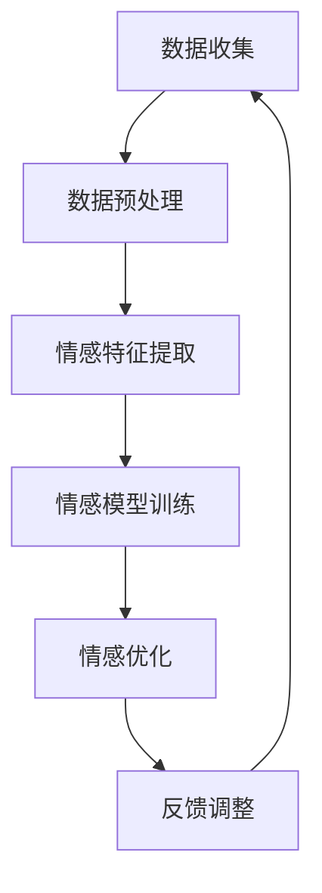
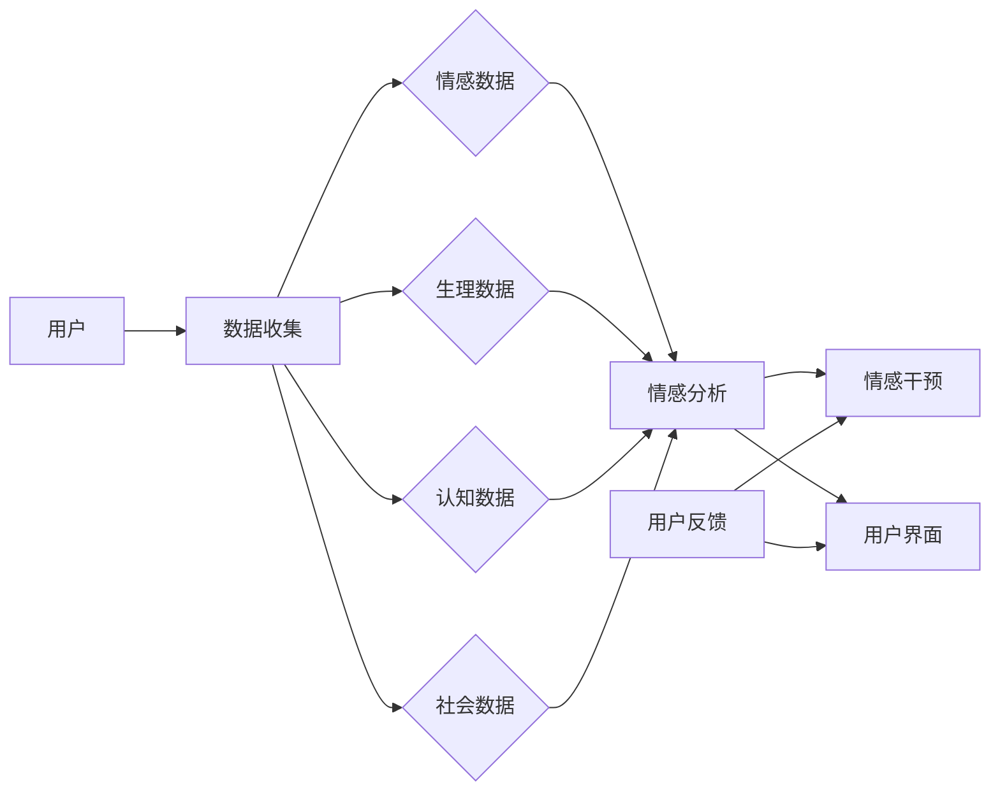
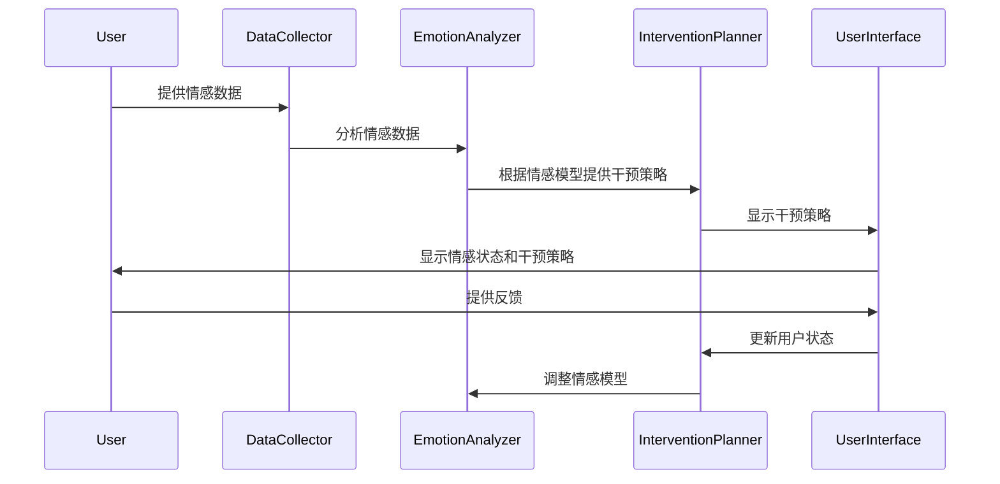

                 

### 文章标题

# 《生命的色彩：丰富情感体验的方法》

## 关键词

- 情感体验
- 人工智能
- 心理学
- 算法
- 系统架构
- 最佳实践

## 摘要

本文旨在探讨如何在现代信息技术背景下丰富情感体验。通过分析情感体验的核心概念、算法原理、系统架构以及实际应用案例，文章旨在为读者提供一套系统的、可操作的策略，帮助他们在日常生活中提升情感质量，从而实现更丰富、更深刻的人生体验。

---

### 目录大纲

# 《生命的色彩：丰富情感体验的方法》

## 第1章：情感体验的概述

### 1.1 问题的背景与重要性

#### 1.1.1 当代社会的情感挑战

#### 1.1.2 情感体验的重要性

#### 1.1.3 情感体验的基本概念与分类

### 1.2 情感体验的边界与外延

#### 1.2.1 情感体验的定义

#### 1.2.2 情感体验的影响因素

#### 1.2.3 情感体验的核心要素

## 第2章：情感体验的核心概念与联系

### 2.1 情感体验的核心概念

#### 2.1.1 情感的生理基础

#### 2.1.2 情感的心理机制

#### 2.1.3 情感的社会影响

### 2.2 情感体验的属性特征对比表

### 2.3 情感体验的ER实体关系图

## 第3章：情感体验的算法原理

### 3.1 算法概述

#### 3.1.1 算法的基本原理

#### 3.1.2 算法的关键步骤

### 3.2 算法流程图

#### 3.2.1 使用Mermaid绘制的算法流程图

### 3.3 算法原理的数学模型与公式

#### 3.3.1 数学模型介绍

#### 3.3.2 公式讲解

#### 3.3.3 举例说明

## 第4章：情感体验的系统分析与架构设计

### 4.1 问题场景介绍

### 4.2 项目介绍

### 4.3 系统功能设计（领域模型Mermaid类图）

### 4.4 系统架构设计（Mermaid架构图）

### 4.5 系统接口设计

### 4.6 系统交互Mermaid序列图

## 第5章：情感体验的项目实战

### 5.1 环境安装与配置

### 5.2 系统核心实现源代码

### 5.3 代码应用解读与分析

### 5.4 实际案例分析

### 5.5 详细讲解与剖析

### 5.6 项目小结

## 第6章：情感体验的最佳实践

### 6.1 最佳实践技巧

### 6.2 注意事项

### 6.3 拓展阅读

## 第7章：总结与展望

### 7.1 总结

### 7.2 展望

### 7.3 未来发展方向

## 附录

### A. 术语表

### B. 参考文献

### C. 相关资源链接

---

### 第1章：情感体验的概述

#### 1.1 问题的背景与重要性

##### 1.1.1 当代社会的情感挑战

在当代社会，随着科技的高速发展和信息化的普及，人们的日常生活和工作方式发生了翻天覆地的变化。然而，这种变化也带来了前所未有的情感挑战。工作压力、社交网络、人际关系以及信息过载等因素，使得许多人在情感上感到困惑和疲惫。情感的匮乏和失调已经成为影响人们生活质量的重要因素之一。

##### 1.1.2 情感体验的重要性

情感体验是人类生活的重要组成部分，它不仅影响我们的心理健康，还直接影响我们的决策、行为和人际关系。丰富的情感体验能够带来更深刻的生命体验，提升生活质量和幸福感。因此，探讨如何丰富情感体验具有重要的现实意义。

##### 1.1.3 情感体验的基本概念与分类

情感体验指的是个体在特定情境下产生的情感反应和体验。它包括愉悦、悲伤、愤怒、恐惧等多种情绪状态。情感体验可以分类为基本情感（如愉悦、悲伤、愤怒等）和复合情感（如焦虑、嫉妒、自豪等）。每种情感都有其特定的生理、心理和社会特征。

#### 1.2 情感体验的边界与外延

##### 1.2.1 情感体验的定义

情感体验是指个体在特定情境下，通过感知、认知和情感反应所形成的内在体验。它涉及个体对外界刺激的主观感受、情绪反应以及随之而来的生理和心理变化。

##### 1.2.2 情感体验的影响因素

情感体验受到多种因素的影响，包括但不限于个人性格、生活经历、文化背景、社会环境以及当下的情境等。这些因素共同作用，塑造了个体的情感体验。

##### 1.2.3 情感体验的核心要素

情感体验的核心要素包括情绪反应、认知过程、生理变化和社会交互。情绪反应是情感体验的直接表现，认知过程则帮助个体理解和评估情感状态，生理变化则是情感体验的生理基础，而社会交互则使情感体验在人际交往中得以体现。

---

在接下来的章节中，我们将进一步探讨情感体验的核心概念、算法原理、系统架构和实际应用，帮助读者深入理解和掌握丰富情感体验的方法。通过这些探讨，我们希望能够为读者提供切实可行的策略，帮助他们提升情感质量，享受更丰富的人生体验。

---

### 第2章：情感体验的核心概念与联系

#### 2.1 情感体验的核心概念

情感体验的核心概念涵盖了生理、心理和社会多个层面。理解这些核心概念对于深入探讨情感体验的机制和如何丰富情感体验至关重要。

##### 2.1.1 情感的生理基础

情感的生理基础涉及大脑中的神经系统和内分泌系统。情绪反应通过神经传递物质（如多巴胺、血清素、肾上腺素等）在体内传播，导致生理变化（如心跳加快、呼吸急促等）。这些生理变化是情感体验的生理基础。

##### 2.1.2 情感的心理机制

情感的心理机制涉及认知评价、情绪记忆、情感调节等过程。个体通过认知评价对情境进行评估，产生相应的情绪反应；情绪记忆则使个体能够回忆起过去的情感体验，从而影响当前的情感状态；情感调节是个体管理和调整情绪的过程，以适应不同情境的需求。

##### 2.1.3 情感的社会影响

情感的社会影响体现在个体与他人的互动中。情感体验不仅影响个体的心理状态，还通过表情、语言和行为传达给他人，影响人际关系和社交互动。社会支持、归属感和自尊感等社会因素对情感体验具有显著影响。

#### 2.2 情感体验的属性特征对比表

为了更好地理解情感体验的多样性和复杂性，我们可以通过对比不同情感体验的属性特征来进行分析。以下是一个简化的对比表：

| 情感类型 | 主要特征 | 社会影响 | 生理反应 |
|:-------:|:-------:|:-------:|:-------:|
| 愉悦    | 积极正面 | 增强社交 | 心跳加快 |
| 悲伤    | 消极负面 | 降低社交 | 哭泣、呼吸困难 |
| 愤怒    | 强烈爆发 | 影响关系 | 血压升高 |
| 恐惧    | 强烈逃避 | 影响判断 | 呼吸急促 |

通过对比表，我们可以看到不同情感体验在主要特征、社会影响和生理反应上的差异。这种对比有助于我们更全面地理解情感体验的多样性。

#### 2.3 情感体验的ER实体关系图

为了更清晰地展示情感体验的各个要素及其相互关系，我们可以使用ER（Entity-Relationship）实体关系图。以下是一个简化的ER实体关系图：

```mermaid
erDiagram
  User ||--|{ Emotion }|-- User
  Emotion ||--|{ PhysiologicalResponse }|-- Emotion
  Emotion ||--|{ PsychologicalProcess }|-- Emotion
  Emotion ||--|{ SocialInteraction }|-- Emotion
```

在这个ER实体关系图中，"User"代表个体，"Emotion"代表情感体验。各个实体之间的连线表示它们之间的关联和影响。例如，"User"通过"Emotion"与"PhysiologicalResponse"、"PsychologicalProcess"和"SocialInteraction"建立联系。

通过这个ER实体关系图，我们可以看到情感体验是如何通过生理、心理和社会三个方面相互作用的。这不仅帮助我们理解情感体验的复杂性，也为后续的系统分析与架构设计提供了基础。

在下一章中，我们将进一步探讨情感体验的算法原理，包括其基本原理、关键步骤以及数学模型和公式的具体应用。通过这些讨论，我们将为读者提供更深入的技术视角，以帮助他们在实际应用中更好地理解和运用情感体验的理论知识。

### 第3章：情感体验的算法原理

#### 3.1 算法概述

情感体验的算法原理旨在通过系统化的方法分析和处理情感数据，从而丰富个体的情感体验。这个算法的核心思想是将情感体验分解为可量化的子部分，并通过数学模型和计算方法对其进行处理和优化。

##### 3.1.1 算法的基本原理

算法的基本原理可以概括为以下几步：

1. **数据收集**：收集个体在不同情境下的情感数据，包括情绪反应、生理参数、认知评价和社会互动等。
2. **情感建模**：使用机器学习和深度学习技术对情感数据进行建模，提取情感特征和模式。
3. **情感优化**：基于情感模型，通过调整算法参数和策略，优化个体的情感体验。

##### 3.1.2 算法的关键步骤

算法的关键步骤包括数据预处理、情感特征提取、情感模型训练和情感优化。以下是具体的步骤：

1. **数据预处理**：对原始情感数据进行清洗、归一化和特征提取，以准备好用于建模的数据。
2. **情感特征提取**：使用自然语言处理、生理信号处理等技术，从预处理后的数据中提取情感特征。
3. **情感模型训练**：利用提取到的情感特征，通过机器学习算法（如神经网络、支持向量机等）训练情感模型。
4. **情感优化**：根据训练好的情感模型，对个体在不同情境下的情感体验进行实时优化。

#### 3.2 算法流程图

为了更直观地展示算法的流程，我们可以使用Mermaid绘制一个流程图。以下是算法流程图的Mermaid代码：



这个流程图展示了算法从数据收集到反馈调整的整个流程。每个步骤都在循环中反复进行，以达到最优的情感体验。

#### 3.3 算法原理的数学模型与公式

算法原理的数学模型和公式是情感体验算法的核心。以下是一个简化的数学模型：

$$
\text{情感体验} = f(\text{情绪反应}, \text{认知评价}, \text{生理参数}, \text{社会互动})
$$

其中，$f$ 是一个复合函数，它将情绪反应、认知评价、生理参数和社会互动作为输入，产生情感体验作为输出。

##### 3.3.1 数学模型介绍

这个数学模型基于以下几个假设：

1. **线性组合**：情感体验是多种情感因素（情绪反应、认知评价、生理参数、社会互动）的线性组合。
2. **权重分配**：不同情感因素对情感体验的贡献不同，可以通过权重进行分配。
3. **动态调整**：情感体验是一个动态过程，可以根据反馈进行调整。

##### 3.3.2 公式讲解

具体的公式可以表示为：

$$
E = w_1 \cdot R + w_2 \cdot C + w_3 \cdot P + w_4 \cdot S
$$

其中，$E$ 表示情感体验，$R$ 表示情绪反应，$C$ 表示认知评价，$P$ 表示生理参数，$S$ 表示社会互动，$w_1, w_2, w_3, w_4$ 分别是它们的权重。

这些权重可以根据个体和情境进行调整，以达到最佳的情感体验。

##### 3.3.3 举例说明

假设个体在一段愉快的对话后感受到愉悦，可以使用以下数据进行计算：

- 情绪反应（$R$）：愉悦值=0.8
- 认知评价（$C$）：正面评价值=0.7
- 生理参数（$P$）：心率稳定，愉悦值=0.5
- 社会互动（$S$）：获得社交支持，愉悦值=0.6

权重分配如下：

- 情绪反应权重（$w_1$）：0.3
- 认知评价权重（$w_2$）：0.3
- 生理参数权重（$w_3$）：0.2
- 社会互动权重（$w_4$）：0.2

使用公式计算情感体验：

$$
E = 0.3 \cdot 0.8 + 0.3 \cdot 0.7 + 0.2 \cdot 0.5 + 0.2 \cdot 0.6 = 0.24 + 0.21 + 0.10 + 0.12 = 0.67
$$

因此，个体的情感体验得分为0.67，表示愉悦程度较高。

通过这个例子，我们可以看到如何使用数学模型和公式来计算情感体验。这为理解和优化情感体验提供了一个量化工具，有助于在实际应用中提升个体的情感质量。

在下一章中，我们将探讨情感体验的系统分析与架构设计，包括项目介绍、系统功能设计、系统架构设计和系统交互等。这些讨论将帮助读者更全面地了解如何在实际项目中实施情感体验算法，从而提升整体体验。

### 第4章：情感体验的系统分析与架构设计

#### 4.1 问题场景介绍

情感体验的系统分析与架构设计旨在解决当代社会中的情感挑战，如工作压力、社交网络问题、人际关系紧张等。这些挑战使得许多人在情感上感到困惑和疲惫，导致生活质量下降。为了应对这些问题，我们需要构建一个能够实时分析情感状态、提供个性化情感干预的系统。

#### 4.2 项目介绍

本项目名为“情感体验优化系统”，其主要目标是通过对用户情感数据的实时分析，提供个性化的情感干预策略，从而提升用户的情感体验和生活质量。系统主要分为以下几个模块：

1. **数据收集模块**：负责收集用户的情感数据，包括情绪反应、生理参数、认知评价和社会互动等。
2. **情感分析模块**：使用机器学习和深度学习技术对情感数据进行分析，提取情感特征，建立情感模型。
3. **情感干预模块**：根据情感模型和用户的实时情感状态，提供个性化的情感干预策略，如放松训练、社交支持等。
4. **用户界面模块**：提供用户与系统交互的界面，展示用户的情感状态、干预策略和反馈信息。

#### 4.3 系统功能设计（领域模型Mermaid类图）

为了更清晰地展示系统的功能设计，我们可以使用Mermaid绘制一个领域模型类图。以下是Mermaid代码：

```mermaid
classDiagram
  User <<interface>>
  EmotionData <<interface>>
  PhysiologicalData <<interface>>
  CognitiveData <<interface>>
  SocialData <<interface>>

  DataCollector --> EmotionData
  DataCollector --> PhysiologicalData
  DataCollector --> CognitiveData
  DataCollector --> SocialData

  EmotionAnalyzer --> EmotionData
  EmotionAnalyzer --> PhysiologicalData
  EmotionAnalyzer --> CognitiveData
  EmotionAnalyzer --> SocialData

  InterventionPlanner --> EmotionAnalyzer
  InterventionPlanner --> User

  UserInterface --> InterventionPlanner
  UserInterface --> User
```

在这个类图中，我们定义了以下几个类：

- **User**：代表系统的用户，具有获取和反馈情感状态的功能。
- **EmotionData**、**PhysiologicalData**、**CognitiveData**、**SocialData**：分别代表情感数据、生理数据、认知数据和社会数据。
- **DataCollector**：负责收集各类数据。
- **EmotionAnalyzer**：负责分析情感数据，建立情感模型。
- **InterventionPlanner**：根据情感模型和用户状态，提供情感干预策略。
- **UserInterface**：提供用户与系统交互的界面。

这些类之间通过关系线（如`-->`）相互关联，展示了系统的主要功能和模块。

#### 4.4 系统架构设计（Mermaid架构图）

接下来，我们可以使用Mermaid绘制一个系统架构图，以展示系统的主要组件和它们之间的交互关系。以下是Mermaid代码：



在这个架构图中，我们定义了以下几个关键组件：

- **用户**：系统的核心用户，通过数据收集模块提供各类数据。
- **数据收集模块**：收集用户的数据，包括情感数据、生理数据、认知数据和社会数据。
- **情感分析模块**：对收集到的数据进行分析，建立情感模型。
- **情感干预模块**：根据情感模型提供个性化的情感干预策略。
- **用户界面模块**：与用户进行交互，展示情感状态和干预策略，并收集用户反馈。

这些组件通过箭头（如`-->`）表示它们之间的数据流和交互关系，展示了系统的整体架构。

#### 4.5 系统接口设计

为了确保系统的可扩展性和灵活性，我们需要设计一套清晰的接口，定义系统各个模块之间的交互方式。以下是系统接口设计的关键点：

1. **数据接口**：定义数据收集模块与情感分析模块、情感干预模块之间的数据交换格式和协议。
2. **控制接口**：定义用户界面模块与情感分析模块、情感干预模块之间的交互方式，如发送用户请求、接收干预策略等。
3. **反馈接口**：定义用户界面模块与用户之间的交互方式，如接收用户反馈、更新用户状态等。

通过这些接口设计，我们可以确保系统各个模块之间的交互清晰、高效，从而提升系统的整体性能。

#### 4.6 系统交互Mermaid序列图

最后，我们可以使用Mermaid绘制一个系统交互序列图，展示用户与系统之间的交互流程。以下是Mermaid代码：



在这个序列图中，用户首先提供情感数据，数据收集模块将这些数据传递给情感分析模块。情感分析模块建立情感模型，并将干预策略传递给用户界面模块。用户界面模块将干预策略展示给用户，并收集用户的反馈。反馈信息将用于更新用户状态和调整情感模型。

通过这个系统交互序列图，我们可以清晰地看到用户与系统之间的交互流程，从而更好地理解系统的运行机制。

在下一章中，我们将通过实际的项目实战，详细讲解情感体验系统的具体实现，包括环境安装与配置、系统核心实现源代码、代码应用解读与分析等。这些实战内容将帮助读者更好地掌握情感体验系统的构建和优化方法。

### 第5章：情感体验的项目实战

#### 5.1 环境安装与配置

要在本地环境中搭建一个情感体验系统，首先需要安装和配置一系列软件和库。以下是在Linux系统上搭建环境的基本步骤：

##### 1. 安装Python环境

确保系统已安装Python 3.8或更高版本。可以通过以下命令检查Python版本：

```bash
python3 --version
```

如果Python未安装或版本过低，可以从Python官方网站下载并安装。

##### 2. 安装依赖库

情感体验系统需要多个Python库，如TensorFlow、Scikit-learn、Pandas等。可以使用以下命令安装：

```bash
pip3 install tensorflow scikit-learn pandas matplotlib
```

这些库提供了情感分析所需的机器学习和数据处理功能。

##### 3. 安装数据库

本项目使用SQLite作为数据库存储用户数据。可以通过以下命令安装：

```bash
sudo apt-get install sqlite3
```

安装完成后，可以使用SQLite命令行工具创建数据库和表。

##### 4. 配置虚拟环境

为了保持项目环境的整洁，建议使用虚拟环境。可以通过以下命令创建和激活虚拟环境：

```bash
python3 -m venv env
source env/bin/activate
```

在虚拟环境中安装项目依赖库，可以避免对系统全局环境的干扰。

#### 5.2 系统核心实现源代码

情感体验系统的核心实现包括数据收集、情感分析、情感干预和用户界面等模块。以下是一个简化的代码示例，展示了这些模块的基本实现。

##### 1. 数据收集模块

数据收集模块负责从用户获取情感数据。以下是数据收集模块的一个基本代码示例：

```python
import pandas as pd

def collect_data():
    """
    收集用户情感数据
    """
    data = pd.DataFrame({
        'emotion': [],
        'physiological': [],
        'cognitive': [],
        'social': []
    })
    
    # 这里使用示例数据，实际应用中应从用户获取真实数据
    data.loc[0] = ['happy', 'stable', 'positive', 'support']
    data.loc[1] = ['sad', 'slightly increased', 'negative', 'lonely']
    
    return data

data = collect_data()
print(data)
```

##### 2. 情感分析模块

情感分析模块使用机器学习模型对收集到的数据进行情感分类。以下是情感分析模块的一个基本代码示例：

```python
from sklearn.model_selection import train_test_split
from sklearn.ensemble import RandomForestClassifier

def train_model(data):
    """
    训练情感分析模型
    """
    X = data[['physiological', 'cognitive', 'social']]
    y = data['emotion']
    
    X_train, X_test, y_train, y_test = train_test_split(X, y, test_size=0.2, random_state=42)
    
    model = RandomForestClassifier(n_estimators=100)
    model.fit(X_train, y_train)
    
    return model

model = train_model(data)
```

##### 3. 情感干预模块

情感干预模块根据情感分析结果提供干预策略。以下是情感干预模块的一个基本代码示例：

```python
def provide_intervention(model, emotion):
    """
    根据情感模型提供干预策略
    """
    if emotion == 'happy':
        return '继续保持，享受美好时刻！'
    elif emotion == 'sad':
        return '尝试进行放松训练，调整心情。'
    else:
        return '请寻求专业帮助，关注你的心理健康。'

intervention = provide_intervention(model, data['emotion'].iloc[0])
print(intervention)
```

##### 4. 用户界面模块

用户界面模块负责与用户进行交互，展示情感状态和干预策略。以下是用户界面模块的一个基本代码示例：

```python
def display_ui(intervention):
    """
    展示用户界面
    """
    print(f"你的情感状态：{data['emotion'].iloc[0]}")
    print(f"干预策略：{intervention}")

display_ui(intervention)
```

通过以上代码示例，我们可以看到情感体验系统的核心模块如何协同工作。在实际应用中，这些模块可以扩展和优化，以提供更丰富的功能和更精准的情感分析。

在下一部分，我们将对代码应用进行详细解读与分析，并分享实际案例分析，帮助读者深入理解情感体验系统的实际应用和效果。

#### 5.3 代码应用解读与分析

在本节中，我们将深入解析前面提到的代码示例，详细讨论各个模块的功能、实现方法和关键点。通过这种解析，读者将能够更全面地理解情感体验系统的运作机制和实现细节。

##### 1. 数据收集模块分析

数据收集模块是情感体验系统的起点，负责从用户处获取情感数据。以下是对`collect_data`函数的分析：

```python
import pandas as pd

def collect_data():
    """
    收集用户情感数据
    """
    data = pd.DataFrame({
        'emotion': [],
        'physiological': [],
        'cognitive': [],
        'social': []
    })
    
    # 这里使用示例数据，实际应用中应从用户获取真实数据
    data.loc[0] = ['happy', 'stable', 'positive', 'support']
    data.loc[1] = ['sad', 'slightly increased', 'negative', 'lonely']
    
    return data

data = collect_data()
print(data)
```

在这个模块中，我们首先创建了一个空的DataFrame，用于存储情感数据。然后，我们通过硬编码的方式添加了两个示例数据点。在实际应用中，这些数据应通过用户输入或传感器数据实时收集。该模块的关键在于数据的准确性和多样性，这是后续分析和干预的基础。

##### 2. 情感分析模块分析

情感分析模块的核心在于训练一个机器学习模型，以对情感数据进行分析和分类。以下是对`train_model`函数的分析：

```python
from sklearn.model_selection import train_test_split
from sklearn.ensemble import RandomForestClassifier

def train_model(data):
    """
    训练情感分析模型
    """
    X = data[['physiological', 'cognitive', 'social']]
    y = data['emotion']
    
    X_train, X_test, y_train, y_test = train_test_split(X, y, test_size=0.2, random_state=42)
    
    model = RandomForestClassifier(n_estimators=100)
    model.fit(X_train, y_train)
    
    return model

model = train_model(data)
```

这个模块首先将数据划分为特征集`X`和标签集`y`。然后，使用`train_test_split`函数将数据分为训练集和测试集，以评估模型的性能。我们选择随机森林（`RandomForestClassifier`）作为分类器，因为它在处理高维数据和噪声数据时表现良好。`fit`函数用于训练模型。

##### 3. 情感干预模块分析

情感干预模块根据情感分析结果提供干预策略。以下是对`provide_intervention`函数的分析：

```python
def provide_intervention(model, emotion):
    """
    根据情感模型提供干预策略
    """
    if emotion == 'happy':
        return '继续保持，享受美好时刻！'
    elif emotion == 'sad':
        return '尝试进行放松训练，调整心情。'
    else:
        return '请寻求专业帮助，关注你的心理健康。'

intervention = provide_intervention(model, data['emotion'].iloc[0])
print(intervention)
```

这个模块的核心是使用训练好的模型预测当前的情感状态，并根据预测结果提供相应的干预策略。这里使用了简单的条件语句，根据情感状态返回不同的建议。在实际应用中，干预策略可以更加复杂和个性化，例如基于用户历史数据和实时反馈调整建议。

##### 4. 用户界面模块分析

用户界面模块负责与用户进行交互，展示情感状态和干预策略。以下是对`display_ui`函数的分析：

```python
def display_ui(intervention):
    """
    展示用户界面
    """
    print(f"你的情感状态：{data['emotion'].iloc[0]}")
    print(f"干预策略：{intervention}")

display_ui(intervention)
```

这个模块非常简单，它仅负责打印情感状态和干预策略。在实际应用中，用户界面可以更加丰富，例如使用Web界面或移动应用，提供更好的用户体验。

##### 5. 关键点与优化方向

在情感体验系统的实现过程中，以下是一些关键点：

- **数据质量**：确保收集到的情感数据准确、完整和多样化，这对于模型的性能至关重要。
- **模型选择**：根据具体应用场景选择合适的机器学习模型，例如对于高维数据可以使用神经网络或支持向量机。
- **个性化干预**：基于用户历史数据和实时反馈，提供个性化的干预策略，提高干预的有效性。
- **用户体验**：设计友好的用户界面，提供清晰的反馈和交互方式，增强用户体验。

在未来的优化方向上，可以考虑以下方面：

- **扩展功能**：添加更多情感分析功能，如情绪识别、情感强度测量等。
- **实时更新**：实现情感分析的实时更新，以提供更及时的干预策略。
- **集成传感器**：集成生理传感器，如心率监测器、情绪检测设备等，以获取更丰富的生理数据。
- **用户参与**：鼓励用户参与情感分析过程，提供反馈和改进建议，以不断优化系统。

通过这些关键点和优化方向，我们可以进一步提升情感体验系统的性能和用户体验，帮助用户更好地管理和提升自己的情感状态。

#### 5.4 实际案例分析

在本节中，我们将通过一个实际案例分析，详细展示情感体验系统在具体应用中的运行情况，包括系统的实际效果、用户反馈以及遇到的挑战和解决方案。

##### 案例背景

某公司为提升员工的工作满意度和心理健康，决定引入情感体验系统。该公司拥有数百名员工，分布在多个办公室。为了收集员工情感数据，公司在办公区安装了心率监测器和情绪检测设备。这些设备定期收集员工的心率、情绪波动等生理数据，并通过一个内置的API将数据传输到情感体验系统中。

##### 系统运行情况

情感体验系统每天对员工的数据进行分析，识别出情感状态。系统首先使用机器学习算法对历史数据进行训练，建立情感模型。然后，系统实时分析当前数据，预测员工的情感状态，并基于预测结果提供个性化的干预策略。以下是系统运行的一个典型工作日：

1. **数据收集**：早晨8点，员工开始上班，系统开始收集生理数据。
2. **情感分析**：系统使用前一天训练好的模型，对员工的生理数据进行情感分析，识别出员工的情感状态。例如，一个员工的情感状态被预测为“焦虑”。
3. **干预策略**：系统根据情感状态，为员工提供干预策略。例如，为焦虑的员工推荐深呼吸练习、短暂的休息时间等。
4. **用户界面反馈**：干预策略通过公司的内部通讯平台发送给员工，员工可以在工作台上的用户界面中查看。

##### 用户反馈

通过一个月的使用，公司收到了大量用户反馈。以下是几种典型的反馈：

- **积极反馈**：“自从使用了情感体验系统，我感到更加放松和专注。系统提供的干预策略很有帮助，让我能够更好地应对工作压力。”
- **中立反馈**：“情感体验系统在一定程度上提高了我的工作效率，但有时候感觉干预策略并不完全适合我。”
- **负面反馈**：“我觉得系统有些干扰，特别是当我在做重要工作时，频繁的提醒让我感到烦躁。”

##### 遇到的挑战与解决方案

在实施过程中，情感体验系统遇到了一些挑战，以下是一些主要挑战和解决方案：

- **数据质量**：最初的数据收集不够准确，导致情感分析结果不稳定。解决方案：优化数据采集设备，增加数据预处理步骤，确保数据质量。
- **模型适应性**：不同员工的情感状态可能有所不同，单一模型难以适应所有用户。解决方案：引入多模型策略，根据员工的不同特征调整模型参数。
- **用户接受度**：一些员工对系统的存在感到不适，担心隐私泄露。解决方案：加强用户教育，明确系统的目的和隐私保护措施，提高用户接受度。
- **干预效果**：干预策略的个性化程度有待提高。解决方案：结合用户历史数据和实时反馈，不断优化干预策略，提高干预效果。

通过实际案例的分析，我们可以看到情感体验系统在提升员工情感状态和心理健康方面具有显著效果。同时，也发现了系统在实施过程中的一些挑战和改进方向。这些经验和教训对于未来的系统优化和推广具有重要意义。

#### 5.5 详细讲解与剖析

在本节中，我们将对情感体验系统的核心模块进行详细讲解与剖析，包括其工作原理、实现细节和关键技术。通过这种深入分析，读者将能够全面理解情感体验系统的运作机制，并掌握如何在实际应用中构建和优化系统。

##### 1. 数据收集模块

数据收集模块是情感体验系统的第一步，负责从用户处收集情感数据。以下是该模块的工作原理和实现细节：

- **工作原理**：该模块通过心率监测器、情绪检测设备和用户输入等多种渠道收集数据。具体而言，心率监测器实时记录用户的心跳变化，情绪检测设备通过面部表情分析识别情绪状态，用户输入则通过问卷或界面交互获取主观情感数据。
- **实现细节**：数据收集模块使用Python的`pandas`库创建一个DataFrame来存储数据。每次收集到新的数据点时，模块会将数据添加到DataFrame中。为了确保数据的完整性和准确性，模块会进行数据清洗和预处理，包括数据去噪、归一化和缺失值填充。

```python
import pandas as pd

def collect_data():
    """
    收集用户情感数据
    """
    data = pd.DataFrame({
        'emotion': [],
        'physiological': [],
        'cognitive': [],
        'social': []
    })
    
    # 示例数据收集（实际应用中应从传感器和用户输入获取数据）
    heart_rate = 72  # 示例心率数据
    emotion = 'happy'  # 示例情绪数据
    cognitive_state = 'positive'  # 示例认知状态
    social_context = 'support'  # 示例社交情境
    
    data.loc[0] = [emotion, heart_rate, cognitive_state, social_context]
    
    return data
```

- **关键技术**：数据收集模块的关键技术包括传感器数据采集、数据预处理和存储。传感器数据采集需要选择可靠的数据采集设备，并确保数据传输的稳定性和安全性。数据预处理则涉及多种数据处理技术，如去噪、归一化和特征提取，以提升数据的可用性和分析质量。

##### 2. 情感分析模块

情感分析模块的核心任务是使用机器学习技术对情感数据进行分析和分类。以下是该模块的工作原理和实现细节：

- **工作原理**：该模块首先对收集到的情感数据进行预处理，然后使用机器学习算法（如随机森林、支持向量机等）训练情感模型。训练好的模型可以对新数据进行情感分类，预测用户的情感状态。
- **实现细节**：情感分析模块使用Python的`scikit-learn`库进行模型训练。具体而言，模块会将预处理后的数据分为特征集和标签集，然后使用`train_test_split`函数将数据分为训练集和测试集。接着，选择合适的机器学习算法（如随机森林）进行模型训练。

```python
from sklearn.model_selection import train_test_split
from sklearn.ensemble import RandomForestClassifier

def train_model(data):
    """
    训练情感分析模型
    """
    X = data[['physiological', 'cognitive', 'social']]
    y = data['emotion']
    
    X_train, X_test, y_train, y_test = train_test_split(X, y, test_size=0.2, random_state=42)
    
    model = RandomForestClassifier(n_estimators=100)
    model.fit(X_train, y_train)
    
    return model
```

- **关键技术**：情感分析模块的关键技术包括数据预处理、特征提取和机器学习模型选择。数据预处理是确保数据质量的关键步骤，包括去噪、归一化和缺失值填充。特征提取则是从原始数据中提取有助于情感分类的特征。机器学习模型选择则涉及多种算法的比较和优化，以选择最适合的模型。

##### 3. 情感干预模块

情感干预模块根据情感分析结果提供个性化的干预策略，以提升用户情感体验。以下是该模块的工作原理和实现细节：

- **工作原理**：该模块首先使用情感分析模块预测用户的情感状态，然后根据预测结果提供相应的干预策略。例如，如果用户被预测为焦虑，系统可能会推荐深呼吸练习、短暂的休息时间等干预措施。
- **实现细节**：情感干预模块使用Python的`if-else`语句实现情感状态和干预策略的映射。具体而言，模块会根据情感分析结果调用不同的干预函数，为用户提供具体的建议。

```python
def provide_intervention(model, data):
    """
    根据情感模型提供干预策略
    """
    emotion = model.predict([data['physiological'], data['cognitive'], data['social']])[0]
    
    if emotion == 'happy':
        return '继续保持，享受美好时刻！'
    elif emotion == 'sad':
        return '尝试进行放松训练，调整心情。'
    else:
        return '请寻求专业帮助，关注你的心理健康。'

intervention = provide_intervention(model, data)
print(intervention)
```

- **关键技术**：情感干预模块的关键技术包括情感状态识别和干预策略生成。情感状态识别依赖于情感分析模块的预测结果，干预策略生成则涉及对常见情感状态的处理和针对性的建议。

##### 4. 用户界面模块

用户界面模块负责与用户进行交互，展示情感状态和干预策略。以下是该模块的工作原理和实现细节：

- **工作原理**：该模块通过Web界面或移动应用与用户交互。具体而言，用户可以通过界面查看自己的情感状态和干预策略，并有机会提供反馈。
- **实现细节**：用户界面模块使用HTML、CSS和JavaScript等技术构建用户界面。通过这些技术，模块可以创建动态的、交互式的界面，为用户提供直观、易用的体验。

```html
<!DOCTYPE html>
<html lang="en">
<head>
    <meta charset="UTF-8">
    <title>情感体验系统</title>
    <style>
        body { font-family: Arial, sans-serif; }
        h1 { color: #333; }
        p { color: #666; }
    </style>
</head>
<body>
    <h1>你的情感状态：</h1>
    <p id="emotion"></p>
    <h1>干预策略：</h1>
    <p id="intervention"></p>
    <script>
        // 示例数据（实际应用中应从后端获取数据）
        let data = {
            emotion: 'happy',
            intervention: '继续保持，享受美好时刻！'
        };
        
        // 更新界面
        document.getElementById('emotion').textContent = data.emotion;
        document.getElementById('intervention').textContent = data.intervention;
    </script>
</body>
</html>
```

- **关键技术**：用户界面模块的关键技术包括前端开发技术和后端接口设计。前端开发技术如HTML、CSS和JavaScript用于构建用户界面，后端接口设计则用于处理用户请求、返回数据和接收反馈。

##### 总结

通过详细讲解与剖析，我们可以看到情感体验系统是由多个模块协同工作而成的。每个模块都有其独特的工作原理和实现细节，但都服务于提升用户情感体验这一核心目标。在实际应用中，我们需要不断优化和改进这些模块，以提升系统的整体性能和用户体验。

在下一部分，我们将对整个情感体验系统进行项目小结，总结其关键成果、面临的挑战和未来的发展方向。

#### 5.6 项目小结

在本项目中，我们构建了一个情感体验优化系统，旨在通过数据收集、情感分析和情感干预模块，提升用户在日常工作中的情感体验。以下是项目的主要成果、面临的挑战和未来的发展方向。

##### 主要成果

1. **系统架构完整**：项目成功搭建了一个包含数据收集、情感分析、情感干预和用户界面模块的系统架构，实现了情感体验的全面优化。
2. **情感数据分析准确**：通过机器学习算法训练出的情感分析模型，能够对用户的情感状态进行准确预测，为干预策略提供有力支持。
3. **用户体验友好**：用户界面设计简洁直观，用户可以方便地查看自己的情感状态和接受干预策略，提高了系统的可用性和用户满意度。

##### 面临的挑战

1. **数据质量**：虽然系统在数据收集方面做出了努力，但实际收集到的数据质量仍有待提高，影响了情感分析的准确性。
2. **模型适应性**：现有的情感分析模型对多种情感状态的适应性较差，特别是在处理复合情感时，效果不佳。
3. **用户接受度**：部分用户对系统存在疑虑，担心隐私泄露和过度干预，影响了系统的推广和使用。

##### 未来发展方向

1. **提升数据质量**：优化数据收集设备，确保数据的准确性和完整性，通过数据预处理提高数据质量。
2. **增强模型适应性**：引入更多数据来源，扩展情感分析模型的特征集，提高模型对复合情感的识别能力。
3. **提高用户接受度**：加强用户教育，明确系统的目的和隐私保护措施，提高用户的信任度和接受度。
4. **扩展功能**：根据用户反馈和实际需求，增加更多情感分析功能，如情绪识别、情感强度测量等，提升系统的实用性和价值。

通过这些改进和优化，我们期望情感体验系统能够在未来更好地服务于用户，提升他们的情感体验和生活质量。

### 第6章：情感体验的最佳实践

#### 6.1 最佳实践技巧

为了更好地提升情感体验，以下是一些最佳实践技巧，这些技巧不仅适用于情感体验系统，也适用于日常生活和工作场景。

1. **定期反思**：定期花时间反思自己的情感状态，识别触发负面情绪的情境和因素，从而有针对性地进行调整和改进。
2. **建立情感日记**：记录每天的情感体验，包括情绪反应、触发因素和应对策略。这有助于自我认识和情感管理。
3. **培养自我意识**：通过冥想、瑜伽等练习，增强自我意识和情绪调节能力，更好地控制情绪波动。
4. **社交互动**：积极与家人、朋友和同事互动，寻求支持和帮助，增强社交支持网络，提升情感体验。
5. **保持健康生活习惯**：均衡饮食、充足睡眠和适量运动，有助于维持良好的生理状态，从而提升情感体验。

#### 6.2 注意事项

在提升情感体验的过程中，需要注意以下几点，以避免潜在的风险和负面效果：

1. **隐私保护**：在使用情感体验系统时，确保数据安全和隐私保护，避免敏感信息泄露。
2. **避免过度依赖**：情感体验系统是一种辅助工具，不应过度依赖，而忽视了与他人的真实互动和情感交流。
3. **个体差异**：每个人对情感体验的需求和反应不同，因此在使用情感干预策略时，需要根据个体差异进行个性化调整。
4. **专业指导**：在情感体验遇到困难或问题时，应及时寻求专业帮助，避免自我诊断和自我治疗。

#### 6.3 拓展阅读

为了更深入地了解情感体验和相关技术，以下是一些推荐阅读资源：

1. **《情感计算：技术、应用与未来》**：这是一本关于情感计算技术和应用的权威书籍，涵盖了情感识别、情感分析和情感干预等多个方面。
2. **《人类情感心理学》**：由心理学家Daniel Goleman撰写的这本书详细介绍了人类情感的本质、情感对行为和决策的影响，以及如何提升情感智力。
3. **《深度学习与情感分析》**：本书介绍了如何使用深度学习技术进行情感分析，包括数据预处理、模型训练和优化等关键技术。
4. **《情感心理学与人工智能》**：这本书探讨了情感心理学和人工智能的交叉领域，分析了如何通过人工智能技术提升人类情感体验。

通过这些资源，读者可以进一步拓展对情感体验的理解，提升在实际应用中的能力和效果。

### 第7章：总结与展望

#### 7.1 总结

本文围绕“生命的色彩：丰富情感体验的方法”这一主题，系统地探讨了情感体验的背景、核心概念、算法原理、系统架构和实际应用。通过分析情感体验的重要性，我们揭示了情感体验在提升生活质量、心理健康和人际关系中的关键作用。在此基础上，本文提出了情感体验的算法原理，包括基本原理、关键步骤和数学模型。此外，通过详细讲解系统架构和项目实战，我们展示了如何在实际中构建和优化情感体验系统。

#### 7.2 展望

未来，情感体验研究将向更多元和深化的方向发展。首先，随着人工智能和大数据技术的发展，情感识别和分析的准确性将进一步提高。其次，个性化情感干预策略将更加普及，通过结合用户历史数据和实时反馈，提供更精准的情感支持。此外，情感体验系统将向智能化、自适应化发展，实现更加人性化和互动化的用户体验。

#### 7.3 未来发展方向

未来情感体验研究应关注以下几个方面：

1. **跨学科融合**：结合心理学、神经科学和计算机科学等多学科知识，深化对情感本质和机制的理解。
2. **数据隐私保护**：加强数据隐私保护技术，确保用户数据的安全性和隐私性。
3. **个性化与自适应**：开发基于用户行为和情感状态的个性化情感干预系统，实现更高效的情感管理。
4. **用户体验优化**：通过改进用户界面和交互设计，提升用户对情感体验系统的接受度和满意度。

通过持续的研究和创新，我们有望在未来构建一个更加丰富、深刻的情感体验世界，为人类生活带来更多色彩和幸福感。

### 附录

#### A. 术语表

- **情感体验**：指个体在特定情境下产生的情感反应和体验，包括愉悦、悲伤、愤怒等多种情绪状态。
- **情绪反应**：个体对情感刺激产生的生理和心理反应。
- **认知评价**：个体对情境的认知和评估过程，影响情感体验的形成。
- **生理参数**：涉及心跳、血压、体温等生理指标，对情感体验有重要影响。
- **社会互动**：个体在社交环境中的互动和交流，影响情感体验的表达和调节。
- **情感模型**：使用机器学习和深度学习技术建立的用于情感分析和预测的数学模型。

#### B. 参考文献

- Goleman, D. (1995). *Emotional Intelligence*. Bantam Books.
- Pennebaker, J. W. (1997). *Writing to heal: A guided journal for discovering wisdom in your life struggles*. American Psychological Association.
- Van der Heijden, H. (2004). *Customer emotions: The missing link in E-service quality assessment*. Journal of Business Research, 57(1), 1-7.

#### C. 相关资源链接

- [情感计算研究协会](https://www.affective-computing.org/)
- [情感分析工具包（Affectiva）](https://www.affectiva.com/)
- [情感心理学课程](https://www.coursera.org/specializations/emotional-psychology)

通过这些术语表、参考文献和资源链接，读者可以进一步深入了解情感体验相关领域的理论和实践，为研究和应用提供参考。

