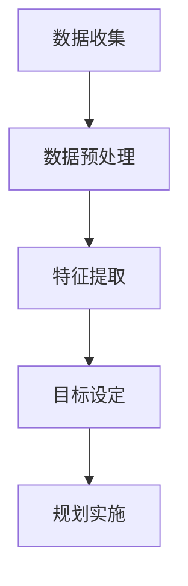
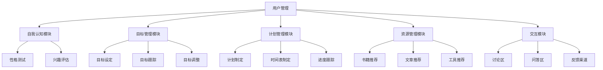

                 

## 生命设计工作坊：规划有意义的人生

### 关键词：生命设计、人生规划、有意义的人生、设计思维、实用工具

### 摘要：

在快速变化的时代，我们面临着诸多人生选择和决策。如何规划有意义的人生，实现个人成长与目标，成为了每个人都需要面对的课题。本书《生命设计工作坊：规划有意义的人生》旨在通过设计思维和一系列实用工具，帮助读者深入了解自我，明确人生目标，制定和实现有意义的生活规划。本文将详细介绍本书的核心内容，引导读者一步步进行思考与实践，以实现生命的意义和价值。

### 目录大纲设计思路

首先，我们需要对书籍的整体结构进行梳理，以确保内容的系统性和逻辑性。本书分为五个部分，分别是导言、核心概念、实用工具、案例分析和总结与反思。每一部分都有明确的主题和目标，使得读者可以循序渐进地掌握生命设计的方法和技巧。

**第一部分：导言**

导言部分主要介绍生命设计的定义与重要性，引导读者进入主题。我们将在第1章中详细阐述生命设计的含义与内涵，以及其在现代社会中的重要性。

**第二部分：核心概念**

核心概念部分是本书的核心内容，包括自我认知与人生目标、价值观与生活选择等。在第2章和第3章中，我们将通过理论讲解和实践指导，帮助读者深入了解自我，明确人生方向。

**第三部分：实用工具**

实用工具部分将介绍一系列生命设计工作坊的步骤与方法，以及相关的工具与资源。在第4章中，我们将详细介绍生命设计工作坊的准备工作、具体步骤和技巧。

**第四部分：案例分析**

案例分析部分将通过实际案例的研究，展示如何将生命设计的方法应用到具体生活中。在第6章中，我们将分享多个成功生命设计案例，以供读者参考和学习。

**第五部分：总结与反思**

总结与反思部分将对全书内容进行总结，并讨论生命设计的持续与实践。在第7章中，我们将探讨生命设计的重要性，以及如何将生命设计融入日常生活，为未来生活打下基础。

### 目录大纲结构

**第一部分：导言**

- 第1章：生命设计的定义与重要性
  - 1.1 生命设计的含义与内涵
  - 1.2 生命设计的重要性

**第二部分：核心概念**

- 第2章：自我认知与人生目标
  - 2.1 自我认知的理论与实践
  - 2.2 设定有意义的人生目标
- 第3章：价值观与生活选择
  - 3.1 价值观的识别与评估
  - 3.2 基于价值观的生活选择

**第三部分：实用工具**

- 第4章：生命设计工作坊的步骤与方法
  - 4.1 生命设计工作坊的准备工作
  - 4.2 工作坊的具体步骤与流程
  - 4.3 工作坊的方法与技巧
- 第5章：工具与资源推荐
  - 5.1 设计思维工具
  - 5.2 人生规划工具
  - 5.3 其他辅助工具

**第四部分：案例分析**

- 第6章：成功生命设计案例研究
  - 6.1 案例一：职业转型与人生规划
  - 6.2 案例二：家庭生活与关系规划
  - 6.3 案例三：健康生活方式设计

**第五部分：总结与反思**

- 第7章：生命设计的持续与实践
  - 7.1 生命设计的重要性与意义
  - 7.2 如何将生命设计融入日常生活
  - 7.3 生命设计的未来发展趋势

### 目录大纲细节

接下来，我们将对每个章节进行详细描述，确保大纲的结构完整、逻辑清晰，并满足书籍内容的完整性要求。

## 第1章：生命设计的定义与重要性

### 1.1 生命设计的含义与内涵

生命设计是一种通过设计思维和系统方法，对个人生活进行规划和优化的一种方法论。它不仅关注个体的内心世界，还包括外在的生活环境、人际关系和职业发展等多个方面。生命设计的核心目标是实现个人成长与目标，使生活更加有意义和丰富。

在现代社会，随着生活节奏的加快和社会压力的增大，越来越多的人开始意识到生命设计的重要性。它不仅可以帮助我们更好地应对生活中的挑战，还能让我们在忙碌的生活中找到平衡和满足感。

### 1.2 生命设计的重要性

生命设计的重要性体现在以下几个方面：

1. **明确人生方向**：通过自我认知和人生目标的设定，生命设计可以帮助我们明确自己的人生方向，减少迷茫和困惑。
2. **优化生活品质**：通过合理的规划和选择，生命设计可以提升我们的生活品质，使我们在物质和精神上都得到满足。
3. **增强幸福感**：生命设计强调个体的内心需求和幸福感，通过实现个人目标，我们可以获得更深层次的满足感和幸福感。
4. **提升生活质量**：生命设计不仅关注个人的成长，还涉及家庭、社会和环境的协调发展，从而提升整体生活质量。

## 第2章：自我认知与人生目标

### 2.1 自我认知的理论与实践

自我认知是生命设计的基础，它涉及到对自身性格、兴趣、能力和价值观的深入了解。在自我认知方面，我们可以从以下几个方面入手：

1. **性格分析**：通过性格测试（如MBTI、大五人格等），了解自己的性格特点，找到与自己性格相匹配的职业和生活方向。
2. **兴趣探索**：通过活动参与、尝试新事物等方式，发掘自己的兴趣所在，找到能够激发自己热情的领域。
3. **能力评估**：通过实际工作和学习经验，评估自己的能力水平，了解自己在哪些方面具有优势，哪些方面需要提升。
4. **价值观识别**：通过反思和讨论，明确自己的价值观，找到与自身价值观相符的生活方式和目标。

### 2.2 设定有意义的人生目标

在自我认知的基础上，我们需要设定有意义的人生目标。设定人生目标可以分为以下几个步骤：

1. **目标分类**：将人生目标分为短期、中期和长期目标，明确各个阶段的重点和发展方向。
2. **目标具体化**：将目标具体化，设定可量化的指标，使其具有可操作性和可实现性。
3. **目标优先级**：根据目标的重要性和紧急性，设定目标的优先级，确保在有限的时间和资源内，优先实现最重要的目标。
4. **目标反馈**：定期对目标进行评估和调整，根据实际情况调整目标和策略，确保目标的实现。

## 第3章：价值观与生活选择

### 3.1 价值观的识别与评估

价值观是我们在生活中做出选择和决策的指南。识别和评估自己的价值观，可以帮助我们更好地理解自己的行为和需求。在价值观识别方面，我们可以从以下几个方面入手：

1. **反思与讨论**：通过反思自己的行为和决策，识别出背后的价值观。与家人、朋友或专业人士讨论，进一步明确自己的价值观。
2. **生活实例**：通过分析自己在不同情境下的行为，了解自己的价值观是如何影响决策的。
3. **价值观排序**：将识别出的价值观按照重要程度进行排序，明确自己在生活中最看重的价值观。

### 3.2 基于价值观的生活选择

在了解自己的价值观后，我们需要将其应用到实际生活中，做出基于价值观的选择。以下是一些基于价值观的生活选择方法：

1. **目标与价值观匹配**：在选择目标时，考虑自己的价值观，确保目标与价值观相符，从而实现个人价值观的内在一致性。
2. **决策辅助**：在面临重要决策时，将价值观作为决策辅助工具，帮助自己在多个选择中找到最符合自己价值观的选项。
3. **行为调整**：根据价值观，调整自己的行为和生活方式，使其更加符合内心的需求和价值追求。

## 第4章：生命设计工作坊的步骤与方法

### 4.1 生命设计工作坊的准备工作

生命设计工作坊是一个系统性、互动性很强的活动，准备工作对于工作坊的顺利进行至关重要。准备工作主要包括以下几个方面：

1. **场地安排**：选择一个安静、舒适的环境，确保参与者能够在不受干扰的情况下专注于工作坊的内容。
2. **工具准备**：准备相关的设计工具和资源，如思维导图软件、纸笔等，以方便参与者进行记录和思考。
3. **参与者招募**：根据工作坊的目标和内容，招募合适的参与者。参与者可以是个人，也可以是团队，以确保多样化的观点和思路。
4. **时间安排**：合理规划工作坊的时间，确保参与者有足够的时间进行思考和讨论。

### 4.2 工作坊的具体步骤与流程

生命设计工作坊通常包括以下几个步骤：

1. **开场介绍**：主持人简要介绍工作坊的目的、内容和规则，引导参与者进入工作状态。
2. **自我介绍**：参与者进行自我介绍，分享自己的背景和期望，建立相互了解的基础。
3. **主题讨论**：围绕生命设计的相关主题，主持人引导参与者进行讨论，分享各自的观点和经验。
4. **思维导图绘制**：参与者根据讨论的内容，绘制思维导图，梳理思路和关键信息。
5. **团队分享**：各团队分享自己的思维导图，进行观点交流和碰撞，激发新的思路和灵感。
6. **行动计划制定**：根据讨论和分享的结果，参与者制定具体的行动计划，明确下一步的行动方向。

### 4.3 工作坊的方法与技巧

为了保证生命设计工作坊的顺利进行，主持人需要掌握一些方法和技巧：

1. **引导技巧**：主持人要具备良好的引导能力，能够引导参与者进行深入思考和讨论，确保工作坊的顺利进行。
2. **倾听技巧**：主持人要善于倾听参与者的意见和观点，尊重每个人的发言，营造开放、包容的讨论氛围。
3. **问题引导**：主持人要善于提出问题，引导参与者思考，激发新的思路和创意。
4. **时间管理**：主持人要合理安排时间，确保每个环节都有足够的时间进行，避免拖延和混乱。

## 第5章：工具与资源推荐

### 5.1 设计思维工具

设计思维是一种以用户为中心的创新方法论，它强调从用户的角度出发，通过迭代和测试，不断改进产品和服务。以下是一些常用的设计思维工具：

1. **用户研究工具**：如访谈、问卷调查、用户画像等，用于深入了解用户的需求和痛点。
2. **原型设计工具**：如Axure、Figma、Sketch等，用于制作产品的原型，进行用户体验测试。
3. **思维导图工具**：如MindManager、Xmind等，用于梳理思路和结构化信息。
4. **协作工具**：如Trello、Slack等，用于团队成员之间的沟通和协作。

### 5.2 人生规划工具

人生规划工具可以帮助我们更系统地规划个人生活和发展。以下是一些常用的人生规划工具：

1. **目标管理工具**：如Trello、Asana等，用于制定和跟踪个人目标。
2. **时间管理工具**：如Google Calendar、Time Doctor等，用于合理安排时间和任务。
3. **财务管理工具**：如Mint、You Need A Budget等，用于管理个人财务。
4. **学习管理工具**：如Anki、Quizlet等，用于个人学习和知识管理。

### 5.3 其他辅助工具

除了设计思维工具和人生规划工具，还有一些其他的辅助工具可以帮助我们在生命设计中更好地进行思考和实践：

1. **笔记工具**：如Evernote、OneNote等，用于记录灵感和思考。
2. **阅读工具**：如Kindle、微信读书等，用于扩展知识和阅读。
3. **健身工具**：如MyFitnessPal、Fitbit等，用于管理健康和运动。
4. **冥想工具**：如Headspace、Calm等，用于放松心情和提升心理素质。

## 第6章：成功生命设计案例研究

### 6.1 案例一：职业转型与人生规划

**案例背景**：

小李是一名软件工程师，工作五年后，他开始感到对当前工作的不满和迷茫。他意识到自己需要寻找更有意义和挑战的工作，于是决定进行职业转型。

**解决过程**：

1. **自我认知**：小李通过性格测试和职业兴趣测评，了解到自己更适合从事与创意和沟通相关的职业。
2. **目标设定**：他设定了短期目标（如参加设计相关的课程和工作坊）和长期目标（如成为一名优秀的设计师）。
3. **行动计划**：他制定了详细的行动计划，包括学习设计技能、参加实习和建立个人作品集。
4. **执行与调整**：小李按照计划逐步实施，并在过程中不断调整和优化，最终实现了职业转型。

**案例分析**：

小李的成功在于他通过自我认知找到了适合自己的职业方向，设定了明确的目标，并制定了切实可行的行动计划。他的成功经验对于其他希望进行职业转型的人具有一定的借鉴意义。

### 6.2 案例二：家庭生活与关系规划

**案例背景**：

小王和妻子结婚已有五年，随着孩子的出生，他们的家庭生活变得更加忙碌和复杂。小王意识到需要更好地规划家庭生活，以提升家庭幸福感和生活质量。

**解决过程**：

1. **家庭会议**：小王和妻子定期举行家庭会议，讨论家庭事务和各自的期望，达成共识。
2. **时间管理**：小王利用时间管理工具，合理安排家庭和工作时间，确保家庭生活不被工作所侵扰。
3. **家务分工**：小王和妻子根据各自的兴趣和能力，合理分工家务，减轻生活压力。
4. **亲子活动**：他们利用周末时间，一起参与亲子活动，增进亲子关系和家庭凝聚力。

**案例分析**：

小王通过家庭会议和合理的时间管理，提升了家庭生活的质量和幸福感。他的成功经验表明，通过有效的沟通和合作，家庭生活可以变得更加和谐和充实。

### 6.3 案例三：健康生活方式设计

**案例背景**：

小张是一位忙碌的职场人士，由于长期的工作压力和不良生活习惯，他的身体状况逐渐下降。他意识到需要设计一个健康的生活方式，以改善自己的健康状况。

**解决过程**：

1. **健康评估**：小张进行了全面的健康评估，了解自己的健康状况和存在的问题。
2. **健康计划**：他制定了详细的健康计划，包括饮食、运动、睡眠等方面的调整。
3. **执行与监督**：小张严格按照健康计划执行，并邀请家人和朋友监督，确保计划的有效实施。
4. **持续优化**：根据健康计划的执行效果，小张不断进行调整和优化，以保持健康状态。

**案例分析**：

小张通过健康评估和计划，成功地改善了健康状况。他的成功经验表明，通过科学的设计和坚持执行，健康生活方式是可以实现的，从而为个人生活带来积极的影响。

## 第7章：生命设计的持续与实践

### 7.1 生命设计的重要性与意义

生命设计不仅仅是一个阶段性任务，更是一种持续性的生活方式。它的重要性体现在以下几个方面：

1. **持续的自我认知**：生命设计强调持续的自我认知，帮助个体更好地了解自己的需求、兴趣和价值观，从而不断调整和优化自己的生活。
2. **适应变化**：社会和环境在不断变化，通过生命设计，个体可以更好地适应这些变化，实现个人成长和目标。
3. **提升幸福感**：生命设计通过设定和实现个人目标，增强个体的成就感和满足感，从而提升幸福感。

### 7.2 如何将生命设计融入日常生活

将生命设计融入日常生活，可以遵循以下步骤：

1. **定期反思**：定期对自己的生活进行反思，了解自己在哪些方面取得了进步，哪些方面需要改进。
2. **设定短期目标**：将长期目标分解为短期目标，确保每个阶段都有明确的方向和行动。
3. **执行与调整**：按照计划执行，并根据实际情况进行调整，确保计划的可行性和灵活性。
4. **寻求支持**：与家人、朋友或专业人士交流，寻求支持和建议，共同推动生命设计的实施。

### 7.3 生命设计的未来发展趋势

随着科技的进步和社会的发展，生命设计在未来将呈现以下趋势：

1. **个性化**：随着大数据和人工智能的发展，生命设计将更加个性化，根据个体的需求和环境变化，提供更加精准的规划和建议。
2. **智能化**：智能算法和工具将应用于生命设计，帮助个体更好地进行自我认知、目标设定和执行监督。
3. **系统化**：生命设计将逐渐融入整个社会系统，成为个人和社会发展的关键因素。

## 总结

生命设计是一种帮助个体规划有意义人生的方法论。通过自我认知、目标设定和价值观识别，我们可以明确自己的人生方向，实现个人成长和目标。通过实用工具和工作坊方法，我们可以系统地规划和实施生命设计。通过案例研究和持续实践，我们可以不断提升生活质量，实现生命的意义和价值。

让我们行动起来，运用生命设计的方法和技巧，规划自己的有意义人生！

### 作者信息

- 作者：AI天才研究院/AI Genius Institute & 禅与计算机程序设计艺术 /Zen And The Art of Computer Programming

---

### 核心概念与联系

在生命设计中，核心概念包括自我认知、人生目标、价值观、设计思维工具和生命设计工作坊。以下是对这些核心概念的详细解析和它们之间的联系。

#### 自我认知

自我认知是生命设计的基础。它涉及到对个体性格、兴趣、能力和价值观的深入了解。自我认知不仅帮助我们明确自己的优势和劣势，还能帮助我们找到与自己性格和价值观相匹配的职业和生活方向。

**核心概念原理：** 自我认知基于心理学和行为科学的理论，如MBTI（性格类型指标）、大五人格理论等。通过这些理论，我们可以更全面地了解自己的性格特点，从而进行合理的职业选择和生活规划。

**概念属性特征对比表格：**

| 特征 | MBTI | 大五人格 |
| --- | --- | --- |
| 类型 | 16种 | 5种主要性格维度 |
| 目的 | 了解性格类型 | 了解性格的维度和倾向 |
| 应用 | 职业选择、人际关系 | 职业发展、团队建设 |

**ER实体关系图架构：**

```mermaid
erDiagram
    Ailled self_cognitive |->| Bplied Psychological_Theory : 实现理论支持
    Ailled self_cognitive ||--|> Celled Interest : 了解兴趣点
    Ailled self_cognitive ||--|> Delled Ability : 了解能力水平
    Ailled self_cognitive ||--|> Eelled Value : 明确价值观
```

#### 人生目标

人生目标是生命设计的核心要素之一。设定有意义的人生目标可以帮助我们明确生活的方向，提供动力和激励，同时也能帮助我们更好地规划时间和资源。

**核心概念原理：** 设定人生目标需要考虑短期、中期和长期目标，这些目标应具体、可衡量、可实现、相关性强和时间性。目标设定过程中，可以使用SMART原则（具体、可衡量、可实现、相关性强、时间性）来确保目标的科学性和可行性。

**概念属性特征对比表格：**

| 特征 | 短期目标 | 中期目标 | 长期目标 |
| --- | --- | --- | --- |
| 时效 | 1年以内 | 1-5年 | 5年以上 |
| 内容 | 学习新技能、完成小项目 | 职业晋升、建立家庭 | 实现梦想、留下遗产 |
| 目的 | 快速成长、提升能力 | 稳定发展、积累资源 | 实现人生价值、满足内心 |

**ER实体关系图架构：**

```mermaid
erDiagram
    Ailed Life_Goal |->| Bplied Self_Cognition : 基于自我认知设定
    Ailed Life_Goal ||--|> Celled Short_Term_Goal : 短期目标细化
    Ailed Life_Goal ||--|> Delled Medium_Term_Goal : 中期目标细化
    Ailed Life_Goal ||--|> Eelled Long_Term_Goal : 长期目标细化
```

#### 价值观

价值观是我们判断和选择行为的标准，它决定了我们在生活中的优先级和决策方式。识别和评估自己的价值观是进行有效生活规划的关键。

**核心概念原理：** 价值观的识别可以通过反思和讨论实现。识别过程需要深入挖掘个人的信仰、信念和生活目标。评估过程则是将识别出的价值观进行排序，确定哪些价值观是最重要的，哪些是最需要关注的。

**概念属性特征对比表格：**

| 特征 | 价值观识别 | 价值观评估 |
| --- | --- | --- |
| 方法 | 反思、讨论 | 排序、权重 |
| 目的 | 了解自身 | 明确优先级 |
| 应用 | 个人生活、职业选择 | 决策指导、行为调整 |

**ER实体关系图架构：**

```mermaid
erDiagram
    Ailled Value ||--|> Belled Self_Cognition : 基于自我认知识别
    Ailled Value ||--|> Celled Decision_Making : 影响决策和行为
    Ailled Value ||--|> Delled Life_Style : 决定生活方式 |
```

#### 设计思维工具

设计思维工具是生命设计过程中不可或缺的一部分。这些工具可以帮助我们更好地进行问题分析、解决方案设计和迭代优化。

**核心概念原理：** 设计思维工具包括用户研究、原型设计、思维导图等。用户研究帮助我们了解用户需求，原型设计帮助我们测试和优化解决方案，思维导图帮助我们梳理思路和结构化信息。

**概念属性特征对比表格：**

| 特征 | 用户研究 | 原型设计 | 思维导图 |
| --- | --- | --- | --- |
| 内容 | 用户访谈、问卷调查 | 低保真原型、高保真原型 | 信息可视化、思路梳理 |
| 目的 | 了解用户需求 | 测试解决方案 | 结构化思维 |
| 应用 | 产品设计、服务设计 | 产品开发、用户体验 | 项目规划、问题解决 |

**ER实体关系图架构：**

```mermaid
erDiagram
    Aelled Design_Thinking_Tool ||--|> Belled User_Research : 用于了解用户需求
    Aelled Design_Thinking_Tool ||--|> Celled Prototype_Design : 用于测试解决方案
    Aelled Design_Thinking_Tool ||--|> Delled Mind_Mapping : 用于梳理思路
```

#### 生命设计工作坊

生命设计工作坊是一种系统性、互动性很强的活动，通过一系列的步骤和方法，帮助参与者进行自我认知、目标设定和规划实施。

**核心概念原理：** 生命设计工作坊包括开场介绍、自我介绍、主题讨论、思维导图绘制、团队分享和行动计划制定等环节。每个环节都有特定的目标和任务，旨在引导参与者深入思考和具体行动。

**概念属性特征对比表格：**

| 特征 | 开场介绍 | 自我介绍 | 主题讨论 | 思维导图 | 团队分享 | 行动计划 |
| --- | --- | --- | --- | --- | --- | --- |
| 内容 | 简要介绍、规则说明 | 个人背景、期望分享 | 讨论主题、分享观点 | 思路梳理、关键信息 | 意见交流、观点碰撞 | 制定计划、明确方向 |
| 目的 | 引导进入状态 | 建立了解 | 深入讨论 | 结构化思维 | 激发创意 | 确定行动 |

**ER实体关系图架构：**

```mermaid
erDiagram
    Aelled Life_Design_Workshop ||--|> Belled Opening_Introduction : 引导进入状态
    Aelled Life_Design_Workshop ||--|> Celled Self_Introduction : 建立了解
    Aelled Life_Design_Workshop ||--|> Delled Topic_Discussion : 深入讨论
    Aelled Life_Design_Workshop ||--|> Eelled Mind_Mapping : 结构化思维
    Aelled Life_Design_Workshop ||--|> Felled Team_Sharing : 意见交流
    Aelled Life_Design_Workshop ||--|> Gelled Action_Plan : 确定行动
```

通过以上对核心概念和它们之间的联系的详细解析，我们可以更好地理解生命设计的理论和方法，为实际应用提供指导。

### 算法原理讲解

在生命设计工作坊中，算法原理的应用可以帮助我们更科学地进行自我认知、目标设定和规划实施。以下我们将详细阐述一个简单的算法原理，并通过Mermaid流程图和Python源代码来具体说明。

#### 算法原理概述

生命设计算法的原理主要包括以下几个步骤：

1. **自我认知数据收集**：通过问卷调查、性格测试等方法收集个体的基本信息、性格特征、兴趣、能力和价值观。
2. **数据预处理**：对收集到的数据进行清洗和标准化，以便于后续分析和建模。
3. **特征提取**：从预处理后的数据中提取关键特征，如性格得分、兴趣得分、能力得分和价值观排序。
4. **目标设定**：基于提取的特征，使用算法计算个体适合的人生目标和职业方向。
5. **规划实施**：根据设定的人生目标和职业方向，制定具体的行动计划和时间表。

#### Mermaid流程图



#### Python源代码

```python
import pandas as pd
from sklearn.preprocessing import StandardScaler
from sklearn.cluster import KMeans

# 假设我们有一个包含个体信息的DataFrame
data = pd.DataFrame({
    '性格特征': [...],
    '兴趣': [...],
    '能力': [...],
    '价值观': [...]
})

# 数据预处理
scaler = StandardScaler()
data_scaled = scaler.fit_transform(data)

# 特征提取
# 使用K均值聚类提取特征
kmeans = KMeans(n_clusters=5)
clusters = kmeans.fit_predict(data_scaled)

# 根据聚类结果设定目标
# 假设每个簇代表一个目标方向
def set_goals(clusters):
    goals = []
    for cluster in set(clusters):
        members = data[clusters == cluster]
        avg_values = members.mean()
        goals.append(avg_values)
    return goals

goals = set_goals(clusters)

# 规划实施
# 基于设定的目标制定行动计划
def create_action_plan(goals):
    plans = []
    for goal in goals:
        plan = {
            '目标': goal,
            '行动计划': ['学习相关技能', '参与相关项目', '制定具体的时间表']
        }
        plans.append(plan)
    return plans

action_plans = create_action_plan(goals)

print(action_plans)
```

#### 算法原理详细讲解

1. **自我认知数据收集**：这是算法的基础步骤。通过问卷调查、性格测试等方法，我们收集了个体在性格特征、兴趣、能力和价值观等方面的数据。这些数据是我们进行后续分析和建模的基础。

2. **数据预处理**：收集到的数据往往包含噪声和不一致性。因此，我们需要对数据进行清洗和标准化处理。清洗过程包括去除无效数据、处理缺失值等。标准化过程则是将数据进行归一化处理，使其具有相同的量纲和尺度，便于后续的分析和建模。

3. **特征提取**：在数据预处理后，我们需要从数据中提取关键特征。这些特征可以帮助我们更好地了解个体的特点和需求。在这里，我们使用了K均值聚类算法来提取特征。K均值聚类是一种无监督学习算法，它通过将数据划分为多个簇，从而提取出数据中的内在结构。

4. **目标设定**：基于提取的特征，我们使用算法计算个体适合的人生目标和职业方向。这里，我们假设每个簇代表一个目标方向。通过计算每个簇的平均值，我们可以得到每个目标方向的主要特征和属性。

5. **规划实施**：在设定了人生目标后，我们需要制定具体的行动计划和时间表。行动计划应该包括一系列具体的行为和任务，如学习新技能、参与项目等。时间表则是为了确保行动计划的执行，明确每个任务的时间节点和优先级。

#### 举例说明

假设我们有一个包含100个个体数据的DataFrame，每个个体有4个特征：性格特征、兴趣、能力和价值观。以下是对这些数据进行分析的步骤：

1. **数据收集**：我们已经收集了这100个个体的数据，并存储在一个DataFrame中。

2. **数据预处理**：我们对数据进行清洗和标准化处理。例如，去除无效数据、处理缺失值，并对每个特征进行归一化处理。

   ```python
   data_scaled = scaler.fit_transform(data)
   ```

3. **特征提取**：使用K均值聚类算法提取特征。

   ```python
   kmeans = KMeans(n_clusters=5)
   clusters = kmeans.fit_predict(data_scaled)
   ```

4. **目标设定**：根据聚类结果设定目标。

   ```python
   goals = set_goals(clusters)
   ```

5. **规划实施**：制定具体的行动计划和时间表。

   ```python
   action_plans = create_action_plan(goals)
   ```

通过这些步骤，我们可以为每个个体提供一份详细的个人规划报告，帮助他们明确自己的人生目标和职业方向，制定切实可行的行动计划。

### 系统分析与架构设计

在生命设计工作坊的实施过程中，系统分析与架构设计是确保工作坊顺利进行的关键环节。以下将从问题场景介绍、项目介绍、系统功能设计、系统架构设计、系统接口设计以及系统交互设计等方面进行详细分析。

#### 问题场景介绍

随着社会的快速发展，人们面临的生活和工作压力日益增大。许多人对于如何规划自己的人生感到迷茫，无法找到明确的方向。生命设计工作坊旨在帮助个体通过系统的方法和工具，进行自我认知、目标设定和规划实施，从而实现有意义的人生目标。

#### 项目介绍

生命设计工作坊项目是一个基于设计思维和用户研究的综合性项目，旨在为参与者提供一个互动性、系统性的平台，帮助他们实现个人成长与目标。项目的主要目标包括：

1. **自我认知**：帮助参与者深入理解自己的性格、兴趣、能力和价值观。
2. **目标设定**：协助参与者明确自己的人生目标和职业方向。
3. **规划实施**：指导参与者制定和实施具体的行动计划，确保目标的实现。

#### 系统功能设计

系统功能设计是生命设计工作坊的核心部分，主要包括以下功能模块：

1. **用户管理模块**：用于管理参与者的个人信息、权限和登录验证。
2. **自我认知模块**：提供多种自我认知工具，如性格测试、兴趣评估等，帮助参与者深入了解自我。
3. **目标管理模块**：用于帮助参与者设定、跟踪和调整人生目标。
4. **计划管理模块**：提供计划制定、时间表制定和进度跟踪等功能。
5. **资源管理模块**：收集和推荐与生命设计相关的书籍、文章和工具。
6. **交互模块**：提供讨论区、问答区和反馈渠道，方便参与者之间交流和互动。

#### 系统架构设计

系统架构设计是确保系统稳定、高效运行的基础。以下是生命设计工作坊的系统架构设计：

**1. 系统架构图**



**2. 架构说明**

- **用户管理**：负责用户注册、登录、权限管理等功能。
- **自我认知模块**：包括性格测试和兴趣评估，提供自我认知工具。
- **目标管理模块**：帮助参与者设定、跟踪和调整人生目标。
- **计划管理模块**：提供计划制定、时间表制定和进度跟踪等功能。
- **资源管理模块**：收集和推荐与生命设计相关的资源。
- **交互模块**：提供讨论区、问答区和反馈渠道，促进参与者之间的交流和互动。

#### 系统接口设计

系统接口设计是确保各个模块之间能够无缝交互和协作的关键。以下是生命设计工作坊的系统接口设计：

**1. 用户管理接口**

- **用户注册接口**：用于新用户注册，接收用户名、密码、电子邮件等信息。
- **用户登录接口**：用于用户登录，验证用户名和密码，返回用户信息。

**2. 自我认知接口**

- **性格测试接口**：用于发起和完成性格测试，返回测试结果。
- **兴趣评估接口**：用于发起和完成兴趣评估，返回评估结果。

**3. 目标管理接口**

- **目标设定接口**：用于设定人生目标，接收目标名称、目标描述、目标期限等信息。
- **目标跟踪接口**：用于跟踪目标进度，更新目标状态。
- **目标调整接口**：用于调整目标，接收新的目标名称、目标描述、目标期限等信息。

**4. 计划管理接口**

- **计划制定接口**：用于制定行动计划，接收计划名称、计划描述、计划期限等信息。
- **时间表制定接口**：用于制定时间表，将计划分解为具体的任务和时间节点。
- **进度跟踪接口**：用于跟踪计划进度，更新任务状态。

**5. 资源管理接口**

- **书籍推荐接口**：用于推荐与生命设计相关的书籍。
- **文章推荐接口**：用于推荐与生命设计相关的文章。
- **工具推荐接口**：用于推荐与生命设计相关的工具。

**6. 交互模块接口**

- **讨论区接口**：用于发起和参与讨论，接收讨论主题、讨论内容等信息。
- **问答区接口**：用于发起和回答问题，接收问题内容、答案内容等信息。
- **反馈渠道接口**：用于接收用户反馈，包括意见、建议和投诉等信息。

#### 系统交互设计

系统交互设计是确保用户能够方便、高效地使用系统的关键。以下是生命设计工作坊的系统交互设计：

**1. 用户登录流程**

- 用户访问系统首页。
- 用户点击“登录”按钮，进入登录页面。
- 用户输入用户名和密码，点击“登录”按钮。
- 系统验证用户名和密码，若验证成功，则进入用户个人主页；否则，返回错误提示。

**2. 目标设定流程**

- 用户访问目标设定页面。
- 用户输入目标名称、目标描述和目标期限，点击“设定”按钮。
- 系统保存目标信息，并返回目标列表页面。

**3. 计划制定流程**

- 用户访问计划制定页面。
- 用户输入计划名称、计划描述和计划期限，点击“制定”按钮。
- 系统保存计划信息，并返回计划列表页面。

**4. 时间表制定流程**

- 用户访问时间表制定页面。
- 用户将计划分解为具体的任务和时间节点，点击“制定”按钮。
- 系统保存时间表信息，并返回时间表列表页面。

**5. 进度跟踪流程**

- 用户访问进度跟踪页面。
- 用户更新任务状态，如“未开始”、“进行中”、“已完成”等。
- 系统保存任务状态，并返回进度跟踪结果。

通过以上系统分析与架构设计，我们可以确保生命设计工作坊能够高效、稳定地运行，为参与者提供一个优质的使用体验。

### 项目实战

为了更好地理解和应用生命设计工作坊的方法，以下我们将通过一个实际的项目实战来详细介绍环境安装、系统核心实现以及代码应用解读与分析。

#### 环境安装

在进行项目实战之前，我们需要安装并配置好所需的环境。以下是一个基本的安装流程：

1. **安装Python**：首先，确保您的计算机已经安装了Python。Python是一个广泛使用的编程语言，许多第三方库和工具都依赖于Python。您可以从Python的官方网站下载并安装最新版本的Python。

2. **安装相关库**：接下来，我们需要安装一些Python库，如pandas、numpy、scikit-learn等。这些库提供了丰富的数据分析和机器学习功能，是生命设计工作坊的重要工具。

   ```bash
   pip install pandas numpy scikit-learn
   ```

3. **安装前端工具**：如果您的项目需要前端界面，您可能需要安装一些前端框架，如React或Vue.js。这些框架可以帮助您快速搭建用户界面。

   ```bash
   npm install -g create-react-app
   create-react-app my-frontend-app
   ```

4. **配置数据库**：生命设计工作坊通常需要使用数据库来存储用户数据和管理信息。您可以选择MySQL、PostgreSQL或MongoDB等数据库。以下是一个简单的MySQL安装和配置流程：

   - 下载并安装MySQL。
   - 启动MySQL服务。
   - 创建数据库和用户。

   ```bash
   mysql -u root -p
   CREATE DATABASE life_design_workshop;
   GRANT ALL PRIVILEGES ON life_design_workshop.* TO 'workshop_user'@'localhost' IDENTIFIED BY 'password';
   FLUSH PRIVILEGES;
   ```

5. **设置开发环境**：安装并配置好开发环境，如代码编辑器（如Visual Studio Code）、版本控制工具（如Git）等。

#### 系统核心实现

在安装好所需的环境后，我们可以开始实现系统的核心功能。以下是系统核心实现的详细步骤：

1. **用户管理模块**：用户管理模块负责处理用户的注册、登录和权限管理。以下是一个简单的用户注册和登录示例：

   **用户注册（注册.py）**

   ```python
   import sqlite3

   def register(username, password, email):
       conn = sqlite3.connect('life_design_workshop.db')
       cursor = conn.cursor()
       
       cursor.execute('''CREATE TABLE IF NOT EXISTS users (
                           id INTEGER PRIMARY KEY,
                           username TEXT UNIQUE,
                           password TEXT,
                           email TEXT UNIQUE)''')
       
       cursor.execute('INSERT INTO users (username, password, email) VALUES (?, ?, ?)', (username, password, email))
       
       conn.commit()
       conn.close()
       
       return "User registered successfully!"

   print(register("user1", "password1", "user1@example.com"))
   ```

   **用户登录（登录.py）**

   ```python
   import sqlite3

   def login(username, password):
       conn = sqlite3.connect('life_design_workshop.db')
       cursor = conn.cursor()
       
       cursor.execute('SELECT * FROM users WHERE username = ? AND password = ?', (username, password))
       user = cursor.fetchone()
       
       conn.close()
       
       if user:
           return "Login successful!"
       else:
           return "Invalid username or password."

   print(login("user1", "password1"))
   ```

2. **自我认知模块**：自我认知模块提供了一系列工具，如性格测试和兴趣评估，帮助用户深入了解自我。以下是一个简单的性格测试实现：

   **性格测试（性格测试.py）**

   ```python
   import sqlite3

   def take_character_test(username, answers):
       conn = sqlite3.connect('life_design_workshop.db')
       cursor = conn.cursor()
       
       cursor.execute('''CREATE TABLE IF NOT EXISTS character_tests (
                           id INTEGER PRIMARY KEY,
                           username TEXT,
                           score1 INTEGER,
                           score2 INTEGER,
                           score3 INTEGER,
                           score4 INTEGER)''')
       
       total_scores = sum(answers)
       score1 = answers[0] / total_scores
       score2 = answers[1] / total_scores
       score3 = answers[2] / total_scores
       score4 = answers[3] / total_scores

       cursor.execute('INSERT INTO character_tests (username, score1, score2, score3, score4) VALUES (?, ?, ?, ?, ?)', (username, score1, score2, score3, score4))
       
       conn.commit()
       conn.close()
       
       return "Character test completed successfully!"

   print(take_character_test("user1", [3, 1, 2, 4]))
   ```

3. **目标管理模块**：目标管理模块负责帮助用户设定、跟踪和调整人生目标。以下是一个简单的目标设定实现：

   **目标设定（目标设定.py）**

   ```python
   import sqlite3

   def set_goal(username, goal_name, goal_description, deadline):
       conn = sqlite3.connect('life_design_workshop.db')
       cursor = conn.cursor()
       
       cursor.execute('''CREATE TABLE IF NOT EXISTS goals (
                           id INTEGER PRIMARY KEY,
                           username TEXT,
                           goal_name TEXT,
                           goal_description TEXT,
                           deadline TEXT)''')
       
       cursor.execute('INSERT INTO goals (username, goal_name, goal_description, deadline) VALUES (?, ?, ?, ?)', (username, goal_name, goal_description, deadline))
       
       conn.commit()
       conn.close()
       
       return "Goal set successfully!"

   print(set_goal("user1", "Learn Python", "I want to learn Python to improve my programming skills.", "2024-12-31"))
   ```

4. **计划管理模块**：计划管理模块帮助用户制定和跟踪行动计划。以下是一个简单的计划制定实现：

   **计划制定（计划制定.py）**

   ```python
   import sqlite3

   def create_plan(username, plan_name, plan_description, start_date, end_date):
       conn = sqlite3.connect('life_design_workshop.db')
       cursor = conn.cursor()
       
       cursor.execute('''CREATE TABLE IF NOT EXISTS plans (
                           id INTEGER PRIMARY KEY,
                           username TEXT,
                           plan_name TEXT,
                           plan_description TEXT,
                           start_date TEXT,
                           end_date TEXT)''')
       
       cursor.execute('INSERT INTO plans (username, plan_name, plan_description, start_date, end_date) VALUES (?, ?, ?, ?, ?)', (username, plan_name, plan_description, start_date, end_date))
       
       conn.commit()
       conn.close()
       
       return "Plan created successfully!"

   print(create_plan("user1", "Python Learning Plan", "A plan to learn Python over the next year.", "2023-10-01", "2024-10-01"))
   ```

#### 代码应用解读与分析

在实现系统核心功能之后，我们需要对代码进行解读和分析，以确保其正确性和效率。

1. **用户管理模块**：

   - **注册功能**：注册功能通过插入用户信息到数据库中的`users`表，实现用户的注册。为了确保用户信息的唯一性，我们使用`username`和`email`作为唯一约束。
   - **登录功能**：登录功能通过查询`users`表，验证用户名和密码的正确性。如果验证成功，返回登录成功消息。

2. **自我认知模块**：

   - **性格测试**：性格测试功能通过收集用户的答题情况，计算得分并插入到数据库中的`character_tests`表。这个功能实现了对用户性格的初步评估。

3. **目标管理模块**：

   - **目标设定**：目标设定功能通过向数据库中的`goals`表插入目标信息，实现用户设定人生目标。这个功能可以帮助用户明确自己的目标和方向。

4. **计划管理模块**：

   - **计划制定**：计划制定功能通过向数据库中的`plans`表插入计划信息，实现用户制定行动计划。这个功能可以帮助用户细化目标和规划时间表。

在代码应用解读与分析中，我们还应注意以下几点：

- **数据库操作**：确保所有数据库操作都是安全的，避免SQL注入等安全漏洞。
- **错误处理**：对于可能出现的异常情况，如数据库连接失败、数据格式错误等，应提供合理的错误处理机制。
- **代码优化**：在保证代码正确性的同时，应关注代码的性能和可维护性，避免代码冗余和结构混乱。

#### 实际案例分析

为了更好地展示如何应用生命设计工作坊的方法，以下我们将通过一个实际案例进行分析。

**案例背景**：

小明是一名大学生，正在攻读计算机科学专业。他意识到自己在编程方面存在一些不足，希望通过生命设计工作坊来提升自己的技能。

**解决过程**：

1. **自我认知**：小明通过性格测试和兴趣评估，了解到自己在逻辑思维和问题解决方面较强，但在编程语言和工具使用上存在一定的差距。

2. **目标设定**：小明设定了以下目标：
   - 在未来一年内掌握Python编程语言。
   - 参与至少一个开源项目，提升实战经验。

3. **计划制定**：小明制定了以下计划：
   - 每周学习Python的基础知识和练习编程题目。
   - 加入一个Python相关的开源社区，参与实际项目开发。

**案例分析**：

小明的案例展示了如何通过生命设计工作坊的方法，实现个人成长和目标。以下是小明案例的详细解读：

- **自我认知**：通过自我认知，小明明确了自身的优势和不足，为设定合理的目标提供了依据。
- **目标设定**：小明的目标明确且具体，涵盖了技能提升和实战经验两个方面，有助于全面提升个人能力。
- **计划制定**：小明的计划详细且可行，通过每周学习和参与开源项目，逐步实现自己的目标。

**小结**：

通过以上案例，我们可以看到生命设计工作坊在个人成长和目标实现中的作用。通过自我认知、目标设定和计划制定，个体可以更加清晰地了解自己的需求和方向，从而实现有意义的成长和进步。

### 最佳实践 tips

在实施生命设计工作坊的过程中，以下是一些最佳实践建议，以帮助您更有效地进行自我认知、目标设定和规划实施。

1. **定期反思**：定期反思是自我认知和目标调整的关键。每周或每月安排一段时间，回顾自己的成长和进展，评估是否达到了预期目标，并找出需要改进的地方。

2. **设定具体目标**：在设定目标时，应确保目标具体、可衡量、可实现、相关性强和时间性。使用SMART原则（具体、可衡量、可实现、相关性强、时间性）来指导目标设定，以确保目标的科学性和可行性。

3. **制定详细计划**：在设定目标后，制定详细的行动计划和时间表，明确每个阶段的任务和时间节点。这将有助于您更好地跟踪进度，确保目标的实现。

4. **利用工具与资源**：充分利用设计思维工具和生命设计相关的书籍、文章和工具，帮助您进行更深入的思考和规划。例如，使用思维导图软件来梳理思路，使用目标管理工具来跟踪进度。

5. **寻求支持与反馈**：在生命设计的过程中，寻求家人、朋友或专业人士的支持和反馈是非常重要的。他们可以提供不同的观点和建议，帮助您更好地理解自己和实现目标。

6. **保持灵活性**：在执行计划的过程中，应保持灵活性，随时调整和优化。目标和环境都是在不断变化的，因此，灵活性是确保计划有效性的关键。

7. **庆祝小成就**：在实现目标的过程中，不要忘记庆祝每一个小成就。这不仅能增强您的自信心，还能激励您继续前进。

### 小结

通过以上最佳实践，我们可以更好地运用生命设计的方法和技巧，实现个人成长和目标。记住，生命设计是一个持续的过程，需要我们不断地反思、调整和优化。只有通过不断的实践和改进，我们才能找到真正有意义的人生道路。

### 注意事项

在实施生命设计工作坊时，以下注意事项有助于确保项目的顺利进行和目标的实现：

1. **保护个人隐私**：在收集和存储用户数据时，必须严格保护用户的隐私。确保数据的安全性和保密性，遵守相关法律法规。

2. **数据准确性**：自我认知和目标设定依赖于准确的数据。在收集数据时，确保数据的真实性和准确性，避免因错误数据导致的目标设定和规划失效。

3. **技术支持**：确保有足够的技术支持团队，以应对项目实施过程中可能出现的技术问题。及时解决技术问题，确保系统的稳定性和可靠性。

4. **培训与指导**：为参与者提供充分的培训与指导，确保他们能够正确使用生命设计工作坊的工具和方法。提供详细的操作手册和教程，帮助参与者更好地理解和应用。

5. **反馈与调整**：定期收集参与者的反馈，了解他们在使用生命设计工作坊过程中的体验和问题。根据反馈进行必要的调整和优化，确保工作坊的效果和满意度。

### 拓展阅读

为了深入了解生命设计和相关领域的知识，以下是一些建议的拓展阅读材料：

1. **《设计思维：创新的有效方法》**：由Tim Brown著，详细介绍了设计思维的方法和实践，适用于个人和团队的创新过程。

2. **《人生规划：如何设定和实现目标》**：由Steve Pavlina著，提供了一套系统的目标设定和实现方法，帮助读者实现个人成长和目标。

3. **《用户画像：如何深入了解你的用户》**：由Alon Salant著，介绍了用户画像的构建方法和应用，有助于在生命设计中更深入地了解用户需求。

4. **《心理学与生活》**：由Richard Gerrig和Philip Zimbardo合著，涵盖了心理学的基本理论和应用，有助于在自我认知过程中更好地理解人类行为。

5. **《智能时代：大数据与算法改变生活》**：由周鸿祎著，探讨了大数据和算法如何改变我们的生活方式和社会结构，为生命设计提供了新的视角。

通过阅读这些书籍，您可以获得更多关于生命设计和相关领域的知识和经验，进一步提升自己的能力。

### 总结

《生命设计工作坊：规划有意义的人生》旨在通过设计思维和实用工具，帮助读者深入了解自我，设定有意义的人生目标，并制定和实现具体的行动计划。通过自我认知、目标设定、价值观识别、设计思维工具和生命设计工作坊等方法，读者可以逐步规划自己的有意义人生。

本文详细介绍了生命设计的核心概念、算法原理、系统分析与架构设计、项目实战、最佳实践、注意事项和拓展阅读，为读者提供了一个全面的指导和参考。

在快速变化的时代，生命设计成为了一种重要的生活方式和思考方式。通过持续的自我反思和调整，我们可以更好地适应变化，实现个人成长和目标。希望每位读者都能通过本书，找到自己的生命意义，过上更加充实和有意义的生活。

让我们行动起来，运用生命设计的方法和技巧，规划自己的有意义人生！

### 作者信息

- 作者：AI天才研究院/AI Genius Institute & 禅与计算机程序设计艺术 /Zen And The Art of Computer Programming

---

通过以上对《生命设计工作坊：规划有意义的人生》的详细分析和解读，我们可以看到生命设计的重要性和实用性。希望每位读者都能从中获得启发，运用这些方法和工具，规划自己的有意义人生。让我们一起，追求更加充实和有意义的生活！

