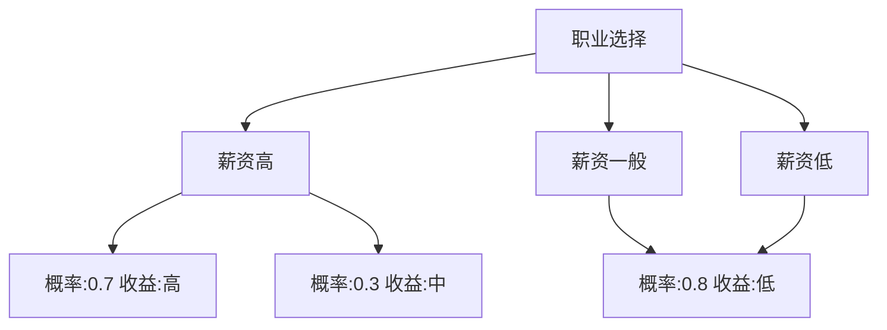
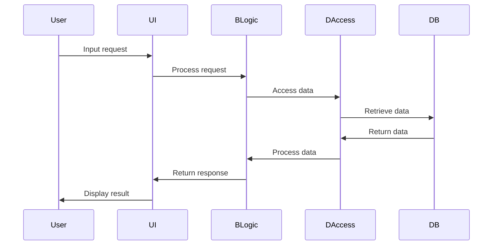
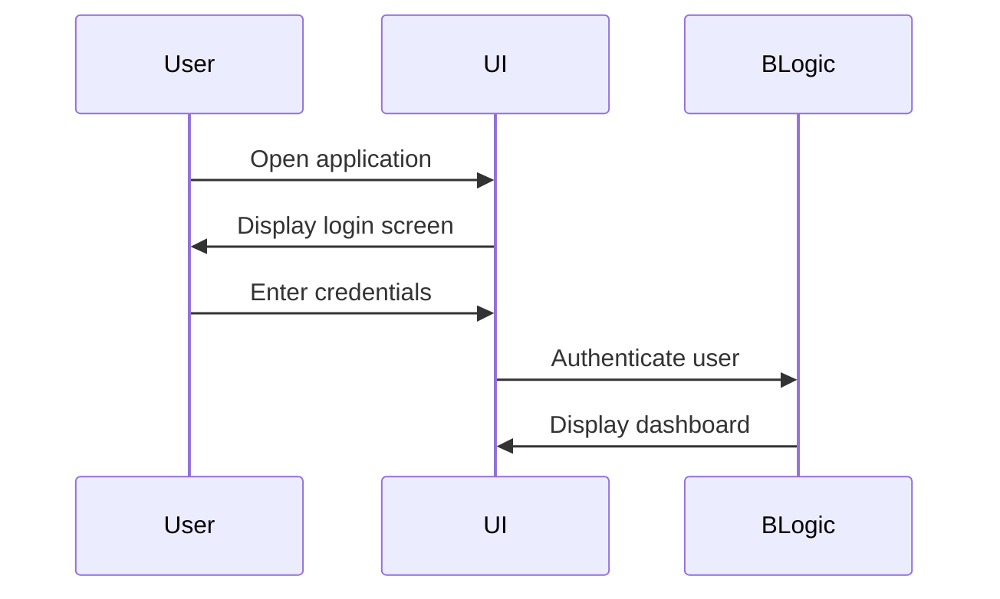

                 

### 引入

在现代社会，随着生活节奏的加快和信息爆炸，人们面临着越来越多的选择和不确定性。如何在纷繁复杂的环境中找到自己的方向，过上有意义的人生，成为了许多人思考的问题。这时，生命设计工作坊提供了一种系统化、结构化的方法来帮助我们规划和实现人生目标。

**生命设计**，顾名思义，是对人生的一种设计和规划。它不仅仅关注物质上的追求，更强调精神层面的成长和满足。通过设定明确的目标、深入自我认知、塑造核心价值观，并运用科学的工具和方法，我们可以更加清晰地规划自己的人生路径，实现个人价值的最大化。

本文旨在通过深入探讨生命设计工作坊的核心概念、原理和方法，帮助读者理解如何利用这一工具来规划有意义的人生蓝图。我们将分步骤地介绍生命设计的各个方面，从背景介绍、核心概念与联系，到算法原理讲解、数学模型和公式解析，再到系统分析与架构设计，以及实战案例和最佳实践，最终总结全文并推荐拓展阅读资源。

本文的关键词包括：“生命设计”、“目标设定”、“自我认知”、“价值观”、“人生规划”、“算法原理”和“数学模型”。

### 摘要

本文探讨了生命设计工作坊的基本概念、核心原理和方法，旨在帮助读者规划和实现有意义的人生。首先，我们介绍了生命设计的历史背景、现状及未来发展趋势。接着，详细阐述了生命设计中的关键概念，如目标设定、自我认知、价值观和人生规划，并通过表格和ER实体关系图展示了这些概念之间的关系。随后，我们引入了决策树、SWOT分析等工具和方法，以算法原理和数学模型的形式进行详细讲解。此外，通过系统分析与架构设计方案，我们展示了如何系统地进行人生规划。文章最后，通过实际案例和最佳实践，提供了具体的操作方法和注意事项，并总结了全文内容，推荐了拓展阅读资源。

### 背景介绍

**生命设计**这一概念并非空穴来风，而是源于对个体人生规划需求的深刻认识。随着人类社会的发展，个体主义逐渐崛起，人们开始更多地关注自我价值的实现和精神的满足。在这个背景下，如何更好地规划人生、实现个人目标，成为了一个亟待解决的问题。生命设计工作坊应运而生，它提供了一种系统化、结构化的方法来帮助人们理解自己，规划人生。

#### 历史发展

生命设计的思想可以追溯到古希腊哲学家苏格拉底的“认识自己”理念。在古代，人们通过哲学思考和宗教仪式来寻找生命的意义。然而，直到20世纪，随着心理学、管理学和社会学的不断发展，生命设计才逐渐成为一种科学的规划方法。

20世纪中叶，管理学家彼得·德鲁克（Peter Drucker）提出了目标管理（Management by Objectives, MBO）的概念，这被认为是生命设计的前身。德鲁克主张，通过设定明确的目标和计划，个人和组织可以更有效地实现自己的愿景。

随后，心理学家卡尔·罗杰斯（Carl Rogers）的人本主义心理学理论，以及维克托·弗兰克尔（Viktor Frankl）的意义疗法，进一步推动了生命设计的发展。这些理论强调个体的自我实现和内在动机，为生命设计提供了心理学的依据。

进入21世纪，随着信息技术的飞速发展，生命设计工作坊的形式和工具也变得更加多样化。例如，人工智能和大数据分析的应用，使得个体能够更准确地了解自己，更科学地设定目标。

#### 现状

目前，生命设计工作坊已经在全球范围内得到了广泛的推广和应用。无论是个人还是企业，都开始重视生命设计在提高效率和实现目标方面的作用。

在个人层面，越来越多的人通过参加生命设计工作坊，学会了如何设定明确的目标、进行自我认知，以及塑造核心价值观。这些工具和方法帮助他们更好地理解自己，找到人生的方向，实现个人成长。

在企业层面，生命设计被用于员工发展、团队建设和企业文化建设。通过生命设计，企业能够更好地了解员工的需求和潜力，从而制定更有效的培养和激励机制。

此外，生命设计工作坊也在教育领域得到了应用。许多学校和教育机构开始引入生命设计的理念，帮助学生更好地规划学业和职业道路。

#### 未来发展趋势

随着人工智能、大数据和虚拟现实等技术的发展，生命设计工作坊有望在未来得到进一步的发展和完善。以下是几个可能的发展趋势：

1. **个性化服务**：通过大数据分析，生命设计工作坊可以提供更加个性化的服务，帮助个体更准确地了解自己，设定更有针对性的目标。

2. **智能化工具**：人工智能的应用将使生命设计工作坊的工具更加智能化，例如，通过智能助手帮助用户进行自我认知、目标设定和规划。

3. **融合教育**：生命设计工作坊将与教育领域更加紧密地结合，帮助学生在学业和职业规划方面获得更多的指导和支持。

4. **跨学科研究**：生命设计工作坊将吸引更多的心理学家、管理学家、社会学家和教育学家的参与，形成跨学科的研究合作，推动生命设计理论的进一步发展。

总之，生命设计工作坊作为一种系统化、结构化的人生规划方法，已经在现代社会中发挥了重要的作用。随着技术的不断进步和理论研究的深入，它将在未来继续为人们的生命规划提供强有力的支持。

### 核心概念与联系

在生命设计工作坊中，有一些核心概念是至关重要的，它们共同构成了生命设计的理论基础和实践框架。这些核心概念包括目标设定、自我认知、价值观和人生规划。下面，我们将逐一介绍这些概念，并用表格和ER实体关系图来展示它们之间的关系。

#### 目标设定

目标设定是生命设计的起点。明确的目标能够为我们提供方向和动力，使我们在实现个人价值的过程中更加有的放矢。

**目标设定的SMART原则**

| SMART原则 | 解释 |
| :---: | :--- |
| **S**（Specific） | 具体的：目标应该是明确的，具体的，而非模糊的 |
| **M**（Measurable） | 可测量的：目标应该有具体的衡量标准，以便我们能够评估是否实现 |
| **A**（Achievable） | 可实现的：目标应该是通过努力可以实现的，而非不切实际的 |
| **R**（Relevant） | 相关的：目标应该与我们的长期愿景和价值观相符 |
| **T**（Time-bound） | 有时间限制的：目标应该设定一个明确的时间表，以便我们能够追踪进度 |

**目标设定的心理学原理**

目标设定不仅仅是一个技术过程，它还涉及到心理学的一些基本原理。例如：

1. **期望理论**：个体对目标的期望会影响他们的努力程度和最终结果。设定合理的目标，可以提高个体的期望水平，从而增强他们的动力。
2. **目标设置效应**：研究表明，设定明确的目标可以显著提高个体的绩效。这是因为明确的目标能够减少模糊性，从而减少决策成本和资源浪费。
3. **自我效能感**：个体对自己实现目标的能力的信念，被称为自我效能感。高自我效能感的个体更倾向于设定挑战性的目标，并付出更多的努力。

#### 自我认知

自我认知是理解自己的过程，它包括了解自己的能力、兴趣、性格和价值观。自我认知是生命设计的基石，只有真正了解自己，我们才能设定合理的目标，并找到适合自己的生活方式。

**自我认知的步骤**

1. **自我反思**：通过回顾过去的经历，思考自己在不同情境下的表现，了解自己的优点和不足。
2. **他人反馈**：通过询问他人的意见和建议，了解自己在他人眼中的形象，从而更全面地认识自己。
3. **专业评估**：通过心理测试和咨询，了解自己的性格特征、优势和潜在的发展方向。

**自我认知的方法**

1. **日记法**：通过记录日常生活中的经历和感受，反思自己的行为和思维方式。
2. **心理测试**：通过专业的心理测试工具，如MBTI、DISC等，了解自己的性格特征。
3. **咨询**：与心理咨询师或职业规划师进行交流，获取专业的意见和建议。

#### 价值观

价值观是指个体认为最重要的行为准则和原则。它决定了我们的行为选择和生活态度。了解和塑造正确的价值观，是生命设计的关键。

**价值观的构成**

1. **个人价值观**：包括对自由、安全、成就、权力等基本需求的排序。
2. **职业价值观**：与个人职业生涯相关，如工作环境、职业发展机会、薪酬等。
3. **社会价值观**：包括对家庭、社区、社会等外部环境的价值观。

**价值观的自我评估**

1. **反思法**：通过思考自己在不同情境下的行为选择，了解自己的价值观。
2. **问卷法**：通过专业的价值观评估问卷，了解自己在不同方面的价值观。
3. **交流法**：与他人讨论，获取他们对你的价值观的看法。

#### 人生规划

人生规划是将目标、自我认知和价值观相结合，制定出具体可行的行动方案。它不仅包括职业规划，还包括个人成长、家庭生活和社会贡献等多个方面。

**人生规划的步骤**

1. **设定目标**：根据自我认知和价值观，设定短期和长期目标。
2. **分析资源**：评估自身可用的资源，包括时间、金钱、人脉等。
3. **制定计划**：将目标转化为具体的行动计划，并设定时间表。
4. **执行与调整**：执行计划，并根据实际情况进行必要的调整。

**人生规划的工具与方法**

1. **决策树**：通过分析不同选择的后果，帮助个体做出最优决策。
2. **SWOT分析**：分析自身的优势、劣势、机会和威胁，帮助个体制定战略规划。
3. **时间管理**：通过有效的任务管理和时间分配，提高工作效率和生活质量。

#### 概念联系与ER实体关系图

为了更直观地展示这些核心概念之间的关系，我们可以使用ER实体关系图。以下是这些概念的ER图：

```mermaid
erDiagram
    目标设定 ||--o{ 自我认知 }|
    目标设定 ||--o{ 人生规划 }|
    自我认知 ||--o{ 价值观 }|
    价值观 ||--o{ 人生规划 }|
    SWOT分析 ||--o{ 人生规划 }|
    决策树 ||--o{ 人生规划 }|
```

在这个ER图中，`目标设定`和`自我认知`是核心概念，它们直接关联到`人生规划`。`价值观`则是连接`自我认知`和`人生规划`的桥梁。`SWOT分析`和`决策树`作为工具和方法，为`人生规划`提供了支持和指导。

通过这个ER图，我们可以清晰地看到各个核心概念之间的相互作用和影响。这种结构化的展示方式，有助于我们更好地理解和应用生命设计的理念。

### 生命设计的方法与工具

在生命设计的过程中，使用科学和系统的工具与方法可以大大提高我们的效率和效果。以下将介绍几种常用的工具，包括决策树和SWOT分析，并解释它们在生命设计中的应用。

#### 决策树

**决策树**是一种图形化工具，用于分析决策过程。它通过一系列的分支和节点，展示不同选择的后果和概率，帮助我们做出最优决策。在生命设计中，决策树可以帮助我们分析多个选择，确定最佳路径。

**决策树的基本原理**

1. **根节点**：决策树的起始点，表示初始状态。
2. **内部节点**：表示某个决策点，通常是一个问题或条件。
3. **分支**：从内部节点引出，表示不同的决策选项或条件。
4. **叶节点**：表示决策的最终结果，通常是概率和收益。

**决策树的应用实例**

假设我们面临一个职业选择的决策。首先，确定我们的根节点为“职业选择”。接下来，分析可能的影响因素，如“薪资水平”、“工作内容”和“职业发展空间”。这些因素将成为内部节点。每个节点下，我们列出不同的职业选择，如“软件开发”、“市场营销”和“金融分析”。这些职业选择将作为分支。最后，评估每个职业选择的概率和收益，得到叶节点。

以下是一个简化的决策树示例：



在这个示例中，我们通过决策树分析了不同职业选择的概率和收益。根据这些数据，我们可以做出更明智的决策。

#### SWOT分析

**SWOT分析**是一种战略规划工具，用于评估一个个体或组织的优势、劣势、机会和威胁。SWOT分析可以帮助我们在生命设计过程中，全面了解自己，并制定相应的策略。

**SWOT分析的定义**

- **优势（Strengths）**：我们具备的内在资源和能力，如技能、经验、人脉等。
- **劣势（Weaknesses）**：我们面临的外在限制和不足，如缺乏技能、资源有限等。
- **机会（Opportunities）**：外部环境中的有利条件和趋势，如市场需求、新技术等。
- **威胁（Threats）**：外部环境中可能对我们的不利影响，如竞争、政策变化等。

**SWOT分析在人生规划中的应用**

1. **优势与劣势分析**：通过评估自己的优势和劣势，我们可以找到自己的核心竞争力，并制定提升自身能力的策略。
2. **机会与威胁分析**：分析外部环境中的机会和威胁，可以帮助我们制定应对策略，抓住机会，规避风险。

**SWOT分析的步骤**

1. **确定评估对象**：明确要评估的个体或组织。
2. **收集信息**：收集与评估对象相关的内外部信息。
3. **分析优势与劣势**：根据收集的信息，列出优势和劣势。
4. **分析机会与威胁**：根据收集的信息，列出机会和威胁。
5. **制定策略**：根据SWOT分析的结果，制定相应的策略。

以下是一个简化的SWOT分析表：

| **SWOT分析** | **描述** |
| :---: | :--- |
| **优势** | 技术熟练，有丰富的项目经验 |
| **劣势** | 缺乏市场经验，资源有限 |
| **机会** | 市场需求增加，新技术带来新的机遇 |
| **威胁** | 竞争激烈，政策变化可能带来不确定性 |

通过SWOT分析，我们可以更清晰地了解自己，找到自己的优势，并制定相应的策略来提升自己。

#### 其他生命设计工具的介绍

除了决策树和SWOT分析，还有其他一些工具和方法可以用于生命设计，例如：

1. **平衡计分卡**：平衡计分卡是一种用于评估和改进组织绩效的管理工具。它从财务、客户、内部流程和学习与成长四个角度，综合评估组织的绩效。
2. **时间管理矩阵**：时间管理矩阵是一种帮助个体有效管理时间的工具。它将任务按照重要性和紧急性进行分类，帮助个体优先处理重要且紧急的任务。
3. **目标管理**：目标管理是一种通过设定明确的目标和计划，提高个人和组织绩效的方法。它强调目标的明确性、可测量性和实现的可能性。

通过这些工具和方法，我们可以更科学、更系统地规划自己的人生，实现个人价值。

### 数学模型与公式解析

在生命设计中，数学模型和公式发挥着至关重要的作用。它们不仅为我们的决策提供了科学依据，还能帮助我们更精确地量化目标，评估风险和收益。在这一部分，我们将介绍几种在生命设计中常用的数学模型和公式，包括概率论和统计学的基本概念。

#### 概率论在生命设计中的应用

**概率论**是研究随机事件及其概率的数学分支。在生命设计中，概率论可以帮助我们预测未来事件的可能性，从而做出更明智的决策。

**概率的基本概念**

1. **概率分布函数**：概率分布函数（Probability Distribution Function, PDF）描述了随机变量在不同取值下的概率分布。常用的概率分布函数包括正态分布、泊松分布和二项分布等。

   - **正态分布**：
     $$ f(x) = \frac{1}{\sqrt{2\pi\sigma^2}} e^{-\frac{(x-\mu)^2}{2\sigma^2}} $$
     其中，$\mu$ 是均值，$\sigma^2$ 是方差。
   
   - **泊松分布**：
     $$ P(X = k) = \frac{e^{-\lambda} \lambda^k}{k!} $$
     其中，$\lambda$ 是事件发生的平均次数。

   - **二项分布**：
     $$ P(X = k) = C(n, k) p^k (1-p)^{n-k} $$
     其中，$n$ 是试验次数，$p$ 是单次试验成功的概率。

**条件概率与贝叶斯公式**

条件概率是指在已知某个事件发生的前提下，另一个事件发生的概率。贝叶斯公式是条件概率的一种应用，用于计算后验概率。

- **条件概率**：
  $$ P(A|B) = \frac{P(A \cap B)}{P(B)} $$
  
- **贝叶斯公式**：
  $$ P(A|B) = \frac{P(B|A)P(A)}{P(B)} $$
  
贝叶斯公式可以帮助我们根据新的信息更新概率估计，从而做出更准确的预测。

#### 统计学在生命设计中的应用

**统计学**是研究数据收集、分析和解释的数学分支。在生命设计中，统计学可以帮助我们分析数据，评估风险和收益，制定科学的决策。

**统计分布函数**

统计分布函数（Cumulative Distribution Function, CDF）描述了随机变量小于或等于某个值的概率。

- **概率分布函数**：
  $$ F(x) = P(X \leq x) $$

**参数估计与假设检验**

参数估计是估计模型参数的过程。假设检验则是用于判断某个假设是否成立的统计方法。

- **参数估计**：
  - **点估计**：给出一个具体的参数值。
  - **区间估计**：给出一个包含真实参数值的区间。

- **假设检验**：
  - **零假设**（$H_0$）：一个待检验的假设。
  - **备择假设**（$H_1$）：与零假设对立的假设。
  - **检验统计量**：用于评估零假设的统计量。
  - **P值**：表示在零假设成立的情况下，观察到比检验统计量更极端结果的概率。

**假设检验的步骤**

1. **提出假设**：设定零假设和备择假设。
2. **选择检验统计量**：根据数据类型和假设，选择合适的检验统计量。
3. **计算P值**：通过计算检验统计量的分布，得到P值。
4. **做出决策**：如果P值小于设定的显著性水平（通常为0.05），则拒绝零假设，接受备择假设。

以下是一个简化的假设检验示例：

- **零假设**（$H_0$）：均值$\mu = 100$。
- **备择假设**（$H_1$）：均值$\mu \neq 100$。
- **检验统计量**：$t$统计量。
- **显著性水平**：0.05。

通过计算$t$统计量，我们得到P值为0.03。由于P值小于0.05，我们拒绝零假设，接受备择假设，认为均值不等于100。

#### 举例说明

为了更好地理解这些数学模型和公式的应用，我们通过一个实际案例进行说明。

**案例背景**：某公司计划推出一款新产品，需要进行市场调研。已知该产品的市场需求服从正态分布，均值为1000，标准差为200。公司希望了解，如果市场需求达到1500的概率大于0.5，那么他们是否应该扩大生产规模。

**步骤1：确定概率分布函数**  
市场需求服从正态分布，均值为1000，标准差为200。

$$ f(x) = \frac{1}{\sqrt{2\pi \times 200^2}} e^{-\frac{(x-1000)^2}{2 \times 200^2}} $$

**步骤2：计算条件概率**  
我们需要计算市场需求达到1500的概率，即：

$$ P(X \geq 1500) $$

**步骤3：应用贝叶斯公式**  
通过贝叶斯公式，我们可以计算市场需求达到1500的概率，并将其与0.5进行比较：

$$ P(X \geq 1500) = P(X \geq 1500 | \mu = 1000) P(\mu = 1000) $$

假设我们不知道具体的市场需求概率分布，但可以假设均值$\mu = 1000$，那么：

$$ P(X \geq 1500) = \frac{1}{\sqrt{2\pi \times 200^2}} e^{-\frac{(1500-1000)^2}{2 \times 200^2}} $$

计算后得到：

$$ P(X \geq 1500) \approx 0.3935 $$

由于这个概率小于0.5，所以公司不应该扩大生产规模。

通过这个案例，我们可以看到，数学模型和公式在生命设计中的实际应用。它们不仅帮助我们理解了问题，还提供了科学的决策依据。

### 系统分析与架构设计

在生命设计的实践过程中，系统分析与架构设计是确保规划有效实施的关键环节。通过系统分析与架构设计，我们可以将抽象的生命设计理念转化为具体的操作方案，确保每个步骤和决策都具有可行性和实际效果。以下我们将介绍系统分析与架构设计的基本概念，详细解释各个组成部分，并展示相关图示。

#### 系统分析与架构设计的基本概念

**系统分析**是识别系统需求、功能和约束的过程，旨在明确系统应该做什么，以及如何实现。它包括需求分析、功能分析、性能分析和约束分析等。

**架构设计**则是在系统分析的基础上，设计系统的整体结构和组成部分，确保系统能够高效、可靠地运行。架构设计通常包括领域模型设计、系统架构设计、接口设计和交互设计等。

#### 系统分析与架构设计的组成部分

1. **问题场景介绍**

系统分析与架构设计的第一步是明确问题场景。这包括描述当前存在的问题、目标用户的需求、以及系统需要解决的问题。例如，一个企业的生命设计系统可能需要解决以下问题：

- 员工职业发展路径不明确
- 个人目标与公司战略不一致
- 员工满意度和工作效率较低

2. **项目介绍**

在明确问题场景后，我们需要介绍项目的背景、目标、范围和关键里程碑。例如，我们的生命设计系统项目可能包括以下内容：

- 背景：企业面临员工职业发展不明确的问题
- 目标：设计并实现一个系统，帮助员工明确职业发展路径，提高工作效率和满意度
- 范围：系统涵盖员工自我评估、目标设定、职业规划等功能
- 关键里程碑：需求分析、系统设计、开发、测试和部署

3. **领域模型设计**

领域模型设计是系统分析与架构设计的重要环节，用于识别系统的核心实体和它们之间的关系。在生命设计系统中，领域模型可能包括以下实体：

- 用户：包括员工和管理人员
- 目标：包括个人目标、部门目标和公司目标
- 评估：包括自我评估和他人评估
- 规划：包括职业规划、学习计划和行动计划

领域模型通常使用类图（Class Diagram）表示。以下是一个简化的领域模型类图：

```mermaid
classDiagram
    User <<entity>>
    Target <<entity>>
    Evaluation <<entity>>
    Plan <<entity>>

    User --> Target : has
    User --> Evaluation : performs
    User --> Plan : follows
```

4. **系统架构设计**

系统架构设计定义系统的整体结构，包括组件、接口和通信机制。一个生命设计系统的架构设计可能包括以下组件：

- 用户界面：用于用户输入和显示结果
- 业务逻辑层：处理用户请求，实现业务逻辑
- 数据访问层：与数据库进行交互
- 数据库：存储用户数据、目标和评估结果

系统架构设计通常使用架构图（Architecture Diagram）表示。以下是一个简化的系统架构图：



5. **接口设计**

接口设计定义系统内部组件之间的交互方式。在生命设计系统中，接口设计可能包括：

- 用户接口：用于用户与系统交互的界面
- 服务接口：用于系统内部组件之间的通信
- 数据接口：用于系统与数据库的交互

接口设计通常使用序列图（Sequence Diagram）表示。以下是一个简化的用户接口设计序列图：



6. **交互设计**

交互设计定义用户与系统交互的流程和界面。在生命设计系统中，交互设计可能包括：

- 用户注册和登录流程
- 目标设定和更新流程
- 自我评估和他人评估流程
- 职业规划和行动计划流程

交互设计通常使用流程图（Flow Diagram）表示。以下是一个简化的目标设定和更新流程图：

```mermaid
flowDiagram
    start
    -->|Open application| UI
    -->|Display login screen| UI
    -->|Enter credentials| UI
    -->|Authenticate user| BLogic
    -->|Display dashboard| UI
    -->|Set new goal| UI
    -->|Save goal| DAccess
    -->|Update goal| UI
    end
```

#### 小结

通过系统分析与架构设计，我们可以确保生命设计系统能够高效、可靠地运行。系统分析与架构设计包括问题场景介绍、项目介绍、领域模型设计、系统架构设计、接口设计和交互设计等多个组成部分。通过这些设计步骤，我们可以将生命设计理念转化为具体的操作方案，帮助用户实现个人和职业目标。

### 实战案例与案例分析

为了更好地展示如何将生命设计的概念应用于实际生活中，下面我们将介绍一个具体的实战案例，并通过详细的分析和解读，帮助读者理解生命设计的实践过程和效果。

#### 案例背景

某大型跨国公司（以下简称“公司”）在快速发展的过程中，逐渐发现员工的职业发展路径不明确，个人目标与公司战略存在脱节，导致员工满意度和工作效率较低。为了解决这些问题，公司决定引入生命设计工作坊，帮助员工明确职业发展路径，提高个人和公司的整体绩效。

#### 案例目标

通过生命设计工作坊，公司设定了以下目标：

1. 帮助员工明确个人职业发展路径，提高职业满意度。
2. 提升员工的工作效率，确保个人目标与公司战略一致。
3. 建立一套系统化的职业发展体系，为员工提供明确的成长方向。

#### 案例分析

**步骤1：目标设定**

首先，公司邀请专业生命设计顾问为员工开展目标设定培训。培训内容包括SMART原则、目标设定的心理学原理等。通过培训，员工学会了如何设定具体、可测量、可实现、相关且有时间的个人目标。

**案例分析：**

- **具体（Specific）**：员工明确了自己的职业目标，如“在接下来的两年内晋升为项目经理”。
- **可测量（Measurable）**：员工设定了具体的衡量标准，如“完成至少三个重要项目，获得团队领导的好评”。
- **可实现（Achievable）**：员工确保目标是通过努力可以实现，而不是不切实际的。
- **相关（Relevant）**：目标与员工的职业规划和个人价值观相符。
- **有时间限制（Time-bound）**：员工为每个目标设定了明确的时间表，如“每季度评估一次进度”。

**步骤2：自我认知**

为了帮助员工更好地了解自己，公司通过心理测试和面对面咨询，引导员工进行自我认知。测试包括MBTI、DISC等工具，通过这些工具，员工可以了解自己的性格特征、优势和潜在的发展方向。

**案例分析：**

- **性格特征**：通过MBTI测试，员工了解到自己是外向、直觉型的人，擅长创新和策略思考。
- **优势**：通过咨询，员工认识到自己在团队协作、项目管理和领导能力方面的优势。
- **发展方向**：员工根据自己的性格特征和优势，制定了详细的个人发展计划。

**步骤3：价值观塑造**

公司通过内部培训和讨论，帮助员工塑造正确的价值观。培训内容包括公司文化、价值观的重要性、如何将价值观融入日常工作等。

**案例分析：**

- **公司文化**：员工了解到公司的核心价值观，如诚信、创新、团队合作等。
- **价值观融入工作**：员工学会了如何在实际工作中体现公司价值观，如诚信对待客户、创新解决问题、团队合作完成项目等。

**步骤4：人生规划**

在自我认知和价值观塑造的基础上，公司引导员工进行人生规划。通过生命设计工作坊，员工制定了详细的职业规划、学习计划和行动计划。

**案例分析：**

- **职业规划**：员工明确了职业发展的短期和长期目标，如“在五年内成为部门主管”。
- **学习计划**：员工制定了具体的学习计划，包括参加培训课程、阅读专业书籍等，以提高自身能力。
- **行动计划**：员工制定了具体的行动计划，如“每周至少完成一个重要项目的任务”，以确保目标实现。

**步骤5：执行与反馈**

公司为员工提供了持续的支持和反馈机制，通过定期检查和评估，确保员工按照规划执行，并在过程中进行调整。

**案例分析：**

- **定期检查**：公司每季度对员工的目标完成情况进行检查，及时发现问题和调整策略。
- **评估反馈**：公司提供详细的评估报告，为员工提供具体反馈，帮助他们更好地了解自己的表现。

#### 案例结果与反思

通过生命设计工作坊的实施，公司取得了显著的效果：

- **员工满意度**：员工对职业发展的满意度显著提高，离职率降低。
- **工作效率**：员工的工作效率显著提高，项目完成时间缩短，质量提升。
- **团队协作**：员工之间的团队合作更加默契，项目成功率提高。

**反思与建议：**

1. **持续支持**：公司应继续为员工提供支持和资源，帮助他们实现目标。
2. **个性化培训**：根据员工的个性特点和职业需求，提供个性化的培训和发展计划。
3. **定期评估**：定期对生命设计工作坊的效果进行评估，及时调整和优化。

通过这个实战案例，我们可以看到生命设计工作坊在提升员工职业发展、提高工作效率和增强团队协作方面的显著作用。这为其他企业和组织提供了宝贵的经验和借鉴。

### 最佳实践与技巧

在实施生命设计的过程中，掌握一些实用的技巧和注意事项，可以大大提高我们的效果和效率。以下是一些最佳实践和技巧，旨在帮助读者更好地实施生命设计。

#### 最佳实践

1. **定期反思与调整**：生命设计不是一次性的任务，而是一个持续的过程。我们应该定期反思自己的进展和目标，并根据实际情况进行调整。例如，每月或每季度进行一次反思，检查目标是否达成，是否有需要调整的地方。

2. **设定小目标**：将大目标分解为一系列小目标，可以让我们更容易实现。小目标不仅具有可测量性，还能给我们带来即时的成就感和动力。

3. **利用工具**：利用各种工具，如日程表、提醒应用和目标管理软件，可以帮助我们更好地规划和执行生命设计。这些工具可以帮助我们跟踪进度，提醒重要任务，确保不遗漏任何细节。

4. **寻求支持**：与他人分享你的目标和进展，寻求他们的建议和支持，可以增加你的动力和责任感。例如，与家人、朋友或同事讨论你的计划，或加入相关的社群和论坛，获取更多的反馈和建议。

5. **培养习惯**：将生命设计融入日常生活，培养良好的习惯，可以帮助我们更好地坚持和实现目标。例如，每天早晨花几分钟时间回顾和规划当天的任务，或每周花一些时间进行自我反思。

#### 注意事项

1. **避免完美主义**：在设定目标和进行规划时，避免过于追求完美。过于苛刻的目标可能导致压力过大，反而影响实现。设定合理的目标，确保它们既有挑战性，又是通过努力可以实现的。

2. **灵活调整**：在实施生命设计的过程中，我们可能会遇到各种意外和挑战。这时，要灵活调整计划，而不是 rigid 地坚持原计划。例如，如果某个目标因为外部因素无法实现，可以考虑调整目标或策略。

3. **保持动力**：在实现目标的过程中，保持动力和积极性是非常重要的。可以通过设定奖励机制，如完成某个任务后给自己一个小奖励，来保持动力。

4. **避免拖延**：拖延是实施生命设计的一大障碍。要避免拖延，可以通过设定明确的时间表和优先级，以及利用时间管理技巧，如番茄工作法等，来提高工作效率。

5. **平衡工作与生活**：在追求个人目标的同时，要注意平衡工作与生活。过度专注于工作，可能会忽视家庭和朋友，导致生活质量下降。合理安排时间，确保工作和生活之间的平衡。

通过遵循这些最佳实践和注意事项，我们可以更好地实施生命设计，实现个人和职业目标，过上更加有意义和充实的生活。

### 小结

本文通过对生命设计工作坊的深入探讨，从背景介绍、核心概念与联系，到算法原理讲解、数学模型和公式解析，再到系统分析与架构设计，以及实战案例和最佳实践，全面展示了生命设计的理论和方法。生命设计不仅仅是对目标进行设定，更是对自我认知、价值观塑造和人生规划的系统化过程。通过科学的方法和工具，我们可以更清晰地规划自己的人生，找到有意义的人生方向。

通过本文，我们了解到生命设计的重要性，掌握了如何利用决策树、SWOT分析等工具进行规划，并了解了概率论和统计学在生命设计中的应用。此外，通过实际案例的分析，我们看到了生命设计在工作中的应用效果。

然而，生命设计并不是一成不变的，它需要我们不断地反思、调整和优化。随着外部环境和内部需求的变化，我们的目标和计划也需要随之调整。因此，持续的反思和实践是生命设计成功的关键。

为了进一步学习和探索生命设计的深度和广度，我们推荐以下拓展阅读资源：

1. **《目标：人生的智慧》** - by 布赖恩·特雷西
2. **《智慧之书：自我认知与人生规划》** - by 约翰·马歇尔·罗伯逊
3. **《如何赢得朋友与影响他人》** - by 戴尔·卡耐基
4. **《SWOT分析：商业战略工具指南》** - by 马克·斯通
5. **《深度工作：如何有效利用每一点脑力》** - by 卡尔·纽波特

通过这些资源，读者可以进一步了解和掌握生命设计的理论和方法，为自己的生活规划提供更多的指导和灵感。希望本文能够为您的生命设计之旅提供有力的支持和启发。

