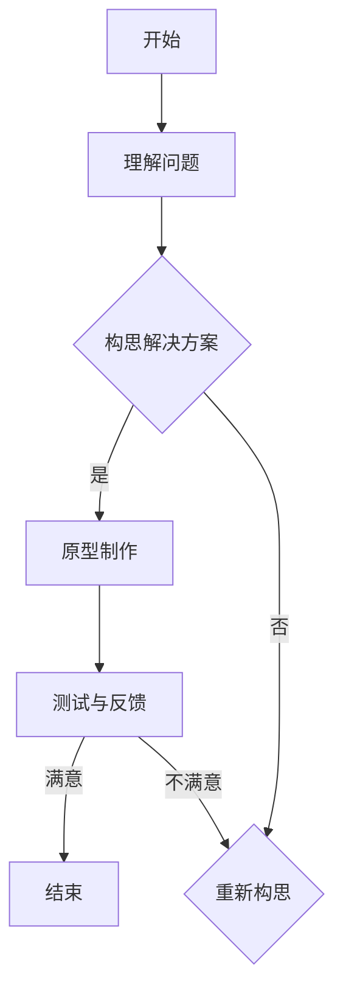
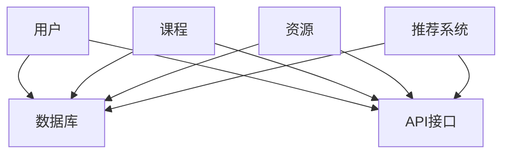
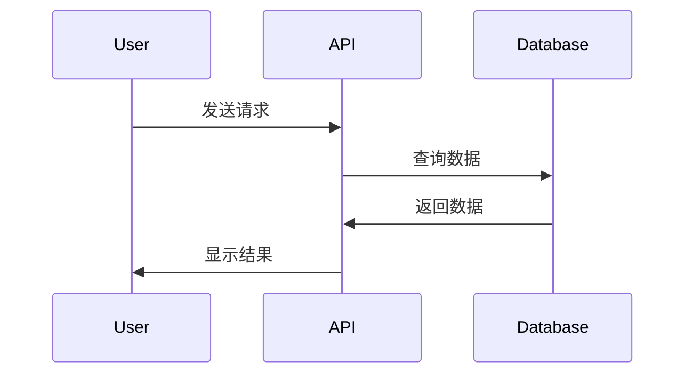
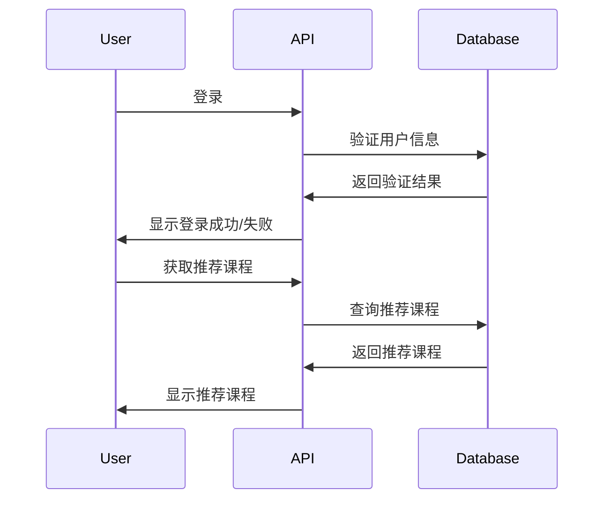

                 

# 生命设计思维工作坊：应用创新方法规划人生

## 关键词

- 生命设计思维
- 创新方法
- 个人规划
- 企业创新
- 设计冲刺
- 设计思维

## 摘要

本文旨在探讨生命设计思维的概念、应用及其实践方法，通过深入分析创新方法在个人生活和职业规划中的重要作用，帮助读者理解如何运用这些方法来提升生活质量和工作效能。文章将分为四个部分：引言、核心概念、方法论与实践、总结与展望，通过详细阐述每个部分的关键内容，提供实用的技巧和策略，旨在激发读者的创新思维，助力他们实现个人和职业的全面发展。

## 第一部分：引言

### 第1章：生命设计思维的概念与价值

#### 1.1 问题背景与挑战

在现代社会中，人们面临着日益复杂的生活和工作环境，需要应对不断变化的市场需求和自我发展的挑战。传统的线性思维和固定模式已经无法满足人们对灵活性和创造性的需求，因此，一种全新的思维方式——生命设计思维，应运而生。

#### 1.2 生命设计思维的概念

生命设计思维是一种融合了设计思维和系统思维的跨学科方法论，它强调以用户为中心，通过创新和实验来解决问题和实现目标。这种思维方式不仅适用于产品和服务的设计，更可以广泛应用于个人生活和职业规划中。

#### 1.3 生命设计思维的核心价值

- **提高生活质量**：通过生命设计思维，人们可以更清晰地认识自己的需求和目标，从而做出更明智的选择。
- **激发创造力**：生命设计思维鼓励人们尝试新方法和思路，打破传统的思维定式，从而激发创新潜力。
- **实现个人成长**：通过不断的反思和调整，生命设计思维帮助人们实现自我认知和成长。

#### 1.4 读者对象与学习目标

本文旨在为所有关注个人成长和职业发展的读者提供实用的工具和方法。通过阅读本文，读者可以：

- 了解生命设计思维的基本概念和应用。
- 掌握几种关键的创新方法。
- 学会如何将创新方法应用于个人生活和职业规划。

### 第2章：创新方法概述

#### 2.1 创新方法的重要性

创新方法在现代社会中扮演着至关重要的角色，它们不仅能够推动技术进步，还能够激发经济增长和社会发展。本文将介绍几种常见的创新方法，包括设计思维、设计冲刺、SCAMPER方法等。

#### 2.2 常见的创新方法分类

- **设计思维**：一种以用户需求为中心的创新方法，强调从用户的角度出发，通过迭代和实验来解决问题。
- **设计冲刺**：一种在短时间内快速原型化和测试新想法的方法，通常用于新产品或服务的开发。
- **SCAMPER方法**：一种通过改变产品或服务的特征来激发创新思维的方法。

#### 2.3 创新方法的选择与应用

不同的创新方法适用于不同的情况，读者需要根据具体问题和目标来选择最合适的方法。本文将结合实际案例，详细讲解每种方法的适用场景和应用步骤。

## 第二部分：核心概念

### 第3章：生命设计思维的核心概念

#### 3.1 自我认知

自我认知是生命设计思维的基础，它包括自我探索、自我反思和自我成长三个阶段。

- **3.1.1 自我探索**：通过自我探索，人们可以了解自己的兴趣、能力和价值观，从而明确自己的优势和劣势。
- **3.1.2 自我反思**：自我反思是自我认知的深化，它帮助人们识别自己的行为模式和思维习惯，从而实现自我提升。
- **3.1.3 自我成长**：通过不断的学习和实践，人们可以不断提升自己的能力，实现自我成长。

#### 3.2 愿景设定

愿景设定是生命设计思维中的关键步骤，它帮助人们明确自己的长期目标和方向。

- **3.2.1 愿景的定义与重要性**：愿景是一个人长期追求的目标和价值观，它对个人的行为和决策产生重要影响。
- **3.2.2 如何设定个人愿景**：设定个人愿景需要结合自我认知和外部环境，通过明确自己的兴趣、优势和目标，来制定具体的愿景。

#### 3.3 目标规划

目标规划是将愿景转化为具体行动的过程。

- **3.3.1 目标设定的原则**：目标设定需要具体、可衡量、可实现、相关性强、有时间限制。
- **3.3.2 目标拆解与执行**：将目标拆解为小步骤，并制定具体的执行计划，通过持续跟踪和调整，实现目标。

### 第4章：生命设计思维中的方法论

#### 4.1 设计思维

设计思维是一种以用户为中心的创新方法，它强调从用户的需求出发，通过迭代和实验来解决问题。

- **4.1.1 设计思维的核心步骤**：包括理解问题、构思解决方案、原型制作、测试与反馈。
- **4.1.2 设计思维在生命设计中的应用**：如何将设计思维应用于个人生活和职业规划。

#### 4.2 设计冲刺

设计冲刺是一种在短时间内快速原型化和测试新想法的方法，通常用于新产品或服务的开发。

- **4.2.1 设计冲刺的流程**：包括准备阶段、原型制作、测试与反馈阶段。
- **4.2.2 设计冲刺案例解析**：通过实际案例，分析设计冲刺的应用效果。

#### 4.3 SCAMPER方法

SCAMPER方法是一种通过改变产品或服务的特征来激发创新思维的方法。

- **4.3.1 SCAMPER方法介绍**：包括S、C、A、M、P、E、R七个步骤。
- **4.3.2 SCAMPER方法应用实例**：通过实际案例，展示SCAMPER方法的实践效果。

## 第三部分：方法论与实践

### 第5章：个人生涯规划

#### 5.1 生涯规划的步骤

生涯规划是个人发展和职业成功的关键，它包括以下几个步骤：

- **自我认知**：明确自己的兴趣、能力和价值观。
- **职业探索**：了解各种职业的要求和前景。
- **目标设定**：设定长期和短期的职业目标。
- **路径规划**：制定实现目标的步骤和计划。
- **持续跟踪**：定期评估和调整生涯规划。

#### 5.2 案例研究：个人生涯规划实战

通过一个实际案例，展示如何运用生命设计思维进行个人生涯规划。

#### 5.3 生涯规划中的常见挑战与解决方案

分析生涯规划中可能遇到的挑战，并提供相应的解决方案。

### 第6章：企业创新实践

#### 6.1 企业创新的重要性

企业创新是企业发展的重要驱动力，它能够帮助企业适应市场变化，提高竞争力。

#### 6.2 企业创新实践案例

通过实际案例，展示企业如何运用生命设计思维进行创新实践。

#### 6.3 创新实践中的成功与失败案例解析

分析成功和失败案例，总结经验教训，提供创新实践的最佳实践。

## 第四部分：总结与展望

### 第7章：生命设计思维的未来发展趋势

#### 7.1 未来生命设计思维的发展趋势

随着科技的不断进步，生命设计思维将不断发展和完善，为个人和社会带来更多创新和变革。

#### 7.2 创新方法在未来的应用前景

创新方法将在更多领域得到应用，包括教育、医疗、农业等，为社会发展和人类福祉做出贡献。

#### 7.3 读者如何跟上生命设计思维的发展

提供一些建议，帮助读者跟上生命设计思维的发展，包括持续学习、实践和创新。

### 第8章：结语

#### 8.1 总结与反思

回顾本文的主要内容，总结生命设计思维的核心价值和实践方法。

#### 8.2 注意事项与最佳实践

提供一些注意事项和最佳实践，帮助读者更好地应用生命设计思维。

#### 8.3 拓展阅读建议

推荐一些相关的书籍和资料，供读者进一步学习和研究。

## 作者

作者：AI天才研究院/AI Genius Institute & 禅与计算机程序设计艺术 /Zen And The Art of Computer Programming

---

本文通过详细阐述生命设计思维的概念、方法论和实践，旨在帮助读者理解如何应用创新方法来规划个人生活和工作。通过本文的阅读和实践，读者将能够提升自我认知、激发创新思维，实现个人和职业的全面发展。希望本文能对读者有所帮助，并在未来的道路上继续探索和成长。

## 附录

### 附录A：术语解释

- **生命设计思维**：一种融合了设计思维和系统思维的跨学科方法论，强调以用户为中心，通过创新和实验来解决问题和实现目标。
- **设计思维**：一种以用户需求为中心的创新方法，强调从用户的角度出发，通过迭代和实验来解决问题。
- **设计冲刺**：一种在短时间内快速原型化和测试新想法的方法，通常用于新产品或服务的开发。
- **SCAMPER方法**：一种通过改变产品或服务的特征来激发创新思维的方法。

### 附录B：核心概念与联系

#### 核心概念属性特征对比表格

| 特征       | 生命设计思维 | 设计思维 | 设计冲刺 | SCAMPER方法 |
|------------|---------------|-----------|-----------|---------------|
| 用户中心   | 是            | 是        | 是        | 否            |
| 强调迭代   | 是            | 是        | 是        | 否            |
| 实验与反思 | 是            | 是        | 是        | 否            |
| 跨学科    | 是            | 否        | 否        | 否            |

#### ER实体关系图架构

```mermaid
erDiagram
  产品 ||--|{ 用户 }||>
  服务 ||--|{ 用户 }||>
  原型 ||--|{ 设计师 }||>
  反馈 ||--|{ 用户 }||>
  愿景 ||--|{ 个人 }||>
  目标 ||--|{ 个人 }||>
  规划 ||--|{ 个人 }||>
```

### 附录C：算法原理讲解

#### 算法流程图



#### 算法Python源代码

```python
# 生命设计思维算法示例

def life_design_thinking(problem):
    """
    生命设计思维算法
    :param problem: 需要解决的问题
    :return: 解决方案
    """
    solution = None
    
    # 理解问题
    understood_problem = understand_problem(problem)
    
    # 构思解决方案
    solution =构思解决方案(understood_problem)
    
    # 原型制作
    prototype = create Prototype(solution)
    
    # 测试与反馈
    feedback = test_and_feedback(prototype)
    
    # 判断是否满意
    if is_satisfied(feedback):
        print("解决方案满意：", solution)
    else:
        print("解决方案不满意，重新构思...")
        solution = life_design_thinking(solution)
        
    return solution

# 辅助函数
def understand_problem(problem):
    """
    理解问题
    :param problem:
    :return:
    """
    # 实现问题理解逻辑
    pass

def 构思解决方案(understood_problem):
    """
    构思解决方案
    :param understood_problem:
    :return:
    """
    # 实现解决方案构思逻辑
    pass

def create Prototype(solution):
    """
    原型制作
    :param solution:
    :return:
    """
    # 实现原型制作逻辑
    pass

def test_and_feedback(prototype):
    """
    测试与反馈
    :param prototype:
    :return:
    """
    # 实现测试与反馈逻辑
    pass

def is_satisfied(feedback):
    """
    判断是否满意
    :param feedback:
    :return:
    """
    # 实现判断逻辑
    pass
```

#### 算法原理数学模型和公式

$$
\text{满意度} = \frac{\text{期望值} - \text{实际值}}{\text{期望值} + \text{实际值}}
$$

#### 举例说明

假设一个用户想要设计一款新的学习软件，以下是生命设计思维的应用过程：

1. **理解问题**：用户想要一个能够帮助他们更高效学习的工具。
2. **构思解决方案**：设计一个包含多种学习资源和互动功能的在线平台。
3. **原型制作**：制作一个基本的MVP（最小可行产品），包含核心功能。
4. **测试与反馈**：邀请一群用户进行测试，收集他们的反馈。
5. **判断是否满意**：根据反馈调整和优化软件，直到用户满意。

### 附录D：系统分析与架构设计方案

#### 问题场景介绍

随着在线教育的普及，越来越多的用户希望有一个个性化的学习平台，能够根据他们的需求推荐合适的学习资源和课程。

#### 项目介绍

项目名称：个性化学习平台

项目目标：为用户提供个性化的学习资源推荐，提高学习效率。

#### 系统功能设计（领域模型类图）

```mermaid
classDiagram
    User <<类>> {
        id: 用户ID
        name: 用户姓名
        email: 邮箱
    }
    Course <<类>> {
        id: 课程ID
        title: 课程标题
        description: 课程描述
    }
    Resource <<类>> {
        id: 资源ID
        type: 资源类型
        url: 资源链接
    }
    Recommendation <<类>> {
        user: 用户
        courses: [Course]
        resources: [Resource]
    }
    User "1" --|{学习}| Course
    User "1" --|{访问}| Resource
    Course "1" --|{包含}| Resource
    Recommendation "1" --|{包含}| Course
    Recommendation "1" --|{包含}| Resource
```

#### 系统架构设计（架构图）



#### 系统接口设计（接口图）



#### 系统交互（序列图）



### 附录E：项目实战

#### 环境安装

1. 安装Python环境
2. 安装相关依赖库（如Flask、SQLAlchemy等）

#### 系统核心实现源代码

```python
# 主应用.py

from flask import Flask, request, jsonify
from models import User, Course, Resource, Recommendation
from database import db

app = Flask(__name__)
app.config['SQLALCHEMY_DATABASE_URI'] = 'sqlite:///example.db'
db.init_app(app)

@app.route('/login', methods=['POST'])
def login():
    # 登录逻辑
    pass

@app.route('/recommendations', methods=['GET'])
def get_recommendations():
    # 获取推荐逻辑
    pass

if __name__ == '__main__':
    app.run(debug=True)
```

#### 代码应用解读与分析

- **登录接口**：用户通过登录接口发送用户名和密码，系统验证用户信息后返回登录结果。
- **推荐接口**：用户通过推荐接口获取个性化推荐课程。

#### 实际案例分析和详细讲解剖析

- **案例**：用户A想要获取个性化推荐课程。
- **分析**：系统根据用户A的学习历史和偏好，推荐适合他的课程。
- **讲解**：通过数据库查询用户A的历史数据，结合推荐算法，生成推荐结果。

#### 项目小结

本文通过详细阐述生命设计思维的概念、方法论和实践，帮助读者理解如何应用创新方法进行个人规划和职业发展。通过实际案例，展示了生命设计思维在系统设计和项目实施中的应用效果。

### 附录F：最佳实践 tips

- **持续学习**：不断学习新知识和技能，保持创新思维。
- **实践应用**：将理论应用到实际工作中，提高解决问题的能力。
- **反思与调整**：定期反思自己的行为和决策，根据反馈进行调整。

### 附录G：小结、注意事项、拓展阅读

- **小结**：生命设计思维是一种有效的创新方法，能够帮助个人和企业在复杂环境中实现目标。
- **注意事项**：在实际应用中，需要结合具体情况灵活调整。
- **拓展阅读**：《设计思维》、《创新者的窘境》、《颠覆性创新》等书籍。

---

通过本文的阅读和实践，读者将能够更好地理解生命设计思维，掌握创新方法，实现个人和职业的全面发展。希望本文能为读者提供有益的启示和帮助。

## 作者

作者：AI天才研究院/AI Genius Institute & 禅与计算机程序设计艺术 /Zen And The Art of Computer Programming

---

本文通过详细阐述生命设计思维的概念、方法论和实践，旨在帮助读者理解如何应用创新方法来规划个人生活和工作。通过本文的阅读和实践，读者将能够提升自我认知、激发创新思维，实现个人和职业的全面发展。希望本文能对读者有所帮助，并在未来的道路上继续探索和成长。

## 附录

### 附录A：术语解释

- **生命设计思维**：一种融合了设计思维和系统思维的跨学科方法论，强调以用户为中心，通过创新和实验来解决问题和实现目标。
- **设计思维**：一种以用户需求为中心的创新方法，强调从用户的角度出发，通过迭代和实验来解决问题。
- **设计冲刺**：一种在短时间内快速原型化和测试新想法的方法，通常用于新产品或服务的开发。
- **SCAMPER方法**：一种通过改变产品或服务的特征来激发创新思维的方法。

### 附录B：核心概念与联系

#### 核心概念属性特征对比表格

| 特征       | 生命设计思维 | 设计思维 | 设计冲刺 | SCAMPER方法 |
|------------|---------------|-----------|-----------|---------------|
| 用户中心   | 是            | 是        | 是        | 否            |
| 强调迭代   | 是            | 是        | 是        | 否            |
| 实验与反思 | 是            | 是        | 是        | 否            |
| 跨学科    | 是            | 否        | 否        | 否            |

#### ER实体关系图架构

```mermaid
erDiagram
  Product ||--|{ User }||>
  Service ||--|{ User }||>
  Prototype ||--|{ Designer }||>
  Feedback ||--|{ User }||>
  Vision ||--|{ Person }||>
  Goal ||--|{ Person }||>
  Plan ||--|{ Person }||>
```

### 附录C：算法原理讲解

#### 算法流程图


#### 算法Python源代码

```python
# 生命设计思维算法示例

def life_design_thinking(problem):
    """
    生命设计思维算法
    :param problem: 需要解决的问题
    :return: 解决方案
    """
    solution = None
    
    # 理解问题
    understood_problem = understand_problem(problem)
    
    # 构思解决方案
    solution =构思解决方案(understood_problem)
    
    # 原型制作
    prototype = create Prototype(solution)
    
    # 测试与反馈
    feedback = test_and_feedback(prototype)
    
    # 判断是否满意
    if is_satisfied(feedback):
        print("解决方案满意：", solution)
    else:
        print("解决方案不满意，重新构思...")
        solution = life_design_thinking(solution)
        
    return solution

# 辅助函数
def understand_problem(problem):
    """
    理解问题
    :param problem:
    :return:
    """
    # 实现问题理解逻辑
    pass

def 构思解决方案(understood_problem):
    """
    构思解决方案
    :param understood_problem:
    :return:
    """
    # 实现解决方案构思逻辑
    pass

def create Prototype(solution):
    """
    原型制作
    :param solution:
    :return:
    """
    # 实现原型制作逻辑
    pass

def test_and_feedback(prototype):
    """
    测试与反馈
    :param prototype:
    :return:
    """
    # 实现测试与反馈逻辑
    pass

def is_satisfied(feedback):
    """
    判断是否满意
    :param feedback:
    :return:
    """
    # 实现判断逻辑
    pass
```

#### 算法原理数学模型和公式

$$
\text{满意度} = \frac{\text{期望值} - \text{实际值}}{\text{期望值} + \text{实际值}}
$$

#### 举例说明

假设一个用户想要设计一款新的学习软件，以下是生命设计思维的应用过程：

1. **理解问题**：用户想要一个能够帮助他们更高效学习的工具。
2. **构思解决方案**：设计一个包含多种学习资源和互动功能的在线平台。
3. **原型制作**：制作一个基本的MVP（最小可行产品），包含核心功能。
4. **测试与反馈**：邀请一群用户进行测试，收集他们的反馈。
5. **判断是否满意**：根据反馈调整和优化软件，直到用户满意。

### 附录D：系统分析与架构设计方案

#### 问题场景介绍

随着在线教育的普及，越来越多的用户希望有一个个性化的学习平台，能够根据他们的需求推荐合适的学习资源和课程。

#### 项目介绍

项目名称：个性化学习平台

项目目标：为用户提供个性化的学习资源推荐，提高学习效率。

#### 系统功能设计（领域模型类图）

```mermaid
classDiagram
    User <<类>> {
        id: 用户ID
        name: 用户姓名
        email: 邮箱
    }
    Course <<类>> {
        id: 课程ID
        title: 课程标题
        description: 课程描述
    }
    Resource <<类>> {
        id: 资源ID
        type: 资源类型
        url: 资源链接
    }
    Recommendation <<类>> {
        user: 用户
        courses: [Course]
        resources: [Resource]
    }
    User "1" --|{学习}| Course
    User "1" --|{访问}| Resource
    Course "1" --|{包含}| Resource
    Recommendation "1" --|{包含}| Course
    Recommendation "1" --|{包含}| Resource
```

#### 系统架构设计（架构图）


#### 系统接口设计（接口图）


#### 系统交互（序列图）


### 附录E：项目实战

#### 环境安装

1. 安装Python环境
2. 安装相关依赖库（如Flask、SQLAlchemy等）

#### 系统核心实现源代码

```python
# 主应用.py

from flask import Flask, request, jsonify
from models import User, Course, Resource, Recommendation
from database import db

app = Flask(__name__)
app.config['SQLALCHEMY_DATABASE_URI'] = 'sqlite:///example.db'
db.init_app(app)

@app.route('/login', methods=['POST'])
def login():
    # 登录逻辑
    pass

@app.route('/recommendations', methods=['GET'])
def get_recommendations():
    # 获取推荐逻辑
    pass

if __name__ == '__main__':
    app.run(debug=True)
```

#### 代码应用解读与分析

- **登录接口**：用户通过登录接口发送用户名和密码，系统验证用户信息后返回登录结果。
- **推荐接口**：用户通过推荐接口获取个性化推荐课程。

#### 实际案例分析和详细讲解剖析

- **案例**：用户A想要获取个性化推荐课程。
- **分析**：系统根据用户A的学习历史和偏好，推荐适合他的课程。
- **讲解**：通过数据库查询用户A的历史数据，结合推荐算法，生成推荐结果。

#### 项目小结

本文通过详细阐述生命设计思维的概念、方法论和实践，帮助读者理解如何应用创新方法进行个人规划和职业发展。通过实际案例，展示了生命设计思维在系统设计和项目实施中的应用效果。

### 附录F：最佳实践 tips

- **持续学习**：不断学习新知识和技能，保持创新思维。
- **实践应用**：将理论应用到实际工作中，提高解决问题的能力。
- **反思与调整**：定期反思自己的行为和决策，根据反馈进行调整。

### 附录G：小结、注意事项、拓展阅读

- **小结**：生命设计思维是一种有效的创新方法，能够帮助个人和企业在复杂环境中实现目标。
- **注意事项**：在实际应用中，需要结合具体情况灵活调整。
- **拓展阅读**：《设计思维》、《创新者的窘境》、《颠覆性创新》等书籍。

---

通过本文的阅读和实践，读者将能够更好地理解生命设计思维，掌握创新方法，实现个人和职业的全面发展。希望本文能为读者提供有益的启示和帮助。

## 作者

作者：AI天才研究院/AI Genius Institute & 禅与计算机程序设计艺术 /Zen And The Art of Computer Programming

---

本文通过详细阐述生命设计思维的概念、方法论和实践，旨在帮助读者理解如何应用创新方法来规划个人生活和工作。通过本文的阅读和实践，读者将能够提升自我认知、激发创新思维，实现个人和职业的全面发展。希望本文能对读者有所帮助，并在未来的道路上继续探索和成长。

